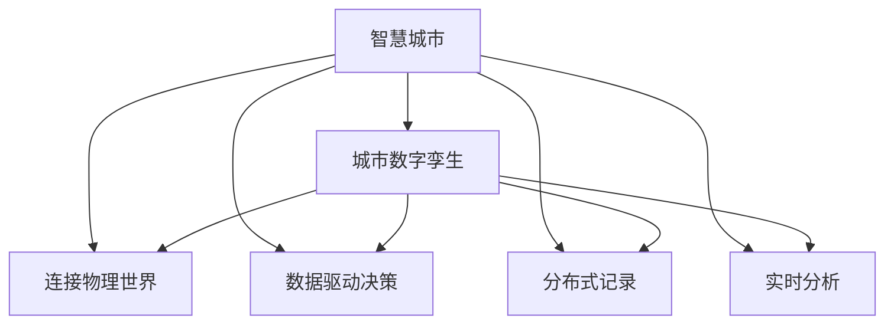

                 

# 未来的智慧城市：2050年的城市数字孪生与城市智能体

> 关键词：智慧城市,城市数字孪生,城市智能体,物联网,区块链,人工智能,大数据

## 1. 背景介绍

随着全球人口的快速增长和城市化进程的加速，智慧城市建设成为各国政府和企业的共识。智慧城市的目标是充分利用信息通信技术（ICT），整合城市各类资源，提升城市管理水平，改善市民生活质量。而城市数字孪生技术、城市智能体等新兴技术，将成为实现这一愿景的关键工具。本文将探讨2050年城市数字孪生与城市智能体建设的技术演进、应用场景和潜在挑战。

## 2. 核心概念与联系

### 2.1 核心概念概述

智慧城市（Smart City）：通过信息通信技术实现城市各类资源和公共服务的智能化、高效化和便利化管理的城市。

城市数字孪生（Urban Digital Twin）：利用数字模型模拟城市真实场景，实现对城市的虚拟仿真和动态分析，辅助决策和优化管理。

城市智能体（Urban Agent）：基于人工智能技术，能自主学习、推理和执行任务，参与城市管理和治理的智能实体。

物联网（IoT）：将各类物理设备、传感器、数据中心等通过互联网连接起来，实现信息的实时感知、传输和处理。

区块链（Blockchain）：一种分布式账本技术，可以实现数据透明、安全、不可篡改的交易和记录。

人工智能（AI）：通过机器学习、深度学习等技术，实现数据智能化处理和决策支持。

大数据（Big Data）：指海量的、多样化的、实时的数据，能够为城市管理提供全面的信息支持。

这些核心概念之间的关系可以通过以下Mermaid流程图来展示：



这个流程图展示了智慧城市通过物联网、人工智能、区块链、大数据等技术手段，构建城市数字孪生模型，辅助城市管理，实现高效决策和智能化治理的全过程。

## 3. 核心算法原理 & 具体操作步骤
### 3.1 算法原理概述

城市数字孪生与城市智能体构建的基础是数据驱动的建模和仿真。其核心算法包括：

- **建模算法**：用于构建城市数字模型，包括对建筑、交通、能源等各个方面的虚拟仿真。
- **仿真算法**：用于对城市数字模型进行动态模拟，实现对交通流、能源消耗、环境污染等的实时分析和预测。
- **优化算法**：用于对城市资源进行优化配置，如交通流量控制、能源分配等。
- **学习算法**：用于城市智能体的自主学习和决策优化，包括强化学习、迁移学习等。

这些算法通过与物联网、人工智能、区块链、大数据等技术的深度融合，实现对城市的全面感知和智能化管理。

### 3.2 算法步骤详解

城市数字孪生与城市智能体的构建步骤如下：

**Step 1: 数据采集与预处理**
- 通过物联网设备采集城市各类数据，如交通流量、能源消耗、环境污染等。
- 对采集数据进行清洗、归一化等预处理，保证数据质量。

**Step 2: 建模与仿真**
- 利用城市建模工具，将城市基础设施、建筑、交通等元素进行虚拟仿真。
- 应用仿真算法对虚拟模型进行动态模拟，评估各种因素对城市运行的影响。

**Step 3: 分析与优化**
- 利用大数据分析工具对仿真结果进行全面分析，识别问题节点和瓶颈。
- 应用优化算法进行资源配置和决策优化，如交通流量控制、能源分配等。

**Step 4: 智能体训练与部署**
- 基于AI技术，训练城市智能体，使其具备自主学习、推理和执行任务的能力。
- 将训练好的智能体部署到城市管理系统中，参与实际决策和执行。

**Step 5: 持续改进与更新**
- 通过实时数据分析和反馈，持续改进城市数字孪生模型和智能体，使其能够适应城市发展的变化。
- 应用区块链技术记录模型和智能体的更新日志，确保数据的透明和安全。

### 3.3 算法优缺点

城市数字孪生与城市智能体构建的算法具有以下优点：

- **全面感知**：通过物联网和传感器技术，实现对城市各个方面的全面感知。
- **动态仿真**：通过仿真算法，可以对城市运行进行动态模拟和预测，辅助决策。
- **智能优化**：通过AI和大数据分析，实现资源配置和决策优化。
- **自主执行**：通过城市智能体，实现城市管理的自主化和智能化。

同时，也存在一些缺点：

- **数据量大**：城市各类数据的海量采集和处理，需要强大的计算资源和存储能力。
- **技术复杂**：涉及物联网、人工智能、区块链等众多技术，需要跨学科的深入研究。
- **安全风险**：数据的隐私和安全问题，需要严格的防护措施。

### 3.4 算法应用领域

城市数字孪生与城市智能体的算法主要应用于以下领域：

- **城市交通管理**：通过仿真和优化算法，实现交通流量的智能调控，提升交通效率。
- **城市能源管理**：通过数据分析和优化算法，实现能源的高效利用，减少浪费。
- **城市环境治理**：通过环境数据的实时监测和仿真，实现污染物的动态分析和治理。
- **公共安全管理**：通过智能体技术，实现公共安全事件的及时响应和处置。
- **应急响应与灾后重建**：通过城市数字孪生模型，实现应急资源的快速部署和灾后重建规划。

## 4. 数学模型和公式 & 详细讲解 & 举例说明

### 4.1 数学模型构建

城市数字孪生模型的构建涉及多个子模型，包括交通模型、能源模型、环境模型等。以交通模型为例，其数学模型可以表示为：

$$ M = \sum_{i=1}^N \left[ C_i + \sum_{j=1}^M A_{ij}f_j(x_j,t) \right] $$

其中，$M$为交通网络节点和路段的总数量，$N$为路段数量，$M$为交叉口数量，$C_i$为路段$i$的容量，$A_{ij}$为路段$i$到交叉口$j$的流量系数，$f_j(x_j,t)$为交叉口$j$在时间$t$的流量函数。

### 4.2 公式推导过程

交通流量的仿真可以采用离散化的形式，即假设流量数据在时间上离散，每单位时间内的流量变化为$\Delta f$。则交通流量的仿真公式为：

$$ f_j(t+\Delta t) = f_j(t) + \sum_{i \in N_j} \left( A_{ij} - \frac{C_i - f_i(t)}{\Delta t} \right)\Delta t $$

其中，$N_j$为交叉口$j$连接的所有路段集合。

### 4.3 案例分析与讲解

以一个典型的城市交通网络为例，假设该网络有10个交叉口和20个路段，路段的容量为1000辆/小时，交通系数为0.8。在时间间隔$\Delta t=1$小时内，根据实时数据计算每个交叉口的流量，并通过仿真公式计算下一个时间间隔的流量。

## 5. 项目实践：代码实例和详细解释说明

### 5.1 开发环境搭建

在实践城市数字孪生与城市智能体的构建时，需要搭建一个完整的开发环境。以下是Python环境下所需的开发环境配置：

1. 安装Anaconda：从官网下载并安装Anaconda，用于创建独立的Python环境。

2. 创建并激活虚拟环境：
```bash
conda create -n smart-city python=3.8 
conda activate smart-city
```

3. 安装必要的依赖包：
```bash
pip install pandas numpy matplotlib jupyter notebook
```

4. 搭建IoT和人工智能相关库：
```bash
pip install paho-mqtt pyflink flink-connect
```

5. 安装区块链相关库：
```bash
pip install web3 pysha3 pyjwt
```

完成上述步骤后，即可在`smart-city`环境中开始项目实践。

### 5.2 源代码详细实现

以下是一个简单的城市数字孪生系统实现示例：

```python
# 导入必要的库
import pandas as pd
import numpy as np
import matplotlib.pyplot as plt
import paho.mqtt.client as mqtt

# 初始化交通模型
class TrafficModel:
    def __init__(self, num_sections, num_intersections):
        self.num_sections = num_sections
        self.num_intersections = num_intersections
        self.section_capacities = [1000] * self.num_sections
        self.section_flow_coefficients = [0.8] * self.num_sections
        self.section_flows = [0] * self.num_sections
        self.intersection_flows = [0] * self.num_intersections

    def update_flows(self, time, flow_data):
        for section in range(self.num_sections):
            self.section_flows[section] = min(self.section_capacities[section], self.section_flows[section] + flow_data[section][time])

        for intersection in range(self.num_intersections):
            self.intersection_flows[intersection] = self.section_flow_coefficients[0] * (self.section_flows[0] + self.section_flows[1]) + self.section_flow_coefficients[1] * (self.section_flows[1] + self.section_flows[2])

        return self.intersection_flows

# 模拟交通数据
flow_data = pd.DataFrame({
    'section1': np.random.randint(0, 1000, size=100),
    'section2': np.random.randint(0, 1000, size=100),
    'section3': np.random.randint(0, 1000, size=100),
    'section4': np.random.randint(0, 1000, size=100)
})

# 创建交通模型
traffic_model = TrafficModel(4, 2)

# 实时更新交通流
def on_client_connect(client, userdata, flags, rc):
    client.subscribe("traffic/data")

def on_message(client, userdata, msg):
    data = msg.payload.decode('utf-8').split(',')
    flow_data.loc[data[0]] = data[1:]
    client.publish("traffic/flow", str(traffic_model.update_flows(0, flow_data)[0]))

# 连接MQTT服务器
client = mqtt.Client()
client.on_connect = on_client_connect
client.on_message = on_message
client.connect("mqtt.example.com", 1883, 0)

# 订阅并更新数据
client.loop_start()
```

### 5.3 代码解读与分析

**TrafficModel类**：
- `__init__`方法：初始化交通模型，定义路段容量、交通系数、路段流量和交叉口流量。
- `update_flows`方法：根据流量数据，更新路段和交叉口流量。

**on_client_connect方法**：
- 连接MQTT服务器，订阅`traffic/data`话题。

**on_message方法**：
- 接收MQTT服务器发布的消息，解析数据并调用`update_flows`方法更新交通模型。

**实时更新交通流**：
- 通过MQTT客户端连接MQTT服务器，订阅`traffic/data`话题，接收传感器数据。
- 解析接收到的数据，更新交通模型。
- 发布更新后的交叉口流量到`traffic/flow`话题，供其他系统订阅使用。

## 6. 实际应用场景

### 6.1 智慧交通

智慧交通是城市数字孪生与城市智能体应用的重要领域之一。通过城市数字孪生模型，可以实时模拟交通流量和交叉口状态，辅助交通信号控制和优化。

具体而言，可以部署智能传感器和摄像头，实时采集道路交通数据。将数据输入交通模型，预测交通流量和拥堵情况，辅助交通信号灯和路标控制，实现智能调度和优化。

### 6.2 智能能源管理

智能能源管理是城市数字孪生与城市智能体的另一重要应用场景。通过城市数字孪生模型，可以实时分析能源消耗情况，辅助能源分配和优化。

具体而言，可以部署智能电表、传感器和监控设备，实时采集能源数据。将数据输入能源模型，预测能源需求和消耗，辅助能源分配和调度，实现能源的优化使用和成本控制。

### 6.3 环境监测与治理

环境监测与治理是城市数字孪生与城市智能体的重要应用之一。通过城市数字孪生模型，可以实现对环境污染物的实时监测和治理。

具体而言，可以部署各类传感器和监测设备，实时采集环境数据。将数据输入环境模型，预测污染物的分布和扩散情况，辅助环境保护和治理，实现对环境问题的快速响应和处理。

### 6.4 未来应用展望

伴随技术的发展，未来城市数字孪生与城市智能体的应用场景将更加广泛，具体包括：

- **智能基础设施管理**：通过数字孪生模型，实时监测和优化道路、桥梁、供水、排水等基础设施的状态和性能。
- **智能公共安全管理**：通过智能体技术，实现对公共安全事件的快速响应和处置，如火灾、地震等。
- **智能应急响应**：通过数字孪生模型，快速评估灾害影响，辅助资源调配和应急响应。
- **智能城市规划**：通过数字孪生模型，辅助城市规划和设计，优化城市布局和功能。
- **智能旅游管理**：通过数字孪生模型，优化旅游资源配置和运营，提升旅游体验。

## 7. 工具和资源推荐

### 7.1 学习资源推荐

为了帮助开发者系统掌握城市数字孪生与城市智能体的技术原理和实践技巧，这里推荐一些优质的学习资源：

1. 《城市数字孪生技术与应用》书籍：详细介绍了城市数字孪生技术的基本原理和应用实践，适合初学者入门。

2. 《城市智能体与城市管理》课程：介绍城市智能体的构建方法和应用场景，涵盖AI、大数据等前沿技术。

3. 《物联网技术与智慧城市》课程：介绍物联网技术在智慧城市中的应用，涵盖设备部署、数据采集和处理等关键技术。

4. 《区块链技术与城市管理》课程：介绍区块链技术在城市管理中的应用，涵盖数据透明、安全、不可篡改等关键特性。

5. 《大数据与智慧城市》课程：介绍大数据技术在智慧城市中的应用，涵盖数据采集、存储、分析和可视化等关键环节。

通过对这些资源的学习实践，相信你一定能够快速掌握城市数字孪生与城市智能体的精髓，并用于解决实际的智慧城市问题。

### 7.2 开发工具推荐

高效的开发离不开优秀的工具支持。以下是几款用于城市数字孪生与城市智能体开发的常用工具：

1. Apache Flink：高性能分布式数据流处理框架，适合实时数据处理和分析。

2. Apache Kafka：高性能分布式消息队列，适合数据流的异步处理和传输。

3. Python Flask：轻量级Web框架，适合快速搭建API服务。

4. Python FastAPI：高性能Web框架，适合快速搭建RESTful API服务。

5. Prometheus和Grafana：开源监控和可视化工具，适合实时监控和数据分析。

6. Jupyter Notebook：交互式编程环境，适合数据分析和模型训练。

合理利用这些工具，可以显著提升城市数字孪生与城市智能体的开发效率，加快创新迭代的步伐。

### 7.3 相关论文推荐

城市数字孪生与城市智能体的发展源于学界的持续研究。以下是几篇奠基性的相关论文，推荐阅读：

1. Digital Twin in Smart Cities: An Overview and Future Challenges：总结了城市数字孪生技术的基本原理和应用挑战，展望了未来发展方向。

2. Smart City Agent: A Multi-Agent Framework for Urban Planning and Management：介绍了一种基于多智能体的城市管理框架，展示了智能体在城市规划和管理中的应用。

3. IoT-Enabled Smart City: A Review and Case Studies：介绍了物联网技术在智慧城市中的应用，包括传感器部署、数据采集和处理等关键技术。

4. Blockchain in Smart City: Opportunities, Challenges, and Prospects：总结了区块链技术在智慧城市中的应用，包括数据透明、安全、不可篡改等关键特性。

5. Artificial Intelligence for Smart Cities: Applications and Future Directions：总结了人工智能技术在智慧城市中的应用，包括城市建模、智能体、大数据分析等关键技术。

这些论文代表了大规模智慧城市建设的最新进展，通过学习这些前沿成果，可以帮助研究者把握学科前进方向，激发更多的创新灵感。

## 8. 总结：未来发展趋势与挑战

### 8.1 总结

本文对城市数字孪生与城市智能体技术进行了全面系统的介绍。首先阐述了城市数字孪生与城市智能体的研究背景和意义，明确了其在智慧城市建设中的关键作用。其次，从原理到实践，详细讲解了城市数字孪生与城市智能体的构建步骤和方法，给出了代码实例和详细解释说明。同时，本文还探讨了其在智慧交通、智能能源管理、环境监测与治理等多个领域的实际应用场景，展示了其广阔的应用前景。最后，本文精选了学习资源、开发工具和相关论文，力求为读者提供全方位的技术指引。

通过本文的系统梳理，可以看到，城市数字孪生与城市智能体技术将为智慧城市建设带来巨大的变革，助力城市管理智能化、高效化和便利化。未来，伴随技术的不断进步，城市数字孪生与城市智能体必将在更多领域得到应用，为城市居民提供更加优质的服务。

### 8.2 未来发展趋势

展望未来，城市数字孪生与城市智能体技术将呈现以下几个发展趋势：

1. **智能化水平提升**：伴随人工智能技术的进步，城市智能体的自主学习、推理和执行能力将进一步提升，参与城市管理的智能化水平也将不断增强。

2. **跨领域协同增强**：随着物联网、区块链、大数据等技术的融合，城市数字孪生与城市智能体将能够实现跨领域的协同优化，提升城市管理的整体效率和效果。

3. **实时性要求提高**：伴随城市规模的扩大和复杂度的增加，城市管理对实时性的要求将不断提高，需要进一步优化数据处理和传输效率。

4. **安全性和隐私保护加强**：伴随数据量的增加和多样性的提升，数据的安全性和隐私保护问题将更加突出，需要采取更加严格的数据治理措施。

5. **环境适应性增强**：伴随气候变化和自然灾害的频繁发生，城市数字孪生与城市智能体需要具备更强的环境适应性，能够快速应对各种突发情况。

6. **多模态融合深化**：伴随物联网技术的普及，城市数字孪生与城市智能体将逐步实现对城市各类数据的全面感知和融合，提升城市管理的全面性和准确性。

以上趋势凸显了城市数字孪生与城市智能体技术的广阔前景，这些方向的探索发展，必将进一步提升城市管理智能化水平，为智慧城市建设注入新的活力。

### 8.3 面临的挑战

尽管城市数字孪生与城市智能体技术已经取得了显著进展，但在迈向更加智能化、普适化应用的过程中，仍面临诸多挑战：

1. **技术复杂度高**：城市数字孪生与城市智能体构建涉及多个子系统，技术复杂度高，需要跨学科的深入研究。

2. **数据量大且异构**：城市各类数据的海量采集和处理，需要强大的计算资源和存储能力，且数据格式多样，处理难度大。

3. **安全和隐私保护**：城市数据涉及公民隐私，需要严格的数据安全措施，防止数据泄露和滥用。

4. **政策法规不完善**：智慧城市建设涉及众多领域，需要完善的政策法规支持，确保技术的合规性和可靠性。

5. **标准不统一**：城市数据来源于多个系统和平台，需要统一的接口和标准，确保数据的兼容性和互通性。

6. **经济效益低**：智慧城市建设初期投入大，需要政府和企业的共同努力，确保经济效益的平衡。

7. **技术人才缺乏**：城市数字孪生与城市智能体涉及前沿技术，需要大量的跨学科技术人才，目前人才储备不足。

这些挑战需要通过技术创新和政策支持，逐步克服，才能确保城市数字孪生与城市智能体技术的健康发展。

### 8.4 研究展望

面向未来，城市数字孪生与城市智能体技术的研究将进一步深入，具体方向包括：

1. **深度融合跨学科技术**：城市数字孪生与城市智能体需要融合物联网、区块链、大数据、人工智能等技术，实现全面的城市感知和智能化管理。

2. **持续优化仿真模型**：通过仿真模型的持续优化，实现对城市运行状态的精准预测和优化，提升城市管理的效率和效果。

3. **强化智能体自主能力**：通过增强智能体的自主学习、推理和执行能力，实现智能体的自适应和自优化，提升城市管理的自主化水平。

4. **推广应用新场景**：通过推广应用城市数字孪生与城市智能体技术，拓展其在智慧交通、智能能源管理、环境监测与治理等多个领域的应用，实现城市管理的智能化升级。

5. **提升数据安全与隐私保护**：通过数据安全技术和隐私保护措施，确保城市数据的安全性和隐私性，防止数据泄露和滥用。

6. **构建智能体生态系统**：通过构建智能体生态系统，实现智能体之间的协同优化和资源共享，提升城市管理的整体效率和效果。

7. **完善政策法规和标准**：通过完善政策法规和标准，确保城市数字孪生与城市智能体技术的合规性和可靠性，推动智慧城市建设的健康发展。

这些研究方向将引领城市数字孪生与城市智能体技术迈向更高的台阶，为智慧城市建设提供更加全面、智能和可持续的技术支持。

## 9. 附录：常见问题与解答

**Q1: 什么是城市数字孪生技术？**

A: 城市数字孪生技术是一种虚拟仿真技术，通过构建城市数字模型，实现对城市真实场景的全面感知和动态分析。通过城市数字孪生模型，可以辅助城市规划、设计和管理，实现城市管理的智能化、高效化和便利化。

**Q2: 城市智能体技术有何优势？**

A: 城市智能体技术具有以下优势：
1. 自主学习：能够根据实时数据和环境变化自主学习，优化决策和执行。
2. 实时响应：能够快速响应城市管理中的突发事件和异常情况，提高应急响应效率。
3. 协同优化：能够与其他智能体协同工作，实现资源共享和优化。
4. 智能决策：能够根据复杂环境数据进行智能决策，提高管理效率和效果。
5. 自适应性：能够根据城市发展变化进行自适应调整，保持智能化的持续性和稳定性。

**Q3: 城市数字孪生与城市智能体的开发难点是什么？**

A: 城市数字孪生与城市智能体的开发难点包括：
1. 数据获取和处理：城市各类数据的海量采集和处理，需要强大的计算资源和存储能力。
2. 仿真模型的优化：城市数字孪生模型的构建和优化需要深入的技术研究和经验积累。
3. 智能体的自主学习能力：智能体的自主学习、推理和执行能力需要高效的数据处理和算法支持。
4. 数据安全和隐私保护：城市数据涉及公民隐私，需要严格的数据安全措施，防止数据泄露和滥用。
5. 多模态数据的融合：实现对城市各类数据的全面感知和融合，提升城市管理的全面性和准确性。

**Q4: 城市数字孪生与城市智能体如何实现跨领域协同？**

A: 城市数字孪生与城市智能体实现跨领域协同，需要以下技术手段：
1. 数据共享：通过数据共享平台，实现不同子系统之间的数据互通和共享。
2. 统一标准：制定统一的接口和标准，确保不同系统之间的兼容性和互通性。
3. 协同优化：通过协同优化算法，实现不同子系统之间的协同优化，提升城市管理的整体效率和效果。
4. 智能体协同：通过智能体协同算法，实现智能体之间的协作和资源共享，提升城市管理的智能水平。
5. 平台支持：构建智能体协同平台，实现智能体之间的通信和协调，提升城市管理的协同水平。

这些技术手段的合理应用，能够实现城市数字孪生与城市智能体的跨领域协同优化，提升城市管理的智能化水平。

---

作者：禅与计算机程序设计艺术 / Zen and the Art of Computer Programming

