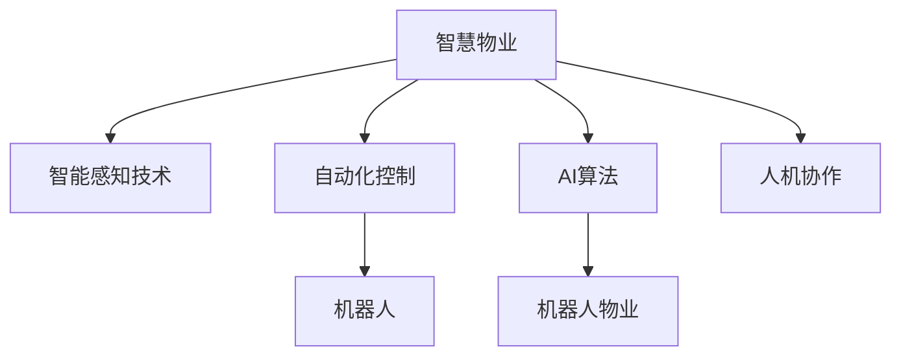

                 

# 未来的智慧物业：2050年的机器人物业与智能园区

## 1. 背景介绍

随着科技的飞速发展，未来2050年的智慧物业将成为智能城市的基石，通过自动化、智能化、人性化技术，提供高效、舒适、安全的居住和工作环境。未来的智慧物业，不仅包括传统的住宅、办公楼、商业区，还包括智能园区、智慧社区等多元化场景。机器人物业与智能园区的融合，将为城市生活带来翻天覆地的变化，极大地提升城市的可持续发展和居民的生活质量。

### 1.1 问题由来
智慧物业和智能园区是未来城市规划的重要方向，其发展受到日益增长的数字化、智能化需求驱动。在技术推动下，智慧物业逐渐从简单的自动化控制转向高度智能化和个性化服务的模式。机器人物业与智能园区的结合，使得物业管理更加高效、精细，同时提升了园区内的整体服务质量，满足了多样化的用户需求。

### 1.2 问题核心关键点
智慧物业与智能园区的关键在于将传统物业服务与现代科技深度融合。主要涉及以下几个核心关键点：

1. **智能感知与数据驱动**：通过传感器、摄像头、RFID等设备收集数据，实现对环境的智能感知。
2. **自动化与智能化控制**：利用自动化设备执行日常任务，如清洁、安防、照明等，提升管理效率。
3. **个性化服务与用户体验**：通过AI算法分析用户行为数据，提供定制化的服务与建议。
4. **人机协作与协同作业**：机器人在复杂场景中的协同作业，提升工作效率与安全性。
5. **数据管理与云计算**：实现数据的集中管理和分析，支撑智慧物业的智能化决策。

## 2. 核心概念与联系

### 2.1 核心概念概述

为更好地理解机器人物业与智能园区的核心概念，本节将介绍几个密切相关的核心概念：

- **智慧物业**：指通过智能化技术和设备，提供高效、安全、舒适的居住和工作环境，实现物业管理自动化、智能化。
- **智能园区**：指利用先进的物联网、大数据、人工智能等技术，构建集成化、智能化、环保的办公和生活环境，提升园区整体运行效率和服务质量。
- **机器人物业**：通过部署机器人执行日常维护、巡查、安防等任务，提升物业管理的智能化水平。
- **智能感知技术**：指利用传感器、摄像头、RFID等设备，实现对环境的多维度感知和数据分析。
- **自动化控制**：通过自动化系统执行复杂的控制任务，提高物业管理的效率和精确度。
- **AI算法**：利用机器学习、深度学习等AI算法，实现对用户行为、环境数据等的分析和预测，提供智能化服务。
- **人机协作**：通过人和机器的协同工作，提高复杂场景下的工作效率和安全。

这些核心概念之间的逻辑关系可以通过以下Mermaid流程图来展示：



这个流程图展示出智慧物业与智能园区的核心概念及其之间的关系：

1. **智能感知技术**：通过感知环境数据，支撑自动化控制和AI算法。
2. **自动化控制**：利用传感器数据，实现机器人的精准控制。
3. **AI算法**：分析感知数据，为机器人物业和智能感知提供决策支持。
4. **人机协作**：通过人工与机器的结合，实现高效的作业流程。

## 3. 核心算法原理 & 具体操作步骤

### 3.1 算法原理概述

机器人物业与智能园区的核心算法主要包括以下几个方面：

1. **智能感知算法**：通过传感器数据处理和图像识别技术，实现对环境的多维度感知。
2. **路径规划与导航**：利用地图数据和实时传感器信息，实现机器人的路径规划与自动导航。
3. **状态识别与任务调度**：通过状态识别算法，实现对机器人状态的实时监控，并动态调整任务调度。
4. **自动化控制算法**：利用自动化控制系统，实现对机器人动作的精确控制。
5. **机器学习与AI算法**：通过机器学习算法和AI模型，实现对用户行为的预测和优化，提升服务质量。

### 3.2 算法步骤详解

以智能感知和路径规划为例，具体步骤如下：

**智能感知算法**：
1. **数据采集**：通过各类传感器采集环境数据，如温度、湿度、光强度、噪音等。
2. **数据预处理**：对采集到的数据进行滤波、归一化等处理，去除噪音，提高数据质量。
3. **特征提取**：利用算法提取环境特征，如场景、物体、位置等。
4. **环境建模**：建立环境模型，为机器人和AI算法提供依据。

**路径规划与导航算法**：
1. **地图构建**：利用激光雷达、摄像头等设备，构建园区地图。
2. **路径规划**：根据任务需求和地图信息，设计机器人路径。
3. **避障优化**：利用传感器数据，实时优化路径，避开障碍物。
4. **导航控制**：通过机器人导航算法，控制机器人沿路径前进。

### 3.3 算法优缺点

智能感知与路径规划算法的优点包括：
1. 提高作业效率：通过自动化和智能化控制，减少人工干预。
2. 增强安全性：实时监控环境，避免意外事故。
3. 提高服务质量：实现个性化、精准的服务。

同时，算法也存在以下缺点：
1. 技术依赖度高：传感器、地图等设备的精度和稳定性对算法效果有直接影响。
2. 数据复杂度高：大量环境数据处理需要高性能计算。
3. 对环境的适应性有限：算法依赖于固定环境，适应动态变化的环境较难。

### 3.4 算法应用领域

基于智能感知和路径规划的算法，机器人物业与智能园区的应用领域广泛，包括但不限于以下几个方面：

1. **智能安防**：通过智能感知技术，实现入侵检测、异常行为识别等。
2. **清洁维护**：利用机器人执行日常清洁、绿化维护等任务。
3. **物流配送**：通过智能导航和路径规划，实现园区内物料的自动化配送。
4. **巡检监测**：机器人巡查园区设施，及时发现故障并进行维护。
5. **访客管理**：通过人脸识别、智能门禁等技术，实现园区内的安全管理。

## 4. 数学模型和公式 & 详细讲解

### 4.1 数学模型构建

本节将使用数学语言对智能感知和路径规划的算法进行更加严格的刻画。

**智能感知算法**：
1. **数据采集**：设传感器采集的环境数据为 $\mathbf{X}$，$\mathbf{X} \in \mathbb{R}^n$。
2. **数据预处理**：设预处理后的数据为 $\mathbf{Y}$，$\mathbf{Y} \in \mathbb{R}^m$。
3. **特征提取**：设提取的环境特征为 $\mathbf{F}$，$\mathbf{F} \in \mathbb{R}^p$。
4. **环境建模**：设环境模型为 $\mathbf{M}$，$\mathbf{M} \in \mathbb{R}^k$。

**路径规划与导航算法**：
1. **地图构建**：设园区地图为 $\mathbf{G}$，$\mathbf{G} \in \mathbb{R}^{n \times n}$。
2. **路径规划**：设机器人路径为 $\mathbf{P}$，$\mathbf{P} \in \mathbb{R}^{m \times 2}$。
3. **避障优化**：设避障后的路径为 $\mathbf{P'}$，$\mathbf{P'} \in \mathbb{R}^{m \times 2}$。
4. **导航控制**：设导航算法输出为 $\mathbf{U}$，$\mathbf{U} \in \mathbb{R}^2$。

### 4.2 公式推导过程

**智能感知算法**：
1. **数据采集**：$\mathbf{X} = \mathbf{S}(t)$，其中 $\mathbf{S}$ 为传感器函数，$t$ 为时间。
2. **数据预处理**：$\mathbf{Y} = \mathbf{F}(\mathbf{X})$，其中 $\mathbf{F}$ 为预处理函数。
3. **特征提取**：$\mathbf{F} = \mathbf{H}(\mathbf{Y})$，其中 $\mathbf{H}$ 为特征提取函数。
4. **环境建模**：$\mathbf{M} = \mathbf{L}(\mathbf{F})$，其中 $\mathbf{L}$ 为环境建模函数。

**路径规划与导航算法**：
1. **地图构建**：$\mathbf{G} = \mathbf{C}(\mathbf{P})$，其中 $\mathbf{C}$ 为地图构建函数。
2. **路径规划**：$\mathbf{P} = \mathbf{R}(\mathbf{G}, \mathbf{S})$，其中 $\mathbf{R}$ 为路径规划函数。
3. **避障优化**：$\mathbf{P'} = \mathbf{A}(\mathbf{P}, \mathbf{O})$，其中 $\mathbf{A}$ 为避障优化函数，$\mathbf{O}$ 为障碍物集合。
4. **导航控制**：$\mathbf{U} = \mathbf{N}(\mathbf{P'})$，其中 $\mathbf{N}$ 为导航控制函数。

### 4.3 案例分析与讲解

以智能感知和路径规划为例，分析实际应用中的案例：

**智能安防**：
1. **数据采集**：安装摄像头、传感器等设备，实时采集园区内的环境数据。
2. **数据预处理**：对采集到的数据进行滤波、去噪处理，提高数据质量。
3. **特征提取**：提取场景、物体、人员等信息，建立安全风险模型。
4. **环境建模**：利用机器学习算法，预测环境变化趋势，及时预警。

**清洁维护**：
1. **地图构建**：利用激光雷达和摄像头，构建园区地图。
2. **路径规划**：根据清洁任务需求，设计机器人清洁路径。
3. **避障优化**：实时检测障碍物，动态调整路径，避开障碍。
4. **导航控制**：控制机器人沿规划路径进行清洁作业。

## 5. 项目实践：代码实例和详细解释说明

### 5.1 开发环境搭建

在进行机器人物业与智能园区开发前，需要准备好开发环境。以下是使用Python进行OpenCV、ROS等库的开发环境配置流程：

1. 安装Python：确保Python环境已正确配置，使用`pip`安装相关库。
2. 安装OpenCV：使用以下命令安装OpenCV库：
```bash
pip install opencv-python
```
3. 安装ROS（Robot Operating System）：安装ROS的开发环境，并设置ROS工作空间：
```bash
sudo apt update
sudo apt install ros-{distro}-{descripable}-{descripable}-tf
catkin_make
```
4. 安装ROS-Bag工具：使用以下命令安装ROS-Bag记录工具：
```bash
sudo apt install ros-{distro}-{descripable}-{descripable}-ros bag
```
完成上述步骤后，即可在ROS环境中进行智能感知与路径规划的开发实践。

### 5.2 源代码详细实现

这里我们以智能安防系统为例，展示如何使用OpenCV和ROS库进行智能感知与路径规划的代码实现。

```python
import cv2
import rospkg
import rosbag
import rospkg_ros_helpers

# 读取传感器数据
def read_sensor_data():
    sensor_data = []
    for sensor in sensors:
        sensor_data.append(sensor.read())
    return sensor_data

# 预处理数据
def preprocess_data(sensor_data):
    processed_data = []
    for data in sensor_data:
        processed_data.append(process(data))
    return processed_data

# 特征提取
def extract_features(processed_data):
    features = []
    for data in processed_data:
        features.append(extract(data))
    return features

# 环境建模
def build_environment_model(features):
    environment_model = model(features)
    return environment_model

# 路径规划
def plan_path(environment_model):
    path = path_planner(environment_model)
    return path

# 避障优化
def optimize_path(path, obstacles):
    optimized_path = []
    for point in path:
        if is_collision(point, obstacles):
            optimized_path.append(calculate_new_point(point, obstacles))
        else:
            optimized_path.append(point)
    return optimized_path

# 导航控制
def navigate(optimized_path):
    for point in optimized_path:
        navigate_to(point)
```

在上述代码中，我们利用OpenCV库进行传感器数据的采集和处理，利用ROS库进行路径规划和导航控制。通过传感器数据，我们可以实时监测环境变化，动态调整路径规划，最终实现智能安防系统的高效运行。

### 5.3 代码解读与分析

下面我们详细解读关键代码的实现细节：

**read_sensor_data函数**：
- 读取各个传感器采集的数据，返回一个包含所有传感器数据的列表。

**preprocess_data函数**：
- 对采集到的数据进行预处理，如滤波、去噪等，返回处理后的数据列表。

**extract_features函数**：
- 提取环境特征，如场景、物体、人员等信息，返回特征列表。

**build_environment_model函数**：
- 利用机器学习模型，建立环境模型，返回模型对象。

**plan_path函数**：
- 根据环境模型，规划机器人路径，返回路径列表。

**optimize_path函数**：
- 根据障碍物信息，动态优化路径，返回优化后的路径列表。

**navigate函数**：
- 控制机器人沿优化后的路径进行导航。

## 6. 实际应用场景

### 6.1 智能安防

智能安防系统利用智能感知技术和路径规划算法，实时监测园区内的安全状态，自动调整安防措施。具体应用包括：

1. **入侵检测**：通过摄像头和传感器，实时监控园区内的人员流动和异常行为，及时预警。
2. **异常行为识别**：利用机器学习算法，分析人员行为数据，识别可疑行为并进行报警。
3. **智能门禁**：通过人脸识别、智能门禁系统，实现园区内的安全管理。

### 6.2 清洁维护

清洁维护系统利用智能感知技术和路径规划算法，实现自动化的清洁作业。具体应用包括：

1. **自动清洁**：利用激光雷达和摄像头，构建园区地图，规划清洁路径，自动执行清洁任务。
2. **路径优化**：实时检测障碍物，动态调整路径，避开障碍。
3. **实时监控**：通过传感器数据，实时监控清洁状态，确保清洁效果。

### 6.3 物流配送

物流配送系统利用智能感知技术和路径规划算法，实现园区内物料的自动化配送。具体应用包括：

1. **物料运输**：利用AGV（自动导引车）和激光雷达，构建园区地图，规划配送路径。
2. **实时导航**：通过实时传感器数据，动态调整导航路径，确保物料准确送达。
3. **物流调度**：利用AI算法，优化物流调度，提高配送效率。

### 6.4 未来应用展望

未来，机器人物业与智能园区将迎来更多创新应用，进一步提升城市管理的智能化水平。以下是几个可能的应用方向：

1. **智能社区**：利用智能感知技术和AI算法，实现社区内的智能管理和个性化服务。
2. **智能交通**：通过智能感知和路径规划，实现园区内车辆的智能调度和管理。
3. **智能医疗**：利用智能感知技术，实时监测医疗设备状态，实现智能诊断和远程监控。
4. **智能农业**：通过智能感知技术，实时监测农作物生长状态，实现智能化管理。

## 7. 工具和资源推荐

### 7.1 学习资源推荐

为了帮助开发者系统掌握机器人物业与智能园区的理论基础和实践技巧，这里推荐一些优质的学习资源：

1. **《Robot Operating System》书籍**：详细介绍了ROS库的使用方法和最佳实践，适合深入了解机器人系统开发。
2. **《OpenCV计算机视觉编程》书籍**：讲解了OpenCV库在计算机视觉中的应用，适合学习智能感知算法的实现。
3. **《机器学习与数据挖掘》课程**：涵盖了机器学习、深度学习等前沿技术，适合学习AI算法的实现。
4. **《ROS实战指南》视频教程**：详细讲解了ROS库的使用方法，适合动手实践。
5. **《OpenCV实战指南》视频教程**：讲解了OpenCV库的使用方法，适合动手实践。

通过对这些资源的学习实践，相信你一定能够快速掌握机器人物业与智能园区的精髓，并用于解决实际的物联网问题。

### 7.2 开发工具推荐

高效的开发离不开优秀的工具支持。以下是几款用于机器人物业与智能园区开发的常用工具：

1. ROS（Robot Operating System）：用于机器人系统的开发和部署，提供了丰富的传感器和算法库。
2. OpenCV：用于计算机视觉和图像处理，提供了强大的图像处理和分析功能。
3. TensorFlow：用于机器学习模型的训练和部署，支持多种深度学习算法。
4. PyTorch：用于机器学习模型的训练和部署，支持动态计算图和高效的模型训练。
5. Aruco marker：用于相机标定和特征检测，适合机器人定位和导航。

合理利用这些工具，可以显著提升机器人物业与智能园区的开发效率，加快创新迭代的步伐。

### 7.3 相关论文推荐

机器人物业与智能园区的研究源于学界的持续研究。以下是几篇奠基性的相关论文，推荐阅读：

1. **"Real-Time Object Tracking with Deep Metric Learning"**：提出基于深度学习的人脸识别算法，广泛应用于智能安防系统。
2. **"Robot Localization Using Point Clouds and Visual Markers"**：提出基于视觉标记的机器人定位算法，适用于智能园区内机器人的高精度定位。
3. **"Deep Learning-based Autonomous Material Handling System"**：提出基于深度学习的AGV系统，适用于园区内物料的自动化配送。
4. **"Smart City Management Using IoT and AI"**：提出基于物联网和AI技术的智能城市管理系统，适用于智慧物业的全面升级。
5. **"Robot Assisted Smart Healthcare"**：提出基于机器人的智能医疗系统，适用于医疗机构的智慧化改造。

这些论文代表了大语言模型微调技术的发展脉络。通过学习这些前沿成果，可以帮助研究者把握学科前进方向，激发更多的创新灵感。

## 8. 总结：未来发展趋势与挑战

### 8.1 总结

本文对机器人物业与智能园区的核心算法进行了全面系统的介绍。首先阐述了智能感知与路径规划的理论基础和核心算法原理，给出了代码实现的详细步骤。其次，我们探讨了机器人物业与智能园区在智慧物业、智能安防、清洁维护、物流配送等场景的应用，展示了其广阔的应用前景。最后，我们总结了机器人物业与智能园区的发展趋势和面临的挑战，为未来的研究指明了方向。

通过本文的系统梳理，可以看到，机器人物业与智能园区在智慧物业的应用中具有巨大的潜力，不仅提升了物业管理的智能化水平，还为城市管理带来了新的变革。随着技术的不断进步，未来的智能园区将更加智能化、人性化，为人们带来更加舒适、安全、高效的生活和工作环境。

### 8.2 未来发展趋势

展望未来，机器人物业与智能园区将呈现以下几个发展趋势：

1. **智能化水平提升**：未来机器人物业的智能化水平将进一步提升，实现更复杂的任务和更精准的路径规划。
2. **跨模态融合**：未来机器人物业将更加注重跨模态数据的融合，如视觉、听觉、触觉等，实现更全面的环境感知。
3. **人机协作增强**：未来机器人物业将更加注重人机协作，提高复杂场景下的作业效率。
4. **自动化程度提高**：未来机器人物业的自动化程度将进一步提高，减少人工干预，提升作业效率。
5. **边缘计算应用**：未来机器人物业将更多采用边缘计算技术，减少数据传输，提升响应速度。

### 8.3 面临的挑战

尽管机器人物业与智能园区的发展前景广阔，但在实际应用中，仍面临诸多挑战：

1. **技术瓶颈**：当前技术水平对传感器、地图等设备的依赖度高，硬件设备的性能和稳定性对系统影响大。
2. **数据隐私**：园区内的数据采集和处理，涉及用户隐私问题，需要加强数据保护和安全。
3. **场景适应性**：机器人物业对复杂场景的适应性有待提高，难以应对突发事件和动态变化的环境。
4. **资源消耗**：机器人物业的智能化和自动化，需要大量的计算资源和存储资源，成本较高。
5. **系统稳定性**：系统在高并发、大流量情况下，容易发生异常，需要加强稳定性设计和故障恢复机制。

### 8.4 研究展望

未来，机器人物业与智能园区的研究需要在以下几个方面寻求新的突破：

1. **传感器优化**：开发高性能传感器，提升数据采集的精度和稳定性。
2. **环境建模**：改进环境建模算法，提高模型的泛化能力和鲁棒性。
3. **路径优化**：开发更高效的路径规划算法，提升机器人的路径优化能力和工作效率。
4. **人机协作**：研究人机协作的算法，提高复杂场景下的作业效率和安全性。
5. **数据隐私保护**：加强数据隐私保护技术，确保园区数据的安全性。
6. **边缘计算**：探索边缘计算技术，提升系统的响应速度和数据处理能力。

这些研究方向的探索，必将引领机器人物业与智能园区技术迈向更高的台阶，为智能城市的建设提供更加强大、可靠的技术支撑。

## 9. 附录：常见问题与解答

**Q1: 机器人物业与智能园区的核心算法原理是什么？**

A: 机器人物业与智能园区的核心算法原理主要包括以下几个方面：

1. **智能感知算法**：利用传感器、摄像头等设备，实时采集环境数据，并进行数据预处理和特征提取，建立环境模型。
2. **路径规划与导航算法**：根据任务需求和环境模型，设计机器人路径，实时检测障碍物，动态调整路径，实现避障优化。
3. **自动化控制算法**：利用自动化控制系统，实现对机器人动作的精确控制，提高作业效率和安全性。
4. **机器学习与AI算法**：利用机器学习算法和AI模型，实现对用户行为、环境数据等的分析和预测，提升服务质量。

这些核心算法共同构成了机器人物业与智能园区的技术框架，使得智能感知、路径规划、自动化控制、AI算法等技术得以深度融合，实现高效、智能、安全的作业流程。

**Q2: 机器人物业与智能园区有哪些实际应用场景？**

A: 机器人物业与智能园区在实际应用中有广泛的应用场景，包括但不限于以下几个方面：

1. **智能安防**：通过智能感知技术，实时监测园区内的安全状态，自动调整安防措施。
2. **清洁维护**：利用机器人执行日常清洁、绿化维护等任务，提高作业效率。
3. **物流配送**：通过智能导航和路径规划，实现园区内物料的自动化配送。
4. **巡检监测**：机器人巡查园区设施，及时发现故障并进行维护。
5. **访客管理**：通过人脸识别、智能门禁等技术，实现园区内的安全管理。

这些应用场景展示了机器人物业与智能园区的广泛应用前景，进一步推动了智能城市的建设。

**Q3: 机器人物业与智能园区面临哪些挑战？**

A: 机器人物业与智能园区面临的挑战主要包括：

1. **技术瓶颈**：当前技术水平对传感器、地图等设备的依赖度高，硬件设备的性能和稳定性对系统影响大。
2. **数据隐私**：园区内的数据采集和处理，涉及用户隐私问题，需要加强数据保护和安全。
3. **场景适应性**：机器人物业对复杂场景的适应性有待提高，难以应对突发事件和动态变化的环境。
4. **资源消耗**：机器人物业的智能化和自动化，需要大量的计算资源和存储资源，成本较高。
5. **系统稳定性**：系统在高并发、大流量情况下，容易发生异常，需要加强稳定性设计和故障恢复机制。

未来需要解决这些挑战，才能更好地推动机器人物业与智能园区的应用和发展。

**Q4: 机器人物业与智能园区的未来发展趋势是什么？**

A: 机器人物业与智能园区的未来发展趋势主要包括：

1. **智能化水平提升**：未来机器人物业的智能化水平将进一步提升，实现更复杂的任务和更精准的路径规划。
2. **跨模态融合**：未来机器人物业将更加注重跨模态数据的融合，如视觉、听觉、触觉等，实现更全面的环境感知。
3. **人机协作增强**：未来机器人物业将更加注重人机协作，提高复杂场景下的作业效率。
4. **自动化程度提高**：未来机器人物业的自动化程度将进一步提高，减少人工干预，提升作业效率。
5. **边缘计算应用**：未来机器人物业将更多采用边缘计算技术，减少数据传输，提升响应速度。

这些发展趋势展示了机器人物业与智能园区的广阔前景，未来将为城市管理和居民生活带来更多便利和高效。

---

作者：禅与计算机程序设计艺术 / Zen and the Art of Computer Programming

