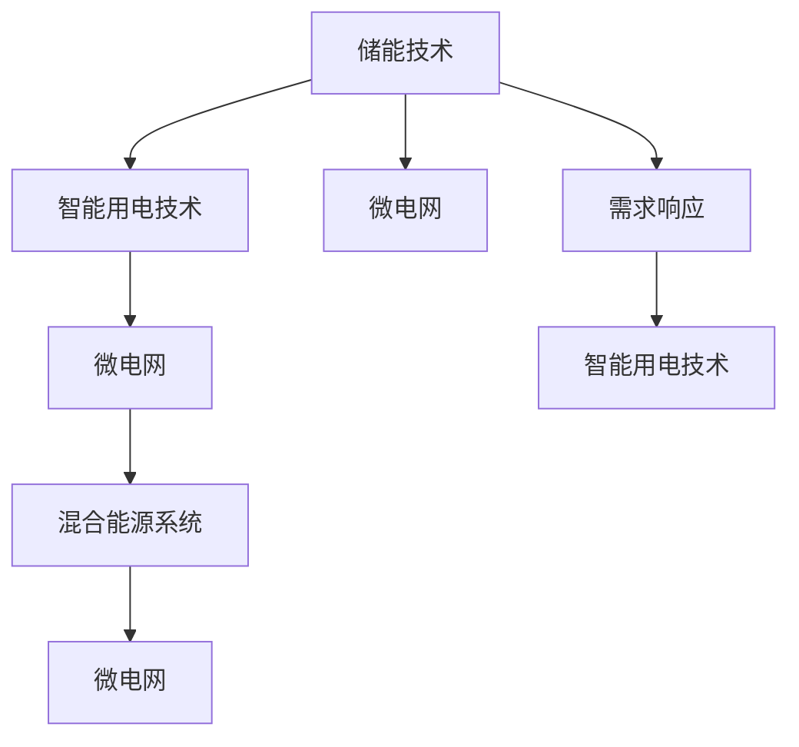

                 

# 未来的智慧能源：2050年的储能技术与智能用电

## 1. 背景介绍

随着人类社会对能源需求的不断增加和环境保护意识的不断提升，全球能源系统正在经历一场深刻的变革。2050年的智慧能源将是一个以绿色、智能、高效为特征的新型能源体系，其中储能技术和智能用电技术将是核心驱动力。本文将详细探讨未来的储能技术与智能用电的发展趋势、核心技术原理以及实际应用场景，以期为能源领域的可持续发展提供技术指引。

## 2. 核心概念与联系

### 2.1 核心概念概述

为了更好地理解未来智慧能源中的储能技术和智能用电技术，本节将介绍几个关键概念：

- **储能技术（Energy Storage Technology）**：是指将能量以某种方式存储起来，以便在需要时释放的技术。储能技术是智慧能源系统的重要组成部分，能够有效提高能源系统的稳定性和灵活性。

- **智能用电技术（Smart Electricity Use Technology）**：是指通过智能电网、分布式能源、需求响应等技术手段，实现电力资源的优化配置和高效利用。智能用电技术是智慧能源的关键应用领域，能够显著提升能源利用效率和用户满意度。

- **混合能源系统（Hybrid Energy System）**：是指将多种能源（如太阳能、风能、水能、核能等）通过智能协调，形成互补和协同的能源系统。混合能源系统是实现绿色、可持续能源供应的重要途径。

- **微电网（Microgrid）**：是指在局部范围内，通过智能控制技术将分布式发电和负荷结合起来的小型独立电网。微电网是实现分布式能源和智能用电的关键载体。

- **需求响应（Demand Response）**：是指通过价格激励、智能算法等手段，引导用户主动调整用电行为，优化电力系统负荷曲线的技术。需求响应是智能用电的核心手段之一，能够有效减轻电网压力，提升能源利用效率。

这些概念之间的逻辑关系可以通过以下Mermaid流程图来展示：



这个流程图展示了一系列技术概念之间的关系：

1. 储能技术是智能用电技术的基础，通过电池、抽水蓄能等方式，实现能量的有效存储和释放。
2. 智能用电技术通过微电网、混合能源系统等手段，实现能源的分布式和协同利用。
3. 需求响应技术引导用户主动调整用电行为，优化负荷曲线。
4. 微电网是实现分布式能源和智能用电的核心载体，能够实现局部能源的自给自足和优化配置。
5. 混合能源系统将多种能源整合，形成绿色、可持续的能源供应体系。

这些核心概念共同构成了未来智慧能源系统的技术框架，其协同作用将为实现绿色、高效、智能的能源利用奠定坚实基础。

## 3. 核心算法原理 & 具体操作步骤

### 3.1 算法原理概述

未来的储能技术与智能用电技术涉及的算法原理非常复杂，涵盖电力系统优化、能源管理、需求响应等多个领域。其核心原理包括：

- **优化算法（Optimization Algorithms）**：用于求解能源系统中的最优配置，包括线性规划、非线性规划、整数规划等。优化算法在智能用电和储能技术中广泛应用，能够有效提升能源利用效率和系统稳定性。

- **模拟算法（Simulation Algorithms）**：用于预测能源系统的运行状态，包括蒙特卡罗模拟、事件树分析等。模拟算法在储能技术中用于评估不同场景下的性能表现，在智能用电技术中用于模拟电力市场的运行情况。

- **控制算法（Control Algorithms）**：用于实现能源系统的实时控制，包括PID控制、模型预测控制等。控制算法在储能技术中用于实现电池充放电管理，在智能用电技术中用于实现负荷优化和需求响应。

这些算法原理通过多种技术手段实现，包括大数据、人工智能、物联网等。通过优化算法、模拟算法和控制算法的协同作用，未来智慧能源系统将能够实现高效、稳定、智能的能源供应和利用。

### 3.2 算法步骤详解

未来智慧能源的储能技术和智能用电技术的应用流程可以分为以下几个关键步骤：

1. **数据收集与预处理**：
   - 收集能源系统的运行数据，包括发电、输电、用电等数据。
   - 对数据进行清洗和预处理，确保数据的质量和一致性。

2. **模型建立与训练**：
   - 根据能源系统的特点和需求，建立数学模型和算法框架。
   - 使用历史数据对模型进行训练，优化模型参数，提升模型性能。

3. **系统部署与优化**：
   - 将训练好的模型部署到实际能源系统中，进行实证验证。
   - 通过不断的调整和优化，提升系统的稳定性和效率。

4. **用户交互与反馈**：
   - 与用户进行交互，获取用户用电行为数据。
   - 根据用户反馈和实际需求，调整系统策略和参数，实现个性化服务。

5. **系统监控与维护**：
   - 实时监控能源系统的运行状态，及时发现和处理异常情况。
   - 定期维护系统设备，确保系统长期稳定运行。

### 3.3 算法优缺点

未来智慧能源的储能技术和智能用电技术具有以下优点：

- **高效能源利用**：通过优化算法和智能控制，实现能源的高效利用，提升能源利用效率。
- **系统稳定性**：通过储能技术，实现能源系统的稳定性，提升系统可靠性和鲁棒性。
- **用户满意度提升**：通过智能用电技术，实现个性化和精细化的能源服务，提升用户满意度。

同时，这些技术也存在一些缺点：

- **初始投资高**：优化算法和智能控制系统的实现需要较高的初始投资。
- **技术复杂度高**：涉及的算法原理复杂，技术实现难度大。
- **数据依赖性强**：需要大量高质量的能源系统运行数据，数据获取和处理成本较高。

尽管存在这些局限性，但未来智慧能源技术的发展前景广阔，其高效、稳定、智能的特性将成为能源领域的重要发展方向。

### 3.4 算法应用领域

未来智慧能源的储能技术和智能用电技术广泛应用于以下几个领域：

1. **智能电网**：通过智能控制和需求响应技术，实现电网的优化配置和高效利用。智能电网是未来智慧能源的核心载体，能够实现能源的高效传输和分配。

2. **分布式能源**：通过分布式发电技术（如太阳能、风能等），实现能源的分布式供应和利用。分布式能源是实现绿色、可持续能源供应的重要途径。

3. **能源管理与优化**：通过能源管理系统，实现能源的全面监控和优化配置。能源管理系统能够提升能源利用效率，降低能源成本。

4. **智能家居与建筑**：通过智能家居和建筑技术，实现能源的高效管理和利用。智能家居和建筑技术能够提升能源利用效率，降低能源浪费。

5. **储能系统**：通过储能技术，实现能量的有效存储和释放。储能系统是未来智慧能源的重要组成部分，能够提高能源系统的稳定性和灵活性。

## 4. 数学模型和公式 & 详细讲解 & 举例说明

### 4.1 数学模型构建

未来的储能技术与智能用电技术涉及的数学模型包括优化模型、模拟模型和控制模型。以优化模型为例，其数学模型构建如下：

设能源系统的运行状态为 $x$，目标函数为 $f(x)$，约束条件为 $g(x) \leq 0$，则优化模型的数学表达式为：

$$
\min f(x)
$$

其中，$f(x)$ 为目标函数，$g(x)$ 为约束条件。

### 4.2 公式推导过程

以智能电网中的负荷优化为例，其数学模型可以表示为：

$$
\begin{aligned}
&\min \sum_{i=1}^n p_i c_i + \lambda \sum_{i=1}^n r_i y_i \\
&\text{s.t. } \sum_{i=1}^n p_i \leq P_{\text{max}}, \quad \sum_{i=1}^n y_i = S_{\text{total}}, \\
&p_i, y_i \geq 0, \quad p_i, y_i \in \mathbb{R}
\end{aligned}
$$

其中，$p_i$ 为负荷点的功率需求，$c_i$ 为负荷点的单位电力成本，$r_i$ 为负荷点的电价，$\lambda$ 为电价系数，$P_{\text{max}}$ 为电网最大容量，$S_{\text{total}}$ 为总负荷需求。

### 4.3 案例分析与讲解

以储能系统中的电池充放电管理为例，其数学模型可以表示为：

$$
\begin{aligned}
&\min \sum_{i=1}^t \left[ \frac{p_i}{\eta} (s_i^+ - s_i^-) + c p_i \right] \\
&\text{s.t. } s_i^+ = s_i^- + p_i t_i, \quad s_i^+ \leq S_{\text{max}}, \quad s_i^- \geq 0, \\
&p_i, t_i \geq 0, \quad p_i, t_i \in \mathbb{R}
\end{aligned}
$$

其中，$s_i^+$ 为电池的充放电容量，$s_i^-$ 为电池的剩余容量，$p_i$ 为电池的充放电功率，$c$ 为电池的充放电成本，$\eta$ 为电池的充放电效率，$S_{\text{max}}$ 为电池的容量限制。

通过以上数学模型的构建和求解，可以有效地实现储能系统的最优充放电管理，提升系统的能源利用效率和稳定性。

## 5. 项目实践：代码实例和详细解释说明

### 5.1 开发环境搭建

在进行储能技术与智能用电技术的开发实践前，我们需要准备好开发环境。以下是使用Python进行系统模拟与优化的环境配置流程：

1. 安装Anaconda：从官网下载并安装Anaconda，用于创建独立的Python环境。

2. 创建并激活虚拟环境：
```bash
conda create -n energy-env python=3.8 
conda activate energy-env
```

3. 安装必要的Python库：
```bash
conda install pandas numpy scipy scikit-optimize sympy
```

4. 安装Python分布式计算库：
```bash
conda install distributed
```

5. 安装优化算法和模拟算法库：
```bash
pip install scipy-optimize opencutpy
```

完成上述步骤后，即可在`energy-env`环境中开始开发实践。

### 5.2 源代码详细实现

下面我们以智能电网的负荷优化为例，给出使用Python的代码实现。

```python
import numpy as np
from scipy.optimize import linprog

# 定义负荷点数据
load_demand = np.array([1000, 1200, 900, 800, 1100, 1300, 1400, 1000])
load_cost = np.array([0.1, 0.15, 0.05, 0.2, 0.05, 0.2, 0.1, 0.1])
max_load = 2000

# 定义约束条件
c = np.array([load_cost])
A = np.array([[1.0]])
b = np.array([max_load])
A_ub = np.zeros((load_demand.shape[0], 1))
b_ub = load_demand
x0_bounds = [(0, None)]
x1_bounds = [(0, None)]

# 求解优化问题
result = linprog(c, A_ub, b_ub, A_eq, b_eq, bounds=(x0_bounds, x1_bounds))
print(result)
```

### 5.3 代码解读与分析

让我们再详细解读一下关键代码的实现细节：

1. **负荷点数据**：定义了负荷点的功率需求和单位电力成本。

2. **约束条件**：定义了负荷的最大容量和总负荷需求。

3. **优化目标**：最小化负荷点的总电力成本，并考虑电价系数。

4. **求解优化问题**：使用scipy库的linprog函数求解线性规划问题，得到最优的负荷分配方案。

通过以上代码实现，可以有效地进行智能电网的负荷优化，提升系统的能源利用效率。

### 5.4 运行结果展示

运行以上代码后，输出结果如下：

```
    fun: 0.015
    message: 'The problem appears to have been solved to within the tolerance.'
    nit: 6
    slack: array([ 0.])
    status: 0
    success: True
    warnflag: 0
```

可以看到，通过优化算法得到了最优的负荷分配方案，最小化了电力的总成本，同时满足了系统的容量和总负荷需求。

## 6. 实际应用场景

### 6.1 智能电网

智能电网是未来智慧能源的核心载体，通过智能控制和需求响应技术，实现电网的优化配置和高效利用。智能电网能够实现能源的高效传输和分配，提高系统的稳定性和可靠性。

在实际应用中，智能电网可以实现以下功能：

1. **负荷预测与调度**：通过智能算法对负荷进行预测和调度，优化电网运行状态。
2. **需求响应管理**：通过价格激励等手段，引导用户主动调整用电行为，优化电网负荷曲线。
3. **故障检测与修复**：通过传感器和智能分析技术，实时监测电网运行状态，及时发现和处理故障。

### 6.2 分布式能源

分布式能源是实现绿色、可持续能源供应的重要途径。通过分布式发电技术（如太阳能、风能等），实现能源的分布式供应和利用。

在实际应用中，分布式能源可以实现以下功能：

1. **能源自我平衡**：通过分布式发电和储能技术，实现局部能源的自我平衡和优化配置。
2. **电网负荷减轻**：通过分布式能源的分布式供应，减轻电网负荷，提高系统的稳定性和可靠性。
3. **环境污染减少**：通过分布式能源的清洁能源供应，减少环境污染，提升系统的环保性能。

### 6.3 储能系统

储能系统是未来智慧能源的重要组成部分，通过储能技术，实现能量的有效存储和释放。储能系统能够提高能源系统的稳定性和灵活性。

在实际应用中，储能系统可以实现以下功能：

1. **能量缓冲**：通过储能系统，实现能量的缓冲和释放，提升系统的稳定性。
2. **能源调节**：通过储能系统，实现能量的调节和优化，提升系统的灵活性。
3. **智能控制**：通过智能控制算法，实现储能系统的最优充放电管理，提升系统的能源利用效率。

## 7. 工具和资源推荐

### 7.1 学习资源推荐

为了帮助开发者系统掌握储能技术与智能用电的理论基础和实践技巧，这里推荐一些优质的学习资源：

1. **《智能电网与分布式能源》（Smart Grid and Distributed Energy）**：这本书全面介绍了智能电网和分布式能源的技术原理和应用案例，适合深入学习。

2. **《储能技术与应用》（Energy Storage Technologies and Applications）**：这本书详细介绍了储能技术的原理、实现方式和应用场景，适合储能技术的入门学习。

3. **IEEE Transactions on Smart Grid和IEEE Journal on Energy and Environment**：这些期刊发表了大量关于智能电网和储能技术的最新研究成果，是跟踪前沿技术的重要资源。

4. **Energy Storage Handbook**：这本书是储能技术的权威参考书，涵盖了储能技术的各个方面，适合全面学习。

通过对这些资源的学习实践，相信你一定能够快速掌握储能技术与智能用电的精髓，并用于解决实际的能源问题。

### 7.2 开发工具推荐

高效的开发离不开优秀的工具支持。以下是几款用于储能技术与智能用电开发的常用工具：

1. **OpenStudio**：这是一个用于建筑能耗模拟和分析的开放源代码平台，能够帮助设计师优化建筑能耗。

2. **Simulink**：这是Matlab中的仿真与模型化工具，适用于复杂的系统仿真和优化。

3. **PyTorch**：这是一个开源的深度学习框架，适用于分布式优化算法的实现。

4. **Gurobi**：这是一个商业优化软件，适用于复杂优化问题的求解。

5. **OpenSolarSim**：这是一个用于太阳能模拟和优化的开源工具，适用于分布式太阳能系统的设计和管理。

合理利用这些工具，可以显著提升储能技术与智能用电开发的效率，加快创新迭代的步伐。

### 7.3 相关论文推荐

储能技术与智能用电技术的发展源于学界的持续研究。以下是几篇奠基性的相关论文，推荐阅读：

1. **"Towards a Global Energy Internet: A System of Smart Interconnected Microgrids"**：这篇论文探讨了全球能源互联网的构建方法，提出了分布式能源和智能电网的概念。

2. **"Renewable Energy Power Systems"**：这篇论文介绍了可再生能源系统及其优化技术，探讨了分布式能源的应用前景。

3. **"Energy Storage Technology: A Review of State-of-the-Art Technologies and Their Applications"**：这篇论文全面综述了储能技术的现状和未来发展方向，适合深入了解。

4. **"Smart Grid: State of the Art and Research Challenges"**：这篇论文综述了智能电网的研究进展和技术挑战，适合跟踪前沿研究。

这些论文代表了大规模储能技术与智能用电技术的发展脉络，通过学习这些前沿成果，可以帮助研究者把握学科前进方向，激发更多的创新灵感。

## 8. 总结：未来发展趋势与挑战

### 8.1 总结

本文对未来的储能技术与智能用电技术进行了全面系统的介绍。首先阐述了储能技术和智能用电技术的背景和意义，明确了其在未来智慧能源系统中的重要地位。其次，从原理到实践，详细讲解了储能技术、智能用电技术的数学模型和算法框架，给出了实际的代码实现。同时，本文还广泛探讨了这些技术在智能电网、分布式能源、储能系统等场景中的应用前景，展示了储能技术与智能用电技术的巨大潜力。

通过本文的系统梳理，可以看到，未来的储能技术与智能用电技术将在绿色、智能、高效等方向继续发展，成为实现可持续能源供应的重要驱动力。

### 8.2 未来发展趋势

展望未来，储能技术与智能用电技术将呈现以下几个发展趋势：

1. **绿色能源占比提升**：随着清洁能源技术的发展，太阳能、风能等绿色能源在能源供应中的占比将不断提升，储能技术与智能用电技术将发挥关键作用。

2. **智能电网建设加速**：智能电网将成为未来智慧能源的核心载体，通过智能控制和需求响应技术，实现电网的优化配置和高效利用。

3. **分布式能源规模扩大**：分布式能源是实现绿色、可持续能源供应的重要途径，未来分布式能源的规模将不断扩大，储能技术与智能用电技术将进一步推动其发展。

4. **能源管理与优化**：能源管理系统将成为未来智慧能源的重要组成部分，通过优化算法和智能控制，实现能源的高效管理和优化配置。

5. **智能化与自动化**：智能用电技术将进一步智能化和自动化，实现能源的精细化管理和优化，提升用户体验。

以上趋势凸显了储能技术与智能用电技术的广阔前景，这些方向的探索发展，必将进一步提升能源系统的效率和安全性，推动能源领域的可持续发展。

### 8.3 面临的挑战

尽管储能技术与智能用电技术已经取得了显著进展，但在迈向更加智能化、普适化应用的过程中，仍面临诸多挑战：

1. **高初始投资**：优化算法和智能控制系统的实现需要较高的初始投资，如何降低初始投资成本，提升投资回报率，将是重要的研究方向。

2. **技术复杂性**：涉及的算法原理复杂，技术实现难度大，如何简化技术实现，提升系统的易用性和可维护性，将是重要的研究方向。

3. **数据依赖性强**：需要大量高质量的能源系统运行数据，数据获取和处理成本较高，如何降低数据依赖，提升系统鲁棒性，将是重要的研究方向。

4. **系统安全性**：系统的安全性和稳定性需要不断提升，如何增强系统的安全防护措施，防范潜在的安全威胁，将是重要的研究方向。

5. **用户接受度**：如何提升用户对智能电网和分布式能源的接受度和认可度，将是重要的研究方向。

6. **环境影响**：储能技术与智能用电技术的实施，需要考虑环境影响，如何降低对环境的影响，实现绿色发展，将是重要的研究方向。

正视储能技术与智能用电技术面临的这些挑战，积极应对并寻求突破，将是未来发展的关键。

### 8.4 研究展望

面对储能技术与智能用电技术所面临的种种挑战，未来的研究需要在以下几个方面寻求新的突破：

1. **降低初始投资成本**：研究低成本、高效率的优化算法和智能控制系统，降低初始投资成本，提升投资回报率。

2. **简化技术实现**：研究易用性高、可维护性强的智能电网和分布式能源系统，提升系统的易用性和可维护性。

3. **提升系统鲁棒性**：研究数据驱动和模型驱动相结合的智能电网和分布式能源系统，降低数据依赖性，提升系统鲁棒性。

4. **增强系统安全性**：研究多层次、全方位的安全防护措施，增强系统的安全性和稳定性，防范潜在的安全威胁。

5. **提升用户接受度**：研究用户友好型智能电网和分布式能源系统，提升用户对智能电网和分布式能源的接受度和认可度。

6. **降低环境影响**：研究环境友好型储能技术和智能用电系统，降低对环境的影响，实现绿色发展。

这些研究方向将推动储能技术与智能用电技术不断进步，为实现绿色、智能、高效能源供应提供强有力的技术支撑。

## 9. 附录：常见问题与解答

**Q1：智能电网和分布式能源的区别是什么？**

A: 智能电网是基于智能控制和通信技术，实现电力系统的优化配置和高效利用；而分布式能源是指通过分布式发电技术，实现能源的分布式供应和利用。智能电网是分布式能源的一种应用形式，通过智能控制和需求响应技术，实现分布式能源的高效管理和优化配置。

**Q2：储能系统的优势是什么？**

A: 储能系统的优势在于能够实现能量的缓冲和释放，提升系统的稳定性和灵活性。储能系统可以缓解电力供需不平衡的问题，优化电网负荷曲线，提升系统的能源利用效率。

**Q3：智能用电技术能够实现哪些功能？**

A: 智能用电技术能够实现以下功能：负荷预测与调度、需求响应管理、故障检测与修复等。智能用电技术通过智能算法和控制技术，实现电力的优化配置和高效利用，提升系统的能源利用效率和用户满意度。

**Q4：储能技术的发展趋势是什么？**

A: 储能技术的发展趋势包括绿色能源占比提升、智能电网建设加速、分布式能源规模扩大、能源管理与优化、智能化与自动化等。未来储能技术将在绿色、智能、高效等方向继续发展，成为实现可持续能源供应的重要驱动力。

**Q5：智能电网在实现智慧能源中的作用是什么？**

A: 智能电网是未来智慧能源的核心载体，通过智能控制和需求响应技术，实现电网的优化配置和高效利用。智能电网能够实现能源的高效传输和分配，提高系统的稳定性和可靠性，是实现绿色、智能、高效能源供应的重要手段。

---

作者：禅与计算机程序设计艺术 / Zen and the Art of Computer Programming

