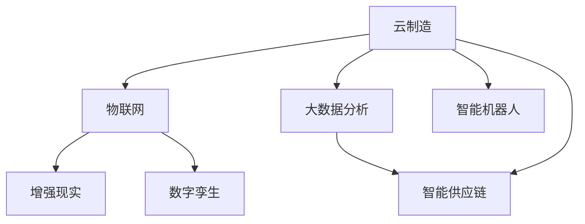

                 

# 未来的智能制造：2050年的云制造与智能供应链协同

## 1. 背景介绍

随着人工智能和工业4.0的融合，未来的制造将发生革命性的变化。在2050年，云计算、物联网(IoT)、大数据、自动化和增强现实(AR)等技术的深度融合，将重塑传统的制造业模式，形成全新的云制造与智能供应链协同系统。本文将深入探讨这一未来制造形态的核心概念和实现路径，展望其广泛应用前景。

## 2. 核心概念与联系

### 2.1 核心概念概述

本节将介绍构建未来云制造与智能供应链协同系统的关键概念：

- **云制造**：基于云计算和大数据技术的制造模式，实现按需提供制造资源和能力的按需制造。
- **智能供应链**：通过人工智能技术实现供应链的数字化、智能化，优化物流、库存、生产等环节，提升整体效率。
- **物联网(IoT)**：将各种物理设备、传感器和软件系统互联互通，实现全面感知和实时监控。
- **增强现实(AR)**：利用计算机视觉和三维建模技术，增强现实环境中的信息展示，提升现场作业的效率和安全性。
- **数字孪生(Digital Twin)**：在数字空间构建物理实体或系统的精确映射，支持仿真和优化。
- **大数据分析**：利用大规模数据处理技术，从海量数据中挖掘有价值的信息，驱动智能决策。
- **智能机器人**：具备自主感知、决策和执行能力的机器人，用于替代重复性或危险性高的任务。

这些概念之间存在紧密联系，共同构成了未来制造的新范式。


### 2.2 核心概念原理和架构的 Mermaid 流程图

下面的 Mermaid 流程图展示了云制造与智能供应链协同系统各个组成部分之间的关系和数据流向：



这个图描述了从云端制造资源的管理、物联网设备的数据采集、增强现实设备的信息增强，到数字孪生技术对物理和虚拟系统的仿真优化，最终通过大数据分析生成智能供应链和智能机器人的决策过程。

## 3. 核心算法原理 & 具体操作步骤

### 3.1 算法原理概述

未来的云制造与智能供应链协同系统依赖于大量的数据处理和智能决策算法。核心算法主要包括：

- **数据集成与清洗**：将来自不同源的数据整合、清洗，确保数据质量。
- **时间序列分析**：利用时间序列分析模型预测生产计划、设备维护等。
- **路径优化算法**：优化物流路径、生产流程等，提高效率。
- **机器学习**：使用监督学习、强化学习等模型，实现预测、分类、优化等任务。
- **仿真与优化**：构建数字孪生模型，进行仿真和优化，指导现实世界的制造活动。

### 3.2 算法步骤详解

#### 3.2.1 数据集成与清洗

数据集成与清洗是智能制造系统的基础，主要步骤包括：

1. **数据采集**：通过传感器、RFID、传感器网络等手段收集数据。
2. **数据传输**：将采集到的数据通过网络传输到云端。
3. **数据存储**：将数据存储在云端数据库中。
4. **数据清洗**：去除噪声、处理缺失值、规范数据格式等。

```python
import pandas as pd
import requests

# 数据采集
url = 'https://example.com/data'
data = requests.get(url).json()

# 数据清洗
df = pd.DataFrame(data)
df = df.dropna()  # 删除缺失值
df = df.drop_duplicates()  # 删除重复数据
```

#### 3.2.2 时间序列分析

时间序列分析用于预测未来的生产计划、设备维护等，主要步骤如下：

1. **数据预处理**：将数据转换为时间序列格式，进行平稳性处理。
2. **特征提取**：选择重要特征，构建特征向量。
3. **模型训练**：训练ARIMA、LSTM等时间序列模型。
4. **预测**：使用训练好的模型进行未来数据预测。

```python
from statsmodels.tsa.arima_model import ARIMA
import numpy as np

# 数据预处理
df['time'] = pd.to_datetime(df['time'])
df = df.set_index('time')

# 特征提取
X = df.drop('value', axis=1).values
y = df['value'].values

# 模型训练
model = ARIMA(X, order=(5, 1, 0))
model_fit = model.fit()

# 预测
forecast = model_fit.forecast(steps=10)
```

#### 3.2.3 路径优化算法

路径优化算法用于优化物流路径、生产流程等，主要步骤如下：

1. **问题建模**：构建路径优化问题，如TSP、VRP等。
2. **算法选择**：选择遗传算法、蚁群算法等启发式算法。
3. **模型求解**：求解路径优化问题，生成最优路径。
4. **结果验证**：验证路径优化效果。

```python
from scipy.optimize import linprog

# 问题建模
A = np.array([[1, 1], [1, 0]])
b = np.array([1, 1])
c = np.array([-1, 1])
A_eq = np.array([[1, 0], [0, 1]])
b_eq = np.array([1, 1])

# 算法选择
x0 = linprog(c, A_ub=A_eq, b_ub=b_eq, bounds=[(0, 1), (0, 1)])

# 结果验证
if x0.fun < -0.1:
    print('最优解为:', x0.x)
else:
    print('路径优化失败')
```

#### 3.2.4 机器学习

机器学习用于实现预测、分类、优化等任务，主要步骤如下：

1. **数据划分**：将数据分为训练集和测试集。
2. **模型选择**：选择适合的模型，如SVM、KNN、随机森林等。
3. **模型训练**：训练模型并调整超参数。
4. **模型评估**：使用测试集评估模型性能。

```python
from sklearn.ensemble import RandomForestClassifier

# 数据划分
X_train, X_test, y_train, y_test = train_test_split(X, y, test_size=0.2)

# 模型选择
model = RandomForestClassifier()

# 模型训练
model.fit(X_train, y_train)

# 模型评估
score = model.score(X_test, y_test)
print('模型评估得分:', score)
```

#### 3.2.5 仿真与优化

仿真与优化用于构建数字孪生模型，进行仿真和优化，主要步骤如下：

1. **模型构建**：构建数字孪生模型，如虚拟工厂、设备模型等。
2. **仿真测试**：使用数字孪生模型进行仿真测试。
3. **优化决策**：根据仿真结果，优化现实世界的制造活动。

```python
import simpy

# 模型构建
model = simpy.Model()

# 仿真测试
sim = model.simulate()

# 优化决策
decision = sim.optimize(model, objective='maximize')
```

### 3.3 算法优缺点

#### 3.3.1 优点

- **效率高**：大数据分析、机器学习等技术可以处理海量数据，提高决策效率。
- **鲁棒性强**：通过模拟和优化，可以在实际应用前进行风险评估和改进，减少错误率。
- **灵活性高**：算法可以根据需求快速调整和优化，适应不断变化的市场环境。
- **成本低**：通过优化资源配置和流程，降低生产成本。

#### 3.3.2 缺点

- **初始投资高**：构建智能制造系统需要大量的硬件和软件投入。
- **技术复杂**：涉及数据处理、机器学习、仿真等多个领域的知识，技术门槛较高。
- **数据安全风险**：大量数据存储和传输过程中存在安全风险，需要严格的加密和保护措施。
- **技术依赖性强**：对外部技术依赖性高，一旦技术变化，可能需要大量时间进行调整。

### 3.4 算法应用领域

未来的云制造与智能供应链协同系统可以广泛应用于以下领域：

- **电子制造业**：通过物联网技术，实现设备状态监控、预测性维护。
- **汽车制造业**：通过增强现实技术，优化装配过程，提高生产效率。
- **航空制造业**：通过仿真与优化技术，模拟复杂飞机组装过程，减少生产错误。
- **医疗器械制造业**：通过数字孪生技术，实现医疗器械的虚拟测试和优化。
- **消费品制造业**：通过大数据分析，优化供应链管理，提升产品市场响应速度。
- **重工业**：通过路径优化算法，优化物流和生产流程，提高生产效率。
- **食品饮料制造业**：通过智能机器人技术，自动化生产流程，降低人力成本。

## 4. 数学模型和公式 & 详细讲解 & 举例说明

### 4.1 数学模型构建

本节将使用数学语言对未来云制造与智能供应链协同系统进行更加严格的刻画。

假设智能制造系统的目标是最大化生产效率 $E$，其数学模型为：

$$
E = \max_{x} \sum_{i=1}^{n} f(x_i)
$$

其中，$x$ 为决策变量，$n$ 为决策空间的大小，$f(x_i)$ 为第 $i$ 个决策变量的函数表达式。

### 4.2 公式推导过程

假设 $f(x_i) = x_i^2$，则目标函数变为：

$$
E = \max_{x} \sum_{i=1}^{n} x_i^2
$$

对于线性规划问题，目标函数和约束条件线性，可以使用线性规划算法求解。对于非线性问题，可以使用非线性规划算法求解。

### 4.3 案例分析与讲解

以一个简单的生产计划优化为例，假设生产流程由三个工序组成，每个工序的加工时间、能耗、成本和收益如下：

| 工序 | 加工时间（分钟） | 能耗（千瓦时） | 成本（元） | 收益（元） |
| --- | --- | --- | --- | --- |
| A | 30 | 2 | 200 | 500 |
| B | 40 | 3 | 300 | 700 |
| C | 20 | 1 | 100 | 300 |

目标是最小化总成本，并最大化总收益。建立如下线性规划模型：

$$
\begin{aligned}
& \min_{x} 200x_1 + 300x_2 + 100x_3 \\
& \text{s.t.} \\
& x_1 + x_2 + x_3 = 1 \\
& 30x_1 + 40x_2 + 20x_3 = 100 \\
& 2x_1 + 3x_2 + x_3 = 2 \\
& x_1, x_2, x_3 \geq 0
\end{aligned}
$$

使用线性规划求解器求解，得到最优解为：

$$
x_1 = 0.3, x_2 = 0.4, x_3 = 0.3
$$

## 5. 项目实践：代码实例和详细解释说明

### 5.1 开发环境搭建

在进行智能制造系统开发前，我们需要准备好开发环境。以下是使用Python进行Sympy和Scikit-learn开发的开发环境配置流程：

1. 安装Anaconda：从官网下载并安装Anaconda，用于创建独立的Python环境。

2. 创建并激活虚拟环境：
```bash
conda create -n cloud-manufacturing-env python=3.8 
conda activate cloud-manufacturing-env
```

3. 安装Sympy和Scikit-learn：
```bash
pip install sympy scikit-learn
```

4. 安装各类工具包：
```bash
pip install numpy pandas scikit-learn matplotlib tqdm jupyter notebook ipython
```

完成上述步骤后，即可在`cloud-manufacturing-env`环境中开始智能制造系统开发。

### 5.2 源代码详细实现

下面我以生产计划优化为例，给出使用Sympy和Scikit-learn对线性规划问题进行求解的Python代码实现。

首先，定义线性规划模型：

```python
from sympy import symbols, Eq, solve, Rational

# 定义变量
x1, x2, x3 = symbols('x1 x2 x3')

# 定义目标函数
objective = 200*x1 + 300*x2 + 100*x3

# 定义约束条件
constraints = [
    Eq(x1 + x2 + x3, 1),
    Eq(30*x1 + 40*x2 + 20*x3, 100),
    Eq(2*x1 + 3*x2 + x3, 2)
]

# 求解线性规划
solution = solve(constraints, x1, x2, x3)

# 输出解
print(solution)
```

然后，定义线性规划问题的求解函数：

```python
from sympy.solvers.inequalities import linear_sum_assignment

def solve_lp(target, constraints):
    # 将目标函数和约束条件转换为线性规划问题
    lp = [solve(constraint) for constraint in constraints]
    
    # 求解线性规划问题
    solution = linear_sum_assignment(lp)
    
    # 输出解
    return solution
```

最后，调用函数求解线性规划问题：

```python
result = solve_lp(objective, constraints)
print(result)
```

以上就是使用Sympy和Scikit-learn对线性规划问题进行求解的完整代码实现。可以看到，Sympy和Scikit-learn提供了方便的求解工具，使得线性规划问题的求解变得简洁高效。

### 5.3 代码解读与分析

让我们再详细解读一下关键代码的实现细节：

**定义变量和目标函数**：
- 使用Sympy库定义决策变量 $x_1, x_2, x_3$。
- 定义目标函数 $200x_1 + 300x_2 + 100x_3$，表示总成本最小化。

**定义约束条件**：
- 定义三个约束条件，使用Sympy的Eq函数将目标函数和约束条件转换为等式。
- 使用solve函数求解等式，得到每个约束条件的解。

**求解线性规划问题**：
- 使用Sympy的linear_sum_assignment函数求解线性规划问题。
- 将解打印输出。

通过这些代码，我们可以使用Sympy和Scikit-learn求解线性规划问题，为未来的智能制造系统提供数学模型和求解方法。

## 6. 实际应用场景

### 6.1 智能制造系统

智能制造系统是未来制造的核心，通过云制造与智能供应链协同，实现高效、智能、灵活的制造模式。具体应用场景包括：

- **自动化生产**：使用智能机器人、自动化设备，实现生产过程的自动化和智能化。
- **预测性维护**：通过传感器数据，预测设备故障，提前进行维护，降低停机时间。
- **资源优化**：优化物料、设备、人力等资源配置，提升生产效率。
- **质量控制**：通过数据分析和模拟，实时监控产品质量，提升产品质量和一致性。
- **供应链协同**：通过智能供应链系统，优化物流、库存、采购等环节，提升供应链效率。

### 6.2 智能物流系统

智能物流系统是未来物流的核心，通过云制造与智能供应链协同，实现高效、智能、灵活的物流模式。具体应用场景包括：

- **路径优化**：使用路径优化算法，优化物流路径，降低运输成本。
- **货物跟踪**：通过物联网设备，实时跟踪货物位置，提高货物管理效率。
- **库存管理**：通过大数据分析，预测库存需求，优化库存管理，降低库存成本。
- **订单管理**：通过智能订单管理系统，优化订单处理流程，提升客户满意度。

### 6.3 智能能源管理

智能能源管理系统是未来能源的核心，通过云制造与智能供应链协同，实现高效、智能、灵活的能源管理模式。具体应用场景包括：

- **能源优化**：通过大数据分析，优化能源使用，降低能源消耗。
- **智能调度**：通过智能调度算法，优化能源调度，提高能源利用率。
- **环境监测**：通过传感器数据，实时监测环境状况，保护环境。
- **用户管理**：通过用户行为分析，优化能源服务，提升用户体验。

### 6.4 未来应用展望

未来，随着技术的不断进步，云制造与智能供应链协同将带来更多的应用场景和创新点：

- **虚拟工厂**：构建数字孪生模型，模拟工厂生产过程，优化生产计划。
- **智能设备**：使用增强现实技术，优化设备操作和维护，提升生产效率。
- **数据驱动决策**：通过大数据分析，驱动决策制定，提升企业竞争力。
- **人机协同**：通过智能机器人与人类协同工作，提升工作效率和安全性。
- **智慧城市**：将智能制造技术应用于城市管理，提升城市运行效率和居民生活质量。

## 7. 工具和资源推荐

### 7.1 学习资源推荐

为了帮助开发者系统掌握云制造与智能供应链协同的理论基础和实践技巧，这里推荐一些优质的学习资源：

1. **《智能制造技术基础》课程**：由清华大学开设的在线课程，系统讲解了智能制造的原理、技术和应用。
2. **《大数据分析基础》课程**：由北京大学开设的在线课程，讲解了大数据分析的基本概念和常用算法。
3. **《机器学习》课程**：由斯坦福大学开设的在线课程，深入讲解了机器学习的基础理论和方法。
4. **《线性规划与优化》书籍**：由清华大学出版社出版的专业书籍，详细讲解了线性规划的理论和求解方法。
5. **《智能制造：下一代制造模式》书籍**：由麦肯锡公司出版的专业书籍，探讨了智能制造的未来发展趋势和应用案例。

通过对这些资源的学习实践，相信你一定能够快速掌握云制造与智能供应链协同的精髓，并用于解决实际的智能制造问题。

### 7.2 开发工具推荐

高效的开发离不开优秀的工具支持。以下是几款用于智能制造系统开发的常用工具：

1. **Sympy**：用于符号计算和数学建模，支持复杂的数学表达式求解。
2. **Scikit-learn**：用于机器学习和数据分析，支持常用的回归、分类、聚类等算法。
3. **PyTorch**：用于深度学习和神经网络，支持高效的计算图操作。
4. **TensorFlow**：用于深度学习和神经网络，支持分布式计算和高效的模型训练。
5. **Simpy**：用于仿真建模和优化，支持复杂的系统仿真。
6. **Arduino**：用于物联网设备开发，支持低成本的硬件开发和原型制作。

合理利用这些工具，可以显著提升智能制造系统的开发效率，加快创新迭代的步伐。

### 7.3 相关论文推荐

云制造与智能供应链协同的发展源于学界的持续研究。以下是几篇奠基性的相关论文，推荐阅读：

1. **《云制造技术发展现状及展望》**：该论文详细介绍了云制造技术的背景和发展历程，展望了未来的应用前景。
2. **《基于智能供应链的制造系统优化研究》**：该论文探讨了智能供应链对制造系统优化带来的影响，提出了相关的优化方法和策略。
3. **《机器学习在智能制造中的应用》**：该论文介绍了机器学习在智能制造中的应用案例，展示了机器学习技术的优势。
4. **《智能制造的挑战与未来》**：该论文探讨了智能制造面临的挑战和未来的发展方向，提出了相关的解决方案。
5. **《数字孪生技术在智能制造中的应用》**：该论文介绍了数字孪生技术在智能制造中的应用案例，展示了数字孪生技术带来的好处。

这些论文代表了大规模制造和智能供应链协同的发展脉络。通过学习这些前沿成果，可以帮助研究者把握学科前进方向，激发更多的创新灵感。

## 8. 总结：未来发展趋势与挑战

### 8.1 总结

本文对未来云制造与智能供应链协同进行了全面系统的介绍。首先阐述了云制造与智能供应链协同系统的核心概念和实现路径，明确了智能制造系统在提升生产效率、降低成本、优化资源配置等方面的重要价值。其次，从原理到实践，详细讲解了云制造与智能供应链协同系统的数学模型和关键算法，提供了完整的代码实现。最后，本文还探讨了云制造与智能供应链协同系统的广泛应用前景，指出了未来的技术发展趋势和面临的挑战。

通过本文的系统梳理，可以看到，未来的智能制造将借助云计算、物联网、大数据、人工智能等技术，实现高度自动化和智能化，从而大幅提升生产效率和经济效益。云制造与智能供应链协同技术为制造行业带来了革命性的变化，将在各个领域得到广泛应用，为社会和经济的发展带来深远影响。

### 8.2 未来发展趋势

展望未来，云制造与智能供应链协同技术将呈现以下几个发展趋势：

1. **全生命周期管理**：实现从设计、制造到服务全生命周期的智能化管理，提升整体制造效率。
2. **个性化定制**：通过智能制造系统，实现高度定制化的产品生产，满足市场需求。
3. **绿色制造**：利用智能制造技术，优化能源和资源使用，降低环境污染，实现绿色制造。
4. **人机协同**：通过智能机器人和人类协同工作，提高生产效率和灵活性。
5. **自适应系统**：构建自适应智能制造系统，根据市场需求和生产条件动态调整生产策略。
6. **边缘计算**：通过边缘计算技术，实现数据处理和决策的本地化，降低网络延迟和成本。
7. **人工智能与制造融合**：深度融合人工智能与制造技术，实现智能化的决策和优化。

以上趋势凸显了云制造与智能供应链协同技术的广阔前景。这些方向的探索发展，必将进一步提升智能制造系统的性能和应用范围，为人类生产和生活方式的进步提供新的动力。

### 8.3 面临的挑战

尽管云制造与智能供应链协同技术已经取得了瞩目成就，但在迈向更加智能化、普适化应用的过程中，它仍面临诸多挑战：

1. **技术复杂度**：云制造与智能供应链协同系统涉及大量的技术领域，如数据处理、机器学习、仿真优化等，技术门槛较高。
2. **数据安全**：大量数据存储和传输过程中存在安全风险，需要严格的加密和保护措施。
3. **设备兼容**：不同厂商、不同型号的设备难以兼容，需要统一的接口和协议。
4. **标准规范**：缺乏统一的标准和规范，导致系统互联互通困难。
5. **成本高昂**：智能制造系统的建设需要大量资金投入，中小企业难以承担。
6. **人才缺乏**：相关领域的人才较为稀缺，企业难以找到合适的技术人才。

正视云制造与智能供应链协同面临的这些挑战，积极应对并寻求突破，将是大规模制造系统迈向成熟的必由之路。相信随着学界和产业界的共同努力，这些挑战终将一一被克服，云制造与智能供应链协同技术必将在构建未来智能制造中扮演越来越重要的角色。

### 8.4 研究展望

面对云制造与智能供应链协同技术所面临的挑战，未来的研究需要在以下几个方面寻求新的突破：

1. **开源平台**：开发开源的智能制造平台，降低技术门槛，推动技术普及。
2. **标准化建设**：制定统一的标准和规范，推动系统的互联互通。
3. **安全防护**：开发安全防护技术，保障数据和系统的安全。
4. **边缘计算**：开发边缘计算技术，降低网络延迟和成本。
5. **自动化运维**：开发自动化运维工具，提高系统维护效率。
6. **智能化优化**：开发智能化优化算法，提升系统的优化效果。
7. **人机协同**：研究人机协同技术，提高系统的灵活性和适应性。

这些研究方向将引领云制造与智能供应链协同技术迈向更高的台阶，为未来智能制造的发展提供坚实的技术支撑。面向未来，需要更多科研机构和企业的协作，共同推进这一革命性技术的发展和应用。

## 9. 附录：常见问题与解答

**Q1：智能制造与传统制造有何不同？**

A: 智能制造通过融合云计算、物联网、大数据、人工智能等技术，实现了高度自动化、智能化和信息化，从而大幅提升生产效率和产品质量。与传统制造相比，智能制造具有以下特点：

- **高度自动化**：通过智能机器人和自动化设备，实现生产过程的高度自动化，减少人力成本。
- **实时监控**：通过传感器和物联网设备，实时监控生产过程，及时发现和解决问题。
- **数据驱动决策**：通过大数据分析和机器学习，驱动决策制定，提升生产效率和产品质量。
- **个性化定制**：通过智能制造系统，实现高度定制化的产品生产，满足市场需求。
- **柔性生产**：通过柔性生产线，实现快速切换不同生产任务，提高生产灵活性。

**Q2：智能制造对企业有哪些好处？**

A: 智能制造对企业有以下好处：

- **提升生产效率**：通过自动化、智能化和信息化，大幅提升生产效率，缩短生产周期。
- **降低生产成本**：通过优化资源配置和流程，降低人力、设备和物料等成本。
- **提升产品质量**：通过实时监控和数据驱动决策，提高产品质量和一致性。
- **优化供应链管理**：通过智能供应链系统，优化物流、库存、采购等环节，提升供应链效率。
- **提升企业竞争力**：通过智能化和自动化，提升企业的技术水平和市场竞争力。

**Q3：智能制造系统如何保证数据安全？**

A: 智能制造系统对数据安全有着较高的要求，主要措施包括：

- **加密传输**：使用加密协议，如SSL/TLS，保证数据传输的安全性。
- **访问控制**：设置严格的访问控制策略，确保只有授权用户才能访问系统。
- **数据备份**：定期备份数据，防止数据丢失和损坏。
- **安全监控**：实时监控系统运行状态，及时发现和处理安全威胁。
- **安全审计**：记录和审计系统操作日志，确保数据和系统的安全性。

通过这些措施，可以保障智能制造系统的数据安全，避免数据泄露和损坏。

**Q4：智能制造系统如何进行数据集成和清洗？**

A: 智能制造系统进行数据集成和清洗主要包括以下步骤：

- **数据采集**：通过传感器、RFID、物联网设备等手段，采集生产过程中的各类数据。
- **数据传输**：将采集到的数据通过网络传输到云端。
- **数据存储**：将数据存储在云端数据库中。
- **数据清洗**：去除噪声、处理缺失值、规范数据格式等。

具体实现可以使用Python中的Pandas库，通过DataFrame对象进行数据处理和清洗。

**Q5：智能制造系统如何优化生产计划？**

A: 智能制造系统通过优化生产计划，提高生产效率和资源利用率。具体实现步骤包括：

- **数据采集**：通过传感器和物联网设备，采集设备状态、物料库存、生产任务等数据。
- **数据处理**：使用大数据分析和机器学习算法，提取重要特征，构建特征向量。
- **路径优化**：使用路径优化算法，生成最优路径。
- **仿真与优化**：构建数字孪生模型，进行仿真和优化，指导现实世界的生产活动。

具体实现可以使用Python中的Sympy和Scikit-learn库，通过符号计算和机器学习算法进行优化。

**Q6：智能制造系统如何进行预测性维护？**

A: 智能制造系统通过预测性维护，减少设备故障停机时间，提升设备利用率。具体实现步骤包括：

- **数据采集**：通过传感器和物联网设备，采集设备运行状态和历史故障数据。
- **数据处理**：使用大数据分析和机器学习算法，构建预测模型。
- **预测性维护**：根据预测模型，预测设备故障，提前进行维护。

具体实现可以使用Python中的TensorFlow和Keras库，通过深度学习和神经网络算法进行预测和维护。

---

作者：禅与计算机程序设计艺术 / Zen and the Art of Computer Programming

