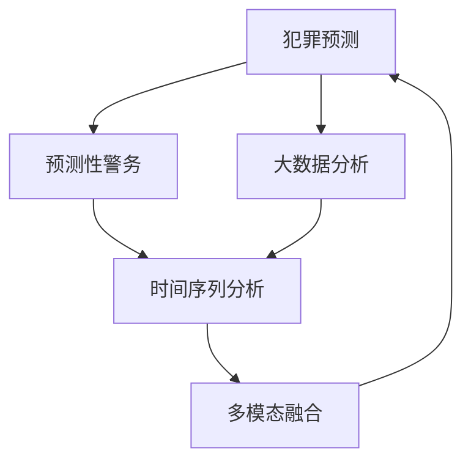

                 

# 未来的智能安防：2050年的Crime Prediction与Predictive Policing

## 1. 背景介绍

### 1.1 问题由来
在2050年的高科技时代，智能安防系统已经成为社会治安管理和犯罪预防的关键基础设施。随着大数据、人工智能和物联网技术的飞速发展，安防系统不再仅仅是摄像头和门禁的简单组合，而是成为集数据采集、分析、预警于一体的智能化综合平台。在这个背景下，犯罪预测和预测性警务（Predictive Policing）技术成为了提升社会治安管理水平和预防犯罪的重要手段。

### 1.2 问题核心关键点
犯罪预测和预测性警务的核心在于利用历史犯罪数据和实时数据，通过数据分析和机器学习模型，预测犯罪事件的发生，并提前部署警力进行干预。这不仅需要高效的算法模型，还需要大量的数据支持和智能化的警务决策系统。

### 1.3 问题研究意义
犯罪预测和预测性警务技术的深入研究，对于提升社会治安管理水平，预防和减少犯罪行为，保障公民的生命财产安全具有重要意义。同时，该技术还可以优化警务资源的配置，提高警务工作的效率和精准性，为社会治理带来革命性变化。

## 2. 核心概念与联系

### 2.1 核心概念概述

为更好地理解未来智能安防中犯罪预测和预测性警务的核心概念，本节将介绍几个密切相关的核心概念：

- 犯罪预测（Crime Prediction）：利用历史犯罪数据和实时数据，通过机器学习模型预测犯罪事件的发生概率和类型。
- 预测性警务（Predictive Policing）：基于犯罪预测结果，提前部署警力进行干预，防止犯罪行为的发生。
- 大数据分析：在犯罪预测和预测性警务中，需要通过海量数据进行清洗、处理和分析，以提取有价值的信息。
- 时间序列分析：犯罪事件的预测通常涉及时间序列分析，以便发现犯罪行为的时间模式和趋势。
- 多模态融合：将多种数据源（如地理位置、社交媒体、天气等）进行融合，提升犯罪预测的准确性。

这些核心概念之间的逻辑关系可以通过以下Mermaid流程图来展示：



这个流程图展示了大规模智能安防系统中各个模块的逻辑关系：

1. 犯罪预测系统通过分析大量数据，预测未来犯罪事件的发生。
2. 预测性警务系统根据犯罪预测结果，提前部署警力。
3. 大数据分析系统负责数据的清洗、处理和存储。
4. 时间序列分析系统通过分析时间序列数据，发现犯罪行为的时间模式。
5. 多模态融合系统将多种数据源进行融合，提升预测的准确性。

这些概念共同构成了未来智能安防系统中的核心模块，为其高效运行奠定了基础。

## 3. 核心算法原理 & 具体操作步骤
### 3.1 算法原理概述

基于机器学习的大规模智能安防系统，本质上是一个复杂的预测系统。其核心思想是：利用历史犯罪数据，通过统计分析和机器学习模型，预测未来犯罪事件的发生，并根据预测结果进行干预。

形式化地，假设犯罪事件 $C_t$ 的发生概率可以表示为 $P(C_t)$，则犯罪预测系统的目标是找到最优的模型 $M$，使得：

$$
\min_{M} \mathbb{E}[(\hat{P}(C_t) - P(C_t))^2]
$$

其中 $\hat{P}(C_t)$ 为模型 $M$ 预测的犯罪事件 $C_t$ 的发生概率，$P(C_t)$ 为真实发生的概率。

通过梯度下降等优化算法，犯罪预测系统不断更新模型 $M$，最小化预测误差，使得模型输出的预测结果与实际发生情况更加接近。

### 3.2 算法步骤详解

基于机器学习的大规模智能安防系统的一般步骤如下：

**Step 1: 数据收集与预处理**
- 收集历史犯罪数据，包括时间、地点、类型、受害者等信息。
- 对数据进行清洗、去重、归一化等预处理，确保数据质量。
- 根据预测需求，划分训练集、验证集和测试集。

**Step 2: 特征工程**
- 设计合适的特征，提取有意义的特征信息，如时间、地点、天气等。
- 对特征进行编码和归一化，以便于模型处理。

**Step 3: 模型选择与训练**
- 选择合适的预测模型，如随机森林、神经网络、支持向量机等。
- 在训练集上训练模型，并使用验证集进行调参和优化。

**Step 4: 预测与警务部署**
- 在测试集上评估模型性能，计算预测精度、召回率和F1分数等指标。
- 根据预测结果，在预警系统上部署警力进行预防性干预。

**Step 5: 持续优化**
- 实时收集新数据，定期重新训练模型，以适应犯罪行为的动态变化。
- 引入对抗训练、在线学习等技术，提高模型的鲁棒性和适应性。

### 3.3 算法优缺点

基于机器学习的大规模智能安防系统具有以下优点：

1. 预测能力强。利用历史数据和先进算法，可以准确预测犯罪事件，为警务决策提供科学依据。
2. 资源利用率高。通过预测性警务，可以合理分配警力资源，减少人力和财力的浪费。
3. 实时响应能力强。预测系统能够实时分析数据，快速响应犯罪事件，提升警务效率。
4. 智能决策支持。结合多模态数据和高级分析技术，可以为警务人员提供智能化的决策支持。

同时，该系统也存在一定的局限性：

1. 数据依赖性强。预测系统的效果很大程度上取决于数据的质量和数量，数据获取和处理成本较高。
2. 模型复杂度高。随着数据量和模型复杂度的增加，模型的训练和推理时间也会增长，需要强大的计算资源支持。
3. 模型解释性差。机器学习模型的预测结果往往难以解释，警务人员难以理解其内部工作机制。
4. 对抗攻击风险。预测系统可能会受到对抗攻击，导致模型输出错误，影响决策效果。

尽管存在这些局限性，但就目前而言，基于机器学习的智能安防系统仍然是大规模犯罪预测和预测性警务的主流技术范式。未来相关研究的重点在于如何进一步提高模型的可解释性和鲁棒性，同时降低对数据的依赖，提高模型的实时响应能力。

### 3.4 算法应用领域

基于机器学习的大规模智能安防系统，在多个领域得到了广泛的应用，例如：

- 城市安全管理：在城市重要区域和公共场所安装监控摄像头，实时采集数据，进行犯罪预测和预警。
- 社区治安防范：在社区内部安装智能门禁和监控系统，根据预测结果进行门禁控制和巡逻部署。
- 交通治安监控：利用交通监控摄像头和车辆数据，进行交通违法行为预测和警务部署。
- 网络犯罪预警：通过网络监控和数据分析，预测网络钓鱼、黑客攻击等犯罪行为，进行防护和干预。
- 自然灾害防范：在地震、洪水等自然灾害发生前，进行预测和预警，保护人员安全。

除了上述这些经典应用外，智能安防系统还被创新性地应用于更多场景中，如智慧城市、智慧交通、智慧医疗等，为公共安全和社会治理带来新的突破。

## 4. 数学模型和公式 & 详细讲解  
### 4.1 数学模型构建

本节将使用数学语言对大规模智能安防系统中的犯罪预测和预测性警务进行更加严格的刻画。

记历史犯罪数据为 $\{C_{t_i}\}_{i=1}^N$，其中 $C_{t_i}$ 表示时间 $t_i$ 发生的犯罪事件。假设犯罪事件的发生概率可以表示为时间序列 $P(C_{t_i})$，则犯罪预测系统的目标是找到最优的模型 $M$，使得：

$$
\min_{M} \mathbb{E}[(\hat{P}(C_{t_i}) - P(C_{t_i}))^2]
$$

其中 $\hat{P}(C_{t_i})$ 为模型 $M$ 预测的犯罪事件 $C_{t_i}$ 的发生概率。

在实践中，我们通常使用时间序列分析模型（如ARIMA、LSTM等）或机器学习模型（如随机森林、神经网络等）来进行犯罪预测。

### 4.2 公式推导过程

以下我们以LSTM模型为例，推导其时间序列预测的公式及其梯度计算。

假设犯罪事件的发生时间序列为 $P(C_{t_i})$，LSTM模型的输入序列为 $\{X_{t_i}\}_{i=1}^N$，其中 $X_{t_i}$ 表示时间 $t_i$ 的输入特征。则LSTM模型的预测公式为：

$$
\hat{P}(C_{t_i}) = M_{LSTM}(X_{t_i})
$$

其中 $M_{LSTM}$ 为LSTM模型的预测函数。根据链式法则，损失函数对模型参数的梯度为：

$$
\frac{\partial \mathcal{L}}{\partial \theta} = -\frac{1}{N}\sum_{i=1}^N (\hat{P}(C_{t_i}) - P(C_{t_i})) \frac{\partial M_{LSTM}(X_{t_i})}{\partial \theta}
$$

其中 $\theta$ 为模型参数，$\mathcal{L}$ 为损失函数，可以使用均方误差损失函数：

$$
\mathcal{L} = \frac{1}{N}\sum_{i=1}^N (\hat{P}(C_{t_i}) - P(C_{t_i}))^2
$$

在得到损失函数的梯度后，即可带入模型参数更新公式，完成模型的迭代优化。重复上述过程直至收敛，最终得到适应犯罪预测任务的最优模型参数 $\theta^*$。

### 4.3 案例分析与讲解

以2050年某城市的预测性警务系统为例，进行分析讲解：

假设该城市的历史犯罪数据已经收集完成，包含了过去10年的每日犯罪数据。在将数据划分为训练集、验证集和测试集后，开始训练LSTM模型进行犯罪预测。

**Step 1: 数据预处理**
- 收集城市的历史犯罪数据，包括时间、地点、类型、受害者等信息。
- 对数据进行清洗、去重、归一化等预处理，确保数据质量。

**Step 2: 特征工程**
- 设计合适的特征，提取有意义的特征信息，如时间、地点、天气等。
- 对特征进行编码和归一化，以便于模型处理。

**Step 3: 模型训练**
- 使用LSTM模型进行犯罪预测，将时间序列数据作为输入，预测每日的犯罪发生概率。
- 在训练集上训练模型，并使用验证集进行调参和优化。

**Step 4: 预测与警务部署**
- 在测试集上评估模型性能，计算预测精度、召回率和F1分数等指标。
- 根据预测结果，在预警系统上部署警力进行预防性干预。

**Step 5: 持续优化**
- 实时收集新数据，定期重新训练模型，以适应犯罪行为的动态变化。
- 引入对抗训练、在线学习等技术，提高模型的鲁棒性和适应性。

通过以上步骤，构建的预测性警务系统可以在预测准确率达到一定标准后，根据预测结果进行警力部署和资源优化，从而提高城市的安全管理水平。

## 5. 项目实践：代码实例和详细解释说明
### 5.1 开发环境搭建

在进行智能安防系统开发前，我们需要准备好开发环境。以下是使用Python进行TensorFlow开发的环境配置流程：

1. 安装Anaconda：从官网下载并安装Anaconda，用于创建独立的Python环境。

2. 创建并激活虚拟环境：
```bash
conda create -n tf-env python=3.8 
conda activate tf-env
```

3. 安装TensorFlow：根据CUDA版本，从官网获取对应的安装命令。例如：
```bash
conda install tensorflow -c tensorflow -c conda-forge
```

4. 安装PyTorch：
```bash
pip install torch
```

5. 安装各类工具包：
```bash
pip install numpy pandas scikit-learn matplotlib tqdm jupyter notebook ipython
```

完成上述步骤后，即可在`tf-env`环境中开始智能安防系统的开发。

### 5.2 源代码详细实现

这里我们以基于LSTM的犯罪预测系统为例，给出TensorFlow的代码实现。

首先，定义犯罪预测的训练函数：

```python
import tensorflow as tf
from tensorflow.keras.layers import LSTM, Dense
from tensorflow.keras.models import Sequential
from tensorflow.keras.optimizers import Adam

def train_lstm_model(X_train, y_train, X_valid, y_valid, batch_size, epochs):
    model = Sequential()
    model.add(LSTM(64, input_shape=(X_train.shape[1], X_train.shape[2])))
    model.add(Dense(1, activation='sigmoid'))
    model.compile(optimizer=Adam(lr=0.001), loss='binary_crossentropy', metrics=['accuracy'])
    
    history = model.fit(X_train, y_train, batch_size=batch_size, epochs=epochs, validation_data=(X_valid, y_valid))
    return model, history
```

然后，定义模型评估函数：

```python
def evaluate_model(model, X_test, y_test, batch_size):
    model.evaluate(X_test, y_test, batch_size=batch_size)
```

接着，启动训练流程：

```python
X_train = train_data['scaled_X']
y_train = train_data['scaled_y']
X_valid = valid_data['scaled_X']
y_valid = valid_data['scaled_y']
X_test = test_data['scaled_X']
y_test = test_data['scaled_y']

model, history = train_lstm_model(X_train, y_train, X_valid, y_valid, batch_size=32, epochs=100)

evaluate_model(model, X_test, y_test, batch_size=32)
```

以上就是使用TensorFlow进行基于LSTM的犯罪预测系统的完整代码实现。可以看到，TensorFlow的Keras API使得模型构建和训练变得简单高效。

### 5.3 代码解读与分析

让我们再详细解读一下关键代码的实现细节：

**train_lstm_model函数**：
- 定义了一个基于LSTM的犯罪预测模型，包含一个LSTM层和一个全连接层。
- 使用Adam优化器和二元交叉熵损失函数进行模型训练，并记录训练过程中的历史数据。

**evaluate_model函数**：
- 对模型在测试集上的表现进行评估，使用损失和准确率指标进行评估。

**训练流程**：
- 定义训练集和验证集的数据，并进行预处理。
- 调用训练函数，开始训练LSTM模型，并保存训练过程中的历史数据。
- 对训练完成的模型进行评估，输出测试集上的性能指标。

可以看到，TensorFlow提供了简单易用的API，使得模型开发和训练过程变得高效便捷。开发者可以将更多精力放在数据处理、模型优化等高层逻辑上，而不必过多关注底层的实现细节。

当然，工业级的系统实现还需考虑更多因素，如模型的保存和部署、超参数的自动搜索、更灵活的任务适配层等。但核心的犯罪预测和预测性警务算法基本与此类似。

## 6. 实际应用场景
### 6.1 智能交通管理

基于大规模智能安防系统的预测性警务技术，可以广泛应用于智能交通管理中。交通违法行为预测和预防是智能交通管理的重要环节，通过预测系统，可以实时监控交通流量，预测潜在的交通违法行为，提前采取干预措施。

在技术实现上，可以利用交通监控摄像头和车辆数据，训练时间序列分析模型或LSTM模型，对交通违法行为进行预测。系统根据预测结果，可以在交通繁忙区域提前部署警力，进行交通疏导和执法，提高交通管理效率。

### 6.2 智慧校园安全

智慧校园安全管理中，预测性警务技术可以发挥重要作用。通过预测系统，可以实时监控校园内的异常行为，预测潜在的威胁事件，提前进行预警和干预。

在技术实现上，可以利用校园内的监控摄像头和传感器数据，训练多模态融合模型，对校园内的行为进行分析和预测。系统根据预测结果，可以在潜在威胁区域提前部署安保人员，进行巡查和防护，保障校园安全。

### 6.3 自然灾害预警

在自然灾害预警中，大规模智能安防系统的预测性警务技术可以提前识别自然灾害的风险，提高预警的及时性和准确性。

在技术实现上，可以利用气象数据和地理信息数据，训练时间序列分析模型或神经网络模型，对自然灾害的发生进行预测。系统根据预测结果，可以提前发布预警信息，进行灾害防护和人员疏散，减少灾害造成的损失。

### 6.4 未来应用展望

随着大规模智能安防系统的不断发展，基于预测性警务的技术将在更多领域得到应用，为社会治理带来变革性影响。

在智慧城市治理中，预测性警务技术可以应用于城市事件监测、舆情分析、应急指挥等环节，提高城市管理的自动化和智能化水平，构建更安全、高效的未来城市。

在智慧医疗中，预测性警务技术可以应用于病患风险预测、疾病流行趋势分析等环节，提升医疗服务的智能化水平，辅助医生诊疗，提高公共卫生水平。

在智能农业中，预测性警务技术可以应用于农作物的病虫害预测、气象灾害预警等环节，提高农业生产的智能化水平，保障农业生产安全。

此外，在智慧教育、智能制造、智慧金融等众多领域，基于预测性警务的技术也将不断涌现，为经济社会发展注入新的动力。相信随着技术的日益成熟，预测性警务技术必将在构建智能社会中扮演越来越重要的角色。

## 7. 工具和资源推荐
### 7.1 学习资源推荐

为了帮助开发者系统掌握智能安防技术，这里推荐一些优质的学习资源：

1. 《Python深度学习》系列博文：由大模型技术专家撰写，深入浅出地介绍了深度学习在智能安防中的应用。

2. 《TensorFlow 2.0官方文档》：TensorFlow的官方文档，提供了丰富的API和样例代码，是上手实践的必备资料。

3. 《智能安防系统设计与实现》书籍：全面介绍了智能安防系统的架构、算法和开发流程，适合系统工程师和项目经理参考。

4. 《机器学习实战》课程：Coursera上由斯坦福大学开设的机器学习课程，涵盖了机器学习的基本概念和算法，适合初学者入门。

5. 《智能安防技术》学术会议论文集：收录了智能安防领域的最新研究成果和前沿技术，适合研究者跟踪最新动态。

通过对这些资源的学习实践，相信你一定能够快速掌握智能安防技术的精髓，并用于解决实际的安防问题。

### 7.2 开发工具推荐

高效的开发离不开优秀的工具支持。以下是几款用于智能安防系统开发的常用工具：

1. TensorFlow：由Google主导开发的开源深度学习框架，生产部署方便，适合大规模工程应用。提供了丰富的模型和工具支持，适用于各类智能安防任务。

2. PyTorch：基于Python的开源深度学习框架，灵活动态的计算图，适合快速迭代研究。

3. Keras：Keras提供了简单易用的API，使得模型构建和训练过程变得高效便捷，适用于各类智能安防任务。

4. Hadoop和Spark：大数据处理框架，适用于海量数据的存储、处理和分析，可用于智能安防系统的数据处理环节。

5. Elasticsearch：搜索引擎，适用于大规模数据的实时存储和查询，可用于智能安防系统的实时分析环节。

6. Grafana：数据可视化工具，可用于智能安防系统的实时监控和预警，提升系统可视性和操作性。

合理利用这些工具，可以显著提升智能安防系统的开发效率，加快创新迭代的步伐。

### 7.3 相关论文推荐

智能安防技术的发展源于学界的持续研究。以下是几篇奠基性的相关论文，推荐阅读：

1. "A Survey on Data Mining for Smart Cities"（智能城市数据挖掘综述）：介绍了智能城市数据挖掘的研究现状和未来发展方向。

2. "Deep Learning for Security"（深度学习在安全中的应用）：讨论了深度学习在网络安全、生物识别、智能监控等安全领域的应用。

3. "Predictive Policing: An Empirical Study"（预测性警务：一项实证研究）：通过实证分析，探讨了预测性警务系统的实际效果和影响。

4. "Time Series Forecasting using Deep Learning"（深度学习在时间序列预测中的应用）：介绍了深度学习在时间序列预测中的应用，包括LSTM、GRU等模型。

5. "Multi-modal Fusion for Security"（多模态融合在安全中的应用）：讨论了多模态融合技术在智能安防系统中的应用，提升了系统的综合分析能力。

这些论文代表了大规模智能安防系统的研究脉络。通过学习这些前沿成果，可以帮助研究者把握学科前进方向，激发更多的创新灵感。

## 8. 总结：未来发展趋势与挑战

### 8.1 总结

本文对大规模智能安防系统中的犯罪预测和预测性警务技术进行了全面系统的介绍。首先阐述了智能安防系统在2050年社会治安管理中的重要性，明确了预测性警务在提升社会治安管理水平、预防犯罪行为方面的独特价值。其次，从原理到实践，详细讲解了犯罪预测和预测性警务的数学模型和关键步骤，给出了预测性警务系统的完整代码实例。同时，本文还广泛探讨了预测性警务技术在智能交通、智慧校园、自然灾害预警等多个行业领域的应用前景，展示了预测性警务技术的巨大潜力。此外，本文精选了智能安防技术的各类学习资源，力求为读者提供全方位的技术指引。

通过本文的系统梳理，可以看到，基于机器学习的智能安防技术将在未来社会治安管理中扮演越来越重要的角色。这些方向的探索发展，必将进一步提升社会治安管理水平，保障公民的生命财产安全，促进社会稳定和谐。

### 8.2 未来发展趋势

展望未来，大规模智能安防系统的预测性警务技术将呈现以下几个发展趋势：

1. 多模态融合技术日趋成熟。随着传感器和监控设备的多样化，智能安防系统将越来越多地融合多模态数据，提升预测的准确性和鲁棒性。

2. 实时分析能力不断增强。基于高性能计算和深度学习模型，智能安防系统将能够实时分析海量数据，提高预警和干预的及时性。

3. 自适应模型成为主流。随着数据分布的动态变化，智能安防系统将引入自适应学习技术，实时更新模型参数，保持预测准确性。

4. 边缘计算得到广泛应用。在物联网设备的普及下，智能安防系统将越来越多地部署在边缘计算环境中，提高数据处理效率和系统响应速度。

5. 人机协作水平提升。智能安防系统将与警务人员形成更加紧密的协作，利用人机协同的方式进行预测和决策，提升系统智能化水平。

6. 隐私保护和伦理研究成为焦点。随着智能安防技术的广泛应用，如何保护个人隐私、确保算法公平透明等伦理问题将受到更多关注。

以上趋势凸显了大规模智能安防系统的未来前景。这些方向的探索发展，必将进一步提升智能安防系统的性能和应用范围，为社会治理带来革命性变化。

### 8.3 面临的挑战

尽管大规模智能安防系统的预测性警务技术已经取得了瞩目成就，但在迈向更加智能化、普适化应用的过程中，它仍面临着诸多挑战：

1. 数据质量问题。智能安防系统的效果很大程度上取决于数据的质量和数量，数据获取和处理成本较高。如何提高数据质量，确保数据的完整性和准确性，将是未来面临的重要挑战。

2. 算法复杂性。随着模型复杂度的增加，预测性警务系统的训练和推理时间也会增长，需要强大的计算资源支持。如何降低算法复杂度，提升模型训练和推理效率，是未来需要解决的问题。

3. 模型可解释性。智能安防系统的预测结果往往难以解释，警务人员难以理解其内部工作机制。如何赋予模型更强的可解释性，提高系统的透明度和可信度，将是亟待攻克的难题。

4. 对抗攻击风险。预测性警务系统可能会受到对抗攻击，导致模型输出错误，影响决策效果。如何加强模型的鲁棒性和安全性，防止对抗攻击，将是未来需要重点关注的方向。

5. 隐私保护和伦理约束。智能安防系统涉及大量敏感数据，如何在确保安全性的同时，保护个人隐私和数据安全，避免滥用，将是未来需要解决的伦理问题。

6. 技术融合和协同。智能安防系统需要与各类系统进行融合，形成协同工作机制，提升整体效能。如何实现跨系统的协同和互联互通，将是未来需要解决的技术难题。

正视智能安防系统面临的这些挑战，积极应对并寻求突破，将是大规模智能安防系统走向成熟的必由之路。相信随着学界和产业界的共同努力，这些挑战终将一一被克服，智能安防系统必将在构建安全、可靠、可解释、可控的智能社会中扮演越来越重要的角色。

### 8.4 研究展望

面对大规模智能安防系统所面临的种种挑战，未来的研究需要在以下几个方面寻求新的突破：

1. 探索自监督和无监督学习技术。摆脱对大规模标注数据的依赖，利用自监督和无监督学习技术，最大化利用数据信息，实现更加灵活高效的预测性警务。

2. 研究实时预测和多任务学习技术。通过实时预测和多任务学习，提高智能安防系统的实时响应能力和任务适应性。

3. 引入因果分析和博弈论工具。将因果分析方法引入预测性警务系统，识别出模型决策的关键特征，增强输出解释的因果性和逻辑性。借助博弈论工具刻画人机交互过程，主动探索并规避系统的脆弱点，提高系统稳定性。

4. 开发隐私保护和伦理约束的预测模型。结合隐私保护和伦理约束的思想，设计预测性警务系统，确保系统的公平透明和用户隐私安全。

5. 结合知识表示和符号推理技术。将知识表示和符号推理技术引入预测性警务系统，提升系统的智能决策水平，实现更加精准的预测和干预。

6. 开发集成多系统、多任务的智能安防平台。将智能安防系统与其他系统进行集成，形成多任务、多系统的协同工作机制，提高整体效能。

这些研究方向的探索，必将引领智能安防技术迈向更高的台阶，为构建安全、可靠、可解释、可控的智能社会铺平道路。面向未来，智能安防技术还需要与其他人工智能技术进行更深入的融合，如知识表示、因果推理、强化学习等，多路径协同发力，共同推动智能安防技术的进步。只有勇于创新、敢于突破，才能不断拓展智能安防系统的边界，让智能技术更好地造福人类社会。

## 9. 附录：常见问题与解答

**Q1：智能安防系统中的数据隐私问题如何处理？**

A: 智能安防系统涉及大量敏感数据，如何保护个人隐私是系统设计的重要问题。解决数据隐私问题，可以从以下几个方面入手：

1. 数据匿名化：通过数据脱敏、模糊化等技术，保护个人隐私不被泄露。
2. 数据加密：对敏感数据进行加密存储和传输，确保数据安全。
3. 数据访问控制：设置严格的访问权限，控制数据访问范围。
4. 数据最小化：只收集和存储必要的数据，减少数据泄露的风险。
5. 用户知情同意：在使用数据前，获取用户的知情同意，确保数据使用透明。

通过这些措施，可以有效保护智能安防系统中的数据隐私，提升系统的可信度和安全性。

**Q2：智能安防系统中的模型复杂度如何控制？**

A: 智能安防系统的模型复杂度控制是一个重要问题。过高的模型复杂度会导致训练和推理时间增长，资源消耗增加，影响系统性能。控制模型复杂度可以从以下几个方面入手：

1. 模型裁剪：去除不必要的层和参数，减小模型尺寸，加快推理速度。
2. 模型压缩：采用模型压缩技术，如剪枝、量化等，减少模型的存储空间和计算资源消耗。
3. 模型并行：利用多GPU、多CPU等资源进行模型并行训练，提升训练速度。
4. 模型优化：优化模型的计算图和算法，减少计算复杂度。
5. 模型集成：使用集成学习技术，提高模型的泛化能力和鲁棒性。

通过这些措施，可以有效控制智能安防系统的模型复杂度，提升系统的实时响应能力和资源利用效率。

**Q3：智能安防系统中的模型鲁棒性如何保障？**

A: 智能安防系统的模型鲁棒性保障是系统设计的重要问题。过低的模型鲁棒性会导致系统在面对对抗攻击时，容易产生错误的预测结果，影响决策效果。保障模型鲁棒性可以从以下几个方面入手：

1. 对抗训练：在模型训练过程中，引入对抗样本，提高模型的鲁棒性和抗干扰能力。
2. 自适应学习：引入自适应学习技术，实时更新模型参数，保持模型的鲁棒性和适应性。
3. 多样性数据：使用多样性数据进行训练，提高模型的泛化能力和鲁棒性。
4. 模型验证：定期在测试集上评估模型的鲁棒性，发现并解决模型问题。
5. 模型更新：及时更新模型，避免模型过时和过拟合。

通过这些措施，可以有效保障智能安防系统的模型鲁棒性，提升系统的稳定性和可靠性。

**Q4：智能安防系统中的模型可解释性如何提升？**

A: 智能安防系统的模型可解释性提升是一个重要问题。模型的预测结果往往难以解释，警务人员难以理解其内部工作机制。提升模型可解释性可以从以下几个方面入手：

1. 模型透明化：使用透明的模型架构和算法，便于理解和调试。
2. 模型可视化：利用可视化工具，展示模型的输入输出关系和内部工作机制。
3. 解释工具：使用解释工具，如LIME、SHAP等，解释模型的预测结果。
4. 规则嵌入：将规则嵌入模型中，提升模型的可解释性和可信度。
5. 用户培训：对警务人员进行培训，提升其对模型的理解和应用能力。

通过这些措施，可以有效提升智能安防系统的模型可解释性，提高系统的透明度和可信度。

**Q5：智能安防系统中的对抗攻击如何应对？**

A: 智能安防系统可能会受到对抗攻击，导致模型输出错误，影响决策效果。应对对抗攻击可以从以下几个方面入手：

1. 对抗训练：在模型训练过程中，引入对抗样本，提高模型的鲁棒性和抗干扰能力。
2. 对抗检测：开发对抗检测技术，识别和过滤对抗攻击。
3. 鲁棒模型：使用鲁棒模型，如SVM、神经网络等，提高模型的抗攻击能力。
4. 数据增强：通过数据增强技术，提高模型的泛化能力和鲁棒性。
5. 模型监控：实时监控模型的输出结果，发现和应对对抗攻击。

通过这些措施，可以有效应对智能安防系统中的对抗攻击，提升系统的安全性和稳定性。

---

作者：禅与计算机程序设计艺术 / Zen and the Art of Computer Programming

