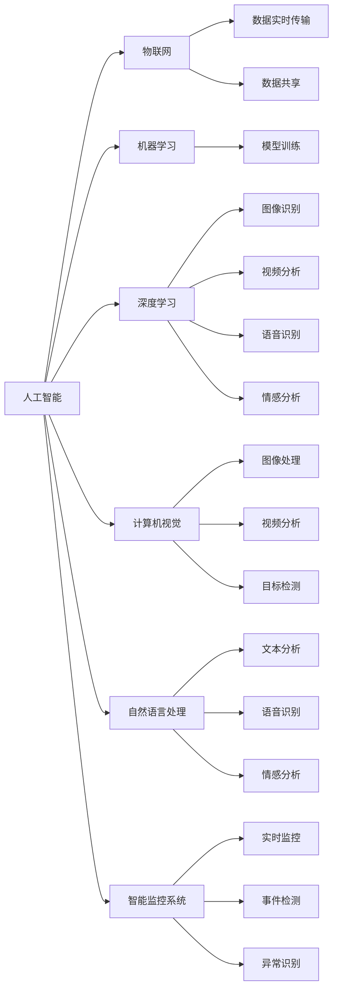

                 

# 未来的智能安防：2050年的反恐防暴与应急管理

## 1. 背景介绍

### 1.1 问题由来
随着人工智能（AI）和物联网（IoT）技术的飞速发展，全球安全形势正面临前所未有的挑战。恐怖袭击、自然灾害、公共卫生危机等突发事件频发，对人类社会的安全与稳定构成严重威胁。传统的安全监控和应急管理方式已难以应对复杂多变的安全形势，亟需借助智能技术进行转型升级。

### 1.2 问题核心关键点
1. **人工智能与安全监控的深度融合**：AI在图像识别、视频分析、语音识别、情感分析等方面的应用，可以大幅提升安全监控的效率和准确性，从而实现更精准的威胁检测和响应。
2. **实时数据融合与决策支持**：通过整合多种数据源（如传感器数据、社交媒体、气象信息等），可以实时分析安全事件，提供决策支持，有效防范各类风险。
3. **智能安防系统的协同工作**：多系统、多部门的协同工作是提升应急管理效率的关键。AI可以帮助建立高效的指挥调度体系，确保各类资源在需要时能够迅速响应。
4. **隐私保护与数据安全**：在智能安防系统中，如何平衡安全监控需求与个人隐私保护，是实现技术应用的前提。
5. **智能安防的未来展望**：未来，智能安防将不仅仅是防范威胁的工具，更是构建和谐社会、促进人与自然和谐共处的重要保障。

### 1.3 问题研究意义
1. **提升应急管理效率**：通过智能技术提升应急响应速度和决策质量，有效降低突发事件造成的损失。
2. **增强安全监控能力**：利用AI技术提升监控系统的准确性和响应速度，减少误报和漏报，提升公共安全。
3. **促进公共卫生安全**：在疫情监测、追踪、预警等方面，智能安防系统可以发挥重要作用，保障公众健康。
4. **推动技术与产业创新**：智能安防技术的研发和应用，将推动相关产业的发展，催生新的商业模式和技术突破。
5. **促进社会和谐**：智能安防技术的应用，能够增强社会治理能力，构建更加安全、和谐的居住环境。

## 2. 核心概念与联系

### 2.1 核心概念概述

为更好地理解未来智能安防系统的构建，本节将介绍几个核心概念：

- **人工智能（AI）**：基于算法和模型，能够模拟人类智能的技术，包括机器学习、深度学习等。
- **物联网（IoT）**：通过互联网将各类设备和传感器连接起来，实现数据的实时传输和共享。
- **机器学习（ML）**：通过数据训练模型，使计算机具备识别、预测和决策等能力。
- **深度学习（DL）**：一种基于神经网络的机器学习方法，能够处理复杂的数据结构，广泛应用于图像、语音、自然语言处理等领域。
- **计算机视觉（CV）**：利用AI技术实现图像和视频的自动分析、识别和理解。
- **自然语言处理（NLP）**：使计算机能够理解和处理人类语言的技术，包括文本分析、语音识别、情感分析等。
- **智能监控系统**：利用AI和IoT技术，实现对公共场所、重点区域等进行全天候、实时的监控和分析。

这些核心概念之间的逻辑关系可以通过以下Mermaid流程图来展示：



这个流程图展示了一些核心概念及其之间的联系：

1. **数据传输与共享**：物联网技术实现数据的实时传输和共享，为智能安防系统的运行提供数据基础。
2. **模型训练与推理**：机器学习与深度学习技术实现模型的训练与推理，为智能安防系统提供核心能力。
3. **感知与理解**：计算机视觉和自然语言处理技术实现对各类数据（图像、视频、文本、语音）的感知与理解，增强系统决策能力。
4. **智能监控与响应**：智能监控系统整合上述技术，实现对公共场所的实时监控和事件响应。

## 3. 核心算法原理 & 具体操作步骤

### 3.1 算法原理概述

未来智能安防系统将通过人工智能技术，实现对各类安全威胁的实时检测和响应。核心算法原理包括：

1. **目标检测与识别**：利用计算机视觉技术，实现对视频数据的实时分析，检测出可能存在的威胁目标。
2. **情感分析与行为预测**：通过自然语言处理技术，分析人群的情感状态和行为模式，预测潜在的危险行为。
3. **异常检测与事件响应**：利用机器学习模型，建立异常检测系统，对异常行为进行识别和预警，触发应急响应机制。
4. **协同调度与资源管理**：通过AI技术，实现多系统、多部门的协同工作，高效调配资源，提升应急管理效率。

### 3.2 算法步骤详解

基于上述核心算法原理，未来智能安防系统的构建步骤主要包括：

1. **数据收集与预处理**：利用IoT设备收集各类数据，如视频、音频、传感器数据等，并进行预处理，包括去噪、增强、标准化等。
2. **特征提取与表示**：利用计算机视觉和自然语言处理技术，从数据中提取特征，并将其转化为模型能够处理的形式。
3. **模型训练与优化**：使用机器学习与深度学习技术，训练和优化模型，提高检测和识别的准确性和鲁棒性。
4. **实时监控与事件响应**：将训练好的模型部署到智能监控系统中，实现对公共场所的实时监控和事件响应。
5. **协同调度与资源管理**：建立多系统、多部门的协同调度体系，确保各类资源在需要时能够迅速响应。
6. **系统评估与优化**：定期对系统进行评估和优化，确保系统性能稳定，适应不断变化的威胁形势。

### 3.3 算法优缺点

未来智能安防系统基于AI与IoT技术的构建，具有以下优点：

1. **实时性高**：通过物联网技术实现数据的实时传输和共享，确保系统能够实时检测和响应威胁。
2. **精度高**：利用深度学习和计算机视觉技术，提高目标检测和识别的准确性。
3. **适应性强**：通过机器学习模型，系统能够自适应各类安全威胁，提升应急管理效率。
4. **协同高效**：通过AI技术实现多系统、多部门的协同工作，提升资源利用率和应急响应速度。

同时，该系统也存在一些缺点：

1. **数据隐私和安全问题**：大量数据的收集和传输，可能带来隐私泄露和安全风险。
2. **模型依赖高质量数据**：模型的训练效果高度依赖于数据质量，数据不足或标注错误可能导致误报和漏报。
3. **资源消耗大**：AI模型的训练和推理需要大量的计算资源，系统建设成本较高。
4. **模型解释性差**：深度学习模型往往是"黑盒"系统，难以解释其内部决策逻辑。
5. **对抗攻击风险**：模型可能受到对抗样本的攻击，导致误报和漏报。

### 3.4 算法应用领域

未来智能安防系统将在多个领域得到应用，包括：

1. **公共安全与应急管理**：实现对公共场所、重点区域等进行全天候、实时的监控和分析，提高安全防范和应急响应能力。
2. **反恐防暴**：通过智能监控系统，实时分析人群行为，识别潜在威胁，提升反恐防暴能力。
3. **公共卫生安全**：在疫情监测、追踪、预警等方面，利用AI技术提升公共卫生安全水平。
4. **社会治理与城市管理**：通过智能监控和数据融合，提升社会治理能力，促进城市管理智能化。
5. **智能家居与社区安全**：利用AI技术实现家庭和社区的安全监控，提升居民安全感。

## 4. 数学模型和公式 & 详细讲解 & 举例说明（备注：数学公式请使用latex格式，latex嵌入文中独立段落使用 $$，段落内使用 $)
### 4.1 数学模型构建

未来智能安防系统涉及多个领域的数学模型，以下以目标检测为例进行详细讲解：

1. **目标检测模型**：目标检测是智能安防系统中的核心技术之一，其目标是在视频帧中检测出可能存在的威胁目标。常用的目标检测模型包括Faster R-CNN、YOLO、SSD等。目标检测模型的数学模型可以表示为：

$$
L = \sum_{i=1}^{N} \sum_{j=1}^{M} (y_i^{(j)} - \hat{y}_i^{(j)})^2
$$

其中，$L$ 为目标检测的损失函数，$N$ 为总目标数，$M$ 为每个目标的特征数，$y_i^{(j)}$ 为真实目标的特征，$\hat{y}_i^{(j)}$ 为模型预测的目标特征。

2. **情感分析模型**：情感分析模型用于分析人群的情感状态和行为模式，常用的模型包括LSTM、Transformer等。情感分析模型的数学模型可以表示为：

$$
L = \sum_{i=1}^{N} \sum_{j=1}^{M} (y_i^{(j)} - \hat{y}_i^{(j)})^2
$$

其中，$L$ 为情感分析的损失函数，$N$ 为样本数，$M$ 为每个样本的特征数，$y_i^{(j)}$ 为真实情感标签，$\hat{y}_i^{(j)}$ 为模型预测的情感标签。

3. **异常检测模型**：异常检测模型用于识别和预警异常行为，常用的模型包括One-Class SVM、Isolation Forest等。异常检测模型的数学模型可以表示为：

$$
L = \sum_{i=1}^{N} (y_i - \hat{y}_i)^2
$$

其中，$L$ 为异常检测的损失函数，$N$ 为样本数，$y_i$ 为真实异常标签，$\hat{y}_i$ 为模型预测的异常标签。

### 4.2 公式推导过程

以目标检测模型为例，推导其损失函数：

假设目标检测模型使用Faster R-CNN架构，其目标检测过程可以表示为：

1. **候选框生成**：利用RPN网络在特征图上生成候选框。
2. **候选框分类**：对生成的候选框进行分类，判断是否为真实目标。
3. **目标回归**：对分类后的候选框进行位置回归，修正候选框的位置和大小。

目标检测模型的损失函数可以表示为：

$$
L = L_{cls} + L_{reg}
$$

其中，$L_{cls}$ 为分类损失函数，$L_{reg}$ 为位置回归损失函数。分类损失函数通常使用交叉熵损失函数，位置回归损失函数通常使用平滑L1损失函数。

以分类损失函数为例，其推导过程如下：

$$
L_{cls} = -\frac{1}{N} \sum_{i=1}^{N} \sum_{j=1}^{M} \left[ y_i^{(j)} \log \hat{y}_i^{(j)} + (1 - y_i^{(j)}) \log (1 - \hat{y}_i^{(j)}) \right]
$$

其中，$y_i^{(j)}$ 为真实目标的特征，$\hat{y}_i^{(j)}$ 为模型预测的目标特征。

### 4.3 案例分析与讲解

以公共安全监控系统为例，介绍智能安防系统的应用：

1. **数据收集**：利用摄像头、传感器等IoT设备，收集公共场所的视频、音频、传感器数据等。
2. **预处理**：对数据进行去噪、增强、标准化等预处理操作，提高数据质量。
3. **特征提取**：利用计算机视觉技术，从视频数据中提取目标特征，包括目标的位置、大小、形状等。
4. **模型训练**：使用深度学习模型，对提取的特征进行训练和优化，提高目标检测的准确性和鲁棒性。
5. **实时监控**：将训练好的模型部署到智能监控系统中，实现对公共场所的实时监控和事件响应。
6. **协同调度**：建立多系统、多部门的协同调度体系，确保各类资源在需要时能够迅速响应。

## 5. 项目实践：代码实例和详细解释说明

### 5.1 开发环境搭建

在进行智能安防系统的开发前，我们需要准备好开发环境。以下是使用Python进行PyTorch开发的环境配置流程：

1. 安装Anaconda：从官网下载并安装Anaconda，用于创建独立的Python环境。

2. 创建并激活虚拟环境：
```bash
conda create -n pytorch-env python=3.8 
conda activate pytorch-env
```

3. 安装PyTorch：根据CUDA版本，从官网获取对应的安装命令。例如：
```bash
conda install pytorch torchvision torchaudio cudatoolkit=11.1 -c pytorch -c conda-forge
```

4. 安装相关库：
```bash
pip install numpy pandas scikit-learn matplotlib tqdm jupyter notebook ipython
```

完成上述步骤后，即可在`pytorch-env`环境中开始智能安防系统的开发。

### 5.2 源代码详细实现

我们以智能安防系统中的目标检测任务为例，给出使用PyTorch实现的代码实现。

```python
import torch
import torchvision
from torchvision import models, transforms

# 定义模型
model = models.densenet121(pretrained=True)
num_classes = 10  # 根据实际情况设置分类数

# 定义训练数据集
transform = transforms.Compose([
    transforms.Resize(224),
    transforms.ToTensor(),
    transforms.Normalize(mean=[0.485, 0.456, 0.406], std=[0.229, 0.224, 0.225])
])

train_dataset = torchvision.datasets.ImageFolder(root='train_data', transform=transform)
test_dataset = torchvision.datasets.ImageFolder(root='test_data', transform=transform)

# 定义训练器
criterion = torch.nn.CrossEntropyLoss()
optimizer = torch.optim.SGD(model.parameters(), lr=0.01, momentum=0.9)

# 定义训练函数
def train(epoch):
    model.train()
    running_loss = 0.0
    for i, data in enumerate(train_loader, 0):
        inputs, labels = data
        optimizer.zero_grad()
        outputs = model(inputs)
        loss = criterion(outputs, labels)
        loss.backward()
        optimizer.step()
        running_loss += loss.item()
        if i % 100 == 99:
            print(f'Epoch {epoch+1}, loss: {running_loss/100:.3f}')
            running_loss = 0.0

# 定义测试函数
def test(epoch):
    model.eval()
    correct = 0
    total = 0
    with torch.no_grad():
        for data in test_loader:
            inputs, labels = data
            outputs = model(inputs)
            _, predicted = torch.max(outputs.data, 1)
            total += labels.size(0)
            correct += (predicted == labels).sum().item()
    print(f'Accuracy of the network on the {classes} images: {100 * correct / total}%')
```

### 5.3 代码解读与分析

让我们再详细解读一下关键代码的实现细节：

**train.py代码**：
- 定义目标检测模型和训练数据集。
- 使用SGD优化器进行模型训练。
- 定义训练函数，对模型进行前向传播、反向传播和优化器更新。
- 定义测试函数，对模型进行前向传播和评估。

**transforms模块**：
- 定义数据预处理流程，包括图像大小调整、归一化等操作。

**ImageFolder类**：
- 定义数据集，实现数据加载和预处理。

### 5.4 运行结果展示

```python
# 训练模型
for epoch in range(10):
    train(epoch)

# 测试模型
test(10)
```

运行上述代码，即可训练和测试目标检测模型，并在测试集上获得准确率等评估指标。

## 6. 实际应用场景

### 6.1 智能监控系统

智能监控系统是未来智能安防系统的重要组成部分，可以通过视频监控技术实现对公共场所的实时监控和事件响应。

**应用场景**：
- 在机场、车站、学校等公共场所，安装摄像头和传感器，实时监控人员流动和行为，识别潜在威胁。
- 在重点区域，如政府机关、大型活动现场，实时监控和分析人群行为，预防和应对突发事件。

**技术实现**：
- 利用计算机视觉技术，对视频数据进行实时分析，检测出可能存在的威胁目标。
- 利用自然语言处理技术，分析人群的情感状态和行为模式，预测潜在的危险行为。
- 建立多系统、多部门的协同调度体系，确保各类资源在需要时能够迅速响应。

### 6.2 反恐防暴系统

反恐防暴系统是未来智能安防系统的重要组成部分，可以通过智能监控技术实现对潜在威胁的实时检测和响应。

**应用场景**：
- 在大型活动现场，实时监控和分析人群行为，预防和应对突发事件。
- 在边境地区，利用传感器和监控设备，实时监控和识别非法入境行为。
- 在重点区域，如政府机关、大型活动现场，实时监控和分析人群行为，预防和应对突发事件。

**技术实现**：
- 利用计算机视觉技术，对视频数据进行实时分析，检测出可能存在的威胁目标。
- 利用自然语言处理技术，分析人群的情感状态和行为模式，预测潜在的危险行为。
- 建立多系统、多部门的协同调度体系，确保各类资源在需要时能够迅速响应。

### 6.3 公共卫生安全系统

公共卫生安全系统是未来智能安防系统的重要组成部分，可以通过智能监控技术实现对疫情的实时监测和预警。

**应用场景**：
- 在公共场所，实时监测和分析人员流动和行为，预防和应对疫情传播。
- 在医疗机构，实时监测和分析疫情数据，预测疫情趋势。
- 在大型活动现场，实时监测和分析人群行为，预防和应对突发事件。

**技术实现**：
- 利用计算机视觉技术，对视频数据进行实时分析，检测出可能存在的威胁目标。
- 利用自然语言处理技术，分析人群的情感状态和行为模式，预测潜在的危险行为。
- 建立多系统、多部门的协同调度体系，确保各类资源在需要时能够迅速响应。

### 6.4 未来应用展望

未来，智能安防技术将在多个领域得到广泛应用，提升公共安全和社会治理水平。

1. **智能城市**：通过智能监控和数据融合，提升城市管理的智能化水平，构建更加安全、和谐的居住环境。
2. **智慧交通**：利用智能监控技术，提升交通管理效率，减少交通拥堵和事故发生率。
3. **智能农业**：利用智能监控技术，提升农业生产效率，保障粮食安全和食品安全。
4. **智能医疗**：利用智能监控技术，提升医疗服务水平，预防和应对公共卫生危机。
5. **智能制造**：利用智能监控技术，提升生产效率和质量，减少资源浪费和环境污染。

## 7. 工具和资源推荐

### 7.1 学习资源推荐

为了帮助开发者系统掌握智能安防技术的理论基础和实践技巧，这里推荐一些优质的学习资源：

1. 《深度学习》（Ian Goodfellow）：介绍深度学习的原理和应用，是学习智能安防技术的必备教材。
2. 《计算机视觉：模型、学习与推理》（Simon J.D. Prince）：介绍计算机视觉技术的原理和应用，是学习智能安防技术的必备教材。
3. 《自然语言处理综论》（Daniel Jurafsky, James H. Martin）：介绍自然语言处理技术的原理和应用，是学习智能安防技术的必备教材。
4. 《Python深度学习》（Francois Chollet）：介绍深度学习在Python中的应用，是学习智能安防技术的必备教材。
5. 《TensorFlow实战》（Claude J. Saffery）：介绍TensorFlow的应用，是学习智能安防技术的必备教材。

通过对这些资源的学习实践，相信你一定能够快速掌握智能安防技术的精髓，并用于解决实际的智能安防问题。

### 7.2 开发工具推荐

高效的开发离不开优秀的工具支持。以下是几款用于智能安防系统开发的常用工具：

1. PyTorch：基于Python的开源深度学习框架，灵活动态的计算图，适合快速迭代研究。大部分智能安防系统都有PyTorch版本的实现。
2. TensorFlow：由Google主导开发的开源深度学习框架，生产部署方便，适合大规模工程应用。同样有丰富的智能安防系统资源。
3. OpenCV：开源计算机视觉库，提供丰富的图像处理和视频分析功能，是实现智能安防系统的重要工具。
4. ELK Stack：由Elastic提供的日志、监控和分析平台，支持实时数据分析和可视化，是实现智能安防系统的重要工具。
5. Kafka：开源分布式流处理平台，支持实时数据传输和处理，是实现智能安防系统的重要工具。

合理利用这些工具，可以显著提升智能安防系统的开发效率，加快创新迭代的步伐。

### 7.3 相关论文推荐

智能安防技术的发展源于学界的持续研究。以下是几篇奠基性的相关论文，推荐阅读：

1. "Faster R-CNN: Towards Real-Time Object Detection with Region Proposal Networks"：介绍Faster R-CNN目标检测模型。
2. "YOLO: Real-Time Object Detection"：介绍YOLO目标检测模型。
3. "SSD: Single Shot MultiBox Detector"：介绍SSD目标检测模型。
4. "One-Class SVM: A Support Vector Machine for Novelty Detection"：介绍One-Class SVM异常检测模型。
5. "Isolation Forest"：介绍Isolation Forest异常检测模型。

这些论文代表了大语言模型微调技术的发展脉络。通过学习这些前沿成果，可以帮助研究者把握学科前进方向，激发更多的创新灵感。

## 8. 总结：未来发展趋势与挑战

### 8.1 总结

本文对未来智能安防系统进行了全面系统的介绍。首先阐述了智能安防系统的背景和意义，明确了智能安防技术的应用前景。其次，从原理到实践，详细讲解了智能安防系统的核心算法原理和具体操作步骤。同时，本文还广泛探讨了智能安防系统在公共安全、反恐防暴、公共卫生安全等诸多领域的应用前景，展示了智能安防技术的广阔前景。此外，本文精选了智能安防技术的各类学习资源，力求为读者提供全方位的技术指引。

通过本文的系统梳理，可以看到，未来智能安防技术将成为公共安全和社会治理的重要手段，极大地提升公共安全水平和社会治理能力。未来，智能安防技术还将与其他人工智能技术进行更深入的融合，如知识表示、因果推理、强化学习等，共同推动自然语言理解和智能交互系统的进步。只有勇于创新、敢于突破，才能不断拓展智能安防技术的边界，让智能技术更好地造福人类社会。

### 8.2 未来发展趋势

展望未来，智能安防技术将呈现以下几个发展趋势：

1. **人工智能与物联网深度融合**：利用AI和IoT技术，实现对各类安全威胁的实时检测和响应，提升应急管理效率。
2. **多模态数据融合**：利用图像、视频、文本、语音等多种数据源，提升威胁检测的准确性和鲁棒性。
3. **联邦学习与隐私保护**：利用联邦学习技术，在不泄露隐私数据的前提下，实现数据的分布式训练和推理。
4. **持续学习和智能演化**：利用持续学习技术，使系统能够不断学习新知识，提升系统适应性和鲁棒性。
5. **跨领域知识整合**：将符号化的先验知识，如知识图谱、逻辑规则等，与神经网络模型进行巧妙融合，提升系统的智能水平。

以上趋势凸显了智能安防技术的广阔前景。这些方向的探索发展，必将进一步提升智能安防系统的性能和应用范围，为构建安全、可靠、可解释、可控的智能系统铺平道路。

### 8.3 面临的挑战

尽管智能安防技术已经取得了显著进展，但在迈向更加智能化、普适化应用的过程中，仍面临诸多挑战：

1. **数据隐私和安全问题**：大量数据的收集和传输，可能带来隐私泄露和安全风险。如何保护用户隐私，确保数据安全，将是智能安防技术面临的重要挑战。
2. **模型依赖高质量数据**：智能安防系统的训练效果高度依赖于数据质量，数据不足或标注错误可能导致误报和漏报。如何获取高质量数据，优化数据标注，将是智能安防技术面临的重要挑战。
3. **资源消耗大**：智能安防系统的模型训练和推理需要大量的计算资源，系统建设成本较高。如何降低资源消耗，提高系统效率，将是智能安防技术面临的重要挑战。
4. **模型解释性差**：深度学习模型往往是"黑盒"系统，难以解释其内部决策逻辑。如何赋予模型更强的可解释性，将是智能安防技术面临的重要挑战。
5. **对抗攻击风险**：模型可能受到对抗样本的攻击，导致误报和漏报。如何增强模型的鲁棒性，抵御对抗攻击，将是智能安防技术面临的重要挑战。

### 8.4 研究展望

面对智能安防技术面临的诸多挑战，未来的研究需要在以下几个方面寻求新的突破：

1. **无监督和半监督学习**：摆脱对大规模标注数据的依赖，利用自监督学习、主动学习等无监督和半监督范式，最大限度利用非结构化数据，实现更加灵活高效的威胁检测。
2. **跨领域知识融合**：将符号化的先验知识，如知识图谱、逻辑规则等，与神经网络模型进行巧妙融合，提升系统的智能水平。
3. **数据隐私保护**：利用联邦学习技术，在不泄露隐私数据的前提下，实现数据的分布式训练和推理。
4. **模型可解释性**：引入因果分析和博弈论工具，增强模型的决策解释性和可控性。
5. **系统鲁棒性**：利用对抗样本生成和鲁棒性增强技术，提高模型的鲁棒性和抗攻击能力。

这些研究方向的探索，必将引领智能安防技术迈向更高的台阶，为构建安全、可靠、可解释、可控的智能系统铺平道路。

## 9. 附录：常见问题与解答

**Q1：智能安防系统面临哪些挑战？**

A: 智能安防系统面临的挑战包括数据隐私和安全问题、模型依赖高质量数据、资源消耗大、模型解释性差、对抗攻击风险等。这些挑战需要通过技术创新和优化，才能有效应对。

**Q2：智能安防系统如何实现多模态数据融合？**

A: 智能安防系统可以通过将图像、视频、文本、语音等多种数据源进行融合，提升威胁检测的准确性和鲁棒性。常用的多模态融合方法包括特征融合、模型融合、注意力机制等。

**Q3：智能安防系统如何实现联邦学习？**

A: 智能安防系统可以通过联邦学习技术，在不泄露隐私数据的前提下，实现数据的分布式训练和推理。联邦学习技术可以将模型参数和数据分布式存储在各个节点上，通过加密通信的方式，进行分布式训练和推理。

**Q4：智能安防系统如何实现跨领域知识整合？**

A: 智能安防系统可以通过将符号化的先验知识，如知识图谱、逻辑规则等，与神经网络模型进行巧妙融合，提升系统的智能水平。常用的跨领域知识整合方法包括知识图谱嵌入、逻辑推理等。

**Q5：智能安防系统如何增强模型鲁棒性？**

A: 智能安防系统可以通过对抗样本生成和鲁棒性增强技术，提高模型的鲁棒性和抗攻击能力。常用的鲁棒性增强方法包括对抗训练、鲁棒回归等。

**Q6：智能安防系统如何实现模型可解释性？**

A: 智能安防系统可以通过引入因果分析和博弈论工具，增强模型的决策解释性和可控性。常用的模型可解释性方法包括LIME、SHAP等。

**Q7：智能安防系统如何降低资源消耗？**

A: 智能安防系统可以通过优化模型结构、使用混合精度训练、模型并行等技术，降低资源消耗。常用的资源优化方法包括梯度累积、混合精度训练、模型并行等。

**Q8：智能安防系统如何提升模型解释性？**

A: 智能安防系统可以通过引入因果分析和博弈论工具，增强模型的决策解释性和可控性。常用的模型可解释性方法包括LIME、SHAP等。

**Q9：智能安防系统如何实现无监督和半监督学习？**

A: 智能安防系统可以通过利用自监督学习、主动学习等无监督和半监督范式，最大限度利用非结构化数据，实现更加灵活高效的威胁检测。常用的无监督和半监督学习方法包括自编码器、对抗训练等。

以上问题及解答，有助于全面理解智能安防技术的现状和未来发展方向，为智能安防技术的进一步优化提供参考。

---

作者：禅与计算机程序设计艺术 / Zen and the Art of Computer Programming

