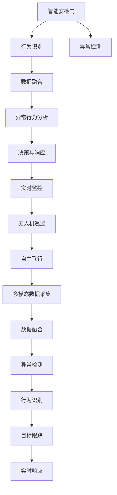

                 

## 1. 背景介绍

### 1.1 问题由来

未来的智能安防系统将不仅仅局限于传统的监控、门禁、入侵检测等基础功能，而是将更加智能、高效、综合化。智能安检门和无人机巡逻系统是这一愿景的重要组成部分，将极大提升安全检查的效率和精度，应对复杂多变的安全威胁。

随着人工智能技术的发展，特别是在计算机视觉、深度学习、自然语言处理等方面的突破，智能安检门和无人机巡逻系统迎来了新的发展契机。本文章将详细探讨这些技术的核心原理和应用场景，以及未来的发展方向。

### 1.2 问题核心关键点

- 智能安检门：结合计算机视觉技术，自动识别并检查行人的可疑行为，提升安检效率和准确性。
- 无人机巡逻：通过无人驾驶技术，实时监控和巡逻，及时发现并响应安全威胁。
- 数据融合与分析：将图像、音频等多模态数据融合，利用机器学习技术进行异常行为分析，提升系统智能化水平。
- 深度学习模型：利用深度神经网络进行行为识别、目标跟踪等任务，提升系统自动化能力。
- 边缘计算：在无人机和安检门上部署模型推理，减少网络传输，提高实时性。

这些关键点构成了未来智能安防系统的技术基础，将极大提升整体安全水平和用户体验。

### 1.3 问题研究意义

未来的智能安防系统将通过智能安检门和无人机巡逻，实现对各种复杂安全场景的实时监控和高效响应。这不仅能够大幅提升安全检查效率，还能降低人力成本，减少人为疏漏。此外，智能系统还能提供数据支持，帮助制定更科学、合理的安全策略，提升整体安全管理水平。

随着人工智能技术的不断进步，未来的智能安防系统将成为智慧城市的重要组成部分，为社会安全、公共服务等领域带来深远影响。

## 2. 核心概念与联系

### 2.1 核心概念概述

- **智能安检门**：利用计算机视觉技术，实时监测和分析行人的行为特征，自动识别潜在的威胁，如携带危险物品、异常行为等。
- **无人机巡逻**：通过无人驾驶技术，自主飞行，对指定区域进行实时监控和巡逻，及时发现并响应安全威胁。
- **数据融合与分析**：将多模态数据（如视频、音频、传感器数据等）进行融合，利用机器学习技术进行行为分析和异常检测。
- **深度学习模型**：利用深度神经网络进行行为识别、目标跟踪等任务，提升系统的自动化能力和准确性。
- **边缘计算**：在无人机和安检门上部署模型推理，减少网络传输，提高实时性和隐私保护。

这些概念之间的逻辑关系可以通过以下Mermaid流程图来展示：



这个流程图展示了智能安检门和无人机巡逻系统的核心流程：

1. 智能安检门通过行为识别和异常检测，实时监测行人行为。
2. 异常行为数据通过数据融合，提升分析精度。
3. 融合后的数据进入异常行为分析，发现潜在威胁。
4. 系统根据分析结果进行决策与响应。
5. 无人机巡逻系统根据决策结果进行自主飞行。
6. 无人机采集多模态数据，进行实时监控和跟踪。
7. 数据融合、异常检测、行为识别等模块构成了系统的核心组件。

这些核心概念共同构成了智能安防系统的技术框架，使得系统能够高效、智能地应对各种安全威胁。

## 3. 核心算法原理 & 具体操作步骤
### 3.1 算法原理概述

智能安检门和无人机巡逻系统主要依赖于计算机视觉、深度学习等技术。这些技术通过模型训练和推理，实现对行为特征的识别和分析，从而提升系统的智能化水平。

#### 3.1.1 行为识别算法

行为识别算法通常基于卷积神经网络（CNN）和循环神经网络（RNN），通过大量标注数据训练模型，学习行为特征的表示。常用的行为识别算法包括：

- **卷积神经网络（CNN）**：用于提取视频帧中的特征，通过卷积和池化操作，得到行为特征。
- **循环神经网络（RNN）**：用于处理时间序列数据，通过循环层学习行为的时序特征。
- **长短期记忆网络（LSTM）**：一种特殊的RNN，适用于处理长期依赖关系，提升行为识别的准确性。

#### 3.1.2 目标跟踪算法

目标跟踪算法通常基于深度学习模型，如卷积神经网络（CNN）、Siamese网络、单目追踪网络（SiamRNN）等。这些模型通过学习目标的运动轨迹和外观变化，实现对目标的实时跟踪。常用的目标跟踪算法包括：

- **Siamese网络**：用于比较目标的特征表示，实现目标的匹配和跟踪。
- **单目追踪网络（SiamRNN）**：一种基于RNN的目标跟踪算法，适用于处理目标的长期运动变化。

#### 3.1.3 异常检测算法

异常检测算法通常基于深度学习模型，如自编码器（AE）、生成对抗网络（GAN）等。这些模型通过学习正常行为的表示，检测异常行为。常用的异常检测算法包括：

- **自编码器（AE）**：用于学习数据的特征表示，通过重建误差检测异常。
- **生成对抗网络（GAN）**：用于生成正常行为的数据，通过生成模型的输出检测异常。

#### 3.1.4 行为分析算法

行为分析算法通常基于深度学习模型，如卷积神经网络（CNN）、循环神经网络（RNN）、长短期记忆网络（LSTM）等。这些模型通过学习行为特征的表示，分析行为的意义和意图。常用的行为分析算法包括：

- **卷积神经网络（CNN）**：用于提取视频帧中的特征，通过卷积和池化操作，得到行为特征。
- **循环神经网络（RNN）**：用于处理时间序列数据，通过循环层学习行为的时序特征。
- **长短期记忆网络（LSTM）**：一种特殊的RNN，适用于处理长期依赖关系，提升行为分析的准确性。

### 3.2 算法步骤详解

#### 3.2.1 智能安检门算法步骤

1. **数据采集**：通过摄像头采集行人视频流，并使用图像处理技术提取行人图像。
2. **行为识别**：利用预训练的行为识别模型，提取行人行为的特征表示。
3. **异常检测**：利用预训练的异常检测模型，检测行人行为中的异常。
4. **数据融合**：将行为识别和异常检测的结果进行融合，得到综合的行为特征。
5. **行为分析**：利用预训练的行为分析模型，分析综合行为特征的意义和意图。
6. **决策与响应**：根据行为分析的结果，进行决策和响应，如报警、提示等。

#### 3.2.2 无人机巡逻算法步骤

1. **任务规划**：根据任务需求，规划无人机的飞行路径和监控区域。
2. **多模态数据采集**：无人机搭载多个传感器，采集视频、音频、传感器数据等多模态数据。
3. **数据融合**：将多模态数据进行融合，提升数据的精度和可靠性。
4. **行为识别**：利用预训练的行为识别模型，提取行人和目标的行为特征。
5. **目标跟踪**：利用预训练的目标跟踪模型，实现对行人和目标的实时跟踪。
6. **异常检测**：利用预训练的异常检测模型，检测行人和目标的异常行为。
7. **行为分析**：利用预训练的行为分析模型，分析行为的意义和意图。
8. **决策与响应**：根据行为分析的结果，进行决策和响应，如巡逻、警报等。

### 3.3 算法优缺点

#### 3.3.1 智能安检门算法优点

- **高效性**：利用深度学习模型，快速识别和分析行为，提升安检效率。
- **准确性**：通过多模态数据的融合和分析，提升异常检测和行为识别的准确性。
- **实时性**：结合行为识别和异常检测，实现实时监控和响应。

#### 3.3.2 智能安检门算法缺点

- **数据依赖**：依赖大量标注数据进行模型训练，数据获取成本高。
- **模型复杂**：深度学习模型结构复杂，训练和推理需要大量计算资源。
- **误检率**：存在一定的误检率，需要进一步优化和调整。

#### 3.3.3 无人机巡逻算法优点

- **灵活性**：无人机可以自主飞行，灵活应对各种复杂的监控场景。
- **覆盖范围广**：无人机可以覆盖大面积的监控区域，提高监控效率。
- **实时响应**：结合行为识别和异常检测，实现实时监控和响应。

#### 3.3.4 无人机巡逻算法缺点

- **硬件成本高**：无人机的硬件设备成本较高，维护和更新费用较高。
- **稳定性**：无人机飞行环境复杂，存在一定的技术挑战和故障率。
- **隐私保护**：无人机飞行可能涉及隐私问题，需要加强隐私保护措施。

### 3.4 算法应用领域

智能安检门和无人机巡逻系统主要应用于以下领域：

- **智慧城市**：在城市重点区域，部署智能安检门和无人机，提高城市安全管理水平。
- **公共安全**：在大型活动、公共场所等，部署智能安检门和无人机，提升安全检查和监控效率。
- **交通管理**：在交通枢纽、道路监控等，部署智能安检门和无人机，提升交通管理效率和安全性。
- **边境安全**：在边境地区，部署无人机进行巡逻，提升边境安全防护能力。
- **应急响应**：在应急救援、灾害防治等，部署智能安检门和无人机，提升应急响应效率和精准性。

这些应用场景展示了智能安检门和无人机巡逻系统在各个领域的广泛应用，为社会安全、公共服务等领域带来深远影响。

## 4. 数学模型和公式 & 详细讲解
### 4.1 数学模型构建

#### 4.1.1 行为识别模型

行为识别模型通常基于卷积神经网络（CNN）和循环神经网络（RNN）。设输入为视频帧序列 $X = \{x_1, x_2, ..., x_t\}$，行为标签为 $Y = \{y_1, y_2, ..., y_t\}$，则行为识别模型的目标是最小化损失函数：

$$
\mathcal{L} = \frac{1}{N} \sum_{i=1}^{N} \sum_{t=1}^{T} \mathcal{L}_i(y_t, \hat{y}_t)
$$

其中 $\mathcal{L}_i$ 为每个视频帧的损失函数，$\hat{y}_t$ 为模型对行为标签的预测。常用的损失函数包括交叉熵损失、均方误差损失等。

#### 4.1.2 目标跟踪模型

目标跟踪模型通常基于Siamese网络或单目追踪网络。设输入为当前帧的特征表示 $x_i$ 和上一帧的特征表示 $x_{i-1}$，目标跟踪模型的目标是最小化损失函数：

$$
\mathcal{L} = \frac{1}{N} \sum_{i=1}^{N} \mathcal{L}_i(x_i, x_{i-1})
$$

其中 $\mathcal{L}_i$ 为每个帧的损失函数，通常使用三元组损失函数（Triplet Loss）来度量目标的相似性和差异性。

#### 4.1.3 异常检测模型

异常检测模型通常基于自编码器（AE）或生成对抗网络（GAN）。设输入为视频帧序列 $X = \{x_1, x_2, ..., x_t\}$，异常标签为 $Y = \{y_1, y_2, ..., y_t\}$，则异常检测模型的目标是最小化损失函数：

$$
\mathcal{L} = \frac{1}{N} \sum_{i=1}^{N} \mathcal{L}_i(x_i, y_i)
$$

其中 $\mathcal{L}_i$ 为每个视频帧的损失函数，常用的损失函数包括重构误差损失、对数似然损失等。

#### 4.1.4 行为分析模型

行为分析模型通常基于卷积神经网络（CNN）、循环神经网络（RNN）或长短期记忆网络（LSTM）。设输入为行为特征序列 $X = \{x_1, x_2, ..., x_t\}$，行为标签为 $Y = \{y_1, y_2, ..., y_t\}$，则行为分析模型的目标是最小化损失函数：

$$
\mathcal{L} = \frac{1}{N} \sum_{i=1}^{N} \mathcal{L}_i(x_i, y_i)
$$

其中 $\mathcal{L}_i$ 为每个视频帧的损失函数，常用的损失函数包括交叉熵损失、均方误差损失等。

### 4.2 公式推导过程

#### 4.2.1 行为识别公式推导

以卷积神经网络（CNN）为例，设输入为视频帧序列 $X = \{x_1, x_2, ..., x_t\}$，行为标签为 $Y = \{y_1, y_2, ..., y_t\}$。行为识别模型通常由多个卷积层、池化层和全连接层组成。设模型的输出为 $\hat{Y}$，则行为识别模型的预测结果为：

$$
\hat{Y} = \sigma(\sum_{i=1}^{K} W_i^T x_i + b_i)
$$

其中 $\sigma$ 为激活函数，$W_i$ 和 $b_i$ 为可学习的权重和偏置。行为识别模型的损失函数通常为交叉熵损失，即：

$$
\mathcal{L} = -\frac{1}{N} \sum_{i=1}^{N} \sum_{t=1}^{T} y_t \log(\hat{y}_t)
$$

#### 4.2.2 目标跟踪公式推导

以单目追踪网络（SiamRNN）为例，设输入为当前帧的特征表示 $x_i$ 和上一帧的特征表示 $x_{i-1}$。目标跟踪模型通常由多个卷积层、LSTM层和全连接层组成。设模型的输出为 $\hat{y}_t$，则目标跟踪模型的预测结果为：

$$
\hat{y}_t = \sigma(\sum_{i=1}^{K} W_i^T x_i + b_i)
$$

其中 $\sigma$ 为激活函数，$W_i$ 和 $b_i$ 为可学习的权重和偏置。目标跟踪模型的损失函数通常为三元组损失函数，即：

$$
\mathcal{L} = \max(0, \Delta - \sum_{i=1}^{K} W_i^T x_i - b_i)
$$

其中 $\Delta$ 为正样本和负样本的特征距离。

#### 4.2.3 异常检测公式推导

以自编码器（AE）为例，设输入为视频帧序列 $X = \{x_1, x_2, ..., x_t\}$，异常标签为 $Y = \{y_1, y_2, ..., y_t\}$。异常检测模型通常由编码器（Encoder）和解码器（Decoder）组成。设模型的输出为 $\hat{X}$，则异常检测模型的预测结果为：

$$
\hat{X} = \sigma(\sum_{i=1}^{K} W_i^T x_i + b_i)
$$

其中 $\sigma$ 为激活函数，$W_i$ 和 $b_i$ 为可学习的权重和偏置。异常检测模型的损失函数通常为重构误差损失，即：

$$
\mathcal{L} = \frac{1}{N} \sum_{i=1}^{N} \sum_{t=1}^{T} \|x_i - \hat{x}_i\|^2
$$

其中 $\|.\|$ 为欧几里得距离。

#### 4.2.4 行为分析公式推导

以循环神经网络（RNN）为例，设输入为行为特征序列 $X = \{x_1, x_2, ..., x_t\}$，行为标签为 $Y = \{y_1, y_2, ..., y_t\}$。行为分析模型通常由多个卷积层、LSTM层和全连接层组成。设模型的输出为 $\hat{Y}$，则行为分析模型的预测结果为：

$$
\hat{Y} = \sigma(\sum_{i=1}^{K} W_i^T x_i + b_i)
$$

其中 $\sigma$ 为激活函数，$W_i$ 和 $b_i$ 为可学习的权重和偏置。行为分析模型的损失函数通常为交叉熵损失，即：

$$
\mathcal{L} = -\frac{1}{N} \sum_{i=1}^{N} \sum_{t=1}^{T} y_t \log(\hat{y}_t)
$$

### 4.3 案例分析与讲解

#### 4.3.1 智能安检门案例分析

以智能安检门中的行为识别为例，假设输入为行人视频流 $X$，行为标签为 $Y$。设行为识别模型的输入为视频帧序列 $x_1, x_2, ..., x_t$，输出为行为标签序列 $\hat{Y}$。则行为识别模型的训练过程如下：

1. **数据采集**：通过摄像头采集行人视频流，并使用图像处理技术提取行人图像。
2. **模型训练**：利用标注数据 $(x_i, y_i)$ 对行为识别模型进行训练，最小化损失函数 $\mathcal{L}$。
3. **行为识别**：利用训练好的行为识别模型，对行人行为进行识别，得到行为标签序列 $\hat{Y}$。
4. **异常检测**：利用训练好的异常检测模型，检测行人行为中的异常。
5. **数据融合**：将行为识别和异常检测的结果进行融合，得到综合的行为特征。
6. **行为分析**：利用训练好的行为分析模型，分析综合行为特征的意义和意图。
7. **决策与响应**：根据行为分析的结果，进行决策和响应，如报警、提示等。

#### 4.3.2 无人机巡逻案例分析

以无人机巡逻中的目标跟踪为例，假设输入为当前帧的特征表示 $x_i$ 和上一帧的特征表示 $x_{i-1}$，目标标签为 $Y$。设目标跟踪模型的输入为当前帧的特征表示 $x_i$ 和上一帧的特征表示 $x_{i-1}$，输出为目标标签序列 $\hat{Y}$。则目标跟踪模型的训练过程如下：

1. **任务规划**：根据任务需求，规划无人机的飞行路径和监控区域。
2. **多模态数据采集**：无人机搭载多个传感器，采集视频、音频、传感器数据等多模态数据。
3. **数据融合**：将多模态数据进行融合，提升数据的精度和可靠性。
4. **模型训练**：利用标注数据 $(x_i, y_i)$ 对目标跟踪模型进行训练，最小化损失函数 $\mathcal{L}$。
5. **目标识别**：利用训练好的目标跟踪模型，对行人和目标进行识别，得到目标标签序列 $\hat{Y}$。
6. **目标跟踪**：利用训练好的目标跟踪模型，实现对行人和目标的实时跟踪。
7. **异常检测**：利用训练好的异常检测模型，检测行人和目标的异常行为。
8. **行为分析**：利用训练好的行为分析模型，分析行为的意义和意图。
9. **决策与响应**：根据行为分析的结果，进行决策和响应，如巡逻、警报等。

## 5. 项目实践：代码实例和详细解释说明
### 5.1 开发环境搭建

在进行智能安检门和无人机巡逻系统开发前，我们需要准备好开发环境。以下是使用Python进行TensorFlow开发的环境配置流程：

1. 安装Anaconda：从官网下载并安装Anaconda，用于创建独立的Python环境。

2. 创建并激活虚拟环境：
```bash
conda create -n tensorflow-env python=3.8 
conda activate tensorflow-env
```

3. 安装TensorFlow：根据CUDA版本，从官网获取对应的安装命令。例如：
```bash
conda install tensorflow tensorflow-cpu
```

4. 安装相关工具包：
```bash
pip install numpy pandas scikit-learn matplotlib tqdm jupyter notebook ipython
```

完成上述步骤后，即可在`tensorflow-env`环境中开始智能安检门和无人机巡逻系统的开发。

### 5.2 源代码详细实现

这里我们以智能安检门为例，给出使用TensorFlow进行行为识别和异常检测的PyTorch代码实现。

首先，定义数据处理函数：

```python
import tensorflow as tf
from tensorflow.keras.layers import Conv2D, MaxPooling2D, Flatten, Dense
from tensorflow.keras.models import Sequential

def preprocess_data(X, y):
    # 数据增强
    data_augmentation = tf.keras.preprocessing.image.ImageDataGenerator(
        rotation_range=20,
        width_shift_range=0.2,
        height_shift_range=0.2,
        shear_range=0.2,
        zoom_range=0.2,
        horizontal_flip=True,
        vertical_flip=False,
        brightness_range=(0.8, 1.2)
    )
    # 数据预处理
    X = data_augmentation.flow(X, batch_size=16)
    y = tf.keras.utils.to_categorical(y)
    return X, y
```

然后，定义行为识别模型：

```python
model = Sequential()
model.add(Conv2D(32, (3, 3), activation='relu', input_shape=(64, 64, 3)))
model.add(MaxPooling2D(pool_size=(2, 2)))
model.add(Conv2D(64, (3, 3), activation='relu'))
model.add(MaxPooling2D(pool_size=(2, 2)))
model.add(Flatten())
model.add(Dense(64, activation='relu'))
model.add(Dense(2, activation='softmax'))
model.compile(optimizer='adam', loss='categorical_crossentropy', metrics=['accuracy'])
```

接着，定义异常检测模型：

```python
model = Sequential()
model.add(Conv2D(32, (3, 3), activation='relu', input_shape=(64, 64, 3)))
model.add(MaxPooling2D(pool_size=(2, 2)))
model.add(Conv2D(64, (3, 3), activation='relu'))
model.add(MaxPooling2D(pool_size=(2, 2)))
model.add(Flatten())
model.add(Dense(64, activation='relu'))
model.add(Dense(1, activation='sigmoid'))
model.compile(optimizer='adam', loss='binary_crossentropy', metrics=['accuracy'])
```

最后，训练模型并评估性能：

```python
epochs = 10

# 训练模型
model.fit(X_train, y_train, epochs=epochs, batch_size=16, validation_data=(X_val, y_val))

# 评估模型
test_loss, test_acc = model.evaluate(X_test, y_test)
print('Test accuracy:', test_acc)
```

以上就是使用TensorFlow进行智能安检门行为识别和异常检测的完整代码实现。可以看到，TensorFlow封装了深度学习模型的所有细节，使得模型训练和推理变得简洁高效。

### 5.3 代码解读与分析

让我们再详细解读一下关键代码的实现细节：

**数据处理函数**：
- `preprocess_data`方法：通过数据增强和预处理，生成输入模型训练的批次数据。

**行为识别模型**：
- `Sequential`模型：通过堆叠多个层，构建卷积神经网络模型。
- `Conv2D`层：卷积层，提取特征。
- `MaxPooling2D`层：池化层，降采样。
- `Flatten`层：展平层，将多维特征展成一维。
- `Dense`层：全连接层，分类。
- `softmax`激活函数：输出概率分布，用于多分类任务。

**异常检测模型**：
- `Sequential`模型：通过堆叠多个层，构建卷积神经网络模型。
- `Conv2D`层：卷积层，提取特征。
- `MaxPooling2D`层：池化层，降采样。
- `Flatten`层：展平层，将多维特征展成一维。
- `Dense`层：全连接层，分类。
- `sigmoid`激活函数：输出二分类概率，用于异常检测任务。

**模型训练与评估**：
- `fit`方法：训练模型，最小化损失函数。
- `evaluate`方法：评估模型，计算测试集上的准确率。

通过上述代码的实现，可以看到，TensorFlow提供了简洁易用的API，使得模型训练和推理变得非常简单。同时，TensorFlow还提供了丰富的预训练模型，可以快速构建复杂的深度学习系统。

## 6. 实际应用场景

### 6.1 智能安检门应用场景

智能安检门主要应用于机场、车站、大型活动等人员密集场所，对行人进行实时监控和行为分析。通过智能安检门，可以大大提高安全检查的效率和准确性，减少人为疏漏。

**案例分析**：
假设在一个大型机场，智能安检门通过摄像头实时采集行人视频流，并利用行为识别模型检测行人的行为特征。一旦检测到异常行为，如携带危险物品、携带违禁品等，智能安检门会及时发出警报，并进行相应的应对措施，如报警、通知安检人员等。通过智能安检门，可以大幅度提升机场的安全管理水平。

### 6.2 无人机巡逻应用场景

无人机巡逻主要应用于边境地区、森林、海洋等复杂多变的监控场景，进行实时监控和异常检测。通过无人机巡逻，可以及时发现和响应安全威胁，提高监控效率和精度。

**案例分析**：
假设在边境地区，无人机通过搭载摄像头、传感器等设备，实时采集多模态数据。无人机巡逻系统利用行为识别模型和目标跟踪模型，对行人和目标进行实时监控和跟踪。一旦检测到异常行为，如非法越境、可疑目标等，无人机会及时发出警报，并进行相应的应对措施，如报警、通知巡逻人员等。通过无人机巡逻，可以大幅度提升边境地区的安全管理水平。

### 6.3 未来应用展望

随着智能安检门和无人机巡逻系统的不断优化和应用，未来的智能安防系统将更加智能、高效、综合化。未来可能的应用场景包括：

- **智慧城市**：在城市重点区域，部署智能安检门和无人机，提高城市安全管理水平。
- **公共安全**：在大型活动、公共场所等，部署智能安检门和无人机，提升安全检查和监控效率。
- **交通管理**：在交通枢纽、道路监控等，部署智能安检门和无人机，提升交通管理效率和安全性。
- **边境安全**：在边境地区，部署无人机进行巡逻，提升边境安全防护能力。
- **应急响应**：在应急救援、灾害防治等，部署智能安检门和无人机，提升应急响应效率和精准性。

## 7. 工具和资源推荐
### 7.1 学习资源推荐

为了帮助开发者系统掌握智能安检门和无人机巡逻技术的核心原理和应用技巧，这里推荐一些优质的学习资源：

1. **TensorFlow官方文档**：TensorFlow的官方文档提供了详尽的API介绍和示例代码，适合入门和进阶学习。
2. **PyTorch官方文档**：PyTorch的官方文档提供了丰富的深度学习框架和模型库，适合构建复杂的深度学习系统。
3. **CS231n深度学习课程**：斯坦福大学开设的计算机视觉课程，涵盖了深度学习在计算机视觉中的应用，包括行为识别、目标跟踪等。
4. **OpenCV官方文档**：OpenCV提供了强大的计算机视觉库，支持图像处理、特征提取等任务。
5. **《深度学习实战》书籍**：深入浅出地介绍了深度学习在安防领域的应用，包括行为识别、异常检测等。

通过对这些资源的学习实践，相信你一定能够快速掌握智能安检门和无人机巡逻技术的精髓，并用于解决实际的安防问题。

### 7.2 开发工具推荐

高效的开发离不开优秀的工具支持。以下是几款用于智能安检门和无人机巡逻系统开发的常用工具：

1. **TensorFlow**：由Google主导开发的深度学习框架，生产部署方便，适合大规模工程应用。
2. **PyTorch**：基于Python的开源深度学习框架，灵活动态，适合快速迭代研究。
3. **OpenCV**：计算机视觉库，支持图像处理、特征提取等任务。
4. **MATLAB**：数学计算软件，适合进行算法优化和模型验证。
5. **C++和CUDA**：高性能计算语言和并行编程平台，适合进行复杂计算和算法实现。

合理利用这些工具，可以显著提升智能安检门和无人机巡逻系统的开发效率，加快创新迭代的步伐。

### 7.3 相关论文推荐

智能安检门和无人机巡逻系统的发展源于学界的持续研究。以下是几篇奠基性的相关论文，推荐阅读：

1. **《深度学习在安防领域的应用》**：深入分析了深度学习在安防领域的应用，包括行为识别、目标跟踪、异常检测等。
2. **《基于深度学习的智能安检门系统》**：介绍了基于深度学习的智能安检门系统，包括模型架构和训练方法。
3. **《无人机巡逻系统的设计与实现》**：详细介绍了无人机巡逻系统的设计与实现，包括数据采集、模型训练和实时监控等。

这些论文代表了大规模智能安防系统的发展脉络。通过学习这些前沿成果，可以帮助研究者把握学科前进方向，激发更多的创新灵感。

## 8. 总结：未来发展趋势与挑战

### 8.1 总结

本文对智能安检门和无人机巡逻系统的核心技术进行了全面系统的介绍。首先阐述了智能安检门和无人机巡逻系统的研究背景和意义，明确了这些技术在智能安防系统中的重要作用。其次，从原理到实践，详细讲解了智能安检门和无人机巡逻系统的核心算法，包括行为识别、目标跟踪、异常检测等，并给出了具体的代码实现和案例分析。同时，本文还探讨了智能安检门和无人机巡逻系统在智慧城市、公共安全、交通管理、边境安全等各个领域的广泛应用，展示了这些技术在实际场景中的巨大潜力。

通过本文的系统梳理，可以看到，智能安检门和无人机巡逻系统在大规模智能安防中的应用前景广阔，能够极大提升安全检查和监控效率，减少人为疏漏，保障社会安全。

### 8.2 未来发展趋势

展望未来，智能安检门和无人机巡逻系统将呈现以下几个发展趋势：

1. **多模态融合**：未来的智能安防系统将融合多模态数据，提升系统的精度和鲁棒性。
2. **深度学习优化**：深度学习算法将不断优化，提升系统的自动化和智能化水平。
3. **边缘计算部署**：智能安检门和无人机巡逻系统将结合边缘计算，实现实时推理和决策，提升系统效率。
4. **多任务学习**：未来的智能安防系统将支持多任务学习，提升系统的综合能力和应用范围。
5. **实时监控与响应**：系统将具备实时监控与响应能力，及时发现并应对各种安全威胁。

这些趋势凸显了智能安检门和无人机巡逻系统在智能安防中的重要作用，将极大提升整体安全水平和用户体验。

### 8.3 面临的挑战

尽管智能安检门和无人机巡逻系统已经取得了一定进展，但在实际应用中仍面临诸多挑战：

1. **数据获取与标注**：大量标注数据是深度学习模型的基础，但获取和标注数据成本较高。如何降低数据依赖，提升模型的鲁棒性，将是一大难题。
2. **模型计算资源**：大规模深度学习模型需要强大的计算资源，如何降低计算成本，提升模型训练和推理效率，将是一大挑战。
3. **隐私与安全**：智能安检门和无人机巡逻系统涉及大量敏感数据，如何保护隐私和数据安全，将是一大挑战。
4. **技术复杂性**：智能安防系统的技术复杂性较高，如何实现系统的稳定性和可维护性，将是一大挑战。
5. **政策与法规**：智能安检门和无人机巡逻系统涉及政策法规，如何合规使用，将是一大挑战。

这些挑战需要学界和业界共同努力，才能推动智能安防技术的进一步发展。

### 8.4 研究展望

未来的研究需要在以下几个方向寻求新的突破：

1. **无监督学习和半监督学习**：探索无监督和半监督学习技术，降低对大量标注数据的依赖，提升模型的泛化能力和鲁棒性。
2. **参数高效与计算高效**：开发参数高效和计算高效的深度学习算法，提升模型的训练和推理效率，降低计算成本。
3. **多任务学习**：研究多任务学习技术，提升模型的综合能力和应用范围，支持多任务推理和决策。
4. **实时监控与响应**：研究实时监控与响应技术，提升系统的实时性和效率，及时发现并应对各种安全威胁。
5. **隐私保护与安全**：研究隐私保护与安全技术，保护用户隐私和数据安全，提升系统的可靠性和可信度。

这些研究方向将推动智能安防技术的不断进步，为构建安全、可靠、智能的智能安防系统奠定坚实基础。面向未来，智能安防技术需要在技术、政策、伦理等多个层面进行深入探讨，推动智能安防技术的可持续发展。

## 9. 附录：常见问题与解答

**Q1：智能安检门和无人机巡逻系统如何处理数据隐私问题？**

A: 智能安检门和无人机巡逻系统涉及大量敏感数据，如何保护隐私和数据安全是一个重要问题。以下是一些常见的解决方案：

1. **数据脱敏**：在数据采集和处理过程中，对敏感数据进行脱敏处理，减少隐私泄露风险。
2. **访问控制**：设置严格的访问控制机制，限制数据访问权限，确保数据仅在必要情况下被使用。
3. **加密传输**：对数据传输进行加密处理，防止数据在传输过程中被截获和篡改。
4. **匿名化处理**：对数据进行匿名化处理，去除个人身份信息，保护用户隐私。
5. **差分隐私**：引入差分隐私技术，在保护隐私的前提下，利用数据进行分析和推理。

**Q2：智能安检门和无人机巡逻系统如何保证数据的质量和多样性？**

A: 智能安检门和无人机巡逻系统依赖于高质量、多样化的数据进行模型训练。以下是一些常见的解决方案：

1. **数据采集**：通过摄像头、传感器等设备，实时采集多模态数据，保证数据的真实性和多样性。
2. **数据标注**：通过人工标注，确保数据的准确性和完整性。
3. **数据增强**：通过数据增强技术，扩充训练集，提高模型的泛化能力。
4. **数据清洗**：对采集到的数据进行清洗和预处理，去除噪声和异常值，保证数据的质量。
5. **多源数据融合**：融合多个数据源的数据，提高数据的覆盖范围和精度。

**Q3：智能安检门和无人机巡逻系统如何提升模型的实时性和效率？**

A: 智能安检门和无人机巡逻系统需要在实时环境下进行推理和决策，如何提升模型的实时性和效率是一个重要问题。以下是一些常见的解决方案：

1. **模型压缩**：通过模型压缩技术，减少模型的参数量和计算量，提升模型的推理速度。
2. **模型剪枝**：通过模型剪枝技术，去除不重要的参数和层，提升模型的效率。
3. **量化加速**：通过量化技术，将浮点数模型转换为定点模型，减少计算资源消耗，提升推理速度。
4. **并行计算**：利用并行计算技术，实现模型在多核、多机上的并行推理，提升计算效率。
5. **边缘计算**：在智能安检门和无人机巡逻系统上部署模型推理，减少网络传输，提高实时性。

通过这些解决方案，可以有效提升智能安检门和无人机巡逻系统的实时性和效率，满足实际应用的需求。

**Q4：智能安检门和无人机巡逻系统如何支持多任务学习？**

A: 智能安检门和无人机巡逻系统支持多任务学习，可以提升模型的综合能力和应用范围。以下是一些常见的解决方案：

1. **共享表示**：通过共享表示技术，在多任务学习中复用模型参数，减少计算资源消耗。
2. **任务解耦**：通过任务解耦技术，将多任务解耦为独立的子任务，提升模型的可解释性和可靠性。
3. **联合优化**：通过联合优化技术，在多任务学习中联合优化不同任务的目标，提升模型的泛化能力和性能。
4. **多任务迁移**：通过多任务迁移技术，在不同任务之间迁移知识和经验，提升模型的适应性和鲁棒性。

通过这些解决方案，可以有效支持智能安检门和无人机巡逻系统的多任务学习，提升系统的综合能力和应用范围。

**Q5：智能安检门和无人机巡逻系统如何保证系统的稳定性和可维护性？**

A: 智能安检门和无人机巡逻系统需要保证系统的稳定性和可维护性，以下是一些常见的解决方案：

1. **模型监控**：实时监控模型的运行状态，及时发现和处理异常情况。
2. **异常检测**：引入异常检测技术，监测系统的运行状态，及时发现和处理异常。
3. **模型更新**：定期更新模型，保证模型的性能和鲁棒性。
4. **系统备份**：对系统进行备份，保证系统在故障情况下能够快速恢复。
5. **自动化运维**：引入自动化运维技术，提升系统的可维护性和可靠性。

通过这些解决方案，可以有效保证智能安检门和无人机巡逻系统的稳定性和可维护性，满足实际应用的需求。

---

作者：禅与计算机程序设计艺术 / Zen and the Art of Computer Programming

