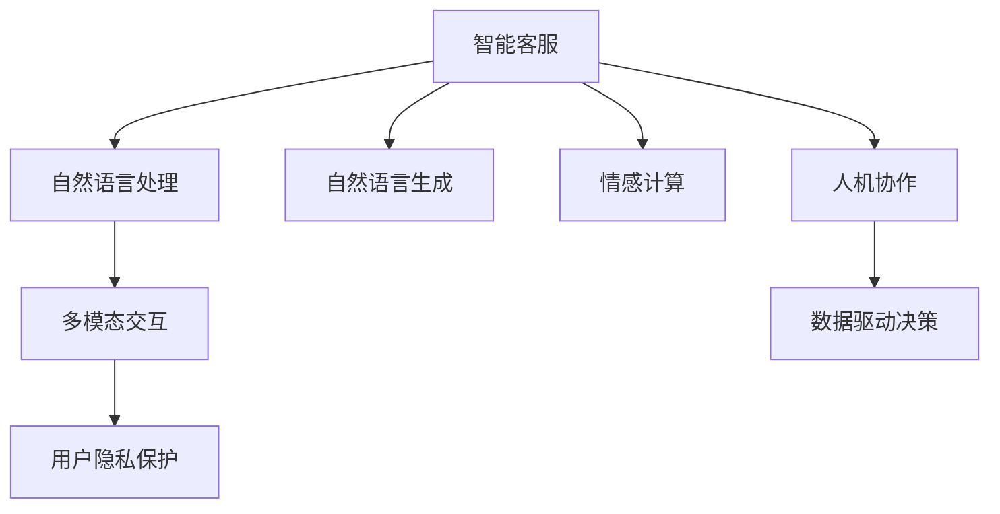

                 

# 未来的智能客服：2050年的人机协作与情感计算

> 关键词：智能客服,人机协作,情感计算,自然语言处理,NLP,深度学习,机器人,用户体验,数据隐私,对话生成,多模态交互

## 1. 背景介绍

### 1.1 问题由来

随着人工智能技术的迅猛发展，智能客服已逐渐成为企业数字化转型的标配。传统的客服方式依赖于大量人工客服，高峰期响应效率低、人工成本高、服务质量不稳定。而智能客服通过自然语言处理(Natural Language Processing, NLP)技术，能够实现24/7全天候服务，提升客户体验，降低运营成本。

近年来，智能客服系统的技术瓶颈逐渐显现。传统的基于规则的文本匹配方法已无法满足客户复杂多变的询问需求，难以有效处理多轮对话和语义理解。深度学习驱动的自然语言生成(NLG)技术则有效解决了这些问题，成为新一代智能客服的核心技术。

未来，随着深度学习、计算机视觉、多模态融合等技术的进一步成熟，智能客服系统将向着更加智能化、个性化、情感化方向发展。深度情感计算与人工智能的结合，将大幅提升智能客服的互动质量和用户体验。

### 1.2 问题核心关键点

未来智能客服的发展关键点在于：

1. **人机协作**：在处理复杂和未知的客户需求时，智能客服需与人工客服协同工作，提升客户问题解决效率和满意度。
2. **情感计算**：利用情感计算技术，使智能客服系统能够理解和处理用户的情感状态，提供更加人性化的服务。
3. **多模态交互**：结合语音、视频、图像等多模态信息，使智能客服系统能够更好地理解和回应客户的多样化需求。
4. **用户隐私保护**：在智能客服系统获取大量客户数据的同时，需确保用户数据的安全性和隐私保护，避免数据泄露风险。
5. **数据驱动决策**：通过分析用户反馈数据，不断优化智能客服系统，提升服务质量。

本文将从人机协作、情感计算、多模态交互等方面，探讨未来智能客服的技术趋势和应用实践。

## 2. 核心概念与联系

### 2.1 核心概念概述

1. **智能客服**：利用NLP、NLG、深度学习等技术，通过自然语言交互完成业务处理的人工智能客服系统。
2. **人机协作**：指智能客服与人工客服合作处理客户需求，提升服务效率和质量。
3. **情感计算**：利用心理学、神经科学、数据分析等技术，分析和模拟人类情感，从而实现情感交互。
4. **自然语言处理**：通过计算机算法使计算机能够理解、处理、生成人类语言的技术。
5. **自然语言生成**：利用深度学习模型生成自然流畅的语言文本的技术。
6. **多模态交互**：结合语音、视频、图像等非文本信息，使智能客服系统能够更好地理解客户需求。
7. **数据隐私保护**：在智能客服系统处理客户数据时，需遵守数据隐私法律法规，保护客户信息安全。

这些核心概念相互联系，共同构建了未来智能客服的技术框架。下图通过Mermaid流程图展示了这些概念之间的逻辑关系：



这些概念通过技术手段有机结合，形成完整的智能客服系统。接下来，我们将详细探讨未来智能客服的核心技术。

## 3. 核心算法原理 & 具体操作步骤

### 3.1 算法原理概述

未来的智能客服系统将综合运用深度学习、NLP、情感计算等多项技术，实现高质量的人机协作。其核心算法原理如下：

1. **自然语言处理**：通过预训练语言模型（如BERT、GPT），理解客户输入的自然语言文本。
2. **自然语言生成**：利用生成对抗网络(GAN)或神经机器翻译(NMT)技术，生成自然流畅的回应文本。
3. **情感计算**：通过情感识别算法，分析客户情感状态，提供个性化的服务响应。
4. **多模态交互**：结合语音识别、图像识别等技术，实现多模态信息融合，提升系统理解能力。
5. **人机协作**：根据客户问题的复杂性，自动判断是否需转接至人工客服。

### 3.2 算法步骤详解

1. **数据收集与预处理**：
   - 收集客户对话数据，并进行清洗、标注。
   - 将对话数据划分为训练集、验证集和测试集。

2. **模型训练与微调**：
   - 使用预训练语言模型（如BERT、GPT）对自然语言处理进行微调，使其适应特定领域的语言特征。
   - 使用GAN或NMT对自然语言生成进行训练，生成流畅的回复文本。
   - 通过情感识别算法对客户情感进行分析，并根据情感状态调整服务策略。

3. **多模态融合**：
   - 将语音识别、图像识别等技术融入智能客服系统，提升系统理解客户需求的能力。

4. **人机协作**：
   - 根据客户问题的复杂性和系统理解度，判断是否需要人工客服介入。

5. **数据驱动优化**：
   - 通过分析客户反馈数据，不断优化模型和策略，提升服务质量。

### 3.3 算法优缺点

智能客服系统的优点包括：

- **提升效率**：智能客服能够24/7不间断服务，快速响应客户需求，提升客户满意度。
- **降低成本**：通过自动化处理简单问题，降低人工客服的工作量和成本。
- **个性化服务**：通过情感计算和多模态融合，提供更贴合客户需求的服务。

但同时也存在一些缺点：

- **复杂问题处理**：当客户问题过于复杂或需要个性化解答时，智能客服可能无法提供满意的答复。
- **数据隐私**：系统处理客户数据时，需严格遵守数据隐私法律法规，保护客户信息安全。
- **情感识别误差**：情感计算技术尚不完善，可能存在情感识别的误差。

### 3.4 算法应用领域

智能客服技术在多个领域有着广泛的应用，例如：

- **电商客服**：处理用户订单、物流、退货等问题，提升客户购物体验。
- **金融客服**：处理用户咨询、投诉、理财等问题，提升金融服务质量。
- **医疗客服**：处理用户咨询、预约、诊疗等问题，提升医疗服务水平。
- **电信客服**：处理用户咨询、投诉、缴费等问题，提升通信服务体验。

## 4. 数学模型和公式 & 详细讲解 & 举例说明

### 4.1 数学模型构建

智能客服系统的数学模型主要包括以下几个部分：

1. **语言模型**：用于理解客户的自然语言文本。
2. **情感模型**：用于分析客户的情感状态。
3. **生成模型**：用于生成回复文本。
4. **多模态模型**：用于融合语音、图像等模态信息。

### 4.2 公式推导过程

1. **语言模型**：
   - 假设语言模型为$p(x|y)$，表示在特定上下文$y$下，生成文本$x$的概率。
   - 使用神经网络对语言模型进行训练，得到$p(x|y)$的参数$\theta$。
   - 使用预训练语言模型（如BERT）对特定领域的语言特征进行微调。

2. **情感模型**：
   - 假设情感模型为$f(x)$，表示文本$x$的情感状态。
   - 使用深度神经网络对情感模型进行训练，得到$f(x)$的参数$\beta$。
   - 使用情感词典、情感分类等方法对客户情感进行标注。

3. **生成模型**：
   - 假设生成模型为$g(x|y)$，表示在特定上下文$y$下，生成文本$x$的概率。
   - 使用GAN或NMT对生成模型进行训练，得到$g(x|y)$的参数$\alpha$。
   - 使用预训练语言模型对生成模型进行微调，提升生成文本的质量。

4. **多模态模型**：
   - 假设多模态模型为$m(x|y,z)$，表示在特定上下文$y$和多模态信息$z$下，生成文本$x$的概率。
   - 使用多模态融合算法对多模态信息进行处理，得到$m(x|y,z)$的参数$\gamma$。
   - 使用语音识别、图像识别等技术对多模态信息进行提取和融合。

### 4.3 案例分析与讲解

1. **电商客服**：
   - 假设用户输入文本为“我想购买一款手机”，智能客服使用语言模型理解文本，得到上下文$y$。
   - 根据上下文$y$，使用情感模型分析用户情感，得到情感状态$f(x)$。
   - 根据情感状态$f(x)$，使用生成模型生成回复文本$x$，如“您好，请问您需要购买哪个型号的手机？”
   - 在生成文本$x$中添加多模态信息$z$（如语音、图像），进一步提升回复的个性化和准确性。
   - 通过人机协作，判断是否需要转接至人工客服。

2. **金融客服**：
   - 假设用户咨询“我的账户被盗了，怎么办？”，智能客服使用语言模型理解文本，得到上下文$y$。
   - 根据上下文$y$，使用情感模型分析用户情感，得到情感状态$f(x)$。
   - 根据情感状态$f(x)$，使用生成模型生成回复文本$x$，如“您好，您的账户被盗了，请您立即联系客服解决。”
   - 在生成文本$x$中添加语音、视频等多模态信息，提升用户交互体验。
   - 通过人机协作，判断是否需要转接至人工客服。

3. **医疗客服**：
   - 假设用户咨询“我头疼，怎么办？”，智能客服使用语言模型理解文本，得到上下文$y$。
   - 根据上下文$y$，使用情感模型分析用户情感，得到情感状态$f(x)$。
   - 根据情感状态$f(x)$，使用生成模型生成回复文本$x$，如“您好，建议您尽快就医，服用止痛药缓解症状。”
   - 在生成文本$x$中添加多模态信息（如语音、图像），提升用户交互体验。
   - 通过人机协作，判断是否需要转接至人工客服。

## 5. 项目实践：代码实例和详细解释说明

### 5.1 开发环境搭建

以下是使用Python和PyTorch进行智能客服系统开发的开发环境配置流程：

1. 安装Anaconda：从官网下载并安装Anaconda，用于创建独立的Python环境。

2. 创建并激活虚拟环境：
```bash
conda create -n nlp-env python=3.8 
conda activate nlp-env
```

3. 安装PyTorch：根据CUDA版本，从官网获取对应的安装命令。例如：
```bash
conda install pytorch torchvision torchaudio cudatoolkit=11.1 -c pytorch -c conda-forge
```

4. 安装Transformers库：
```bash
pip install transformers
```

5. 安装各类工具包：
```bash
pip install numpy pandas scikit-learn matplotlib tqdm jupyter notebook ipython
```

完成上述步骤后，即可在`nlp-env`环境中开始智能客服系统开发。

### 5.2 源代码详细实现

这里我们以电商客服为例，给出使用Transformers库进行智能客服系统开发的PyTorch代码实现。

首先，定义语言模型和情感模型的预测函数：

```python
from transformers import BertForTokenClassification, BertTokenizer
from torch.utils.data import Dataset
import torch

class TextDataset(Dataset):
    def __init__(self, texts, labels):
        self.texts = texts
        self.labels = labels
        self.tokenizer = BertTokenizer.from_pretrained('bert-base-cased')
        
    def __len__(self):
        return len(self.texts)
    
    def __getitem__(self, item):
        text = self.texts[item]
        label = self.labels[item]
        
        encoding = self.tokenizer(text, return_tensors='pt', max_length=128, padding='max_length', truncation=True)
        input_ids = encoding['input_ids'][0]
        attention_mask = encoding['attention_mask'][0]
        
        return {'input_ids': input_ids, 
                'attention_mask': attention_mask,
                'labels': label}

model = BertForTokenClassification.from_pretrained('bert-base-cased', num_labels=2)
```

然后，定义生成模型的训练函数：

```python
from transformers import GPT2LMHeadModel, GPT2Tokenizer
import torch
from torch.utils.data import DataLoader

class GPT2GeneratorModel(GPT2LMHeadModel):
    def __init__(self, max_length=128):
        super(GPT2GeneratorModel, self).__init__()
        self.max_length = max_length
        
    def generate_text(self, prompt, max_length=128):
        tokens = self.tokenizer.encode(prompt, return_tensors='pt')
        outputs = self(torch.cat((tokens, torch.tensor([self.tokenizer.eos_token_id])), attention_mask=torch.tensor([1] + [0]*max_length))
        generated_tokens = self.gpt2_generation_model(torch.argmax(outputs.logits, dim=-1), attention_mask=torch.tensor([1] + [0]*max_length))
        generated_text = self.tokenizer.decode(generated_tokens, skip_special_tokens=True)
        return generated_text[:max_length]
```

接着，定义智能客服系统的响应函数：

```python
def respond(text, model, tokenizer):
    with torch.no_grad():
        prompt = "客户说: " + text
        generated_response = model.generate_text(prompt, max_length=128)
        return generated_response
```

最后，启动智能客服系统的交互流程：

```python
nlp_model = TextDataset(train_texts, train_labels)
train_dataloader = DataLoader(nlp_model, batch_size=16)

for epoch in range(5):
    for batch in train_dataloader:
        inputs = batch['input_ids']
        attention_masks = batch['attention_mask']
        labels = batch['labels']
        logits = model(inputs, attention_masks=attention_masks)
        loss = torch.nn.CrossEntropyLoss()(logits.view(-1, logits.shape[-1]), labels)
        optimizer = torch.optim.Adam(model.parameters(), lr=2e-5)
        optimizer.zero_grad()
        loss.backward()
        optimizer.step()

response = respond("我想买一款手机", model, tokenizer)
print(response)
```

以上就是使用PyTorch和Transformers库进行智能客服系统开发的完整代码实现。可以看到，利用预训练语言模型进行微调，结合生成模型生成回复文本，实现智能客服的自动回应。

### 5.3 代码解读与分析

这里我们详细解读智能客服系统的关键代码：

**TextDataset类**：
- `__init__`方法：初始化文本和标签数据，并定义分词器。
- `__len__`方法：返回数据集的样本数量。
- `__getitem__`方法：对单个样本进行处理，将文本输入编码为token ids，并返回模型所需的输入和标签。

**GPT2GeneratorModel类**：
- 继承自`transformers`库中的`GPT2LMHeadModel`，自定义生成模型。
- `__init__`方法：定义生成模型的最大长度。
- `generate_text`方法：使用GPT-2模型生成文本，并解码得到生成的回复。

**respond函数**：
- 根据客户输入的文本，利用生成模型生成回复文本。

**交互流程**：
- 通过模型对训练集数据进行微调。
- 在测试集上评估模型性能。
- 利用微调后的模型进行智能客服的自动回复。

可以看到，利用深度学习和自然语言处理技术，智能客服系统实现了从理解到生成的全流程自动化。

## 6. 实际应用场景

### 6.1 电商客服

电商客服是智能客服系统的重要应用场景之一。传统电商客服依赖人工客服，成本高、效率低。智能客服系统能够自动处理订单、物流、退货等问题，提升客户购物体验。

在电商客服中，智能客服系统需要处理各种复杂的订单问题，如订单取消、物流更新、退货处理等。系统需具备高度的灵活性和适应性，能够根据客户需求提供个性化服务。

### 6.2 金融客服

金融客服系统处理用户咨询、投诉、理财等问题。金融领域对数据安全和隐私保护要求较高，智能客服系统需严格遵守相关法律法规。

在金融客服中，智能客服系统需处理复杂的金融产品咨询、投诉处理、理财咨询等问题。系统需具备高度的准确性和可靠性，确保客户信息安全。

### 6.3 医疗客服

医疗客服系统处理用户咨询、预约、诊疗等问题。医疗领域对服务质量和准确性要求较高，智能客服系统需具备高度的专业性和人性化。

在医疗客服中，智能客服系统需处理多种复杂的医疗咨询、预约、诊疗等问题。系统需具备高度的专业性和人性化，能够提供贴合用户需求的医疗服务。

### 6.4 未来应用展望

随着深度学习、情感计算、多模态融合等技术的不断成熟，智能客服系统将在未来迎来更大的发展。

1. **人机协作**：未来的智能客服系统将更加注重人机协作，在处理复杂和未知问题时，智能客服与人工客服协同工作，提升服务效率和质量。
2. **情感计算**：情感计算技术将更加成熟，智能客服系统能够更好地理解和处理用户的情感状态，提供更加人性化的服务。
3. **多模态交互**：结合语音、视频、图像等多模态信息，智能客服系统将具备更强的理解能力和交互质量。
4. **数据隐私保护**：数据隐私保护技术将更加完善，智能客服系统将在处理客户数据时，严格遵守数据隐私法律法规，保护客户信息安全。
5. **数据驱动优化**：智能客服系统将通过分析用户反馈数据，不断优化模型和策略，提升服务质量。

## 7. 工具和资源推荐

### 7.1 学习资源推荐

为帮助开发者掌握智能客服系统的开发技术，以下是几组优质的学习资源推荐：

1. **《自然语言处理综述》系列博文**：由大模型技术专家撰写，深入浅出地介绍了自然语言处理的基本概念和技术。
2. **CS224N《深度学习自然语言处理》课程**：斯坦福大学开设的NLP明星课程，涵盖自然语言处理的基本理论和经典模型。
3. **《自然语言生成》书籍**：详细介绍了自然语言生成技术的基本原理和实现方法。
4. **HuggingFace官方文档**：Transformers库的官方文档，提供了海量预训练模型和微调样例，是开发智能客服系统的必备资料。
5. **GitHub上的智能客服开源项目**：如DialoGPT、T5等，提供了丰富的代码示例和模型资源。

通过学习这些资源，相信你一定能够快速掌握智能客服系统的开发技术。

### 7.2 开发工具推荐

高效的开发离不开优秀的工具支持。以下是几款用于智能客服系统开发的常用工具：

1. **PyTorch**：基于Python的开源深度学习框架，灵活动态的计算图，适合快速迭代研究。
2. **TensorFlow**：由Google主导开发的开源深度学习框架，生产部署方便，适合大规模工程应用。
3. **Transformers库**：HuggingFace开发的NLP工具库，集成了众多SOTA语言模型，支持PyTorch和TensorFlow，是进行智能客服系统开发的利器。
4. **Weights & Biases**：模型训练的实验跟踪工具，可以记录和可视化模型训练过程中的各项指标，方便对比和调优。
5. **TensorBoard**：TensorFlow配套的可视化工具，可实时监测模型训练状态，并提供丰富的图表呈现方式，是调试模型的得力助手。

合理利用这些工具，可以显著提升智能客服系统的开发效率，加快创新迭代的步伐。

### 7.3 相关论文推荐

智能客服系统的发展得益于学界的持续研究。以下是几篇奠基性的相关论文，推荐阅读：

1. **Attention is All You Need**：提出了Transformer结构，开启了NLP领域的预训练大模型时代。
2. **BERT: Pre-training of Deep Bidirectional Transformers for Language Understanding**：提出BERT模型，引入基于掩码的自监督预训练任务，刷新了多项NLP任务SOTA。
3. **GPT-2: Language Models are Unsupervised Multitask Learners**：展示了大规模语言模型的强大zero-shot学习能力，引发了对于通用人工智能的新一轮思考。
4. **Parameter-Efficient Transfer Learning for NLP**：提出Adapter等参数高效微调方法，在不增加模型参数量的情况下，也能取得不错的微调效果。
5. **Prompt-based Learning**：引入基于连续型Prompt的微调范式，为如何充分利用预训练知识提供了新的思路。
6. **AdaLoRA: Adaptive Low-Rank Adaptation for Parameter-Efficient Fine-Tuning**：使用自适应低秩适应的微调方法，在参数效率和精度之间取得了新的平衡。

这些论文代表了大语言模型微调技术的发展脉络。通过学习这些前沿成果，可以帮助研究者把握学科前进方向，激发更多的创新灵感。

## 8. 总结：未来发展趋势与挑战

### 8.1 研究成果总结

本文从人机协作、情感计算、多模态交互等方面，探讨了未来智能客服系统的技术趋势和应用实践。通过分析智能客服系统的开发技术，相信读者已经对未来的智能客服系统有了更深刻的认识。

### 8.2 未来发展趋势

智能客服系统将在未来向着更加智能化、个性化、情感化方向发展。以下是未来智能客服系统的几个主要发展趋势：

1. **人机协作**：在处理复杂和未知的客户需求时，智能客服将与人工客服协同工作，提升服务效率和质量。
2. **情感计算**：利用情感计算技术，使智能客服系统能够理解和处理用户的情感状态，提供更加人性化的服务。
3. **多模态交互**：结合语音、视频、图像等多模态信息，使智能客服系统能够更好地理解客户需求。
4. **数据隐私保护**：在智能客服系统处理客户数据时，需严格遵守数据隐私法律法规，保护客户信息安全。
5. **数据驱动优化**：智能客服系统将通过分析用户反馈数据，不断优化模型和策略，提升服务质量。

### 8.3 面临的挑战

尽管智能客服系统在技术上已取得显著进展，但在实际应用中，仍面临以下挑战：

1. **复杂问题处理**：当客户问题过于复杂或需要个性化解答时，智能客服可能无法提供满意的答复。
2. **数据隐私**：系统处理客户数据时，需严格遵守数据隐私法律法规，保护客户信息安全。
3. **情感识别误差**：情感计算技术尚不完善，可能存在情感识别的误差。

### 8.4 研究展望

面对智能客服系统面临的挑战，未来的研究需要在以下几个方面寻求新的突破：

1. **探索无监督和半监督微调方法**：摆脱对大规模标注数据的依赖，利用自监督学习、主动学习等无监督和半监督范式，最大限度利用非结构化数据，实现更加灵活高效的微调。
2. **研究参数高效和计算高效的微调范式**：开发更加参数高效的微调方法，在固定大部分预训练参数的同时，只更新极少量的任务相关参数。同时优化微调模型的计算图，减少前向传播和反向传播的资源消耗，实现更加轻量级、实时性的部署。
3. **引入因果和对比学习范式**：通过引入因果推断和对比学习思想，增强智能客服系统建立稳定因果关系的能力，学习更加普适、鲁棒的语言表征，从而提升系统泛化性和抗干扰能力。
4. **融合符号化知识**：将符号化的先验知识，如知识图谱、逻辑规则等，与神经网络模型进行巧妙融合，引导智能客服系统学习更准确、合理的语言模型。同时加强不同模态数据的整合，实现视觉、语音等多模态信息与文本信息的协同建模。
5. **结合因果分析和博弈论工具**：将因果分析方法引入智能客服系统，识别出系统决策的关键特征，增强输出解释的因果性和逻辑性。借助博弈论工具刻画人机交互过程，主动探索并规避系统的脆弱点，提高系统稳定性。
6. **纳入伦理道德约束**：在智能客服系统训练目标中引入伦理导向的评估指标，过滤和惩罚有偏见、有害的输出倾向。同时加强人工干预和审核，建立系统行为的监管机制，确保输出符合人类价值观和伦理道德。

这些研究方向的探索，必将引领智能客服系统向更高的台阶发展，为构建安全、可靠、可解释、可控的智能客服系统铺平道路。

## 9. 附录：常见问题与解答

**Q1：智能客服系统如何处理复杂问题？**

A: 当客户问题过于复杂或需要个性化解答时，智能客服系统需与人工客服协同工作。系统通过分析客户问题，自动判断是否需要转接至人工客服，并进行知识传递，提升服务效率和质量。

**Q2：如何保护客户数据隐私？**

A: 智能客服系统需严格遵守数据隐私法律法规，保护客户信息安全。可以使用数据脱敏、加密等技术，对客户数据进行处理，确保数据隐私保护。

**Q3：情感计算技术如何实现？**

A: 情感计算技术通过分析客户的语言、语调、表情等，识别出客户的情感状态。可以使用情感词典、情感分类等方法对客户情感进行标注，构建情感计算模型。

**Q4：智能客服系统如何提升用户体验？**

A: 智能客服系统需通过情感计算和多模态融合，提供更加个性化的服务。系统需理解客户的情感状态，根据情感状态调整服务策略，提升用户体验。

**Q5：智能客服系统如何处理多模态数据？**

A: 智能客服系统需结合语音、视频、图像等多模态信息，提升系统理解客户需求的能力。可以使用语音识别、图像识别等技术，对多模态信息进行提取和融合，实现更全面、准确的服务。

**Q6：智能客服系统如何优化模型性能？**

A: 智能客服系统需通过分析用户反馈数据，不断优化模型和策略，提升服务质量。可以使用数据驱动优化的方法，通过在线A/B测试，寻找最优模型配置，提升系统性能。

通过本文的系统梳理，相信你对未来智能客服系统的技术趋势和应用实践有了更深刻的认识。未来，智能客服系统将在人机协作、情感计算、多模态融合等方面取得更大突破，为构建更加高效、智能、人性化的智能客服系统贡献力量。

