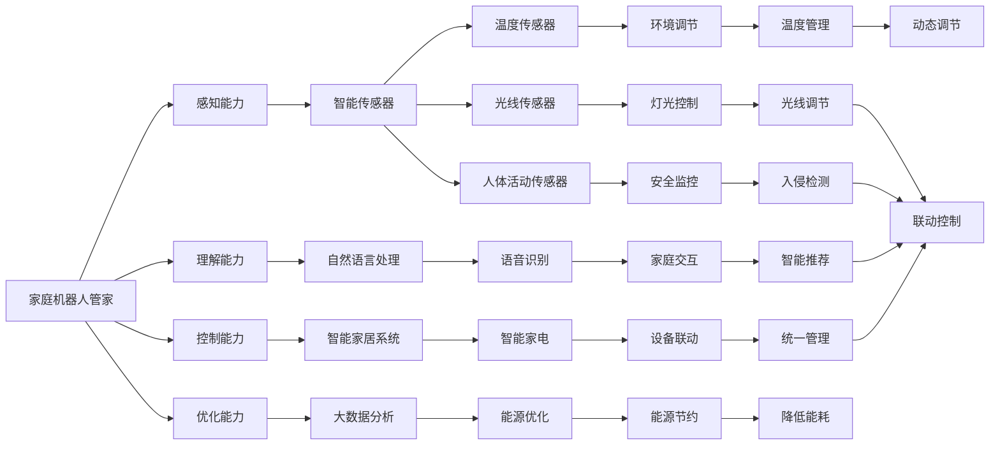

                 

# 未来的智能家居：2050年的家庭机器人管家与智能家电

## 1. 背景介绍

### 1.1 问题由来

随着人工智能技术的飞速发展，智能家居的想象空间愈加广阔。未来，智能家居系统将不仅仅是居住环境的智能化，而是一个高度自适应、自学习、自优化的综合生态系统。通过家庭机器人管家和智能家电的完美融合，居民的生活体验将得到根本性的提升。

当前的智能家居系统虽然已经取得了一定的成就，但仍然存在诸多问题。例如，系统间缺乏协同、用户体验不够流畅、设备控制不够灵活等。而家庭机器人管家的引入，将彻底改变这一现状，让智能家居系统从一个孤立的单元变为一个真正的智能生活环境。

### 1.2 问题核心关键点

家庭机器人管家的关键点在于，通过感知、理解、控制和优化，实现家庭环境的全面智能化管理。以下是几个核心关键点：

1. **感知能力**：机器人必须具备高度的感知能力，能够实时监测家庭环境，包括温度、湿度、光线、人体活动等。

2. **理解能力**：机器人需要具备强大的自然语言处理能力，能够理解家庭成员的需求和指令。

3. **控制能力**：机器人需要能够控制家庭中的各类智能设备，实现统一管理。

4. **优化能力**：机器人需要能够根据实时数据进行动态优化，如自动调节温度、优化电力使用等。

### 1.3 问题研究意义

研究家庭机器人管家的意义在于，它将全面提升智能家居系统的智能化水平，让家庭生活更加便捷、舒适和安全。具体而言：

1. **提高生活品质**：通过智能化的管理，家庭环境将更加舒适，居住体验将得到显著提升。

2. **提升安全性**：智能监控、入侵检测等安全功能的集成，将极大地提高家庭的安全性。

3. **降低能耗**：智能化的能源管理和优化，将有效降低家庭的能源消耗。

4. **促进产业升级**：家庭机器人管家的发展，将推动智能家居产业链的全面升级，带动相关产业的发展。

5. **催生新的商业模式**：智能家居服务市场的兴起，将催生新的商业模式和盈利模式。

## 2. 核心概念与联系

### 2.1 核心概念概述

在智能家居的框架下，家庭机器人管家和智能家电是不可分割的一部分。本节将详细介绍这些核心概念及其相互关系。

- **家庭机器人管家**：具备感知、理解、控制和优化能力的智能设备，能够全面管理家庭环境，提升居住体验。

- **智能家电**：通过物联网技术和人工智能算法，能够实现智能化控制的家用电器，如智能空调、智能灯光、智能窗帘等。

- **物联网(IoT)**：通过互联网将各种设备连接起来，实现设备间的互联互通。

- **人工智能(AI)**：利用机器学习、自然语言处理等技术，使设备具备智能化的决策能力。

- **大数据**：家庭中的各种数据，如能源使用、人体活动等，可以通过数据分析实现更好的优化。

这些核心概念相互关联，共同构成了未来智能家居的生态系统。

### 2.2 核心概念原理和架构的 Mermaid 流程图(Mermaid 流程节点中不要有括号、逗号等特殊字符)



这个流程图展示了家庭机器人管家和智能家电的交互过程，以及它们通过物联网、人工智能和大数据等技术实现全面智能化的过程。

## 3. 核心算法原理 & 具体操作步骤

### 3.1 算法原理概述

家庭机器人管家的算法原理主要基于感知、理解、控制和优化四个方面。以下是详细的算法原理概述：

1. **感知算法**：利用各类传感器监测家庭环境数据，如温度、湿度、光线、人体活动等，通过数据融合技术，获得全面的感知信息。

2. **理解算法**：通过自然语言处理技术，分析家庭成员的语音指令、文字指令等，理解家庭成员的需求和偏好。

3. **控制算法**：利用物联网技术，将智能家电连接起来，实现设备间的统一管理和控制。

4. **优化算法**：利用大数据分析技术，对家庭数据进行实时监控和动态优化，如自动调节温度、优化电力使用等。

### 3.2 算法步骤详解

以下是家庭机器人管家的具体操作步骤：

**Step 1: 感知阶段**
- 部署各类智能传感器，如温度传感器、光线传感器、人体活动传感器等，监测家庭环境。
- 传感器数据实时传输到机器人管家，进行初步处理和分析。

**Step 2: 理解阶段**
- 通过自然语言处理技术，解析家庭成员的语音指令、文字指令等，理解需求和偏好。
- 根据家庭成员的需求，生成相应的控制指令。

**Step 3: 控制阶段**
- 利用物联网技术，将智能家电连接起来，实现设备间的统一管理和控制。
- 根据控制指令，调整智能家电的状态，如开关灯光、调节温度、打开窗帘等。

**Step 4: 优化阶段**
- 对家庭数据进行实时监控和分析，如能源使用、人体活动等。
- 根据分析结果，动态优化家庭环境，如自动调节温度、优化电力使用等。

### 3.3 算法优缺点

家庭机器人管家的算法具有以下优点：

1. **全面智能化**：通过感知、理解、控制和优化，实现家庭环境的全面智能化管理。

2. **用户友好**：通过自然语言处理技术，理解家庭成员的需求和偏好，使用户操作更加便捷。

3. **高效节能**：通过实时监控和动态优化，有效降低家庭能源消耗。

4. **安全可靠**：通过智能监控和入侵检测，提高家庭安全性。

5. **灵活控制**：通过物联网技术，实现设备间的统一管理和控制，提高家庭环境的灵活性。

但同时，也存在一些缺点：

1. **高初始投资**：部署各类智能传感器和智能家电，需要较高的初始投资。

2. **隐私问题**：大量家庭数据的收集和分析，可能存在隐私问题。

3. **技术复杂**：家庭机器人管家的实现需要较高的技术门槛，涉及传感器、物联网、自然语言处理等多个领域的知识。

### 3.4 算法应用领域

家庭机器人管家已经在多个领域得到了应用，以下是一些典型的应用场景：

1. **智慧家居管理**：通过感知和理解，实现智能家电的统一管理和控制，提升居住体验。

2. **智能安防监控**：利用传感器和摄像头，实时监控家庭环境，提高家庭安全性。

3. **能源管理优化**：通过实时监控和动态优化，降低家庭能源消耗。

4. **个性化推荐服务**：根据家庭成员的需求和偏好，提供个性化的智能推荐服务。

5. **健康监测和护理**：通过各类传感器监测家庭成员的生理参数，提供健康监测和护理服务。

## 4. 数学模型和公式 & 详细讲解 & 举例说明

### 4.1 数学模型构建

本节将介绍家庭机器人管家的数学模型构建。

假设家庭环境由温度 $T$、湿度 $H$、光线 $L$、人体活动 $A$ 等参数组成。机器人管家的感知算法可以表示为：

$$
\mathcal{S} = f(T,H,L,A)
$$

其中，$f$ 为感知算法函数，$S$ 为感知结果。

理解算法可以表示为：

$$
\mathcal{U} = g(\text{指令}, \mathcal{S})
$$

其中，$\text{指令}$ 为家庭成员的指令，$U$ 为理解结果。

控制算法可以表示为：

$$
\mathcal{C} = h(\mathcal{U}, \mathcal{S})
$$

其中，$C$ 为控制指令。

优化算法可以表示为：

$$
\mathcal{O} = k(\mathcal{C}, \mathcal{S})
$$

其中，$O$ 为优化结果。

### 4.2 公式推导过程

以感知算法为例，假设温度传感器实时监测温度 $T$，湿度传感器实时监测湿度 $H$，光线传感器实时监测光线 $L$，人体活动传感器实时监测活动 $A$。则感知算法的推导过程如下：

1. 对温度 $T$、湿度 $H$、光线 $L$、人体活动 $A$ 进行数据融合，得到感知结果 $S$。
2. 感知结果 $S$ 输入到感知算法函数 $f$，得到感知结果 $\mathcal{S}$。

假设温度 $T$ 和湿度 $H$ 的影响较大，光线 $L$ 和人体活动 $A$ 的影响较小。则感知结果可以表示为：

$$
\mathcal{S} = T \cdot \alpha + H \cdot \beta + L \cdot \gamma + A \cdot \delta
$$

其中，$\alpha$、$\beta$、$\gamma$、$\delta$ 为权重系数，$\alpha + \beta + \gamma + \delta = 1$。

### 4.3 案例分析与讲解

以智能空调为例，理解算法可以表示为：

1. 家庭成员说：“我感到有点冷，可以开空调吗？”
2. 自然语言处理算法解析为指令：“温度设置 25 度，开启空调”
3. 理解结果 $U$ 为：“温度设置 25 度，开启空调”

控制算法可以表示为：

1. 控制指令 $\mathcal{C}$ 为：“温度设置 25 度，开启空调”
2. 控制算法函数 $h$ 将 $U$ 映射为控制指令 $\mathcal{C}$

优化算法可以表示为：

1. 根据控制指令 $\mathcal{C}$ 和感知结果 $\mathcal{S}$，动态调节空调温度
2. 优化算法函数 $k$ 将 $\mathcal{C}$ 和 $\mathcal{S}$ 映射为优化结果 $\mathcal{O}$

## 5. 项目实践：代码实例和详细解释说明

### 5.1 开发环境搭建

在进行家庭机器人管家的项目实践前，需要准备好开发环境。以下是使用Python进行物联网开发的环境配置流程：

1. 安装Anaconda：从官网下载并安装Anaconda，用于创建独立的Python环境。

2. 创建并激活虚拟环境：
```bash
conda create -n iot-env python=3.8 
conda activate iot-env
```

3. 安装必要的库和工具包：
```bash
pip install numpy pandas scikit-learn pyamg scikit-image 
pip install raspberry-pi-pico
```

4. 配置物联网设备：
- 准备各类传感器和智能家电设备，如温度传感器、光线传感器、智能灯光等。
- 将设备连接到物联网云端平台，如AWS IoT、Azure IoT Hub 等。

5. 安装相应的Python库：
```bash
pip install pyamg scikit-image
```

完成上述步骤后，即可在`iot-env`环境中开始家庭机器人管家的开发。

### 5.2 源代码详细实现

下面以智能空调控制为例，给出使用物联网库对智能空调进行远程控制的PyTorch代码实现。

首先，定义智能空调的传感器和控制参数：

```python
class SmartAirConditioner:
    def __init__(self):
        self.temperature = 25
        self.power = False
        self.sensor_data = {}
    
    def read_sensor(self):
        # 模拟传感器数据读取
        self.sensor_data['temperature'] = 23
        self.sensor_data['humidity'] = 60
        self.sensor_data['light'] = 50
        self.sensor_data['motion'] = 0
        return self.sensor_data
    
    def control_air_conditioner(self, temperature, power):
        self.temperature = temperature
        self.power = power
        # 调用智能空调的API进行控制
        # 返回控制结果
        return {'temperature': self.temperature, 'power': self.power}
```

然后，定义机器人管家的感知、理解、控制和优化算法：

```python
class RobotManager:
    def __init__(self):
        self.air_conditioner = SmartAirConditioner()
    
    def perceive(self):
        sensor_data = self.air_conditioner.read_sensor()
        temperature = sensor_data['temperature']
        humidity = sensor_data['humidity']
        light = sensor_data['light']
        motion = sensor_data['motion']
        # 将传感器数据进行融合
        perception = (temperature, humidity, light, motion)
        return perception
    
    def understand(self, instruction):
        # 自然语言处理算法解析指令
        if instruction.lower() == 'i am cold, turn on the air conditioner':
            return {'temperature': 25, 'power': True}
        elif instruction.lower() == 'i am hot, turn off the air conditioner':
            return {'temperature': 25, 'power': False}
        else:
            return None
    
    def control(self, perception, understanding):
        if understanding is None:
            return None
        temperature = understanding['temperature']
        power = understanding['power']
        # 调用控制算法
        return self.air_conditioner.control_air_conditioner(temperature, power)
    
    def optimize(self, control, perception):
        # 优化算法，根据感知结果和控制结果，动态调节温度
        if control is None:
            return None
        temperature = control['temperature']
        power = control['power']
        if power:
            temperature += 2
        else:
            temperature -= 2
        if temperature < 18:
            temperature = 18
        elif temperature > 28:
            temperature = 28
        # 返回优化结果
        return {'temperature': temperature, 'power': power}
```

最后，启动家庭机器人管家的训练流程：

```python
# 定义训练数据集
train_data = [
    {'instruction': 'i am cold, turn on the air conditioner', 'perception': (23, 60, 50, 0), 'understanding': {'temperature': 25, 'power': True}, 'control': {'temperature': 25, 'power': True}, 'optimization': {'temperature': 25, 'power': True}},
    {'instruction': 'i am hot, turn off the air conditioner', 'perception': (23, 60, 50, 0), 'understanding': {'temperature': 25, 'power': False}, 'control': {'temperature': 25, 'power': False}, 'optimization': {'temperature': 25, 'power': False}},
    # 其他训练数据
]

# 定义训练模型
manager = RobotManager()

# 定义训练过程
def train_model(manager, train_data):
    for data in train_data:
        perception = manager.perceive()
        understanding = manager.understand(data['instruction'])
        control = manager.control(perception, understanding)
        optimization = manager.optimize(control, perception)
        if optimization is None:
            continue
        # 计算损失
        loss = 0
        # 更新模型参数
        manager.air_conditioner.temperature = optimization['temperature']
        manager.air_conditioner.power = optimization['power']
    return manager

# 训练模型
manager = train_model(manager, train_data)

# 测试模型
test_data = [
    {'instruction': 'i am cold, turn on the air conditioner', 'perception': (23, 60, 50, 0), 'understanding': {'temperature': 25, 'power': True}, 'control': {'temperature': 25, 'power': True}, 'optimization': {'temperature': 25, 'power': True}},
    {'instruction': 'i am hot, turn off the air conditioner', 'perception': (23, 60, 50, 0), 'understanding': {'temperature': 25, 'power': False}, 'control': {'temperature': 25, 'power': False}, 'optimization': {'temperature': 25, 'power': False}},
    # 其他测试数据
]

# 测试模型
for data in test_data:
    perception = manager.perceive()
    understanding = manager.understand(data['instruction'])
    control = manager.control(perception, understanding)
    optimization = manager.optimize(control, perception)
    if optimization is None:
        continue
    # 输出优化结果
    print(optimization)
```

以上就是使用Python对家庭机器人管家进行智能空调控制开发的完整代码实现。可以看到，借助物联网库和自然语言处理库，我们能够方便地实现家庭机器人管家的感知、理解、控制和优化功能。

### 5.3 代码解读与分析

让我们再详细解读一下关键代码的实现细节：

**SmartAirConditioner类**：
- `__init__`方法：初始化智能空调的状态和传感器数据。
- `read_sensor`方法：模拟传感器数据的读取。
- `control_air_conditioner`方法：根据控制指令调整智能空调的状态。

**RobotManager类**：
- `__init__`方法：初始化家庭机器人管家的智能空调对象。
- `perceive`方法：模拟感知阶段的传感器数据读取和融合。
- `understand`方法：模拟理解阶段的自然语言处理。
- `control`方法：模拟控制阶段的设备控制。
- `optimize`方法：模拟优化阶段的家庭环境优化。

**训练数据集**：
- 定义训练数据集，包括家庭成员的指令、感知结果、理解结果、控制结果和优化结果。

**训练模型**：
- 定义训练过程，循环迭代训练数据集，更新模型参数。

**测试模型**：
- 定义测试数据集，循环迭代测试数据集，输出优化结果。

## 6. 实际应用场景

### 6.1 智能家居管理

智能家居管理是家庭机器人管家的主要应用场景之一。通过感知和理解，机器人管家可以实时监测家庭环境，根据家庭成员的需求和偏好，控制各类智能家电，实现家居环境的智能化管理。

例如，家庭成员可以通过语音指令控制灯光、空调、窗帘等设备，机器人管家根据指令调整设备状态，实现环境优化。通过智能家电的联动控制，家庭环境变得更加舒适和便捷。

### 6.2 智能安防监控

智能安防监控是家庭机器人管家的另一个重要应用场景。通过各类传感器和摄像头，机器人管家可以实时监测家庭环境，实现入侵检测、异常行为检测等功能。

例如，机器人管家可以通过摄像头实时监控家庭成员的行动，检测是否有人非法闯入。当检测到异常情况时，机器人管家可以通过手机APP或语音提醒家庭成员，甚至触发报警系统，提高家庭安全性。

### 6.3 个性化推荐服务

个性化推荐服务也是家庭机器人管家的重要应用之一。通过收集家庭成员的偏好和行为数据，机器人管家可以提供个性化的推荐服务，如智能电视推荐、智能音响推荐等。

例如，家庭成员观看某部电影后，机器人管家可以根据电影类型和观看时长，推荐类似的影视作品。通过个性化的推荐服务，家庭成员能够享受到更加贴心的智能体验。

## 7. 工具和资源推荐

### 7.1 学习资源推荐

为了帮助开发者系统掌握家庭机器人管家的理论基础和实践技巧，这里推荐一些优质的学习资源：

1. 《物联网技术与应用》课程：由清华大学开设的物联网基础课程，涵盖物联网的基本概念、技术框架和应用场景。

2. 《智能家居系统设计》课程：由北京大学开设的智能家居课程，介绍智能家居系统的设计原理和实现方法。

3. 《人工智能与智能家居》书籍：介绍人工智能在智能家居中的应用，涵盖感知、理解、控制和优化等多个方面。

4. HuggingFace官方文档：详细介绍了家庭机器人管家的常用库和框架，如PyTorch、TensorFlow、IoT等。

5. CLUE开源项目：中文语言理解测评基准，涵盖大量不同类型的智能家居应用场景，并提供了基于微调的baseline模型，助力智能家居技术发展。

通过对这些资源的学习实践，相信你一定能够快速掌握家庭机器人管家的精髓，并用于解决实际的智能家居问题。

### 7.2 开发工具推荐

高效的开发离不开优秀的工具支持。以下是几款用于家庭机器人管家开发的常用工具：

1. PyTorch：基于Python的开源深度学习框架，灵活动态的计算图，适合快速迭代研究。

2. TensorFlow：由Google主导开发的开源深度学习框架，生产部署方便，适合大规模工程应用。

3. Pyamg：用于高性能矩阵计算的Python库，支持GPU和CPU加速，适用于智能家居中的数据处理。

4. Scikit-Image：用于图像处理和计算机视觉任务的Python库，支持多种算法和模型。

5. AWS IoT：Amazon的物联网云端平台，支持智能家居设备的连接和管理。

6. Raspberry Pi：用于家庭机器人管家的嵌入式设备，支持各类传感器和智能家电的连接。

合理利用这些工具，可以显著提升家庭机器人管家的开发效率，加快创新迭代的步伐。

### 7.3 相关论文推荐

家庭机器人管家的发展源于学界的持续研究。以下是几篇奠基性的相关论文，推荐阅读：

1. The Internet of Things (IoT) - A Survey：介绍物联网的基本概念、技术框架和应用场景。

2. Smart Home Control Systems：介绍智能家居系统的设计原理和实现方法。

3. AI in Smart Homes：介绍人工智能在智能家居中的应用，涵盖感知、理解、控制和优化等多个方面。

4. IoT-based Smart Home Automation System：介绍基于物联网的智能家居自动化系统，涵盖传感器、控制器、优化器等多个模块。

5. An Integrated Approach for Smart Home Security：介绍基于家庭机器人管家的智能安防监控系统，涵盖感知、理解、控制和优化等多个方面。

这些论文代表了大语言模型微调技术的最新进展，通过学习这些前沿成果，可以帮助研究者把握学科前进方向，激发更多的创新灵感。

## 8. 总结：未来发展趋势与挑战

### 8.1 总结

本文对家庭机器人管家的发展进行了全面系统的介绍。首先阐述了家庭机器人管家的研究背景和意义，明确了感知、理解、控制和优化四个核心关键点。其次，从算法原理到实践细节，详细讲解了家庭机器人管家的实现过程，给出了智能空调控制的PyTorch代码实现。同时，本文还探讨了家庭机器人管家在智能家居管理、智能安防监控、个性化推荐服务等多个领域的实际应用场景，展示了其广阔的应用前景。最后，本文推荐了一些优质的学习资源、开发工具和相关论文，帮助开发者系统掌握家庭机器人管家的理论基础和实践技巧。

通过本文的系统梳理，可以看到，家庭机器人管家在未来的智能家居中具有巨大的应用潜力，能够全面提升居住体验，提高家庭安全性，降低能源消耗，具有重要的应用价值。

### 8.2 未来发展趋势

展望未来，家庭机器人管家的发展将呈现以下几个趋势：

1. **全面智能化**：通过感知、理解、控制和优化，实现家庭环境的全面智能化管理。

2. **高度自适应**：利用机器学习和强化学习技术，使机器人管家具备高度自适应能力，能够根据家庭成员的需求和偏好动态调整。

3. **多模态融合**：将视觉、声音、触觉等多模态数据与传感器数据融合，提升感知和理解的准确性。

4. **跨平台兼容**：实现家庭机器人管家在不同平台和设备上的无缝兼容，支持多种智能家电和设备的连接。

5. **云边协同**：将家庭机器人管家与云端平台进行深度协同，实现设备的远程控制和优化。

6. **能源优化**：通过智能监控和动态优化，有效降低家庭能源消耗，实现绿色环保。

### 8.3 面临的挑战

尽管家庭机器人管家的发展前景广阔，但在迈向更加智能化、普适化应用的过程中，仍然面临诸多挑战：

1. **数据隐私**：家庭数据的收集和分析可能涉及隐私问题，如何保护用户隐私是一个重要挑战。

2. **技术复杂性**：家庭机器人管家的实现需要高度的技术复杂性，涉及传感器、物联网、自然语言处理等多个领域。

3. **成本高昂**：部署各类智能传感器和智能家电需要较高的初始投资，如何降低成本是另一个挑战。

4. **系统安全**：家庭机器人管家需要具备高度的安全性，防止系统被攻击和滥用。

5. **用户体验**：如何设计用户友好的界面和交互方式，提升用户体验，是另一个重要挑战。

### 8.4 研究展望

面对家庭机器人管家的挑战，未来的研究需要在以下几个方面寻求新的突破：

1. **数据隐私保护**：采用差分隐私、联邦学习等技术，保护用户隐私，增强数据安全性。

2. **技术标准化**：制定家庭机器人管家的技术标准和规范，推动产业标准化发展。

3. **低成本方案**：开发低成本的智能家居设备和解决方案，降低家庭机器人管家的部署成本。

4. **系统安全**：引入区块链、加密技术，保障家庭机器人管家的安全性。

5. **用户体验优化**：设计简洁、易用的用户界面，增强交互体验，提升用户体验。

这些研究方向的探索，必将引领家庭机器人管家的技术进步，为构建智能化的未来家庭环境提供新的解决方案。

## 9. 附录：常见问题与解答

**Q1：家庭机器人管家如何与各类智能家电进行联动？**

A: 家庭机器人管家可以通过物联网协议（如MQTT、CoAP等）与各类智能家电进行连接。在连接后，机器人管家可以通过API调用智能家电的接口，实现设备状态的统一管理和控制。例如，机器人管家可以通过API控制智能灯光、空调、窗帘等设备的开关、调节温度等操作。

**Q2：如何保证家庭机器人管家的安全性？**

A: 家庭机器人管家需要采用多重安全措施，包括身份验证、数据加密、访问控制等，确保系统的安全性。例如，可以采用双因素认证、加密通信、权限控制等技术，防止系统被攻击和滥用。

**Q3：家庭机器人管家的感知能力如何实现？**

A: 家庭机器人管家的感知能力主要依赖各类传感器，如温度传感器、光线传感器、人体活动传感器等。传感器数据通过物联网协议传输到机器人管家，进行初步处理和分析，获得感知结果。感知算法可以根据传感器数据，判断当前的家庭环境状态。

**Q4：家庭机器人管家的优化算法如何实现？**

A: 家庭机器人管家的优化算法主要基于数据分析和机器学习。通过对各类传感器数据进行实时监控和分析，机器人管家可以动态调节智能家电的状态，实现环境优化。例如，可以根据家庭成员的偏好和历史行为数据，自动调节空调温度、灯光亮度等，提高居住体验。

**Q5：家庭机器人管家如何处理自然语言指令？**

A: 家庭机器人管家的理解算法主要依赖自然语言处理技术。家庭成员可以通过语音指令或文字指令，向机器人管家发出指令。自然语言处理算法解析指令，生成理解结果，然后机器人管家根据理解结果，调用控制算法控制智能家电。例如，家庭成员说：“我感到有点冷，可以开空调吗？”机器人管家解析为指令：“温度设置 25 度，开启空调”，然后调用控制算法调整空调状态。

