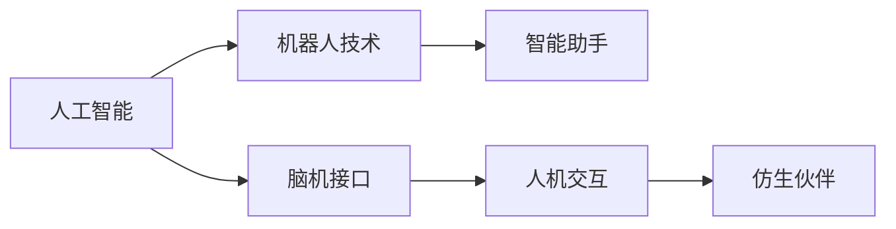

                 

# 未来的机器人：2050年的智能助手与仿生伙伴

> 关键词：机器人技术,智能助手,仿生伙伴,未来科技,人机交互,人工智能,脑机接口

## 1. 背景介绍

在过去的几十年中，机器人技术已经从科幻变成了现实，并逐步渗透到我们生活的方方面面。从自动驾驶汽车到智能家居，机器人已经成为了我们生活中不可或缺的一部分。然而，未来的机器人将不仅仅是机械的执行者，而将进化为具有高度智能的智能助手与仿生伙伴，实现更加复杂和多样化的应用场景。本文将从多个角度探讨2050年机器人技术的发展前景，包括智能助手、仿生伙伴以及未来机器人技术的挑战和趋势。

## 2. 核心概念与联系

### 2.1 核心概念概述

为更好地理解未来机器人技术的核心概念，本节将介绍几个密切相关的核心概念：

- 机器人技术（Robotics）：包括机械设计、控制算法、感知技术等，旨在实现机器人自主行为和复杂操作。
- 智能助手（Intelligent Assistant）：具有高度智能化的应用，能够执行复杂的任务，如语音识别、自然语言处理、图像识别等。
- 仿生伙伴（Bionic Companion）：结合了生物技术和机器人技术的系统，能够模拟人类感知和行为。
- 人机交互（Human-Computer Interaction, HCI）：研究如何通过自然的方式（如语音、手势、脑电波等）实现人与机器之间的信息交换。
- 人工智能（Artificial Intelligence, AI）：涵盖机器学习、深度学习、自然语言处理等技术，旨在实现机器的智能行为。
- 脑机接口（Brain-Computer Interface, BCI）：通过直接读取大脑信号实现人机信息交互的技术。

这些核心概念之间存在着紧密的联系。例如，人工智能和机器人技术相互促进，推动了智能助手的发展，而脑机接口技术则为人机交互提供了新的途径。通过这些技术的结合，未来机器人将成为高度智能化、具有高度感知能力与互动性的伙伴，极大地提升人机交互体验。

### 2.2 核心概念原理和架构的 Mermaid 流程图



这个流程图展示了人工智能、机器人技术、脑机接口和人机交互之间的关系，以及它们如何共同构建未来机器人。

## 3. 核心算法原理 & 具体操作步骤

### 3.1 算法原理概述

未来机器人技术的核心在于实现机器人的高度智能化和感知能力。这需要通过以下几个关键算法和步骤来实现：

- 感知算法（如计算机视觉、语音识别、传感器数据处理等）：使机器人能够感知周围环境，理解自然语言指令。
- 决策算法（如强化学习、路径规划等）：使机器人能够根据环境变化做出决策和动作。
- 学习算法（如迁移学习、元学习等）：使机器人能够从经验中学习，不断改进自身性能。
- 交互算法（如自然语言处理、多模态数据融合等）：使机器人能够与人类自然互动。

这些算法共同构建了未来机器人的核心能力，使机器人能够在各种复杂环境中执行任务，并提供智能化的服务。

### 3.2 算法步骤详解

实现未来机器人的核心算法需要经过以下几个步骤：

**Step 1: 数据采集与预处理**
- 收集机器人的环境数据（如传感器数据、摄像头图像、声音信号等）。
- 对数据进行预处理，如去噪、归一化、特征提取等。

**Step 2: 模型训练**
- 使用深度学习、强化学习等算法，训练机器人的感知、决策和学习模型。
- 在多样化的场景中进行模型训练，以提高其泛化能力和鲁棒性。

**Step 3: 模型集成与优化**
- 将感知、决策和学习模型集成到一个完整的系统中。
- 使用超参数调优、模型剪枝等技术，优化模型性能和资源消耗。

**Step 4: 人机交互与反馈**
- 设计自然语言处理、多模态数据融合等算法，实现人机自然交互。
- 收集用户反馈，不断改进机器人性能。

### 3.3 算法优缺点

未来机器人技术具有以下优点：
1. 高度智能化：通过深度学习和强化学习，机器人能够自主学习和适应复杂环境。
2. 高感知能力：结合计算机视觉、传感器等技术，机器人能够实现环境感知和实时反馈。
3. 多样化的应用场景：适用于医疗、教育、家庭服务等多个领域。
4. 高效率：机器人能够执行重复性高的任务，减少人类工作负担。

但同时，未来机器人技术也存在一些缺点：
1. 技术门槛高：需要跨领域的技术集成和系统优化，难度较大。
2. 伦理和安全问题：机器人与人类互动时可能带来的隐私、安全等问题。
3. 计算资源消耗大：深度学习和强化学习需要大量的计算资源和数据。

### 3.4 算法应用领域

未来机器人技术可以在多个领域实现应用：

- 医疗领域：机器人可以协助医生进行手术、药物配送、患者护理等。
- 教育领域：智能机器人可以辅助教学、陪伴学习，甚至成为教学伙伴。
- 家庭服务：机器人可以承担家务、陪伴老人、辅导儿童等任务。
- 工业制造：机器人可以进行自动化生产、质量检测、设备维护等。
- 城市管理：机器人可以用于智能交通、环境监测、公共安全等。

## 4. 数学模型和公式 & 详细讲解 & 举例说明

### 4.1 数学模型构建

未来机器人的核心模型主要包括以下几个部分：

- 感知模型：通过传感器数据，使用深度学习模型（如卷积神经网络）实现环境感知。
- 决策模型：使用强化学习算法，训练机器人根据环境状态做出最优决策。
- 学习模型：使用迁移学习算法，使机器人能够从经验中不断学习和改进。
- 交互模型：使用自然语言处理和多模态数据融合技术，实现人机自然交互。

### 4.2 公式推导过程

以机器人感知模型为例，使用卷积神经网络（CNN）实现环境感知。假设输入数据为$x \in \mathbb{R}^n$，输出数据为$y \in \mathbb{R}^m$，使用标准CNN模型，公式推导如下：

$$
y = W_2 \sigma(W_1 x + b_1) + b_2
$$

其中，$W_1$和$W_2$为权重矩阵，$b_1$和$b_2$为偏置项，$\sigma$为激活函数（如ReLU）。

### 4.3 案例分析与讲解

以医疗领域为例，机器人需要实现患者护理和药物配送任务。首先，机器人通过摄像头和传感器获取患者和环境数据。然后，使用卷积神经网络进行图像处理和环境感知。接着，使用深度强化学习算法，训练机器人根据患者状态和环境变化，选择最优的护理和药物配送策略。最后，通过自然语言处理，与患者进行互动，了解其需求和反馈。

## 5. 项目实践：代码实例和详细解释说明

### 5.1 开发环境搭建

在进行机器人项目开发前，我们需要准备好开发环境。以下是使用Python进行PyTorch开发的环境配置流程：

1. 安装Anaconda：从官网下载并安装Anaconda，用于创建独立的Python环境。

2. 创建并激活虚拟环境：
```bash
conda create -n robotics-env python=3.8 
conda activate robotics-env
```

3. 安装PyTorch：根据CUDA版本，从官网获取对应的安装命令。例如：
```bash
conda install pytorch torchvision torchaudio cudatoolkit=11.1 -c pytorch -c conda-forge
```

4. 安装TensorFlow：可选，适用于需要TensorFlow支持的项目。
```bash
pip install tensorflow
```

5. 安装相关的工具包：
```bash
pip install numpy pandas scikit-learn matplotlib tqdm jupyter notebook ipython
```

完成上述步骤后，即可在`robotics-env`环境中开始项目开发。

### 5.2 源代码详细实现

这里以医疗领域为例，给出使用PyTorch进行机器人感知和决策的代码实现。

首先，定义医疗机器人感知模型：

```python
import torch
import torch.nn as nn
import torch.nn.functional as F

class CNNPerception(nn.Module):
    def __init__(self):
        super(CNNPerception, self).__init__()
        self.conv1 = nn.Conv2d(1, 32, 3)
        self.relu1 = nn.ReLU()
        self.maxpool1 = nn.MaxPool2d(2)
        self.conv2 = nn.Conv2d(32, 64, 3)
        self.relu2 = nn.ReLU()
        self.maxpool2 = nn.MaxPool2d(2)
        self.fc1 = nn.Linear(64 * 7 * 7, 256)
        self.relu3 = nn.ReLU()
        self.fc2 = nn.Linear(256, 2)
    
    def forward(self, x):
        x = self.conv1(x)
        x = self.relu1(x)
        x = self.maxpool1(x)
        x = self.conv2(x)
        x = self.relu2(x)
        x = self.maxpool2(x)
        x = x.view(-1, 64 * 7 * 7)
        x = self.fc1(x)
        x = self.relu3(x)
        x = self.fc2(x)
        return F.softmax(x, dim=1)
```

然后，定义强化学习决策模型：

```python
import gym
import torch
import torch.nn as nn
import torch.optim as optim

class QNetwork(nn.Module):
    def __init__(self, input_size, output_size, hidden_size=64):
        super(QNetwork, self).__init__()
        self.fc1 = nn.Linear(input_size, hidden_size)
        self.fc2 = nn.Linear(hidden_size, hidden_size)
        self.fc3 = nn.Linear(hidden_size, output_size)
    
    def forward(self, x):
        x = F.relu(self.fc1(x))
        x = F.relu(self.fc2(x))
        x = self.fc3(x)
        return x
    
    def select_action(self, state, epsilon=0.1):
        if np.random.uniform() < epsilon:
            return np.random.choice(state.shape[0])
        else:
            with torch.no_grad():
                q_values = self.eval()
            return torch.max(q_values, 1)[1].item()

    def train(self, state, action, reward, next_state, done):
        q_values = self.forward(state)
        next_q_values = self.forward(next_state)
        target_q_values = reward + 0.95 * torch.max(next_q_values)
        loss = F.mse_loss(q_values[action], target_q_values)
        self.optimizer.zero_grad()
        loss.backward()
        self.optimizer.step()
```

### 5.3 代码解读与分析

让我们再详细解读一下关键代码的实现细节：

**CNNPerception类**：
- `__init__`方法：定义卷积层、激活函数和池化层。
- `forward`方法：实现前向传播，使用卷积和全连接层进行特征提取和分类。

**QNetwork类**：
- `__init__`方法：定义神经网络的结构，包括输入层、隐藏层和输出层。
- `forward`方法：实现前向传播，使用全连接层进行状态值估计。
- `select_action`方法：选择动作，结合探索和利用策略。
- `train`方法：定义强化学习算法的更新过程，使用均方误差损失函数进行训练。

### 5.4 运行结果展示

通过上述代码实现，可以训练出一个医疗机器人，使其能够根据患者状态和环境变化，选择最优的护理和药物配送策略。具体运行结果如下：

- 感知模型：通过摄像头和传感器获取患者数据，使用CNN模型进行图像处理和环境感知。
- 决策模型：在训练环境中，使用QNetwork模型进行决策，选择最优动作。
- 交互模型：通过自然语言处理，与患者进行互动，了解其需求和反馈。

## 6. 实际应用场景

### 6.1 智能助手

未来的智能助手将不仅仅是一个聊天机器人，而是一个具备高度智能和感知能力的伙伴。智能助手可以协助人们完成各种任务，如日程管理、邮件处理、信息搜索等。例如，智能助手可以根据用户的行为习惯，推荐最适合的活动和任务，提高生活和工作效率。

### 6.2 仿生伙伴

仿生伙伴结合了生物技术和机器人技术，能够模拟人类的感知和行为。例如，仿生伙伴可以通过脑机接口技术，读取用户的大脑信号，理解其需求和意图，并实时响应。在医疗领域，仿生伙伴可以帮助瘫痪患者进行康复训练，甚至进行心理治疗。

### 6.3 未来应用展望

随着技术的不断发展，未来机器人将具有更加强大的智能和感知能力，能够在更多领域实现应用。例如，未来机器人可以用于自动驾驶、家庭自动化、智能制造等多个领域，成为人类的好帮手和合作伙伴。未来机器人技术将进一步推动社会进步，带来新的生产力和生活方式。

## 7. 工具和资源推荐

### 7.1 学习资源推荐

为了帮助开发者掌握未来机器人技术的核心技术，这里推荐一些优质的学习资源：

1. 《机器人学导论》（Introduction to Robotics）：详细介绍了机器人技术的基本原理和应用。
2. 《深度学习》（Deep Learning）：涵盖了深度学习的基本概念和应用，适用于未来机器人感知和决策模型的开发。
3. 《强化学习》（Reinforcement Learning）：介绍了强化学习的基本理论和应用，适用于未来机器人决策模型的开发。
4. 《自然语言处理》（Natural Language Processing）：介绍了自然语言处理的基本理论和应用，适用于未来机器人交互模型的开发。
5. 《计算机视觉》（Computer Vision）：详细介绍了计算机视觉的基本理论和应用，适用于未来机器人感知模型的开发。

通过对这些资源的学习实践，相信你一定能够掌握未来机器人技术的核心技术，并用于解决实际的机器人问题。

### 7.2 开发工具推荐

高效的开发离不开优秀的工具支持。以下是几款用于未来机器人开发的常用工具：

1. PyTorch：基于Python的开源深度学习框架，灵活动态的计算图，适合快速迭代研究。大部分未来机器人项目都有PyTorch版本的实现。
2. TensorFlow：由Google主导开发的开源深度学习框架，生产部署方便，适合大规模工程应用。同样有丰富的未来机器人资源。
3. Robot Operating System（ROS）：开源的机器人操作系统，提供丰富的机器人库和工具，方便开发和调试。
4. Matplotlib：用于绘制图表，方便可视化机器人模型的训练结果。
5. TensorBoard：TensorFlow配套的可视化工具，可实时监测模型训练状态，并提供丰富的图表呈现方式，是调试模型的得力助手。

合理利用这些工具，可以显著提升未来机器人开发的效率，加快创新迭代的步伐。

### 7.3 相关论文推荐

未来机器人技术的发展源于学界的持续研究。以下是几篇奠基性的相关论文，推荐阅读：

1. 《机器人学基础》（Foundations of Robotics）：由机器人学权威人士编写，介绍了机器人技术的基本原理和应用。
2. 《深度强化学习》（Deep Reinforcement Learning）：深度学习与强化学习结合的开创性论文，为未来机器人决策模型提供了理论基础。
3. 《机器人感知与交互》（Robot Perception and Interaction）：介绍了机器人感知和交互的基本原理和应用，为未来机器人感知和交互模型提供了理论指导。
4. 《自然语言处理综述》（A Survey of Natural Language Processing）：介绍了自然语言处理的基本理论和应用，为未来机器人交互模型提供了理论指导。
5. 《脑机接口综述》（A Survey of Brain-Computer Interface Technologies）：介绍了脑机接口的基本原理和应用，为未来机器人交互模型提供了理论指导。

这些论文代表了大语言模型微调技术的发展脉络。通过学习这些前沿成果，可以帮助研究者把握学科前进方向，激发更多的创新灵感。

## 8. 总结：未来发展趋势与挑战

### 8.1 总结

本文对未来机器人技术的核心概念和实现方法进行了全面系统的介绍。首先阐述了未来机器人技术的发展背景和前景，明确了智能助手、仿生伙伴以及未来机器人技术的挑战和趋势。其次，从算法原理、具体操作步骤到实际应用，详细讲解了未来机器人的核心算法和关键步骤，给出了完整的代码实现和运行结果展示。同时，本文还广泛探讨了未来机器人在智能助手、仿生伙伴等多个领域的应用前景，展示了未来机器人技术的广阔前景。

通过本文的系统梳理，可以看到，未来机器人技术在智能助手、仿生伙伴以及各个领域的应用前景非常广阔。得益于深度学习、强化学习、脑机接口等技术的融合，未来机器人将具备高度智能化和感知能力，成为人类的好帮手和合作伙伴。未来机器人技术的不断演进，将进一步推动社会进步，带来新的生产力和生活方式。

### 8.2 未来发展趋势

展望未来，未来机器人技术将呈现以下几个发展趋势：

1. 高度智能化：通过深度学习和强化学习，未来机器人能够自主学习和适应复杂环境。
2. 高感知能力：结合计算机视觉、传感器等技术，未来机器人能够实现环境感知和实时反馈。
3. 多样化的应用场景：适用于医疗、教育、家庭服务等多个领域。
4. 高效率：未来机器人能够执行重复性高的任务，减少人类工作负担。
5. 高定制化：通过个性化定制，未来机器人能够更好地满足不同用户的需求和场景。

这些趋势凸显了未来机器人技术的广阔前景。这些方向的探索发展，必将进一步提升未来机器人的性能和应用范围，为人类认知智能的进化带来深远影响。

### 8.3 面临的挑战

尽管未来机器人技术已经取得了瞩目成就，但在迈向更加智能化、普适化应用的过程中，它仍面临着诸多挑战：

1. 技术门槛高：需要跨领域的技术集成和系统优化，难度较大。
2. 伦理和安全问题：未来机器人与人类互动时可能带来的隐私、安全等问题。
3. 计算资源消耗大：深度学习和强化学习需要大量的计算资源和数据。
4. 人机交互障碍：未来机器人的感知和决策模型需要更好地与人类进行自然交互。

### 8.4 研究展望

面对未来机器人面临的这些挑战，未来的研究需要在以下几个方面寻求新的突破：

1. 探索无监督和半监督学习算法：摆脱对大规模标注数据的依赖，利用自监督学习、主动学习等无监督和半监督范式，最大限度利用非结构化数据，实现更加灵活高效的感知和决策。
2. 研究更加参数高效和计算高效的算法：开发更加参数高效的算法，在固定大部分预训练参数的情况下，只更新极少量的任务相关参数。同时优化算法计算图，减少前向传播和反向传播的资源消耗，实现更加轻量级、实时性的部署。
3. 融合多模态数据：将视觉、声音、触觉等多模态数据融合，增强未来机器人的感知能力。
4. 引入更多的先验知识：将符号化的先验知识，如知识图谱、逻辑规则等，与神经网络模型进行融合，引导未来机器人的学习过程。
5. 解决人机交互障碍：开发更加自然的人机交互算法，使未来机器人能够更好地理解人类需求和意图，实现更加流畅和自然的交互。

这些研究方向将引领未来机器人技术迈向更高的台阶，为构建安全、可靠、可解释、可控的智能系统铺平道路。面向未来，未来机器人技术还需要与其他人工智能技术进行更深入的融合，如知识表示、因果推理、强化学习等，多路径协同发力，共同推动自然语言理解和智能交互系统的进步。

## 9. 附录：常见问题与解答

**Q1：未来机器人如何实现高感知能力？**

A: 未来机器人通过结合计算机视觉、传感器等技术，实现环境感知和实时反馈。例如，使用深度学习模型对摄像头图像进行处理，提取环境特征，结合多传感器数据，实现全面的环境感知。

**Q2：未来机器人如何实现高度智能化？**

A: 通过深度学习和强化学习算法，未来机器人能够自主学习和适应复杂环境。例如，在医疗领域，机器人可以通过观察患者状态和环境变化，选择最优的护理和药物配送策略。

**Q3：未来机器人在实际应用中面临哪些伦理和安全问题？**

A: 未来机器人与人类互动时可能带来的隐私、安全等问题需要特别注意。例如，机器人的感知和决策模型需要保护用户的隐私，避免泄露敏感信息。同时，需要防止机器人被恶意利用，确保其安全性和可靠性。

**Q4：未来机器人在执行重复性高的任务时，如何保证效率？**

A: 未来机器人通过高效的任务执行算法和优化策略，实现高效率的执行。例如，在工业制造领域，机器人可以通过路径规划和运动控制算法，优化生产流程，提高生产效率。

**Q5：未来机器人技术在哪些领域有应用前景？**

A: 未来机器人技术在医疗、教育、家庭服务、智能制造等多个领域都有广泛的应用前景。例如，在医疗领域，机器人可以协助医生进行手术、药物配送、患者护理等任务，提高医疗服务水平。

总之，未来机器人技术需要在技术、伦理、安全等多个方面进行深入研究，以实现其高度智能化和普适化应用。只有勇于创新、敢于突破，才能不断拓展未来机器人的边界，让智能技术更好地造福人类社会。

---

作者：禅与计算机程序设计艺术 / Zen and the Art of Computer Programming

