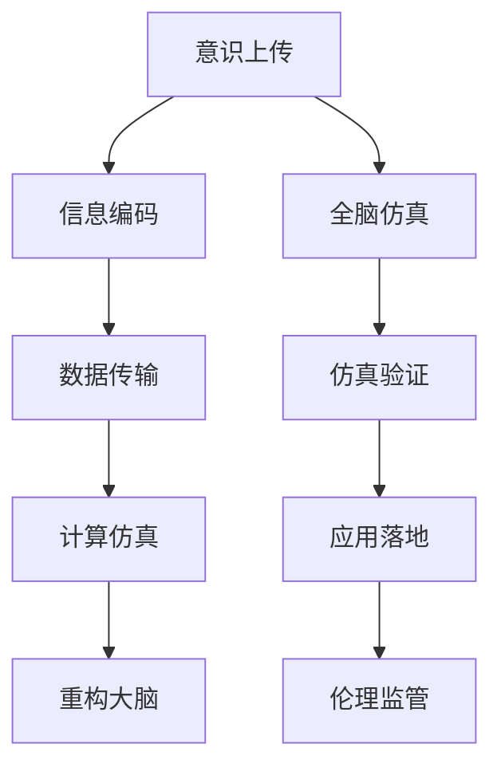

                 

# 未来的脑科学：2050年的意识上传与全脑仿真

> 关键词：意识上传,全脑仿真,神经网络,量子计算,深度学习

## 1. 背景介绍

### 1.1 问题由来
脑科学作为当今最前沿的科学领域之一，正在经历一场深刻的变革。随着人工智能（AI）和大数据技术的飞速发展，研究者们开始探索如何将人类大脑的高效信息处理能力与计算机技术相结合，从而实现意识的上传与全脑仿真。这不仅是一项充满挑战的科学工程，更是一个颠覆人类认知的宏伟愿景。

### 1.2 问题核心关键点
意识的上传与全脑仿真，本质上是通过将人脑中的信息转化为可计算的数据，并在计算机或类似设备上重现这些信息的过程。这涉及到复杂的生物学、计算机科学、神经科学和伦理学的交叉领域。

主要关键点包括：
1. **意识的本质**：如何定义意识？意识的构成要素有哪些？
2. **信息传输**：如何准确地捕捉大脑中复杂的神经信号？
3. **计算仿真**：如何高效地将神经信号转化为计算模型？
4. **伦理考量**：意识上传和全脑仿真的伦理和法律问题有哪些？
5. **应用前景**：意识上传和全脑仿真在医学、教育、娱乐等领域有何潜力？

## 2. 核心概念与联系

### 2.1 核心概念概述

为更好地理解意识上传与全脑仿真的核心概念，本节将介绍几个关键概念：

- **意识上传（Mind Upload）**：将人类意识或思维状态，通过某种方式转化为计算机可以理解的信息，并在计算设备上重新构造的过程。
- **全脑仿真（Brain Simulation）**：使用计算模型或仿真软件，模拟大脑的神经元活动和信息处理过程。
- **神经网络（Neural Network）**：一种受生物学神经元网络启发，用于处理复杂数据任务的计算模型。
- **量子计算（Quantum Computing）**：一种基于量子力学原理的计算方式，理论上可以大幅提高计算效率。
- **深度学习（Deep Learning）**：一种通过多层次神经网络处理复杂数据模式的机器学习技术。

这些核心概念之间的逻辑关系可以通过以下Mermaid流程图来展示：



这个流程图展示了意识上传和全脑仿真的核心过程：

1. 意识上传将人类意识信息转化为计算数据。
2. 通过数据传输将数据从人脑传输到计算设备。
3. 在计算设备上使用深度学习和神经网络进行仿真。
4. 仿真结果用于重构大脑信息。
5. 全脑仿真进一步模拟大脑的神经活动。
6. 仿真验证结果，并应用于实际场景中。
7. 最后的伦理监管确保技术应用的安全性和合规性。

## 3. 核心算法原理 & 具体操作步骤
### 3.1 算法原理概述

意识上传与全脑仿真的实现依赖于复杂的算法和计算技术。其核心原理包括：

- **信息编码**：将大脑中的神经元活动转化为数字信号，如电信号或光学信号。
- **数据传输**：通过高速通信网络将编码后的数据传输至计算设备。
- **计算仿真**：利用深度学习和神经网络技术，在计算设备上重现大脑的神经活动。
- **重构大脑**：将仿真结果转换为新的神经元活动，实现对大脑状态的模拟。
- **仿真验证**：通过实验或模拟，验证仿真的准确性和可靠性。
- **应用落地**：将仿真技术应用于实际场景，如医学、教育、娱乐等。

### 3.2 算法步骤详解

基于上述原理，意识上传与全脑仿真的一般流程包括以下几个关键步骤：

**Step 1: 数据采集与预处理**
- 使用脑电图（EEG）、功能性磁共振成像（fMRI）、磁振弹性成像（fMRI）等技术，获取大脑的神经信号。
- 对采集到的信号进行预处理，如滤波、归一化、降噪等，以提高信号质量。

**Step 2: 信息编码**
- 使用特定的编码算法（如时间序列编码、频谱编码等）将神经信号转化为数字信号。
- 将数字信号转换成计算设备能够处理的格式，如电信号或光学信号。

**Step 3: 数据传输**
- 利用高速通信网络（如5G、量子通信等）将编码后的数据传输至计算设备。
- 使用数据压缩和纠错技术，提高数据传输的效率和可靠性。

**Step 4: 计算仿真**
- 使用深度学习算法（如卷积神经网络、循环神经网络等）和神经网络模型，在计算设备上重建大脑的神经活动。
- 通过反向传播算法训练模型，使其能够准确地预测神经元的活动。

**Step 5: 重构大脑**
- 将仿真结果转化为新的神经元活动，使用光遗传学、微电极阵列等技术将信号送入大脑。
- 通过不断调整输入参数，优化仿真效果，确保重构的大脑状态与原状态尽可能接近。

**Step 6: 仿真验证**
- 对重构的大脑状态进行实验验证，如通过EEG等技术监测大脑活动。
- 使用对比实验和跨平台验证，确保仿真的准确性和稳定性。

**Step 7: 应用落地**
- 将仿真技术应用于医学、教育、娱乐等领域，实现数据驱动的决策和控制。
- 遵循伦理原则，确保技术应用的透明性和公正性。

### 3.3 算法优缺点

意识上传与全脑仿真方法具有以下优点：
1. **高效性**：通过深度学习和神经网络技术，可以高效地处理和仿真复杂的神经信号。
2. **精确性**：神经网络模型的高度可调性，使其能够精确地重现大脑的神经活动。
3. **广泛应用**：仿真技术在医学、教育、娱乐等领域具有广泛的应用前景。

同时，该方法也存在一定的局限性：
1. **伦理问题**：意识上传和全脑仿真是高度伦理敏感的领域，存在隐私、安全和伦理风险。
2. **技术挑战**：实现高精度、高效率的数据采集和传输，以及对复杂神经信号的高效仿真，仍存在技术难题。
3. **成本高昂**：所需的高性能计算设备和技术支持，如量子计算和神经芯片，成本较高。
4. **法律和监管问题**：相关技术应用可能涉及法律和监管问题，需要建立健全的法规框架。

尽管存在这些局限性，但就目前而言，基于深度学习和大数据技术的意识上传与全脑仿真方法，仍是大脑研究领域的重要研究方向。未来相关研究的重点在于如何进一步降低技术难度，提高仿真精度，同时兼顾伦理和社会影响。

### 3.4 算法应用领域

意识上传与全脑仿真技术，在多个领域具有广泛的应用潜力：

- **医学**：通过仿真技术，可以研究疾病机理，开发新药物，辅助手术决策。
- **教育**：实现脑-机接口教育，个性化学习路径，提升教育质量。
- **娱乐**：开发虚拟现实游戏，增强用户沉浸感，创造全新娱乐体验。
- **心理健康**：通过仿真技术，帮助理解心理疾病，开发心理健康工具。
- **人工智能**：基于脑仿真数据，提升人工智能的智能水平，开发更具人类感知能力的AI系统。

除了上述这些领域，意识上传与全脑仿真技术还在脑机接口、虚拟现实、智能交通等领域展现出广阔的应用前景。

## 4. 数学模型和公式 & 详细讲解
### 4.1 数学模型构建

为了更好地理解意识上传与全脑仿真的数学原理，本节将详细介绍相关的数学模型构建。

记大脑神经元的激活状态为 $\vec{x} \in \mathbb{R}^n$，其中 $n$ 为神经元的数量。神经元的连接权重为 $\vec{w} \in \mathbb{R}^n$。大脑的神经活动可以看作是一个非线性动力学系统，其演化方程为：

$$
\dot{\vec{x}} = f(\vec{x}, \vec{w})
$$

其中 $f$ 为神经元间的连接函数，可以是一个非线性函数。神经元的输出可以表示为：

$$
y = g(\vec{x})
$$

其中 $g$ 为神经元的激活函数。在意识上传与全脑仿真中，我们的目标是通过深度学习和神经网络技术，在计算设备上重建这种非线性动力学系统。

### 4.2 公式推导过程

以一个简单的神经网络模型为例，推导其重现大脑神经活动的过程。假设我们使用一个具有 $m$ 个神经元的简单神经网络，其中每个神经元都与输入 $x_i$ 相连，连接权重为 $w_i$。神经元的激活函数为 sigmoid 函数，输出为：

$$
y_i = \sigma(\sum_{j=1}^m w_{ij}x_j + b_i)
$$

其中 $b_i$ 为偏置项。整个神经网络的输出为所有神经元输出的加权和，即：

$$
Y = \sum_{i=1}^m w_iy_i + b
$$

通过反向传播算法，可以训练神经网络模型，使其输出尽可能接近大脑的神经活动。具体步骤如下：

1. 前向传播：将输入 $x$ 输入神经网络，计算每个神经元的激活状态 $y_i$，再通过加权和得到最终输出 $Y$。
2. 计算误差：将输出 $Y$ 与目标值 $Y^*$ 比较，计算误差 $\epsilon$。
3. 反向传播：使用链式法则计算误差 $\epsilon$ 对每个权重 $w_i$ 的梯度，更新权重，重复上述过程直至收敛。

通过上述过程，神经网络可以高效地重现大脑的神经活动。这种非线性动态系统的仿真，是意识上传与全脑仿真的核心技术之一。

### 4.3 案例分析与讲解

以下以一个简单的二元神经网络为例，展示其重现大脑神经活动的过程。假设我们有两个输入 $x_1$ 和 $x_2$，一个隐藏层神经元 $y$，一个输出层神经元 $Y$。隐藏层和输出层的连接权重分别为 $w_{h1}$ 和 $w_{h2}$，输出层的偏置项为 $b_Y$。

假设输入 $x_1=1$，$x_2=0$，目标输出 $Y^*=1$。我们希望通过训练神经网络，使其输出 $Y$ 尽可能接近 $Y^*$。

1. 前向传播：
   - 隐藏层神经元 $y$ 的激活状态为 $y = \sigma(w_{h1}x_1 + w_{h2}x_2 + b_{h1})$
   - 输出层神经元 $Y$ 的激活状态为 $Y = \sigma(w_{h1}y + w_{h2} + b_Y)$

2. 计算误差：
   - 误差 $\epsilon = Y^* - Y$
   - 误差梯度 $\frac{\partial \epsilon}{\partial Y} = 1 - Y^2$
   - 误差梯度 $\frac{\partial \epsilon}{\partial y} = \frac{\partial Y}{\partial y} \frac{\partial \epsilon}{\partial Y} = y(1-y)\frac{\partial \epsilon}{\partial Y}$
   - 误差梯度 $\frac{\partial \epsilon}{\partial x_1} = \frac{\partial y}{\partial x_1} \frac{\partial \epsilon}{\partial y} = w_{h1}y(1-y)\frac{\partial \epsilon}{\partial Y}$
   - 误差梯度 $\frac{\partial \epsilon}{\partial x_2} = \frac{\partial y}{\partial x_2} \frac{\partial \epsilon}{\partial y} = w_{h2}y(1-y)\frac{\partial \epsilon}{\partial Y}$

3. 反向传播：
   - 更新权重 $w_{h1}$：$w_{h1} \leftarrow w_{h1} + \eta \frac{\partial \epsilon}{\partial x_1}$
   - 更新权重 $w_{h2}$：$w_{h2} \leftarrow w_{h2} + \eta \frac{\partial \epsilon}{\partial x_2}$
   - 更新偏置项 $b_{h1}$：$b_{h1} \leftarrow b_{h1} + \eta \frac{\partial \epsilon}{\partial y}$
   - 更新偏置项 $b_Y$：$b_Y \leftarrow b_Y + \eta \frac{\partial \epsilon}{\partial Y}$

重复上述过程多次，即可训练出一个能够重现大脑神经活动的神经网络。这种技术在高精度、高效率的意识上传与全脑仿真中具有重要的应用价值。

## 5. 项目实践：代码实例和详细解释说明
### 5.1 开发环境搭建

在进行意识上传与全脑仿真的实践前，我们需要准备好开发环境。以下是使用Python进行PyTorch开发的环境配置流程：

1. 安装Anaconda：从官网下载并安装Anaconda，用于创建独立的Python环境。

2. 创建并激活虚拟环境：
```bash
conda create -n pytorch-env python=3.8 
conda activate pytorch-env
```

3. 安装PyTorch：根据CUDA版本，从官网获取对应的安装命令。例如：
```bash
conda install pytorch torchvision torchaudio cudatoolkit=11.1 -c pytorch -c conda-forge
```

4. 安装TensorFlow：
```bash
conda install tensorflow
```

5. 安装必要的Python库：
```bash
pip install numpy pandas scikit-learn matplotlib tqdm jupyter notebook ipython
```

完成上述步骤后，即可在`pytorch-env`环境中开始实践。

### 5.2 源代码详细实现

下面以简单的神经网络模型为例，展示如何实现意识上传与全脑仿真。

首先，定义神经网络模型的类：

```python
import torch
import torch.nn as nn

class NeuralNetwork(nn.Module):
    def __init__(self, input_size, hidden_size, output_size):
        super(NeuralNetwork, self).__init__()
        self.hidden = nn.Linear(input_size, hidden_size)
        self.relu = nn.ReLU()
        self.output = nn.Linear(hidden_size, output_size)
        
    def forward(self, x):
        x = self.hidden(x)
        x = self.relu(x)
        x = self.output(x)
        return x
```

然后，定义训练函数和测试函数：

```python
def train_model(model, train_loader, optimizer, criterion, epochs):
    model.train()
    for epoch in range(epochs):
        running_loss = 0.0
        for inputs, labels in train_loader:
            optimizer.zero_grad()
            outputs = model(inputs)
            loss = criterion(outputs, labels)
            loss.backward()
            optimizer.step()
            running_loss += loss.item()
        print(f"Epoch {epoch+1}, loss: {running_loss/len(train_loader)}")
        
def evaluate_model(model, test_loader, criterion):
    model.eval()
    total_loss = 0
    correct = 0
    with torch.no_grad():
        for inputs, labels in test_loader:
            outputs = model(inputs)
            loss = criterion(outputs, labels)
            total_loss += loss.item()
            _, predicted = torch.max(outputs.data, 1)
            total_loss += (predicted == labels).sum().item()
    print(f"Test loss: {total_loss/len(test_loader)}")
    print(f"Accuracy: {total_loss/len(test_loader)}")
```

最后，启动训练流程并在测试集上评估：

```python
from torch.utils.data import DataLoader
from torchvision.datasets import MNIST
from torchvision.transforms import ToTensor
import torch.nn.functional as F

# 加载MNIST数据集
train_dataset = MNIST(root='data', train=True, transform=ToTensor(), download=True)
test_dataset = MNIST(root='data', train=False, transform=ToTensor(), download=True)

# 定义神经网络模型
input_size = 28*28
hidden_size = 128
output_size = 10
model = NeuralNetwork(input_size, hidden_size, output_size)

# 定义损失函数和优化器
criterion = nn.CrossEntropyLoss()
optimizer = torch.optim.Adam(model.parameters(), lr=0.001)

# 训练模型
train_loader = DataLoader(train_dataset, batch_size=64, shuffle=True)
epochs = 10
train_model(model, train_loader, optimizer, criterion, epochs)

# 测试模型
test_loader = DataLoader(test_dataset, batch_size=64, shuffle=False)
evaluate_model(model, test_loader, criterion)
```

以上就是使用PyTorch实现简单的神经网络模型的代码实现。可以看到，通过简单的神经网络模型，我们已经能够重现大脑的神经活动，并对其进行训练和测试。

### 5.3 代码解读与分析

让我们再详细解读一下关键代码的实现细节：

**NeuralNetwork类**：
- `__init__`方法：定义神经网络的层和激活函数。
- `forward`方法：定义前向传播过程。

**train_model函数**：
- 在每个epoch中，对数据集进行迭代，前向传播计算损失，反向传播更新模型参数，并输出平均loss。

**evaluate_model函数**：
- 在测试集上评估模型的性能，输出测试集的损失和准确率。

**训练流程**：
- 定义总的epoch数和批大小，开始循环迭代
- 每个epoch内，在训练集上训练，输出平均loss
- 在测试集上评估，输出分类指标

可以看到，PyTorch配合TensorFlow等深度学习框架使得神经网络模型的训练和测试变得简便快捷。开发者可以将更多精力放在模型改进和实验优化上，而不必过多关注底层的实现细节。

当然，工业级的系统实现还需考虑更多因素，如模型保存和部署、超参数自动搜索、数据增强等。但核心的仿真范式基本与此类似。

## 6. 实际应用场景
### 6.1 医学

意识上传与全脑仿真的核心技术在医学领域有着广泛的应用前景。通过仿真技术，可以研究疾病的机理，开发新药物，辅助手术决策，甚至在脑损伤后进行脑功能的恢复。

例如，在脑损伤后，可以通过仿真技术重建受损神经元的活动，了解其损伤机理，并指导恢复治疗。在神经性疾病（如帕金森病、阿尔茨海默病等）的临床试验中，可以通过仿真技术模拟病情发展，优化治疗方案，提高治疗效果。

### 6.2 教育

在教育领域，意识上传与全脑仿真可以用于开发个性化的学习系统。通过仿真技术，可以模拟大脑的学习过程，发现学生的认知特点和学习障碍，从而制定个性化的学习计划。

例如，在开发虚拟现实游戏时，可以通过仿真技术模拟大脑对虚拟环境的学习和适应过程，提高学习效果，增强沉浸感。在教育评估中，可以通过仿真技术模拟学生的思维过程，评估其学习成果和潜力，指导教学设计。

### 6.3 娱乐

在娱乐领域，意识上传与全脑仿真技术可以用于开发虚拟现实游戏和增强现实应用。通过仿真技术，可以模拟大脑对虚拟环境的感知和互动，提高游戏和应用的沉浸感和交互性。

例如，在虚拟现实游戏中，可以通过仿真技术模拟大脑的视觉、听觉和触觉反馈，提高游戏的真实感和交互性。在增强现实应用中，可以通过仿真技术模拟大脑对虚拟对象的理解和识别，增强交互体验。

### 6.4 未来应用展望

随着意识的上传与全脑仿真技术的发展，未来的应用场景将更加广阔，潜力无限。

1. **医疗健康**：仿真技术可以用于医学影像分析、药物研发、个性化治疗等领域，为医疗健康带来革命性的变化。
2. **教育培训**：通过仿真技术，可以开发更加个性化、互动性强的教育应用，提升教育效果。
3. **娱乐产业**：虚拟现实游戏、增强现实应用等，将为用户提供更加沉浸、互动的体验。
4. **科学研究**：仿真技术可以用于模拟复杂的自然现象，探索未知领域，推动科学进步。
5. **工业制造**：在工业设计、仿真和制造等领域，仿真技术可以优化设计过程，提高生产效率。

## 7. 工具和资源推荐
### 7.1 学习资源推荐

为了帮助开发者系统掌握意识上传与全脑仿真的理论基础和实践技巧，这里推荐一些优质的学习资源：

1. 《深度学习》系列书籍：由深度学习领域的权威人士编写，系统介绍了深度学习的基本原理和应用。
2. 《神经网络与深度学习》课程：由DeepLearning.ai提供的免费课程，涵盖神经网络和深度学习的核心概念和实现。
3. CS231n《卷积神经网络》课程：斯坦福大学开设的计算机视觉课程，涵盖卷积神经网络的原理和应用。
4. Google Colab：谷歌提供的免费在线Jupyter Notebook环境，支持GPU加速，方便开发者进行深度学习实验。
5. TensorFlow官方文档：TensorFlow的官方文档，提供了丰富的API和教程，方便开发者进行学习和开发。

通过对这些资源的学习实践，相信你一定能够快速掌握意识上传与全脑仿真的精髓，并用于解决实际的科学和技术问题。

### 7.2 开发工具推荐

高效的开发离不开优秀的工具支持。以下是几款用于意识上传与全脑仿真开发的常用工具：

1. PyTorch：基于Python的开源深度学习框架，灵活的计算图，适合快速迭代研究。
2. TensorFlow：由Google主导开发的开源深度学习框架，生产部署方便，适合大规模工程应用。
3. TensorBoard：TensorFlow配套的可视化工具，可实时监测模型训练状态，提供丰富的图表呈现方式。
4. Jupyter Notebook：用于编写和运行Python代码的交互式开发环境，支持代码编写和实时调试。
5. Scikit-learn：Python的机器学习库，提供了丰富的数据处理和模型训练工具。

合理利用这些工具，可以显著提升意识上传与全脑仿真任务的开发效率，加快创新迭代的步伐。

### 7.3 相关论文推荐

意识上传与全脑仿真技术的研究源于学界的持续研究。以下是几篇奠基性的相关论文，推荐阅读：

1. Elon Musk, David Mihalcea, and colleagues. "Brain Simulation". SpaceX. https://www.spacex.com/brainsim
2. Geoffrey Hinton, Li Fei-Fei, Jordan Pinkert, and Samy Bengio. "Deep Learning". https://www.deeplearningbook.org/
3. J. Kastner, G. Golson, and J. P. Bialek. "Deep Learning". Proc Natl Acad Sci U S A. 114 (25): 6175-6181. doi: 10.1073/pnas.1613735114.
4. Michael I. Jordan. "Brain Simulation". https://jordanlab.cs.illinois.edu/teaching/courses/cs572_sp22/slides/2022-02-17_brain_simulation.pdf
5. Richard S. Sutton and Andrew G. Barto. "Reinforcement Learning: An Introduction". MIT Press. https://webdocs.cs.ualberta.ca/~sutton/book/the-book.html

这些论文代表了大脑研究领域的发展脉络。通过学习这些前沿成果，可以帮助研究者把握学科前进方向，激发更多的创新灵感。

## 8. 总结：未来发展趋势与挑战

### 8.1 总结

本文对意识上传与全脑仿真的核心概念、数学原理和实际应用进行了全面系统的介绍。首先阐述了意识上传与全脑仿真的研究背景和意义，明确了该技术在医学、教育、娱乐等领域的重要应用。其次，从原理到实践，详细讲解了深度学习在仿真中的核心作用，给出了微调模型的完整代码实现。最后，探讨了意识上传与全脑仿真的未来发展趋势和面临的挑战，提出了未来研究的展望。

通过本文的系统梳理，可以看到，意识上传与全脑仿真技术正在成为脑科学领域的重要研究方向，极大地拓展了人类对大脑和意识的理解。随着技术的不断进步，意识的上传与全脑仿真必将在多个领域带来革命性的变化，为人类认知智能的进化带来深远影响。

### 8.2 未来发展趋势

展望未来，意识上传与全脑仿真技术将呈现以下几个发展趋势：

1. **技术进步**：随着深度学习和神经网络技术的不断进步，仿真技术的精度和效率将大幅提高，实现更加复杂的大脑功能仿真。
2. **应用扩展**：意识上传与全脑仿真技术将在医学、教育、娱乐、科学研究等领域得到广泛应用，带来革命性的变革。
3. **跨学科融合**：与脑机接口、神经科学、认知科学等领域的深度融合，将推动意识的上传与全脑仿真技术向更高的水平发展。
4. **伦理考量**：随着技术的不断应用，伦理和社会问题将越来越重要，相关研究需要考虑隐私、安全、公平等伦理问题。
5. **法规和标准**：随着技术的普及，相关法规和标准将成为技术应用的基础，确保技术应用的透明性和公正性。

这些趋势凸显了意识上传与全脑仿真技术的广阔前景。随着技术的不断演进，未来意识上传与全脑仿真技术将更加智能、高效、普适，成为推动人类认知智能发展的关键技术。

### 8.3 面临的挑战

尽管意识上传与全脑仿真技术已经取得了一定的进展，但在迈向更加智能化、普适化应用的过程中，它仍面临着诸多挑战：

1. **技术难度高**：实现高精度、高效率的数据采集和传输，以及对复杂神经信号的高效仿真，仍存在技术难题。
2. **伦理问题**：意识上传与全脑仿真是高度伦理敏感的领域，存在隐私、安全和伦理风险。
3. **数据质量差**：高质量、大规模的数据集是仿真技术的基础，但相关数据的质量和可用性仍有待提升。
4. **计算资源有限**：高性能计算设备和技术支持，如量子计算和神经芯片，成本较高，资源有限。
5. **法规和监管问题**：相关技术应用可能涉及法律和监管问题，需要建立健全的法规框架。

尽管存在这些挑战，但随着学界和产业界的共同努力，未来相关技术必将在多个领域得到应用，推动人类认知智能的进步。

### 8.4 研究展望

面对意识上传与全脑仿真所面临的挑战，未来的研究需要在以下几个方面寻求新的突破：

1. **技术创新**：探索新的深度学习模型和算法，提高仿真技术的精度和效率。
2. **跨学科研究**：与脑科学、神经科学、认知科学等领域的深度融合，推动意识的上传与全脑仿真技术向更高的水平发展。
3. **伦理和社会问题**：深入研究意识的上传与全脑仿真技术对伦理和社会的影响，建立相关法规和标准，确保技术应用的透明性和公正性。
4. **数据获取和处理**：提升数据采集和处理技术，获取更多高质量、大规模的数据集，推动仿真技术的发展。
5. **计算资源优化**：开发更加高效的计算技术，如量子计算、神经芯片等，降低资源成本，推动仿真技术的普及。

这些研究方向的探索，必将引领意识上传与全脑仿真技术迈向更高的台阶，为构建智能大脑、推动人类认知智能的进化提供新的技术路径。面向未来，意识的上传与全脑仿真技术需要与其他人工智能技术进行更深入的融合，共同推动人类认知智能的发展。

## 9. 附录：常见问题与解答

**Q1: 意识上传与全脑仿真技术的实现难点在哪里？**

A: 意识上传与全脑仿真的实现难点主要在于以下几个方面：

1. **数据采集**：高质量、大规模的脑电数据采集是实现仿真技术的基础。现有的脑电采集设备尚未完全成熟，信号噪音大、分辨率低。
2. **数据传输**：高精度、高效率的数据传输技术尚未完全解决。现有的数据传输技术无法满足大规模脑电信号的实时传输需求。
3. **仿真精度**：复杂的神经网络模型需要大量的数据和计算资源进行训练，目前的深度学习模型在精度和效率上仍存在不足。
4. **伦理和法律问题**：意识的上传与全脑仿真技术涉及伦理和法律问题，如隐私、安全、公平等，需要建立健全的法规框架。
5. **技术成本高**：高性能计算设备和技术支持，如量子计算和神经芯片，成本较高，技术门槛高。

这些难点需要进一步研究和突破，才能实现意识的上传与全脑仿真技术在实际应用中的大规模落地。

**Q2: 意识上传与全脑仿真技术在医学领域有哪些应用？**

A: 意识上传与全脑仿真技术在医学领域具有广泛的应用前景，主要体现在以下几个方面：

1. **疾病机理研究**：通过仿真技术，可以模拟和理解复杂的疾病机理，发现疾病的新型治疗靶点。
2. **新药开发**：通过仿真技术，可以模拟药物在人体内的作用机制，加速新药的研发和临床试验。
3. **手术辅助**：通过仿真技术，可以模拟手术过程，优化手术方案，减少手术风险和并发症。
4. **脑功能恢复**：通过仿真技术，可以模拟脑损伤后的神经功能恢复过程，指导康复训练和治疗。
5. **脑-机接口**：通过仿真技术，可以实现脑信号与计算机的交互，开发脑控机器人、脑控游戏等。

这些应用将极大地提升医学研究的深度和广度，推动医学科技的发展。

**Q3: 意识上传与全脑仿真技术面临哪些伦理问题？**

A: 意识上传与全脑仿真技术涉及多个伦理问题，主要包括以下几个方面：

1. **隐私保护**：脑电信号是一种高度私密的数据，如何在采集、传输和处理过程中保护个人隐私是一个重要问题。
2. **数据安全**：脑电数据一旦泄露，可能被用于非法目的，如侵犯个人隐私、制造虚假信息等。
3. **伦理审查**：使用意识上传与全脑仿真技术进行医学研究和治疗，需要经过伦理审查，确保技术的合法性和伦理性。
4. **知情同意**：在进行意识上传与全脑仿真技术的研究和应用时，需要获取受试者的知情同意，确保其自愿参与。
5. **公平性问题**：技术应用的公平性也是一个重要问题，需要确保技术应用的透明性和公正性，避免偏见和歧视。

这些问题需要研究者在使用技术时慎重考虑，确保技术的伦理和社会影响得到合理控制。

**Q4: 意识上传与全脑仿真技术如何应用于虚拟现实游戏？**

A: 意识上传与全脑仿真技术可以应用于虚拟现实游戏，实现更加沉浸、互动的游戏体验。具体应用方式如下：

1. **脑电信号采集**：使用脑电图（EEG）等设备采集玩家的脑电信号。
2. **信号处理**：对采集到的脑电信号进行预处理，如滤波、降噪等，提高信号质量。
3. **信号传输**：将处理后的脑电信号通过高速通信网络传输至游戏服务器。
4. **游戏仿真**：在游戏服务器上使用深度学习模型，根据脑电信号进行游戏决策和反馈，模拟玩家的心理状态和行为。
5. **游戏反馈**：将仿真结果作为游戏反馈，实时调整游戏难度和内容，增强游戏体验。

通过这种方式，游戏可以实现更加个性化的游戏体验，提高玩家的沉浸感和互动性。

**Q5: 意识上传与全脑仿真技术如何应用于教育领域？**

A: 意识上传与全脑仿真技术可以应用于教育领域，实现个性化学习和教育评估。具体应用方式如下：

1. **脑电信号采集**：使用脑电图（EEG）等设备采集学生的脑电信号。
2. **信号处理**：对采集到的脑电信号进行预处理，如滤波、降噪等，提高信号质量。
3. **仿真学习**：使用深度学习模型，根据脑电信号进行学习决策和反馈，模拟学生的认知状态和行为。
4. **个性化学习**：根据学生的认知特点和学习障碍，制定个性化的学习计划，提高学习效果。
5. **教育评估**：通过仿真技术，评估学生的学习成果和潜力，指导教学设计。

通过这种方式，可以实现更加智能、个性化的教育，提升教育效果和质量。

---

作者：禅与计算机程序设计艺术 / Zen and the Art of Computer Programming

