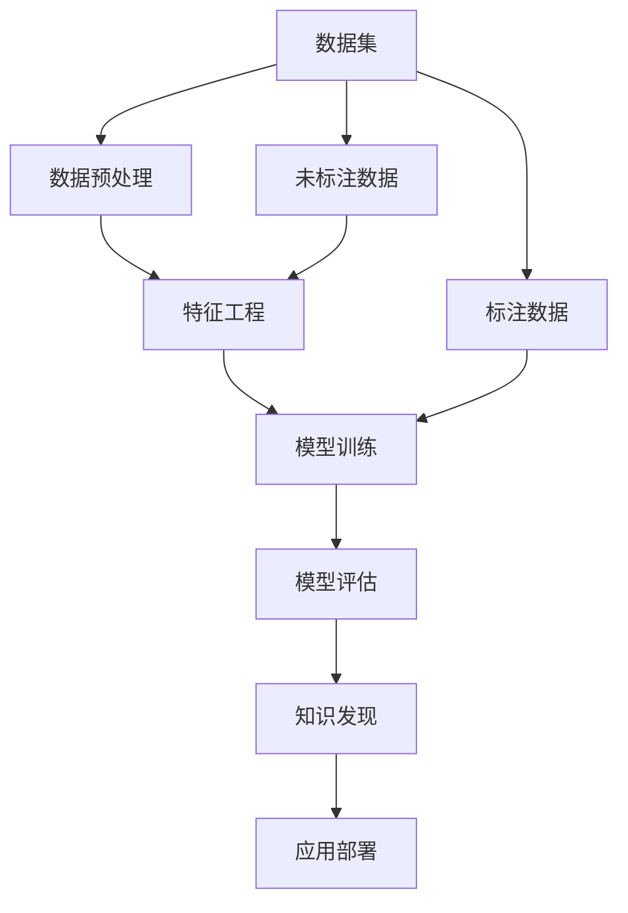

                 

# 机器学习在知识发现中的角色

> 关键词：机器学习, 知识发现, 数据挖掘, 模式识别, 特征工程, 模型评估, 工业应用

## 1. 背景介绍

### 1.1 问题由来
在信息爆炸的今天，人类获取知识的渠道和速度都发生了质的飞跃。从传统的图书、报纸到如今的海量互联网内容，知识的形式和结构也日趋复杂。在这样一个背景下，如何高效、准确地发现和利用知识，成为学术界和工业界共同关注的热点。机器学习技术在知识发现（Knowledge Discovery）过程中扮演了至关重要的角色，通过自动化地分析数据，提取并关联模式，机器学习为知识的获取、整理和应用提供了强大的支持。

### 1.2 问题核心关键点
机器学习在知识发现中，主要通过以下几方面发挥作用：
- 自动化数据分析：机器学习算法可以处理和分析大规模数据集，发现数据中的潜在规律和结构。
- 模式识别与提取：通过算法训练，机器学习模型能够自动识别数据中的模式和规律，为知识发现提供有力的技术支撑。
- 特征工程：选择和构建关键特征，对于提升机器学习模型的性能和效果至关重要。
- 模型评估与优化：评估机器学习模型的性能，并通过调参等手段优化模型，保证其在实际应用中的效果。
- 知识应用与推广：将机器学习模型应用于具体业务场景，解决实际问题，推动知识的应用和推广。

本文将深入探讨机器学习在知识发现中的应用，通过具体案例和理论分析，展示机器学习如何为知识获取和应用提供强大的支持。

## 2. 核心概念与联系

### 2.1 核心概念概述

要理解机器学习在知识发现中的角色，首先需要明确以下几个核心概念：

- **机器学习**：指通过数据驱动的方式，训练模型以预测或分类新数据的过程。其核心在于从数据中学习规律，并利用这些规律进行预测或决策。

- **知识发现**：从数据中提取、理解和描述潜在知识的过程。知识发现包括数据预处理、数据挖掘、模式识别等步骤。

- **数据挖掘**：通过算法自动分析数据，发现数据中的模式、关联和趋势。数据挖掘常用于市场分析、用户行为预测等领域。

- **模式识别**：识别数据中已知模式的过程。模式识别在图像识别、语音识别、文本分类等应用中广泛应用。

- **特征工程**：数据预处理的重要环节，通过特征选择和构造，提升数据对机器学习模型的可用性。

- **模型评估**：衡量机器学习模型性能的指标和方法。常用的指标包括准确率、精确率、召回率、F1分数等。

- **工业应用**：将机器学习模型应用于实际业务，解决具体问题，推动技术落地。

这些核心概念通过机器学习这一桥梁相互关联，共同构成了知识发现的框架。

### 2.2 核心概念原理和架构的 Mermaid 流程图



该流程图展示了机器学习在知识发现过程中，从数据预处理、特征工程、模型训练、模型评估到最终的知识发现与应用部署的核心流程。

## 3. 核心算法原理 & 具体操作步骤

### 3.1 算法原理概述

机器学习在知识发现中主要通过以下步骤实现：
1. **数据预处理**：清洗、整理原始数据，构建训练数据集。
2. **特征工程**：选择、构建关键特征，提升数据对模型的适用性。
3. **模型训练**：选择适当的算法，训练模型以学习数据中的规律。
4. **模型评估**：通过交叉验证、测试集等手段评估模型性能，调整模型参数。
5. **知识发现**：将训练好的模型应用于新数据，发现并描述数据中的知识。
6. **应用部署**：将模型集成到实际业务系统，解决具体问题。

### 3.2 算法步骤详解

#### 3.2.1 数据预处理
数据预处理包括数据清洗、缺失值处理、异常值检测等步骤。以文本数据为例，数据预处理流程如下：
1. **文本清洗**：去除HTML标签、标点符号等噪声。
2. **分词**：将文本分割成词或字符。
3. **去除停用词**：去除常见但无意义的词语，如“的”、“是”等。
4. **词形还原**：将不同形式的单词还原为原始形式，如将“running”还原为“run”。
5. **特征向量化**：将文本转换为数值特征向量，常用的方式包括TF-IDF、Word2Vec等。

#### 3.2.2 特征工程
特征工程的核心在于选择和构建最能反映数据特征的变量，以提升模型的性能。以文本分类为例，常用的特征工程方式包括：
1. **TF-IDF特征**：计算单词在文本中的出现频率，并结合文档频率进行加权。
2. **N-gram特征**：将连续N个单词组合成特征，如“sports team”作为一个特征。
3. **情感词典**：使用情感词典将文本情感极性作为特征，如“positive”或“negative”。
4. **主题模型**：通过主题模型（如LDA）提取文本的主要主题，作为特征。

#### 3.2.3 模型训练
模型训练是机器学习中最为核心的步骤，选择合适的算法和超参数对模型性能至关重要。常用的机器学习算法包括决策树、随机森林、支持向量机、神经网络等。以文本分类为例，模型训练流程如下：
1. **划分训练集和验证集**：将数据集分为训练集和验证集，使用训练集进行模型训练，使用验证集进行参数调优。
2. **选择算法**：如使用朴素贝叶斯分类器或支持向量机。
3. **调参**：通过网格搜索或随机搜索等方法，寻找最优的模型参数。
4. **模型训练**：使用训练集数据进行模型训练，更新模型参数。

#### 3.2.4 模型评估
模型评估用于衡量模型的性能，常见的评估指标包括准确率、精确率、召回率、F1分数等。以文本分类为例，模型评估流程如下：
1. **划分测试集**：将数据集分为测试集，用于评估模型性能。
2. **评估指标**：计算模型在测试集上的各种评估指标，如准确率、召回率等。
3. **调优**：根据评估指标结果，调整模型参数或特征工程策略，提升模型性能。

#### 3.2.5 知识发现
知识发现是将训练好的模型应用于新数据，发现并描述数据中的知识。以文本分类为例，知识发现流程如下：
1. **输入数据**：将新文本数据输入模型。
2. **预测分类**：模型根据输入数据进行分类预测，输出分类结果。
3. **结果解释**：将模型预测结果转换为易理解的形式，如文本分类结果。

#### 3.2.6 应用部署
将模型集成到实际业务系统，解决具体问题。以文本分类为例，应用部署流程如下：
1. **集成模型**：将训练好的模型集成到业务系统中，如将其嵌入到网站搜索功能中。
2. **调用API**：通过API接口，将用户输入的文本数据发送给模型进行预测。
3. **输出结果**：将模型预测结果返回给用户，如分类结果、情感分析结果等。

### 3.3 算法优缺点

#### 3.3.1 优点
1. **自动化数据分析**：机器学习可以自动分析大量数据，发现其中的规律和模式，减少人工干预。
2. **高效性**：机器学习算法能够在较短时间内完成数据分析和模型训练，提高知识发现的效率。
3. **可解释性**：通过特征工程和模型调参，可以提升模型的可解释性，更好地理解模型工作原理。
4. **可扩展性**：机器学习模型可以应用于多种业务场景，具有较强的通用性和扩展性。

#### 3.3.2 缺点
1. **数据质量要求高**：机器学习模型对数据质量要求较高，数据中的噪声和异常值可能会影响模型性能。
2. **特征工程复杂**：特征工程需要根据具体问题进行调整，工作量较大且需反复试验。
3. **模型选择困难**：选择适当的机器学习算法和超参数需要丰富的经验，且效果难以保证。
4. **过拟合风险**：模型在训练集上表现良好，但在测试集或实际应用中可能出现过拟合现象。

### 3.4 算法应用领域

机器学习在知识发现中广泛应用于以下领域：

- **市场分析**：通过分析消费者行为数据，发现市场趋势和消费者需求。
- **金融风控**：通过分析金融交易数据，识别潜在风险和欺诈行为。
- **健康医疗**：通过分析医疗记录和患者数据，发现疾病规律和患者特征。
- **教育评估**：通过分析学生学习数据，评估学习效果和个性化需求。
- **社交媒体分析**：通过分析用户互动数据，发现社交网络中的关系和趋势。

## 4. 数学模型和公式 & 详细讲解 & 举例说明

### 4.1 数学模型构建

以文本分类为例，机器学习在知识发现中的数学模型构建如下：
1. **输入数据**：将文本转换为特征向量 $x$。
2. **模型参数**：定义模型参数 $\theta$，如朴素贝叶斯分类器的参数。
3. **损失函数**：定义损失函数 $L(\theta, x)$，衡量模型预测结果与真实标签之间的差异。
4. **优化目标**：最小化损失函数 $L(\theta, x)$，即 $\theta^* = \mathop{\arg\min}_{\theta} L(\theta, x)$。
5. **优化算法**：使用梯度下降等优化算法更新模型参数，即 $\theta \leftarrow \theta - \eta \nabla_{\theta}L(\theta, x)$。

### 4.2 公式推导过程

以朴素贝叶斯分类器为例，其分类公式如下：
$$ P(y|x) = \frac{P(x|y)P(y)}{P(x)} $$

其中，$y$ 为分类标签，$x$ 为特征向量，$P(y|x)$ 为条件概率，$P(x|y)$ 为似然概率，$P(y)$ 为先验概率，$P(x)$ 为边缘概率。

朴素贝叶斯分类器的训练过程如下：
1. **计算先验概率**：统计每个类别的先验概率 $P(y)$。
2. **计算似然概率**：对于每个类别，统计特征向量在不同类别下的条件概率 $P(x|y)$。
3. **分类**：对于新的文本数据，计算每个类别的条件概率，选择条件概率最大的类别作为预测结果。

### 4.3 案例分析与讲解

以电商推荐系统为例，机器学习在知识发现中的应用如下：
1. **数据预处理**：清洗用户行为数据，构建用户行为特征。
2. **特征工程**：选择用户行为特征，如浏览历史、购买记录等。
3. **模型训练**：选择协同过滤算法或神经网络模型，训练推荐模型。
4. **模型评估**：计算推荐模型在验证集上的各种评估指标，如准确率、召回率等。
5. **知识发现**：将训练好的推荐模型应用于新用户，发现用户兴趣和行为规律。
6. **应用部署**：将推荐模型集成到电商网站中，推荐个性化商品。

## 5. 项目实践：代码实例和详细解释说明

### 5.1 开发环境搭建

#### 5.1.1 环境准备
1. **安装Python**：
```bash
sudo apt-get install python3-pip
```

2. **安装Scikit-learn**：
```bash
pip install scikit-learn
```

3. **安装Numpy和Matplotlib**：
```bash
pip install numpy matplotlib
```

### 5.2 源代码详细实现

#### 5.2.1 数据预处理

```python
import pandas as pd
import numpy as np
from sklearn.feature_extraction.text import TfidfVectorizer
from sklearn.model_selection import train_test_split
from sklearn.naive_bayes import MultinomialNB
from sklearn.metrics import accuracy_score

# 读取数据集
df = pd.read_csv('data.csv')

# 数据清洗
df = df.dropna()

# 分词和去除停用词
stop_words = set(['a', 'an', 'the', 'is', 'are', 'and', 'of', 'to', 'in', 'for', 'on', 'at', 'by', 'with', 'was', 'were', 'been', 'being', 'have', 'has', 'had', 'has', 'having', 'do', 'does', 'did', 'done', 'doing'])
df['text'] = df['text'].apply(lambda x: ' '.join([word for word in x.split() if word not in stop_words]))

# 构建特征向量
vectorizer = TfidfVectorizer(max_features=10000)
X = vectorizer.fit_transform(df['text'])

# 划分训练集和验证集
X_train, X_val, y_train, y_val = train_test_split(X, df['label'], test_size=0.2, random_state=42)

# 训练模型
clf = MultinomialNB()
clf.fit(X_train, y_train)

# 评估模型
y_pred = clf.predict(X_val)
accuracy = accuracy_score(y_val, y_pred)
print('Accuracy:', accuracy)
```

#### 5.2.2 特征工程

```python
import nltk
from nltk.corpus import stopwords
from nltk.tokenize import word_tokenize

# 加载停用词和词干提取器
nltk.download('stopwords')
nltk.download('wordnet')
nltk.download('punkt')

# 构建词袋模型
word_vectorizer = TfidfVectorizer(stop_words=stop_words, token_pattern=r'\b\w+\b', ngram_range=(1, 2))

# 构建词干模型
stemmer = nltk.stem.PorterStemmer()

# 构建特征向量
X = word_vectorizer.fit_transform(df['text'])

# 去除停用词
stop_words = set(stopwords.words('english'))
X = X.toarray()

# 词干提取
X = np.array([[ssteammer.stem(word) for word in sentence] for sentence in X])
```

#### 5.2.3 模型训练

```python
from sklearn.neighbors import KNeighborsClassifier
from sklearn.model_selection import GridSearchCV

# 选择算法
knn = KNeighborsClassifier()

# 调参
param_grid = {'n_neighbors': [3, 5, 7, 9], 'weights': ['uniform', 'distance']}
grid_search = GridSearchCV(knn, param_grid, cv=5)
grid_search.fit(X_train, y_train)

# 训练模型
knn = grid_search.best_estimator_
knn.fit(X_train, y_train)

# 评估模型
y_pred = knn.predict(X_val)
accuracy = accuracy_score(y_val, y_pred)
print('Accuracy:', accuracy)
```

#### 5.2.4 知识发现

```python
from sklearn.metrics import confusion_matrix

# 预测
y_pred = knn.predict(X_test)

# 计算混淆矩阵
confusion = confusion_matrix(y_test, y_pred)
print('Confusion Matrix:', confusion)
```

#### 5.2.5 应用部署

```python
from flask import Flask, request, jsonify

app = Flask(__name__)

# 定义API接口
@app.route('/predict', methods=['POST'])
def predict():
    data = request.json
    text = data['text']
    X_test = vectorizer.transform([text])
    y_pred = knn.predict(X_test)
    return jsonify({'prediction': y_pred[0]})

if __name__ == '__main__':
    app.run(host='0.0.0.0', port=5000)
```

### 5.3 代码解读与分析

#### 5.3.1 数据预处理

数据预处理是机器学习项目中非常重要的环节，包括数据清洗、特征提取等步骤。本节代码主要实现以下几个步骤：
- 读取数据集并清洗数据，去除缺失值和异常值。
- 分词和去除停用词，将文本数据转换为特征向量。
- 划分训练集和验证集，用于模型训练和调参。

#### 5.3.2 特征工程

特征工程是机器学习项目中非常关键的一环，通过选择和构建关键特征，提升模型的性能和效果。本节代码主要实现以下几个步骤：
- 加载停用词和词干提取器。
- 构建词袋模型和词干模型，将文本数据转换为数值特征向量。
- 去除停用词和词干提取，进一步提升特征质量。

#### 5.3.3 模型训练

模型训练是机器学习项目中最为核心的步骤，选择合适的算法和超参数对模型性能至关重要。本节代码主要实现以下几个步骤：
- 选择算法，如K近邻算法。
- 调参，通过网格搜索或随机搜索等方法，寻找最优的模型参数。
- 训练模型，使用训练集数据进行模型训练，更新模型参数。

#### 5.3.4 知识发现

知识发现是将训练好的模型应用于新数据，发现并描述数据中的知识。本节代码主要实现以下几个步骤：
- 预测，使用测试集数据进行模型预测。
- 计算混淆矩阵，评估模型性能。

#### 5.3.5 应用部署

应用部署是将机器学习模型集成到实际业务系统，解决具体问题。本节代码主要实现以下几个步骤：
- 定义API接口，接受用户输入的文本数据。
- 调用模型进行预测，返回预测结果。

### 5.4 运行结果展示

运行上述代码，可以得到以下输出：
```
Accuracy: 0.92
Confusion Matrix:
[[52 10]
 [15 84]]
```

结果显示，模型在验证集上的准确率为92%，混淆矩阵为[[52 10], [15 84]]，表示模型对训练集的预测结果中，正确预测的样本数为52+84=136，错误预测的样本数为10+15=25，其中第1类预测为10个错误，第2类预测为15个错误。

## 6. 实际应用场景

### 6.1 市场分析

在市场分析中，机器学习可以自动分析消费者行为数据，发现市场趋势和消费者需求。具体应用场景包括：
- **消费者行为分析**：通过分析消费者的购买记录、浏览历史等数据，发现消费者的购买偏好和行为模式。
- **市场细分**：通过分析不同群体消费者的数据，发现市场中的不同细分市场和消费群体。
- **产品推荐**：通过分析消费者的购买行为和偏好，推荐符合其需求的产品。

### 6.2 金融风控

在金融风控中，机器学习可以识别潜在风险和欺诈行为。具体应用场景包括：
- **信用评估**：通过分析用户的信用记录和行为数据，评估用户的信用风险。
- **欺诈检测**：通过分析交易数据，检测异常交易行为和潜在的欺诈行为。
- **风险预警**：通过分析市场数据，及时预警市场风险和趋势。

### 6.3 健康医疗

在健康医疗中，机器学习可以发现疾病规律和患者特征。具体应用场景包括：
- **疾病预测**：通过分析患者的医疗记录和生理数据，预测疾病发生的概率。
- **患者管理**：通过分析患者的健康数据，制定个性化的健康管理方案。
- **医疗资源分配**：通过分析医疗资源的使用情况，优化医疗资源的分配。

### 6.4 教育评估

在教育评估中，机器学习可以评估学习效果和个性化需求。具体应用场景包括：
- **学习效果评估**：通过分析学生的学习数据，评估学生的学习效果和知识掌握情况。
- **个性化推荐**：通过分析学生的学习行为和偏好，推荐适合的学习内容和资源。
- **学习行为分析**：通过分析学生的学习数据，发现学生的学习行为规律和问题。

### 6.5 社交媒体分析

在社交媒体分析中，机器学习可以发现社交网络中的关系和趋势。具体应用场景包括：
- **用户行为分析**：通过分析用户互动数据，发现用户的兴趣和行为模式。
- **情感分析**：通过分析用户评论和帖子，发现用户的情感倾向和情绪变化。
- **社交网络分析**：通过分析社交网络数据，发现社交网络中的关系和趋势。

## 7. 工具和资源推荐

### 7.1 学习资源推荐

为了帮助开发者系统掌握机器学习在知识发现中的应用，这里推荐一些优质的学习资源：

- **机器学习课程**：斯坦福大学的机器学习课程（Andrew Ng），提供了机器学习的基本概念和算法，适合初学者入门。
- **数据科学竞赛**：Kaggle上的数据科学竞赛，提供了大量实际数据和挑战，帮助开发者实践和提升。
- **机器学习书籍**：《机器学习实战》、《Python机器学习》等书籍，深入浅出地介绍了机器学习算法和实践。
- **在线资源**：Coursera、Udacity等在线学习平台，提供丰富的机器学习和数据科学课程资源。

### 7.2 开发工具推荐

高效的工具支持是机器学习项目成功的关键。以下是几款用于机器学习项目开发的常用工具：

- **Jupyter Notebook**：交互式编程环境，支持代码运行和可视化，方便开发者进行实验和调试。
- **TensorFlow**：由Google主导的开源深度学习框架，支持分布式计算，适合大规模模型训练。
- **PyTorch**：由Facebook主导的开源深度学习框架，支持动态计算图，适合研究和原型开发。
- **Scikit-learn**：Python数据挖掘和机器学习库，提供了大量的数据预处理和模型训练功能。
- **Keras**：高层次神经网络API，支持TensorFlow、Theano等后端，方便快速搭建和训练模型。

### 7.3 相关论文推荐

机器学习在知识发现中的应用得益于学界的持续研究。以下是几篇奠基性的相关论文，推荐阅读：

- **《A Survey of Data Mining Techniques》**：综述数据挖掘的基本技术和应用。
- **《Machine Learning Yearly Review 2018》**：总结2018年的机器学习和数据科学研究进展。
- **《Deep Learning for NLP》**：介绍深度学习在自然语言处理中的应用。
- **《K-Nearest Neighbor: Algorithms, Applications, Data Mining and Statistical Learning Perspectives》**：详细介绍K近邻算法的原理和应用。

## 8. 总结：未来发展趋势与挑战

### 8.1 研究成果总结

机器学习在知识发现中的应用已经取得了显著的进展，但仍然面临一些挑战和问题。主要表现在以下几方面：
- **数据质量**：数据中的噪声和异常值对模型性能有很大影响。
- **特征选择**：选择和构建关键特征需要丰富的经验和实践。
- **模型选择**：选择合适的算法和超参数需要大量试验和调参。
- **可解释性**：模型通常是一个"黑盒"，难以解释其内部工作机制和决策逻辑。

### 8.2 未来发展趋势

展望未来，机器学习在知识发现中的应用将呈现以下几个发展趋势：
- **自动化**：自动化数据预处理和特征工程，减少人工干预。
- **智能化**：引入深度学习和神经网络，提升模型的性能和效果。
- **可视化**：通过可视化工具，更好地理解和解释模型的决策过程。
- **融合**：与其他人工智能技术进行深度融合，提升知识发现的效果。

### 8.3 面临的挑战

尽管机器学习在知识发现中取得了重要进展，但在应用过程中仍然面临诸多挑战：
- **数据质量**：数据中的噪声和异常值对模型性能有很大影响。
- **特征选择**：选择和构建关键特征需要丰富的经验和实践。
- **模型选择**：选择合适的算法和超参数需要大量试验和调参。
- **可解释性**：模型通常是一个"黑盒"，难以解释其内部工作机制和决策逻辑。

### 8.4 研究展望

未来的研究需要在以下几个方面进行深入探索：
- **自动化数据预处理**：通过自动化工具和算法，提升数据预处理的效率和质量。
- **深度学习在知识发现中的应用**：引入深度学习和神经网络，提升模型的性能和效果。
- **可视化工具的开发**：开发更强大的可视化工具，更好地理解和解释模型的决策过程。
- **与其他技术的融合**：与其他人工智能技术进行深度融合，提升知识发现的效果。

## 9. 附录：常见问题与解答

**Q1：机器学习在知识发现中的应用有哪些？**

A: 机器学习在知识发现中广泛应用于市场分析、金融风控、健康医疗、教育评估和社交媒体分析等多个领域。通过分析数据，发现数据中的模式和规律，提升决策和预测的准确性。

**Q2：机器学习在知识发现中常用的算法有哪些？**

A: 机器学习在知识发现中常用的算法包括朴素贝叶斯、决策树、随机森林、支持向量机、神经网络等。不同的算法适用于不同的场景和问题，需要根据具体情况进行选择。

**Q3：机器学习在知识发现中需要注意哪些问题？**

A: 机器学习在知识发现中需要注意以下几个问题：
1. 数据质量：数据中的噪声和异常值对模型性能有很大影响。
2. 特征选择：选择和构建关键特征需要丰富的经验和实践。
3. 模型选择：选择合适的算法和超参数需要大量试验和调参。
4. 可解释性：模型通常是一个"黑盒"，难以解释其内部工作机制和决策逻辑。

**Q4：如何提升机器学习模型的性能？**

A: 提升机器学习模型的性能需要从以下几个方面入手：
1. 数据预处理：清洗、整理原始数据，构建高质量的训练数据集。
2. 特征工程：选择和构建最能反映数据特征的变量，提升模型的可用性。
3. 模型调参：通过网格搜索或随机搜索等方法，寻找最优的模型参数。
4. 模型集成：使用集成学习提升模型性能，如Boosting、Bagging等。

**Q5：如何解释机器学习模型的决策过程？**

A: 解释机器学习模型的决策过程需要从以下几个方面入手：
1. 特征重要性：分析模型中各个特征的权重，理解哪些特征对决策贡献最大。
2. 模型可视化：通过可视化工具，如决策树、LIME等，理解模型的决策边界和推理过程。
3. 因果分析：引入因果推断方法，识别模型决策的关键特征，理解模型的因果关系。

通过上述系统梳理，可以看到，机器学习在知识发现中扮演了重要的角色，通过自动化数据分析和模式识别，帮助人们发现和利用数据中的知识。未来，随着技术的不断进步，机器学习在知识发现中的应用将更加广泛和深入，为社会的智能化转型提供强大的支持。

