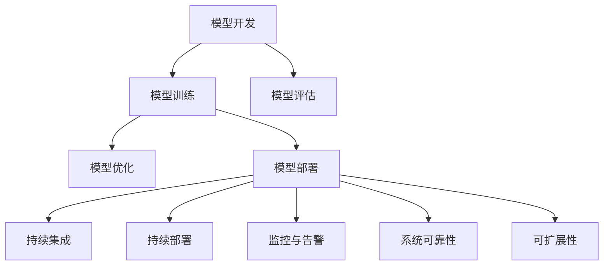

                 

# 机器学习模型部署：从开发到生产环境

> 关键词：机器学习模型部署, 模型开发, 生产环境, 模型优化, 版本控制, 持续集成, 监控与告警, 系统可靠性, 可扩展性

## 1. 背景介绍

### 1.1 问题由来

随着机器学习技术的快速发展，越来越多的企业和研究机构开始构建复杂、高效的机器学习模型来解决各种实际问题。然而，从模型开发的初步实现到最终部署到生产环境中，这一过程充满了各种挑战。如何在保证模型高性能的同时，快速、稳定地将模型部署到生产环境，成为了当下人工智能和数据科学领域的一大难题。

### 1.2 问题核心关键点

机器学习模型的部署涉及模型开发、模型训练、模型评估、模型优化、模型部署等多个环节。这一过程中，模型的准确性、稳定性、可扩展性、可靠性以及安全性是关键问题。模型从开发到生产的过程需要多个团队的协作，包括数据科学家、软件工程师、系统管理员等，需要细化各个环节的工作，以确保最终部署的模型能够满足生产环境的需求。

## 2. 核心概念与联系

### 2.1 核心概念概述

为了更好地理解机器学习模型的部署过程，本节将介绍几个密切相关的核心概念：

- **模型开发（Model Development）**：从数据预处理、特征工程、模型训练到模型评估的全过程。
- **模型训练（Model Training）**：使用标注数据集对模型进行训练，使得模型能够学习到数据的特征和规律。
- **模型评估（Model Evaluation）**：通过测试数据集对训练好的模型进行性能评估，确保模型在实际数据上的表现。
- **模型优化（Model Optimization）**：对训练好的模型进行超参数调整、正则化、剪枝等操作，提升模型性能。
- **模型部署（Model Deployment）**：将训练好的模型部署到生产环境，确保其能够在实际应用场景中正确运行。
- **持续集成（Continuous Integration, CI）**：将模型开发、训练、优化、部署等环节自动化，提高效率，减少人为错误。
- **持续部署（Continuous Deployment, CD）**：实现模型的快速部署和迭代更新，确保生产环境中的模型总是最新的。
- **监控与告警（Monitoring and Alerting）**：监控模型在生产环境中的运行状态，及时发现和解决问题。
- **系统可靠性（System Reliability）**：确保生产环境中模型的稳定性和可靠性，避免因模型问题导致业务中断。
- **可扩展性（Scalability）**：确保模型和系统能够随着业务需求的增长而扩展。

这些概念之间的逻辑关系可以通过以下Mermaid流程图来展示：



这个流程图展示了机器学习模型从开发到部署的各个关键环节，以及它们之间的关系。通过理解这些概念，我们可以更好地把握模型部署的整个流程。

## 3. 核心算法原理 & 具体操作步骤
### 3.1 算法原理概述

机器学习模型的部署通常遵循以下流程：

1. **数据准备**：收集和处理用于训练模型的数据。
2. **特征工程**：根据模型需求提取、转换和构造特征。
3. **模型选择**：选择适合任务的机器学习算法和模型架构。
4. **模型训练**：使用标注数据对模型进行训练，优化模型参数。
5. **模型评估**：使用测试数据评估模型性能。
6. **模型优化**：根据评估结果调整模型参数，提高模型性能。
7. **模型部署**：将训练好的模型部署到生产环境。
8. **监控与维护**：持续监控模型性能，及时发现和解决问题。

### 3.2 算法步骤详解

以下详细讲解模型部署的各个步骤：

**步骤1：数据准备**

- **收集数据**：收集用于训练和测试的数据集。
- **数据预处理**：清洗、归一化、缺失值处理等数据预处理操作。
- **划分数据集**：将数据集划分为训练集、验证集和测试集。

**步骤2：特征工程**

- **特征选择**：选择对模型性能有影响的特征。
- **特征转换**：对特征进行转换，如标准化、归一化、编码等。
- **特征构造**：构造新的特征，如交叉特征、时间特征等。

**步骤3：模型选择**

- **算法选择**：根据任务类型和数据特点选择适合算法。
- **模型架构**：确定模型的网络结构、超参数等。

**步骤4：模型训练**

- **训练流程**：定义损失函数、优化器、学习率等。
- **训练迭代**：使用训练集进行迭代训练，更新模型参数。
- **验证过程**：使用验证集对模型进行验证，防止过拟合。

**步骤5：模型评估**

- **性能评估**：使用测试集对模型进行评估，计算各种性能指标。
- **结果分析**：分析模型在测试集上的表现，识别模型不足。

**步骤6：模型优化**

- **超参数调整**：调整模型超参数，如学习率、正则化系数等。
- **模型剪枝**：去除冗余的参数，提高模型效率。
- **正则化**：引入正则化技术，防止过拟合。

**步骤7：模型部署**

- **模型导出**：将训练好的模型导出为可部署的格式。
- **环境配置**：配置模型部署所需的环境，如依赖库、配置文件等。
- **部署过程**：将模型部署到生产环境，进行测试。

**步骤8：监控与维护**

- **监控工具**：选择适合的监控工具，如Grafana、Prometheus等。
- **告警设置**：设置告警阈值，及时发现和解决模型问题。
- **日志记录**：记录模型运行日志，便于问题排查。

### 3.3 算法优缺点

机器学习模型的部署具有以下优点：

- **可扩展性**：能够快速扩展到大规模数据集和复杂模型。
- **灵活性**：能够快速应对新出现的业务需求和数据变化。
- **自动化**：通过自动化流程，减少人工干预，提高效率。

然而，模型部署也存在一些缺点：

- **复杂性**：模型部署涉及多个环节，需要多团队协作，操作复杂。
- **资源消耗**：模型训练和部署需要大量的计算资源和时间。
- **系统风险**：部署过程中可能出现各种问题，如系统崩溃、模型性能下降等。

## 4. 数学模型和公式 & 详细讲解 & 举例说明
### 4.1 数学模型构建

机器学习模型的部署涉及多个数学模型，下面以线性回归模型为例进行详细讲解。

假设有一组数据集 $\{(x_i, y_i)\}_{i=1}^N$，其中 $x_i \in \mathbb{R}^d$ 为输入特征，$y_i \in \mathbb{R}$ 为输出标签。线性回归模型的目标是找到最优参数 $\theta$，使得模型预测值 $\hat{y} = \theta^T x_i$ 与真实标签 $y_i$ 之间的误差最小化。定义均方误差损失函数为：

$$
\ell(\theta) = \frac{1}{2N} \sum_{i=1}^N (\hat{y} - y_i)^2
$$

模型的优化目标是最小化均方误差，即：

$$
\theta^* = \mathop{\arg\min}_{\theta} \ell(\theta)
$$

根据梯度下降算法，更新参数 $\theta$ 的公式为：

$$
\theta \leftarrow \theta - \eta \nabla_{\theta} \ell(\theta)
$$

其中 $\eta$ 为学习率，$\nabla_{\theta} \ell(\theta)$ 为损失函数对参数 $\theta$ 的梯度，可通过反向传播算法计算。

### 4.2 公式推导过程

线性回归模型的推导过程如下：

1. **假设模型**：假设模型为线性模型，即 $\hat{y} = \theta^T x_i$。
2. **损失函数**：定义均方误差损失函数 $\ell(\theta)$。
3. **梯度计算**：计算损失函数对参数 $\theta$ 的梯度 $\nabla_{\theta} \ell(\theta)$。
4. **参数更新**：使用梯度下降算法更新参数 $\theta$。

具体推导过程如下：

$$
\begin{aligned}
\ell(\theta) &= \frac{1}{2N} \sum_{i=1}^N (\hat{y} - y_i)^2 \\
&= \frac{1}{2N} \sum_{i=1}^N (\theta^T x_i - y_i)^2 \\
&= \frac{1}{2N} (x_1^T x_1 \theta^2 + x_2^T x_2 \theta^2 + \cdots + x_N^T x_N \theta^2 - 2\theta^T (x_1 y_1 + x_2 y_2 + \cdots + x_N y_N)) + \frac{1}{2N} (y_1^2 + y_2^2 + \cdots + y_N^2) \\
&= \frac{1}{2N} x^T X x - \frac{1}{N} y^T X \theta + \frac{1}{2N} \|y\|^2 \\
&= \frac{1}{2} \theta^T X^T X \theta - \frac{1}{2} \theta^T X^T y + \frac{1}{2} \|y\|^2
\end{aligned}
$$

其中 $X = [x_1^T, x_2^T, \cdots, x_N^T]$，$y = [y_1, y_2, \cdots, y_N]$。

对损失函数求导，得到：

$$
\nabla_{\theta} \ell(\theta) = \frac{1}{N} X^T (X x - y)
$$

代入梯度下降公式：

$$
\theta \leftarrow \theta - \eta X^T (X x - y)
$$

经过多轮迭代，最终得到最优参数 $\theta^*$。

### 4.3 案例分析与讲解

以线性回归模型的部署为例，下面给出详细分析和讲解：

**案例背景**：假设有一组数据集 $\{(x_i, y_i)\}_{i=1}^N$，其中 $x_i \in \mathbb{R}^2$，$y_i \in \mathbb{R}$。数据集包含两组特征，分别表示房价和房屋面积，以及房屋总价。

**模型选择**：选择线性回归模型，定义为 $\hat{y} = \theta^T x_i$。

**训练过程**：
- **数据准备**：收集数据集，将其划分为训练集和测试集。
- **特征工程**：选择特征，构造特征，进行数据预处理。
- **模型训练**：使用训练集进行迭代训练，更新模型参数。
- **模型评估**：使用测试集评估模型性能，计算均方误差。
- **模型优化**：调整学习率、正则化系数等超参数，提升模型性能。

**部署过程**：
- **模型导出**：将训练好的模型导出为可部署的格式，如PyTorch模型、Keras模型等。
- **环境配置**：配置部署所需的环境，如Python环境、依赖库、配置文件等。
- **部署测试**：将模型部署到生产环境，进行测试，确保模型正确运行。

## 5. 项目实践：代码实例和详细解释说明
### 5.1 开发环境搭建

在进行模型部署实践前，我们需要准备好开发环境。以下是使用Python进行TensorFlow开发的开发环境配置流程：

1. 安装Anaconda：从官网下载并安装Anaconda，用于创建独立的Python环境。

2. 创建并激活虚拟环境：
```bash
conda create -n tf-env python=3.8 
conda activate tf-env
```

3. 安装TensorFlow：根据CUDA版本，从官网获取对应的安装命令。例如：
```bash
conda install tensorflow -c pytorch -c conda-forge
```

4. 安装各类工具包：
```bash
pip install numpy pandas scikit-learn matplotlib tqdm jupyter notebook ipython
```

完成上述步骤后，即可在`tf-env`环境中开始模型部署实践。

### 5.2 源代码详细实现

下面我们以线性回归模型为例，给出使用TensorFlow进行模型部署的PyTorch代码实现。

首先，定义数据集和模型：

```python
import tensorflow as tf
from tensorflow import keras

# 定义数据集
x_train = [1.0, 2.0, 3.0, 4.0, 5.0]
y_train = [1.0, 3.0, 3.5, 5.0, 7.0]

# 定义模型
model = keras.Sequential([
    keras.layers.Dense(1, input_shape=(1,))
])

# 编译模型
model.compile(optimizer=tf.optimizers.Adam(), loss='mse')
```

然后，进行模型训练：

```python
# 训练模型
model.fit(x_train, y_train, epochs=100, batch_size=1)
```

接着，进行模型评估和部署：

```python
# 评估模型
y_pred = model.predict(x_train)
mse = tf.reduce_mean(tf.square(y_pred - y_train))

# 导出模型
model.save('linear_regression_model.h5')

# 部署模型
loaded_model = keras.models.load_model('linear_regression_model.h5')
loaded_model.predict(x_train)
```

以上就是使用TensorFlow进行线性回归模型部署的完整代码实现。可以看到，通过TensorFlow，模型的训练、评估、导出和部署过程变得非常简单。

### 5.3 代码解读与分析

让我们再详细解读一下关键代码的实现细节：

**数据集定义**：
- `x_train` 和 `y_train`：定义训练数据集。

**模型定义**：
- `keras.Sequential`：定义一个序列模型，包含一个全连接层。
- `keras.layers.Dense`：定义全连接层，输入维度为1，输出维度为1。

**模型编译**：
- `model.compile`：编译模型，设置优化器、损失函数。

**模型训练**：
- `model.fit`：使用训练数据集进行模型训练，设置训练轮数和批量大小。

**模型评估**：
- `model.predict`：使用训练数据集评估模型性能，计算均方误差。

**模型导出**：
- `model.save`：将模型导出为H5格式，方便后续部署。

**模型加载**：
- `keras.models.load_model`：加载已保存的模型。

**模型部署测试**：
- `loaded_model.predict`：使用测试数据集测试模型性能。

可以看到，TensorFlow提供了便捷的接口，使得模型部署变得非常直观和高效。

## 6. 实际应用场景
### 6.1 金融风险评估

在金融领域，机器学习模型被广泛应用于风险评估。通过收集历史交易数据和用户行为数据，使用机器学习模型预测用户的违约概率，从而帮助金融机构进行风险控制。

在实际应用中，可以选择适合的任务和算法，进行模型训练和优化。使用模型评估指标如准确率、召回率、AUC等，评估模型性能。最后，将模型部署到生产环境，进行实时风险评估。

### 6.2 医疗诊断支持

在医疗领域，机器学习模型被广泛应用于疾病诊断和健康管理。通过收集患者的病历数据、检查结果和历史诊断信息，使用机器学习模型预测患者是否患有某种疾病。

在实际应用中，需要考虑模型的可解释性和鲁棒性，确保模型的输出可靠。同时，需要确保模型的隐私保护，避免泄露患者的敏感信息。

### 6.3 智能推荐系统

在电商和在线视频等平台，机器学习模型被广泛应用于个性化推荐。通过收集用户的行为数据和历史兴趣信息，使用机器学习模型推荐用户可能感兴趣的商品或视频。

在实际应用中，需要优化模型的性能，提高推荐精度和多样性。同时，需要考虑模型的可扩展性，确保系统能够处理大规模用户数据。

### 6.4 未来应用展望

随着机器学习模型的不断发展，其在各个领域的应用前景将更加广阔。未来的机器学习模型部署技术将更加高效、灵活和可靠，具备更高的性能和更强的适应性。

在智慧城市治理、智能制造、智能交通等领域，机器学习模型将发挥越来越重要的作用。随着物联网技术的发展，收集的数据量将越来越大，机器学习模型的应用将更加广泛。

## 7. 工具和资源推荐
### 7.1 学习资源推荐

为了帮助开发者系统掌握机器学习模型部署的理论基础和实践技巧，这里推荐一些优质的学习资源：

1. **TensorFlow官方文档**：包含详细的使用指南、API文档和案例示例，是学习TensorFlow的最佳资源。

2. **TensorFlow实战指南**：由TensorFlow社区成员编写的实战指南，涵盖从数据处理到模型部署的全过程。

3. **Keras官方文档**：Keras是一种简单易用的深度学习框架，提供了丰富的API和快速搭建模型的功能。

4. **深度学习入门与实战**：涵盖深度学习的基础知识和实际应用，适合初学者入门。

5. **机器学习实战**：涵盖机器学习的各种经典算法和实践技巧，适合进阶学习。

通过对这些资源的学习实践，相信你一定能够快速掌握机器学习模型部署的精髓，并用于解决实际的NLP问题。

### 7.2 开发工具推荐

高效的开发离不开优秀的工具支持。以下是几款用于机器学习模型部署开发的常用工具：

1. **TensorFlow**：由Google主导开发的开源深度学习框架，支持分布式计算和GPU加速，适合大规模模型部署。

2. **PyTorch**：基于Python的开源深度学习框架，灵活易用，适合快速迭代研究。

3. **Keras**：高层API封装，易于上手，适合快速搭建和测试模型。

4. **Jupyter Notebook**：交互式开发环境，适合进行模型训练、评估和部署。

5. **Docker**：容器化技术，方便模型在不同环境中一致运行。

6. **Kubernetes**：容器编排工具，支持大规模模型部署和扩展。

合理利用这些工具，可以显著提升机器学习模型部署的开发效率，加快创新迭代的步伐。

### 7.3 相关论文推荐

机器学习模型的部署涉及多个研究领域，以下是几篇奠基性的相关论文，推荐阅读：

1. **深度学习框架的选择与比较**：探讨各种深度学习框架的优缺点，选择适合的框架进行模型部署。

2. **模型压缩与加速**：探讨模型压缩、量化、剪枝等技术，优化模型性能和计算效率。

3. **模型服务化**：探讨模型部署、API设计、服务监控等技术，实现模型的自动化部署和优化。

4. **分布式训练与部署**：探讨分布式计算、数据并行等技术，实现模型的高效训练和部署。

这些论文代表了大模型部署技术的发展脉络。通过学习这些前沿成果，可以帮助研究者把握学科前进方向，激发更多的创新灵感。

## 8. 总结：未来发展趋势与挑战
### 8.1 总结

本文对机器学习模型的部署过程进行了全面系统的介绍。首先阐述了模型开发、训练、评估、优化、部署等各个环节的重要性，明确了模型部署在机器学习中的应用价值。其次，从原理到实践，详细讲解了机器学习模型的部署流程，给出了模型部署任务开发的完整代码实例。同时，本文还广泛探讨了模型部署在金融风险评估、医疗诊断支持、智能推荐系统等多个行业领域的应用前景，展示了模型部署范式的巨大潜力。此外，本文精选了模型部署技术的各类学习资源，力求为读者提供全方位的技术指引。

通过本文的系统梳理，可以看到，机器学习模型的部署技术正在成为机器学习应用的重要范式，极大地拓展了模型的应用边界，催生了更多的落地场景。模型部署需要开发者根据具体任务，不断迭代和优化模型、数据和算法，方能得到理想的效果。

### 8.2 未来发展趋势

展望未来，机器学习模型的部署技术将呈现以下几个发展趋势：

1. **模型自动化**：通过自动化工具和流程，实现模型开发、训练、部署的一体化。

2. **模型微调**：在模型部署后，根据生产环境的数据进行微调，提升模型性能。

3. **模型压缩**：通过压缩技术，减少模型体积和计算开销，提高模型部署效率。

4. **模型服务化**：将模型封装为API服务，方便外部系统调用，实现模型的灵活部署。

5. **模型监控**：实时监控模型性能，及时发现和解决问题，保障模型稳定运行。

6. **模型可解释性**：增强模型的可解释性，确保模型的决策过程透明可理解。

这些趋势凸显了机器学习模型部署技术的广阔前景。这些方向的探索发展，必将进一步提升模型的性能和应用范围，为机器学习技术在各行业的普及奠定基础。

### 8.3 面临的挑战

尽管机器学习模型的部署技术已经取得了显著进展，但在模型部署过程中仍然面临诸多挑战：

1. **数据质量问题**：数据质量直接影响模型的训练效果和部署性能。数据缺失、错误、偏差等问题可能导致模型性能下降。

2. **系统稳定性问题**：模型部署在生产环境中的稳定性和可靠性需要进一步保障。系统崩溃、模型失效等问题可能导致业务中断。

3. **模型可扩展性问题**：模型部署需要考虑系统的可扩展性，确保模型能够随着业务需求增长而扩展。

4. **模型安全问题**：模型部署需要考虑模型的安全性和隐私保护，避免恶意攻击和数据泄露。

5. **模型监控和调优问题**：模型部署后需要持续监控和调优，确保模型性能和稳定性。

6. **模型版本管理问题**：模型部署需要考虑版本管理，确保新模型能够替换旧模型，并进行回滚和迭代更新。

这些挑战需要开发者在模型开发、训练、部署等各个环节进行全面优化，确保模型在生产环境中的稳定性和可靠性。

### 8.4 研究展望

面对机器学习模型部署所面临的种种挑战，未来的研究需要在以下几个方面寻求新的突破：

1. **数据预处理技术**：提高数据质量，减少数据噪声和偏差，提升模型训练效果。

2. **系统架构优化**：设计高效的模型部署架构，确保模型能够快速部署和扩展。

3. **模型压缩技术**：研究模型压缩、量化等技术，提高模型效率和计算性能。

4. **模型服务化技术**：研究模型服务化技术，实现模型的灵活部署和优化。

5. **模型监控和调优技术**：研究实时监控和调优技术，确保模型性能和稳定性。

6. **模型版本管理技术**：研究模型版本管理技术，确保新模型能够替换旧模型，并进行回滚和迭代更新。

这些研究方向的探索，必将引领机器学习模型部署技术迈向更高的台阶，为机器学习技术在各行业的普及和应用提供有力支持。

## 9. 附录：常见问题与解答

**Q1：如何保证模型在生产环境中的稳定性？**

A: 为了保证模型在生产环境中的稳定性，可以从以下几个方面进行优化：

1. **数据质量控制**：确保生产环境中的数据与模型训练数据相似，避免因数据变化导致模型性能下降。

2. **模型微调**：根据生产环境的数据对模型进行微调，提升模型适应性。

3. **系统架构优化**：设计高效的模型部署架构，确保模型能够快速部署和扩展。

4. **持续监控和调优**：实时监控模型性能，及时发现和解决问题，保障模型稳定运行。

5. **版本管理**：确保新模型能够替换旧模型，并进行回滚和迭代更新。

通过以上措施，可以有效保障模型在生产环境中的稳定性和可靠性。

**Q2：如何优化模型的计算效率？**

A: 为了优化模型的计算效率，可以从以下几个方面进行优化：

1. **模型压缩**：通过模型压缩技术，减少模型体积和计算开销，提高模型部署效率。

2. **量化加速**：将浮点模型转为定点模型，压缩存储空间，提高计算效率。

3. **并行计算**：使用分布式计算和并行计算技术，提高模型训练和推理速度。

4. **模型优化**：通过剪枝、权重共享等技术，优化模型结构，提高计算效率。

通过以上措施，可以有效提升模型的计算效率，减少资源消耗，提高模型部署的可行性。

**Q3：如何增强模型的可解释性？**

A: 为了增强模型的可解释性，可以从以下几个方面进行优化：

1. **特征解释**：使用特征重要性分析等方法，解释模型对特征的依赖关系。

2. **模型可视化**：使用可视化工具，展示模型内部的神经网络结构和激活状态，帮助理解模型的决策过程。

3. **解释性模型**：使用可解释性模型，如决策树、规则模型等，提高模型的可解释性。

4. **交互式解释**：设计交互式界面，允许用户查看模型的决策过程，并进行解释和调试。

通过以上措施，可以有效增强模型的可解释性，提升模型的透明度和可信度。

**Q4：如何处理模型部署中的资源瓶颈问题？**

A: 为了处理模型部署中的资源瓶颈问题，可以从以下几个方面进行优化：

1. **模型压缩**：通过模型压缩技术，减少模型体积和计算开销，提高模型部署效率。

2. **分布式计算**：使用分布式计算和并行计算技术，提高模型训练和推理速度。

3. **模型优化**：通过剪枝、权重共享等技术，优化模型结构，减少资源消耗。

4. **资源优化**：使用资源优化技术，如内存管理、GPU优化等，提高资源利用率。

通过以上措施，可以有效处理模型部署中的资源瓶颈问题，确保模型能够快速部署和运行。

**Q5：如何保证模型部署的可扩展性？**

A: 为了保证模型部署的可扩展性，可以从以下几个方面进行优化：

1. **模型服务化**：将模型封装为API服务，方便外部系统调用，实现模型的灵活部署。

2. **分布式计算**：使用分布式计算和并行计算技术，提高模型训练和推理速度。

3. **容器化技术**：使用容器化技术，方便模型在不同环境中一致运行。

4. **系统架构优化**：设计高效的模型部署架构，确保模型能够快速部署和扩展。

通过以上措施，可以有效保障模型部署的可扩展性，确保模型能够随着业务需求增长而扩展。

---

作者：禅与计算机程序设计艺术 / Zen and the Art of Computer Programming

