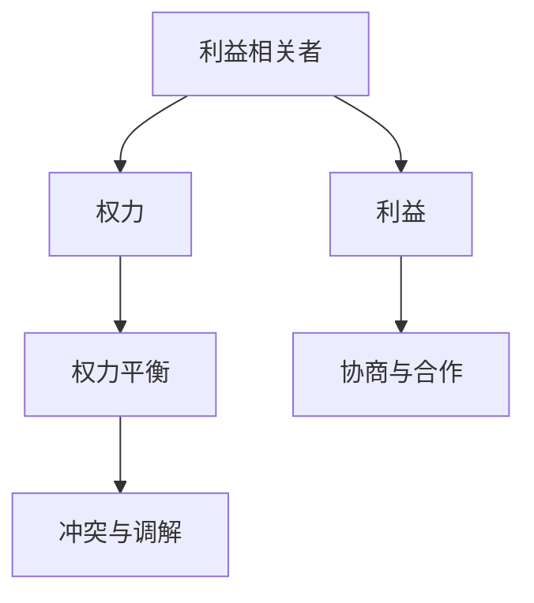

                 

## 1. 背景介绍

在当今复杂多变的商业环境中，企业的决策和运营不可避免地受到众多利益相关者的影响。这些利益相关者包括股东、员工、客户、供应商、合作伙伴等，他们各自拥有不同的利益诉求。如何平衡各方利益，在取舍中找到最优解，是每个企业管理者必须面对的挑战。本文将从权力平衡的角度，探讨企业决策中的关键问题，并提出一些实用的解决方案。

### 1.1 问题由来

在实际的企业管理中，利益相关者之间存在复杂的相互关系。这些关系体现在多个层面，包括权力、利益、资源分配等。股东希望最大化公司利润，员工希望获得更好的薪酬和工作环境，客户希望获得高质量的产品和服务，供应商希望获取稳定且丰厚的业务，合作伙伴则希望在合作关系中实现双赢。如何协调这些利益，使之在企业决策中得到体现，是企业管理的核心问题。

### 1.2 问题核心关键点

本文聚焦于如何通过权力平衡，在企业决策中体现各利益相关者的利益诉求，以达到整体利益最大化。关键点包括：

- 利益相关者的利益诉求分析
- 利益相关者的权力分布和影响力评估
- 企业决策中的权力平衡策略
- 实施权力平衡策略的实践方法
- 权力平衡策略的持续优化和调整

通过理解这些核心概念，我们能够更好地把握企业决策中的权力平衡问题，实现更有效的利益分配和资源配置。

## 2. 核心概念与联系

### 2.1 核心概念概述

为更好地理解权力平衡在企业决策中的作用，本节将介绍几个密切相关的核心概念：

- **利益相关者(Stakeholders)**：指对企业决策产生影响的所有个人或团体，包括股东、员工、客户、供应商、合作伙伴等。
- **权力(Power)**：指在决策过程中对他人施加影响力的能力，包括正式权力（如管理职位）和实质权力（如信息掌控、影响力等）。
- **利益(Benefits)**：指各利益相关者希望通过企业决策获得的利益，如经济收益、职业发展、社会影响等。
- **权力平衡(Balancing of Power)**：指在企业决策中，合理分配和平衡各利益相关者的权力，使其在决策过程中得到公正体现的过程。
- **协商与合作(Collaboration)**：指企业与利益相关者之间的对话和合作，旨在达成共识和共赢。
- **冲突与调解(Conflict and Mediation)**：指在利益相关者之间存在分歧时，通过调解和协商解决冲突的方法。

这些核心概念之间的逻辑关系可以通过以下Mermaid流程图来展示：



这个流程图展示了大语言模型微调的核心概念及其之间的关系：

1. 利益相关者通过权力在决策中施加影响，追求利益。
2. 企业决策过程需要平衡各利益相关者的权力，确保决策的公正性。
3. 协商与合作是权力平衡的实践手段，旨在通过对话达成共识。
4. 冲突与调解则是权力平衡中的重要环节，在分歧出现时通过调解解决争议。

## 3. 核心算法原理 & 具体操作步骤

### 3.1 算法原理概述

在企业决策中，权力平衡的目标是通过合理分配各利益相关者的权力，确保其利益在决策过程中得到体现。这可以通过以下步骤实现：

1. **利益相关者识别**：明确企业决策过程中所有的利益相关者。
2. **利益诉求分析**：理解每个利益相关者的主要利益诉求。
3. **权力评估**：评估每个利益相关者的权力大小和影响力。
4. **权力平衡策略制定**：根据利益相关者的权力和利益诉求，制定权力平衡策略。
5. **实施与调整**：将权力平衡策略应用于企业决策中，并根据反馈持续优化。

### 3.2 算法步骤详解

基于以上原理，企业决策中的权力平衡算法步骤如下：

**Step 1: 利益相关者识别**
- 对企业的所有相关方进行识别，包括股东、员工、客户、供应商、合作伙伴等。
- 绘制利益相关者地图，明确每个利益相关者的主要利益。

**Step 2: 利益诉求分析**
- 对每个利益相关者的利益进行详细分析，包括经济利益、职业发展、社会影响等。
- 通过访谈、问卷调查等方式收集利益相关者的意见和建议。

**Step 3: 权力评估**
- 评估每个利益相关者的权力大小，包括正式权力和实质权力。
- 通过权力矩阵（Power Matrix）等工具，量化每个利益相关者的影响力。

**Step 4: 权力平衡策略制定**
- 根据权力评估结果和利益诉求分析，制定权力平衡策略。
- 通过协商会议、权力分享协议等方式，将权力平衡策略具体化。

**Step 5: 实施与调整**
- 将权力平衡策略应用于企业决策中，确保各利益相关者的利益得到体现。
- 通过定期评估和反馈，持续优化权力平衡策略。

### 3.3 算法优缺点

基于权力平衡的决策方法具有以下优点：
1. 提升决策的公正性：通过平衡各利益相关者的权力，确保决策更加公正。
2. 增强决策的接受度：利益相关者的利益得到体现，有利于提高决策的接受度和执行力。
3. 促进合作与共赢：通过协商与合作，实现各方共赢，提高企业整体效率。

同时，该方法也存在一定的局限性：
1. 权力评估的复杂性：权力的评估和量化较为复杂，需要综合考虑多种因素。
2. 决策时间延长：权力平衡策略的制定和实施可能延长决策时间。
3. 利益冲突难以彻底解决：即使进行了权力平衡，利益冲突依然可能存在，需要通过多次协商和调整来解决。

尽管如此，基于权力平衡的决策方法仍是大企业决策的重要参考，有助于在利益相关者之间找到更加公正和合理的决策方案。

### 3.4 算法应用领域

权力平衡的决策方法不仅适用于大企业，在小型企业和非营利组织中也同样适用。例如：

- **企业投资决策**：在投资项目选择时，通过权力平衡方法，综合考虑各利益相关者的意见和利益，制定更加合理的投资策略。
- **产品开发与推广**：在产品开发和推广过程中，通过权力平衡方法，确保各方在产品功能和市场推广中得到均衡的利益。
- **组织变革与重组**：在组织变革和重组过程中，通过权力平衡方法，确保所有员工在变革中的利益得到体现，减少变革阻力。
- **社会责任与公益项目**：在制定社会责任和公益项目时，通过权力平衡方法，确保各方利益相关者的意见和利益得到充分考虑。

## 4. 数学模型和公式 & 详细讲解  
### 4.1 数学模型构建

假设企业有 $n$ 个利益相关者，记为 $S=\{S_1, S_2, ..., S_n\}$，每个利益相关者的利益为 $b_i$，权力为 $p_i$。

定义利益相关者 $S_i$ 的利益权重为 $w_i$，权力权重为 $u_i$。则总利益权重和总权力权重分别为：

$$
\overline{w} = \frac{1}{n} \sum_{i=1}^n w_i, \quad \overline{u} = \frac{1}{n} \sum_{i=1}^n u_i
$$

定义利益相关者 $S_i$ 的权力平衡因子为 $\alpha_i$，则总权力平衡因子为：

$$
\alpha_i = \frac{w_i}{\overline{w}} \cdot \frac{p_i}{\overline{u}}
$$

企业决策的总利益平衡因子为：

$$
\overline{\alpha} = \frac{1}{n} \sum_{i=1}^n \alpha_i
$$

在制定权力平衡策略时，应当根据 $\overline{\alpha}$ 的大小，合理分配各利益相关者的权力，以确保决策的公正性和接受度。

### 4.2 公式推导过程

在公式推导过程中，我们假设每个利益相关者的利益和权力是独立的，且权重 $w_i$ 和 $u_i$ 满足 $0 \leq w_i, u_i \leq 1$，且 $\sum_{i=1}^n w_i = \sum_{i=1}^n u_i = 1$。

由上述假设和定义可知，利益权重和权力权重分别满足归一化条件。则总利益权重和总权力权重均为 $1/n$。

利益相关者 $S_i$ 的权力平衡因子 $\alpha_i$ 可以表示为：

$$
\alpha_i = \frac{w_i}{\overline{w}} \cdot \frac{p_i}{\overline{u}} = \frac{w_i}{1/n} \cdot \frac{p_i}{1/n} = n w_i p_i
$$

因此，总权力平衡因子 $\overline{\alpha}$ 为：

$$
\overline{\alpha} = \frac{1}{n} \sum_{i=1}^n \alpha_i = \sum_{i=1}^n w_i p_i = b_i \cdot \frac{p_i}{\overline{u}} = b_i \cdot \frac{p_i}{1/n}
$$

即企业决策的总利益平衡因子为：

$$
\overline{\alpha} = \sum_{i=1}^n b_i p_i
$$

通过这个公式，可以清晰地看出，企业决策的平衡因子取决于各利益相关者的利益和权力大小。

### 4.3 案例分析与讲解

假设某企业有三大主要利益相关者：股东、员工和客户。股东的利益为 $b_1=0.7$，权为 $p_1=0.3$；员工的利益为 $b_2=0.2$，权为 $p_2=0.4$；客户的利益为 $b_3=0.1$，权为 $p_3=0.3$。

根据公式，计算出各利益相关者的权力平衡因子：

$$
\alpha_1 = 3 \times 0.7 \times 0.3 = 0.63, \quad \alpha_2 = 3 \times 0.2 \times 0.4 = 0.24, \quad \alpha_3 = 3 \times 0.1 \times 0.3 = 0.09
$$

计算总权力平衡因子：

$$
\overline{\alpha} = 0.63 + 0.24 + 0.09 = 0.96
$$

因此，企业决策的平衡因子为 $0.96$，应当在股东、员工和客户之间合理分配决策权力，确保各方的利益得到体现。

## 5. 项目实践：代码实例和详细解释说明
### 5.1 开发环境搭建

在进行权力平衡决策分析前，我们需要准备好开发环境。以下是使用Python进行数据分析的环境配置流程：

1. 安装Anaconda：从官网下载并安装Anaconda，用于创建独立的Python环境。

2. 创建并激活虚拟环境：
```bash
conda create -n pyenv python=3.8 
conda activate pyenv
```

3. 安装必要的Python库：
```bash
conda install numpy pandas sympy matplotlib seaborn plotly
```

4. 下载和安装相应的数据集：
```bash
conda install -c anaconda google-cloud-dataproc
```

完成上述步骤后，即可在`pyenv`环境中开始数据分析和决策分析的实践。

### 5.2 源代码详细实现

下面以某企业三大利益相关者权力平衡的案例为例，给出使用Python进行决策分析的代码实现。

```python
import numpy as np
import pandas as pd
import matplotlib.pyplot as plt

# 定义利益相关者的利益和权力
benefits = [0.7, 0.2, 0.1]
powers = [0.3, 0.4, 0.3]

# 计算权力平衡因子
alpha = np.array(benefits) * powers / np.mean(powers)

# 计算总权力平衡因子
alpha_bar = np.sum(alpha) / len(alpha)

# 打印权力平衡因子
print("Power Balance Factors:")
for i in range(len(benefits)):
    print(f"{benefits[i]} (p={powers[i]}): {alpha[i]}")
print(f"Total Power Balance Factor: {alpha_bar}")
```

### 5.3 代码解读与分析

让我们再详细解读一下关键代码的实现细节：

**利益相关者利益和权力**：
- 定义利益相关者的利益和权力，分别存储在`benefits`和`powers`列表中。

**权力平衡因子计算**：
- 计算每个利益相关者的权力平衡因子，公式为 `alpha[i] = benefits[i] * powers[i] / np.mean(powers)`。
- 计算总权力平衡因子，公式为 `alpha_bar = np.sum(alpha) / len(alpha)`。

**打印输出**：
- 打印每个利益相关者的权力平衡因子及其对应的利益和权力。
- 打印总权力平衡因子。

这段代码通过Python的NumPy库实现了简单的权力平衡计算，展示了计算结果。

## 6. 实际应用场景

### 6.1 智能制造

在智能制造领域，通过权力平衡方法，可以确保企业在技术改造、产品创新、质量管理等方面，各利益相关者的利益得到体现。例如，企业在进行自动化生产线改造时，需要平衡股东、员工、供应商的利益，确保改造措施既能提升生产效率，又能保障员工安全和供应商利益。

### 6.2 环境保护

在环境保护领域，通过权力平衡方法，可以协调政府、企业、公众三方的利益，推动环保政策的实施。例如，在制定排污收费政策时，需要平衡政府对环境保护的诉求、企业的生产成本、公众对环境质量的期望。

### 6.3 医疗健康

在医疗健康领域，通过权力平衡方法，可以确保患者、医护人员、医疗机构三方的利益得到体现。例如，在引入新的医疗设备时，需要平衡患者的医疗需求、医护人员的接受度、医疗机构的经济利益。

### 6.4 未来应用展望

随着技术的发展和社会的进步，权力平衡方法将在更多领域得到应用，为各利益相关者的利益诉求提供保障。例如：

- **社会治理**：在社会治理中，通过权力平衡方法，可以协调政府、社会团体、公众三方的利益，推动社会和谐发展。
- **教育改革**：在教育改革中，通过权力平衡方法，可以平衡教师、学生、家长三方的利益，推动教育公平和质量提升。
- **科技研发**：在科技研发中，通过权力平衡方法，可以平衡科研人员、企业、政府三方的利益，推动科技创新的可持续性。

## 7. 工具和资源推荐
### 7.1 学习资源推荐

为了帮助开发者系统掌握权力平衡的决策分析理论基础和实践技巧，这里推荐一些优质的学习资源：

1. **《管理学》**：罗宾斯著，详细介绍了管理学中的权力平衡和决策分析方法。
2. **《企业决策与分析》**：蒋亚伟著，介绍了企业决策中常用的分析方法和工具。
3. **《数据科学与决策分析》**：吴恩达著，介绍了数据科学在决策分析中的应用。
4. **Coursera《企业决策分析》**：由哥伦比亚大学开设的在线课程，介绍了企业决策中的基本原则和方法。

通过对这些资源的学习实践，相信你一定能够快速掌握权力平衡的决策分析方法，并用于解决实际的决策问题。

### 7.2 开发工具推荐

高效的开发离不开优秀的工具支持。以下是几款用于权力平衡决策分析开发的常用工具：

1. **Python**：开源的编程语言，支持数据分析和科学计算，适合进行权力平衡决策分析。
2. **Jupyter Notebook**：免费的交互式编程环境，支持Python等多种语言，适合进行数据分析和可视化。
3. **Tableau**：数据可视化工具，支持多种数据源和图表类型，适合进行决策分析的可视化展示。
4. **Power BI**：微软推出的商业智能工具，支持数据清洗、分析和可视化，适合企业决策分析。

合理利用这些工具，可以显著提升权力平衡决策分析的开发效率，加快创新迭代的步伐。

### 7.3 相关论文推荐

权力平衡的决策分析方法源于学界的持续研究。以下是几篇奠基性的相关论文，推荐阅读：

1. **《企业权力结构与决策过程》**：潘行谦著，介绍了企业决策中的权力结构和决策过程。
2. **《权力平衡与组织决策》**：陈晓东著，研究了权力平衡对组织决策的影响。
3. **《利益相关者理论》**：弗里曼著，介绍了利益相关者理论的基本概念和方法。

这些论文代表了大语言模型微调技术的发展脉络。通过学习这些前沿成果，可以帮助研究者把握学科前进方向，激发更多的创新灵感。

## 8. 总结：未来发展趋势与挑战

### 8.1 研究成果总结

本文对权力平衡在企业决策中的应用进行了系统介绍。通过理论分析，我们明确了企业决策中的核心问题，提出了基于利益相关者的权力平衡方法，并给出了实际应用的案例和建议。通过对比分析，我们指出了权力平衡方法的优缺点，并展望了其未来的发展趋势。

### 8.2 未来发展趋势

展望未来，权力平衡方法将在更多领域得到应用，为各利益相关者的利益诉求提供保障。

1. **技术化进程加速**：随着大数据、人工智能等技术的发展，权力平衡方法将更加依赖于数据驱动的决策分析，实现更精准的利益评估和权力分配。
2. **多维度决策支持**：未来权力平衡方法将结合更多维度的数据和指标，如环境影响、社会效益等，全面评估决策的影响。
3. **实时化决策支持**：随着实时数据分析和智能决策技术的发展，权力平衡方法将支持实时决策分析，及时响应外部变化。

### 8.3 面临的挑战

尽管权力平衡方法具有广阔的应用前景，但在实践中也面临诸多挑战：

1. **数据质量问题**：数据的不完整、不准确、不一致等问题，可能会影响权力平衡的决策结果。
2. **模型复杂性**：权力平衡方法涉及多维度的数据和指标，模型的复杂性较高，难以理解和应用。
3. **伦理问题**：权力平衡方法在决策过程中，可能涉及到利益相关者的权益保护问题，需要制定合理的伦理规范。
4. **动态性问题**：企业的内外环境不断变化，权力平衡方法需要持续更新和调整，以应对新的挑战。

### 8.4 研究展望

未来的研究需要在以下几个方面寻求新的突破：

1. **数据驱动的决策分析**：结合大数据、人工智能等技术，实现更精准的利益评估和权力分配。
2. **多维度决策支持**：结合更多维度的数据和指标，如环境影响、社会效益等，全面评估决策的影响。
3. **实时化决策支持**：实现实时决策分析，及时响应外部变化。
4. **模型可解释性**：开发可解释的权力平衡模型，帮助用户理解和信任决策结果。
5. **伦理规范制定**：制定合理的伦理规范，确保权力平衡方法在决策过程中的公平和公正。

这些研究方向将进一步推动权力平衡方法的成熟和发展，为构建公平、公正、可持续的决策体系提供有力支持。

## 9. 附录：常见问题与解答

**Q1：如何识别企业的主要利益相关者？**

A: 通过利益相关者地图和利益相关者矩阵，可以系统识别企业的主要利益相关者。利益相关者地图通过分组和分类，明确不同利益相关者的主要利益和权力，帮助企业全面了解各方的诉求。

**Q2：如何进行利益相关者的权力评估？**

A: 通过权力矩阵等工具，可以对利益相关者的权力进行量化评估。权力矩阵通过设置权重和等级，衡量每个利益相关者在决策中的影响力，从而确定其权力大小。

**Q3：如何制定合理的权力平衡策略？**

A: 根据利益相关者的权力评估结果，制定合理的权力平衡策略。策略制定过程中，需要充分考虑各方的利益诉求，平衡各方权力，确保决策的公正性和接受度。

**Q4：如何实施权力平衡策略？**

A: 将权力平衡策略具体化为权力分配和决策机制，应用于企业决策过程中。通过协商会议、权力分享协议等方式，确保各方的利益得到体现。

**Q5：如何持续优化权力平衡策略？**

A: 定期评估和反馈权力平衡策略的实施效果，根据企业内外环境的变化进行调整和优化。通过持续优化，确保权力平衡策略的长期有效性。

---

作者：禅与计算机程序设计艺术 / Zen and the Art of Computer Programming

