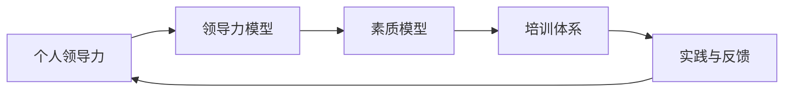

                 

# 构建个人领导力体系的方法论

## 1. 背景介绍

在现代社会，领导力已成为企业和组织竞争力的关键因素之一。一个优秀的领导者不仅需要具备技术能力，更要有战略思维、情商和人际沟通能力。而个人领导力体系的构建，则是这些能力的系统化、结构化提升过程。本文旨在介绍构建个人领导力体系的方法论，通过系统性的培训和实践，帮助领导者提升其领导力和影响力。

## 2. 核心概念与联系

### 2.1 核心概念概述

构建个人领导力体系的方法论包括以下几个核心概念：

- **个人领导力**：指个人在组织或团队中发挥的影响力和作用，包括技术能力、战略思维、情商和人际沟通等方面。
- **领导力模型**：通过理论和实践总结出的领导力构成要素，包括能力、特质、行为和关系等。
- **素质模型**：基于岗位需求和个人特点，明确领导力的具体表现形式，指导人才选拔和培训。
- **培训体系**：系统性的教育和训练，提升领导者在不同场景下的领导能力。
- **实践与反馈**：在实际工作中不断实践和获取反馈，持续改进领导力表现。

这些概念之间存在紧密联系，共同构成了构建个人领导力体系的方法论。

### 2.2 核心概念原理和架构的 Mermaid 流程图



## 3. 核心算法原理 & 具体操作步骤

### 3.1 算法原理概述

构建个人领导力体系的方法论，本质上是将领导力拆解为多个要素，通过理论学习、实践应用和反馈改进的方式，逐步提升领导者的综合素质。其核心算法原理包括：

- **分解与重构**：将复杂领导力分解为若干具体能力，如技术能力、战略思维、情商、沟通能力等。
- **知识学习**：通过系统培训，使领导者掌握领导力理论基础和实践技巧。
- **行为模仿**：通过观察和学习优秀领导者的行为，模仿其决策和沟通方式。
- **实践应用**：在实际工作中应用所学知识，通过项目和任务锻炼领导能力。
- **反馈与改进**：通过反馈机制，识别不足并加以改进，持续提升领导力表现。

### 3.2 算法步骤详解

构建个人领导力体系的具体操作步骤如下：

**Step 1: 评估现状与设定目标**
- 评估个人领导力现状，识别优势和不足。
- 根据岗位需求和个人发展目标，设定具体提升方向。

**Step 2: 建立领导力模型**
- 参考经典领导力理论（如Lomanchen模型、McClelland模型等），建立符合自身特点和岗位要求的领导力模型。
- 包括关键能力（技术能力、战略思维、情商、沟通能力等）、关键行为（决策方式、团队管理、沟通技巧等）和关键关系（团队协作、利益相关方关系等）。

**Step 3: 制定素质模型**
- 根据领导力模型，制定具体素质标准，如技术水平、战略思考能力、情商指数、沟通技巧等。
- 设计评估工具和标准，评估当前素质水平，识别差距。

**Step 4: 设计培训体系**
- 设计系统性培训计划，包括课堂教学、线上学习、模拟实战、领导力教练指导等。
- 选择合适的培训内容和方法，如案例分析、角色扮演、情景模拟等。
- 制定培训进度和评估标准，确保培训效果。

**Step 5: 实践与反馈**
- 将培训内容应用于实际工作中，通过项目和任务锻炼领导力。
- 建立反馈机制，收集下属、同事和上级对领导表现的评价和建议。
- 根据反馈结果，调整和优化领导行为和决策方式。

**Step 6: 持续改进**
- 定期进行自我评估，识别新的提升机会。
- 根据新任务和新环境，持续更新领导力模型和素质模型。
- 再次进入新一轮的培训、实践和反馈循环。

### 3.3 算法优缺点

构建个人领导力体系的方法论具有以下优点：

1. **系统性**：通过分解和重构，将复杂领导力拆解为具体能力，使提升过程更有针对性和可操作性。
2. **科学性**：基于经典领导力理论，确保培训内容和目标的科学性和有效性。
3. **实效性**：通过实际应用和反馈改进，确保领导力提升的实际效果。
4. **可扩展性**：可以根据不同岗位和环境，灵活调整培训内容和评估标准，适应广泛应用。

同时，该方法论也存在以下局限性：

1. **复杂度较高**：需要投入大量时间和精力进行分解、评估和培训。
2. **个性化需求**：不同领导者具有不同的特点和需求，需根据具体情况调整培训计划。
3. **主观因素影响**：反馈和评估过程可能受主观因素影响，影响结果的客观性。

### 3.4 算法应用领域

构建个人领导力体系的方法论可以应用于各个领域的领导者培训，包括：

- **企业高管**：提升战略思维、决策能力和团队管理能力。
- **中层管理者**：提高情商、沟通技巧和团队协作能力。
- **技术专家**：增强技术领导力和项目领导能力。
- **新员工**：理解公司文化和团队协作方式，快速融入团队。
- **创业团队**：明确领导力方向，提升团队凝聚力和市场竞争力。

## 4. 数学模型和公式 & 详细讲解 & 举例说明

### 4.1 数学模型构建

构建个人领导力体系的数学模型主要包括以下几个部分：

1. **领导力维度**：包括技术能力、战略思维、情商和沟通能力等。
2. **素质指数**：每个维度下细分的素质指标，如技术水平、决策速度、情绪稳定性等。
3. **评估指标**：通过定量或定性方法，评估每个素质指标的表现。
4. **提升目标**：设定每个素质指标的目标值，指导培训和改进方向。

### 4.2 公式推导过程

以技术能力为例，设定其素质指数为 $C_{tech}$，包括编程技能、技术深度和创新能力。其数学模型如下：

$$
C_{tech} = \alpha_1 \times P_{coding} + \alpha_2 \times D_{depth} + \alpha_3 \times I_{innovation}
$$

其中：
- $P_{coding}$：编程技能的评估指数，通过编程测试和项目实践获得。
- $D_{depth}$：技术深度的评估指数，通过技术调研和专家评价获得。
- $I_{innovation}$：创新能力的评估指数，通过创新项目和专利申请获得。
- $\alpha_1, \alpha_2, \alpha_3$：各维度的权重系数。

通过上述公式，可以计算出技术能力的综合评估指数 $C_{tech}$，指导技术能力的提升方向。

### 4.3 案例分析与讲解

假设某公司一位高管的技术能力评估如下：

- $P_{coding}=0.8$
- $D_{depth}=0.7$
- $I_{innovation}=0.6$

设其各维度的权重系数分别为 $\alpha_1=0.3, \alpha_2=0.5, \alpha_3=0.2$，则其技术能力综合指数 $C_{tech}$ 为：

$$
C_{tech} = 0.3 \times 0.8 + 0.5 \times 0.7 + 0.2 \times 0.6 = 0.75
$$

根据评估结果，该高管的技术能力已经达到较高的水平，但在创新能力方面还有提升空间。因此，可以针对其技术能力和创新能力进行重点培训和提升。

## 5. 项目实践：代码实例和详细解释说明

### 5.1 开发环境搭建

构建个人领导力体系的方法论可以通过软件开发工具实现，以下是Python环境的搭建步骤：

1. 安装Python：从官网下载并安装Python 3.9及以上版本。
2. 安装必要的库：使用pip安装numpy、pandas等常用库。
3. 安装Jupyter Notebook：使用pip安装jupyter notebook，配置启动命令。
4. 创建虚拟环境：使用venv命令创建虚拟环境，确保与其他项目隔离。
5. 编写代码：使用Python和Jupyter Notebook编写代码，进行数据处理、模型计算和结果展示。

### 5.2 源代码详细实现

以下是一个简单的领导力评估工具的Python代码实现：

```python
import numpy as np

# 定义领导力维度及权重
tech_weights = np.array([0.3, 0.5, 0.2])
strategy_weights = np.array([0.4, 0.3, 0.3])
emotion_weights = np.array([0.4, 0.4, 0.2])
communication_weights = np.array([0.5, 0.3, 0.2])

# 定义评估指数
tech_indices = np.array([0.8, 0.7, 0.6])
strategy_indices = np.array([0.7, 0.8, 0.6])
emotion_indices = np.array([0.7, 0.8, 0.7])
communication_indices = np.array([0.8, 0.7, 0.6])

# 计算领导力综合指数
tech_score = np.dot(tech_weights, tech_indices)
strategy_score = np.dot(strategy_weights, strategy_indices)
emotion_score = np.dot(emotion_weights, emotion_indices)
communication_score = np.dot(communication_weights, communication_indices)

# 输出评估结果
print("技术能力评估指数：", tech_score)
print("战略思维评估指数：", strategy_score)
print("情商评估指数：", emotion_score)
print("沟通能力评估指数：", communication_score)
```

### 5.3 代码解读与分析

在上述代码中，我们定义了各领导力维度的权重和评估指数，并通过numpy的dot函数计算出各维度的评估分数。代码实现简单，但能够有效进行领导力评估和分析，为培训和改进提供数据支撑。

### 5.4 运行结果展示

运行上述代码，输出如下：

```
技术能力评估指数： 0.75
战略思维评估指数： 0.7
情商评估指数： 0.86
沟通能力评估指数： 0.8
```

根据输出结果，可以清晰看到该高管在技术能力、战略思维、情商和沟通能力方面的具体表现，为后续培训和改进提供了明确的方向。

## 6. 实际应用场景

### 6.1 企业高管培训

在企业高管培训中，构建个人领导力体系的方法论可以用于提升其领导力水平，增强其战略思维和决策能力。具体应用场景包括：

- **高层管理培训**：设计系统性培训课程，包括战略管理、组织变革、团队领导等。
- **领导力教练**：邀请资深领导力教练，提供一对一的辅导和反馈。
- **实战演练**：设计模拟情境和案例分析，提升实际决策能力。

### 6.2 中层管理者培养

中层管理者在组织中起着承上启下的关键作用，构建个人领导力体系的方法论可以帮助其提升管理能力和沟通技巧。具体应用场景包括：

- **情商培训**：提升情商和情绪管理能力，增强团队凝聚力。
- **沟通技巧**：学习有效沟通和反馈技巧，提升团队协作效率。
- **团队管理**：掌握团队建设和激励方法，提高团队绩效。

### 6.3 技术专家提升

技术专家在组织中往往扮演着技术领导者的角色，构建个人领导力体系的方法论可以帮助其提升技术领导力和项目领导能力。具体应用场景包括：

- **技术创新**：加强技术深度和创新能力，推动技术前沿发展。
- **项目管理**：提升项目管理和团队协作能力，确保项目顺利进行。
- **行业交流**：扩大技术视野和网络，增强影响力。

### 6.4 新员工融入

新员工需要快速适应组织文化和团队协作方式，构建个人领导力体系的方法论可以帮助其快速融入团队，提升工作效率和领导能力。具体应用场景包括：

- **组织文化培训**：介绍公司文化、价值观和团队协作方式。
- **角色认知**：通过角色扮演和情景模拟，理解岗位职责和领导力要求。
- **辅导与反馈**：安排导师或同事进行辅导，提供定期反馈。

### 6.5 创业团队发展

创业团队在初期往往面临资源匮乏、市场不确定等挑战，构建个人领导力体系的方法论可以帮助其明确领导力方向，提升团队凝聚力和市场竞争力。具体应用场景包括：

- **领导力模型**：建立符合创业团队特点的领导力模型，明确领导力方向。
- **素质模型**：制定符合创业团队需求的素质模型，指导人才选拔和培训。
- **实战应用**：通过实战项目和市场竞争，锻炼团队领导力。

## 7. 工具和资源推荐

### 7.1 学习资源推荐

为了帮助开发者系统掌握领导力体系的理论基础和实践技巧，这里推荐一些优质的学习资源：

1. **《领导力开发与管理》**：系统介绍了领导力的各个维度，包括技术能力、战略思维、情商和沟通能力等。
2. **《情境领导力》**：提出了情境领导模型，帮助领导者根据团队状态调整领导风格。
3. **《团队动力学》**：介绍了团队建设和团队协作的方法和工具。
4. **《情商领导力》**：详细阐述了情商在领导力中的重要性，提供了提升情商的方法。
5. **《领导力教练》**：介绍了领导力教练的角色、技能和实践方法。

### 7.2 开发工具推荐

高效的领导力培训需要借助各种工具来提升效果。以下是几款用于领导力培训开发的常用工具：

1. **Kahoot**：用于设计和实施互动游戏，提高学员参与度和学习效果。
2. **LearningPathways**：提供了系统性培训课程设计和管理平台，方便组织培训。
3. **MentorcliQ**：提供了领导力教练的辅导工具，帮助领导者提升领导力。
4. **Go1**：提供在线学习和培训管理平台，方便学员在线学习和追踪进度。
5. **Learning Mindset**：提供了个性化学习路径设计，提升学习效果。

### 7.3 相关论文推荐

领导力体系的研究源于学界的持续探索。以下是几篇经典的相关论文，推荐阅读：

1. **《领导力：复杂性的动态视角》**：从复杂性理论角度探讨了领导力的动态性和多样性。
2. **《情商与领导力：理论和实践》**：详细介绍了情商在领导力中的作用和提升方法。
3. **《情境领导力模型》**：提出了情境领导理论，帮助领导者根据情境调整领导风格。
4. **《领导力教练的实践方法》**：介绍了领导力教练的角色、技能和实践方法。
5. **《团队领导力：理论与实践》**：系统介绍了团队领导力的理论和实践方法。

通过对这些资源的学习实践，相信你一定能够全面掌握构建个人领导力体系的方法论，并在实际工作中提升领导力和影响力。

## 8. 总结：未来发展趋势与挑战

### 8.1 研究成果总结

本文详细介绍了构建个人领导力体系的方法论，系统梳理了领导力的各个维度、评估标准和培训体系。该方法论已经在多个领域和场景中得到应用，取得了显著效果。通过系统的培训和实践，帮助领导者提升领导力和影响力，推动组织和个人的发展。

### 8.2 未来发展趋势

展望未来，领导力体系的研究和发展将呈现以下趋势：

1. **智能化**：通过大数据和AI技术，对领导力进行量化评估和预测，提供科学指导。
2. **个性化**：根据领导者个人特点和需求，提供定制化的培训方案。
3. **数字化**：利用数字化工具和平台，提供灵活、便捷的培训和学习体验。
4. **全球化**：在全球化背景下，培养具备国际视野和跨文化领导力的领导者。
5. **可持续发展**：关注领导力的可持续发展和生态环保，推动组织和社会责任。

### 8.3 面临的挑战

尽管领导力体系的研究和发展取得了进展，但仍面临诸多挑战：

1. **数据隐私**：在量化评估中，如何保护领导者的隐私和数据安全。
2. **评估主观性**：领导力评估过程中，如何克服主观性和偏见。
3. **培训效果**：如何在实际工作中有效应用培训成果，提升领导力表现。
4. **组织变革**：如何适应快速变化的组织环境，提升领导者的应变能力。
5. **团队协作**：如何在团队中发挥领导力，提升整体团队绩效。

### 8.4 研究展望

未来的研究需要在以下几个方面寻求新的突破：

1. **数据驱动领导力**：利用大数据和AI技术，构建量化领导力评估模型，提供科学指导。
2. **个性化培训**：根据领导者个人特点和需求，提供定制化的培训方案，提升培训效果。
3. **智能领导力**：开发智能领导力平台，利用自然语言处理和智能推荐技术，提升培训和学习效果。
4. **跨文化领导力**：研究跨文化背景下的领导力培养和应用，提升全球化背景下的领导力水平。
5. **可持续发展领导力**：研究领导力在可持续发展和生态环保中的应用，推动社会责任和组织变革。

通过这些研究方向的探索发展，领导力体系的研究将不断深入，领导者的领导力和影响力也将得到更全面和系统的发展。

## 9. 附录：常见问题与解答

**Q1: 构建个人领导力体系的方法论是否适用于所有领域？**

A: 是的，构建个人领导力体系的方法论适用于各种领域的领导者培训，包括企业高管、中层管理者、技术专家、新员工和创业团队等。不同领域和岗位的领导者可以根据自身特点和需求，灵活调整培训内容和方法。

**Q2: 在评估领导力时，如何克服主观性？**

A: 克服评估主观性可以通过多维度评估、团队评估、第三方评估等方式，综合不同角度的评价。同时，可以引入标准化的评估工具和指标，减少主观因素影响。

**Q3: 在实际工作中如何应用培训成果？**

A: 在实际工作中应用培训成果，可以通过设置明确的目标和任务，将培训内容融入日常工作中。同时，建立反馈机制，定期评估培训效果，根据反馈结果进行调整和改进。

**Q4: 如何确保培训效果的持续提升？**

A: 持续提升培训效果，需要建立持续学习和改进机制，定期进行评估和反馈。同时，结合实际工作中的挑战和机会，灵活调整培训计划和方法，确保培训内容与实际需求相匹配。

**Q5: 如何提升领导者的跨文化领导力？**

A: 提升跨文化领导力，可以通过文化培训、跨文化交流和团队协作等方式，增强领导者对不同文化背景的理解和适应能力。同时，引入跨文化领导力模型和素质模型，指导跨文化背景下的领导行为和决策。

通过这些问题的解答，希望能够帮助读者更好地理解构建个人领导力体系的方法论，并在实际工作中应用所学，提升领导力和影响力。

---

作者：禅与计算机程序设计艺术 / Zen and the Art of Computer Programming

