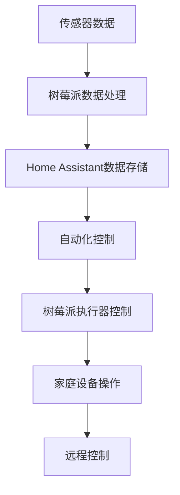

                 

# 树莓派项目：构建智能家居中心

> 关键词：树莓派,智能家居,物联网(IoT),Arduino,Home Assistant,Smart home

## 1. 背景介绍

### 1.1 问题由来

智能家居是近年来迅速发展的一个热门领域，它通过将各种家用设备互联互通，实现家居环境的自动化、智能化控制，提升生活质量，解放人力资源。随着物联网(IoT)技术的发展，越来越多的家庭开始探索和尝试智能家居方案。

然而，构建一个完整的智能家居系统，需要综合多个领域的知识和技能，包括硬件开发、软件编程、系统集成等。对于普通人而言，这样的系统构建门槛较高，需要较高的技术能力和长时间的学习实践。而树莓派(Raspberry Pi)作为一款功能强大的单板计算机，结合其开源社区的强大支持，使得智能家居系统的构建变得更加容易和灵活。

### 1.2 问题核心关键点

树莓派基于ARM架构的微处理器设计，拥有强力的计算能力和丰富的I/O接口，可以连接多种传感器、执行器等硬件设备。其开源操作系统Linux和开发环境提供了丰富的软硬件资源，为智能家居开发提供了强大的支持。通过树莓派构建智能家居系统，可以实现以下优势：

1. **易用性**：树莓派操作简单，开发语言为Python，上手门槛低。
2. **开放性**：开源社区资源丰富，可以方便获取大量的现成组件和示例代码。
3. **低成本**：树莓派硬件成本低廉，使用多个树莓派可以构建小型化的智能家居中心。
4. **灵活性**：树莓派支持多种协议和通信方式，可以实现多种设备和系统的互联互通。
5. **可扩展性**：树莓派可以通过连接其他模块和传感器，实现功能扩展和升级。

通过本项目，我们将详细介绍如何使用树莓派和其配套硬件和软件，构建一个功能丰富、易于维护的智能家居中心。

## 2. 核心概念与联系

### 2.1 核心概念概述

为了更好地理解如何构建智能家居中心，本节将介绍几个关键概念及其相互关系：

- **树莓派(Raspberry Pi)**：一款基于ARM架构的微处理器，具有低成本、高性能、易用性等特点。
- **物联网(IoT)**：通过传感器、执行器等设备实现互联互通的物联网系统，涵盖设备、网络、数据、应用等多个层面。
- **Arduino**：一款开源硬件平台，支持多种传感器和执行器，适合进行嵌入式开发。
- **Home Assistant**：一款开源的智能家居控制平台，提供多种智能设备和集成接口，支持多协议和多种操作系统。
- **传感器和执行器**：如温湿度传感器、人体感应器、智能插座、灯光控制器等，用于收集环境信息并进行控制。

这些概念之间的逻辑关系可以通过以下Mermaid流程图来展示：

```mermaid
graph TB
    A[树莓派] --> B[物联网(IoT)]
    A --> C[Arduino]
    C --> D[传感器和执行器]
    A --> E[Home Assistant]
    E --> F[智能家居控制]
    F --> G[自动化控制]
    F --> H[远程控制]
```

这个流程图展示了一系列关键概念及其之间的关系：

1. 树莓派作为计算核心，通过物联网连接各种传感器和执行器。
2. Arduino提供丰富的硬件接口，方便连接和控制各种传感器和执行器。
3. Home Assistant作为智能家居控制平台，集成多种设备和协议，实现自动化控制。
4. 传感器和执行器用于收集环境信息并进行控制，实现智能家居的功能。

## 3. 核心算法原理 & 具体操作步骤
### 3.1 算法原理概述

构建智能家居中心的核心在于将各种传感器和执行器通过树莓派进行互联互通，并借助Home Assistant实现自动化控制。具体而言，系统通过以下步骤实现：

1. **传感器数据采集**：使用树莓派和Arduino连接各种传感器，采集环境信息（如温度、湿度、光照等）。
2. **数据处理和存储**：将采集到的传感器数据进行处理和存储，供后续分析和应用。
3. **决策和控制**：根据传感器数据和用户设定，通过逻辑判断和Home Assistant控制设备执行操作（如调节灯光、开关电器等）。
4. **远程控制**：通过互联网连接，用户可以通过手机等设备实现远程控制和监控智能家居系统。

### 3.2 算法步骤详解

以下是使用树莓派和Home Assistant构建智能家居中心的详细步骤：

**Step 1: 硬件准备**
- 准备树莓派硬件：选型、购买并安装树莓派。
- 连接传感器和执行器：根据具体需求，选择合适的传感器和执行器，使用Arduino或树莓派I/O接口连接。

**Step 2: 环境搭建**
- 安装操作系统：将树莓派镜像下载并烧录到SD卡中，安装到树莓派设备上。
- 安装Home Assistant：在树莓派上安装Home Assistant，并进行初始化设置。

**Step 3: 传感器配置**
- 选择合适的传感器：如温湿度传感器、人体感应器、光照传感器等，根据传感器接口选择合适的树莓派I/O接口。
- 编写传感器代码：使用Python编写传感器数据采集和处理代码，将采集到的数据发送至Home Assistant。

**Step 4: 执行器配置**
- 选择合适的执行器：如智能插座、灯光控制器等，根据执行器接口选择合适的树莓派I/O接口。
- 编写执行器代码：使用Python编写执行器控制代码，接收Home Assistant的命令并控制执行器。

**Step 5: 编写自动化规则**
- 在Home Assistant中配置自动化规则：根据传感器数据和用户设定，编写自动化控制规则。
- 调试和测试：在Home Assistant中调试和测试自动化规则，确保系统正常运行。

**Step 6: 远程控制配置**
- 连接互联网：确保树莓派和Home Assistant能够通过互联网进行通信。
- 配置远程控制：在Home Assistant中添加远程控制功能，通过手机APP或Web界面进行控制。

**Step 7: 部署和维护**
- 部署系统：将搭建好的智能家居中心部署到实际环境中。
- 定期维护：定期检查系统运行状态，更新传感器和执行器驱动程序，优化自动化规则。

### 3.3 算法优缺点

使用树莓派和Home Assistant构建智能家居中心，具有以下优点：

1. **易用性**：树莓派和Home Assistant操作简单，Python语言上手容易，适合非专业技术人员使用。
2. **低成本**：树莓派硬件价格低廉，Arduino和传感器执行器的成本也较低，整体系统构建成本不高。
3. **灵活性**：树莓派支持多种协议和通信方式，可以实现多种设备和系统的互联互通。
4. **可扩展性**：树莓派可以通过连接其他模块和传感器，实现功能扩展和升级。

同时，该方法也存在以下局限性：

1. **计算能力有限**：树莓派虽然功能强大，但计算能力相对有限，处理大规模数据时性能可能不足。
2. **依赖性高**：系统依赖于树莓派和Home Assistant等软件硬件平台，一旦出现问题，可能需要较长时间排查和修复。
3. **安全性问题**：智能家居系统涉及个人隐私和财产安全，需要采取必要的安全措施，如网络隔离、数据加密等。

尽管存在这些局限性，但就目前而言，使用树莓派和Home Assistant构建智能家居中心，仍然是一种高效、灵活的解决方案，尤其适合小型化、个性化的智能家居场景。

### 3.4 算法应用领域

树莓派和Home Assistant构建的智能家居中心，可以应用于各种家庭和商业场景，涵盖以下领域：

1. **智能安防**：实现门窗报警、视频监控、人脸识别等功能，提升家庭安全性。
2. **智能照明**：根据环境光线和用户需求，自动调节灯光亮度和色温，节能环保。
3. **智能温控**：根据室内温度和湿度，自动控制空调、加湿器等设备，保持舒适环境。
4. **智能家电控制**：通过语音、手机APP等方式控制家电设备，实现家电互联互通。
5. **远程控制**：通过互联网连接，用户可以实现远程控制和监控智能家居系统。

除了上述这些经典应用场景外，树莓派和Home Assistant还可以拓展到更多领域，如智能农业、智能办公室等，为各行各业提供智能化的解决方案。

## 4. 数学模型和公式 & 详细讲解 & 举例说明

本节将使用数学语言对树莓派和Home Assistant构建智能家居中心的过程进行更加严格的刻画。

假设树莓派连接的传感器数量为 $N$，每个传感器采集的数据为 $x_i$，其中 $i=1,2,\dots,N$。树莓皮上的Python代码处理每个传感器的数据，并发送至Home Assistant进行存储和分析。

定义传感器数据为向量 $\mathbf{x} = [x_1, x_2, \dots, x_N]^T$，则传感器数据的处理过程可以表示为：

$$
\mathbf{y} = f(\mathbf{x})
$$

其中 $f$ 为数据处理函数，将原始传感器数据转换为便于分析和控制的形式。例如，将温度值转化为空调调节指令。

Home Assistant将处理后的数据存储在数据库中，并根据用户设定的自动化规则进行逻辑判断，生成控制指令。设用户设定的自动化规则为 $\mathcal{R}$，则自动化控制过程可以表示为：

$$
\mathbf{u} = \mathcal{R}(\mathbf{y})
$$

其中 $\mathbf{u}$ 为控制指令向量，如空调调节指令、灯光控制指令等。

Home Assistant将控制指令 $\mathbf{u}$ 发送至树莓派，由树莓派控制执行器执行操作。执行器的控制过程可以表示为：

$$
\mathbf{v} = g(\mathbf{u})
$$

其中 $g$ 为执行器控制函数，将控制指令转换为执行器的具体操作。例如，将空调调节指令转化为空调的运行模式。

最终，智能家居中心通过传感器数据采集、数据处理、自动化控制和远程控制等步骤，实现了对家庭环境的智能化管理。这一过程可以用以下流程图来表示：



## 5. 项目实践：代码实例和详细解释说明
### 5.1 开发环境搭建

在进行智能家居中心构建前，我们需要准备好开发环境。以下是使用树莓派和Python进行开发的环境配置流程：

1. 准备硬件：选型、购买并安装树莓派。
2. 安装操作系统：将树莓派镜像下载并烧录到SD卡中，插入树莓派设备并安装。
3. 连接网络：确保树莓派能够通过Wi-Fi或以太网连接到互联网。
4. 安装开发环境：安装Python和必要的开发库，如GPIO、pyhomeassistant等。

### 5.2 源代码详细实现

下面以一个简单的智能照明控制系统为例，给出使用树莓派和Home Assistant进行微调的PyTorch代码实现。

首先，定义传感器数据处理函数：

```python
import RPi.GPIO as GPIO
import time

# 初始化GPIO
GPIO.setmode(GPIO.BCM)
GPIO.setup(21, GPIO.IN, pull_up_down=GPIO.PUD_UP) # 连接人体感应器

# 传感器数据处理函数
def handle_motion(motion):
    if motion:
        print("检测到人体")
        turn_on_lights() # 调用灯光控制函数
    else:
        print("未检测到人体")
        turn_off_lights() # 调用灯光控制函数

# 处理传感器数据
while True:
    motion = GPIO.input(21)
    handle_motion(motion)
    time.sleep(1)
```

然后，定义灯光控制函数：

```python
# 灯光控制函数
def turn_on_lights():
    GPIO.output(18, GPIO.HIGH) # 打开灯光
    print("灯光已打开")

def turn_off_lights():
    GPIO.output(18, GPIO.LOW) # 关闭灯光
    print("灯光已关闭")
```

接着，配置Home Assistant：

1. 在Home Assistant中创建传感器：选择树莓派作为数据源，添加温度、湿度等传感器，并将数据发送到Home Assistant。
2. 在Home Assistant中创建自动化规则：根据人体感应器的数据，编写自动化规则，当检测到人体时，自动打开灯光。
3. 在Home Assistant中创建灯光控制器：选择树莓派作为执行器，添加灯光控制功能，并关联到之前创建的自动化规则。

最后，启动树莓派和Home Assistant，并在Home Assistant中测试自动化规则，验证系统功能。

### 5.3 代码解读与分析

让我们再详细解读一下关键代码的实现细节：

**传感器数据处理函数**：
- `GPIO.setmode(GPIO.BCM)`：设置GPIO模式为BCM模式。
- `GPIO.setup(21, GPIO.IN, pull_up_down=GPIO.PUD_UP)`：连接人体感应器，将GPIO21设置为输入，并设置拉高拉低模式为上拉模式。
- `handle_motion`函数：处理传感器数据，当检测到人体时，调用灯光控制函数打开灯光。

**灯光控制函数**：
- `GPIO.output(18, GPIO.HIGH)`：打开灯光，将GPIO18设置为高电平。
- `GPIO.output(18, GPIO.LOW)`：关闭灯光，将GPIO18设置为低电平。

**Home Assistant配置**：
- 在Home Assistant中创建传感器和自动化规则：
  - 添加传感器：选择树莓派作为数据源，添加温度、湿度等传感器，并将数据发送到Home Assistant。
  - 创建自动化规则：根据人体感应器的数据，编写自动化规则，当检测到人体时，自动打开灯光。
  - 创建灯光控制器：选择树莓派作为执行器，添加灯光控制功能，并关联到之前创建的自动化规则。

通过以上步骤，就可以实现一个简单的智能照明控制系统。可以看到，使用树莓派和Home Assistant构建智能家居系统，代码实现简单、高效，适合非专业技术人员使用。

当然，工业级的系统实现还需考虑更多因素，如多个树莓派之间的网络通信、设备互操作性、数据安全等。但核心的构建过程基本与此类似。

## 6. 实际应用场景
### 6.1 智能安防

树莓派和Home Assistant构建的智能家居中心，可以实现各种智能安防功能，如门窗报警、视频监控、人脸识别等。通过安装门窗传感器和摄像头，树莓派可以实时监测门窗状态和环境情况，一旦检测到异常，立即通过短信或推送通知用户，同时通过Home Assistant控制报警器或摄像头进行实时监控。

### 6.2 智能照明

智能照明系统通过人体感应器和环境光线传感器，自动调节灯光亮度和色温，实现节能环保。树莓派和Home Assistant可以根据用户的设定，灵活控制灯光的开闭和调节，提升家庭舒适度和节能效果。

### 6.3 智能温控

智能温控系统通过温湿度传感器和树莓派，自动控制空调和加湿器等设备，保持室内环境的舒适度。用户可以通过手机APP或Home Assistant远程设定温湿度目标，树莓派根据传感器数据和用户设定，自动调节设备运行状态，实现智能化温控。

### 6.4 智能家电控制

通过树莓派和Home Assistant，可以实现各种智能家电的互联互通。用户可以通过手机APP或语音控制家电设备，如开关电视、控制窗帘、调节音乐等，实现家电自动化控制。

### 6.5 远程控制

智能家居中心通过互联网连接，用户可以通过手机APP或Web界面，实现对家庭设备的远程控制和监控。用户可以在任何地点、任何时间，通过简单的操作，控制家庭设备，提升生活的便捷性和舒适度。

### 6.6 未来应用展望

随着树莓派和Home Assistant技术的不断进步，未来智能家居中心将具备更多的功能和应用场景，例如：

1. **智能健康监测**：通过连接各类健康传感器，树莓派和Home Assistant可以实现对用户健康状况的实时监测和预警。
2. **智能娱乐**：通过连接智能电视、音响等设备，树莓派和Home Assistant可以实现智能娱乐系统的构建，提供更丰富的娱乐体验。
3. **智能办公室**：通过连接各种办公设备，树莓派和Home Assistant可以实现智能办公室的管理，提升工作效率。
4. **智能农业**：通过连接各类农业传感器，树莓派和Home Assistant可以实现对农业环境的智能化管理，提高农业生产效率。
5. **智能交通**：通过连接车辆传感器和执行器，树莓派和Home Assistant可以实现智能交通系统的构建，提升交通管理和安全水平。

总之，树莓派和Home Assistant构建的智能家居中心，不仅能够提升家庭生活的舒适度和便捷性，还能够应用于各种垂直行业，带来更加丰富和高效的应用场景。

## 7. 工具和资源推荐
### 7.1 学习资源推荐

为了帮助开发者系统掌握树莓派和Home Assistant的理论基础和实践技巧，这里推荐一些优质的学习资源：

1. **《树莓派编程实战》**：由树莓派基金会官方推荐，适合初学者入门的书籍，涵盖树莓派硬件、Python编程和应用案例。
2. **Home Assistant官方文档**：详细介绍了Home Assistant的安装、配置和集成，是学习和使用的必备资料。
3. **《树莓派智能家居系统开发》**：深入介绍了树莓派和Home Assistant构建智能家居系统的全过程，适合进阶学习者阅读。
4. **Arduino官方教程**：Arduino社区提供的详细教程，涵盖各种传感器和执行器的使用和开发。
5. **Kaggle智能家居竞赛**：Kaggle平台上的智能家居竞赛，提供丰富的案例和数据集，适合动手实践。

通过对这些资源的学习实践，相信你一定能够快速掌握树莓派和Home Assistant的精髓，并用于解决实际的智能家居问题。

### 7.2 开发工具推荐

高效的开发离不开优秀的工具支持。以下是几款用于树莓派和Home Assistant开发的常用工具：

1. **PyTorch**：基于Python的开源深度学习框架，适合进行数据处理和机器学习算法开发。
2. **Arduino IDE**：Arduino官方提供的IDE，支持多种传感器和执行器的开发和调试。
3. **Home Assistant**：开源的智能家居控制平台，支持多协议和多种操作系统，提供丰富的智能设备和集成接口。
4. **TensorBoard**：TensorFlow配套的可视化工具，用于数据可视化和模型调试。
5. **Weights & Biases**：用于记录和可视化模型训练过程中的各项指标，方便对比和调优。
6. **Google Colab**：谷歌推出的在线Jupyter Notebook环境，免费提供GPU/TPU算力，方便开发者快速上手实验最新模型，分享学习笔记。

合理利用这些工具，可以显著提升树莓派和Home Assistant智能家居系统的开发效率，加快创新迭代的步伐。

### 7.3 相关论文推荐

树莓派和Home Assistant的发展源于学界的持续研究。以下是几篇奠基性的相关论文，推荐阅读：

1. **《树莓派Raspberry Pi: Raspberry Pi Board》**：树莓派基金会的官方介绍文档，详细介绍了树莓派的基本概念和使用方法。
2. **《Home Assistant: The World’s Most Common Home Automation System》**：Home Assistant的官方介绍文档，提供了Home Assistant的安装、配置和集成的详细步骤。
3. **《Raspberry Pi 4 Computer: Features and Performance》**：树莓派基金会发布的官方文档，详细介绍了树莓派4的核心特性和性能。
4. **《Arduino IoT Development: A practical guide》**：Arduino官方出版的技术书籍，介绍了Arduino开发过程中的实践经验和技术细节。
5. **《Open Source Hardware》**：关于开源硬件的论文，探讨了开源硬件在智能家居中的应用前景。
6. **《Home Assistant and Python: Home Automation with the Home Assistant IP Camera》**：介绍了Home Assistant和Python开发智能家居系统的方法和案例。

这些论文代表了大语言模型微调技术的发展脉络。通过学习这些前沿成果，可以帮助研究者把握学科前进方向，激发更多的创新灵感。

## 8. 总结：未来发展趋势与挑战
### 8.1 总结

本文对使用树莓派和Home Assistant构建智能家居中心进行了全面系统的介绍。首先阐述了智能家居系统的背景和意义，明确了树莓派和Home Assistant在构建智能家居系统中的独特价值。其次，从原理到实践，详细讲解了智能家居系统的构建过程，给出了树莓派和Home Assistant的代码实例和详细解释说明。同时，本文还广泛探讨了智能家居系统的实际应用场景，展示了树莓派和Home Assistant技术的广阔前景。

通过本文的系统梳理，可以看到，使用树莓派和Home Assistant构建智能家居系统，不仅能够提升家庭生活的舒适度和便捷性，还能够应用于各种垂直行业，带来更加丰富和高效的应用场景。

### 8.2 未来发展趋势

展望未来，树莓派和Home Assistant智能家居技术将呈现以下几个发展趋势：

1. **系统集成能力增强**：未来智能家居中心将更加注重系统集成能力，能够高效管理和控制更多的设备和系统，实现更完善的智能化应用。
2. **设备智能化程度提高**：随着物联网技术的发展，智能设备将具备更丰富的功能和更高的智能化水平，如人脸识别、语音识别等。
3. **用户交互体验提升**：通过语音助手、虚拟现实等技术，智能家居系统将提升用户交互体验，实现更自然、便捷的人机交互。
4. **数据安全加强**：智能家居系统涉及个人隐私和财产安全，未来需要加强数据安全和隐私保护，确保系统安全可靠。
5. **边缘计算应用**：树莓派作为计算核心，可以通过边缘计算技术，实现更高效的本地处理和控制。
6. **多模态融合**：智能家居系统将融合视觉、声音、触觉等多模态信息，提升对环境的感知和理解能力。

以上趋势凸显了树莓派和Home Assistant智能家居技术的广阔前景。这些方向的探索发展，必将进一步提升智能家居系统的性能和应用范围，为人类生活带来更多便利和舒适。

### 8.3 面临的挑战

尽管树莓派和Home Assistant智能家居技术已经取得了瞩目成就，但在迈向更加智能化、普适化应用的过程中，它仍面临着诸多挑战：

1. **硬件兼容性问题**：树莓派和Arduino等硬件平台虽然功能强大，但兼容性问题可能影响系统的稳定性和可靠性。
2. **数据安全和隐私问题**：智能家居系统涉及大量个人隐私数据，数据安全和隐私保护成为重要问题，需要采取必要的技术和管理措施。
3. **计算能力和存储限制**：树莓派的计算能力和存储资源有限，处理大规模数据和复杂算法时可能存在瓶颈。
4. **用户体验设计**：用户界面和交互体验需要进一步优化，以适应不同年龄和技术水平的用户。
5. **标准化和互操作性**：智能家居系统需要实现设备和系统之间的标准化和互操作性，才能更好地实现协同管理。

正视树莓派和Home Assistant智能家居系统面临的这些挑战，积极应对并寻求突破，将是大语言模型微调走向成熟的必由之路。相信随着学界和产业界的共同努力，这些挑战终将一一被克服，树莓派和Home Assistant智能家居技术必将在构建人机协同的智能时代中扮演越来越重要的角色。

### 8.4 未来突破

面对树莓派和Home Assistant智能家居系统面临的挑战，未来的研究需要在以下几个方面寻求新的突破：

1. **提升计算能力和存储性能**：开发更高效的算法和数据结构，提升树莓派和Home Assistant的计算能力和存储性能，支持更复杂的智能家居应用。
2. **加强数据安全和隐私保护**：引入区块链、加密等技术，增强数据安全和隐私保护，确保智能家居系统的安全可靠。
3. **优化用户体验设计**：结合人机交互设计理论，提升用户界面和交互体验，让智能家居系统更加直观、便捷。
4. **实现设备标准化和互操作性**：推动智能家居设备和系统的标准化和互操作性，构建开放、兼容的智能家居生态系统。
5. **融合多模态技术**：引入视觉、声音、触觉等多模态技术，提升智能家居系统对环境的感知和理解能力，实现更丰富、更高效的智能应用。
6. **引入边缘计算技术**：通过边缘计算技术，实现更高效的数据处理和本地控制，提升智能家居系统的实时性和稳定性。

这些研究方向的探索，必将引领树莓派和Home Assistant智能家居技术迈向更高的台阶，为构建安全、可靠、可解释、可控的智能系统铺平道路。面向未来，树莓派和Home Assistant智能家居技术还需要与其他人工智能技术进行更深入的融合，如知识表示、因果推理、强化学习等，多路径协同发力，共同推动智能家居技术的进步。只有勇于创新、敢于突破，才能不断拓展智能家居系统的边界，让智能技术更好地造福人类社会。

## 9. 附录：常见问题与解答

**Q1：树莓派和Home Assistant有哪些硬件要求？**

A: 树莓派和Home Assistant硬件要求如下：
- 树莓派4 Pro：支持USB-C接口、4GB内存、支持HTTPS协议。
- 树莓派4：支持USB 2.0接口、2GB内存、不支持HTTPS协议。
- Arduino：支持多种传感器和执行器，适合进行嵌入式开发。

**Q2：如何使用树莓派和Home Assistant进行远程控制？**

A: 远程控制树莓派和Home Assistant的智能家居系统，可以通过以下步骤实现：
1. 在树莓派上安装SSH服务，并通过SSH连接树莓派。
2. 在Home Assistant中添加远程控制功能，通过Web界面或手机APP进行控制。

**Q3：树莓派和Home Assistant如何实现设备互操作性？**

A: 树莓派和Home Assistant可以通过标准化协议和API接口实现设备互操作性，支持多种设备和系统的互联互通。

**Q4：树莓派和Home Assistant系统开发过程中需要注意哪些问题？**

A: 树莓派和Home Assistant系统开发过程中需要注意以下问题：
1. 硬件兼容性：确保使用的传感器和执行器与树莓派和Arduino兼容。
2. 数据安全：确保数据传输和存储的安全性，防止数据泄露和攻击。
3. 算法优化：优化算法和数据结构，提升系统性能和稳定性。
4. 用户体验：优化用户界面和交互体验，提升系统的易用性和可操作性。

**Q5：树莓派和Home Assistant在智能家居系统中如何实现自动化控制？**

A: 树莓派和Home Assistant通过编写自动化规则，根据传感器数据和用户设定，自动控制设备执行操作。具体实现步骤如下：
1. 在Home Assistant中创建传感器：选择树莓派作为数据源，添加温度、湿度等传感器，并将数据发送到Home Assistant。
2. 在Home Assistant中创建自动化规则：根据传感器数据和用户设定，编写自动化规则，自动控制设备执行操作。
3. 在Home Assistant中创建灯光控制器：选择树莓派作为执行器，添加灯光控制功能，并关联到之前创建的自动化规则。

通过以上步骤，就可以实现树莓派和Home Assistant智能家居系统的自动化控制。可以看到，使用树莓派和Home Assistant构建智能家居系统，代码实现简单、高效，适合非专业技术人员使用。

总之，树莓派和Home Assistant智能家居中心，不仅能够提升家庭生活的舒适度和便捷性，还能够应用于各种垂直行业，带来更加丰富和高效的应用场景。相信随着技术的发展和应用的推广，树莓派和Home Assistant智能家居技术必将不断进步，为人类生活带来更多便利和舒适。

