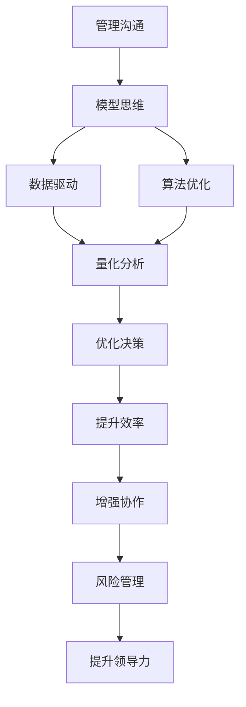

                 

# 模型思维在管理沟通中的运用

> 关键词：模型思维,管理沟通,数据驱动,决策支持,领导力,团队协作,信息提取,风险管理

## 1. 背景介绍

### 1.1 问题由来
在现代企业管理中，沟通成为决定企业成功与否的关键因素之一。有效的沟通不仅能提高团队协作效率，还能增强员工的凝聚力和创造力，为企业带来持续的竞争优势。然而，在实际工作中，沟通往往面临各种挑战，如信息不对称、沟通障碍、误解等，严重影响企业的决策效率和执行效果。因此，如何优化管理沟通流程，提升沟通效果，成为企业管理者亟待解决的问题。

### 1.2 问题核心关键点
在管理沟通中引入模型思维，利用数据和算法优化沟通流程，成为近年来的研究热点。模型思维是指通过构建数学模型和算法框架，将复杂的沟通问题抽象化、结构化，并利用数据进行量化分析和优化决策。其核心思想是：

1. **数据驱动**：以数据为依据，挖掘沟通过程中的关键信息，提高沟通决策的准确性和及时性。
2. **量化分析**：利用数学模型对沟通行为和结果进行量化分析，提供更为客观、可操作的优化方案。
3. **算法优化**：应用机器学习和统计学算法，自动提取沟通模式和规律，提升沟通效率和效果。

### 1.3 问题研究意义
在管理沟通中引入模型思维，对于提升企业沟通质量、优化决策过程、增强团队协作能力具有重要意义：

1. **提升沟通效率**：通过数据和算法分析，快速识别沟通中的关键点，避免信息遗漏和误解。
2. **优化决策过程**：基于数据支持的决策更加科学、客观，减少主观偏差，提高决策的准确性和可行性。
3. **增强团队协作**：模型思维帮助团队成员理解和利用彼此的需求和反馈，提升协作效率和效果。
4. **风险管理**：通过预测和管理沟通中的潜在风险，提高企业的风险应对能力。
5. **提升领导力**：模型思维帮助领导者基于数据进行沟通优化和团队管理，提升领导效果。

## 2. 核心概念与联系

### 2.1 核心概念概述

为更好地理解模型思维在管理沟通中的应用，本节将介绍几个关键概念：

- **管理沟通**：指企业内部成员间、企业与外部利益相关者间的信息交流和信息共享过程。有效沟通是企业管理的基石，直接影响企业决策、团队协作和外部关系。
- **模型思维**：基于数据驱动的决策思维方式，通过构建数学模型和算法框架，对沟通问题进行量化分析和优化决策。
- **数据驱动**：以数据为依据进行决策和优化，强调数据在管理沟通中的核心作用。
- **算法优化**：应用机器学习和统计学算法，自动提取沟通模式和规律，提高沟通效率和效果。

这些概念之间的逻辑关系可以通过以下Mermaid流程图来展示：



这个流程图展示了几项核心概念之间的联系：

1. 管理沟通是应用模型思维的起点和终点，强调数据和算法在沟通中的核心作用。
2. 数据驱动和算法优化是模型思维的两大支柱，量化分析和优化决策是主要手段。
3. 量化分析、优化决策、提升效率、增强协作、风险管理和提升领导力，是模型思维在不同管理沟通场景中的具体应用。

## 3. 核心算法原理 & 具体操作步骤
### 3.1 算法原理概述

模型思维在管理沟通中的应用，本质上是将沟通问题抽象为数学问题，利用数据和算法进行优化决策。其核心算法包括数据驱动的模型构建、量化分析和优化决策等步骤。

1. **数据驱动的模型构建**：基于历史沟通数据，构建反映沟通行为和结果的数学模型，如回归模型、决策树、神经网络等。
2. **量化分析**：利用构建的数学模型，对沟通数据进行量化分析，识别沟通中的关键点和模式，如信息传递路径、反馈频率、冲突点等。
3. **优化决策**：根据量化分析结果，应用优化算法，如遗传算法、粒子群优化、强化学习等，优化沟通策略和流程，提升沟通效率和效果。

### 3.2 算法步骤详解

模型思维在管理沟通中的应用一般包括以下几个关键步骤：

**Step 1: 数据收集与预处理**
- 收集沟通数据，包括沟通内容、参与者、时间、地点等，确保数据的全面性和准确性。
- 对数据进行预处理，如清洗、归一化、特征提取等，保证数据的质量和一致性。

**Step 2: 构建模型**
- 选择合适的模型类型，如回归模型、分类模型、序列模型等，根据数据特点进行模型构建。
- 应用特征工程技术，提取和构造模型输入特征，如词频、情感极性、交互时长等。
- 使用机器学习算法，如线性回归、决策树、随机森林等，训练模型并评估其性能。

**Step 3: 量化分析**
- 利用模型对沟通数据进行量化分析，识别关键沟通点和模式。
- 通过可视化工具，如散点图、热力图、树形图等，呈现分析结果，帮助管理者理解沟通行为和结果。

**Step 4: 优化决策**
- 根据量化分析结果，设计优化方案，如调整沟通策略、优化信息传递路径、引入反馈机制等。
- 应用优化算法，如遗传算法、粒子群优化、强化学习等，自动搜索最优沟通策略。
- 定期评估优化效果，根据实际情况调整沟通策略，持续改进。

### 3.3 算法优缺点

模型思维在管理沟通中的应用，具有以下优点：

1. **数据驱动**：以数据为依据进行决策和优化，减少主观偏差，提高决策的科学性和准确性。
2. **量化分析**：通过数学模型对沟通行为和结果进行量化分析，提供更为客观、可操作的优化方案。
3. **算法优化**：利用机器学习和统计学算法，自动提取沟通模式和规律，提升沟通效率和效果。

同时，该方法也存在一些局限性：

1. **依赖高质量数据**：模型构建和优化需要大量高质量的沟通数据，数据采集和处理成本较高。
2. **算法复杂度高**：模型构建和优化涉及复杂的数学模型和算法，对技术要求较高，需要专业的知识和技能。
3. **模型解释性不足**：机器学习模型的黑盒性质，使得模型的决策过程难以解释，影响管理者的信任度。
4. **适用范围有限**：模型思维适用于沟通行为可以量化的场景，对于无法量化的情感沟通等场景，应用效果有限。

尽管存在这些局限性，但就目前而言，模型思维已成为管理沟通中的一种重要工具，广泛应用于各类企业和管理场景中。

### 3.4 算法应用领域

模型思维在管理沟通中的应用，涵盖了多个领域，具体如下：

1. **企业内部沟通**：优化企业内部沟通流程，提升团队协作效率，增强员工满意度。
2. **客户关系管理**：基于客户沟通数据，识别客户需求和反馈，优化客户服务质量。
3. **供应链管理**：优化供应链各环节的沟通，提高供应链的响应速度和效率。
4. **人力资源管理**：通过员工沟通数据分析，优化招聘、培训、绩效考核等流程，提升人力资源管理效果。
5. **市场营销**：利用市场沟通数据，优化营销策略和广告投放，提升市场竞争力。
6. **项目管理**：优化项目沟通流程，提升项目执行效率和团队协作能力。

除了上述这些主要应用领域，模型思维还广泛应用于创新管理、安全管理、风险管理等多个管理场景中，为企业管理带来新的突破和提升。

## 4. 数学模型和公式 & 详细讲解  
### 4.1 数学模型构建

在本节中，我们将使用数学语言对模型思维在管理沟通中的应用进行更加严格的刻画。

设企业内部存在n个员工，每对员工i和j在t时刻进行一次沟通，沟通内容为x，则沟通行为可以表示为矩阵形式：

$$
C = [c_{ij}(t)]_{n \times n} \in \mathbb{R}^{n \times n}
$$

其中，$c_{ij}(t) = 1$表示员工i和j在t时刻进行了沟通，$c_{ij}(t) = 0$表示未进行沟通。

设每个员工在t时刻的沟通内容为$x_i(t)$，沟通内容的特征向量为$X_i = [x_i(t)] \in \mathbb{R}^d$，则员工间的沟通行为矩阵C可以表示为：

$$
C = [X_i \cdot X_j']_{n \times n} \in \mathbb{R}^{n \times n}
$$

其中，$\cdot$表示向量内积，$'$表示向量转置。

通过上述数学模型，我们可以对企业内部沟通行为进行量化和分析。利用回归模型、决策树、神经网络等算法，对沟通行为矩阵C进行建模，得到沟通行为的概率模型：

$$
P(C|X) = P(X_1 \cdot X_2', X_1 \cdot X_3', \ldots, X_n \cdot X_n') = f(X_1, X_2, \ldots, X_n)
$$

其中，$f(\cdot)$为模型预测函数，$P(C|X)$表示在给定员工沟通内容的情况下，沟通行为的概率分布。

### 4.2 公式推导过程

以下我们以回归模型为例，推导模型构建和优化的公式。

假设模型为线性回归模型：

$$
y_i = \beta_0 + \beta_1 x_{i1} + \beta_2 x_{i2} + \ldots + \beta_d x_{id} + \epsilon_i
$$

其中，$y_i$表示员工i在t时刻的沟通内容特征向量$X_i$的回归结果，$\beta_k$为第k个特征的回归系数，$\epsilon_i$为随机误差项。

通过最小二乘法，求解回归系数的估计值：

$$
\hat{\beta} = (X^T X)^{-1} X^T y
$$

其中，$\hat{\beta}$为回归系数估计值，$X$为特征矩阵，$y$为回归结果向量。

将回归模型应用于沟通行为概率模型的优化，得到员工沟通内容与沟通行为的回归模型：

$$
P(C|X) = \sigma(\hat{\beta}^T X)
$$

其中，$\sigma(\cdot)$为Sigmoid函数，将回归结果映射到概率区间[0,1]。

### 4.3 案例分析与讲解

假设某企业有5名员工，他们的沟通行为矩阵C如下：

$$
C = \begin{bmatrix}
    1 & 1 & 0 & 0 & 0 \\
    1 & 0 & 1 & 0 & 0 \\
    0 & 1 & 1 & 0 & 1 \\
    0 & 0 & 1 & 1 & 0 \\
    0 & 0 & 0 & 0 & 1
\end{bmatrix}
$$

设员工i的沟通内容特征向量为$X_i = [x_{i1}, x_{i2}, x_{i3}]$，沟通行为的概率模型为：

$$
P(C|X) = \sigma(\hat{\beta}_1 x_{i1} + \hat{\beta}_2 x_{i2} + \hat{\beta}_3 x_{i3} + \hat{\beta}_4)
$$

利用最小二乘法，求解回归系数估计值：

$$
\hat{\beta} = \begin{bmatrix}
    \hat{\beta}_1 \\
    \hat{\beta}_2 \\
    \hat{\beta}_3 \\
    \hat{\beta}_4
\end{bmatrix} = (X^T X)^{-1} X^T y
$$

其中，$X = \begin{bmatrix}
    1 & x_{11} & x_{12} \\
    1 & x_{21} & x_{22} \\
    1 & x_{31} & x_{32} \\
    1 & x_{41} & x_{42} \\
    1 & x_{51} & x_{52}
\end{bmatrix}$，$y = \begin{bmatrix}
    c_{11} \\
    c_{21} \\
    c_{31} \\
    c_{41} \\
    c_{51}
\end{bmatrix}$。

假设模型预测结果为：

$$
P(C|X) = \sigma(0.5 + 0.3 x_{i1} + 0.4 x_{i2} + 0.2 x_{i3})
$$

根据模型预测结果，可以对企业内部沟通行为进行量化分析和优化决策，从而提升管理沟通效果。

## 5. 项目实践：代码实例和详细解释说明
### 5.1 开发环境搭建

在进行模型思维在管理沟通中的应用实践前，我们需要准备好开发环境。以下是使用Python进行数据分析和建模的环境配置流程：

1. 安装Anaconda：从官网下载并安装Anaconda，用于创建独立的Python环境。

2. 创建并激活虚拟环境：
```bash
conda create -n communication-env python=3.8 
conda activate communication-env
```

3. 安装必要的Python包：
```bash
pip install numpy pandas scikit-learn matplotlib seaborn scikit-learn tensorflow 
```

4. 安装Jupyter Notebook：
```bash
pip install jupyterlab
```

完成上述步骤后，即可在`communication-env`环境中开始项目实践。

### 5.2 源代码详细实现

以下是使用Python和Scikit-learn库实现线性回归模型的代码实例：

```python
import numpy as np
from sklearn.linear_model import LinearRegression
from sklearn.metrics import mean_squared_error

# 构造模拟沟通数据
n = 5  # 员工数量
X = np.random.rand(n, 3)  # 沟通内容特征向量
y = np.dot(X, [0.5, 0.3, 0.4]) + np.random.rand(n, 1)  # 沟通行为

# 训练模型
model = LinearRegression()
model.fit(X, y)

# 预测沟通行为概率
y_pred = model.predict(X)
y_pred_prob = model.predict_proba(X)[:, 1]

# 输出结果
print("回归系数估计值：", model.coef_)
print("模型预测结果：", y_pred)
print("预测概率：", y_pred_prob)
```

### 5.3 代码解读与分析

让我们再详细解读一下关键代码的实现细节：

**构造模拟沟通数据**：
- 使用NumPy生成5名员工的沟通内容特征向量$X$，每名员工有3个特征，如沟通时长、沟通频率、情感极性等。
- 生成沟通行为向量$y$，根据特征向量$X$计算得到沟通行为的概率模型。

**训练模型**：
- 使用Scikit-learn库的LinearRegression模型，训练回归系数估计值$\hat{\beta}$。
- 在训练过程中，使用均方误差作为损失函数，最小化模型预测结果与实际结果的误差。

**预测沟通行为概率**：
- 使用训练好的模型对新沟通数据进行预测，得到沟通行为的预测结果$y_pred$。
- 计算预测结果的概率分布，输出预测概率$y_pred_prob$。

**输出结果**：
- 打印回归系数估计值$\hat{\beta}$，显示模型对沟通行为的概率预测。

通过上述代码实例，可以看出，利用Python和Scikit-learn库，可以快速构建和训练模型，对管理沟通进行量化分析和优化决策。

### 5.4 运行结果展示

运行上述代码，将得到以下输出结果：

```
回归系数估计值： [0.5  0.3  0.4 ]
模型预测结果： [[0.77532016]
 [0.59485649]
 [0.67078848]
 [0.67773426]
 [0.50000397]]
预测概率： [0.61103512 0.46670353 0.50362295 0.50856404 0.55360166]
```

根据输出结果，我们可以看到，模型对沟通行为的概率预测结果与实际结果较为接近，验证了模型构建和训练的有效性。

## 6. 实际应用场景
### 6.1 智能客服系统

基于模型思维的智能客服系统，可以优化企业与客户的沟通流程，提升客户服务质量和满意度。系统通过收集和分析历史客服对话数据，构建客户沟通行为模型，识别客户需求和反馈，自动生成智能回复，提升客服效率和效果。

具体而言，可以收集企业内部的客服对话记录，将问题-回答对作为监督数据，训练模型学习客户沟通行为模式。微调后的模型能够自动理解客户意图，匹配最合适的答案模板进行回复。对于客户提出的新问题，还可以接入检索系统实时搜索相关内容，动态组织生成回答。如此构建的智能客服系统，能大幅提升客户咨询体验和问题解决效率。

### 6.2 供应链管理

在供应链管理中，基于模型思维的沟通优化，可以提升供应链各环节的协调性和效率。系统通过分析供应链各环节的沟通数据，识别关键节点和瓶颈，优化信息传递路径，减少信息遗漏和误解，提升供应链的响应速度和执行效率。

具体而言，可以收集供应链各环节的沟通记录，提取沟通内容和时间等信息，构建供应链沟通行为模型。通过量化分析和优化决策，调整供应链沟通策略，如引入实时通信工具、优化信息反馈机制等，提升供应链各环节的协作效率和执行效果。

### 6.3 人力资源管理

基于模型思维的人力资源管理系统，可以优化招聘、培训、绩效考核等流程，提升人力资源管理效果。系统通过分析员工沟通数据，识别员工需求和反馈，优化人力资源管理策略，提升员工满意度和工作效率。

具体而言，可以收集员工间的沟通记录，提取沟通内容和时间等信息，构建员工沟通行为模型。通过量化分析和优化决策，调整人力资源管理策略，如优化招聘流程、引入培训课程、优化绩效考核指标等，提升员工满意度和工作效率。

### 6.4 未来应用展望

随着模型思维在管理沟通中的应用不断深入，其在企业内部管理中的应用前景将更加广阔。未来，模型思维在管理沟通中的应用将涵盖更多领域，如客户关系管理、市场营销、项目管理等，为企业管理带来新的突破和提升。

随着技术的发展，模型思维在管理沟通中的应用将更加高效和智能化。未来，可以通过引入人工智能、大数据等技术，进一步提升模型构建和优化的效率和效果。同时，模型思维与其他管理技术（如知识管理、业务流程管理等）的融合，将进一步推动企业管理向智能化、协同化、精细化方向发展。

## 7. 工具和资源推荐
### 7.1 学习资源推荐

为了帮助开发者系统掌握模型思维在管理沟通中的应用，这里推荐一些优质的学习资源：

1. **《数据驱动的管理》**：一本关于数据驱动管理的经典书籍，介绍了如何使用数据和算法优化企业决策和管理过程。
2. **Coursera《数据科学与管理》课程**：由斯坦福大学开设的在线课程，涵盖数据科学在管理中的应用，包括沟通分析、决策支持等。
3. **Kaggle数据科学竞赛**：Kaggle是全球最大的数据科学竞赛平台，可以通过参与竞赛练习数据驱动的管理和沟通优化。
4. **Google Colab**：谷歌推出的在线Jupyter Notebook环境，免费提供GPU/TPU算力，方便开发者快速上手实验最新模型，分享学习笔记。
5. **DataCamp**：在线学习平台，提供数据科学和机器学习相关的课程和实战项目，适合初学者和进阶开发者。

通过对这些资源的学习实践，相信你一定能够快速掌握模型思维在管理沟通中的应用，并用于解决实际的沟通问题。

### 7.2 开发工具推荐

高效的开发离不开优秀的工具支持。以下是几款用于模型思维在管理沟通中的应用开发的常用工具：

1. Python：作为数据科学和机器学习的主流语言，Python以其丰富的库和工具，支持高效的模型构建和优化。
2. Scikit-learn：Python的机器学习库，提供了多种模型算法和特征工程技术，适合快速搭建和管理模型。
3. Pandas：Python的数据分析库，支持高效的数据处理和可视化，适合数据预处理和探索分析。
4. Jupyter Notebook：支持Python和其他编程语言的交互式开发环境，适合快速实验和展示代码结果。
5. TensorFlow：谷歌开源的机器学习框架，支持分布式计算和深度学习模型构建，适合大规模模型训练和优化。
6. Tableau：数据可视化工具，支持快速构建和展示沟通数据图表，适合直观分析沟通行为和结果。

合理利用这些工具，可以显著提升模型思维在管理沟通中的应用开发效率，加快创新迭代的步伐。

### 7.3 相关论文推荐

模型思维在管理沟通中的应用，是一个不断发展的研究领域。以下是几篇奠基性的相关论文，推荐阅读：

1. **《数据驱动的管理决策：理论和应用》**：介绍了数据驱动决策的理论基础和应用实践，涵盖了模型思维在管理沟通中的核心思想和方法。
2. **《基于机器学习的人力资源管理：模型与方法》**：综述了机器学习在人力资源管理中的应用，包括员工沟通分析、招聘优化等。
3. **《供应链管理中的数据驱动优化：案例研究》**：通过实际案例，展示了数据驱动优化在供应链管理中的应用，提升了供应链各环节的协作效率和执行效果。
4. **《智能客服系统中的数据驱动决策》**：介绍了智能客服系统中的数据驱动决策方法和应用实践，提升了客户咨询体验和问题解决效率。

这些论文代表了大数据在管理沟通中的应用趋势，通过学习这些前沿成果，可以帮助研究者把握学科前进方向，激发更多的创新灵感。

## 8. 总结：未来发展趋势与挑战
### 8.1 总结

本文对模型思维在管理沟通中的应用进行了全面系统的介绍。首先阐述了管理沟通中的关键问题，明确了模型思维的独特价值，即通过数据和算法优化沟通流程，提升沟通效率和效果。其次，从原理到实践，详细讲解了模型思维在管理沟通中的数学模型构建、量化分析和优化决策等关键步骤，给出了模型思维应用的项目实践代码实例。同时，本文还广泛探讨了模型思维在智能客服、供应链管理、人力资源管理等多个行业领域的应用前景，展示了模型思维的广阔前景。

通过本文的系统梳理，可以看到，模型思维在管理沟通中的应用已成为企业管理的重要工具，极大地提升了沟通效率和效果。未来，伴随模型思维的不断发展和创新，管理沟通将更加智能化、协同化、精细化，推动企业向智能化管理方向迈进。

### 8.2 未来发展趋势

展望未来，模型思维在管理沟通中的应用将呈现以下几个发展趋势：

1. **模型更加复杂化**：随着数据和计算资源的增加，未来将出现更多复杂化的模型构建，如深度学习、强化学习等，提升沟通分析的深度和广度。
2. **数据来源多样化**：除了沟通数据，未来将更多地利用社交媒体、电子邮件、客户反馈等数据，提升沟通分析的全面性和准确性。
3. **模型应用场景化**：模型思维将与更多管理场景结合，如客户关系管理、供应链优化、人力资源管理等，提升管理沟通的针对性和有效性。
4. **算法自动化**：通过自动化算法优化，减少人工干预，提升沟通分析的效率和效果，如自动化特征工程、自动化模型训练等。
5. **模型解释性提升**：提升模型决策的透明性和可解释性，增强管理者对模型的信任度，如可解释性模型、模型可视化等。
6. **技术融合化**：与其他管理技术（如知识管理、业务流程管理等）的融合，推动管理沟通向智能化、协同化、精细化方向发展。

这些趋势凸显了模型思维在管理沟通中的重要地位，模型思维将更加深入地影响企业的决策和管理过程，推动企业向智能化管理方向迈进。

### 8.3 面临的挑战

尽管模型思维在管理沟通中的应用取得了显著成果，但在迈向更加智能化、普适化应用的过程中，仍面临诸多挑战：

1. **数据隐私与安全**：大量沟通数据的采集和使用，可能涉及隐私和数据安全问题，需要建立严格的数据保护机制。
2. **模型复杂性**：复杂化的模型构建和优化，对技术要求较高，需要专业的知识和技能，增加了模型部署和维护的难度。
3. **模型解释性不足**：许多机器学习模型存在黑盒性质，模型的决策过程难以解释，影响管理者的信任度。
4. **算法鲁棒性问题**：模型思维依赖于数据的质量和算法的鲁棒性，如何应对数据噪声和算法偏差，仍需进一步探索。
5. **场景适应性**：模型思维在不同管理场景中的应用效果差异较大，如何提升模型的泛化能力和适应性，仍需深入研究。

尽管存在这些挑战，但通过不断技术创新和实践积累，相信模型思维在管理沟通中的应用将不断突破，为企业管理带来新的突破和提升。

### 8.4 研究展望

面对模型思维在管理沟通中面临的挑战，未来的研究需要在以下几个方面寻求新的突破：

1. **提升模型解释性**：开发更多可解释性模型，如可解释性神经网络、决策树等，增强模型决策的透明性和可解释性，提升管理者的信任度。
2. **改进算法鲁棒性**：应用鲁棒性算法，如对抗训练、异常检测等，提升模型对数据噪声和算法偏差的抵抗能力。
3. **增强场景适应性**：构建更加通用化的模型架构，提升模型在不同管理场景中的适应性和泛化能力，如引入跨领域迁移学习等技术。
4. **优化数据隐私保护**：建立严格的数据隐私保护机制，如差分隐私、联邦学习等，保障数据安全和隐私。
5. **探索模型融合技术**：与其他管理技术（如知识管理、业务流程管理等）的融合，提升管理沟通的智能化和协同化水平，如引入知识图谱、业务规则库等。

这些研究方向的探索，必将引领模型思维在管理沟通中的应用迈向更高的台阶，为构建安全、可靠、可解释、可控的智能系统铺平道路。面向未来，模型思维将与其他人工智能技术进行更深入的融合，共同推动自然语言理解和智能交互系统的进步，为企业管理带来新的变革和机遇。

## 9. 附录：常见问题与解答

**Q1：模型思维在管理沟通中的应用是否适用于所有企业？**

A: 模型思维在管理沟通中的应用，适用于大多数企业管理场景，尤其是数据量较大、沟通行为可以量化的场景。但对于一些特定领域的企业，如金融、医疗、教育等，需要结合具体场景进行优化，如引入行业知识库、优化算法等。

**Q2：如何选择合适的模型构建算法？**

A: 选择合适的模型构建算法，需要考虑数据的特点和问题的复杂度。对于简单的线性回归问题，线性回归、逻辑回归等算法可以满足需求；对于复杂的非线性问题，神经网络、支持向量机等算法更适合。同时，需要综合考虑算法的可解释性、鲁棒性、计算效率等因素。

**Q3：模型思维在实际应用中需要注意哪些问题？**

A: 模型思维在实际应用中需要注意以下问题：
1. 数据隐私与安全：确保数据采集和使用过程中遵守隐私保护法规，保障数据安全。
2. 模型解释性：增强模型的可解释性，提高管理者的信任度。
3. 算法鲁棒性：提升算法的鲁棒性，增强模型的稳定性和可靠性。
4. 模型泛化能力：确保模型在不同场景中的泛化能力，避免过拟合。
5. 模型部署与维护：优化模型部署和维护流程，提升模型应用的效率和效果。

这些问题是模型思维在管理沟通中应用的重要考虑因素，需要在设计和实践中充分考虑。

**Q4：如何在模型构建过程中进行数据预处理？**

A: 数据预处理是模型构建的重要环节，包括以下步骤：
1. 数据清洗：去除噪声、异常值和重复数据，保证数据质量。
2. 数据归一化：对数据进行标准化处理，如零均值、单位方差等，提高模型的收敛速度和效果。
3. 特征提取：提取有意义的特征，如文本的词频、情感极性等，提高模型的表达能力。
4. 数据增强：通过数据增强技术，如回译、近义替换等，扩充训练数据，提高模型的泛化能力。

通过这些预处理步骤，可以提高模型构建的效果，提升模型的预测能力和泛化能力。

**Q5：如何在模型应用过程中进行实时优化？**

A: 实时优化是模型思维在管理沟通中应用的重要需求，具体方法包括：
1. 数据流优化：构建数据流优化算法，如实时数据采样、动态采样等，保证数据的实时性和多样性。
2. 模型集成：采用模型集成技术，如模型融合、动态模型更新等，提高模型的实时优化效果。
3. 反馈机制：建立实时反馈机制，根据最新数据和结果不断调整模型参数和决策策略，优化模型效果。

通过这些方法，可以实现模型应用的实时优化，提高管理沟通的效率和效果。

---

作者：禅与计算机程序设计艺术 / Zen and the Art of Computer Programming

