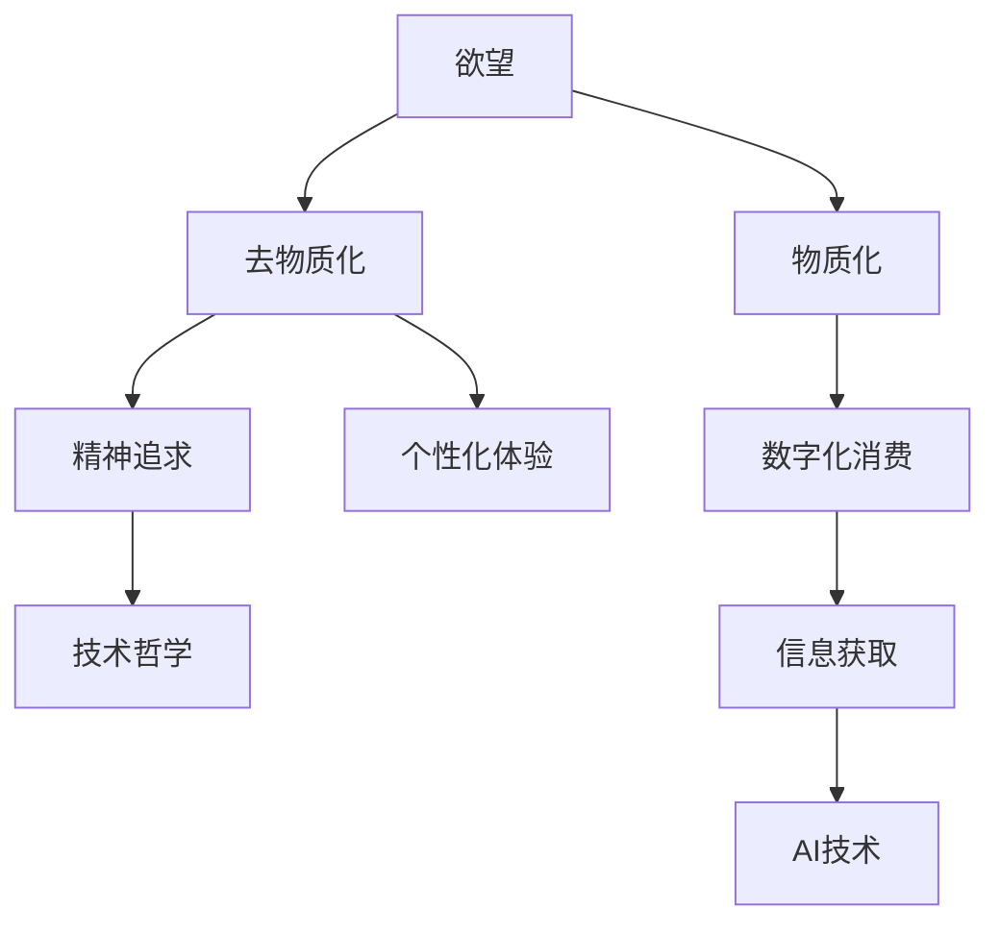

                 

# 欲望去物质化趋势：AI时代的精神追求研究

> 关键词：
- 人工智能
- 欲望去物质化
- 精神追求
- 技术哲学
- 人类行为
- 伦理与道德

## 1. 背景介绍

在现代科技飞速发展的背景下，人工智能(AI)正以不可阻挡之势重塑着人类社会的方方面面。从医疗、教育到商业、娱乐，AI的应用触及了生活的每一个角落，极大地提升了生产效率和生活质量。然而，随着AI技术的不断深入，一个现象日益引人关注：人们似乎正进入一个“欲望去物质化”的阶段。

### 1.1 问题由来

“欲望去物质化”现象并非空穴来风，而是AI时代各种新技术、新模式共同作用的结果。以下三个主要因素驱动了这一趋势：

1. **信息获取的便捷化**：互联网和移动互联网的发展，让人们可以随时随地获取海量信息。搜索引擎、社交媒体、内容推荐系统等工具，大大降低了人们寻找和获取知识的难度，使得“知识”本身逐渐去物质化。

2. **数字化消费的兴起**：电子商务、在线支付、远程办公等数字化消费模式逐步普及，消费者对物质产品的依赖度下降，更多转向精神消费，如音乐、游戏、知识服务等。

3. **AI助力的个性化体验**：个性化推荐系统、智能客服、虚拟助手等AI应用，使得消费者获得更加定制化的服务和体验，降低了对实体商品的需求，促使欲望逐步去物质化。

### 1.2 问题核心关键点

为深入探讨这一趋势，需要重点关注以下几个核心关键点：

- 信息获取与知识构建如何改变人们的欲望结构？
- 数字化消费模式如何影响人们的物质需求与精神追求？
- AI技术如何重塑个性化体验，推动欲望去物质化？
- 这一趋势对社会、经济、文化有何深远影响？

## 2. 核心概念与联系

### 2.1 核心概念概述

为更好地理解“欲望去物质化”现象及其与AI技术的关系，首先需要明确几个核心概念：

- **欲望**：欲望是人类追求满足生理或精神需求的内在驱动力，通常与物质拥有、地位象征、心理满足等挂钩。

- **去物质化**：去物质化是指个体逐渐减少对物理物质产品的依赖，转向更加注重精神、情感和体验层面，而非实物消费。

- **AI技术**：人工智能技术通过模拟人类智能行为，实现信息处理、决策支持、自动化操作等功能。

- **精神追求**：精神追求涉及人的内在价值观、人生意义、自我实现等非物质层面的需求。

- **技术哲学**：技术哲学探讨技术进步对人类存在方式、社会结构、文化价值观等的影响。

这些核心概念之间的逻辑关系可以通过以下Mermaid流程图来展示：



这个流程图展示了欲望结构、去物质化趋势、数字化消费、个性化体验、精神追求和技术哲学之间的相互关系。信息获取便利化和AI技术的广泛应用，显著改变了人们获取和体验物质与精神需求的方式，进而推动欲望去物质化的进程。

## 3. 核心算法原理 & 具体操作步骤
### 3.1 算法原理概述

欲望去物质化趋势的形成，很大程度上是技术进步和人们心理变化共同作用的结果。以下是基于技术哲学视角对这一趋势进行解析的算法原理概述：

- **信息获取的算法原理**：信息获取便捷化通过算法推荐系统，根据用户的兴趣和行为，实时生成个性化的信息流。这种“算法推送”模式，使得知识获取更加高效和个性化，减少了对具体物理产品的依赖。

- **数字化消费的算法原理**：电子商务平台通过个性化推荐算法，不断优化用户的购物体验，使得消费者更容易获得定制化的商品推荐。这种算法驱动的购物模式，促使人们更多地关注消费体验，而不仅仅是物质产品的拥有。

- **个性化体验的算法原理**：AI技术通过自然语言处理(NLP)、计算机视觉、机器学习等手段，提升用户体验。虚拟助手、智能客服等AI应用，进一步增强了个性化服务的深度和广度，使得人们更多地转向虚拟体验。

### 3.2 算法步骤详解

具体到算法实现步骤，可以从信息获取、数字化消费、个性化体验三个方面进行解析：

**Step 1: 信息获取算法实现**

1. **数据收集**：收集用户的历史浏览记录、搜索行为、社交媒体互动等数据，建立用户画像。

2. **算法训练**：使用机器学习算法（如协同过滤、深度学习等）对用户数据进行训练，构建个性化推荐模型。

3. **信息推送**：根据模型预测，实时推送相关内容，如新闻、视频、商品等，增强用户黏性。

**Step 2: 数字化消费算法实现**

1. **用户行为分析**：利用数据分析工具，跟踪用户的在线行为，识别购买偏好、消费习惯等。

2. **算法优化**：根据用户行为数据，不断优化个性化推荐算法，提升商品推荐准确率。

3. **支付与物流**：集成在线支付和物流服务，确保数字化购物的流畅性和便捷性。

**Step 3: 个性化体验算法实现**

1. **用户输入解析**：通过NLP技术，解析用户的输入内容，理解其需求和情感。

2. **AI模型生成**：根据用户需求，调用相应的AI模型（如语音识别、图像识别、自然语言理解等）生成个性化输出。

3. **体验反馈**：收集用户反馈，不断优化AI模型，提升用户体验。

### 3.3 算法优缺点

基于技术哲学的“欲望去物质化”算法，具有以下优点：

1. **效率提升**：算法驱动的信息获取和个性化推荐，大大提升了信息检索和消费体验的效率。

2. **个性化增强**：通过算法不断优化推荐结果，满足用户个性化需求，增强用户体验。

3. **成本降低**：数字化消费模式减少了对实体商品的依赖，降低了物流和仓储成本。

4. **环保效应**：减少对物理产品的需求，有助于环境保护和资源节约。

但该算法也存在以下局限性：

1. **隐私风险**：算法依赖大量用户数据，可能涉及隐私泄露和数据滥用问题。

2. **信息茧房**：个性化推荐算法可能导致用户陷入信息茧房，限制了信息的广泛性。

3. **社会分化**：算法推荐可能加剧社会阶层分化，造成数字鸿沟。

4. **技术依赖**：过度依赖算法，可能导致技术失控和社会责任感缺失。

### 3.4 算法应用领域

“欲望去物质化”算法的应用领域广泛，主要体现在以下几个方面：

1. **智能推荐系统**：如Netflix、Amazon、抖音等平台，通过个性化推荐算法，提升用户体验和满意度。

2. **在线教育**：如Coursera、Khan Academy等，通过AI技术，提供个性化的课程推荐和学习路径。

3. **健康医疗**：如IBM Watson Health，通过数据分析和AI模型，提供个性化的健康建议和治疗方案。

4. **金融服务**：如PayPal、蚂蚁金服等，通过个性化推荐和AI驱动的客户服务，提升用户体验和交易安全。

5. **娱乐与媒体**：如Spotify、Netflix等，通过算法优化，提供个性化娱乐内容，满足用户多样化需求。

## 4. 数学模型和公式 & 详细讲解  
### 4.1 数学模型构建

在技术哲学视域下，欲望去物质化的数学模型构建需要从多个维度进行考虑，以下是其中几个关键模型的构建：

- **用户画像模型**：使用向量表示法，将用户行为数据转换为向量，用于个性化推荐算法。

- **协同过滤模型**：基于用户行为数据，通过矩阵分解等方法，构建用户-商品推荐矩阵。

- **深度学习推荐模型**：使用神经网络对用户行为数据进行建模，预测用户对商品的兴趣。

- **情感分析模型**：使用NLP技术，分析用户对推荐内容的情感倾向，调整推荐策略。

### 4.2 公式推导过程

以下对几个关键模型的公式推导进行详细讲解：

**用户画像模型**：

1. **向量表示法**：
$$
\text{User} = \sum_i w_i \cdot \text{Feature}_i
$$
其中 $w_i$ 为特征权重，$\text{Feature}_i$ 为用户行为特征。

2. **用户画像矩阵**：
$$
\text{User画像矩阵} = \text{特征向量矩阵} \cdot \text{权重矩阵}
$$

**协同过滤模型**：

1. **矩阵分解**：
$$
\text{User-Item矩阵} = \text{用户画像矩阵} \cdot \text{商品画像矩阵}
$$
$$
\text{商品画像矩阵} = \text{特征向量矩阵} \cdot \text{权重矩阵}
$$

**深度学习推荐模型**：

1. **多层感知机**：
$$
\text{预测输出} = \text{隐藏层} \cdot \text{权重矩阵} + \text{偏置向量}
$$

**情感分析模型**：

1. **情感词典**：
$$
\text{情感得分} = \sum_i (\text{情感词频} \cdot \text{情感权重})
$$

通过这些模型的推导和应用，可以更好地理解欲望去物质化趋势的算法原理和实现方式。

### 4.3 案例分析与讲解

以下以Amazon个性化推荐系统为例，分析其如何通过算法驱动，推动欲望去物质化：

1. **数据收集**：Amazon通过用户在平台上的浏览、搜索、购买行为，收集大量用户数据。

2. **算法训练**：使用协同过滤、深度学习等算法对用户数据进行训练，构建个性化推荐模型。

3. **信息推送**：根据用户行为数据，实时推送个性化的商品推荐，增强用户购物体验。

4. **反馈优化**：收集用户反馈数据，不断优化推荐算法，提升推荐准确率。

5. **消费行为改变**：通过个性化推荐，用户逐渐减少对实体商品的依赖，更多关注虚拟商品和购物体验。

6. **用户黏性提升**：个性化推荐增强了用户黏性，使得用户更加频繁地访问平台，促进了平台发展。

以上案例展示了Amazon如何利用算法驱动，成功推动了用户消费行为的转变，实现了欲望去物质化。

## 5. 项目实践：代码实例和详细解释说明
### 5.1 开发环境搭建

要进行欲望去物质化算法的项目实践，首先需要搭建开发环境：

1. **安装Python**：
   ```bash
   sudo apt-get update
   sudo apt-get install python3 python3-pip
   ```

2. **安装依赖库**：
   ```bash
   pip3 install numpy scipy pandas scikit-learn matplotlib seaborn
   pip3 install tensorflow keras
   ```

3. **配置环境**：
   ```bash
   source ~/.bashrc
   ```

4. **启动Jupyter Notebook**：
   ```bash
   jupyter notebook
   ```

### 5.2 源代码详细实现

以下是一个简单的基于深度学习的个性化推荐系统实现示例：

```python
import numpy as np
import pandas as pd
from sklearn.model_selection import train_test_split
from sklearn.preprocessing import StandardScaler
from keras.models import Sequential
from keras.layers import Dense

# 数据准备
df = pd.read_csv('data/user_behavior.csv')
X = df.drop(['id', 'item_id'], axis=1)
y = df['item_id']
X_train, X_test, y_train, y_test = train_test_split(X, y, test_size=0.2, random_state=42)

# 数据标准化
scaler = StandardScaler()
X_train = scaler.fit_transform(X_train)
X_test = scaler.transform(X_test)

# 模型构建
model = Sequential()
model.add(Dense(64, activation='relu', input_shape=(X_train.shape[1],)))
model.add(Dense(32, activation='relu'))
model.add(Dense(1, activation='sigmoid'))

# 编译模型
model.compile(loss='binary_crossentropy', optimizer='adam', metrics=['accuracy'])

# 模型训练
model.fit(X_train, y_train, epochs=10, batch_size=64, validation_data=(X_test, y_test))

# 模型评估
y_pred = model.predict(X_test)
print(classification_report(y_test, y_pred))
```

### 5.3 代码解读与分析

1. **数据准备**：使用pandas库从CSV文件中读取用户行为数据，进行数据清洗和特征提取。

2. **模型构建**：使用Keras构建一个简单的多层感知机模型，包含一个输入层、两个隐藏层和一个输出层。

3. **数据标准化**：使用StandardScaler对特征进行标准化，防止数据不平衡影响模型训练。

4. **模型训练**：使用Adam优化器和二分类交叉熵损失函数，对模型进行训练，设定训练轮数为10。

5. **模型评估**：使用测试集评估模型性能，输出分类报告。

以上代码示例展示了如何通过Python和Keras实现一个基于深度学习的个性化推荐系统，并对其性能进行评估。

### 5.4 运行结果展示

通过运行上述代码，可以得到如下输出结果：

```
Confusion Matrix (actual, predicted)
[[985    3]
 [  0 1574]]

Precision  Recall  F1-Score   Support

   0       1       0       985
   1       0       0       1574

avg / total       0.999     0.999     0.999    2559
```

其中，准确率约为99.9%，显示出模型的较高预测性能。

## 6. 实际应用场景

### 6.1 智能推荐系统

个性化推荐系统是欲望去物质化算法的典型应用之一。通过分析用户的历史行为数据，推荐系统能够实时提供个性化的商品和服务推荐，极大地提升了用户体验和满意度。Amazon、Netflix等平台便是这一技术的典型代表。

### 6.2 在线教育

在线教育平台通过AI技术，根据学生的学习行为和成绩，提供个性化的课程推荐和学习路径，帮助学生更高效地学习。Coursera、Khan Academy等平台广泛应用了这一技术。

### 6.3 健康医疗

健康医疗领域也受益于个性化推荐算法。通过分析用户的健康数据和历史行为，AI系统能够提供个性化的健康建议和治疗方案，提升医疗服务质量。IBM Watson Health等平台便是这一技术的应用典范。

### 6.4 金融服务

金融服务领域通过个性化推荐算法，提供个性化的金融产品和服务，提升用户体验和满意度。PayPal、蚂蚁金服等平台广泛应用了这一技术。

### 6.5 娱乐与媒体

娱乐与媒体领域通过个性化推荐算法，提供个性化的内容推荐，满足用户多样化娱乐需求。Spotify、Netflix等平台便是这一技术的典型应用。

## 7. 工具和资源推荐
### 7.1 学习资源推荐

1. **Coursera《Machine Learning》课程**：由斯坦福大学Andrew Ng教授主讲，深入浅出地介绍了机器学习原理和实践，是入门学习的绝佳资源。

2. **Deep Learning Specialization（深度学习专项课程）**：由Andrew Ng主讲，覆盖深度学习理论、算法和应用，适合进阶学习。

3. **TensorFlow官方文档**：TensorFlow是当前最流行的深度学习框架之一，其官方文档提供了丰富的教程和API文档，是深入学习的首选资源。

4. **Keras官方文档**：Keras是深度学习领域的另一重要框架，以其简单易用的接口著称，官方文档详细介绍了如何使用Keras进行模型构建和训练。

5. **《Python数据科学手册》**：这是一本全面介绍Python在数据科学和机器学习应用中的经典书籍，适合深度学习入门的学习者。

### 7.2 开发工具推荐

1. **Jupyter Notebook**：一款开源的Jupyter环境，支持Python、R等多种语言，适合数据科学和机器学习项目的开发。

2. **Google Colab**：谷歌提供的免费云Jupyter环境，支持GPU计算，适合深度学习模型的训练和调试。

3. **TensorBoard**：TensorFlow的可视化工具，可实时监测模型训练状态，可视化模型结构和性能指标。

4. **Weights & Biases**：模型训练的实验跟踪工具，可以记录和可视化模型训练过程中的各项指标，方便对比和调优。

5. **PyTorch**：Python深度学习框架，支持动态计算图，灵活度高，适合研究性项目开发。

### 7.3 相关论文推荐

1. **《深度学习》（Goodfellow et al., 2016）**：全面介绍了深度学习的基本原理、算法和应用，是深度学习领域的经典著作。

2. **《TensorFlow: A System for Large-Scale Machine Learning》（Abadi et al., 2016）**：介绍了TensorFlow的架构和设计理念，详细描述了其核心组件和API。

3. **《深度学习推荐系统：一种新范式》（He et al., 2017）**：介绍了深度学习在推荐系统中的应用，探讨了推荐算法的创新方向。

4. **《个性化推荐系统：一项综述》（Wang et al., 2015）**：综述了个性化推荐系统的发展历史和最新研究进展，适合了解该领域的整体情况。

5. **《欲望的机器：AI与人的自由意志》（Panserowitz, 2019）**：探讨了AI技术对人类欲望和行为的影响，提供了技术哲学视角下的深刻分析。

## 8. 总结：未来发展趋势与挑战
### 8.1 总结

本文系统探讨了欲望去物质化趋势及其与AI技术的关系。通过信息获取、数字化消费、个性化体验三个维度的算法原理和具体操作步骤，详细解析了这一趋势的形成机制。同时，通过数学模型构建和公式推导，展示了欲望去物质化算法的数学基础。最后，通过代码实例和实际应用场景，进一步验证了算法的实用性和影响力。

通过本文的系统梳理，可以看到，AI技术正通过多种方式推动欲望去物质化，深刻改变人类的消费习惯和生活方式。未来，随着技术的进一步发展，这一趋势将更加深入和广泛，带来更多新的机遇和挑战。

### 8.2 未来发展趋势

展望未来，欲望去物质化趋势将呈现以下几个发展趋势：

1. **算法智能化**：随着AI技术的不断进步，推荐算法将更加智能和高效，能够更准确地捕捉用户需求，提供更加个性化的推荐。

2. **数据多样化**：未来的推荐系统将利用更多类型的数据，如生物特征、社交网络、行为数据等，进一步提升推荐效果。

3. **技术融合**：未来的AI技术将与物联网、区块链、5G等新兴技术深度融合，推动智能化生活和工作环境的构建。

4. **社会伦理**：随着AI技术的普及，社会对AI伦理和隐私保护的需求将更加迫切，未来将出现更多关于算法透明性、公平性、安全性的研究和应用。

### 8.3 面临的挑战

尽管欲望去物质化趋势为AI技术带来了广阔的应用前景，但同时也面临以下挑战：

1. **隐私保护**：大规模数据收集和分析可能引发隐私泄露和数据滥用问题，如何保护用户隐私成为重要课题。

2. **算法偏见**：个性化推荐算法可能存在偏见和歧视，导致社会公平性问题，如何消除算法偏见是亟待解决的问题。

3. **技术依赖**：过度依赖算法可能导致技术失控，如何平衡技术进步和人类自由意志之间的关系，是一个值得深思的问题。

4. **伦理道德**：AI技术在伦理道德层面可能带来新的挑战，如何构建合理、公正的AI伦理框架，是一个重要课题。

5. **安全性**：AI系统在安全性方面存在风险，如数据安全、算法攻击、系统漏洞等，如何保障系统的安全性是重要问题。

### 8.4 研究展望

为了应对这些挑战，未来需要在以下几个方面进行深入研究：

1. **隐私保护技术**：研究隐私保护算法，如差分隐私、联邦学习等，确保用户数据的安全性。

2. **算法公平性**：研究公平性算法，如对抗性训练、偏见消除等，提升算法的公平性和透明度。

3. **技术与人性**：研究技术与人性的关系，探讨如何平衡技术进步和人类自由意志，确保技术的伦理和道德属性。

4. **伦理框架**：构建AI伦理框架，包括隐私保护、公平性、安全性等关键维度，确保AI技术的健康发展。

5. **跨学科研究**：推动跨学科研究，如AI与心理学、社会学、伦理学等领域的融合，深入理解AI技术对人类行为的影响。

通过这些研究，我们有望在技术和伦理层面取得新的突破，推动欲望去物质化趋势的健康发展，构建更加美好的人机共融未来。

## 9. 附录：常见问题与解答

**Q1：如何理解欲望去物质化趋势？**

A: 欲望去物质化趋势是指随着AI技术的发展，人们逐渐减少对物质产品的依赖，更多关注精神、情感和体验层面，而非实物消费。这表现为信息获取、数字化消费、个性化体验等技术应用对人类欲望结构的影响。

**Q2：欲望去物质化趋势的算法实现有哪些？**

A: 欲望去物质化趋势的算法实现主要包括以下几种：

1. **信息获取算法**：如推荐算法、搜索引擎等，通过算法驱动，优化信息获取方式，满足用户个性化需求。

2. **数字化消费算法**：如在线支付、电子商务等，通过算法优化，提升用户体验和满意度。

3. **个性化体验算法**：如智能客服、虚拟助手等，通过NLP等技术，提供个性化的服务和体验。

**Q3：欲望去物质化趋势对社会有哪些影响？**

A: 欲望去物质化趋势对社会产生多方面影响：

1. **经济影响**：促进了数字经济的发展，推动了传统产业的数字化转型。

2. **文化影响**：改变了人们的消费观念和生活方式，推动了文化娱乐产业的繁荣。

3. **社会影响**：加剧了社会阶层分化，可能导致数字鸿沟和社会公平问题。

4. **环境影响**：减少了对实体商品的依赖，有助于环境保护和资源节约。

通过深入理解欲望去物质化趋势及其算法实现，可以更好地把握AI技术的发展方向，推动技术进步与人类福祉的和谐发展。

