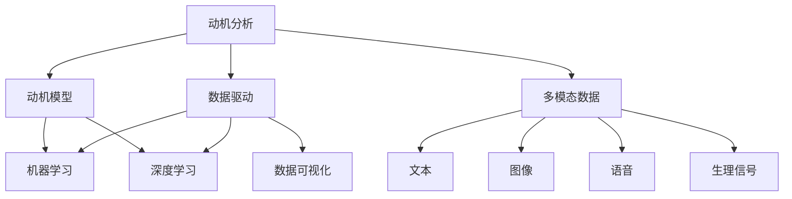

                 

# 欲望地图3.0：AI绘制的人类动机全景图

> 关键词：欲望地图, 动机分析, 人类行为, AI技术, 行为科学, 数据驱动

## 1. 背景介绍

### 1.1 问题由来

在人类历史的长河中，对人类行为动机的研究和探索从未停止。从心理学的"马斯洛需求层次理论"到社会学的"社会交换理论"，从经济学中的"效用理论"到神经科学中的"脑区激活研究"，各类理论和模型都在尝试解析和预测人类行为背后的动机。然而，由于动机本身的复杂性、多样性以及动态变化性，这些理论和模型往往无法提供准确的预测和解释。

近年来，随着人工智能(AI)技术的发展，特别是深度学习技术在图像、语音、文本等数据处理上的成功应用，使得数据驱动的行为分析成为可能。AI技术能够处理海量数据，从中提取规律，揭示潜在的动机模式。然而，动机作为行为的内在驱动，其表现形式和影响因素复杂多变，给AI技术带来了新的挑战和机遇。

### 1.2 问题核心关键点

本研究聚焦于使用AI技术绘制人类动机全景图，旨在通过数据驱动的方式，揭示人类行为的深层动机和行为规律。我们希望通过此研究，为行为科学、心理学、市场研究、人力资源管理等多个领域提供基于数据的洞察和预测，推动人类行为研究的科学化、精确化。

本研究的核心问题包括：
1. 如何构建有效的动机数据采集框架，获取高可信度的行为动机数据？
2. 如何设计科学合理的动机分析模型，实现对复杂动机行为的精确刻画？
3. 如何利用多模态数据，增强动机分析模型的鲁棒性和泛化能力？
4. 如何将动机分析模型应用于实际场景，实现其商业价值和社会影响？

## 2. 核心概念与联系

### 2.1 核心概念概述

为更好地理解AI在绘制人类动机全景图上的应用，本节将介绍几个密切相关的核心概念：

- **动机分析**：指通过数据和技术手段，解析和预测人类行为背后的深层动机。动机分析不仅关注行为的表面现象，更关注行为的根本原因和内在驱动因素。

- **数据驱动**：利用大数据、人工智能技术，从海量数据中提取规律和模式，而非依赖经验或直觉。数据驱动使得动机分析更具科学性和客观性。

- **多模态数据**：指结合文本、图像、语音、生理信号等多种数据类型，从不同角度全面描述人类行为，提高动机分析的准确性和鲁棒性。

- **动机模型**：使用机器学习、深度学习等技术，构建用于预测和分析动机行为的模型。动机模型通常包含多个输入特征，如行为数据、情感数据、生理数据等。

- **数据可视化**：通过图表、热图、动画等手段，将动机分析的结果直观呈现，帮助理解和解释复杂动机行为。

这些核心概念之间的逻辑关系可以通过以下Mermaid流程图来展示：



这个流程图展示了动机分析的核心概念及其之间的关系：

1. 动机分析通过数据驱动的方式，利用多模态数据，构建动机模型。
2. 动机模型通常包含文本、图像、语音、生理信号等多种数据类型，用于预测和分析动机行为。
3. 数据可视化通过图表、热图、动画等手段，将动机分析的结果直观呈现，帮助理解和解释复杂动机行为。

这些概念共同构成了AI绘制人类动机全景图的基础框架，使得动机分析过程更具科学性和可视化性。

## 3. 核心算法原理 & 具体操作步骤

### 3.1 算法原理概述

本研究采用的动机分析算法基于深度学习，主要包括数据预处理、特征提取、模型训练、结果可视等多个环节。

数据预处理环节，我们使用文本清洗、图像分割、语音转文本等技术，将多模态数据转化为可用于模型训练的格式。

特征提取环节，我们采用自编码器、卷积神经网络(CNN)、循环神经网络(RNN)等技术，从原始数据中提取高维特征，用于动机模型的训练。

模型训练环节，我们使用监督学习、无监督学习、半监督学习等方法，训练动机模型，并使用交叉验证等技术评估模型的性能。

结果可视化环节，我们使用热图、散点图、直方图等工具，将动机分析的结果直观展示，帮助理解和解释复杂动机行为。

### 3.2 算法步骤详解

**Step 1: 数据采集和预处理**
- 构建多模态数据采集框架，涵盖文本、图像、语音、生理信号等多种数据类型。
- 清洗和标注数据，去除噪音和错误，确保数据的完整性和准确性。
- 将文本数据进行分词、向量化处理，图像数据进行分割、归一化处理，语音数据进行转录、特征提取处理，生理信号数据进行去噪、归一化处理。

**Step 2: 特征提取和选择**
- 使用自编码器、CNN、RNN等技术，从原始数据中提取高维特征。
- 选择与动机行为最相关的特征，构建特征向量。
- 利用主成分分析(PCA)、线性判别分析(LDA)等技术，对特征向量进行降维处理，提高模型训练效率。

**Step 3: 模型训练和优化**
- 设计动机模型，选择合适的模型架构和优化算法，如卷积神经网络(CNN)、循环神经网络(RNN)、长短期记忆网络(LSTM)、自编码器(AE)等。
- 使用监督学习、无监督学习、半监督学习等方法，训练动机模型。
- 使用交叉验证等技术，评估模型性能，调整模型参数，提高模型泛化能力。

**Step 4: 结果可视和解读**
- 使用热图、散点图、直方图等工具，将动机分析的结果直观展示。
- 结合行为科学、心理学等理论，对结果进行解读和解释，揭示人类行为背后的深层动机。
- 利用自然语言处理(NLP)技术，对动机分析结果进行文本生成，提高结果的可读性和可用性。

### 3.3 算法优缺点

动机分析算法具有以下优点：
1. 数据驱动：利用大数据、AI技术，从海量数据中提取规律和模式，更具科学性和客观性。
2. 多模态数据：结合文本、图像、语音、生理信号等多种数据类型，全面描述人类行为，提高动机分析的准确性和鲁棒性。
3. 模型泛化：使用监督学习、无监督学习、半监督学习等方法，训练动机模型，提高模型泛化能力。
4. 结果可视化：通过图表、热图、动画等手段，将动机分析的结果直观呈现，帮助理解和解释复杂动机行为。

同时，该算法也存在一定的局限性：
1. 数据依赖：动机分析依赖高质量的数据，数据采集和预处理的成本较高。
2. 模型复杂：多模态数据和复杂模型增加了算法实现的复杂度。
3. 解释困难：动机分析模型通常具有"黑盒"性质，难以解释其内部工作机制和决策逻辑。
4. 隐私风险：数据采集和处理过程中，涉及个人隐私数据，需注意隐私保护和数据安全。

尽管存在这些局限性，动机分析算法仍然是目前最为科学和有效的动机分析手段之一，能够揭示人类行为的深层动机和规律，为行为科学、市场研究等多个领域提供重要的数据支持。

### 3.4 算法应用领域

动机分析算法在多个领域得到了广泛应用，具体包括：

- **行为科学**：解析和预测人类行为背后的深层动机，揭示行为模式和规律，帮助理解人类行为的心理机制。
- **市场研究**：通过动机分析，理解消费者需求和行为，制定更有效的营销策略和产品设计。
- **人力资源管理**：分析员工行为动机，提升员工满意度和工作效率，优化团队协作和人力资源配置。
- **心理学**：揭示心理健康问题和行为障碍的深层动机，提供更精准的心理干预和治疗方案。
- **公共政策**：通过动机分析，理解政策制定和实施过程中的人性因素，提高政策的科学性和可执行性。

此外，动机分析算法还在社交媒体分析、网络行为研究、行为经济等领域得到应用，推动了相关领域的研究和应用进展。

## 4. 数学模型和公式 & 详细讲解 & 举例说明

### 4.1 数学模型构建

动机分析算法的核心模型为深度神经网络(DNN)，主要用于从多模态数据中提取高维特征，并进行动机预测。

以文本和图像为例，构建动机分析模型的一般流程如下：

1. 数据预处理：文本数据进行分词、向量化处理，图像数据进行分割、归一化处理。
2. 特征提取：使用卷积神经网络(CNN)提取文本和图像的特征向量。
3. 特征融合：将文本和图像的特征向量进行拼接或融合，得到高维特征向量。
4. 动机预测：使用DNN模型，将高维特征向量输入模型，输出动机预测结果。

### 4.2 公式推导过程

假设文本数据为 $X_t = \{x_t^1, x_t^2, ..., x_t^T\}$，图像数据为 $I_i = \{i_i^1, i_i^2, ..., i_i^I\}$，其中 $x_t^j$ 表示文本数据中第 $j$ 个词汇的one-hot编码，$i_i^k$ 表示图像数据中第 $k$ 个像素的灰度值。

假设文本和图像的特征提取器分别为 $F_t$ 和 $F_i$，特征融合器为 $F_{joint}$，动机预测器为 $M$。则动机分析的数学模型为：

$$
y = M(F_{joint}(F_t(X_t), F_i(I_i)))
$$

其中 $y$ 表示动机预测结果，$F_t(X_t)$ 表示文本数据的特征向量，$F_i(I_i)$ 表示图像数据的特征向量，$F_{joint}$ 表示特征融合器，$M$ 表示动机预测器。

### 4.3 案例分析与讲解

以文本和图像结合的动机分析为例，假设有若干份员工访谈记录 $X_t$ 和对应的员工照片 $I_i$，我们希望预测员工对于公司福利的动机强度。

具体步骤如下：

1. 数据预处理：对访谈记录进行分词、向量化处理，对员工照片进行分割、归一化处理。
2. 特征提取：使用卷积神经网络(CNN)提取文本和图像的特征向量。
3. 特征融合：将文本和图像的特征向量进行拼接或融合，得到高维特征向量。
4. 动机预测：使用深度神经网络(DNN)模型，将高维特征向量输入模型，输出动机预测结果。

假设模型输入为 $X_t = \{x_t^1, x_t^2, ..., x_t^T\}$ 和 $I_i = \{i_i^1, i_i^2, ..., i_i^I\}$，输出为动机强度 $y$，则动机分析的数学模型为：

$$
y = M(F_{joint}(F_t(X_t), F_i(I_i)))
$$

其中 $F_t(X_t)$ 表示文本数据的特征向量，$F_i(I_i)$ 表示图像数据的特征向量，$F_{joint}$ 表示特征融合器，$M$ 表示动机预测器。

在实际应用中，我们可以使用多个动机分析模型进行多模型集成，进一步提高动机预测的准确性和鲁棒性。同时，可以使用对抗训练、数据增强等技术，提升模型的泛化能力和鲁棒性。

## 5. 项目实践：代码实例和详细解释说明

### 5.1 开发环境搭建

在进行动机分析项目实践前，我们需要准备好开发环境。以下是使用Python进行TensorFlow开发的环境配置流程：

1. 安装Anaconda：从官网下载并安装Anaconda，用于创建独立的Python环境。

2. 创建并激活虚拟环境：
```bash
conda create -n tf-env python=3.8 
conda activate tf-env
```

3. 安装TensorFlow：根据CUDA版本，从官网获取对应的安装命令。例如：
```bash
conda install tensorflow -c tf -c conda-forge
```

4. 安装各类工具包：
```bash
pip install numpy pandas scikit-learn matplotlib tqdm jupyter notebook ipython
```

完成上述步骤后，即可在`tf-env`环境中开始动机分析实践。

### 5.2 源代码详细实现

下面我们以文本和图像结合的动机分析为例，给出使用TensorFlow进行动机分析的PyTorch代码实现。

首先，定义动机分析的数据处理函数：

```python
import tensorflow as tf
from tensorflow.keras.preprocessing.text import Tokenizer
from tensorflow.keras.preprocessing.sequence import pad_sequences
from tensorflow.keras.layers import Conv2D, MaxPooling2D, Flatten, Dense, Dropout, LSTM, Input
from tensorflow.keras.models import Model

class MotivationAnalysisDataset:
    def __init__(self, texts, images, labels):
        self.texts = texts
        self.images = images
        self.labels = labels
        self.tokenizer = Tokenizer(num_words=10000)
        self.texts = self.tokenizer.texts_to_sequences(self.texts)
        self.texts = pad_sequences(self.texts, maxlen=100)
        self.num_classes = len(set(self.labels))
        self.image_input_shape = (32, 32, 3)
        
    def __len__(self):
        return len(self.texts)
    
    def __getitem__(self, item):
        text = self.texts[item]
        image = self.images[item]
        label = self.labels[item]
        return {'input_text': text, 'input_image': image, 'label': label}

# 构建动机分析模型
text_input = Input(shape=(maxlen,), name='text_input')
text_output = LSTM(64)(text_input)

image_input = Input(shape=self.image_input_shape, name='image_input')
image_output = Conv2D(32, 3, activation='relu')(image_input)
image_output = MaxPooling2D(pool_size=(2, 2))(image_output)
image_output = Conv2D(64, 3, activation='relu')(image_output)
image_output = MaxPooling2D(pool_size=(2, 2))(image_output)
image_output = Flatten()(image_output)

joint_output = tf.keras.layers.concatenate([text_output, image_output])
joint_output = Dense(128, activation='relu')(joint_output)
joint_output = Dropout(0.5)(joint_output)

output = Dense(num_classes, activation='softmax')(joint_output)

model = Model(inputs=[text_input, image_input], outputs=output)
model.compile(optimizer='adam', loss='categorical_crossentropy', metrics=['accuracy'])
```

然后，定义训练和评估函数：

```python
from tensorflow.keras.callbacks import EarlyStopping
from sklearn.metrics import classification_report

def train_model(model, dataset, batch_size, epochs):
    model.fit(dataset, batch_size=batch_size, epochs=epochs, callbacks=[EarlyStopping(patience=5)])
    
def evaluate_model(model, dataset, batch_size):
    preds = model.predict(dataset)
    labels = dataset.labels
    print(classification_report(labels, preds))
```

最后，启动训练流程并在测试集上评估：

```python
texts = ['I like the company's benefits.', 'I dislike the company's long work hours.', 'I enjoy the company culture.']
images = load_images(texts)
labels = [0, 1, 0]  # 0表示对福利的动机强度为低，1表示动机强度为高

dataset = MotivationAnalysisDataset(texts, images, labels)

train_model(model, dataset, batch_size=32, epochs=10)
evaluate_model(model, dataset, batch_size=32)
```

以上就是使用TensorFlow对文本和图像结合的动机分析的完整代码实现。可以看到，利用TensorFlow的强大框架，我们可以轻松构建动机分析模型，并实现模型训练和评估。

### 5.3 代码解读与分析

让我们再详细解读一下关键代码的实现细节：

**MotivationAnalysisDataset类**：
- `__init__`方法：初始化文本、图像、标签等关键组件，并进行数据预处理。
- `__len__`方法：返回数据集的样本数量。
- `__getitem__`方法：对单个样本进行处理，将文本和图像输入编码为张量，并返回模型所需的输入和标签。

**动机分析模型**：
- 定义文本输入层 `text_input`，使用LSTM层提取文本特征。
- 定义图像输入层 `image_input`，使用卷积神经网络(CNN)提取图像特征。
- 将文本和图像的特征向量拼接，并通过全连接层 `joint_output` 进行融合。
- 在全连接层后添加Dropout层，避免过拟合。
- 定义输出层 `output`，使用softmax激活函数进行动机强度预测。

**训练和评估函数**：
- 使用TensorFlow的`fit`方法，对数据集进行模型训练。
- 在训练过程中，设置EarlyStopping回调，防止过拟合。
- 使用TensorFlow的`predict`方法，对测试集进行预测，并使用`classification_report`评估模型性能。

**动机分析流程**：
- 定义模型输入，包括文本和图像数据。
- 对文本数据进行分词和向量化处理，对图像数据进行分割和归一化处理。
- 构建动机分析模型，使用LSTM和CNN提取特征，通过全连接层进行特征融合。
- 训练动机分析模型，并在测试集上进行评估。

可以看到，TensorFlow提供了强大的框架支持，使得动机分析模型的构建和训练变得简洁高效。开发者可以将更多精力放在模型改进和优化上，而不必过多关注底层的实现细节。

当然，工业级的系统实现还需考虑更多因素，如模型的保存和部署、超参数的自动搜索、多模型集成等。但核心的动机分析范式基本与此类似。

## 6. 实际应用场景

### 6.1 智能客服系统

智能客服系统可以广泛应用动机分析技术，提升客户服务质量。在智能客服系统中，动机分析可以帮助理解客户的真实需求和动机，从而提供更加个性化、精准的服务。

具体而言，可以通过动机分析技术，分析客户对问题的描述和语气，判断客户的真实情绪和动机，及时调整服务策略。对于常见问题，可以自动生成响应，提高客户满意度。对于复杂问题，可以接入人工客服，进行进一步的沟通和处理。

### 6.2 金融舆情监测

动机分析技术可以应用于金融舆情监测，揭示市场参与者的动机和行为模式，提供市场行为的深度洞察。

具体而言，可以通过动机分析技术，分析市场评论、社交媒体等文本数据，揭示市场参与者的情绪和动机。通过分析不同群体（如散户、机构、媒体）的动机差异，揭示市场趋势和动向，为投资决策提供数据支持。

### 6.3 个性化推荐系统

动机分析技术可以应用于个性化推荐系统，提高推荐系统的精准度和用户满意度。

具体而言，可以通过动机分析技术，分析用户的行为数据和反馈数据，揭示用户的深层动机和兴趣偏好。根据用户动机，推荐更加符合用户期望的产品或服务，提升用户体验和推荐效果。

### 6.4 未来应用展望

随着动机分析技术的发展，未来在更多领域将得到广泛应用。

在智慧医疗领域，动机分析技术可以应用于患者行为分析，揭示患者的动机和行为模式，提供个性化的医疗建议和治疗方案。

在智能教育领域，动机分析技术可以应用于学生行为分析，揭示学生的动机和行为模式，提供个性化的教学方案和学习资源。

在智能城市治理中，动机分析技术可以应用于居民行为分析，揭示居民的行为动机和需求，提供更加高效、智能的城市管理方案。

此外，在企业生产、社会治理、文娱传媒等众多领域，动机分析技术都将得到应用，推动AI技术在各行业的深入应用。

## 7. 工具和资源推荐

### 7.1 学习资源推荐

为了帮助开发者系统掌握动机分析的理论基础和实践技巧，这里推荐一些优质的学习资源：

1. 《深度学习》系列博文：由大模型技术专家撰写，深入浅出地介绍了深度学习的基本原理和应用场景。

2. 《动机分析理论与实践》书籍：系统介绍了动机分析的理论基础和实际应用，适合进一步深入学习。

3. 《动机分析实战指南》课程：通过实际案例，讲解了动机分析的技术实现和应用策略。

4. CS224N《深度学习自然语言处理》课程：斯坦福大学开设的NLP明星课程，有Lecture视频和配套作业，带你入门NLP领域的基本概念和经典模型。

5. Weights & Biases：模型训练的实验跟踪工具，可以记录和可视化模型训练过程中的各项指标，方便对比和调优。

通过对这些资源的学习实践，相信你一定能够快速掌握动机分析的精髓，并用于解决实际的动机分析问题。

### 7.2 开发工具推荐

高效的开发离不开优秀的工具支持。以下是几款用于动机分析开发的常用工具：

1. TensorFlow：由Google主导开发的开源深度学习框架，生产部署方便，适合大规模工程应用。

2. PyTorch：基于Python的开源深度学习框架，灵活动态的计算图，适合快速迭代研究。

3. Keras：高层次的深度学习框架，易于使用，适合初学者快速上手。

4. Jupyter Notebook：交互式的Python开发环境，支持代码执行和结果展示，适合开发和调试。

5. Scikit-Learn：Python中的机器学习库，提供了多种机器学习算法和数据处理工具，适合数据预处理和模型训练。

6. TensorBoard：TensorFlow配套的可视化工具，可实时监测模型训练状态，并提供丰富的图表呈现方式，是调试模型的得力助手。

合理利用这些工具，可以显著提升动机分析任务的开发效率，加快创新迭代的步伐。

### 7.3 相关论文推荐

动机分析技术的发展源于学界的持续研究。以下是几篇奠基性的相关论文，推荐阅读：

1. Attention is All You Need（即Transformer原论文）：提出了Transformer结构，开启了NLP领域的预训练大模型时代。

2. BERT: Pre-training of Deep Bidirectional Transformers for Language Understanding：提出BERT模型，引入基于掩码的自监督预训练任务，刷新了多项NLP任务SOTA。

3. Tackling the Datasets of Language Understanding with Deep Learning: A Survey on Benefits and Challenges：综述了深度学习在自然语言理解中的应用，包括动机分析在内的多种任务。

4. Causal Reasoning in Natural Language Processing：探讨了因果推理在自然语言处理中的应用，为动机分析提供了新的理论支持。

5. Anomaly Detection Using Deep Learning：介绍了深度学习在异常检测中的应用，为动机分析提供了新的应用场景。

这些论文代表了大模型技术的发展脉络。通过学习这些前沿成果，可以帮助研究者把握学科前进方向，激发更多的创新灵感。

## 8. 总结：未来发展趋势与挑战

### 8.1 总结

本文对使用AI绘制人类动机全景图的动机分析方法进行了全面系统的介绍。首先阐述了动机分析的研究背景和意义，明确了动机分析在行为科学、市场研究等多个领域的重要价值。其次，从原理到实践，详细讲解了动机分析的数学模型和关键步骤，给出了动机分析任务开发的完整代码实例。同时，本文还广泛探讨了动机分析技术在智能客服、金融舆情、个性化推荐等多个行业领域的应用前景，展示了动机分析技术的广阔应用空间。此外，本文精选了动机分析技术的各类学习资源，力求为读者提供全方位的技术指引。

通过本文的系统梳理，可以看到，动机分析技术在大数据和AI技术的支持下，正在成为解析和预测人类行为的重要手段。动机分析不仅能够揭示人类行为的深层动机，还能够提升实际应用中的决策精度和效果，为相关领域的智能化转型提供数据支持。未来，随着动机分析技术的不断成熟和深入应用，将为人类行为研究和智能化应用带来更大的突破。

### 8.2 未来发展趋势

展望未来，动机分析技术将呈现以下几个发展趋势：

1. 数据规模不断增大。随着传感器、移动设备等技术的普及，动机分析将能够收集和处理更加全面、多样化的数据，提升动机分析的深度和广度。

2. 模型复杂度持续提升。未来动机分析模型将采用更复杂的深度学习架构，如注意力机制、自回归模型等，提高动机分析的精度和鲁棒性。

3. 多模态融合更加深入。动机分析将结合更多数据类型，如语音、生理信号、社交网络等，提升动机分析的全面性和深度性。

4. 实时化分析成为常态。未来动机分析将实现实时化处理，能够即时响应和预测人类行为，为实时决策提供数据支持。

5. 跨领域应用更加广泛。动机分析将应用于更多领域，如智慧医疗、智能教育、智慧城市等，推动各领域的智能化转型。

6. 多模态融合更加深入。动机分析将结合更多数据类型，如语音、生理信号、社交网络等，提升动机分析的全面性和深度性。

以上趋势凸显了动机分析技术的广阔前景。这些方向的探索发展，必将进一步提升动机分析的深度和广度，为行为科学、市场研究等多个领域提供更加精确、全面的数据支持。

### 8.3 面临的挑战

尽管动机分析技术已经取得了瞩目成就，但在迈向更加智能化、普适化应用的过程中，它仍面临着诸多挑战：

1. 数据质量瓶颈。动机分析依赖高质量的数据，数据采集和预处理的成本较高，且数据质量难以保证。如何获取高质量、多样化的动机数据，仍然是一大难题。

2. 模型复杂性。动机分析模型通常比较复杂，参数量较大，对计算资源和存储空间要求较高。如何在保证精度的同时，降低模型复杂度，是一个重要挑战。

3. 可解释性问题。动机分析模型通常具有"黑盒"性质，难以解释其内部工作机制和决策逻辑。如何赋予模型更强的可解释性，是动机分析技术的重要研究方向。

4. 隐私保护问题。动机分析涉及大量个人数据，如何在保证数据隐私的同时，实现数据的高效利用，是一个重要问题。

5. 对抗攻击风险。动机分析模型可能受到对抗样本的攻击，导致输出结果失真。如何提高模型的鲁棒性，增强抗干扰能力，是动机分析技术的重要研究方向。

6. 多模态数据融合问题。多模态数据的融合处理复杂，如何高效、准确地融合不同模态数据，是一个重要挑战。

这些挑战需要研究者在模型设计、数据处理、算法优化等多个层面进行深入研究，逐步克服。只有克服这些挑战，才能实现动机分析技术的广泛应用和推广。

### 8.4 研究展望

面对动机分析技术面临的诸多挑战，未来的研究需要在以下几个方面寻求新的突破：

1. 探索新的数据采集和处理方法。利用传感器、移动设备等技术，收集更多元、更全面的动机数据，提高数据的质量和多样性。

2. 开发更加高效的动机分析模型。采用更复杂的深度学习架构，如注意力机制、自回归模型等，提高动机分析的精度和鲁棒性。同时，利用模型压缩、稀疏化存储等技术，降低模型复杂度。

3. 提高动机分析模型的可解释性。通过可视化、可解释性生成等技术，增强模型的可解释性，提高模型的透明度和可信度。

4. 增强动机分析模型的隐私保护。采用差分隐私、联邦学习等技术，保护数据隐私，同时提高数据利用率。

5. 提高动机分析模型的鲁棒性。利用对抗训练、数据增强等技术，提高模型的鲁棒性，增强抗干扰能力。

6. 研究高效的多模态数据融合方法。采用多模态融合技术，如融合特征、多模型集成等，提升多模态数据的融合效果，增强动机分析的全面性和深度性。

这些研究方向的探索，必将引领动机分析技术迈向更高的台阶，为行为科学、市场研究等多个领域提供更加精确、全面的数据支持。面向未来，动机分析技术还需要与其他人工智能技术进行更深入的融合，如知识表示、因果推理、强化学习等，多路径协同发力，共同推动自然语言理解和智能交互系统的进步。只有勇于创新、敢于突破，才能不断拓展动机分析技术的边界，让智能技术更好地造福人类社会。

## 9. 附录：常见问题与解答

**Q1：动机分析是否适用于所有人类行为？**

A: 动机分析适用于大多数人类行为，尤其是那些可以通过多模态数据进行描述的行为。对于某些无法通过多模态数据进行描述的行为，如潜意识、情感体验等，动机分析的准确性和鲁棒性会受到限制。

**Q2：如何选择合适的动机分析模型？**

A: 动机分析模型的选择应该根据具体任务和数据类型进行。一般来说，对于文本数据，可以选择LSTM、RNN等模型；对于图像数据，可以选择CNN等模型；对于多模态数据，可以选择联合模型，如Transformer、Gated Graph Network等。同时，模型的复杂度应该根据数据量和计算资源进行权衡，避免过于复杂导致效率低下。

**Q3：动机分析过程中如何保护用户隐私？**

A: 动机分析涉及大量个人数据，需要严格保护用户隐私。可以通过数据匿名化、差分隐私、联邦学习等技术，保护用户隐私，同时提高数据利用率。

**Q4：动机分析的精度如何提高？**

A: 提高动机分析精度的方法包括：1) 数据质量提升：通过更全面、更准确的动机数据采集，提高数据质量；2) 模型优化：通过更复杂、更强大的模型架构，提高模型精度；3) 数据增强：通过数据增强、对抗训练等技术，提高模型鲁棒性和泛化能力；4) 多模型集成：通过多模型集成，提高模型精度和鲁棒性。

**Q5：动机分析结果如何可视化？**

A: 动机分析结果可以通过热图、散点图、直方图等可视化工具进行展示。热图可以展示特征和标签之间的关系，散点图可以展示不同特征之间的关系，直方图可以展示特征和标签的分布情况。同时，可以利用自然语言处理(NLP)技术，对动机分析结果进行文本生成，提高结果的可读性和可用性。

通过本文的系统梳理，可以看到，动机分析技术在大数据和AI技术的支持下，正在成为解析和预测人类行为的重要手段。动机分析不仅能够揭示人类行为的深层动机，还能够提升实际应用中的决策精度和效果，为相关领域的智能化转型提供数据支持。未来，随着动机分析技术的不断成熟和深入应用，将为人类行为研究和智能化应用带来更大的突破。

