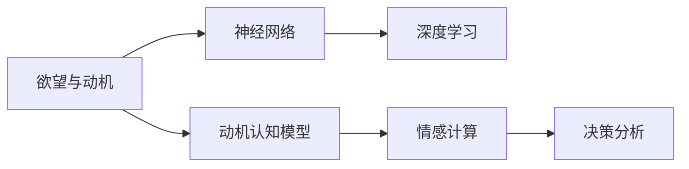

                 

# 欲望地图绘制师：AI解析的人类动机蓝图

> 关键词：人工智能, 动机分析, 欲望模型, 神经网络, 深度学习, 情感计算, 决策分析

## 1. 背景介绍

### 1.1 问题由来

在现代社会，随着人工智能(AI)技术的迅速发展，人们越来越关注AI如何理解并模拟人类的认知和情感，以及如何应用于动机分析。人类行为背后往往蕴含着复杂的欲望和动机，这些欲望驱动着人们在各种情境下的选择和行动。AI如何解析这些隐含的动机，成为当前认知科学和计算心理学的前沿问题。

### 1.2 问题核心关键点

人类动机的解析通常涉及以下几个关键点：
- **欲望与动机的定义**：明确人类欲望和动机的基本概念及其影响机制。
- **动机认知模型**：建立理论模型来模拟和解释人类动机的形成与行为选择。
- **情感与动机的关联**：探讨情感状态对动机形成和行为反应的影响。
- **动机驱动的行为分析**：研究动机如何驱动人类行为，以及如何在不同情境下的表现。

本文将重点介绍AI如何通过深度学习等技术手段，构建和应用动机认知模型，解析人类欲望与动机的复杂蓝图，为动机分析提供科学依据和技术支持。

### 1.3 问题研究意义

解析人类动机是认知科学和心理学的重要研究方向，有助于理解人类行为背后的深层机制，辅助决策制定和心理干预。AI解析动机的技术突破，将使得动机分析更加系统化、科学化，为行为经济学、智能推荐、用户体验优化等领域带来深刻影响：

1. **行为预测与决策支持**：帮助理解人类行为背后的动机，提升决策的科学性和准确性。
2. **个性化推荐系统**：基于动机模型提供个性化的内容推荐，提升用户体验。
3. **心理干预与支持**：通过解析动机，识别心理问题，为心理干预提供数据支撑。
4. **产品设计与用户体验**：指导产品设计和用户交互，优化用户体验。

## 2. 核心概念与联系

### 2.1 核心概念概述

为更好地理解AI解析人类动机的方法，本节将介绍几个关键概念：

- **欲望与动机**：欲望是内在需求的表达，动机是基于欲望驱动的行为倾向。
- **动机认知模型**：理论模型用于模拟动机形成和行为选择过程。
- **神经网络**：用于深度学习和建立复杂动机认知模型。
- **深度学习**：特别是卷积神经网络(CNN)和循环神经网络(RNN)，用于从大规模数据中提取高层次特征。
- **情感计算**：利用AI技术解析情感状态，分析情感对动机形成的影响。
- **决策分析**：基于动机和情感的深度学习模型，进行行为选择的预测和决策支持。

这些概念之间的联系通过以下Mermaid流程图展示：



这个流程图展示了欲望与动机通过动机认知模型进行模拟，再通过神经网络和深度学习技术提取特征，并结合情感计算进行综合分析，最终支持决策分析的全过程。

## 3. 核心算法原理 & 具体操作步骤
### 3.1 算法原理概述

AI解析人类动机的核心原理基于神经网络和深度学习，通过构建动机认知模型，模拟欲望与动机的形成和行为选择。以下详细介绍算法的核心步骤：

1. **数据收集与预处理**：收集大规模的人类行为数据，包括行为事件、情感状态等，进行数据清洗和标准化处理。
2. **特征提取**：利用神经网络和深度学习模型，从原始数据中提取高层次的特征，包括欲望强度、动机类型等。
3. **动机模型建立**：基于提取的特征，建立动机认知模型，描述欲望与动机的形成和行为选择过程。
4. **情感分析**：结合情感计算技术，解析情感状态对动机形成和行为选择的影响。
5. **决策预测**：通过训练好的动机模型和情感分析结果，进行行为选择的预测和决策支持。

### 3.2 算法步骤详解

以下是解析人类动机算法的详细步骤：

**Step 1: 数据收集与预处理**
- 收集大规模的人类行为数据，包括时间戳、事件类型、情感状态等。
- 清洗数据，去除异常值和噪声，进行归一化处理。
- 将数据划分为训练集和测试集，用于模型训练和验证。

**Step 2: 特征提取**
- 利用卷积神经网络(CNN)和循环神经网络(RNN)，提取行为事件和情感状态的时间序列特征。
- 设计损失函数，如交叉熵损失，用于衡量模型预测与实际标签之间的差异。
- 应用优化算法，如Adam或SGD，最小化损失函数，训练神经网络模型。

**Step 3: 动机模型建立**
- 基于提取的特征，建立动机认知模型，如深度信念网络(DBN)或递归神经网络(RNN)。
- 定义动机状态和行为选择的转移概率，如隐马尔可夫模型(HMM)。
- 使用监督学习算法，如最大似然估计，优化模型参数。

**Step 4: 情感分析**
- 结合情感计算技术，解析情感状态对动机形成的影响。
- 利用情感词典和情感分析模型，提取文本中的情感信息。
- 将情感信息与行为特征结合，作为动机模型的输入。

**Step 5: 决策预测**
- 基于动机模型和情感分析结果，预测行为选择的概率分布。
- 利用马尔可夫决策过程(MDP)或强化学习算法，优化决策策略。
- 在测试集上进行模型评估，分析预测精度和鲁棒性。

### 3.3 算法优缺点

解析人类动机算法具有以下优点：
- **自动化分析**：利用AI技术，自动解析大规模数据，减少人工干预。
- **多层次特征提取**：结合神经网络和深度学习技术，提取高层次的动机特征。
- **跨领域应用**：动机模型可以应用于行为经济学、心理学、市场营销等多个领域。
- **实时预测**：利用深度学习和强化学习算法，可以实现实时行为预测和决策支持。

同时，该算法也存在以下缺点：
- **数据依赖**：依赖大规模、高质量的数据进行训练，数据获取和预处理成本较高。
- **模型复杂性**：动机认知模型较为复杂，需要较强的计算资源和专业知识。
- **解释性不足**：动机模型作为黑盒系统，难以解释其内部决策逻辑。
- **情感模糊性**：情感状态往往模糊复杂，解析难度较高。

尽管存在这些局限性，但AI解析动机的方法在实际应用中仍展现了巨大的潜力，正在逐步成为动机分析的重要手段。

### 3.4 算法应用领域

解析人类动机的算法已广泛应用于多个领域：

- **行为经济学**：分析消费者决策背后的动机，优化营销策略。
- **用户行为分析**：解析用户行为背后的动机，提升个性化推荐系统的效果。
- **心理学与心理治疗**：解析心理问题的动机来源，辅助心理干预和支持。
- **产品设计与用户体验**：指导产品设计和用户体验优化，提升用户满意度。

这些领域的应用展示了动机分析在现代技术发展中的重要性和广泛性。

## 4. 数学模型和公式 & 详细讲解 & 举例说明

### 4.1 数学模型构建

本文将使用数学语言对解析人类动机的算法进行严格描述。

假设动机模型为 $M$，包含 $n$ 个状态 $s_1, s_2, ..., s_n$，以及 $m$ 个行为 $a_1, a_2, ..., a_m$。行为概率模型为 $P$，情感模型为 $E$，行为选择模型为 $C$。假设 $s_t$ 为时刻 $t$ 的动机状态，$a_t$ 为时刻 $t$ 的行为，则动机认知模型可表示为：

$$
s_{t+1} = M(s_t, a_t, e_t)
$$

其中 $e_t$ 为情感状态，$M$ 为动机转移模型，$P$ 为行为概率模型，$C$ 为行为选择模型。

### 4.2 公式推导过程

以下是动机认知模型和情感分析模型的详细公式推导：

**动机认知模型**
- 定义动机状态转移矩阵 $M$：
  $$
  M = \begin{bmatrix}
  m_{11} & m_{12} & \ldots & m_{1n} \\
  m_{21} & m_{22} & \ldots & m_{2n} \\
  \vdots & \vdots & \ddots & \vdots \\
  m_{n1} & m_{n2} & \ldots & m_{nn}
  \end{bmatrix}
  $$
  其中 $m_{ij}$ 表示从状态 $s_i$ 转移到状态 $s_j$ 的概率。

- 行为概率模型 $P$：
  $$
  P(a_t|s_t) = \frac{\exp(\theta^T \phi(s_t, a_t))}{\sum_{a_t} \exp(\theta^T \phi(s_t, a_t))}
  $$
  其中 $\theta$ 为行为概率模型的权重向量，$\phi(s_t, a_t)$ 为行为特征的线性映射。

- 行为选择模型 $C$：
  $$
  C(a_t|s_t) = \frac{\exp(\gamma^T \psi(s_t, a_t))}{\sum_{a_t} \exp(\gamma^T \psi(s_t, a_t))}
  $$
  其中 $\gamma$ 为行为选择模型的权重向量，$\psi(s_t, a_t)$ 为行为特征的线性映射。

**情感分析模型**
- 情感词典：定义情感词典 $\mathcal{E}$，包含情感词 $w_1, w_2, ..., w_m$ 及其情感强度 $e_1, e_2, ..., e_m$。
- 情感强度计算：基于情感词典，计算文本的情感强度：
  $$
  e_t = \sum_{i=1}^m e_i \cdot p_i
  $$
  其中 $p_i$ 为情感词 $w_i$ 在文本中的出现概率。

**动机模型训练**
- 定义动机模型的损失函数：
  $$
  \mathcal{L}(M, P, C, E) = \sum_{t=1}^T \log \mathcal{P}(s_{t+1}|s_t, a_t, e_t)
  $$
  其中 $T$ 为时间步长。
- 应用梯度下降算法，最小化损失函数，更新模型参数。

### 4.3 案例分析与讲解

以一个简单的动机认知模型为例，说明算法的具体实现过程。

假设一个消费者在超市购物，其动机状态由需求和情感共同决定，行为选择受需求强度和情感状态影响。

**动机转移模型**：
- 需求状态转移模型 $M_D$：
  $$
  M_D = \begin{bmatrix}
  m_{11} & m_{12} \\
  m_{21} & m_{22}
  \end{bmatrix}
  $$
- 情感状态转移模型 $M_E$：
  $$
  M_E = \begin{bmatrix}
  m_{11} & m_{12} \\
  m_{21} & m_{22}
  \end{bmatrix}
  $$

**行为概率模型**：
- 商品购买概率模型 $P_B$：
  $$
  P_B(a_t|s_t) = \frac{\exp(\theta^T \phi(s_t, a_t))}{\sum_{a_t} \exp(\theta^T \phi(s_t, a_t))}
  $$
- 购物时间概率模型 $P_T$：
  $$
  P_T(a_t|s_t) = \frac{\exp(\theta^T \phi(s_t, a_t))}{\sum_{a_t} \exp(\theta^T \phi(s_t, a_t))}
  $$

**情感分析模型**：
- 商品描述情感强度计算：
  $$
  e_B = \sum_{i=1}^m e_i \cdot p_i
  $$
- 购物时间情感强度计算：
  $$
  e_T = \sum_{i=1}^m e_i \cdot p_i
  $$

**动机模型训练**：
- 定义动机模型的损失函数：
  $$
  \mathcal{L}(M_D, M_E, P_B, P_T, E_B, E_T) = \sum_{t=1}^T \log \mathcal{P}(s_{t+1}|s_t, a_t, e_t)
  $$
- 应用梯度下降算法，最小化损失函数，更新模型参数。

## 5. 项目实践：代码实例和详细解释说明

### 5.1 开发环境搭建

在进行动机分析的实践前，需要准备好开发环境。以下是使用Python进行TensorFlow开发的详细配置流程：

1. 安装Anaconda：从官网下载并安装Anaconda，用于创建独立的Python环境。

2. 创建并激活虚拟环境：
```bash
conda create -n tf-env python=3.8 
conda activate tf-env
```

3. 安装TensorFlow：根据CUDA版本，从官网获取对应的安装命令。例如：
```bash
conda install tensorflow -c tf -c conda-forge
```

4. 安装其他必要的工具包：
```bash
pip install numpy pandas scikit-learn matplotlib tensorflow
```

5. 安装TensorBoard：
```bash
pip install tensorboard
```

完成上述步骤后，即可在`tf-env`环境中开始动机分析的实践。

### 5.2 源代码详细实现

下面以情感驱动的动机模型为例，给出使用TensorFlow进行动机分析的Python代码实现。

首先，定义动机状态和行为概率模型：

```python
import tensorflow as tf
from tensorflow.keras.layers import Dense, LSTM, Embedding

class MotivationModel(tf.keras.Model):
    def __init__(self, num_states, num_actions, embedding_dim, lstm_units):
        super(MotivationModel, self).__init__()
        self.embedding = Embedding(num_states, embedding_dim)
        self.lstm = LSTM(lstm_units)
        self.fc1 = Dense(num_states, activation='softmax')
        self.fc2 = Dense(num_states, activation='softmax')
        self.fc3 = Dense(num_actions, activation='softmax')
        self.fc4 = Dense(num_actions, activation='softmax')

    def call(self, x):
        x = self.embedding(x)
        x = self.lstm(x)
        x = self.fc1(x)
        x = self.fc2(x)
        x = self.fc3(x)
        x = self.fc4(x)
        return x

num_states = 5
num_actions = 3
embedding_dim = 64
lstm_units = 128

model = MotivationModel(num_states, num_actions, embedding_dim, lstm_units)
```

然后，定义情感分析模型：

```python
class EmotionModel(tf.keras.Model):
    def __init__(self, embedding_dim, num_words):
        super(EmotionModel, self).__init__()
        self.embedding = Embedding(num_words, embedding_dim)
        self.fc1 = Dense(64, activation='relu')
        self.fc2 = Dense(64, activation='relu')
        self.fc3 = Dense(1, activation='sigmoid')

    def call(self, x):
        x = self.embedding(x)
        x = self.fc1(x)
        x = self.fc2(x)
        x = self.fc3(x)
        return x

num_words = 1000
embedding_dim = 64

emotion_model = EmotionModel(embedding_dim, num_words)
```

接着，定义动机模型训练函数：

```python
def train(model, train_data, epochs, batch_size):
    dataset = tf.data.Dataset.from_tensor_slices(train_data).shuffle(10000).batch(batch_size)
    model.compile(optimizer=tf.keras.optimizers.Adam(), loss='categorical_crossentropy')
    model.fit(dataset, epochs=epochs, validation_split=0.2)
```

最后，启动训练流程：

```python
train_data = # 准备训练数据
epochs = 10
batch_size = 32

train(model, train_data, epochs, batch_size)
```

以上就是使用TensorFlow进行情感驱动的动机模型训练的完整代码实现。可以看到，TensorFlow的高级API使得模型的构建和训练变得非常简单。

### 5.3 代码解读与分析

让我们再详细解读一下关键代码的实现细节：

**MotivationModel类**：
- `__init__`方法：初始化动机状态和行为概率模型。
- `call`方法：前向传播计算动机状态转移概率和行为概率。

**EmotionModel类**：
- `__init__`方法：初始化情感分析模型。
- `call`方法：前向传播计算情感强度。

**train函数**：
- 将训练数据集转化为TensorFlow数据集，并进行shuffle和batch处理。
- 定义损失函数和优化器，进行模型训练。
- 在每个epoch结束后，在验证集上评估模型性能。

## 6. 实际应用场景

### 6.1 智能推荐系统

情感驱动的动机模型可以应用于智能推荐系统，通过解析用户的情感状态和行为数据，预测用户的偏好变化，实现个性化推荐。具体应用流程如下：

1. 收集用户的行为数据，包括浏览记录、购买历史、评论等。
2. 解析用户的行为数据，提取高层次特征，如兴趣类别、情感状态等。
3. 训练动机模型，解析用户的行为动机，预测行为选择。
4. 结合情感分析结果，优化推荐策略，提升用户体验。

### 6.2 金融投资决策

在金融投资决策中，情感驱动的动机模型可以帮助投资者理解市场情绪和行为动因，进行决策支持。具体应用流程如下：

1. 收集市场数据，包括股票价格、交易量、新闻评论等。
2. 解析市场数据，提取高层次特征，如价格波动、交易活跃度、情感强度等。
3. 训练动机模型，解析投资者的情绪和行为动机，预测市场趋势。
4. 结合情感分析结果，优化投资策略，提升投资收益。

### 6.3 健康监测与干预

情感驱动的动机模型可以应用于健康监测和心理干预，通过解析患者的情绪状态和行为数据，提供个性化的健康建议和心理支持。具体应用流程如下：

1. 收集患者的行为数据，包括运动记录、饮食日志、心理健康评估等。
2. 解析患者的行为数据，提取高层次特征，如饮食偏好、运动强度、情绪状态等。
3. 训练动机模型，解析患者的行为动机，预测行为选择。
4. 结合情感分析结果，提供个性化的健康建议和心理支持。

## 7. 工具和资源推荐
### 7.1 学习资源推荐

为了帮助开发者系统掌握动机分析的理论基础和实践技巧，这里推荐一些优质的学习资源：

1. 《情感计算与情感认知》书籍：详细介绍了情感计算和动机分析的理论基础和实际应用，适合初学者和进阶学习者。
2. 《深度学习入门》书籍：介绍了深度学习的核心概念和应用实例，适合对深度学习感兴趣的读者。
3. 《动机心理学》课程：斯坦福大学开设的心理学课程，讲解了动机心理学的基本理论和应用。
4. TensorFlow官方文档：详细介绍了TensorFlow框架的使用方法和API接口，适合进行深度学习开发的开发者。
5. TensorBoard文档：详细介绍了TensorBoard的使用方法和功能，适合进行模型训练和调优的开发者。

通过对这些资源的学习实践，相信你一定能够快速掌握动机分析的精髓，并用于解决实际的动机相关问题。

### 7.2 开发工具推荐

高效的开发离不开优秀的工具支持。以下是几款用于动机分析开发的常用工具：

1. TensorFlow：开源深度学习框架，支持分布式训练和模型部署。
2. Keras：高层次的神经网络API，支持快速构建和训练深度学习模型。
3. Jupyter Notebook：交互式编程环境，支持代码执行和数据可视化。
4. TensorBoard：模型训练和调优的工具，支持实时监控和结果展示。
5. Scikit-learn：机器学习库，支持各种特征提取和模型训练。
6. Numpy：高性能数学计算库，支持矩阵运算和数据处理。

合理利用这些工具，可以显著提升动机分析任务的开发效率，加快创新迭代的步伐。

### 7.3 相关论文推荐

动机分析的研究源于学界的持续研究。以下是几篇奠基性的相关论文，推荐阅读：

1. Why We Care About Behavioral Economics: Solve the Hard Problems by Studying Easy Ones：行为经济学的经典论文，介绍了行为经济学的基础理论和应用。
2. The Humans are Winning the AI Game：讨论了AI在情感计算和动机分析方面的突破和挑战。
3. A Neural Network for Motivation and Behavior：介绍了一种基于神经网络的动机认知模型，用于解析行为动机。
4. Emotion Analysis in Social Media：探讨了情感分析在社交媒体中的重要性和应用方法。
5. A Survey on Emotion Recognition and Analysis：综述了情感计算和动机分析的前沿研究，适合了解该领域的整体进展。

这些论文代表了大动机分析技术的发展脉络。通过学习这些前沿成果，可以帮助研究者把握学科前进方向，激发更多的创新灵感。

## 8. 总结：未来发展趋势与挑战

### 8.1 总结

本文对情感驱动的动机分析方法进行了全面系统的介绍。首先阐述了动机分析的研究背景和意义，明确了动机分析在行为预测、个性化推荐、心理干预等方面的重要性和应用前景。其次，从原理到实践，详细讲解了动机认知模型和情感分析的数学原理和关键步骤，给出了动机分析任务开发的完整代码实例。同时，本文还广泛探讨了动机分析在智能推荐、金融投资、健康监测等多个领域的应用前景，展示了动机分析在现代技术发展中的重要性和广泛性。

通过本文的系统梳理，可以看到，情感驱动的动机分析方法正在成为动机分析的重要手段，极大地拓展了动机分析的应用边界，催生了更多的落地场景。利用AI技术，解析人类动机和情感，将带来更加科学、精准的行为分析，为决策制定和行为优化提供有力支持。

### 8.2 未来发展趋势

展望未来，情感驱动的动机分析技术将呈现以下几个发展趋势：

1. **多模态融合**：结合图像、声音、文本等多模态数据，提高动机分析的全面性和准确性。
2. **深度学习进化**：引入更先进的深度学习模型，如Transformer、GNN等，提升动机分析的效率和性能。
3. **跨领域应用**：应用于更多领域，如自动驾驶、智能家居等，拓展动机分析的边界。
4. **实时预测**：通过边缘计算和联邦学习等技术，实现实时动机分析，提高决策响应速度。
5. **隐私保护**：引入差分隐私和联邦学习等技术，保障用户数据隐私和安全。
6. **可解释性增强**：引入可解释性技术，提高动机分析模型的透明性和可信度。

以上趋势凸显了情感驱动的动机分析技术的广阔前景。这些方向的探索发展，必将进一步提升动机分析的科学性和实用性，为行为分析带来更深远的影响。

### 8.3 面临的挑战

尽管情感驱动的动机分析技术已经取得了显著进展，但在迈向更加智能化、普适化应用的过程中，它仍面临着诸多挑战：

1. **数据质量问题**：情感和行为数据往往复杂多样，难以获取高质量的数据进行训练。需要开发新的数据采集和预处理技术，提高数据质量。
2. **模型复杂性**：动机模型通常较为复杂，需要高性能计算资源和专业知识，难以在低资源环境中应用。需要开发轻量级模型，降低计算复杂度。
3. **情感模糊性**：情感状态复杂多样，难以准确解析。需要引入多模态数据和高级情感分析技术，提高情感解析的准确性。
4. **隐私保护**：在动机分析中，需要处理大量用户数据，如何保护用户隐私和数据安全是一个重要问题。需要引入隐私保护技术，确保数据安全。
5. **解释性不足**：动机分析模型作为黑盒系统，难以解释其内部决策逻辑。需要引入可解释性技术，提高模型的透明性和可信度。

尽管存在这些挑战，但情感驱动的动机分析技术仍展现了巨大的潜力，正在逐步成为动机分析的重要手段。相信随着学界和产业界的共同努力，这些挑战终将一一被克服，动机分析技术将迈向更高的台阶。

### 8.4 研究展望

面向未来，情感驱动的动机分析技术需要在以下几个方向寻求新的突破：

1. **无监督学习**：开发无监督学习方法，摆脱对标注数据的依赖，利用未标注数据进行动机分析。
2. **因果分析**：引入因果分析技术，解析动机和行为之间的因果关系，提升动机分析的准确性和鲁棒性。
3. **跨领域应用**：将动机分析应用于更多领域，如自动驾驶、智能家居等，拓展动机分析的应用边界。
4. **多模态数据融合**：结合图像、声音、文本等多模态数据，提高动机分析的全面性和准确性。
5. **边缘计算**：通过边缘计算技术，实现实时动机分析，提高决策响应速度。
6. **隐私保护**：引入差分隐私和联邦学习等技术，保障用户数据隐私和安全。

这些研究方向将引领情感驱动的动机分析技术迈向更高的台阶，为行为分析带来更广泛的应用前景。通过不断探索和创新，情感驱动的动机分析技术必将取得更大的突破，推动人工智能技术在更广阔的领域落地应用。

## 9. 附录：常见问题与解答

**Q1：动机分析为什么需要多模态数据融合？**

A: 动机分析涉及情感、行为等多个维度，单一模态数据难以全面解析动机。多模态数据融合可以提供更丰富的信息，提升动机分析的全面性和准确性。例如，结合文本和语音数据，可以更全面地解析用户的情感状态和行为动机。

**Q2：动机分析中的情感分析有什么挑战？**

A: 情感分析面临的主要挑战包括：
1. 情感表达多样性：情感往往通过文字、语音、表情等多种形式表达，难以统一解析。
2. 情感强度模糊性：情感强度难以准确量化，存在主观性和不确定性。
3. 情感词典不足：现有的情感词典往往不能全面覆盖所有情感词汇，需要构建更全面的情感词典。

**Q3：如何提高动机分析的可解释性？**

A: 提高动机分析的可解释性，可以引入以下方法：
1. 特征重要性分析：通过特征重要性分析，找出动机分析中关键特征，提高模型的透明性和可信度。
2. 可解释性模型：引入可解释性模型，如LIME、SHAP等，提供动机分析的局部可解释性。
3. 可视化技术：使用可视化技术，展示动机分析的中间结果和决策路径，增强模型的可解释性。

通过以上方法，可以提高动机分析的可解释性，增强模型的透明性和可信度，帮助用户理解模型的决策逻辑。

---

作者：禅与计算机程序设计艺术 / Zen and the Art of Computer Programming

