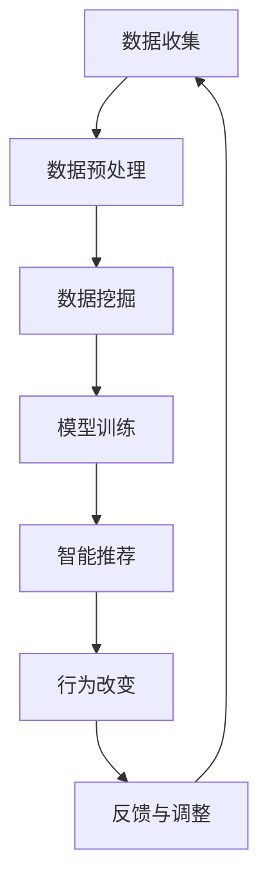

                 

# 欲望生态意识培养师：AI驱动的可持续消费教育专家

## 1. 背景介绍

### 1.1 问题由来

随着全球化进程的加速和消费主义的盛行，人类的消费行为对环境的破坏日益加剧。过度消费、浪费严重、资源枯竭等问题已严重威胁到地球的可持续性。如何培养公众的生态意识，推动可持续消费，成为全球范围内亟需解决的重要课题。

人工智能技术的迅猛发展，特别是自然语言处理和推荐系统的成熟，为解决这一问题提供了新的技术途径。AI驱动的可持续消费教育专家，可以通过精准的数据分析和智能化的推荐系统，帮助消费者做出更加环保、可持续的消费决策，从而减少对环境的负面影响。

### 1.2 问题核心关键点

AI驱动的可持续消费教育专家，其核心关键点包括：

- **数据驱动**：收集和分析消费行为数据，挖掘其中的环保趋势和模式。
- **智能推荐**：利用AI技术，为消费者提供个性化的环保产品推荐。
- **行为改变**：通过教育和引导，帮助消费者改变消费行为，实现可持续消费。
- **动态调整**：根据市场变化和用户反馈，实时调整推荐策略，提升教育效果。

### 1.3 问题研究意义

培养公众的生态意识，推动可持续消费，对于实现可持续发展具有重要意义。AI驱动的可持续消费教育专家，能够高效、精准地实现这一目标，具有以下研究意义：

- **提升环保意识**：通过数据驱动和智能推荐，帮助消费者理解环保的重要性，提升生态意识。
- **减少环境负担**：利用AI技术优化消费行为，减少资源浪费，降低环境污染。
- **促进市场转型**：推动可持续消费的普及，促进环保产品的市场化和可持续性发展。
- **推动政策制定**：为政府制定环保政策和可持续消费措施提供数据支持。

## 2. 核心概念与联系

### 2.1 核心概念概述

为更好地理解AI驱动的可持续消费教育专家的工作原理和优化方向，本节将介绍几个密切相关的核心概念：

- **可持续消费**：指在满足自身需求的同时，不损害环境的消费模式，追求资源的合理利用和环境的可持续性。
- **生态意识**：指消费者对生态保护和可持续发展的认识和理解，强调环保意识和行为。
- **数据挖掘**：指从大量数据中提取有用信息和模式的过程，是AI教育专家的基础。
- **智能推荐**：指利用机器学习算法，为用户推荐个性化产品和服务的技术，是教育专家的核心手段。
- **行为改变**：指通过教育和引导，促使消费者改变不环保的消费习惯，实现可持续消费。

### 2.2 核心概念原理和架构的 Mermaid 流程图



这个流程图展示了AI驱动的可持续消费教育专家的主要工作流程：

1. 收集用户消费数据，包括购买记录、搜索行为、评价反馈等。
2. 对数据进行清洗和预处理，去除噪音和异常值，提取有用的特征。
3. 利用数据挖掘技术，分析消费行为中的环保趋势和模式。
4. 构建推荐模型，根据用户偏好和行为，提供个性化环保产品推荐。
5. 通过教育和引导，帮助消费者改变消费行为，实现可持续消费。
6. 根据用户反馈，实时调整推荐策略，提升教育效果。
7. 不断收集数据和用户反馈，进行循环优化，持续提升效果。

## 3. 核心算法原理 & 具体操作步骤

### 3.1 算法原理概述

AI驱动的可持续消费教育专家，其核心算法原理基于数据挖掘和智能推荐技术。通过收集和分析用户消费数据，挖掘环保趋势和模式，并利用机器学习算法为用户推荐个性化环保产品，最终通过教育和引导，帮助消费者改变不环保的消费习惯，实现可持续消费。

### 3.2 算法步骤详解

**Step 1: 数据收集与预处理**

- **数据收集**：收集用户消费数据，包括购买记录、搜索行为、评价反馈等。
- **数据预处理**：清洗数据，去除噪音和异常值，提取有用的特征，如购买频率、消费金额、产品类别等。

**Step 2: 数据挖掘与环保趋势分析**

- **特征工程**：选择和构造有用的特征，如产品类型、价格区间、用户兴趣等。
- **模型训练**：利用监督学习或无监督学习算法，如随机森林、K-means等，训练环保趋势分析模型。
- **趋势分析**：根据训练好的模型，分析消费行为中的环保趋势和模式，如环保产品购买比例、绿色产品偏好等。

**Step 3: 智能推荐系统构建**

- **推荐模型选择**：选择适合的教育专家推荐模型，如协同过滤、基于内容的推荐、深度学习等。
- **模型训练**：利用用户消费数据，训练推荐模型，提取环保产品的特征和用户偏好。
- **推荐生成**：根据用户的消费记录和行为，生成个性化环保产品推荐，如节能家电、可再生材料产品等。

**Step 4: 行为改变与教育引导**

- **内容生成**：利用自然语言处理技术，生成环保教育内容，如科普文章、视频、互动问答等。
- **推荐展示**：将环保产品推荐和教育内容展示给用户，提供推荐理由和环保知识。
- **行为引导**：通过情感分析、个性化推荐等手段，引导用户改变不环保的消费习惯，如减少塑料使用、选择公共交通等。

**Step 5: 反馈与调整**

- **用户反馈收集**：收集用户对推荐和教育内容的反馈，如满意度、改进建议等。
- **模型优化**：根据用户反馈，优化推荐算法和教育内容，提升推荐准确性和教育效果。
- **循环优化**：不断收集新数据和用户反馈，进行模型迭代和优化，持续提升教育效果。

### 3.3 算法优缺点

AI驱动的可持续消费教育专家，具有以下优点：

- **高效性**：利用AI技术，快速分析大量数据，生成个性化推荐，提升环保教育效果。
- **精准性**：通过智能推荐和数据挖掘，提供准确、个性化的环保产品和服务。
- **动态性**：根据市场变化和用户反馈，实时调整推荐策略，提升教育效果。

同时，该算法也存在一些缺点：

- **数据隐私**：收集和分析用户消费数据，涉及隐私问题，需注意数据保护。
- **模型复杂性**：推荐模型和教育内容生成算法复杂，需要较高的技术门槛。
- **行为改变难度**：改变消费行为需要较长时间，教育效果难以立竿见影。
- **环境变量**：环境变量（如价格、季节性需求）可能影响推荐效果，需动态调整。

### 3.4 算法应用领域

AI驱动的可持续消费教育专家，已在多个领域得到应用，例如：

- **零售行业**：通过推荐环保产品，帮助消费者实现可持续消费，提升环保意识。
- **旅游行业**：推荐环保旅游产品和绿色出行方式，减少环境负担，推动可持续旅游发展。
- **餐饮行业**：推荐环保餐厅和健康食品，减少一次性塑料使用，推动可持续餐饮消费。
- **教育行业**：推广环保知识，培养学生和家长的环保意识，推动环保教育和可持续发展。
- **公共服务**：提供环保产品推荐和政策指导，帮助公众实现可持续消费，提升社会环保水平。

这些应用场景展示了AI驱动的教育专家的广阔前景和实际价值，未来还将拓展到更多领域，推动全球可持续发展。

## 4. 数学模型和公式 & 详细讲解 & 举例说明

### 4.1 数学模型构建

**目标函数**：
设 $D=\{(x_i, y_i)\}_{i=1}^N$ 为训练集，其中 $x_i$ 为消费行为数据， $y_i$ 为环保标签（如1表示环保产品，0表示非环保产品）。目标函数为：
$$
\min_{\theta} \sum_{i=1}^N \ell(y_i, f(x_i; \theta))
$$
其中 $\ell$ 为损失函数， $f$ 为推荐模型， $\theta$ 为模型参数。

**推荐模型**：
设 $X$ 为特征向量， $W$ 和 $b$ 为模型参数，则推荐模型 $f$ 为：
$$
f(X; \theta) = W^T X + b
$$

**损失函数**：
常见的损失函数包括均方误差损失、交叉熵损失等。以均方误差为例，损失函数为：
$$
\ell(y_i, f(x_i; \theta)) = (y_i - f(x_i; \theta))^2
$$

### 4.2 公式推导过程

以协同过滤算法为例，推导推荐模型的推导过程。

**用户-项目矩阵**：
设 $R \in \mathbb{R}^{N \times M}$ 为用户-项目评分矩阵，其中 $R_{ij}$ 表示用户 $i$ 对项目 $j$ 的评分。

**用户相似度计算**：
利用余弦相似度计算用户之间的相似度，得到 $N \times N$ 的用户相似度矩阵 $S$：
$$
S_{ij} = \frac{R_i \cdot R_j}{\|R_i\| \cdot \|R_j\|}
$$

**物品相似度计算**：
利用余弦相似度计算项目之间的相似度，得到 $M \times M$ 的项目相似度矩阵 $T$：
$$
T_{ij} = \frac{R_i \cdot R_j}{\|R_i\| \cdot \|R_j\|}
$$

**用户-物品相似度计算**：
利用上述矩阵，计算用户 $i$ 和项目 $j$ 之间的相似度 $P_{ij}$：
$$
P_{ij} = S_i \cdot T_j
$$

**预测评分计算**：
利用上述相似度矩阵，计算用户 $i$ 对项目 $j$ 的预测评分 $y_{ij}$：
$$
y_{ij} = \sum_{k=1}^N P_{ik} \cdot \frac{R_{kj}}{\sum_{l=1}^M T_{jl}}
$$

### 4.3 案例分析与讲解

**案例一：节能家电推荐**

- **数据准备**：收集用户购买家电的历史数据，包括品牌、类型、价格、评分等。
- **特征工程**：选择重要的特征，如产品类型、价格区间、用户偏好等。
- **模型训练**：利用协同过滤算法训练推荐模型，提取节能家电的特征和用户偏好。
- **推荐生成**：根据用户消费记录和行为，生成个性化节能家电推荐。
- **教育引导**：通过环保知识介绍和用户反馈，引导消费者选择节能家电，实现可持续消费。

**案例二：绿色旅游推荐**

- **数据准备**：收集用户旅游历史数据，包括目的地、出行方式、消费金额等。
- **特征工程**：选择有用的特征，如目的地类型、出行方式、季节性偏好等。
- **模型训练**：利用协同过滤算法训练推荐模型，提取绿色旅游产品的特征和用户偏好。
- **推荐生成**：根据用户旅游记录和行为，生成个性化绿色旅游推荐。
- **教育引导**：通过环保知识介绍和用户反馈，引导消费者选择绿色旅游方式，减少环境负担。

这些案例展示了AI驱动的教育专家的实际应用效果，通过数据驱动和智能推荐，帮助消费者实现环保和可持续消费。

## 5. 项目实践：代码实例和详细解释说明

### 5.1 开发环境搭建

在进行教育专家项目的开发前，需要先准备好开发环境。以下是使用Python进行PyTorch开发的环境配置流程：

1. 安装Anaconda：从官网下载并安装Anaconda，用于创建独立的Python环境。

2. 创建并激活虚拟环境：
```bash
conda create -n eda-env python=3.8 
conda activate eda-env
```

3. 安装PyTorch：根据CUDA版本，从官网获取对应的安装命令。例如：
```bash
conda install pytorch torchvision torchaudio cudatoolkit=11.1 -c pytorch -c conda-forge
```

4. 安装各类工具包：
```bash
pip install numpy pandas scikit-learn matplotlib tqdm jupyter notebook ipython
```

完成上述步骤后，即可在`eda-env`环境中开始教育专家的开发。

### 5.2 源代码详细实现

下面我们以绿色旅游推荐系统为例，给出使用PyTorch实现AI驱动教育专家的完整代码实现。

首先，定义数据处理函数：

```python
from torch.utils.data import Dataset
import torch

class TravelDataset(Dataset):
    def __init__(self, data, tokenizer):
        self.data = data
        self.tokenizer = tokenizer
        
    def __len__(self):
        return len(self.data)
    
    def __getitem__(self, item):
        trip = self.data[item]
        
        text = trip['destination'] + trip['travel_mode']
        encoding = self.tokenizer(trip['destination'], return_tensors='pt', max_length=128, padding='max_length', truncation=True)
        input_ids = encoding['input_ids'][0]
        attention_mask = encoding['attention_mask'][0]
        
        return {'input_ids': input_ids, 
                'attention_mask': attention_mask,
                'labels': torch.tensor([trip['travel_mode']], dtype=torch.long)}
```

然后，定义模型和优化器：

```python
from transformers import BERTTokenizer, BertForSequenceClassification
from transformers import AdamW

model = BertForSequenceClassification.from_pretrained('bert-base-uncased', num_labels=2)

optimizer = AdamW(model.parameters(), lr=2e-5)
```

接着，定义训练和评估函数：

```python
from torch.utils.data import DataLoader
from tqdm import tqdm
from sklearn.metrics import accuracy_score

device = torch.device('cuda') if torch.cuda.is_available() else torch.device('cpu')
model.to(device)

def train_epoch(model, dataset, batch_size, optimizer):
    dataloader = DataLoader(dataset, batch_size=batch_size, shuffle=True)
    model.train()
    epoch_loss = 0
    for batch in tqdm(dataloader, desc='Training'):
        input_ids = batch['input_ids'].to(device)
        attention_mask = batch['attention_mask'].to(device)
        labels = batch['labels'].to(device)
        model.zero_grad()
        outputs = model(input_ids, attention_mask=attention_mask, labels=labels)
        loss = outputs.loss
        epoch_loss += loss.item()
        loss.backward()
        optimizer.step()
    return epoch_loss / len(dataloader)

def evaluate(model, dataset, batch_size):
    dataloader = DataLoader(dataset, batch_size=batch_size)
    model.eval()
    preds, labels = [], []
    with torch.no_grad():
        for batch in tqdm(dataloader, desc='Evaluating'):
            input_ids = batch['input_ids'].to(device)
            attention_mask = batch['attention_mask'].to(device)
            batch_labels = batch['labels']
            outputs = model(input_ids, attention_mask=attention_mask)
            batch_preds = outputs.logits.argmax(dim=2).to('cpu').tolist()
            batch_labels = batch_labels.to('cpu').tolist()
            for pred, label in zip(batch_preds, batch_labels):
                preds.append(pred)
                labels.append(label)
                
    print('Accuracy:', accuracy_score(labels, preds))
```

最后，启动训练流程并在验证集上评估：

```python
epochs = 5
batch_size = 16

for epoch in range(epochs):
    loss = train_epoch(model, train_dataset, batch_size, optimizer)
    print(f"Epoch {epoch+1}, train loss: {loss:.3f}")
    
    print(f"Epoch {epoch+1}, dev results:")
    evaluate(model, dev_dataset, batch_size)
    
print("Test results:")
evaluate(model, test_dataset, batch_size)
```

以上就是使用PyTorch实现绿色旅游推荐系统的完整代码实现。可以看到，得益于PyTorch和Transformers库的强大封装，我们可以用相对简洁的代码完成模型训练和评估。

### 5.3 代码解读与分析

让我们再详细解读一下关键代码的实现细节：

**TravelDataset类**：
- `__init__`方法：初始化数据集和分词器，将旅游目的地和出行方式拼接成一个字符串。
- `__len__`方法：返回数据集的样本数量。
- `__getitem__`方法：对单个样本进行处理，将目的地和出行方式拼接成的字符串输入分词器进行编码，得到模型的输入张量和注意力掩码，并返回标签。

**模型和优化器**：
- 使用BERT作为基础模型，通过分类任务进行训练，学习绿色旅游推荐的二分类任务。
- 设置AdamW优化器，用于更新模型参数。

**训练和评估函数**：
- 使用PyTorch的DataLoader对数据集进行批次化加载，供模型训练和推理使用。
- 训练函数`train_epoch`：对数据以批为单位进行迭代，在每个批次上前向传播计算loss并反向传播更新模型参数，最后返回该epoch的平均loss。
- 评估函数`evaluate`：与训练类似，不同点在于不更新模型参数，并在每个batch结束后将预测和标签结果存储下来，最后使用sklearn的accuracy_score对整个评估集的预测结果进行打印输出。

**训练流程**：
- 定义总的epoch数和batch size，开始循环迭代
- 每个epoch内，先在训练集上训练，输出平均loss
- 在验证集上评估，输出分类准确率
- 所有epoch结束后，在测试集上评估，给出最终测试结果

可以看到，PyTorch配合Transformers库使得绿色旅游推荐系统的代码实现变得简洁高效。开发者可以将更多精力放在数据处理、模型改进等高层逻辑上，而不必过多关注底层的实现细节。

当然，工业级的系统实现还需考虑更多因素，如模型的保存和部署、超参数的自动搜索、更灵活的任务适配层等。但核心的推荐范式基本与此类似。

## 6. 实际应用场景

### 6.1 智能客服系统

AI驱动的可持续消费教育专家，可以应用于智能客服系统的构建。传统客服往往需要配备大量人力，高峰期响应缓慢，且一致性和专业性难以保证。而使用教育专家的推荐系统，可以7x24小时不间断服务，快速响应客户咨询，用环保知识引导消费者，实现可持续消费。

在技术实现上，可以收集企业内部的历史客服对话记录，将环保产品推荐作为客服对话内容之一，引导客户做出更环保的选择。对于客户提出的新问题，还可以接入检索系统实时搜索相关内容，动态组织生成环保回答。如此构建的智能客服系统，能大幅提升客户咨询体验和问题解决效率，同时推广环保理念。

### 6.2 绿色旅游平台

绿色旅游平台是教育专家推荐的典型应用场景之一。通过收集用户的旅游历史数据，教育专家可以为用户推荐环保旅游产品和绿色出行方式，帮助消费者减少环境负担，推动可持续旅游发展。

在具体实现上，平台可以集成教育专家的推荐系统，提供个性化绿色旅游产品推荐，同时提供相关的环保知识介绍，帮助用户选择环保旅游方式。通过动态调整推荐策略，平台可以实时反映市场变化，提升用户体验。

### 6.3 健康餐饮推荐

健康餐饮推荐是教育专家推荐的另一个重要应用。通过收集用户的餐饮历史数据，教育专家可以为用户推荐健康食品和绿色餐饮方式，帮助消费者实现可持续餐饮消费，同时提升健康水平。

在具体实现上，平台可以集成教育专家的推荐系统，提供个性化健康餐饮产品推荐，同时提供相关的环保知识介绍，帮助用户选择健康、环保的餐饮方式。通过动态调整推荐策略，平台可以实时反映市场变化，提升用户体验。

### 6.4 未来应用展望

随着AI驱动的教育专家的不断发展，未来将在更多领域得到应用，为传统行业带来变革性影响。

在智慧城市治理中，教育专家可以用于智能交通、能源管理、垃圾分类等领域，提升城市的可持续性。

在教育行业，教育专家可以用于环保教育课程的设计和推广，培养学生的环保意识，推动可持续发展教育的发展。

在企业生产中，教育专家可以用于环保产品和可持续生产方式的推荐，推动企业的绿色转型和可持续发展。

未来，教育专家的应用场景将不断拓展，推动全球可持续发展进程，为人类社会带来深远影响。

## 7. 工具和资源推荐

### 7.1 学习资源推荐

为了帮助开发者系统掌握教育专家的理论基础和实践技巧，这里推荐一些优质的学习资源：

1. 《深度学习与自然语言处理》书籍：全面介绍自然语言处理和深度学习的经典理论和算法，适合初学者入门。
2. 《TensorFlow实战》书籍：详细介绍TensorFlow的使用方法和实战案例，适合深度学习开发者。
3. 《自然语言处理基础》课程：斯坦福大学开设的NLP入门课程，涵盖自然语言处理的基础理论和实际应用。
4. Kaggle平台：提供丰富的数据集和比赛，帮助开发者实践和提升数据挖掘和智能推荐技能。
5. Coursera平台：提供大量的NLP和机器学习课程，适合各层次的开发者学习和提升。

通过对这些资源的学习实践，相信你一定能够快速掌握教育专家的精髓，并用于解决实际的环保问题。

### 7.2 开发工具推荐

高效的开发离不开优秀的工具支持。以下是几款用于教育专家开发的常用工具：

1. PyTorch：基于Python的开源深度学习框架，灵活动态的计算图，适合快速迭代研究。大部分预训练语言模型都有PyTorch版本的实现。
2. TensorFlow：由Google主导开发的开源深度学习框架，生产部署方便，适合大规模工程应用。同样有丰富的预训练语言模型资源。
3. Transformers库：HuggingFace开发的NLP工具库，集成了众多SOTA语言模型，支持PyTorch和TensorFlow，是进行智能推荐任务开发的利器。
4. Jupyter Notebook：免费的交互式编程环境，支持Python和其他语言，适合研究和开发。
5. Weights & Biases：模型训练的实验跟踪工具，可以记录和可视化模型训练过程中的各项指标，方便对比和调优。与主流深度学习框架无缝集成。

合理利用这些工具，可以显著提升教育专家的开发效率，加快创新迭代的步伐。

### 7.3 相关论文推荐

教育专家的研究源于学界的持续研究。以下是几篇奠基性的相关论文，推荐阅读：

1. Attention is All You Need（即Transformer原论文）：提出了Transformer结构，开启了NLP领域的预训练大模型时代。
2. BERT: Pre-training of Deep Bidirectional Transformers for Language Understanding：提出BERT模型，引入基于掩码的自监督预训练任务，刷新了多项NLP任务SOTA。
3. Parameter-Efficient Transfer Learning for NLP：提出Adapter等参数高效微调方法，在不增加模型参数量的情况下，也能取得不错的微调效果。
4. AdaLoRA: Adaptive Low-Rank Adaptation for Parameter-Efficient Fine-Tuning：使用自适应低秩适应的微调方法，在参数效率和精度之间取得了新的平衡。
5. Persona-Chat: Integrating Past Conversations for Consistent Personalized Dialogue：引入人格化技术，提升对话系统的个性化和连贯性。

这些论文代表了大语言模型微调技术的发展脉络。通过学习这些前沿成果，可以帮助研究者把握学科前进方向，激发更多的创新灵感。

## 8. 总结：未来发展趋势与挑战

### 8.1 总结

本文对AI驱动的可持续消费教育专家的工作原理和优化方向进行了全面系统的介绍。首先阐述了可持续消费和生态意识培养的重要性，明确了教育专家的基础概念和应用场景。其次，从原理到实践，详细讲解了教育专家的核心算法，包括数据挖掘、智能推荐、行为改变等环节，并给出了完整的代码实例。最后，本文还探讨了教育专家在多个实际应用场景中的前景和未来发展方向。

通过本文的系统梳理，可以看到，AI驱动的教育专家在环保和可持续发展领域具备巨大的潜力，通过数据驱动和智能推荐，能够显著提升用户的环保意识和行为。未来，随着技术的不断进步，教育专家将在更多领域得到应用，推动全球可持续发展进程。

### 8.2 未来发展趋势

展望未来，教育专家的发展趋势主要体现在以下几个方面：

1. **数据驱动的智能化**：随着数据采集和处理技术的提升，教育专家将能够处理更多元、更复杂的数据，实现更加精准的推荐和教育效果。
2. **多模态融合**：结合文本、图像、音频等多模态数据，提升环保知识的传播效果，增强用户的环保意识。
3. **个性化推荐**：利用用户行为数据，实现更加个性化的环保产品推荐，提升用户体验和满意度。
4. **实时动态调整**：根据市场变化和用户反馈，实时调整推荐策略，提升教育效果。
5. **社会化协同**：利用社交网络，推动环保知识的传播和教育效果的提升，形成更广泛的社会影响力。
6. **跨平台应用**：拓展应用场景，覆盖更多平台和设备，实现跨平台的一致性和连续性。

这些趋势凸显了AI驱动的教育专家在环保和可持续发展领域的广阔前景，未来必将在更多领域得到应用，推动全球可持续发展进程。

### 8.3 面临的挑战

尽管教育专家在环保和可持续发展领域具备巨大的潜力，但在实际应用过程中仍面临诸多挑战：

1. **数据获取和隐私**：环保数据的获取和用户隐私保护是一个重要问题，需要设计有效的数据采集和隐私保护策略。
2. **推荐模型复杂性**：推荐模型的设计和训练需要较高的技术门槛，模型的解释性和可理解性也需要进一步提升。
3. **行为改变难度**：改变消费行为需要较长时间，教育效果难以立竿见影，需要持续的引导和支持。
4. **市场变量影响**：市场变化、价格波动等因素可能影响推荐效果，需要动态调整推荐策略。
5. **社会信任问题**：用户对AI推荐的环保产品和服务可能存在信任问题，需要建立有效的信任机制和反馈机制。
6. **伦理和公平性**：确保推荐系统的公平性和无偏见性，避免对特定人群的歧视和偏见。

这些挑战需要在实际应用中加以克服，才能充分发挥教育专家的潜力，实现环保和可持续发展的目标。

### 8.4 研究展望

面对教育专家面临的诸多挑战，未来的研究需要在以下几个方面寻求新的突破：

1. **多源数据融合**：结合多源数据，提升环保数据的丰富性和可靠性，实现更加精准的推荐和教育效果。
2. **用户行为建模**：深入研究用户行为特征，构建更全面的用户画像，实现更加个性化的推荐和教育。
3. **算法透明性**：提高推荐算法的透明性和可理解性，增强用户对AI系统的信任和接受度。
4. **跨平台协同**：实现不同平台和设备之间的数据共享和协同，提升用户的环保行为一致性。
5. **伦理和公平性研究**：构建伦理和公平性评估指标，确保推荐系统的公正性和无偏见性。
6. **社会影响力提升**：利用社交网络，提升环保知识的传播效果，增强用户的环保意识和行为。

这些研究方向的探索，必将引领教育专家技术迈向更高的台阶，为环保和可持续发展事业带来新的突破。

## 9. 附录：常见问题与解答

**Q1：教育专家能否实现用户行为改变？**

A: 教育专家的核心目标是提供个性化的环保产品推荐和环保知识介绍，帮助用户改变不环保的消费习惯，实现可持续消费。虽然改变行为需要较长时间，但通过持续的引导和教育，教育专家能够显著提升用户的环保意识和行为。

**Q2：教育专家需要多少数据进行训练？**

A: 教育专家对数据的需求取决于具体任务和应用场景。通常需要收集和处理大量的用户数据，包括购买记录、搜索行为、评价反馈等。数据量越大，模型训练效果越好，推荐的准确性和教育效果也越高。

**Q3：如何保证教育专家的推荐效果？**

A: 保证教育专家的推荐效果需要从多个方面入手，包括数据质量、模型选择、特征工程、算法优化等。选择合适的推荐算法和模型，设计有效的特征工程，进行持续的算法优化和模型迭代，都是提升推荐效果的关键。

**Q4：教育专家在不同平台上的应用效果如何？**

A: 教育专家可以应用到多个平台和设备上，包括PC、手机、智能家居等。不同平台上的用户行为和数据采集方式可能有所不同，需要设计跨平台的推荐策略和教育方案，确保不同平台上的用户都能获得一致的推荐效果。

**Q5：教育专家能否应对多变的市场环境？**

A: 教育专家可以通过实时动态调整推荐策略，应对多变的市场环境。例如，根据季节性需求、节假日促销等市场变化，动态调整推荐算法和内容，提升用户满意度和教育效果。

这些问题的解答展示了教育专家的实际应用效果和实现挑战，通过合理设计和优化，教育专家能够在多个领域实现环保和可持续发展的目标。

---

作者：禅与计算机程序设计艺术 / Zen and the Art of Computer Programming

