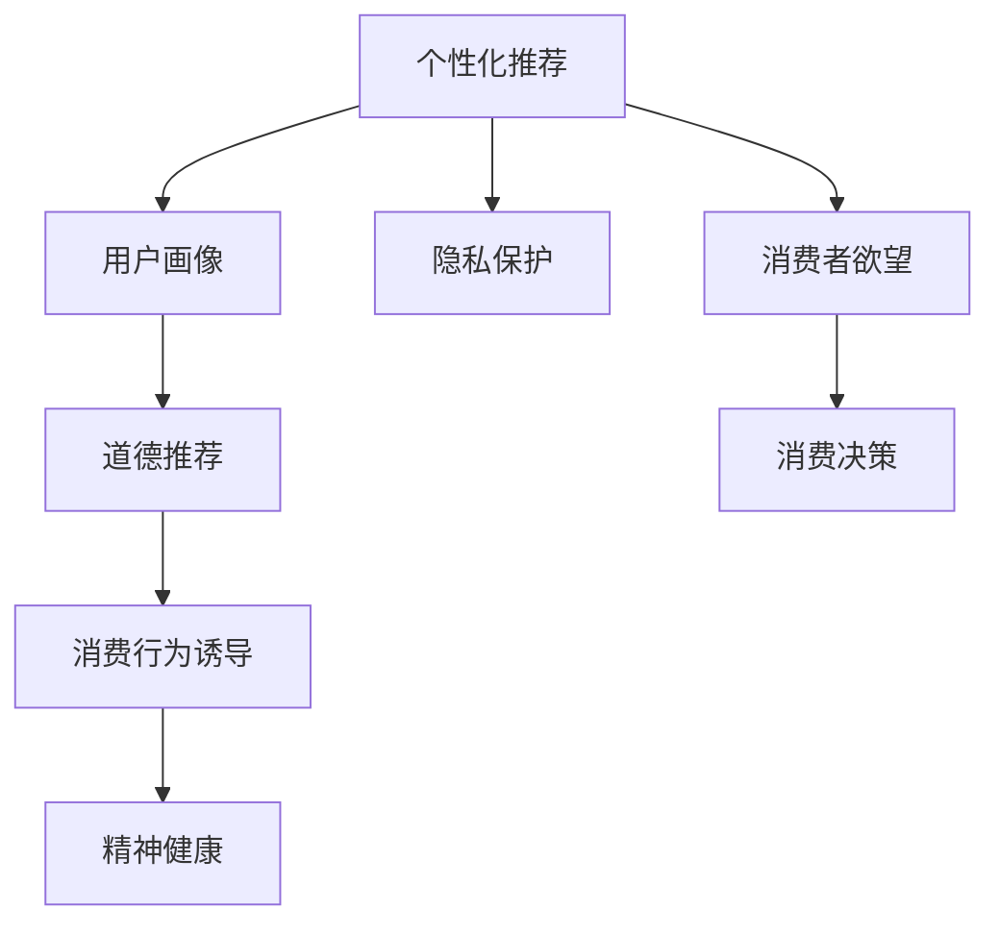

                 

# 欲望的持续化：AI时代的消费伦理

在AI时代，消费伦理问题正以一种新的形式出现。随着技术的进步，消费者的欲望也在持续化，这不仅仅是对物质的追求，更是对精神满足和自我实现的新期待。本文将探讨AI时代的消费伦理，分析其特点和影响，并提出相应的解决方案。

## 1. 背景介绍

### 1.1 问题由来

在AI时代，大数据和个性化推荐系统（Recommendation Systems, RS）的普及，使得消费者的欲望被更加精准地捕捉和激发。这不仅带来了消费模式的变革，也引发了伦理道德的重新思考。

- **个性化推荐**：利用AI技术，企业能够根据消费者的历史行为和偏好，精准推送商品信息，满足消费者的个性化需求。
- **用户画像**：AI通过分析用户数据，构建详细的用户画像，预测并引导消费者的消费行为。
- **虚拟试穿和虚拟体验**：AR/VR技术让消费者在虚拟世界中体验商品，增强消费的互动性和沉浸感。

### 1.2 问题核心关键点

AI时代的消费伦理问题集中在以下几个方面：

- **隐私保护**：个性化推荐和用户画像构建过程中，如何保护消费者的隐私数据？
- **道德推荐**：AI如何平衡商业利益和社会道德，避免误导消费？
- **消费行为诱导**：如何防止AI过度诱导消费者产生不必要的购买欲望？
- **精神健康**：过度个性化推荐可能对消费者的精神健康造成负面影响，如何应对？

## 2. 核心概念与联系

### 2.1 核心概念概述

为了更好地理解AI时代的消费伦理，我们首先介绍几个核心概念：

- **个性化推荐系统（Recommendation Systems, RS）**：通过分析用户行为和偏好，推荐个性化商品的技术。
- **用户画像（User Profile）**：利用AI技术，根据用户行为数据构建的详细用户特征。
- **隐私保护（Privacy Protection）**：在数据收集和分析过程中，确保用户隐私不被泄露。
- **道德推荐（Ethical Recommendation）**：在商业决策中考虑社会道德和伦理，避免误导性推荐。
- **消费行为诱导（Consumer Behavior Induction）**：AI如何影响和诱导消费者的购买决策。
- **精神健康（Mental Health）**：个性化推荐对消费者心理健康的潜在影响。

这些核心概念之间的逻辑关系可以通过以下Mermaid流程图来展示：



这个流程图展示了几类核心概念及其之间的关系：

1. 个性化推荐系统通过分析用户画像，推荐个性化商品，激发消费者欲望。
2. 用户画像的构建依赖于消费者的隐私数据，涉及隐私保护问题。
3. 道德推荐在个性化推荐过程中，需要平衡商业利益和社会道德。
4. 消费行为诱导可能影响消费者的购买决策和精神健康。
5. 消费者的最终消费决策是欲望和伦理的综合体现。

## 3. 核心算法原理 & 具体操作步骤

### 3.1 算法原理概述

AI时代的消费伦理问题，本质上是通过AI技术对消费者行为和心理的精准把握和干预。其核心算法原理包括：

- **协同过滤算法**：利用用户行为数据构建协同矩阵，进行个性化推荐。
- **内容推荐算法**：根据商品属性和用户兴趣，进行精准推荐。
- **深度学习模型**：利用深度学习模型，构建复杂的用户画像，进行更精准的推荐。

### 3.2 算法步骤详解

AI时代的消费伦理问题，涉及多个环节，其操作步骤如下：

**Step 1: 数据收集与处理**

- **用户行为数据收集**：通过浏览、购买、评价等行为，收集用户的数据。
- **数据清洗与预处理**：处理缺失数据、异常值，进行特征工程。

**Step 2: 用户画像构建**

- **特征提取**：从用户行为数据中提取关键特征，如浏览历史、购买偏好等。
- **画像构建**：利用机器学习模型，构建详细用户画像。

**Step 3: 个性化推荐**

- **模型训练**：使用协同过滤、内容推荐、深度学习等算法，训练个性化推荐模型。
- **推荐生成**：根据用户画像，生成个性化推荐结果。

**Step 4: 伦理审查**

- **隐私保护**：确保数据收集和处理过程中的隐私保护措施。
- **道德推荐**：在设计推荐模型时，考虑社会道德和伦理。

**Step 5: 消费者决策**

- **欲望激发**：通过个性化推荐，激发消费者欲望。
- **决策形成**：消费者根据欲望和伦理，形成最终购买决策。

### 3.3 算法优缺点

AI时代的消费伦理算法具有以下优点：

- **效率高**：通过大数据和机器学习，能够快速生成个性化推荐结果。
- **精准度**：能够根据用户行为数据，提供高度定制化的推荐。
- **覆盖广**：能够覆盖大量用户，提供广泛的商品选择。

同时，该算法也存在一些缺点：

- **隐私风险**：数据收集和处理过程中，可能泄露用户隐私。
- **道德风险**：推荐过程中可能存在误导性，影响消费者决策。
- **精神健康问题**：过度个性化推荐可能诱导消费者产生不必要购买，影响心理健康。

### 3.4 算法应用领域

AI时代的消费伦理算法，已经在多个领域得到了应用，包括：

- **电商平台**：如淘宝、京东等，通过个性化推荐系统，提升用户体验和销售额。
- **内容平台**：如Netflix、YouTube，提供个性化的电影、电视剧、视频推荐。
- **广告系统**：如Facebook、Google Ads，精准推送广告，提高广告效果。
- **在线旅游**：如携程、Airbnb，通过个性化推荐，提供优质的旅游体验。

## 4. 数学模型和公式 & 详细讲解 & 举例说明

### 4.1 数学模型构建

在AI时代的个性化推荐系统中，常见的数学模型包括：

- **协同过滤模型**：利用用户和商品之间的交互数据，进行推荐。
- **矩阵分解模型**：将用户行为矩阵分解为低维向量，进行推荐。
- **深度学习模型**：利用神经网络模型，构建复杂用户画像，进行推荐。

### 4.2 公式推导过程

以协同过滤模型为例，其数学模型为：

$$
\hat{r}_{ui} = e^{\alpha (u - \mu_u) + \beta (i - \mu_i) + \gamma \langle \boldsymbol{x}_u, \boldsymbol{y}_i \rangle + \delta}
$$

其中，$r_{ui}$ 表示用户 $u$ 对商品 $i$ 的评分预测值，$\alpha, \beta, \gamma, \delta$ 为模型参数，$\langle \boldsymbol{x}_u, \boldsymbol{y}_i \rangle$ 为向量内积，$\mu_u, \mu_i$ 为均值。

### 4.3 案例分析与讲解

以Netflix为例，Netflix的个性化推荐系统通过协同过滤和深度学习模型，实现了对用户行为的精准把握。Netflix利用用户评分数据，构建协同过滤模型，同时通过深度学习模型，学习用户画像，进一步提升推荐效果。

## 5. 项目实践：代码实例和详细解释说明

### 5.1 开发环境搭建

在进行个性化推荐系统开发前，我们需要准备好开发环境。以下是使用Python进行TensorFlow和PyTorch开发的常见环境配置流程：

1. 安装Anaconda：从官网下载并安装Anaconda，用于创建独立的Python环境。

2. 创建并激活虚拟环境：
```bash
conda create -n recommend-env python=3.8 
conda activate recommend-env
```

3. 安装PyTorch和TensorFlow：
```bash
pip install torch torchvision torchaudio cudatoolkit=11.1 -c pytorch -c conda-forge
pip install tensorflow
```

4. 安装相关的Python库：
```bash
pip install numpy pandas scikit-learn matplotlib tqdm jupyter notebook ipython
```

完成上述步骤后，即可在`recommend-env`环境中开始推荐系统开发。

### 5.2 源代码详细实现

以下是一个简单的基于TensorFlow的协同过滤推荐系统代码实现：

```python
import tensorflow as tf
from tensorflow.keras.layers import Embedding, Dot, Dense, Input

# 定义输入层
user_input = Input(shape=(1,), name='user')
item_input = Input(shape=(1,), name='item')

# 定义嵌入层
user_embedding = Embedding(1000, 10, name='user_embedding')(user_input)
item_embedding = Embedding(1000, 10, name='item_embedding')(item_input)

# 计算用户-商品的内积
dot = Dot(axes=1, name='dot')([user_embedding, item_embedding])

# 定义输出层
output = Dense(1, activation='sigmoid', name='output')(dot)

# 构建模型
model = tf.keras.Model(inputs=[user_input, item_input], outputs=output)
model.compile(loss='binary_crossentropy', optimizer='adam', metrics=['accuracy'])

# 训练模型
model.fit(user_train_data, item_train_data, epochs=10, validation_data=(user_val_data, item_val_data))
```

### 5.3 代码解读与分析

让我们再详细解读一下关键代码的实现细节：

**协同过滤模型**：
- **用户和商品嵌入层**：将用户和商品ID映射到低维向量，进行内积运算。
- **输出层**：使用sigmoid激活函数，预测用户是否喜欢该商品。
- **模型编译**：设置损失函数为二元交叉熵，优化器为Adam。

**训练流程**：
- **数据准备**：将用户ID和商品ID分别作为输入，生成训练集和验证集。
- **模型训练**：使用训练集数据，进行模型训练，设置训练轮数为10。
- **评估验证**：使用验证集数据，评估模型性能。

## 6. 实际应用场景

### 6.1 电商平台

在电商平台中，个性化推荐系统被广泛应用于商品推荐、用户画像构建和精准营销。通过AI技术，电商平台能够实现：

- **个性化推荐**：推荐用户可能感兴趣的商品，提升用户购买率和满意度。
- **用户画像**：构建详细的用户画像，提供个性化服务和营销。
- **广告投放**：通过数据分析，精准投放广告，提高广告效果。

### 6.2 内容平台

在内容平台如Netflix、YouTube中，个性化推荐系统被用来推荐电影、电视剧和视频。通过AI技术，内容平台能够实现：

- **内容推荐**：根据用户历史观看记录，推荐相关内容，提升用户体验。
- **用户画像**：构建用户兴趣和偏好，提供个性化的观看体验。
- **广告投放**：利用用户画像，精准投放广告，提高广告效果。

### 6.3 广告系统

在广告系统中，个性化推荐系统被用来推荐精准的广告内容。通过AI技术，广告系统能够实现：

- **精准投放**：根据用户行为和兴趣，精准投放广告，提高广告效果。
- **效果评估**：利用AI技术，实时评估广告效果，优化投放策略。

## 7. 工具和资源推荐

### 7.1 学习资源推荐

为了帮助开发者系统掌握AI时代的消费伦理问题，这里推荐一些优质的学习资源：

1. **《推荐系统基础》**：由Deep Learning on Recommendation Systems一书，介绍了推荐系统的基础理论、算法和实践。

2. **CS294-A《Recommender Systems》课程**：由斯坦福大学开设的推荐系统课程，提供了推荐系统理论和实践的全面讲解。

3. **《Python机器学习》**：由机器学习领域知名专家提供的机器学习入门书籍，涵盖了数据预处理、模型训练和评估等内容。

4. **Coursera推荐系统课程**：Coursera上提供的推荐系统课程，涵盖了推荐系统的基础理论、算法和实践。

5. **Kaggle推荐系统竞赛**：Kaggle上提供的推荐系统竞赛，通过实践锻炼推荐系统的开发和优化能力。

通过对这些资源的学习实践，相信你一定能够快速掌握AI时代消费伦理问题的处理能力，并用于解决实际的推荐系统问题。

### 7.2 开发工具推荐

高效的开发离不开优秀的工具支持。以下是几款用于AI时代消费伦理问题处理的常用工具：

1. **TensorFlow**：由Google主导开发的开源深度学习框架，生产部署方便，适合大规模工程应用。

2. **PyTorch**：基于Python的开源深度学习框架，灵活动态的计算图，适合快速迭代研究。

3. **Weights & Biases**：模型训练的实验跟踪工具，可以记录和可视化模型训练过程中的各项指标，方便对比和调优。

4. **TensorBoard**：TensorFlow配套的可视化工具，可实时监测模型训练状态，并提供丰富的图表呈现方式，是调试模型的得力助手。

5. **HuggingFace Transformers库**：提供了一系列预训练语言模型和自然语言处理工具，方便构建推荐系统。

6. **Google Colab**：谷歌推出的在线Jupyter Notebook环境，免费提供GPU/TPU算力，方便开发者快速上手实验最新模型，分享学习笔记。

合理利用这些工具，可以显著提升AI时代消费伦理问题的处理效率，加快创新迭代的步伐。

### 7.3 相关论文推荐

AI时代的消费伦理问题研究源于学界的持续研究。以下是几篇奠基性的相关论文，推荐阅读：

1. **《推荐系统中的隐私保护问题》**：探讨了推荐系统中的隐私保护技术，如差分隐私、匿名化等。

2. **《推荐系统中的道德问题》**：分析了推荐系统中的道德问题，如误导性推荐、广告偏见等。

3. **《个性化推荐对消费者心理健康的影响》**：研究了个性化推荐对消费者心理健康的影响，提供了具体的解决方案。

4. **《AI时代消费伦理问题》**：总结了AI时代消费伦理问题的现状和趋势，提出了未来的研究方向。

这些论文代表了大语言模型微调技术的发展脉络。通过学习这些前沿成果，可以帮助研究者把握学科前进方向，激发更多的创新灵感。

## 8. 总结：未来发展趋势与挑战

### 8.1 总结

本文对AI时代的消费伦理问题进行了全面系统的介绍。首先阐述了个性化推荐系统的背景和意义，明确了个性化推荐在提升用户体验和销售额方面的重要价值。其次，从原理到实践，详细讲解了个性化推荐系统的数学模型和操作步骤，给出了推荐系统开发的完整代码实例。同时，本文还广泛探讨了个性化推荐系统在电商平台、内容平台和广告系统中的应用前景，展示了推荐系统的巨大潜力。此外，本文精选了个性化推荐系统的各类学习资源，力求为读者提供全方位的技术指引。

通过本文的系统梳理，可以看到，个性化推荐系统正在成为电商、内容平台和广告系统的重要范式，极大地提升用户体验和商业价值。未来，伴随推荐算法的持续演进，推荐系统必将在更多领域得到应用，为社会经济发展注入新的动力。

### 8.2 未来发展趋势

展望未来，个性化推荐系统的技术将呈现以下几个发展趋势：

1. **数据驱动**：通过大数据和深度学习模型，实现更精准的推荐。
2. **跨模态融合**：利用跨模态数据融合技术，提升推荐系统的表现力。
3. **实时推荐**：利用流数据和实时计算，提供实时的推荐服务。
4. **增强用户互动**：通过虚拟试穿、虚拟试听等增强用户互动，提升推荐效果。
5. **伦理和社会责任**：在推荐过程中，更加注重隐私保护、道德推荐和社会责任。

以上趋势凸显了个性化推荐系统的广阔前景。这些方向的探索发展，必将进一步提升推荐系统的性能和应用范围，为社会经济发展带来新的机遇。

### 8.3 面临的挑战

尽管个性化推荐系统已经取得了瞩目成就，但在迈向更加智能化、普适化应用的过程中，它仍面临着诸多挑战：

1. **隐私保护**：在数据收集和处理过程中，如何保护用户隐私，避免数据泄露。
2. **道德推荐**：如何在推荐过程中，平衡商业利益和社会道德，避免误导性推荐。
3. **用户健康**：如何避免个性化推荐诱导用户产生不必要购买，影响用户心理健康。
4. **技术复杂性**：如何简化推荐系统，提高其部署效率和可维护性。

### 8.4 研究展望

面对个性化推荐系统面临的挑战，未来的研究需要在以下几个方面寻求新的突破：

1. **隐私保护技术**：发展新的隐私保护技术，如差分隐私、匿名化等，保护用户隐私。
2. **道德推荐算法**：研究新的道德推荐算法，平衡商业利益和社会道德。
3. **用户健康评估**：建立新的用户健康评估模型，识别并避免不必要购买。
4. **技术简化**：简化推荐系统，提高其部署效率和可维护性。

这些研究方向的探索，必将引领个性化推荐系统技术迈向更高的台阶，为推荐系统应用提供更强大的技术支撑。相信随着学界和产业界的共同努力，这些挑战终将一一被克服，推荐系统必将在构建人机协同的智能时代中扮演越来越重要的角色。

## 9. 附录：常见问题与解答

**Q1：个性化推荐系统是否适用于所有电商业务？**

A: 个性化推荐系统在大多数电商业务上都能取得不错的效果，特别是对于数据量较大的电商场景。但对于一些特定类型的电商业务，如二手商品、C2C交易等，个性化推荐的效果可能受到限制。此时需要在个性化推荐之外，结合人工干预和专家知识，提升推荐效果。

**Q2：个性化推荐系统如何平衡商业利益和社会道德？**

A: 个性化推荐系统需要在设计过程中考虑社会道德和伦理，避免误导性推荐。具体措施包括：
1. 设计公平的推荐算法，避免推荐偏见。
2. 引入用户反馈机制，及时调整推荐策略。
3. 在推荐结果中加入伦理导向的评价指标，避免有害内容。

**Q3：个性化推荐系统对用户心理健康可能产生哪些影响？**

A: 个性化推荐系统可能对用户心理健康产生以下影响：
1. 过度消费：过度个性化推荐可能诱导用户产生不必要购买，增加经济压力。
2. 信息过载：用户可能受到过多的推荐信息，导致信息过载，影响决策能力。
3. 心理依赖：长期接受个性化推荐，可能对某些商品产生心理依赖，影响正常生活。

**Q4：如何提高个性化推荐系统的实时性？**

A: 提高个性化推荐系统的实时性，可以通过以下措施：
1. 优化推荐算法，减少计算复杂度。
2. 利用缓存和流数据处理技术，提高响应速度。
3. 采用分布式计算和微服务架构，提升系统可扩展性。

**Q5：个性化推荐系统如何保护用户隐私？**

A: 个性化推荐系统在数据收集和处理过程中，需要考虑用户隐私保护。具体措施包括：
1. 数据匿名化处理，避免用户数据泄露。
2. 采用差分隐私技术，保护用户数据隐私。
3. 设置数据访问权限，限制数据访问范围。

通过对这些问题的解答，可以帮助开发者更好地理解和处理个性化推荐系统中的伦理和隐私问题，提升系统的安全性和公平性。

