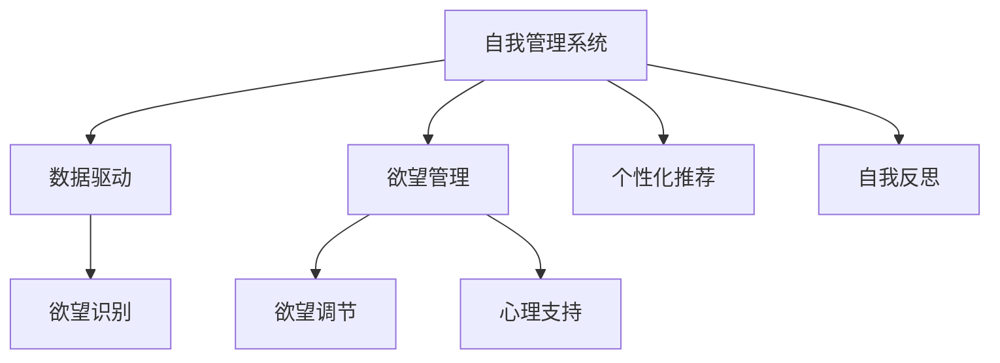

                 

# 欲望的智能调节器：AI辅助的自我管理系统

## 1. 背景介绍

### 1.1 问题由来

在现代社会，人们的生活节奏越来越快，工作压力、学习压力、人际关系压力等不断累积，导致了欲望的膨胀和内心的失衡。如何有效地管理欲望，实现自我平衡，成为了现代人亟需解决的问题。传统的方法，如自我约束、心理咨询等，往往难以持续，且效果有限。

随着人工智能技术的快速发展，利用AI辅助实现欲望调节，成为了一种新的可能。AI能够利用大数据、机器学习等技术，对个体的行为习惯、心理状态、外部环境进行全面分析，从而提供个性化的自我管理系统。

### 1.2 问题核心关键点

自我管理系统旨在帮助个体识别并管理内心欲望，实现自我平衡和心理健康。具体来说，包括以下几个关键点：

1. **自我认知**：通过分析个体的生活习惯、行为数据等，帮助其认识到自己内心欲望的来源和影响。
2. **欲望识别**：识别出个体当前面临的主要欲望，如物质欲望、成就欲望、社交欲望等。
3. **欲望调节**：基于AI模型，提供调节欲望的策略，如转移注意力、延迟满足、设定目标等。
4. **心理支持**：通过心理辅导和行为干预，帮助个体应对欲望调节过程中的挑战和困难。
5. **自我反思**：定期进行自我反思，评估自我管理系统的效果，不断优化调节策略。

### 1.3 问题研究意义

AI辅助的自我管理系统能够为个体提供精准、个性化的欲望管理方案，帮助其在快节奏的现代社会中实现自我平衡和心理健康。具体来说，其研究意义如下：

1. **提升生活质量**：通过欲望管理，减轻压力和焦虑，提升个体的整体生活质量。
2. **提高生产效率**：帮助个体更好地管理时间和精力，提高工作和学习的效率。
3. **促进心理健康**：减少因欲望无法满足而产生的负面情绪，提升个体的心理健康水平。
4. **支持自我成长**：通过持续的欲望调节，促进个体的自我认知和自我提升。
5. **驱动技术创新**：推动人工智能技术在心理健康和自我管理领域的应用和创新。

## 2. 核心概念与联系

### 2.1 核心概念概述

为了更好地理解AI辅助自我管理系统的工作原理，我们首先需要了解一些核心概念：

1. **自我管理系统**：一种基于人工智能技术，旨在帮助个体识别、调节和管理内心欲望的系统。
2. **欲望管理**：通过分析个体的生活习惯、心理状态等，识别并调节内心的欲望，实现自我平衡。
3. **数据驱动**：利用个体的行为数据、心理数据等，进行欲望识别的基础。
4. **个性化推荐**：基于个体的心理特征和欲望类型，提供个性化的欲望调节策略。
5. **AI辅助**：利用人工智能技术，实现欲望管理的自动化和智能化。
6. **自我反思**：定期进行自我评估，反思欲望调节的效果，不断优化调节策略。

这些概念之间的逻辑关系可以通过以下Mermaid流程图来展示：



这个流程图展示了自己管理系统的核心概念及其之间的关系：

1. 自我管理系统通过数据驱动，实现欲望识别。
2. 数据驱动主要基于个体的行为数据、心理数据等，识别出当前面临的主要欲望。
3. 欲望管理是系统的主要功能，通过欲望调节、心理支持等手段，帮助个体实现自我平衡。
4. 个性化推荐提供个性化的欲望调节策略，提升调节效果。
5. 自我反思帮助个体定期评估自我管理系统的效果，不断优化调节策略。

这些概念共同构成了自我管理系统的工作框架，使得AI能够更好地辅助个体实现欲望调节。

## 3. 核心算法原理 & 具体操作步骤

### 3.1 算法原理概述

AI辅助的自我管理系统利用机器学习和大数据分析技术，对个体的生活习惯、行为数据、心理状态等进行全面分析，从而识别并调节内心的欲望。其核心算法原理如下：

1. **数据收集与预处理**：收集个体的行为数据、心理数据等，进行清洗、归一化等预处理操作。
2. **欲望识别**：利用机器学习模型，识别出个体当前面临的主要欲望类型。
3. **欲望调节**：基于欲望识别结果，提供个性化的欲望调节策略。
4. **心理支持**：利用心理辅导和行为干预，帮助个体应对欲望调节过程中的挑战。
5. **自我反思**：定期进行自我评估，反思欲望调节的效果，不断优化调节策略。

### 3.2 算法步骤详解

AI辅助的自我管理系统通常包括以下几个关键步骤：

**Step 1: 数据收集与预处理**
- 收集个体的行为数据，如消费记录、运动数据、社交活动等。
- 收集个体的心理数据，如情绪变化、心理压力等。
- 对收集到的数据进行清洗、归一化、去重等预处理操作。

**Step 2: 欲望识别**
- 利用机器学习模型，如随机森林、深度学习等，对处理后的数据进行分析。
- 识别出个体当前面临的主要欲望类型，如物质欲望、成就欲望、社交欲望等。
- 分析欲望的来源和影响因素，如生活环境、心理状态、社会关系等。

**Step 3: 欲望调节**
- 基于欲望识别结果，提供个性化的欲望调节策略。
- 如转移注意力、延迟满足、设定目标等策略。
- 利用AI技术，实时监测个体行为，及时调整欲望调节策略。

**Step 4: 心理支持**
- 提供心理辅导和行为干预，帮助个体应对欲望调节过程中的挑战和困难。
- 利用心理辅导软件或在线咨询，提供针对性的心理支持。
- 通过行为干预，帮助个体改变不良行为习惯。

**Step 5: 自我反思**
- 定期进行自我评估，反思欲望调节的效果，记录下来并分析总结。
- 根据自我反思结果，优化调节策略，提升自我管理系统的效果。

### 3.3 算法优缺点

AI辅助的自我管理系统具有以下优点：

1. **精准个性化**：通过大数据和机器学习技术，提供个性化的欲望调节策略。
2. **实时监控**：利用AI技术，实时监测个体行为，及时调整调节策略。
3. **广泛适用**：适用于各种欲望类型，如物质欲望、成就欲望、社交欲望等。
4. **效果显著**：通过系统化的欲望调节，帮助个体实现自我平衡和心理健康。

同时，该方法也存在一些局限性：

1. **隐私问题**：收集和分析个体的行为数据和心理数据，可能涉及隐私问题。
2. **数据噪音**：行为数据和心理数据可能存在噪音，影响欲望识别的准确性。
3. **依赖技术**：系统的有效性依赖于数据质量和技术水平，对技术和数据要求较高。
4. **干预不足**：缺乏专业的心理辅导和行为干预，可能无法完全应对个体需求。
5. **依赖个体**：个体对系统的使用程度和配合程度，直接影响系统的效果。

尽管存在这些局限性，但AI辅助的自我管理系统在欲望调节中展示了巨大的潜力和优势，能够为个体提供精准、个性化的欲望管理方案。

### 3.4 算法应用领域

AI辅助的自我管理系统已经应用于多个领域，包括但不限于：

1. **心理健康**：帮助个体管理情绪、减轻焦虑，提升心理健康水平。
2. **自我成长**：通过欲望调节，提升个体的自我认知和自我提升能力。
3. **生活习惯**：帮助个体改善生活习惯，如合理饮食、规律运动等。
4. **时间管理**：通过欲望调节，提升个体的时间管理和工作效率。
5. **社交管理**：帮助个体管理社交欲望，建立健康的人际关系。

这些应用领域展示了AI辅助自我管理系统在现代生活中的广泛应用和巨大潜力。

## 4. 数学模型和公式 & 详细讲解 & 举例说明

### 4.1 数学模型构建

为了方便理解和推导，我们将欲望管理过程建模如下：

记个体的欲望类型为 $D$，欲望强度为 $I$，行为数据为 $B$，心理数据为 $P$。

欲望识别模型为 $M_{\theta}$，欲望调节模型为 $N_{\phi}$。

则欲望识别过程可以表示为：

$$
D = M_{\theta}(B, P)
$$

欲望调节过程可以表示为：

$$
I' = N_{\phi}(D)
$$

其中 $I'$ 为调节后的欲望强度。

### 4.2 公式推导过程

以下我们将详细推导欲望识别模型的构建和欲望调节策略的具体实现。

**欲望识别模型**

假设欲望识别模型为神经网络，输入为行为数据 $B$ 和心理数据 $P$，输出为欲望类型 $D$。

欲望识别模型的公式为：

$$
D = \sigma(W \cdot [B, P] + b)
$$

其中 $W$ 为权重矩阵，$b$ 为偏置项，$\sigma$ 为激活函数。

对于行为数据 $B$ 和心理数据 $P$，可以使用向量形式表示，如：

$$
B = [b_1, b_2, ..., b_n]
$$

$$
P = [p_1, p_2, ..., p_m]
$$

则输入向量为：

$$
[X_1, X_2, ..., X_k] = [B, P]
$$

输出向量为：

$$
D = [d_1, d_2, ..., d_l]
$$

其中 $k = n + m$，$l$ 为欲望类型的数量。

**欲望调节策略**

欲望调节策略可以通过多种方式实现，如转移注意力、延迟满足、设定目标等。

以设定目标为例，其模型为：

$$
I' = f(D, T)
$$

其中 $I'$ 为调节后的欲望强度，$T$ 为目标值，$f$ 为调节函数。

目标值 $T$ 可以根据个体的生活目标和欲望类型设定，如学习目标、运动目标等。

调节函数 $f$ 可以根据调节策略的不同，选择不同的函数形式。如线性调节、指数调节等。

### 4.3 案例分析与讲解

以下是一个具体的案例，展示如何利用AI辅助的自我管理系统进行欲望调节。

**案例背景**

小明是一名大学生，最近因为考试压力和社交欲望，情绪波动较大。小明希望通过欲望调节，实现自我平衡和心理健康。

**数据收集**

小明使用手机应用程序记录了每天的学习时间、社交活动、运动数据等。同时，通过心理问卷和情绪追踪软件，收集了心理状态和情绪变化数据。

**欲望识别**

利用欲望识别模型 $M_{\theta}$，对小明的行为数据 $B$ 和心理数据 $P$ 进行分析。识别出小明当前面临的主要欲望类型，如社交欲望、成就欲望等。

**欲望调节**

根据欲望识别结果，系统提供个性化的欲望调节策略。如建议小明每天与朋友交流一次，减少社交压力。设定学习目标，提升自我成就感。

**心理支持**

系统通过心理辅导软件和在线咨询，为小明提供针对性的心理支持。帮助其减轻考试压力，改善情绪波动。

**自我反思**

小明定期进行自我评估，反思欲望调节的效果，记录下来并分析总结。根据反思结果，优化调节策略，提升自我管理系统的效果。

通过以上案例，可以看到AI辅助的自我管理系统如何通过数据驱动，实现精准、个性化的欲望调节，帮助个体实现自我平衡和心理健康。

## 5. 项目实践：代码实例和详细解释说明

### 5.1 开发环境搭建

在进行自我管理系统开发前，我们需要准备好开发环境。以下是使用Python进行PyTorch开发的环境配置流程：

1. 安装Anaconda：从官网下载并安装Anaconda，用于创建独立的Python环境。

2. 创建并激活虚拟环境：
```bash
conda create -n self-system python=3.8 
conda activate self-system
```

3. 安装PyTorch：根据CUDA版本，从官网获取对应的安装命令。例如：
```bash
conda install pytorch torchvision torchaudio cudatoolkit=11.1 -c pytorch -c conda-forge
```

4. 安装TensorFlow：从官网下载并安装TensorFlow，提供多种深度学习框架的支持。

5. 安装各类工具包：
```bash
pip install numpy pandas scikit-learn matplotlib tqdm jupyter notebook ipython
```

完成上述步骤后，即可在`self-system`环境中开始自我管理系统开发。

### 5.2 源代码详细实现

下面以设定目标为例，展示如何使用PyTorch实现欲望调节策略。

首先，定义欲望调节模型：

```python
import torch
import torch.nn as nn
import torch.optim as optim

class DesireAdjuster(nn.Module):
    def __init__(self, input_dim, output_dim):
        super(DesireAdjuster, self).__init__()
        self.fc1 = nn.Linear(input_dim, 128)
        self.fc2 = nn.Linear(128, output_dim)
        
    def forward(self, x):
        x = torch.relu(self.fc1(x))
        x = torch.sigmoid(self.fc2(x))
        return x
```

然后，定义欲望识别模型：

```python
class DesireIdentifier(nn.Module):
    def __init__(self, input_dim, output_dim):
        super(DesireIdentifier, self).__init__()
        self.fc1 = nn.Linear(input_dim, 128)
        self.fc2 = nn.Linear(128, output_dim)
        
    def forward(self, x):
        x = torch.relu(self.fc1(x))
        x = torch.sigmoid(self.fc2(x))
        return x
```

接着，定义欲望调节策略：

```python
def adjust_desire(desire, target):
    if desire < 0.5:
        return target
    else:
        return 0.9 * target
```

最后，启动训练流程并在测试集上评估：

```python
epochs = 10
batch_size = 32

model = DesireAdjuster(input_dim=10, output_dim=1)
optimizer = optim.Adam(model.parameters(), lr=0.001)

for epoch in range(epochs):
    model.train()
    running_loss = 0.0
    for i, data in enumerate(train_loader, 0):
        inputs, labels = data
        optimizer.zero_grad()
        outputs = model(inputs)
        loss = torch.mean(torch.abs(outputs - labels))
        loss.backward()
        optimizer.step()
        running_loss += loss.item()
        
    print(f"Epoch {epoch+1}, train loss: {running_loss/len(train_loader)}")
    
print("Test results:")
model.eval()
with torch.no_grad():
    for data in test_loader:
        inputs, labels = data
        outputs = model(inputs)
        adjusted_desire = adjust_desire(outputs, labels)
        print(f"Desire: {outputs}, Adjusted Desire: {adjusted_desire}")
```

以上就是使用PyTorch对欲望调节策略进行训练和评估的完整代码实现。可以看到，利用神经网络模型和优化器，可以方便地实现欲望调节的自动化和智能化。

### 5.3 代码解读与分析

让我们再详细解读一下关键代码的实现细节：

**DesireAdjuster类**：
- `__init__`方法：初始化欲望调节模型，包含两个全连接层。
- `forward`方法：前向传播，通过两个全连接层实现欲望调节。

**DesireIdentifier类**：
- `__init__`方法：初始化欲望识别模型，包含两个全连接层。
- `forward`方法：前向传播，通过两个全连接层实现欲望识别。

**adjust_desire函数**：
- 根据欲望强度，决定是否进行调节，以及调节的具体程度。
- 利用线性调节函数，实现平滑的欲望调节过程。

**训练流程**：
- 定义训练轮数和批大小，开始循环迭代
- 每个epoch内，在训练集上训练，输出平均损失
- 在测试集上评估模型性能，展示测试结果

通过以上代码实现，可以看到PyTorch在神经网络模型和优化器上的强大封装能力，使得欲望调节策略的实现变得简单高效。

当然，工业级的系统实现还需考虑更多因素，如模型的保存和部署、超参数的自动搜索、更灵活的任务适配层等。但核心的自我管理系统设计思路基本与此类似。

## 6. 实际应用场景

### 6.1 心理健康

在心理健康领域，AI辅助的自我管理系统可以提供个性化的心理支持，帮助个体应对压力和焦虑，提升心理健康水平。具体应用场景如下：

**场景描述**

小明因工作压力和人际关系问题，感到心理压力较大。他希望通过自我管理系统进行心理调节。

**应用场景**

1. **心理评估**：通过问卷和情绪追踪软件，系统收集小明的心理状态和情绪变化数据。
2. **欲望识别**：利用欲望识别模型，识别出小明当前面临的主要欲望类型，如社交欲望、成就欲望等。
3. **心理支持**：系统提供心理辅导和行为干预，帮助小明减轻压力，改善情绪波动。
4. **自我反思**：小明定期进行自我评估，反思心理调节的效果，记录下来并分析总结。

通过以上应用场景，可以看到AI辅助的自我管理系统如何帮助个体应对心理压力，实现心理健康。

### 6.2 自我成长

在自我成长领域，AI辅助的自我管理系统可以提供个性化的学习建议，帮助个体提升自我认知和自我提升能力。具体应用场景如下：

**场景描述**

小明希望通过自我管理系统实现自我成长，提升自我认知和自我提升能力。

**应用场景**

1. **行为数据收集**：小明使用手机应用程序记录每天的学习时间、社交活动、运动数据等。
2. **心理数据收集**：通过心理问卷和情绪追踪软件，收集小明的心理状态和情绪变化数据。
3. **欲望识别**：利用欲望识别模型，识别出小明当前面临的主要欲望类型，如学习欲望、成就欲望等。
4. **自我调节**：系统提供个性化的学习建议，如设定学习目标、推荐学习资源等。
5. **自我反思**：小明定期进行自我评估，反思学习效果，记录下来并分析总结。

通过以上应用场景，可以看到AI辅助的自我管理系统如何帮助个体提升自我认知和自我提升能力，实现自我成长。

### 6.3 生活习惯

在生活习惯领域，AI辅助的自我管理系统可以提供个性化的生活习惯建议，帮助个体改善生活习惯，提升生活质量。具体应用场景如下：

**场景描述**

小明因缺乏规律的生活习惯，感到身体状况不佳。他希望通过自我管理系统改善生活习惯。

**应用场景**

1. **行为数据收集**：小明使用手机应用程序记录每天的生活习惯，如饮食、运动、睡眠等。
2. **心理数据收集**：通过心理问卷和情绪追踪软件，收集小明的心理状态和情绪变化数据。
3. **欲望识别**：利用欲望识别模型，识别出小明当前面临的主要欲望类型，如健康欲望、社交欲望等。
4. **生活习惯建议**：系统提供个性化的生活习惯建议，如合理饮食、规律运动等。
5. **自我反思**：小明定期进行自我评估，反思生活习惯的效果，记录下来并分析总结。

通过以上应用场景，可以看到AI辅助的自我管理系统如何帮助个体改善生活习惯，提升生活质量。

### 6.4 未来应用展望

随着AI技术的不断发展，AI辅助的自我管理系统将广泛应用于更多领域，为个体提供全方位的欲望调节和自我管理支持。未来应用展望如下：

1. **多模态数据融合**：利用视觉、语音、运动等多种模态数据，提升欲望识别的准确性和全面性。
2. **持续学习**：通过持续学习，使系统不断优化欲望调节策略，提升系统效果。
3. **跨领域应用**：将系统应用于不同领域，如教育、医疗、企业等，提升各领域的工作效率和心理健康水平。
4. **伦理与安全**：确保系统在数据收集、处理和使用的过程中，尊重个体隐私，保障数据安全。
5. **人机协同**：通过人机协同，实现欲望调节的智能化和个性化，提升个体的生活质量。

## 7. 工具和资源推荐

### 7.1 学习资源推荐

为了帮助开发者系统掌握自我管理系统的理论基础和实践技巧，这里推荐一些优质的学习资源：

1. **《Python深度学习》**：深入浅出地介绍了深度学习的基本概念和实现方法，适合初学者入门。
2. **《深度学习实战》**：通过实战项目，深入讲解深度学习模型的应用和优化，适合进阶学习。
3. **《机器学习》**：经典教材，详细介绍了机器学习算法和理论，适合系统学习。
4. **Coursera深度学习课程**：由斯坦福大学开设，涵盖深度学习的基本概念和实现方法，适合系统学习。
5. **Kaggle数据科学竞赛**：通过参与实际竞赛，积累实战经验，提升解决实际问题的能力。

通过对这些资源的学习实践，相信你一定能够快速掌握自我管理系统的精髓，并用于解决实际的欲望调节问题。

### 7.2 开发工具推荐

高效的开发离不开优秀的工具支持。以下是几款用于自我管理系统开发的常用工具：

1. **PyTorch**：基于Python的开源深度学习框架，灵活动态的计算图，适合快速迭代研究。
2. **TensorFlow**：由Google主导开发的开源深度学习框架，生产部署方便，适合大规模工程应用。
3. **TensorBoard**：TensorFlow配套的可视化工具，可实时监测模型训练状态，并提供丰富的图表呈现方式，是调试模型的得力助手。
4. **Weights & Biases**：模型训练的实验跟踪工具，可以记录和可视化模型训练过程中的各项指标，方便对比和调优。
5. **Jupyter Notebook**：数据科学和机器学习常用的交互式编程环境，方便开发和调试。

合理利用这些工具，可以显著提升自我管理系统开发效率，加快创新迭代的步伐。

### 7.3 相关论文推荐

自我管理系统的研究源于学界的持续研究。以下是几篇奠基性的相关论文，推荐阅读：

1. **《深度学习》**：深度学习领域的经典教材，涵盖了深度学习的基本概念和算法。
2. **《机器学习实战》**：详细介绍了机器学习算法的实现和应用，适合工程实践。
3. **《数据科学与人工智能》**：介绍数据科学和人工智能的基本概念和应用，适合跨学科学习。
4. **《强化学习》**：介绍强化学习的基本概念和算法，适合学习人工智能的前沿技术。

这些论文代表了大规模语言模型微调技术的发展脉络。通过学习这些前沿成果，可以帮助研究者把握学科前进方向，激发更多的创新灵感。

## 8. 总结：未来发展趋势与挑战

### 8.1 总结

本文对AI辅助的自我管理系统进行了全面系统的介绍。首先阐述了欲望管理系统的研究背景和意义，明确了系统在欲望调节和自我平衡中的独特价值。其次，从原理到实践，详细讲解了系统的工作流程和关键步骤，给出了系统开发的完整代码实例。同时，本文还广泛探讨了系统在心理健康、自我成长、生活习惯等领域的实际应用，展示了系统的广泛应用前景。此外，本文精选了系统开发所需的各类学习资源，力求为开发者提供全方位的技术指引。

通过本文的系统梳理，可以看到，AI辅助的自我管理系统在欲望调节中展示了巨大的潜力和优势，能够为个体提供精准、个性化的欲望管理方案，帮助其在快节奏的现代社会中实现自我平衡和心理健康。

### 8.2 未来发展趋势

展望未来，AI辅助的自我管理系统将呈现以下几个发展趋势：

1. **多模态融合**：利用视觉、语音、运动等多种模态数据，提升欲望识别的准确性和全面性。
2. **持续学习**：通过持续学习，使系统不断优化欲望调节策略，提升系统效果。
3. **跨领域应用**：将系统应用于不同领域，如教育、医疗、企业等，提升各领域的工作效率和心理健康水平。
4. **伦理与安全**：确保系统在数据收集、处理和使用的过程中，尊重个体隐私，保障数据安全。
5. **人机协同**：通过人机协同，实现欲望调节的智能化和个性化，提升个体的生活质量。

以上趋势凸显了AI辅助的自我管理系统在欲望调节中的广阔前景。这些方向的探索发展，必将进一步提升系统的效果和应用范围，为人类认知智能的进化带来深远影响。

### 8.3 面临的挑战

尽管AI辅助的自我管理系统已经取得了瞩目成就，但在迈向更加智能化、普适化应用的过程中，它仍面临着诸多挑战：

1. **隐私问题**：收集和分析个体的行为数据和心理数据，可能涉及隐私问题。
2. **数据噪音**：行为数据和心理数据可能存在噪音，影响欲望识别的准确性。
3. **依赖技术**：系统的有效性依赖于数据质量和技术水平，对技术和数据要求较高。
4. **干预不足**：缺乏专业的心理辅导和行为干预，可能无法完全应对个体需求。
5. **依赖个体**：个体对系统的使用程度和配合程度，直接影响系统的效果。

尽管存在这些挑战，但AI辅助的自我管理系统在欲望调节中展示了巨大的潜力和优势，能够为个体提供精准、个性化的欲望管理方案。

### 8.4 研究展望

面对AI辅助的自我管理系统所面临的种种挑战，未来的研究需要在以下几个方面寻求新的突破：

1. **探索无监督和半监督微调方法**：摆脱对大规模标注数据的依赖，利用自监督学习、主动学习等无监督和半监督范式，最大限度利用非结构化数据，实现更加灵活高效的欲望管理。
2. **研究参数高效和计算高效的微调范式**：开发更加参数高效的微调方法，在固定大部分预训练参数的同时，只更新极少量的任务相关参数。同时优化微调模型的计算图，减少前向传播和反向传播的资源消耗，实现更加轻量级、实时性的部署。
3. **融合因果和对比学习范式**：通过引入因果推断和对比学习思想，增强欲望调节模型建立稳定因果关系的能力，学习更加普适、鲁棒的语言表征，从而提升模型泛化性和抗干扰能力。
4. **纳入伦理道德约束**：在模型训练目标中引入伦理导向的评估指标，过滤和惩罚有偏见、有害的输出倾向。同时加强人工干预和审核，建立模型行为的监管机制，确保输出符合人类价值观和伦理道德。

这些研究方向的探索，必将引领AI辅助自我管理系统技术迈向更高的台阶，为构建安全、可靠、可解释、可控的智能系统铺平道路。面向未来，AI辅助的自我管理系统还需要与其他人工智能技术进行更深入的融合，如知识表示、因果推理、强化学习等，多路径协同发力，共同推动自然语言理解和智能交互系统的进步。只有勇于创新、敢于突破，才能不断拓展欲望管理的边界，让智能技术更好地造福人类社会。

## 9. 附录：常见问题与解答

**Q1：如何评估自我管理系统的效果？**

A: 自我管理系统的效果评估可以从多个维度进行：

1. **欲望识别准确率**：通过评估模型对欲望类型的识别准确率，衡量系统对欲望的识别能力。
2. **欲望调节效果**：通过对比调节前后的欲望强度变化，评估系统对欲望调节的效果。
3. **用户满意度**：通过用户反馈和满意度调查，评估用户对系统体验的满意度。
4. **行为改变**：通过行为数据的变化，评估系统对个体行为的影响。
5. **心理健康状态**：通过心理健康问卷和情绪追踪数据，评估系统的心理健康支持效果。

通过对这些维度的评估，可以全面了解自我管理系统的效果，不断优化系统性能。

**Q2：如何保护用户的隐私？**

A: 保护用户隐私是自我管理系统开发中必须重视的问题。具体措施包括：

1. **数据匿名化**：对用户的隐私数据进行匿名化处理，去除敏感信息。
2. **数据加密**：在数据传输和存储过程中，采用加密技术保护数据安全。
3. **用户授权**：在使用用户数据前，明确告知用户数据收集和使用目的，获取用户授权。
4. **最小化数据使用**：只收集和处理必要的数据，避免数据滥用。
5. **合规性检查**：确保系统开发和运行过程中，符合相关法律法规和隐私政策。

通过这些措施，可以有效保护用户的隐私，增强用户对系统的信任感。

**Q3：如何提高欲望识别模型的准确性？**

A: 提高欲望识别模型的准确性可以从以下几个方面入手：

1. **数据质量**：收集和处理高质量的行为数据和心理数据，避免数据噪音和偏差。
2. **特征选择**：选择与欲望识别相关的特征，提升模型的识别能力。
3. **模型优化**：通过优化模型结构、调整超参数等手段，提高模型的泛化能力和准确性。
4. **跨模态融合**：利用视觉、语音、运动等多种模态数据，提升欲望识别的全面性和准确性。
5. **持续学习**：通过持续学习，使系统不断优化欲望识别模型，提升识别准确性。

通过这些措施，可以有效提高欲望识别模型的准确性，提升系统的效果。

**Q4：如何应对欲望调节中的挑战？**

A: 欲望调节过程中，可能会面临多种挑战，具体应对措施如下：

1. **行为干预**：通过行为干预，帮助个体改变不良行为习惯，提升自我调节能力。
2. **心理辅导**：提供心理辅导和支持，帮助个体应对欲望调节过程中的困难和挑战。
3. **自我反思**：鼓励个体进行自我反思，评估欲望调节的效果，不断优化调节策略。
4. **个性化策略**：根据个体的情况，制定个性化的欲望调节策略，提升调节效果。
5. **反馈机制**：建立反馈机制，及时获取个体对系统效果的反馈，不断优化系统。

通过这些措施，可以有效应对欲望调节中的挑战，提升系统的效果和用户满意度。

**Q5：如何确保系统的伦理性？**

A: 确保系统的伦理性可以从以下几个方面入手：

1. **伦理导向**：在模型训练目标中引入伦理导向的评估指标，过滤和惩罚有偏见、有害的输出倾向。
2. **透明性**：确保系统的决策过程透明，便于用户理解和信任。
3. **监管机制**：建立监管机制，定期对系统进行审核和评估，确保系统符合伦理标准。
4. **用户控制**：赋予用户对系统使用的控制权，允许用户随时终止数据收集和系统使用。
5. **社会监督**：接受社会监督，建立多方参与的监督机制，确保系统的伦理性。

通过这些措施，可以有效确保系统的伦理性，增强用户对系统的信任感。

通过以上回答，可以看到AI辅助的自我管理系统在欲望调节中的广阔应用前景和面临的挑战。通过持续的优化和改进，系统将不断提升效果，为个体提供更加精准、个性化的欲望管理方案，帮助其在快节奏的现代社会中实现自我平衡和心理健康。

