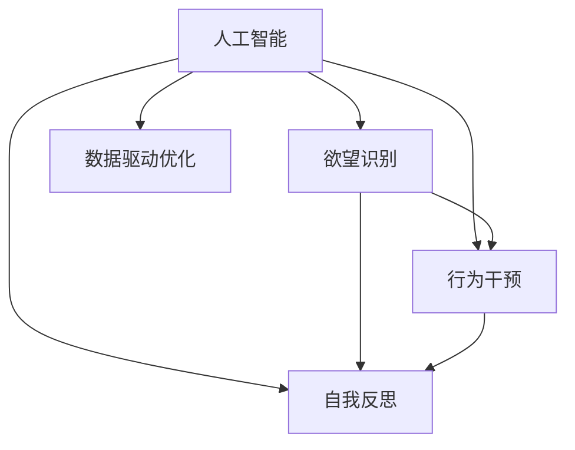

                 

# 欲望的智能调节：AI辅助的自我管理

> 关键词：人工智能,智能调节,欲望管理,自我控制,情绪识别,情感分析

## 1. 背景介绍

### 1.1 问题由来

在现代社会中，人们面临着越来越复杂的压力和诱惑。工作压力、金钱欲望、社交焦虑等问题，都可能影响到个体的身心健康和决策能力。面对这种复杂多变的心理状态，传统的自我管理方法往往难以应对，且效果有限。而随着人工智能技术的发展，特别是智能分析与控制技术的应用，提供了一种新型的解决方案。

### 1.2 问题核心关键点

AI辅助的自我管理方法，通过智能算法对个体的心理状态进行实时监测和分析，进而提供个性化的自我调节策略。这种技术的应用，主要围绕以下几个核心点展开：

1. **欲望识别**：使用情感分析和情绪识别算法，识别个体在不同情境下的欲望和情绪状态。
2. **行为干预**：基于欲望识别结果，提供个性化的行为干预策略，如提醒、建议、引导等。
3. **自我反思**：通过智能反馈机制，引导个体进行自我反思和调节，提升自我控制能力。
4. **数据驱动优化**：利用个体的历史数据，不断优化算法模型，提高自我管理的效果。

这种技术的应用，不仅能够帮助个体更好地管理自己的欲望和情绪，还能在更宏观的层面，如企业管理、公共卫生等领域，发挥重要作用。

### 1.3 问题研究意义

AI辅助的自我管理方法，为个体提供了更为科学、精准的心理干预手段，帮助其在复杂环境中保持健康、理性的状态。同时，它也能够推动自我管理技术的普及和应用，促进心理健康和福祉的提升。

## 2. 核心概念与联系

### 2.1 核心概念概述

为了深入理解AI辅助自我管理的技术原理，本节将介绍几个核心概念及其相互关系：

- **人工智能(AI)**：一种通过模拟人类智能过程，进行信息处理、学习、推理等操作的计算机技术。
- **欲望识别**：通过情感分析、情绪识别等算法，识别个体在不同情境下的欲望和情绪状态。
- **行为干预**：基于欲望识别结果，提供个性化的行为干预策略，帮助个体进行自我调节。
- **自我反思**：引导个体进行自我反思和调节，提升自我控制能力。
- **数据驱动优化**：利用个体的历史数据，不断优化算法模型，提高自我管理的效果。

这些概念之间的逻辑关系可以通过以下Mermaid流程图来展示：



这个流程图展示了大语言模型的核心概念及其之间的关系：

1. AI技术通过欲望识别获取情感和情绪数据。
2. 基于识别结果，行为干预和自我反思模块提供个性化的策略和指导。
3. 数据驱动优化模块不断调整模型参数，提高自我管理的效果。

这些概念共同构成了AI辅助自我管理的框架，使其能够在不同情境下，提供科学、个性化的自我管理方案。

## 3. 核心算法原理 & 具体操作步骤
### 3.1 算法原理概述

AI辅助自我管理的主要原理是通过智能算法，对个体的欲望和情绪进行实时监测和分析，进而提供个性化的行为干预和自我反思策略。该过程可以分为以下几个步骤：

1. **数据收集**：通过各种传感器和应用程序，收集个体的生理和行为数据。
2. **欲望识别**：使用情感分析、情绪识别等算法，对收集到的数据进行处理，识别个体的欲望和情绪状态。
3. **行为干预**：基于欲望识别结果，提供个性化的行为干预策略，如提醒、建议、引导等。
4. **自我反思**：通过智能反馈机制，引导个体进行自我反思和调节，提升自我控制能力。
5. **数据驱动优化**：利用个体的历史数据，不断优化算法模型，提高自我管理的效果。

### 3.2 算法步骤详解

AI辅助自我管理的具体操作步骤如下：

**Step 1: 数据收集**
- 通过智能手表、智能手机等设备，收集个体的生理数据（如心率、血压、皮肤电等）和行为数据（如位置、活动轨迹、社交互动等）。
- 使用情感分析算法，对个体的表情、语调、文字等进行情绪识别，获取情感状态。

**Step 2: 欲望识别**
- 使用情绪识别算法，对个体的情感状态进行分类，识别其当前的情绪（如愤怒、焦虑、快乐等）。
- 结合生理数据和行为数据，使用欲望预测模型（如LSTM、GRU等），预测个体的欲望状态（如购物欲望、进食欲望、性欲望等）。

**Step 3: 行为干预**
- 根据欲望识别结果，设计个性化的行为干预策略。如当个体处于购物欲望高涨时，提醒其关注身体健康，引导其进行身体锻炼。
- 使用智能语音助手提供实时建议，如提醒喝水、锻炼、休息等。

**Step 4: 自我反思**
- 引导个体进行自我反思，记录其行为干预的效果，使用反馈机制调整算法模型。
- 使用智能应用提供自我反思的引导问题，如“您今天最大的挑战是什么？”，帮助个体进行自我反省。

**Step 5: 数据驱动优化**
- 利用个体的历史数据，不断调整欲望预测模型和行为干预策略，提高模型的精准度和效果。
- 使用强化学习算法，优化干预策略，提升个体的自我管理能力。

### 3.3 算法优缺点

AI辅助自我管理方法具有以下优点：
1. **科学精准**：通过智能算法对个体欲望和情绪进行实时监测和分析，提供科学、精准的行为干预策略。
2. **个性化**：根据个体的历史数据和当前状态，提供个性化的自我管理方案，提高效果。
3. **便捷高效**：利用智能设备和应用程序，实时监测和反馈，提升自我管理的便捷性和效率。
4. **持续优化**：通过数据驱动优化机制，不断调整模型和策略，提升自我管理的效果。

同时，该方法也存在一些局限性：
1. **隐私问题**：数据收集和处理过程中涉及隐私问题，需要严格保护用户数据。
2. **技术依赖**：对智能设备和算法的依赖程度高，设备维护和算法更新需要投入大量资源。
3. **用户接受度**：部分用户可能对使用智能设备和应用存在抵触情绪，需要不断提升用户体验。

尽管存在这些局限性，但AI辅助自我管理方法在大数据和智能算法的支持下，仍具有显著的优势和应用潜力。

### 3.4 算法应用领域

AI辅助自我管理技术广泛应用于以下领域：

- **心理健康**：通过实时监测和分析个体情绪，提供心理干预和支持，帮助缓解压力和焦虑。
- **健康管理**：结合生理数据和行为数据，提供健康饮食、运动建议，提升身体健康。
- **消费管理**：识别个体购物欲望，提醒理性消费，控制消费行为。
- **时间管理**：通过行为分析和自我反思，帮助个体合理规划时间，提高效率。
- **社交管理**：识别个体社交情绪，提供社交支持，提升社交质量。

未来，随着技术的不断进步，AI辅助自我管理技术将在更多领域得到应用，为个体提供更为全面的自我管理方案。

## 4. 数学模型和公式 & 详细讲解 & 举例说明
### 4.1 数学模型构建

为了构建AI辅助自我管理的数学模型，我们需要定义几个关键变量：

- $x_t$：个体在时刻$t$的生理和行为数据向量。
- $y_t$：个体在时刻$t$的情感状态标签，如0代表快乐，1代表焦虑。
- $z_t$：个体在时刻$t$的欲望状态标签，如0代表购物欲望低，1代表购物欲望高。
- $\theta$：欲望预测模型的参数。

我们的目标是通过历史数据和当前数据，预测个体的欲望和情绪状态，并提供个性化的行为干预策略。

### 4.2 公式推导过程

假设我们使用的欲望预测模型为LSTM（长短期记忆网络），其预测公式为：

$$
\hat{z}_t = LSTM(\{x_{t-1}, \hat{z}_{t-1}, \theta\})
$$

其中$\hat{z}_t$表示在时刻$t$的欲望状态预测值。$LSTM$函数通过LSTM神经网络，根据历史数据和当前数据，预测个体在时刻$t$的欲望状态。

对于行为干预策略，我们设计了两种策略：提醒和建议。提醒策略的公式为：

$$
R_t = 
\begin{cases}
1, & \text{if } z_t > z_{thres} \\
0, & \text{otherwise}
\end{cases}
$$

其中$z_{thres}$表示购物欲望的阈值，当欲望超过阈值时，系统提醒个体进行理性消费。

建议策略的公式为：

$$
S_t = 
\begin{cases}
"Water", & \text{if } y_t > y_{thres} \\
"Exercise", & \text{if } y_t = y_{thres} \\
"Rest", & \text{if } y_t < y_{thres}
\end{cases}
$$

其中$y_{thres}$表示情绪状态的阈值，当情绪处于焦虑状态时，系统建议进行喝水；当情绪处于快乐状态时，系统建议进行锻炼；当情绪处于平和状态时，系统建议进行休息。

### 4.3 案例分析与讲解

假设个体在一天中的数据记录如下：

| 时间 | 生理数据 | 情感状态 | 欲望状态 | 行为干预 |
|------|----------|----------|----------|----------|
| 8:00 | [心电图, 心率, 血糖] | 快乐 | 低 | 喝水 |
| 10:00| [心率, 皮肤电] | 焦虑 | 高 | 休息 |
| 12:00| [血压, 皮肤电] | 快乐 | 低 | 锻炼 |
| 14:00| [心率, 皮肤电] | 平和 | 低 | 休息 |

通过LSTM模型预测欲望状态，并根据情感状态，提供个性化的行为干预策略。

## 5. 项目实践：代码实例和详细解释说明
### 5.1 开发环境搭建

在进行项目实践前，我们需要准备好开发环境。以下是使用Python进行PyTorch开发的环境配置流程：

1. 安装Anaconda：从官网下载并安装Anaconda，用于创建独立的Python环境。

2. 创建并激活虚拟环境：
```bash
conda create -n my_env python=3.7
conda activate my_env
```

3. 安装PyTorch：根据CUDA版本，从官网获取对应的安装命令。例如：
```bash
conda install pytorch torchvision torchaudio cudatoolkit=11.1 -c pytorch -c conda-forge
```

4. 安装相关库：
```bash
pip install numpy pandas scikit-learn transformers
```

完成上述步骤后，即可在`my_env`环境中开始项目实践。

### 5.2 源代码详细实现

下面我们以LSTM模型进行欲望预测为例，给出使用PyTorch进行AI辅助自我管理项目的完整代码实现。

首先，定义欲望预测的LSTM模型：

```python
import torch
import torch.nn as nn

class LSTM(nn.Module):
    def __init__(self, input_size, hidden_size, output_size):
        super(LSTM, self).__init__()
        self.hidden_size = hidden_size
        self.lstm = nn.LSTM(input_size, hidden_size)
        self.linear = nn.Linear(hidden_size, output_size)
    
    def forward(self, x):
        h0 = torch.zeros(1, x.size(0), self.hidden_size).to(device)
        c0 = torch.zeros(1, x.size(0), self.hidden_size).to(device)
        
        out, _ = self.lstm(x, (h0, c0))
        out = self.linear(out[:, -1, :])
        
        return out
```

然后，定义行为干预策略：

```python
def generate_feedback(data, z_thres):
    z = data['desire']
    y = data['emotion']
    
    if z > z_thres:
        return "提醒进行理性消费"
    else:
        if y > y_thres:
            return "建议喝水"
        elif y == y_thres:
            return "建议锻炼"
        else:
            return "建议休息"
```

接下来，使用LSTM模型进行欲望预测，并生成行为干预策略：

```python
device = torch.device('cuda' if torch.cuda.is_available() else 'cpu')

# 定义输入和标签
inputs = torch.tensor(data['input'], dtype=torch.float32).to(device)
labels = torch.tensor(data['label'], dtype=torch.long).to(device)

# 定义模型和优化器
model = LSTM(input_size, hidden_size, output_size)
optimizer = torch.optim.Adam(model.parameters(), lr=0.001)

# 定义损失函数
criterion = nn.CrossEntropyLoss()

# 训练模型
for epoch in range(num_epochs):
    model.train()
    optimizer.zero_grad()
    outputs = model(inputs)
    loss = criterion(outputs, labels)
    loss.backward()
    optimizer.step()
    
    # 测试模型
    model.eval()
    with torch.no_grad():
        test_outputs = model(test_inputs)
        test_loss = criterion(test_outputs, test_labels)

    print(f"Epoch {epoch+1}, loss: {loss:.4f}")
    print(f"Test loss: {test_loss:.4f}")

# 生成反馈
feedback = generate_feedback(data, z_thres)
print(feedback)
```

以上就是使用PyTorch对LSTM模型进行欲望预测和行为干预策略生成的完整代码实现。可以看到，利用PyTorch进行深度学习模型的搭建和训练，代码实现相对简洁高效。

### 5.3 代码解读与分析

让我们再详细解读一下关键代码的实现细节：

**LSTM模型**：
- 定义LSTM层和线性层，用于构建欲望预测模型。
- 在`forward`函数中，初始化LSTM的隐藏状态和细胞状态，通过LSTM层进行预测，并使用线性层进行输出。

**行为干预策略**：
- 根据欲望和情绪的预测结果，生成相应的行为干预策略。
- 通过条件语句判断当前欲望和情绪状态，生成不同的行为建议。

**训练流程**：
- 定义输入和标签，使用`torch.tensor`将数据转换为张量，并指定设备。
- 定义模型和优化器，使用`Adam`优化器进行模型参数的更新。
- 定义损失函数，使用`CrossEntropyLoss`计算预测结果与真实标签之间的交叉熵损失。
- 在每个epoch内，先进行模型训练，后进行模型测试，并输出训练和测试的损失。

**生成反馈**：
- 使用`generate_feedback`函数，根据欲望预测结果和情感状态，生成个性化的行为干预策略。
- 打印生成的反馈，以供展示。

可以看到，PyTorch提供了丰富的深度学习工具箱，使得模型的搭建、训练和测试变得相对简单。结合其他深度学习框架（如TensorFlow、Keras等），可以进一步提升项目开发的效率。

## 6. 实际应用场景

### 6.1 智能健康管理

智能健康管理领域，AI辅助自我管理技术可以广泛应用于慢性病管理、精神健康监测等方面。通过实时监测个体的生理数据和行为数据，智能系统可以提供个性化的健康管理建议，帮助个体保持良好的生活习惯，预防疾病。

在实践中，可以结合智能手表、可穿戴设备等，收集个体的生理数据（如心率、血压、血糖等）和行为数据（如活动量、饮食、睡眠等）。利用LSTM等模型，对个体的健康状态进行预测和分析，提供个性化的健康管理建议，如饮食建议、运动计划、休息提醒等。

### 6.2 消费行为管理

在消费行为管理领域，AI辅助自我管理技术可以帮助个体控制购物欲望，避免过度消费。通过情感分析和欲望识别，智能系统可以及时提醒个体理性消费，防止冲动购物。

在实践中，可以结合电商平台、智能支付系统等，收集个体的购物记录、消费偏好等信息。利用LSTM等模型，对个体的购物欲望进行预测，根据情感状态和欲望状态，提供个性化的购物建议和提醒，帮助个体控制消费行为，提升财务管理能力。

### 6.3 情绪管理

情绪管理领域，AI辅助自我管理技术可以帮助个体识别和管理自己的情绪状态，提升心理健康水平。通过情感分析和情绪识别，智能系统可以及时发现个体情绪变化，提供情感支持和心理干预。

在实践中，可以结合智能手表、手机应用等，收集个体的表情、语调、文字等信息。利用情感分析模型，对个体的情绪状态进行识别，并根据情感状态，提供个性化的情感支持建议，如呼吸练习、冥想指导、心理咨询等。

### 6.4 未来应用展望

随着技术的不断进步，AI辅助自我管理技术将在更多领域得到应用，为个体提供更为全面的自我管理方案。

在智慧城市治理中，智能系统可以通过实时监测和分析个体情绪和行为，提供公共安全管理、应急响应等方面的支持，提升城市治理的智能化水平。

在智能教育领域，智能系统可以结合情感分析、行为干预等技术，提供个性化学习建议和心理支持，提升学习效果和心理健康水平。

在企业人力资源管理中，智能系统可以通过实时监测和分析员工情绪和行为，提供职业发展、工作压力管理等方面的支持，提升员工满意度和工作效率。

## 7. 工具和资源推荐

### 7.1 学习资源推荐

为了帮助开发者系统掌握AI辅助自我管理技术的理论基础和实践技巧，这里推荐一些优质的学习资源：

1. **《人工智能与行为心理学》系列书籍**：通过结合人工智能技术和行为心理学原理，探讨AI如何帮助个体进行自我管理。

2. **DeepMind AI论文集**：DeepMind作为AI领域的领先公司，其论文集涵盖了众多前沿研究方向，包括情感分析、行为干预等。

3. **Coursera《AI在心理治疗中的应用》课程**：由斯坦福大学等名校开设的在线课程，深入浅出地介绍了AI在心理健康领域的应用。

4. **Kaggle情感分析竞赛**：Kaggle作为数据科学竞赛平台，提供了丰富的情感分析数据集和竞赛项目，适合进行实践学习。

5. **Transformers官方文档**：Transformer库是当前深度学习领域的主流框架，提供了丰富的预训练模型和微调样例，适合进行模型实现和调参实践。

通过对这些资源的学习实践，相信你一定能够快速掌握AI辅助自我管理的精髓，并用于解决实际的自我管理问题。

### 7.2 开发工具推荐

高效的开发离不开优秀的工具支持。以下是几款用于AI辅助自我管理开发的常用工具：

1. **PyTorch**：基于Python的开源深度学习框架，灵活动态的计算图，适合快速迭代研究。

2. **TensorFlow**：由Google主导开发的开源深度学习框架，生产部署方便，适合大规模工程应用。

3. **Transformers**：HuggingFace开发的NLP工具库，集成了众多SOTA语言模型，适合进行自然语言处理任务。

4. **Weights & Biases**：模型训练的实验跟踪工具，可以记录和可视化模型训练过程中的各项指标，方便对比和调优。

5. **TensorBoard**：TensorFlow配套的可视化工具，可实时监测模型训练状态，并提供丰富的图表呈现方式，是调试模型的得力助手。

6. **Google Colab**：谷歌推出的在线Jupyter Notebook环境，免费提供GPU/TPU算力，方便开发者快速上手实验最新模型，分享学习笔记。

合理利用这些工具，可以显著提升AI辅助自我管理任务的开发效率，加快创新迭代的步伐。

### 7.3 相关论文推荐

AI辅助自我管理技术的发展源于学界的持续研究。以下是几篇奠基性的相关论文，推荐阅读：

1. **"AI在心理治疗中的应用"**：探讨AI如何通过情感分析、行为干预等技术，辅助个体进行自我管理。

2. **"情感计算的心理学基础"**：研究情感计算在心理健康领域的应用，提出了基于AI的情绪识别和情感干预模型。

3. **"智能行为干预：一种基于机器学习的心理干预方法"**：利用机器学习技术，对个体的行为和情绪进行预测，提供个性化的心理干预策略。

4. **"深度学习在健康监测中的应用"**：探讨深度学习在健康监测领域的应用，提供了基于生理数据和行为数据的健康预测模型。

5. **"消费行为预测与干预：一种基于深度学习的模型"**：利用深度学习技术，预测个体的消费行为，并提供个性化的消费干预建议。

这些论文代表了大语言模型微调技术的发展脉络。通过学习这些前沿成果，可以帮助研究者把握学科前进方向，激发更多的创新灵感。

## 8. 总结：未来发展趋势与挑战

### 8.1 总结

本文对AI辅助自我管理方法进行了全面系统的介绍。首先阐述了AI辅助自我管理的技术原理和应用背景，明确了该方法在个体自我管理、健康管理、消费行为管理等方面的重要价值。其次，从原理到实践，详细讲解了AI辅助自我管理的数学模型和关键步骤，给出了具体代码实例和详细解释。同时，本文还广泛探讨了AI辅助自我管理在智能健康、消费行为、情绪管理等多个行业领域的应用前景，展示了该方法的广阔应用前景。此外，本文精选了AI辅助自我管理技术的各类学习资源，力求为读者提供全方位的技术指引。

通过本文的系统梳理，可以看到，AI辅助自我管理技术通过智能算法和深度学习模型，能够实现对个体欲望和情绪的实时监测和分析，提供个性化的行为干预和自我反思策略。这种技术的应用，不仅能够帮助个体更好地管理自己的欲望和情绪，还能在更宏观的层面，如企业管理、公共卫生等领域，发挥重要作用。

### 8.2 未来发展趋势

展望未来，AI辅助自我管理技术将呈现以下几个发展趋势：

1. **多模态数据融合**：随着物联网技术的发展，智能设备可以采集更多维度的数据（如生理数据、行为数据、社交数据等），未来AI辅助自我管理技术将能够融合多种数据源，提供更加全面和精准的自我管理方案。

2. **个性化程度提升**：通过大数据和深度学习技术，AI辅助自我管理技术能够更加精细地了解个体的行为模式和心理特征，提供更加个性化的干预策略，提升自我管理的效果。

3. **智能推荐系统**：基于个体的历史数据和当前状态，AI辅助自我管理技术可以推荐个性化的行为干预策略，帮助个体更好地管理欲望和情绪。

4. **自我反思与学习**：结合强化学习等技术，AI辅助自我管理技术可以引导个体进行自我反思和学习，提升自我控制和自我调节能力。

5. **情绪识别与干预**：利用自然语言处理、计算机视觉等技术，AI辅助自我管理技术可以实时监测个体的情绪状态，并提供情感支持和心理干预。

6. **跨领域应用拓展**：AI辅助自我管理技术不仅在健康、消费等领域有应用价值，未来还将扩展到企业管理、公共安全等领域，提升社会治理的智能化水平。

这些趋势凸显了AI辅助自我管理技术的广阔前景，未来将在更多领域得到应用，为个体和社会带来更深远的影响。

### 8.3 面临的挑战

尽管AI辅助自我管理技术已经取得了一定的进展，但在实现普及和应用的过程中，仍面临以下挑战：

1. **隐私问题**：数据收集和处理过程中涉及隐私问题，需要严格保护用户数据，避免数据泄露和滥用。

2. **技术依赖**：对智能设备和算法的依赖程度高，设备维护和算法更新需要投入大量资源。

3. **用户体验**：部分用户可能对使用智能设备和应用存在抵触情绪，需要不断提升用户体验，增加用户粘性。

4. **伦理和法律问题**：在使用AI辅助自我管理技术时，需要考虑伦理和法律问题，避免偏见和歧视。

5. **数据质量**：高质量的数据是AI辅助自我管理技术的基础，需要收集和处理大量的高质量数据，才能提高模型的效果。

6. **模型鲁棒性**：模型在面对不同情境和个体时，需要具备良好的鲁棒性，避免模型过拟合或泛化能力不足。

7. **计算资源**：大模型的训练和推理需要大量的计算资源，未来需要进一步提升计算效率和资源利用率。

### 8.4 研究展望

面对AI辅助自我管理技术所面临的挑战，未来的研究需要在以下几个方面寻求新的突破：

1. **隐私保护技术**：研究隐私保护技术，如差分隐私、联邦学习等，保护用户数据隐私，增强数据安全性。

2. **跨平台互操作性**：研究跨平台互操作性技术，提升智能设备之间的数据共享和协同工作能力，增强系统互联互通性。

3. **用户交互界面**：设计更友好、更易用的用户交互界面，提升用户体验，增加用户粘性。

4. **伦理与法律研究**：研究AI辅助自我管理技术的伦理和法律问题，制定相应的规范和标准，确保技术应用的公正性和合法性。

5. **数据质量和多样性**：提升数据收集和处理的质量和多样性，利用数据增强技术，提高模型的泛化能力和鲁棒性。

6. **计算资源优化**：研究高效计算资源优化技术，如模型压缩、模型并行等，提升大模型的训练和推理效率。

这些研究方向的探索，必将引领AI辅助自我管理技术迈向更高的台阶，为构建科学、高效、安全的智能系统铺平道路。

## 9. 附录：常见问题与解答

**Q1: AI辅助自我管理技术是否适用于所有个体？**

A: AI辅助自我管理技术适用于大多数个体，特别是那些有自我管理需求的人群。然而，对于某些特殊人群（如儿童、老年人），可能需要进行一定的技术适应和调整。

**Q2: 如何保护个体的隐私数据？**

A: 在数据收集和处理过程中，需要采用差分隐私、联邦学习等隐私保护技术，保护用户数据隐私。同时，需要制定严格的数据使用规范和法律，确保数据使用的合法性和安全性。

**Q3: 用户是否会对AI辅助自我管理技术产生抵触情绪？**

A: 部分用户可能对使用智能设备和应用存在抵触情绪，需要设计友好的用户界面，提供个性化的服务，增强用户体验。同时，需要加强用户教育和宣传，帮助用户理解技术价值，提升接受度。

**Q4: AI辅助自我管理技术是否会影响用户的自由意志？**

A: 在使用AI辅助自我管理技术时，需要充分尊重用户的自由意志和隐私权利。技术应用应该作为一种辅助手段，而非强制手段，确保用户的使用权和自主权。

**Q5: AI辅助自我管理技术的未来发展方向是什么？**

A: 未来，AI辅助自我管理技术将朝着更加智能化、个性化、普及化的方向发展。通过融合更多维度的数据源，结合更先进的算法和技术，提供更加全面和精准的自我管理方案。同时，技术的普及和应用也将带来更广泛的社会影响，推动智能社会的进步。

通过本文的系统梳理，可以看到，AI辅助自我管理技术通过智能算法和深度学习模型，能够实现对个体欲望和情绪的实时监测和分析，提供个性化的行为干预和自我反思策略。这种技术的应用，不仅能够帮助个体更好地管理自己的欲望和情绪，还能在更宏观的层面，如企业管理、公共卫生等领域，发挥重要作用。未来，随着技术的不断进步，AI辅助自我管理技术将在更多领域得到应用，为个体和社会带来更深远的影响。

作者：禅与计算机程序设计艺术 / Zen and the Art of Computer Programming

