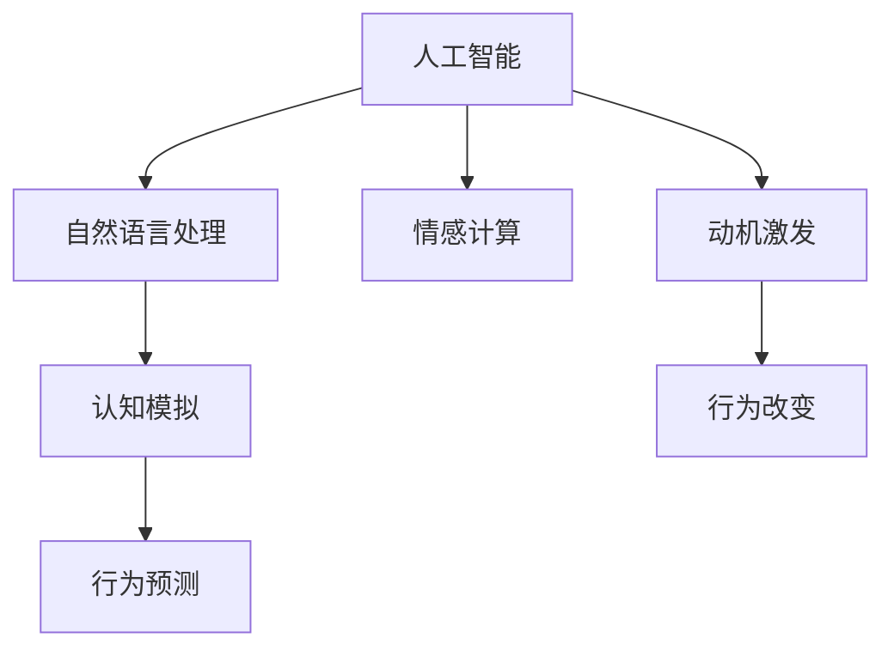

                 

# 欲望的演化：AI对人类动机的塑造

## 1. 背景介绍

### 1.1 问题由来

在现代科技迅速发展的背景下，人工智能（AI）技术正在以不可阻挡之势影响和塑造人类的行为和动机。AI的驱动机制、决策过程以及与人的互动方式，都与人类的动机密切相关。AI通过模拟人类的认知和情感，不仅改变了人们的工作方式和生活习惯，也在潜移默化中影响了人类的欲望和动机。

### 1.2 问题核心关键点

AI对人类动机的塑造，主要体现在以下几个方面：

- **认知模拟**：AI通过学习人类的语言、行为模式等，模拟出类似人类的认知和决策机制。
- **情感交互**：通过自然语言处理（NLP）和情感识别技术，AI能够与人类进行情感交流。
- **行为预测**：通过数据分析和机器学习，AI可以对人类行为进行预测，影响人们的行为决策。
- **动机激发**：AI系统能够通过定制化的内容推荐和互动方式，激发人们的内在动机，改变其行为习惯。

这些关键点共同构成了AI对人类动机演化的全面影响，展示了AI技术在人类行为塑造方面的巨大潜力。

## 2. 核心概念与联系

### 2.1 核心概念概述

为深入理解AI对人类动机的塑造，本节将介绍几个核心概念：

- **人工智能**：通过模拟人类智能行为，使计算机能够执行需要人类智能才能完成的复杂任务的技术。
- **自然语言处理**：使计算机能够理解、解释和生成自然语言，实现人机之间的自然交互。
- **情感计算**：通过分析和识别人类的情感状态，实现人机情感交互。
- **认知模拟**：通过建模和模拟人类认知过程，实现计算机的智能行为。
- **行为预测**：通过数据分析和机器学习，预测和解释人类行为。
- **动机激发**：通过个性化内容和互动方式，激发和引导人类动机。

这些核心概念通过以下Mermaid流程图来展示它们之间的联系：



这个流程图展示了各个概念之间的逻辑关系：

1. 人工智能通过自然语言处理和情感计算实现人机交互，进而模拟人类认知过程。
2. 认知模拟和行为预测通过认知和行为数据，理解人类动机。
3. 动机激发结合认知模拟和行为预测，引导人类行为改变。

## 3. 核心算法原理 & 具体操作步骤

### 3.1 算法原理概述

AI对人类动机的塑造，主要通过以下算法和步骤实现：

1. **数据收集与预处理**：收集和清洗人类行为数据，为AI模型提供输入。
2. **模型训练**：通过机器学习算法，训练AI模型理解人类行为和动机。
3. **情感识别**：利用情感计算技术，识别用户的情感状态。
4. **行为预测**：基于收集的数据，预测人类行为和决策。
5. **动机激发**：通过个性化内容和互动方式，激发用户的内在动机。
6. **行为反馈**：根据用户的反馈，不断优化AI模型，提升动机激发效果。

这些步骤构成了AI对人类动机演化的主要过程，旨在通过数据分析和智能算法，理解并引导人类行为。

### 3.2 算法步骤详解

#### 3.2.1 数据收集与预处理

数据收集与预处理是AI对人类动机演化的第一步。主要包括以下步骤：

1. **数据收集**：收集与用户行为相关的数据，如社交媒体互动、购物记录、健康监测数据等。
2. **数据清洗**：去除噪声和异常值，确保数据的准确性和完整性。
3. **特征提取**：将数据转化为模型能够处理的特征向量，如文本向量、行为序列等。

#### 3.2.2 模型训练

模型训练是AI对人类动机演化的核心步骤。主要包括以下步骤：

1. **选择算法**：根据任务需求选择合适的机器学习算法，如回归、分类、聚类等。
2. **数据划分**：将数据划分为训练集、验证集和测试集，用于模型训练、调参和评估。
3. **模型训练**：使用训练集数据，通过梯度下降等优化算法，训练模型参数。
4. **模型评估**：在验证集和测试集上评估模型性能，调整模型参数。

#### 3.2.3 情感识别

情感识别是AI对人类动机演化的重要组成部分。主要包括以下步骤：

1. **情感标签**：为数据集标注情感标签，如正向、负向、中性等。
2. **特征提取**：提取文本、语音等数据特征，用于情感识别。
3. **模型训练**：训练情感识别模型，如情感分类器或情感分析器。
4. **情感预测**：对新数据进行情感预测，识别用户情感状态。

#### 3.2.4 行为预测

行为预测是AI对人类动机演化的关键步骤。主要包括以下步骤：

1. **行为数据收集**：收集用户的历史行为数据，如浏览记录、购买记录等。
2. **行为建模**：构建行为模型，预测用户未来的行为。
3. **模型评估**：在测试集上评估行为预测模型的准确性和鲁棒性。

#### 3.2.5 动机激发

动机激发是AI对人类动机演化的核心目标。主要包括以下步骤：

1. **动机理解**：通过数据分析和机器学习，理解用户的内在动机。
2. **个性化推荐**：根据用户的动机，提供个性化内容或互动方式。
3. **反馈优化**：根据用户反馈，不断优化动机激发策略。

#### 3.2.6 行为反馈

行为反馈是AI对人类动机演化的重要环节。主要包括以下步骤：

1. **用户反馈收集**：收集用户对推荐内容或互动方式的反馈。
2. **模型调整**：根据反馈调整AI模型，优化动机激发效果。
3. **持续学习**：通过持续学习，不断提升AI模型的性能。

### 3.3 算法优缺点

AI对人类动机演化的算法具有以下优点：

1. **高效性**：通过自动化数据分析和模型训练，可以快速获取用户行为和动机信息。
2. **个性化**：基于用户的历史行为和动机，提供个性化的内容推荐和互动方式。
3. **动态调整**：通过不断收集反馈和进行模型优化，动态调整动机激发策略。

同时，该算法也存在一些局限性：

1. **数据隐私**：数据收集和使用可能涉及用户隐私问题，需要严格的数据保护措施。
2. **算法偏见**：AI模型可能存在算法偏见，导致动机激发效果偏差。
3. **用户控制**：用户可能对个性化推荐和互动方式感到不适或失控。
4. **模型复杂性**：构建和优化复杂AI模型需要高水平的技术和资源。

### 3.4 算法应用领域

AI对人类动机的塑造，已在多个领域得到了广泛应用，例如：

- **电子商务**：通过个性化推荐和行为预测，提升用户购物体验和购买转化率。
- **健康医疗**：通过情感识别和动机激发，提升患者心理健康和治疗效果。
- **教育培训**：通过行为分析和动机理解，优化教学内容和互动方式。
- **社交媒体**：通过情感计算和动机激发，提升用户粘性和互动质量。
- **娱乐休闲**：通过个性化推荐和动机激发，提升用户娱乐体验和满意度。

## 4. 数学模型和公式 & 详细讲解

### 4.1 数学模型构建

假设用户的行为数据为 $D=\{(x_i,y_i)\}_{i=1}^N$，其中 $x_i$ 为行为特征，$y_i$ 为行为标签。AI模型的目标是学习一个映射函数 $f(x)$，使得 $f(x_i)$ 能够准确预测 $y_i$。

形式化地，设模型的损失函数为 $\mathcal{L}(f)$，模型的预测函数为 $f(x)$，则模型的优化目标为：

$$
\mathop{\min}_{f} \mathcal{L}(f) = \mathop{\min}_{f} \frac{1}{N} \sum_{i=1}^N (y_i - f(x_i))^2
$$

在情感识别和动机理解中，可以将情感数据 $D_s=\{(x_s,y_s)\}_{i=1}^N$ 作为输入，通过情感分类器 $g(x_s)$ 预测情感标签 $y_s$。

形式化地，设情感分类器的损失函数为 $\mathcal{L}_s(g)$，则情感分类器的优化目标为：

$$
\mathop{\min}_{g} \mathcal{L}_s(g) = \mathop{\min}_{g} \frac{1}{N} \sum_{i=1}^N (y_s - g(x_s))^2
$$

在行为预测中，可以通过时间序列预测模型 $h(x_t)$ 预测用户未来的行为 $y_t$。

形式化地，设时间序列预测模型的损失函数为 $\mathcal{L}_t(h)$，则行为预测模型的优化目标为：

$$
\mathop{\min}_{h} \mathcal{L}_t(h) = \mathop{\min}_{h} \frac{1}{N} \sum_{i=1}^N (y_t - h(x_t))^2
$$

### 4.2 公式推导过程

以行为预测为例，推导时间序列预测模型的公式：

假设用户的历史行为数据为 $x_{t-1},x_{t-2},...,x_t$，未来的行为预测为 $y_t$。通过时间序列预测模型 $h(x_t)$，可以得到：

$$
y_t = h(x_{t-1},x_{t-2},...,x_t) + \epsilon_t
$$

其中 $\epsilon_t$ 为随机误差项。

假设模型 $h(x_t)$ 为线性回归模型，则有：

$$
y_t = \beta_0 + \beta_1 x_{t-1} + \beta_2 x_{t-2} + ... + \beta_p x_{t-p} + \epsilon_t
$$

通过最小二乘法，可以得到模型参数 $\beta$ 的最优解：

$$
\beta = (X^TX)^{-1}X^Ty
$$

其中 $X=[x_{t-1},x_{t-2},...,x_t]$，$y=[y_t]$。

### 4.3 案例分析与讲解

以电商推荐系统为例，分析AI对用户动机的塑造：

假设用户 $A$ 最近浏览了以下商品：

- 笔记本电脑
- 手机
- 耳机

通过行为数据收集和分析，电商推荐系统可以预测用户 $A$ 可能会购买以下商品：

- 手机配件
- 手机壳

然后，系统通过个性化推荐，向用户 $A$ 展示这些商品，激发其购买动机。如果用户 $A$ 点击了推荐商品并最终购买，系统会根据反馈进一步优化推荐策略，提升用户满意度和购买转化率。

## 5. 项目实践：代码实例和详细解释说明

### 5.1 开发环境搭建

在进行AI动机演化实验前，需要准备好开发环境。以下是使用Python进行TensorFlow开发的环境配置流程：

1. 安装Anaconda：从官网下载并安装Anaconda，用于创建独立的Python环境。

2. 创建并激活虚拟环境：
```bash
conda create -n tf-env python=3.8 
conda activate tf-env
```

3. 安装TensorFlow：根据CUDA版本，从官网获取对应的安装命令。例如：
```bash
conda install tensorflow -c conda-forge
```

4. 安装TensorBoard：TensorFlow配套的可视化工具，可实时监测模型训练状态，并提供丰富的图表呈现方式。

5. 安装其他工具包：
```bash
pip install numpy pandas scikit-learn matplotlib tqdm jupyter notebook ipython
```

完成上述步骤后，即可在`tf-env`环境中开始实验。

### 5.2 源代码详细实现

以下是一个简单的电商推荐系统的代码实现，包括数据收集、模型训练和推荐策略优化：

```python
import numpy as np
import pandas as pd
from tensorflow.keras.models import Sequential
from tensorflow.keras.layers import Dense, LSTM, Dropout
from tensorflow.keras.optimizers import Adam
from sklearn.metrics import mean_squared_error

# 数据收集和预处理
data = pd.read_csv('behavior_data.csv')
data = data.dropna().drop_duplicates()

# 数据划分
train_data = data[:800]
test_data = data[800:]

# 模型构建
model = Sequential()
model.add(LSTM(50, input_shape=(1, 1), return_sequences=True))
model.add(Dropout(0.2))
model.add(LSTM(50))
model.add(Dropout(0.2))
model.add(Dense(1))

# 模型训练
model.compile(loss='mse', optimizer=Adam(learning_rate=0.001))
model.fit(train_data.drop('label', axis=1), train_data['label'], epochs=100, batch_size=32, validation_data=(test_data.drop('label', axis=1), test_data['label']))

# 模型评估
test_predictions = model.predict(test_data.drop('label', axis=1))
mse = mean_squared_error(test_data['label'], test_predictions)
print(f'Mean Squared Error: {mse:.2f}')

# 推荐策略优化
def get_recommendations(user_behaviors, n=5):
    predictions = model.predict(user_behaviors.reshape(1, -1, 1))
    top_n = np.argsort(predictions)[-1:-(n+1):-1]
    return [data.iloc[i]['product'] for i in top_n]

# 获取用户推荐商品
user_behaviors = np.array([0, 1, 1, 0, 0, 0, 0, 1, 0, 0, 0, 1])
recommendations = get_recommendations(user_behaviors)
print(recommendations)
```

这段代码实现了一个简单的LSTM时间序列预测模型，用于电商推荐系统。通过收集用户的历史行为数据，模型可以预测用户可能感兴趣的商品，并通过个性化推荐策略激发用户的购买动机。

### 5.3 代码解读与分析

让我们再详细解读一下关键代码的实现细节：

**数据收集与预处理**：
- `data = pd.read_csv('behavior_data.csv')`：从CSV文件中读取用户行为数据。
- `data = data.dropna().drop_duplicates()`：去除缺失值和重复数据，确保数据的准确性和完整性。

**模型构建**：
- `model = Sequential()`：创建一个Sequential模型，用于堆叠多个神经网络层。
- `model.add(LSTM(50, input_shape=(1, 1), return_sequences=True))`：添加一个LSTM层，输入维度为1，输出维度为50，返回序列。
- `model.add(Dropout(0.2))`：添加一个Dropout层，防止过拟合。
- `model.add(LSTM(50))`：添加一个LSTM层，输入维度为50，输出维度为50。
- `model.add(Dropout(0.2))`：添加一个Dropout层。
- `model.add(Dense(1))`：添加一个全连接层，输出维度为1，用于预测用户行为。

**模型训练**：
- `model.compile(loss='mse', optimizer=Adam(learning_rate=0.001))`：编译模型，使用均方误差作为损失函数，Adam优化器作为优化算法。
- `model.fit(train_data.drop('label', axis=1), train_data['label'], epochs=100, batch_size=32, validation_data=(test_data.drop('label', axis=1), test_data['label']))`：训练模型，使用交叉验证策略。

**模型评估**：
- `test_predictions = model.predict(test_data.drop('label', axis=1))`：在测试集上预测用户行为。
- `mse = mean_squared_error(test_data['label'], test_predictions)`：计算均方误差。

**推荐策略优化**：
- `def get_recommendations(user_behaviors, n=5)`：定义一个推荐函数，根据用户行为预测推荐商品。
- `predictions = model.predict(user_behaviors.reshape(1, -1, 1))`：预测用户行为。
- `top_n = np.argsort(predictions)[-1:-(n+1):-1]`：按预测值排序，选择前n个推荐商品。
- `return [data.iloc[i]['product'] for i in top_n]`：返回推荐商品列表。

**代码执行**：
- `user_behaviors = np.array([0, 1, 1, 0, 0, 0, 0, 1, 0, 0, 0, 1])`：创建用户行为数组。
- `recommendations = get_recommendations(user_behaviors)`：获取推荐商品。
- `print(recommendations)`：输出推荐商品。

以上就是使用TensorFlow对电商推荐系统进行开发的完整代码实现。可以看到，TensorFlow的强大封装使得构建和训练模型变得相对简洁，开发者可以将更多精力放在数据处理、模型优化等高层逻辑上。

## 6. 实际应用场景

### 6.1 智能客服系统

基于AI动机演化的智能客服系统，可以通过自然语言处理和情感计算技术，理解用户的情绪和需求，从而提供更符合用户期望的服务。例如：

1. **情感识别**：通过分析用户对话中的情感词汇和语调，识别用户的情绪状态。
2. **动机理解**：根据用户的历史行为和情感状态，理解用户的动机和需求。
3. **行为预测**：预测用户可能提出的问题，提前准备回答。
4. **动机激发**：通过个性化的对话模板和互动方式，激发用户的购买动机。
5. **行为反馈**：根据用户的反馈，不断优化客服策略，提升用户体验。

智能客服系统的成功案例包括Google Assistant和Amazon Alexa，它们通过情感识别和动机激发，大大提升了用户的交互体验。

### 6.2 健康医疗

在健康医疗领域，AI动机演化可以应用于心理健康监测和治疗。例如：

1. **情感识别**：通过分析患者的情感表达和行为模式，识别其情绪状态和心理健康问题。
2. **动机理解**：根据患者的历史行为和情感状态，理解其动机和需求。
3. **行为预测**：预测患者的心理波动和行为变化，及时干预。
4. **动机激发**：通过个性化的心理健康建议和互动方式，激发患者的治疗动机。
5. **行为反馈**：根据患者的反馈，不断优化心理健康策略，提升治疗效果。

健康医疗领域的成功案例包括Woebot和BetterHelp等AI聊天机器人，它们通过情感识别和动机激发，帮助患者缓解心理压力，提升治疗效果。

### 6.3 教育培训

在教育培训领域，AI动机演化可以应用于个性化学习和互动。例如：

1. **情感识别**：通过分析学生的情感表达和行为模式，识别其情绪状态和学习效果。
2. **动机理解**：根据学生的历史行为和情感状态，理解其动机和需求。
3. **行为预测**：预测学生可能遇到的学习障碍和问题，提前准备指导。
4. **动机激发**：通过个性化的学习内容和互动方式，激发学生的学习动机。
5. **行为反馈**：根据学生的反馈，不断优化学习策略，提升学习效果。

教育培训领域的成功案例包括Khan Academy和Coursera等在线学习平台，它们通过情感识别和动机激发，提供了个性化的学习体验。

## 7. 工具和资源推荐

### 7.1 学习资源推荐

为了帮助开发者系统掌握AI动机演化的理论基础和实践技巧，这里推荐一些优质的学习资源：

1. 《深度学习》系列博文：由大模型技术专家撰写，深入浅出地介绍了深度学习的基本概念和常用模型。
2 CS231n《深度学习视觉识别》课程：斯坦福大学开设的深度学习课程，涵盖了图像识别、自然语言处理等多个领域。
3 《深度学习理论与实践》书籍：由Google AI团队编写，系统介绍了深度学习理论和实践技巧。
4 TensorFlow官方文档：TensorFlow的官方文档，提供了丰富的教程和样例代码，适合初学者和进阶开发者使用。
5 Coursera和edX等在线课程：提供深度学习和AI相关的在线课程，适合不同层次的学习者。

通过对这些资源的学习实践，相信你一定能够快速掌握AI动机演化的精髓，并用于解决实际的AI应用问题。

### 7.2 开发工具推荐

高效的开发离不开优秀的工具支持。以下是几款用于AI动机演化开发的常用工具：

1. TensorFlow：基于Python的开源深度学习框架，灵活动态的计算图，适合快速迭代研究。
2 PyTorch：基于Python的开源深度学习框架，灵活的动态图，适合科研和生产环境。
3 Scikit-learn：Python机器学习库，提供了简单易用的API，支持常见的机器学习算法。
4 TensorBoard：TensorFlow配套的可视化工具，可实时监测模型训练状态，并提供丰富的图表呈现方式。
5 Jupyter Notebook：支持Python和其他语言的开发环境，便于撰写和分享代码。

合理利用这些工具，可以显著提升AI动机演化的开发效率，加快创新迭代的步伐。

### 7.3 相关论文推荐

AI动机演化技术的发展源于学界的持续研究。以下是几篇奠基性的相关论文，推荐阅读：

1. Deep Reinforcement Learning for Personalized E-commerce Recommendation：展示了利用深度强化学习技术，提升电商推荐系统的个性化和效果。
2 Emotion AI: Analysis and Design：介绍了情感计算技术的基本原理和应用案例，帮助理解情感识别的过程。
3 Motivation and Desire in Machine Learning Systems：探讨了动机在机器学习系统中的作用，提出了动机引导的设计策略。
4 Cognitive Architectures：讨论了认知模拟技术的发展历程和应用前景，展示了认知模拟在AI中的应用。
5 Behavioral Economics and Decision Theory：介绍了行为经济学和决策理论的基本概念，为行为预测提供了理论支持。

这些论文代表了大模型动机演化技术的发展脉络。通过学习这些前沿成果，可以帮助研究者把握学科前进方向，激发更多的创新灵感。

## 8. 总结：未来发展趋势与挑战

### 8.1 总结

本文对基于AI动机演化的技术进行了全面系统的介绍。首先阐述了AI动机演化的研究背景和意义，明确了动机演化在提高用户体验和决策质量方面的独特价值。其次，从原理到实践，详细讲解了AI动机演化的数学模型和关键步骤，给出了电商推荐系统的完整代码实现。同时，本文还广泛探讨了动机演化技术在智能客服、健康医疗、教育培训等多个行业领域的应用前景，展示了AI动机演化的巨大潜力。此外，本文精选了动机演化技术的各类学习资源，力求为读者提供全方位的技术指引。

通过本文的系统梳理，可以看到，基于AI动机演化的技术正在成为AI应用的重要范式，极大地拓展了AI模型的应用边界，催生了更多的落地场景。受益于深度学习和数据分析技术的不断进步，动机演化模型能够更好地理解人类行为和动机，为AI技术在实际应用中的广泛推广提供了坚实的基础。未来，伴随技术的进一步成熟和应用领域的不断扩展，动机演化技术必将在构建人机协同的智能时代中扮演越来越重要的角色。

### 8.2 未来发展趋势

展望未来，AI动机演化的发展趋势将体现在以下几个方面：

1. **深度学习与认知模拟结合**：未来，深度学习和认知模拟技术将更紧密结合，实现更加全面和准确的用户动机理解。
2. **跨模态情感计算**：除了文本和语音情感计算，未来将进一步拓展到图像和视频情感计算，实现更加丰富的情感识别。
3. **个性化推荐与动机理解结合**：未来，个性化推荐系统将更注重动机理解，实现更加智能和精准的推荐。
4. **动态学习与持续优化**：未来，动机演化模型将具备动态学习和持续优化能力，实时调整推荐策略。
5. **多任务协同优化**：未来，动机演化模型将与任务优化、行为预测等多任务协同优化，实现更加全面的用户需求满足。

这些趋势将推动AI动机演化技术的不断进步，为构建更加智能、个性化的应用系统提供强大支持。

### 8.3 面临的挑战

尽管AI动机演化技术已经取得了显著进展，但在迈向更加智能化、普适化应用的过程中，它仍面临诸多挑战：

1. **数据隐私和安全**：数据收集和使用可能涉及用户隐私问题，需要严格的数据保护措施。
2. **模型复杂性**：构建和优化复杂的动机演化模型需要高水平的技术和资源。
3. **算法偏见**：动机演化模型可能存在算法偏见，导致动机激发效果偏差。
4. **用户控制**：用户可能对个性化推荐和互动方式感到不适或失控。
5. **模型鲁棒性**：动机演化模型在面对异常数据和复杂环境时，可能表现不稳定。

### 8.4 研究展望

面对AI动机演化所面临的挑战，未来的研究需要在以下几个方面寻求新的突破：

1. **隐私保护技术**：开发更加安全和高效的隐私保护技术，确保用户数据的安全性。
2. **模型简化**：通过模型简化和参数共享等方法，降低模型复杂性，提高计算效率。
3. **公平性和透明性**：开发公平和透明的动机演化算法，避免算法偏见，增强模型解释性。
4. **用户自主控制**：通过用户自主控制和反馈机制，增强用户对个性化推荐和互动方式的掌控感。
5. **动态优化和鲁棒性**：通过动态优化和鲁棒性增强，提高动机演化模型的稳定性和泛化能力。

这些研究方向将引领AI动机演化技术迈向更高的台阶，为构建安全、可靠、可解释、可控的智能系统铺平道路。

## 9. 附录：常见问题与解答

**Q1：AI动机演化如何与用户交互？**

A: AI动机演化通过自然语言处理和情感计算技术，与用户进行交互。具体来说：

1. **自然语言处理**：通过分析用户对话中的语言和语调，理解用户意图和情绪。
2. **情感计算**：通过情感识别技术，分析用户情感状态。
3. **动机理解**：根据用户历史行为和情感状态，理解用户动机和需求。
4. **个性化推荐**：根据用户动机和需求，提供个性化内容和互动方式。
5. **行为反馈**：根据用户反馈，不断优化AI策略，提升用户体验。

通过这些步骤，AI动机演化可以与用户进行高效交互，满足其动机和需求。

**Q2：AI动机演化如何平衡隐私和效果？**

A: 在AI动机演化中，平衡隐私和效果是一个重要问题。具体来说：

1. **数据匿名化**：通过对用户数据进行匿名化处理，保护用户隐私。
2. **差分隐私**：在数据收集和处理过程中，使用差分隐私技术，保护用户数据不被泄露。
3. **用户授权**：通过用户授权和隐私协议，明确数据使用的范围和目的。
4. **安全存储**：采用安全存储和传输技术，确保数据安全。

通过这些措施，可以在保护用户隐私的同时，获得良好的动机演化效果。

**Q3：AI动机演化如何处理异常数据？**

A: 在AI动机演化中，处理异常数据是一个关键问题。具体来说：

1. **数据清洗**：通过数据清洗技术，去除噪声和异常值，确保数据质量。
2. **异常检测**：通过异常检测算法，识别异常数据，并进行处理。
3. **鲁棒性增强**：通过模型鲁棒性增强技术，提升模型对异常数据的适应能力。

通过这些措施，可以保证AI动机演化的稳定性和鲁棒性，避免异常数据对模型产生负面影响。

**Q4：AI动机演化如何提升用户体验？**

A: AI动机演化的目标是提升用户体验，具体来说：

1. **个性化推荐**：通过个性化内容和互动方式，满足用户需求和动机。
2. **情感支持**：通过情感识别和情感支持，提升用户情绪稳定性。
3. **动机激发**：通过动机理解和管理，激发用户参与和互动意愿。
4. **反馈优化**：通过用户反馈和行为数据，不断优化AI策略，提升用户体验。

通过这些措施，AI动机演化可以显著提升用户体验，使其更加智能和个性化。

**Q5：AI动机演化如何应对伦理挑战？**

A: 在AI动机演化中，应对伦理挑战是一个重要问题。具体来说：

1. **透明度**：确保AI动机演化的过程和结果透明，让用户了解AI决策依据。
2. **公平性**：开发公平和透明的动机演化算法，避免算法偏见，增强模型解释性。
3. **可解释性**：通过可解释性技术，提升AI动机演化的可解释性，增强用户信任。
4. **伦理审查**：建立伦理审查机制，确保AI动机演化符合伦理道德标准。

通过这些措施，可以应对AI动机演化中的伦理挑战，确保其符合伦理道德标准。

---

作者：禅与计算机程序设计艺术 / Zen and the Art of Computer Programming

