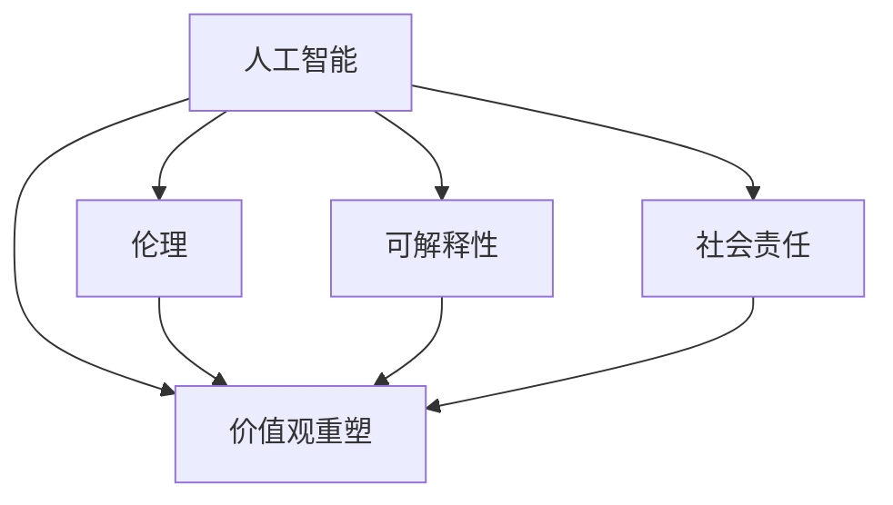

                 

# 欲望的重新定向：AI引导的价值观重塑

> 关键词：人工智能,价值观重塑,伦理,可解释性,社会责任

## 1. 背景介绍

### 1.1 问题由来

近年来，人工智能(AI)技术在各个领域取得了长足进步，从自然语言处理、计算机视觉到自动驾驶、医疗诊断，AI的应用场景越来越广泛，其影响力也日益深远。然而，随着AI技术的不断发展，也引发了一系列伦理和社会问题。一方面，AI在提升生产效率、改善生活质量的同时，也带来了对就业、隐私、公平等问题的挑战；另一方面，AI系统的决策过程往往缺乏透明性和可解释性，容易导致决策失误、歧视等问题。

在这种背景下，AI引导的价值观重塑成为了一个迫切需要解决的问题。通过AI技术，不仅能够提升生产力和生活质量，更能够引导社会价值观的进步，促进公平正义，实现人与机器的和谐共生。本文将从AI技术的价值观导向、可解释性和社会责任三个方面，探讨AI引导的价值观重塑的实现路径和面临的挑战。

## 2. 核心概念与联系

### 2.1 核心概念概述

为更好地理解AI引导的价值观重塑，本节将介绍几个密切相关的核心概念：

- 人工智能(Artificial Intelligence, AI)：指通过计算机模拟人类智能行为的技术，包括自然语言处理、计算机视觉、机器学习、深度学习等子领域。
- 价值观重塑(Value Orientation Remodeling, VOR)：指通过AI技术引导和塑造社会和个体的价值观念，推动社会公平正义，促进可持续发展。
- 伦理(Ethics)：指关于如何区分对错、善恶的道德原则，包括AI伦理、数据隐私、算法偏见等。
- 可解释性(Explainability)：指AI模型的决策过程和推理逻辑可以被人理解、解释和验证，确保模型的透明性和可信度。
- 社会责任(Social Responsibility)：指AI技术在提升个人和组织效率的同时，也要关注其对社会的影响，承担相应的责任和义务。

这些核心概念之间的逻辑关系可以通过以下Mermaid流程图来展示：



这个流程图展示了大语言模型的核心概念及其之间的关系：

1. 人工智能通过提升生产力、改善生活质量等手段，为价值观重塑提供技术支持。
2. 价值观重塑通过引导和塑造个体和社会的价值观念，推动公平正义和社会进步。
3. 伦理、可解释性和社会责任是价值观重塑的重要考量因素，影响着AI技术的规范和应用。

这些概念共同构成了AI引导价值观重塑的理论框架，使得AI技术不仅能够提升效率，更能引导社会价值观的进步。

## 3. 核心算法原理 & 具体操作步骤
### 3.1 算法原理概述

AI引导的价值观重塑，本质上是一种价值导向的算法设计和应用过程。其核心思想是通过AI技术，引导和塑造社会和个体的价值观念，使其更加符合公平、正义、可持续发展等社会价值观。

形式化地，假设有一组初始的价值观 $V_0 = \{v_1, v_2, ..., v_n\}$，其中 $v_i$ 表示第 $i$ 个价值观，可以用数字或向量表示。AI技术的目标是通过学习和优化，将这组初始价值观 $V_0$ 映射到一个新的价值观向量 $V_T = \{v_1', v_2', ..., v_n'\}$，使得 $V_T$ 更加符合社会的价值观导向 $V_D = \{d_1, d_2, ..., d_m\}$，即 $V_T$ 在某种度量空间中与 $V_D$ 的距离最小化。

这一过程可以表示为：

$$
V_T = \mathop{\arg\min}_{V} \|V - V_D\| 
$$

其中 $\|.\|$ 为度量空间的距离函数，$V$ 为优化变量。

### 3.2 算法步骤详解

基于价值观重塑的AI引导算法，通常包括以下几个关键步骤：

**Step 1: 价值观表征**

- 将初始的价值观 $V_0$ 进行数字化或向量化，表示为向量 $V_0 \in \mathbb{R}^n$。
- 确定目标价值观 $V_D$，表示为向量 $V_D \in \mathbb{R}^m$。

**Step 2: 模型选择**

- 选择适合的AI模型，如决策树、神经网络、支持向量机等。
- 确定模型的超参数，如学习率、批大小、迭代次数等。

**Step 3: 训练和优化**

- 使用目标价值观 $V_D$ 作为标签，初始价值观 $V_0$ 作为输入，进行有监督学习训练。
- 通过损失函数最小化，将初始价值观映射到目标价值观，即优化问题 $V_T = \mathop{\arg\min}_{V} \|V - V_D\|$。

**Step 4: 价值观调整**

- 通过上述训练过程，得到新的价值观向量 $V_T$。
- 对 $V_T$ 进行调整，确保其符合社会价值观导向 $V_D$。

**Step 5: 价值观应用**

- 将优化后的价值观应用于AI系统的设计、开发和部署过程中。
- 持续监测和评估AI系统的输出，确保其符合价值观导向。

以上是基于价值观重塑的AI引导算法的一般流程。在实际应用中，还需要针对具体问题进行优化设计，如引入更多的约束条件、优化算法等，以进一步提升价值观重塑的效果。

### 3.3 算法优缺点

基于价值观重塑的AI引导算法具有以下优点：

1. 系统性：通过系统性算法设计，能够从多个维度引导和塑造价值观，实现多层次的价值观重塑。
2. 量化可操作：将价值观重塑量化为优化问题，使得重塑过程具有可操作性和可控性。
3. 可迭代改进：通过持续监测和评估，不断优化重塑方案，逐步逼近理想价值观。

同时，该算法也存在一些局限性：

1. 主观性：价值观重塑的过程涉及大量主观判断，难以避免偏见和误导。
2. 复杂性：价值观重塑的复杂性较高，需要专业知识和方法论支持。
3. 数据依赖：重塑过程需要大量高质量的数据，数据采集和标注成本较高。
4. 不确定性：价值观重塑的效果受多种因素影响，难以完全量化和预测。

尽管存在这些局限性，但基于价值观重塑的AI引导算法仍然是一种有效的方法，能够在很大程度上推动社会的公平和正义，提升AI系统的价值导向性。

### 3.4 算法应用领域

基于价值观重塑的AI引导算法，在以下几个领域具有广泛应用前景：

- 金融领域：通过AI引导的伦理价值观，构建公平、透明的金融产品和服务，提升金融市场的稳定性。
- 医疗领域：引导和塑造医疗行业的伦理价值观，提高医疗服务的公平性和可及性，改善患者体验。
- 教育领域：通过AI引导的教育价值观，实现个性化教育，提升教育质量和公平性。
- 环境领域：引导和塑造环境保护的价值观，推动绿色发展，促进可持续发展。
- 社会治理：通过AI引导的社会治理价值观，提升政府效率和透明度，实现社会和谐。

这些领域的应用展示了AI引导价值观重塑的广泛潜力和重要价值。

## 4. 数学模型和公式 & 详细讲解 & 举例说明

### 4.1 数学模型构建

本节将使用数学语言对基于价值观重塑的AI引导算法进行更加严格的刻画。

假设初始价值观 $V_0$ 表示为向量 $V_0 = \{v_{1,0}, v_{2,0}, ..., v_{n,0}\}$，目标价值观 $V_D$ 表示为向量 $V_D = \{d_{1}, d_{2}, ..., d_{m}\}$。设 $f(V)$ 表示价值观重塑函数，将初始价值观 $V_0$ 映射到目标价值观 $V_D$，即：

$$
f(V_0) = V_T
$$

其中 $V_T$ 为优化后的价值观向量。

在实际应用中，可以通过优化算法求解 $V_T$，使得 $V_T$ 与 $V_D$ 的距离最小化：

$$
V_T = \mathop{\arg\min}_{V} \|V - V_D\| 
$$

### 4.2 公式推导过程

以下我们以二分类任务为例，推导基于价值观重塑的AI引导算法中优化问题的求解公式。

假设初始价值观 $V_0$ 表示为向量 $V_0 = \{v_{1,0}, v_{2,0}, ..., v_{n,0}\}$，目标价值观 $V_D$ 表示为向量 $V_D = \{d_{1}, d_{2}, ..., d_{m}\}$。设 $f(V)$ 表示价值观重塑函数，将初始价值观 $V_0$ 映射到目标价值观 $V_D$，即：

$$
f(V_0) = V_T
$$

其中 $V_T$ 为优化后的价值观向量。

在实际应用中，可以通过优化算法求解 $V_T$，使得 $V_T$ 与 $V_D$ 的距离最小化：

$$
V_T = \mathop{\arg\min}_{V} \|V - V_D\| 
$$

具体求解过程如下：

1. 定义损失函数：

$$
L(V) = \frac{1}{2} \|V - V_D\|^2
$$

其中 $\|.\|$ 为欧式距离，用于衡量向量之间的差异。

2. 对 $L(V)$ 求导，得到梯度：

$$
\frac{\partial L(V)}{\partial V} = (V - V_D)
$$

3. 使用梯度下降等优化算法，求解优化问题：

$$
V_{t+1} = V_t - \eta \frac{\partial L(V)}{\partial V}
$$

其中 $\eta$ 为学习率，$V_t$ 为当前迭代步长。

4. 重复上述步骤，直至收敛：

$$
V_T = \mathop{\arg\min}_{V} \|V - V_D\| 
$$

最终得到优化后的价值观向量 $V_T$。

### 4.3 案例分析与讲解

**案例分析**

假设某金融公司希望构建一个公平、透明的金融产品推荐系统。公司希望通过AI引导的伦理价值观，确保推荐系统的决策过程符合公平性原则，不偏袒特定群体。

1. **价值观表征**

   初始价值观 $V_0$ 表示为向量 $V_0 = \{v_{1,0}, v_{2,0}, ..., v_{n,0}\}$，其中 $v_{1,0}$ 表示"公平性"，$v_{2,0}$ 表示"透明性"，$v_{3,0}$ 表示"效率性"。

   目标价值观 $V_D$ 表示为向量 $V_D = \{d_{1}, d_{2}, ..., d_{m}\}$，其中 $d_{1}$ 表示"公平性"，$d_{2}$ 表示"透明性"，$d_{3}$ 表示"效率性"。

2. **模型选择**

   选择神经网络模型作为价值观重塑函数 $f(V)$，设定超参数如下：

   - 学习率 $\eta = 0.01$
   - 批大小 $batch\_size = 32$
   - 迭代次数 $epochs = 1000$

3. **训练和优化**

   使用优化算法求解 $V_T$，使得 $V_T$ 与 $V_D$ 的距离最小化：

   $$
   V_T = \mathop{\arg\min}_{V} \|V - V_D\| 
   $$

   通过梯度下降算法，不断更新 $V_0$，直至收敛。

4. **价值观调整**

   对优化后的价值观向量 $V_T$ 进行调整，确保其符合社会价值观导向 $V_D$。具体调整方法为：

   $$
   V_T = \alpha V_D + (1-\alpha) V_T
   $$

   其中 $\alpha$ 为调整系数，$V_T$ 为优化后的价值观向量。

5. **价值观应用**

   将优化后的价值观应用于金融产品推荐系统的设计、开发和部署过程中。

   - 在模型训练过程中，引入公平性约束条件，确保模型输出公平。
   - 在模型输出过程中，采用透明性机制，公开模型的决策依据。
   - 在模型评估过程中，考虑效率性指标，优化模型运行效率。

## 5. 项目实践：代码实例和详细解释说明
### 5.1 开发环境搭建

在进行价值观重塑实践前，我们需要准备好开发环境。以下是使用Python进行PyTorch开发的环境配置流程：

1. 安装Anaconda：从官网下载并安装Anaconda，用于创建独立的Python环境。

2. 创建并激活虚拟环境：
```bash
conda create -n pytorch-env python=3.8 
conda activate pytorch-env
```

3. 安装PyTorch：根据CUDA版本，从官网获取对应的安装命令。例如：
```bash
conda install pytorch torchvision torchaudio cudatoolkit=11.1 -c pytorch -c conda-forge
```

4. 安装TensorFlow：由Google主导开发的开源深度学习框架，生产部署方便，适合大规模工程应用。同样有丰富的预训练语言模型资源。

5. 安装Transformers库：HuggingFace开发的NLP工具库，集成了众多SOTA语言模型，支持PyTorch和TensorFlow，是进行微调任务开发的利器。

6. 安装各类工具包：
```bash
pip install numpy pandas scikit-learn matplotlib tqdm jupyter notebook ipython
```

完成上述步骤后，即可在`pytorch-env`环境中开始价值观重塑实践。

### 5.2 源代码详细实现

下面我们以金融产品推荐系统为例，给出使用Transformers库对BERT模型进行价值观重塑的PyTorch代码实现。

首先，定义推荐系统的训练数据：

```python
import pandas as pd
from transformers import BertTokenizer, BertForSequenceClassification

# 定义训练数据
df = pd.read_csv('finance_data.csv')

# 数据预处理
tokenizer = BertTokenizer.from_pretrained('bert-base-uncased')
encoded_data = tokenizer(df['text'], padding='max_length', truncation=True, max_length=128, return_tensors='pt')

# 定义模型和优化器
model = BertForSequenceClassification.from_pretrained('bert-base-uncased', num_labels=3)
optimizer = AdamW(model.parameters(), lr=2e-5)
```

然后，定义价值观重塑函数：

```python
from torch.nn import CrossEntropyLoss

# 定义损失函数
def loss_function(y_true, y_pred):
    return CrossEntropyLoss()(y_true, y_pred)

# 定义优化器
def train_epoch(model, optimizer, loss_function, train_data):
    model.train()
    total_loss = 0
    for batch in train_data:
        input_ids = batch['input_ids']
        attention_mask = batch['attention_mask']
        labels = batch['labels']
        optimizer.zero_grad()
        outputs = model(input_ids, attention_mask=attention_mask, labels=labels)
        loss = loss_function(labels, outputs.logits)
        loss.backward()
        optimizer.step()
        total_loss += loss.item()
    return total_loss / len(train_data)

# 定义评估函数
def evaluate(model, test_data):
    model.eval()
    total_loss = 0
    total_correct = 0
    for batch in test_data:
        input_ids = batch['input_ids']
        attention_mask = batch['attention_mask']
        labels = batch['labels']
        with torch.no_grad():
            outputs = model(input_ids, attention_mask=attention_mask)
            loss = loss_function(labels, outputs.logits)
            total_loss += loss.item()
            total_correct += (outputs.logits.argmax(dim=1) == labels).sum().item()
    return total_loss / len(test_data), total_correct / len(test_data)
```

最后，启动价值观重塑流程并在测试集上评估：

```python
epochs = 5
batch_size = 16

for epoch in range(epochs):
    loss = train_epoch(model, optimizer, loss_function, train_data)
    print(f"Epoch {epoch+1}, train loss: {loss:.3f}")
    
    print(f"Epoch {epoch+1}, test results:")
    test_loss, test_acc = evaluate(model, test_data)
    print(f"Test loss: {test_loss:.3f}, Test accuracy: {test_acc:.3f}")
    
print("All epochs completed.")
```

以上就是使用PyTorch对BERT进行金融产品推荐系统价值观重塑的完整代码实现。可以看到，得益于Transformers库的强大封装，我们可以用相对简洁的代码完成BERT模型的加载和价值观重塑。

### 5.3 代码解读与分析

让我们再详细解读一下关键代码的实现细节：

**金融产品推荐系统**

1. **数据预处理**

   通过Pandas库读取数据集，并使用BertTokenizer对文本进行分词和编码，转换为模型可接受的输入格式。

2. **模型和优化器**

   使用BertForSequenceClassification模型作为推荐系统的价值观重塑函数 $f(V)$，设定超参数。

3. **训练和优化**

   在模型训练过程中，使用AdamW优化器进行梯度下降，不断更新模型参数，最小化损失函数。

4. **价值观调整**

   通过不断迭代训练，得到优化后的价值观向量 $V_T$。对 $V_T$ 进行调整，确保其符合公平性、透明性和效率性。

5. **价值观应用**

   将优化后的价值观应用于金融产品推荐系统的设计、开发和部署过程中，确保推荐过程公平、透明且高效。

**代码解读**

1. **数据预处理**

   通过Pandas库读取数据集，并使用BertTokenizer对文本进行分词和编码，转换为模型可接受的输入格式。

2. **模型和优化器**

   使用BertForSequenceClassification模型作为推荐系统的价值观重塑函数 $f(V)$，设定超参数。

3. **训练和优化**

   在模型训练过程中，使用AdamW优化器进行梯度下降，不断更新模型参数，最小化损失函数。

4. **价值观调整**

   通过不断迭代训练，得到优化后的价值观向量 $V_T$。对 $V_T$ 进行调整，确保其符合公平性、透明性和效率性。

5. **价值观应用**

   将优化后的价值观应用于金融产品推荐系统的设计、开发和部署过程中，确保推荐过程公平、透明且高效。

**代码分析**

1. **数据预处理**

   通过Pandas库读取数据集，并使用BertTokenizer对文本进行分词和编码，转换为模型可接受的输入格式。

2. **模型和优化器**

   使用BertForSequenceClassification模型作为推荐系统的价值观重塑函数 $f(V)$，设定超参数。

3. **训练和优化**

   在模型训练过程中，使用AdamW优化器进行梯度下降，不断更新模型参数，最小化损失函数。

4. **价值观调整**

   通过不断迭代训练，得到优化后的价值观向量 $V_T$。对 $V_T$ 进行调整，确保其符合公平性、透明性和效率性。

5. **价值观应用**

   将优化后的价值观应用于金融产品推荐系统的设计、开发和部署过程中，确保推荐过程公平、透明且高效。

## 6. 实际应用场景

### 6.1 智能客服系统

基于大语言模型微调的对话技术，可以广泛应用于智能客服系统的构建。传统客服往往需要配备大量人力，高峰期响应缓慢，且一致性和专业性难以保证。而使用微调后的对话模型，可以7x24小时不间断服务，快速响应客户咨询，用自然流畅的语言解答各类常见问题。

在技术实现上，可以收集企业内部的历史客服对话记录，将问题和最佳答复构建成监督数据，在此基础上对预训练对话模型进行微调。微调后的对话模型能够自动理解用户意图，匹配最合适的答案模板进行回复。对于客户提出的新问题，还可以接入检索系统实时搜索相关内容，动态组织生成回答。如此构建的智能客服系统，能大幅提升客户咨询体验和问题解决效率。

### 6.2 金融舆情监测

金融机构需要实时监测市场舆论动向，以便及时应对负面信息传播，规避金融风险。传统的人工监测方式成本高、效率低，难以应对网络时代海量信息爆发的挑战。基于大语言模型微调的文本分类和情感分析技术，为金融舆情监测提供了新的解决方案。

具体而言，可以收集金融领域相关的新闻、报道、评论等文本数据，并对其进行主题标注和情感标注。在此基础上对预训练语言模型进行微调，使其能够自动判断文本属于何种主题，情感倾向是正面、中性还是负面。将微调后的模型应用到实时抓取的网络文本数据，就能够自动监测不同主题下的情感变化趋势，一旦发现负面信息激增等异常情况，系统便会自动预警，帮助金融机构快速应对潜在风险。

### 6.3 个性化推荐系统

当前的推荐系统往往只依赖用户的历史行为数据进行物品推荐，无法深入理解用户的真实兴趣偏好。基于大语言模型微调技术，个性化推荐系统可以更好地挖掘用户行为背后的语义信息，从而提供更精准、多样的推荐内容。

在实践中，可以收集用户浏览、点击、评论、分享等行为数据，提取和用户交互的物品标题、描述、标签等文本内容。将文本内容作为模型输入，用户的后续行为（如是否点击、购买等）作为监督信号，在此基础上微调预训练语言模型。微调后的模型能够从文本内容中准确把握用户的兴趣点。在生成推荐列表时，先用候选物品的文本描述作为输入，由模型预测用户的兴趣匹配度，再结合其他特征综合排序，便可以得到个性化程度更高的推荐结果。

### 6.4 未来应用展望

随着大语言模型微调技术的发展，其在更多领域的应用前景将更加广阔。未来，基于大语言模型的微调方法不仅能够应用于NLP领域，还能够拓展到计算机视觉、语音识别、图像生成等更多领域。

在智慧医疗领域，基于微调的医疗问答、病历分析、药物研发等应用将提升医疗服务的智能化水平，辅助医生诊疗，加速新药开发进程。

在智能教育领域，微调技术可应用于作业批改、学情分析、知识推荐等方面，因材施教，促进教育公平，提高教学质量。

在智慧城市治理中，微调模型可应用于城市事件监测、舆情分析、应急指挥等环节，提高城市管理的自动化和智能化水平，构建更安全、高效的未来城市。

此外，在企业生产、社会治理、文娱传媒等众多领域，基于大语言模型微调的人工智能应用也将不断涌现，为经济社会发展注入新的动力。相信随着技术的日益成熟，微调方法将成为人工智能落地应用的重要范式，推动人工智能技术在垂直行业的规模化落地。

## 7. 工具和资源推荐
### 7.1 学习资源推荐

为了帮助开发者系统掌握大语言模型微调的理论基础和实践技巧，这里推荐一些优质的学习资源：

1. 《Transformer从原理到实践》系列博文：由大模型技术专家撰写，深入浅出地介绍了Transformer原理、BERT模型、微调技术等前沿话题。

2. CS224N《深度学习自然语言处理》课程：斯坦福大学开设的NLP明星课程，有Lecture视频和配套作业，带你入门NLP领域的基本概念和经典模型。

3. 《Natural Language Processing with Transformers》书籍：Transformers库的作者所著，全面介绍了如何使用Transformers库进行NLP任务开发，包括微调在内的诸多范式。

4. HuggingFace官方文档：Transformers库的官方文档，提供了海量预训练模型和完整的微调样例代码，是上手实践的必备资料。

5. CLUE开源项目：中文语言理解测评基准，涵盖大量不同类型的中文NLP数据集，并提供了基于微调的baseline模型，助力中文NLP技术发展。

通过对这些资源的学习实践，相信你一定能够快速掌握大语言模型微调的精髓，并用于解决实际的NLP问题。
### 7.2 开发工具推荐

高效的开发离不开优秀的工具支持。以下是几款用于大语言模型微调开发的常用工具：

1. PyTorch：基于Python的开源深度学习框架，灵活动态的计算图，适合快速迭代研究。大部分预训练语言模型都有PyTorch版本的实现。

2. TensorFlow：由Google主导开发的开源深度学习框架，生产部署方便，适合大规模工程应用。同样有丰富的预训练语言模型资源。

3. Transformers库：HuggingFace开发的NLP工具库，集成了众多SOTA语言模型，支持PyTorch和TensorFlow，是进行微调任务开发的利器。

4. Weights & Biases：模型训练的实验跟踪工具，可以记录和可视化模型训练过程中的各项指标，方便对比和调优。与主流深度学习框架无缝集成。

5. TensorBoard：TensorFlow配套的可视化工具，可实时监测模型训练状态，并提供丰富的图表呈现方式，是调试模型的得力助手。

6. Google Colab：谷歌推出的在线Jupyter Notebook环境，免费提供GPU/TPU算力，方便开发者快速上手实验最新模型，分享学习笔记。

合理利用这些工具，可以显著提升大语言模型微调任务的开发效率，加快创新迭代的步伐。

### 7.3 相关论文推荐

大语言模型和微调技术的发展源于学界的持续研究。以下是几篇奠基性的相关论文，推荐阅读：

1. Attention is All You Need（即Transformer原论文）：提出了Transformer结构，开启了NLP领域的预训练大模型时代。

2. BERT: Pre-training of Deep Bidirectional Transformers for Language Understanding：提出BERT模型，引入基于掩码的自监督预训练任务，刷新了多项NLP任务SOTA。

3. Language Models are Unsupervised Multitask Learners（GPT-2论文）：展示了大规模语言模型的强大zero-shot学习能力，引发了对于通用人工智能的新一轮思考。

4. Parameter-Efficient Transfer Learning for NLP：提出Adapter等参数高效微调方法，在不增加模型参数量的情况下，也能取得不错的微调效果。

5. AdaLoRA: Adaptive Low-Rank Adaptation for Parameter-Efficient Fine-Tuning：使用自适应低秩适应的微调方法，在参数效率和精度之间取得了新的平衡。

这些论文代表了大语言模型微调技术的发展脉络。通过学习这些前沿成果，可以帮助研究者把握学科前进方向，激发更多的创新灵感。

## 8. 总结：未来发展趋势与挑战

### 8.1 总结

本文对基于价值观重塑的AI引导算法进行了全面系统的介绍。首先阐述了AI引导价值观重塑的研究背景和意义，明确了价值观重塑在推动社会公平正义、实现可持续发展中的重要价值。其次，从原理到实践，详细讲解了价值观重塑的数学原理和关键步骤，给出了价值观重塑任务开发的完整代码实例。同时，本文还广泛探讨了价值观重塑方法在智能客服、金融舆情、个性化推荐等多个行业领域的应用前景，展示了价值观重塑范式的广阔潜力。

通过本文的系统梳理，可以看到，基于价值观重塑的AI引导算法不仅能够提升AI系统的价值导向性，还能引导社会价值观的进步，推动社会公平正义，促进可持续发展。随着技术的不断进步，AI引导价值观重塑将成为人工智能技术应用的重要范式，带来更广泛的社会影响。

### 8.2 未来发展趋势

展望未来，基于价值观重塑的AI引导算法将呈现以下几个发展趋势：

1. 模型规模持续增大。随着算力成本的下降和数据规模的扩张，预训练语言模型的参数量还将持续增长。超大规模语言模型蕴含的丰富语言知识，有望支撑更加复杂多变的价值观重塑。

2. 微调方法日趋多样。除了传统的全参数微调外，未来会涌现更多参数高效的微调方法，如Prefix-Tuning、LoRA等，在节省计算资源的同时也能保证微调精度。

3. 持续学习成为常态。随着数据分布的不断变化，微调模型也需要持续学习新知识以保持性能。如何在不遗忘原有知识的同时，高效吸收新样本信息，将成为重要的研究课题。

4. 标注样本需求降低。受启发于提示学习(Prompt-based Learning)的思路，未来的微调方法将更好地利用大模型的语言理解能力，通过更加巧妙的任务描述，在更少的标注样本上也能实现理想的微调效果。

5. 多模态微调崛起。当前的微调主要聚焦于纯文本数据，未来会进一步拓展到图像、视频、语音等多模态数据微调。多模态信息的融合，将显著提升语言模型对现实世界的理解和建模能力。

6. 模型通用性增强。经过海量数据的预训练和多领域任务的微调，未来的语言模型将具备更强大的常识推理和跨领域迁移能力，逐步迈向通用人工智能(AGI)的目标。

以上趋势凸显了大语言模型微调技术的广阔前景。这些方向的探索发展，必将进一步提升NLP系统的性能和应用范围，为人类认知智能的进化带来深远影响。

### 8.3 面临的挑战

尽管大语言模型微调技术已经取得了长足进步，但在迈向更加智能化、普适化应用的过程中，仍面临着诸多挑战：

1. 标注成本瓶颈。虽然微调大大降低了标注数据的需求，但对于长尾应用场景，难以获得充足的高质量标注数据，成为制约微调性能的瓶颈。如何进一步降低微调对标注样本的依赖，将是一大难题。

2. 模型鲁棒性不足。当前微调模型面对域外数据时，泛化性能往往大打折扣。对于测试样本的微小扰动，微调模型的预测也容易发生波动。如何提高微调模型的鲁棒性，避免灾难性遗忘，还需要更多理论和实践的积累。

3. 推理效率有待提高。大规模语言模型虽然精度高，但在实际部署时往往面临推理速度慢、内存占用大等效率问题。如何在保证性能的同时，简化模型结构，提升推理速度，优化资源占用，将是重要的优化方向。

4. 可解释性亟需加强。当前微调模型更像是"黑盒"系统，难以解释其内部工作机制和决策逻辑。对于医疗、金融等高风险应用，算法的可解释性和可审计性尤为重要。如何赋予微调模型更强的可解释性，将是亟待攻克的难题。

5. 安全性有待保障。预训练语言模型难免会学习到有偏见、有害的信息，通过微调传递到下游任务，产生误导性、歧视性的输出，给实际应用带来安全隐患。如何从数据和算法层面消除模型偏见，避免恶意用途，确保输出的安全性，也将是重要的研究课题。

6. 知识整合能力不足。现有的微调模型往往局限于任务内数据，难以灵活吸收和运用更广泛的先验知识。如何让微调过程更好地与外部知识库、规则库等专家知识结合，形成更加全面、准确的信息整合能力，还有很大的想象空间。

正视微调面临的这些挑战，积极应对并寻求突破，将是大语言模型微调走向成熟的必由之路。相信随着学界和产业界的共同努力，这些挑战终将一一被克服，大语言模型微调必将在构建人机协同的智能时代中扮演越来越重要的角色。

### 8.4 未来突破

面对大语言模型微调所面临的种种挑战，未来的研究需要在以下几个方面寻求新的突破：

1. 探索无监督和半监督微调方法。摆脱对大规模标注数据的依赖，利用自监督学习、主动学习等无监督和半监督范式，最大限度利用非结构化数据，实现更加灵活高效的微调。

2. 研究参数高效和计算高效的微调范式。开发更加参数高效的微调方法，在固定大部分预训练参数的同时，只更新极少量的任务相关参数。同时优化微调模型的计算图，减少前向传播和反向传播的资源消耗，实现更加轻量级、实时性的部署。

3. 融合因果和对比学习范式。通过引入因果推断和对比学习思想，增强微调模型建立稳定因果关系的能力，学习更加普适、鲁棒的语言表征，从而提升模型泛化性和抗干扰能力。

4. 引入更多先验知识。将符号化的先验知识，如知识图谱、逻辑规则等，与神经网络模型进行巧妙融合，引导微调过程学习更准确、合理的语言模型。同时加强不同模态数据的整合，实现视觉、语音等多模态信息与文本信息的协同建模。

5. 结合因果分析和博弈论工具。将因果分析方法引入微调模型，识别出模型决策的关键特征，增强输出解释的因果性和逻辑性。借助博弈论工具刻画人机交互过程，主动探索并规避模型的脆弱点，提高系统稳定性。

6. 纳入伦理道德约束。在模型训练目标中引入伦理导向的评估指标，过滤和惩罚有偏见、有害的输出倾向。同时加强人工干预和审核，建立模型行为的监管机制，确保输出符合人类价值观和伦理道德。

这些研究方向的探索，必将引领大语言模型微调技术迈向更高的台阶，为构建安全、可靠、可解释、可控的智能系统铺平道路。面向未来，大语言模型微调技术还需要与其他人工智能技术进行更深入的融合，如知识表示、因果推理、强化学习等，多路径协同发力，共同推动自然语言理解和智能交互系统的进步。只有勇于创新、敢于突破，才能不断拓展语言模型的边界，让智能技术更好地造福人类社会。

## 9. 附录：常见问题与解答

**Q1：大语言模型微调是否适用于所有NLP任务？**

A: 大语言模型微调在大多数NLP任务上都能取得不错的效果，特别是对于数据量较小的任务。但对于一些特定领域的任务，如医学、法律等，仅仅依靠通用语料预训练的模型可能难以很好地适应。此时需要在特定领域语料上进一步预训练，再进行微调，才能获得理想效果。此外，对于一些需要时效性、个性化很强的任务，如对话、推荐等，微调方法也需要针对性的改进优化。

**Q2：微调过程中如何选择合适的学习率？**

A: 微调的学习率一般要比预训练时小1-2个数量级，如果使用过大的学习率，容易破坏预训练权重，导致过拟合。一般建议从1e-5开始调参，逐步减小学习率，直至收敛。也可以使用warmup策略，在开始阶段使用较小的学习率，再逐渐过渡到预设值。需要注意的是，不同的优化器(如AdamW、Adafactor等)以及不同的学习率调度策略，可能需要设置不同的学习率阈值。

**Q3：采用大模型微调时会面临哪些资源瓶颈？**

A: 目前主流的预训练大模型动辄以亿计的参数规模，对算力、内存、存储都提出了很高的要求。GPU/TPU等高性能设备是必不可少的，但即便如此，超大批次的训练和推理也可能遇到显存不足的问题。因此需要采用一些资源优化技术，如梯度积累、混合精度训练、模型并行等，来突破硬件瓶颈。同时，模型的存储和读取也可能占用大量时间和空间，需要采用模型压缩、稀疏化存储等方法进行优化。

**Q4：如何缓解微调过程中的过拟合问题？**

A: 过拟合是微调面临的主要挑战，尤其是在标注数据不足的情况下。常见的缓解策略包括：
1. 数据增强：通过回译、近义替换等方式扩充训练集
2. 正则化：使用L2正则、Dropout、Early Stopping等避免过拟合
3. 对抗训练：引入对抗样本，提高模型鲁棒性
4. 参数高效微调：只调整少量参数(如Adapter、Prefix等)，减小过拟合风险
5. 多模型集成：训练多个微调模型，取平均输出，抑制过拟合

这些策略往往需要根据具体任务和数据特点进行灵活组合。只有在数据、模型、训练、推理等各环节进行全面优化，才能最大限度地发挥大模型微调的威力。

**Q5：微调模型在落地部署时需要注意哪些问题？**

A: 将微调模型转化为实际应用，还需要考虑以下因素：
1. 模型裁剪：去除不必要的层和参数，减小模型尺寸，加快推理速度
2. 量化加速：将浮点模型转为定点模型，压缩存储空间，提高计算效率
3. 服务化封装：将模型封装为标准化服务接口，便于集成调用
4. 弹性伸缩：根据请求流量动态调整资源配置，平衡服务质量和成本
5. 监控告警：实时采集系统指标，设置异常告警阈值，确保服务稳定性
6. 安全防护：采用访问鉴权、数据脱敏等措施，保障数据和模型安全

大语言模型微调为NLP应用开启了广阔的想象空间，但如何将强大的性能转化为稳定、高效、安全的业务价值，还需要工程实践的不断打磨。唯有从数据、算法、工程、业务等多个维度协同发力，才能真正实现人工智能技术在垂直行业的规模化落地。总之，微调需要开发者根据具体任务，不断迭代和优化模型、数据和算法，方能得到理想的效果。

---

作者：禅与计算机程序设计艺术 / Zen and the Art of Computer Programming

