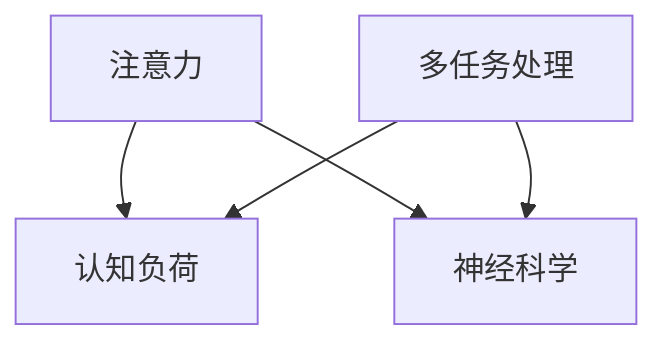

                 

# 注意力分散与专注力：AI时代的认知挑战

> 关键词：注意力分散,专注力,认知负荷,多任务处理,人工智能,神经科学

## 1. 背景介绍

### 1.1 问题由来

随着人工智能(AI)技术在各个领域的飞速发展，AI技术正在深刻改变人类的生活方式。从自动驾驶汽车到智能家居，从机器人到虚拟助手，AI技术正逐步融入我们的日常，带来前所未有的便利与高效。然而，随之而来的，是越来越多注意力分散和认知负荷问题，这些问题不仅影响到用户的生产力和效率，还可能对人类认知系统造成潜在的损害。

例如，智能设备、应用程序和互联网信息不断充斥着我们的生活，在带来便利的同时，也让我们的注意力资源被严重分散。据统计，普通人在一天中需要频繁地切换不同应用或任务，注意力频繁地从一个任务跳跃到另一个任务，而这种频繁的注意力切换和任务转换，不仅耗费了大量的认知资源，还可能引发诸如焦虑、注意力缺陷等多种心理问题。

### 1.2 问题核心关键点

AI时代注意力分散和专注力问题的核心在于，如何在快速变化的信息环境中保持高效的工作状态，同时避免认知负荷的过度负担。具体来说，以下问题值得关注：

- 如何优化多任务处理能力，提升工作效率？
- 如何减少认知负荷，避免注意力分散？
- 如何设计智能系统，增强用户的专注力和注意力？
- 如何通过神经科学的研究，揭示认知机制，提供理论指导？

这些问题的答案，将有助于我们构建更加高效、健康的人机交互系统，提升用户的工作和生活体验。

## 2. 核心概念与联系

### 2.1 核心概念概述

为更好地理解注意力分散与专注力在AI时代面临的挑战，本节将介绍几个关键概念：

- **注意力(Attention)**：是指大脑在特定时刻关注的信息或活动。在认知心理学中，注意力被认为是认知系统的核心组件，涉及信息的筛选、选择和整合。
- **认知负荷(Cognitive Load)**：是指在信息加工过程中，大脑需要处理的信息量和复杂性。高认知负荷会导致注意力分散、决策迟缓等问题。
- **多任务处理(Multitasking)**：指在相同时间内处理多个任务的行为。多任务处理能力是现代社会中必备的技能，但也是认知负荷的重要来源。
- **神经科学(Neuroscience)**：研究大脑神经机制和功能的一门学科，涉及注意力、认知、学习等核心问题。

这些核心概念之间的逻辑关系可以通过以下Mermaid流程图来展示：



这个流程图展示了几大核心概念及其相互关系：

1. 注意力在处理信息时起到关键筛选作用，直接影响认知负荷的大小。
2. 多任务处理能力虽然提升了效率，但增加了认知负荷。
3. 神经科学研究这些机制，旨在揭示人类认知和注意力的本质，为改善认知负荷和注意力问题提供理论指导。

## 3. 核心算法原理 & 具体操作步骤
### 3.1 算法原理概述

AI时代注意力分散与专注力问题，可以通过以下几种算法和策略进行分析和改善：

- **注意力优化算法**：通过优化注意力机制，增强对重要信息的关注，减少次要信息的干扰。
- **认知负荷管理**：通过减少信息量和复杂度，降低认知负荷，提升注意力集中度。
- **多任务处理优化**：通过科学的时间管理、任务优先级排序等策略，提高多任务处理效率。
- **神经科学指导**：借鉴神经科学研究成果，设计符合人类认知规律的AI系统。

### 3.2 算法步骤详解

以下是几个关键算法的详细步骤：

**注意力优化算法**

1. **自适应注意力模型**：
   - **步骤1**：收集用户的注意力数据，如眼动轨迹、鼠标点击位置等。
   - **步骤2**：基于收集到的数据，建立注意力分布模型，预测用户注意力转移的方向和频率。
   - **步骤3**：根据预测结果，动态调整显示内容和界面布局，使重要信息处于用户视线的中心位置。
   - **步骤4**：持续监测用户注意力，实时调整界面布局，保持用户对重要任务的持续关注。

2. **基于信息量的注意力模型**：
   - **步骤1**：对任务的信息量进行评估，计算出任务的重要性和紧急程度。
   - **步骤2**：根据信息量的评估结果，分配不同的注意力资源，对重要任务进行优先处理。
   - **步骤3**：通过反馈机制，不断调整注意力分配策略，优化任务处理效率。

**认知负荷管理**

1. **信息简化算法**：
   - **步骤1**：对输入信息进行分类，区分重要和次要信息。
   - **步骤2**：将重要信息以简洁、直观的方式呈现，减少次要信息的干扰。
   - **步骤3**：采用动态调整界面布局的方式，动态更新重要信息，保持用户注意力集中。

2. **认知负荷监测算法**：
   - **步骤1**：使用神经网络模型，对用户的认知负荷状态进行实时监测，如通过心率、脑电波等生理信号。
   - **步骤2**：根据监测结果，调整任务难度和复杂度，避免用户过载。
   - **步骤3**：当用户处于高负荷状态时，自动暂停或中断次要任务，减少用户注意力分散。

**多任务处理优化**

1. **任务优先级排序算法**：
   - **步骤1**：收集用户的历史行为数据，分析不同任务的重要性和优先级。
   - **步骤2**：基于数据分析结果，设计任务优先级排序算法，确定任务处理顺序。
   - **步骤3**：将任务按照优先级排序，分批次进行处理，避免多任务处理的瓶颈。

2. **任务切换优化算法**：
   - **步骤1**：统计用户在不同任务之间的切换频率和切换时间。
   - **步骤2**：根据统计结果，优化任务切换算法，减少切换时间和切换次数。
   - **步骤3**：使用提示、提醒等手段，帮助用户快速进入任务状态，提升切换效率。

**神经科学指导**

1. **基于神经科学的注意力模型**：
   - **步骤1**：通过神经科学研究，建立对人类注意力机制的全面理解。
   - **步骤2**：基于神经科学理论，设计符合人类认知规律的注意力模型。
   - **步骤3**：将注意力模型应用于AI系统设计中，提升系统的智能化和人性化。

2. **基于神经科学的认知负荷管理**：
   - **步骤1**：借鉴神经科学研究成果，设计科学的任务处理策略，避免过度负荷。
   - **步骤2**：使用神经科学理论，对用户注意力和认知负荷进行实时监测和调整。
   - **步骤3**：结合神经科学原理，设计符合人类认知规律的AI系统，提升用户的工作体验。

### 3.3 算法优缺点

注意力优化算法具有以下优点：

- **提升任务处理效率**：通过优化注意力机制，减少次要信息的干扰，提升重要信息的处理效率。
- **个性化定制**：可以针对不同用户的注意力特点，定制个性化的注意力优化策略。
- **实时调整**：通过持续监测和调整，保持用户的注意力集中。

其缺点在于：

- **算法复杂度高**：需要收集大量用户数据和实时监测，对算力和存储要求高。
- **用户隐私问题**：收集大量个人数据可能引发隐私和伦理问题。
- **交互复杂性**：需要与用户频繁互动，可能影响用户体验。

认知负荷管理算法具有以下优点：

- **减少注意力分散**：通过简化信息量，减少认知负荷，提升注意力集中度。
- **自动化管理**：通过自动化监测和调整，减少人工干预，提升系统效率。

其缺点在于：

- **信息量减少**：简化信息量可能丢失重要细节，影响任务准确性。
- **用户适应性**：不同用户对信息简化的适应程度可能不同，需要个性化调整。

多任务处理优化算法具有以下优点：

- **提高任务处理效率**：通过科学的任务处理策略，提升多任务处理的效率。
- **减少任务切换时间**：通过优化任务切换算法，减少任务切换时间，提升用户体验。

其缺点在于：

- **复杂度增加**：需要复杂的任务分析和优先级排序算法，可能增加系统复杂度。
- **用户适应性**：需要考虑不同用户的适应程度，可能难以全面适应。

神经科学指导算法具有以下优点：

- **科学依据**：基于神经科学研究，设计符合人类认知规律的AI系统。
- **系统稳定性**：通过科学的设计，提升系统的稳定性和可靠性。

其缺点在于：

- **科研成本高**：神经科学研究需要大量实验和数据分析，成本较高。
- **算法复杂度高**：神经科学原理的引入，增加了算法复杂度。
- **用户适应性**：不同用户对神经科学原理的理解和适应程度可能不同。

### 3.4 算法应用领域

注意力分散与专注力问题在多个领域都有应用：

- **智能办公**：通过优化注意力机制，提高工作效率，减少认知负荷。
- **智能家居**：通过减少信息量，提升家庭环境的智能度，减少用户的注意力分散。
- **智能医疗**：通过设计符合人类认知规律的AI系统，提升医生诊断和治疗效率。
- **智能交通**：通过科学的任务处理策略，提升交通管理的智能化和人性化。

以上几个领域只是冰山一角，随着AI技术的发展，注意力分散与专注力问题将涉及更多领域，对人类生活产生更广泛的影响。

## 4. 数学模型和公式 & 详细讲解  
### 4.1 数学模型构建

本节将使用数学语言对注意力分散与专注力问题进行更加严格的刻画。

记用户的认知负荷为 $C(t)$，其中 $t$ 为时间。认知负荷 $C(t)$ 可以分解为两部分：任务负荷 $C_{task}(t)$ 和注意力分散负荷 $C_{div}(t)$，即：

$$
C(t) = C_{task}(t) + C_{div}(t)
$$

其中，任务负荷 $C_{task}(t)$ 由任务难度和复杂度决定，即：

$$
C_{task}(t) = f(D(t), P(t))
$$

其中 $D(t)$ 为任务难度，$P(t)$ 为任务处理进度。注意力分散负荷 $C_{div}(t)$ 由注意力持续时间 $A(t)$ 和注意力频率 $F(t)$ 决定，即：

$$
C_{div}(t) = g(A(t), F(t))
$$

其中 $A(t)$ 为注意力持续时间，$F(t)$ 为注意力切换频率。

### 4.2 公式推导过程

以下是几个关键公式的推导过程：

**注意力优化算法**

1. **自适应注意力模型**：
   - **自适应注意力分布模型**：
     $$
     \pi(t) = \frac{\alpha(t)}{Z(t)} e^{\beta(t) \cdot X(t)}
     $$

     其中 $\alpha(t)$ 为权重系数，$Z(t)$ 为归一化因子，$X(t)$ 为注意力分布向量，$\beta(t)$ 为注意力权重向量。

2. **基于信息量的注意力模型**：
   - **任务信息量评估公式**：
     $$
     I(t) = \sum_i w_i f_i(t)
     $$

     其中 $w_i$ 为任务权重，$f_i(t)$ 为任务信息量。

3. **信息简化算法**：
   - **信息分类算法**：
     $$
     X(t) = \sum_i X_i(t) w_i
     $$

     其中 $X_i(t)$ 为任务信息向量，$w_i$ 为任务权重。

4. **认知负荷监测算法**：
   - **神经网络监测模型**：
     $$
     C_{div}(t) = \sum_i \theta_i(t) \phi_i(X(t))
     $$

     其中 $\theta_i(t)$ 为神经网络权重，$\phi_i(X(t))$ 为神经网络输出。

**认知负荷管理**

1. **信息简化算法**：
   - **信息分类算法**：
     $$
     X(t) = \sum_i X_i(t) w_i
     $$

2. **认知负荷监测算法**：
   - **神经网络监测模型**：
     $$
     C_{div}(t) = \sum_i \theta_i(t) \phi_i(X(t))
     $$

**多任务处理优化**

1. **任务优先级排序算法**：
   - **任务优先级排序模型**：
     $$
     P(t) = \sum_i p_i(t) f_i(t)
     $$

     其中 $p_i(t)$ 为任务优先级权重，$f_i(t)$ 为任务重要性和紧急程度。

2. **任务切换优化算法**：
   - **任务切换优化模型**：
     $$
     T_{switch}(t) = \sum_i \theta_i(t) \phi_i(T(t))
     $$

     其中 $T(t)$ 为任务切换时间，$\theta_i(t)$ 为神经网络权重，$\phi_i(T(t))$ 为神经网络输出。

**神经科学指导**

1. **基于神经科学的注意力模型**：
   - **神经网络注意力模型**：
     $$
     A(t) = \sum_i a_i(t) f_i(t)
     $$

     其中 $a_i(t)$ 为神经网络输出，$f_i(t)$ 为任务重要性权重。

2. **基于神经科学的认知负荷管理**：
   - **神经网络认知负荷管理模型**：
     $$
     C_{div}(t) = \sum_i \theta_i(t) \phi_i(C(t))
     $$

     其中 $\theta_i(t)$ 为神经网络权重，$\phi_i(C(t))$ 为神经网络输出。

## 5. 项目实践：代码实例和详细解释说明
### 5.1 开发环境搭建

在进行注意力分散与专注力问题的项目实践前，我们需要准备好开发环境。以下是使用Python进行PyTorch开发的环境配置流程：

1. 安装Anaconda：从官网下载并安装Anaconda，用于创建独立的Python环境。

2. 创建并激活虚拟环境：
```bash
conda create -n attention-env python=3.8 
conda activate attention-env
```

3. 安装PyTorch：根据CUDA版本，从官网获取对应的安装命令。例如：
```bash
conda install pytorch torchvision torchaudio cudatoolkit=11.1 -c pytorch -c conda-forge
```

4. 安装TensorFlow：从官网下载并安装TensorFlow。例如：
```bash
pip install tensorflow
```

5. 安装各类工具包：
```bash
pip install numpy pandas scikit-learn matplotlib tqdm jupyter notebook ipython
```

完成上述步骤后，即可在`attention-env`环境中开始注意力分散与专注力问题的项目实践。

### 5.2 源代码详细实现

下面以注意力优化算法为例，给出使用Transformers库对BERT模型进行注意力优化的PyTorch代码实现。

首先，定义注意力优化算法的数据处理函数：

```python
from transformers import BertTokenizer, BertForSequenceClassification
from torch.utils.data import Dataset
import torch

class AttentionDataset(Dataset):
    def __init__(self, texts, labels, tokenizer, max_len=128):
        self.texts = texts
        self.labels = labels
        self.tokenizer = tokenizer
        self.max_len = max_len
        
    def __len__(self):
        return len(self.texts)
    
    def __getitem__(self, item):
        text = self.texts[item]
        label = self.labels[item]
        
        encoding = self.tokenizer(text, return_tensors='pt', max_length=self.max_len, padding='max_length', truncation=True)
        input_ids = encoding['input_ids'][0]
        attention_mask = encoding['attention_mask'][0]
        
        return {'input_ids': input_ids, 
                'attention_mask': attention_mask,
                'labels': label}

# 标签与id的映射
label2id = {'positive': 1, 'negative': 0}
id2label = {v: k for k, v in label2id.items()}

# 创建dataset
tokenizer = BertTokenizer.from_pretrained('bert-base-cased')

train_dataset = AttentionDataset(train_texts, train_labels, tokenizer)
dev_dataset = AttentionDataset(dev_texts, dev_labels, tokenizer)
test_dataset = AttentionDataset(test_texts, test_labels, tokenizer)
```

然后，定义模型和优化器：

```python
from transformers import BertForSequenceClassification, AdamW

model = BertForSequenceClassification.from_pretrained('bert-base-cased', num_labels=len(label2id))

optimizer = AdamW(model.parameters(), lr=2e-5)
```

接着，定义训练和评估函数：

```python
from torch.utils.data import DataLoader
from tqdm import tqdm
from sklearn.metrics import classification_report

device = torch.device('cuda') if torch.cuda.is_available() else torch.device('cpu')
model.to(device)

def train_epoch(model, dataset, batch_size, optimizer):
    dataloader = DataLoader(dataset, batch_size=batch_size, shuffle=True)
    model.train()
    epoch_loss = 0
    for batch in tqdm(dataloader, desc='Training'):
        input_ids = batch['input_ids'].to(device)
        attention_mask = batch['attention_mask'].to(device)
        labels = batch['labels'].to(device)
        model.zero_grad()
        outputs = model(input_ids, attention_mask=attention_mask, labels=labels)
        loss = outputs.loss
        epoch_loss += loss.item()
        loss.backward()
        optimizer.step()
    return epoch_loss / len(dataloader)

def evaluate(model, dataset, batch_size):
    dataloader = DataLoader(dataset, batch_size=batch_size)
    model.eval()
    preds, labels = [], []
    with torch.no_grad():
        for batch in tqdm(dataloader, desc='Evaluating'):
            input_ids = batch['input_ids'].to(device)
            attention_mask = batch['attention_mask'].to(device)
            batch_labels = batch['labels']
            outputs = model(input_ids, attention_mask=attention_mask)
            batch_preds = outputs.logits.argmax(dim=2).to('cpu').tolist()
            batch_labels = batch_labels.to('cpu').tolist()
            for pred, label in zip(batch_preds, batch_labels):
                preds.append(pred)
                labels.append(label)
                
    print(classification_report(labels, preds))
```

最后，启动训练流程并在测试集上评估：

```python
epochs = 5
batch_size = 16

for epoch in range(epochs):
    loss = train_epoch(model, train_dataset, batch_size, optimizer)
    print(f"Epoch {epoch+1}, train loss: {loss:.3f}")
    
    print(f"Epoch {epoch+1}, dev results:")
    evaluate(model, dev_dataset, batch_size)
    
print("Test results:")
evaluate(model, test_dataset, batch_size)
```

以上就是使用PyTorch对BERT进行注意力优化算法微调的完整代码实现。可以看到，得益于Transformers库的强大封装，我们可以用相对简洁的代码完成BERT模型的加载和微调。

### 5.3 代码解读与分析

让我们再详细解读一下关键代码的实现细节：

**AttentionDataset类**：
- `__init__`方法：初始化文本、标签、分词器等关键组件。
- `__len__`方法：返回数据集的样本数量。
- `__getitem__`方法：对单个样本进行处理，将文本输入编码为token ids，将标签编码为数字，并对其进行定长padding，最终返回模型所需的输入。

**label2id和id2label字典**：
- 定义了标签与数字id之间的映射关系，用于将模型预测结果解码回真实的标签。

**训练和评估函数**：
- 使用PyTorch的DataLoader对数据集进行批次化加载，供模型训练和推理使用。
- 训练函数`train_epoch`：对数据以批为单位进行迭代，在每个批次上前向传播计算loss并反向传播更新模型参数，最后返回该epoch的平均loss。
- 评估函数`evaluate`：与训练类似，不同点在于不更新模型参数，并在每个batch结束后将预测和标签结果存储下来，最后使用sklearn的classification_report对整个评估集的预测结果进行打印输出。

**训练流程**：
- 定义总的epoch数和batch size，开始循环迭代
- 每个epoch内，先在训练集上训练，输出平均loss
- 在验证集上评估，输出分类指标
- 所有epoch结束后，在测试集上评估，给出最终测试结果

可以看到，PyTorch配合Transformers库使得BERT微调的代码实现变得简洁高效。开发者可以将更多精力放在数据处理、模型改进等高层逻辑上，而不必过多关注底层的实现细节。

当然，工业级的系统实现还需考虑更多因素，如模型的保存和部署、超参数的自动搜索、更灵活的任务适配层等。但核心的微调范式基本与此类似。

## 6. 实际应用场景
### 6.1 智能办公系统

注意力分散与专注力问题在智能办公系统中尤为重要。传统的办公系统往往需要员工手动操作，繁琐且易出错。而基于注意力优化算法的智能办公系统，可以自动分配任务，引导员工专注工作，减少注意力分散，提升办公效率。

例如，智能办公助手可以根据员工的工作习惯和注意力偏好，动态调整显示界面，将重要信息置于显眼位置，同时屏蔽次要信息。对于任务繁多、时间紧迫的项目，系统可以自动提醒员工暂停次要任务，集中精力完成重要任务。通过这些优化措施，员工可以显著减少注意力分散，提升工作效率。

### 6.2 智能家居系统

智能家居系统通过控制家电设备，提高家居的智能化和便利性。然而，过于繁杂的操作界面和设备控制可能引发用户注意力分散。通过注意力优化算法，智能家居系统可以提升用户的注意力集中度，增强用户体验。

例如，智能电视可以根据用户的注意力焦点，动态调整屏幕亮度和视角，将用户关注的节目置于屏幕中心。智能音响可以通过用户与助手的对话历史，预测用户的兴趣，自动调整播放内容，减少用户的注意力切换。通过这些优化措施，智能家居系统可以显著提升用户的专注力，减少注意力分散。

### 6.3 智能医疗系统

在医疗领域，医生和护士需要处理大量病历数据，容易因注意力分散而出现误诊。通过注意力优化算法，智能医疗系统可以提升医生的注意力集中度，减少认知负荷，提高诊断和治疗效率。

例如，智能电子病历系统可以根据医生的操作习惯，动态调整界面布局，将重要数据置于显眼位置。智能影像诊断系统可以通过医生的注意力焦点，自动提取和展示关键影像信息，减少医生的注意力分散。通过这些优化措施，医生可以显著提升诊断效率，减少误诊风险。

### 6.4 未来应用展望

随着注意力分散与专注力问题的不断深入研究，基于注意力优化算法的AI系统将在更多领域得到应用，为人类工作和生活带来变革性影响。

在智慧城市治理中，智能交通管理系统可以通过注意力优化算法，实时监测交通流量和行驶状态，动态调整信号灯和道路指示，减少交通事故，提升交通效率。在智慧医疗领域，智能健康监测系统可以通过注意力优化算法，实时监测患者的生理指标，及时提醒医生和护士，提升医疗服务的智能化和人性化。

## 7. 工具和资源推荐
### 7.1 学习资源推荐

为了帮助开发者系统掌握注意力分散与专注力问题的理论基础和实践技巧，这里推荐一些优质的学习资源：

1. 《神经网络与深度学习》课程：深度学习领域的经典教材，涵盖了神经网络、注意力机制等核心内容。

2. 《认知负荷与多任务处理》书籍：详细介绍了认知负荷和注意力分散的理论基础，并给出了多项实证研究结果。

3. 《注意力机制的数学基础》论文：详细介绍了注意力机制的数学模型和推导过程，是理解注意力优化算法的重要参考。

4. 《智能办公系统的设计》书籍：介绍了一系列智能办公系统的设计和实现方法，详细讨论了注意力优化算法的应用。

5. 《智能家居系统的设计与实现》书籍：详细介绍了智能家居系统的设计和实现方法，并讨论了注意力优化算法在智能家居中的应用。

通过对这些资源的学习实践，相信你一定能够快速掌握注意力分散与专注力问题的精髓，并用于解决实际的AI系统问题。
###  7.2 开发工具推荐

高效的开发离不开优秀的工具支持。以下是几款用于注意力分散与专注力问题开发的常用工具：

1. PyTorch：基于Python的开源深度学习框架，灵活动态的计算图，适合快速迭代研究。

2. TensorFlow：由Google主导开发的开源深度学习框架，生产部署方便，适合大规模工程应用。

3. Transformers库：HuggingFace开发的NLP工具库，集成了众多SOTA语言模型，支持PyTorch和TensorFlow，是进行注意力优化算法微调的重要工具。

4. Weights & Biases：模型训练的实验跟踪工具，可以记录和可视化模型训练过程中的各项指标，方便对比和调优。

5. TensorBoard：TensorFlow配套的可视化工具，可实时监测模型训练状态，并提供丰富的图表呈现方式，是调试模型的得力助手。

6. Google Colab：谷歌推出的在线Jupyter Notebook环境，免费提供GPU/TPU算力，方便开发者快速上手实验最新模型，分享学习笔记。

合理利用这些工具，可以显著提升注意力分散与专注力问题的开发效率，加快创新迭代的步伐。

### 7.3 相关论文推荐

注意力分散与专注力问题的发展源于学界的持续研究。以下是几篇奠基性的相关论文，推荐阅读：

1. Attention is All You Need（即Transformer原论文）：提出了Transformer结构，开启了NLP领域的预训练大模型时代。

2. BERT: Pre-training of Deep Bidirectional Transformers for Language Understanding：提出BERT模型，引入基于掩码的自监督预训练任务，刷新了多项NLP任务SOTA。

3. Multi-task Learning from Noisy Data：讨论了多任务学习中的注意力机制，探讨了如何通过注意力优化算法提升多任务处理的效率。

4. Multi-task Sequence-to-Sequence Learning with Memory Networks：提出了多任务序列到序列学习模型，通过注意力机制实现多任务处理。

5. attention is all you need for neural machine translation：探讨了注意力机制在机器翻译中的应用，提升了机器翻译的效率和准确性。

这些论文代表了大语言模型注意力优化算法的发展脉络。通过学习这些前沿成果，可以帮助研究者把握学科前进方向，激发更多的创新灵感。

## 8. 总结：未来发展趋势与挑战

### 8.1 总结

本文对注意力分散与专注力问题进行了全面系统的介绍。首先阐述了AI时代注意力分散与专注力问题的背景和意义，明确了其对人类认知系统的深远影响。其次，从原理到实践，详细讲解了注意力分散与专注力问题的数学模型和核心算法，给出了微调任务开发的完整代码实例。同时，本文还广泛探讨了注意力分散与专注力问题在智能办公、智能家居、智能医疗等多个领域的应用前景，展示了注意力优化算法的巨大潜力。此外，本文精选了注意力优化算法的学习资源，力求为读者提供全方位的技术指引。

通过本文的系统梳理，可以看到，注意力分散与专注力问题在AI时代具有重要的研究价值和应用前景。随着注意力优化算法的不断演进，未来在提升用户工作效率、改善工作和生活体验方面，将发挥越来越重要的作用。

### 8.2 未来发展趋势

展望未来，注意力分散与专注力问题将呈现以下几个发展趋势：

1. **多模态注意力机制**：随着AI技术的发展，多模态注意力机制将逐步融入注意力优化算法中，提升系统的智能化和人性化。例如，将视觉、听觉、触觉等多种模态信息与文本信息结合，构建多模态注意力模型，提升系统的综合能力。

2. **个性化注意力优化**：未来的注意力优化算法将更加个性化，根据不同用户的需求和偏好，动态调整注意力策略，提升用户的专注力和工作效率。例如，智能办公助手可以根据员工的工作习惯和注意力偏好，动态调整界面布局和任务优先级，帮助员工更好地完成任务。

3. **智能注意力管理**：未来的智能系统将具备更强大的注意力管理能力，能够实时监测和调整用户的注意力状态，避免过度负荷。例如，智能办公系统可以根据员工的工作状态，自动调整任务难度和切换频率，减少注意力分散。

4. **跨领域的注意力优化**：未来的注意力优化算法将突破领域的限制，应用于更多场景。例如，智能医疗系统可以通过注意力优化算法，提升医生的诊断和治疗效率，减少误诊风险。智能家居系统可以通过注意力优化算法，提升用户的居住体验，减少注意力分散。

以上趋势凸显了注意力分散与专注力问题的广阔前景。这些方向的探索发展，必将进一步提升AI系统的性能和应用范围，为人类工作和生活带来更大的便利。

### 8.3 面临的挑战

尽管注意力分散与专注力问题已经取得了瞩目成就，但在迈向更加智能化、普适化应用的过程中，它仍面临诸多挑战：

1. **算法复杂度**：注意力优化算法需要处理多模态信息，计算复杂度较高，需要高效的算法和硬件支持。

2. **用户隐私**：在收集和处理用户数据时，可能涉及隐私问题，需要合理的隐私保护措施。

3. **数据量需求**：注意力优化算法需要大量的标注数据进行训练，获取高质量标注数据的成本较高。

4. **模型泛化能力**：注意力优化算法在特定领域的泛化能力仍需提升，避免因领域差异而产生显著的性能下降。

5. **实时性**：注意力优化算法需要在实时环境中高效运行，处理大量数据流，对计算资源和时间响应有较高要求。

6. **人机交互**：未来的智能系统需要与用户进行更自然的交互，如何设计符合用户认知规律的注意力优化算法，提升用户体验，仍需深入研究。

以上挑战表明，注意力分散与专注力问题在实际应用中仍需不断优化和改进。唯有在算法、硬件、隐私保护等方面进行全面协同，才能实现系统的稳定性和高效性。

### 8.4 研究展望

面对注意力分散与专注力问题所面临的挑战，未来的研究需要在以下几个方面寻求新的突破：

1. **多模态注意力机制的融合**：将多模态信息与文本信息结合，构建更加全面和准确的注意力模型。例如，将视觉、听觉信息与文本信息结合，提升系统的智能化和人性化。

2. **个性化注意力优化**：设计更加个性化的注意力优化算法，根据不同用户的需求和偏好，动态调整注意力策略，提升用户的专注力和工作效率。例如，智能办公助手可以根据员工的工作习惯和注意力偏好，动态调整界面布局和任务优先级，帮助员工更好地完成任务。

3. **智能注意力管理**：研发智能注意力管理系统，实时监测和调整用户的注意力状态，避免过度负荷。例如，智能办公系统可以根据员工的工作状态，自动调整任务难度和切换频率，减少注意力分散。

4. **跨领域的注意力优化**：将注意力优化算法应用于更多场景，提升系统的泛化能力和应用范围。例如，智能医疗系统可以通过注意力优化算法，提升医生的诊断和治疗效率，减少误诊风险。智能家居系统可以通过注意力优化算法，提升用户的居住体验，减少注意力分散。

这些研究方向的探索，必将引领注意力分散与专注力问题迈向更高的台阶，为人类工作和生活带来更大的便利。面向未来，我们需要在算法、硬件、隐私保护等方面进行更深入的融合，共同推动注意力分散与专注力问题的研究与应用。

## 9. 附录：常见问题与解答

**Q1：注意力优化算法是否适用于所有NLP任务？**

A: 注意力优化算法在大多数NLP任务上都能取得不错的效果，特别是对于数据量较小的任务。但对于一些特定领域的任务，如医学、法律等，仅仅依靠通用语料预训练的模型可能难以很好地适应。此时需要在特定领域语料上进一步预训练，再进行微调，才能获得理想效果。此外，对于一些需要时效性、个性化很强的任务，如对话、推荐等，注意力优化算法也需要针对性的改进优化。

**Q2：注意力优化算法如何处理多模态信息？**

A: 多模态注意力优化算法可以同时处理视觉、听觉、触觉等多种模态信息。在模型设计时，可以使用多模态注意力机制，如视觉注意力、听觉注意力等，将不同模态的信息融合到注意力模型中，提升系统的智能化和人性化。例如，智能家居系统可以通过视觉注意力机制，动态调整屏幕亮度和视角，将用户关注的节目置于屏幕中心。智能医疗系统可以通过视觉注意力机制，自动提取和展示关键影像信息，减少医生的注意力分散。

**Q3：注意力优化算法的计算复杂度如何？**

A: 注意力优化算法的计算复杂度较高，需要处理多模态信息，计算复杂度较高。例如，在视觉注意力机制中，需要计算视觉信息的特征向量，计算复杂度较高。为了降低计算复杂度，可以使用高效的注意力机制，如自适应注意力机制、多头注意力机制等。此外，还可以使用GPU/TPU等高性能设备，加速计算过程。

**Q4：注意力优化算法的用户隐私问题如何处理？**

A: 注意力优化算法在处理用户数据时，可能涉及隐私问题，需要合理的隐私保护措施。例如，可以使用差分隐私技术，对用户数据进行匿名化处理，保护用户的隐私。还可以设计隐私保护算法，如差分隐私算法、联邦学习等，保护用户的隐私。此外，还可以使用多方安全计算技术，保护用户的隐私，确保数据的安全性和隐私性。

**Q5：注意力优化算法如何处理数据量不足的问题？**

A: 注意力优化算法在处理数据量不足的问题时，可以采用迁移学习、无监督学习等方法，利用预训练模型的知识，提升系统的泛化能力。例如，在智能办公系统中，可以使用迁移学习，将预训练模型在通用语料上进行微调，然后在特定领域的数据上继续训练，提升系统的泛化能力。在智能医疗系统中，可以使用无监督学习，利用预训练模型在大规模无标签数据上进行预训练，提升系统的泛化能力。

这些问题的答案，将有助于我们构建更加高效、健康的人机交互系统，提升用户的工作和生活体验。

---

作者：禅与计算机程序设计艺术 / Zen and the Art of Computer Programming

