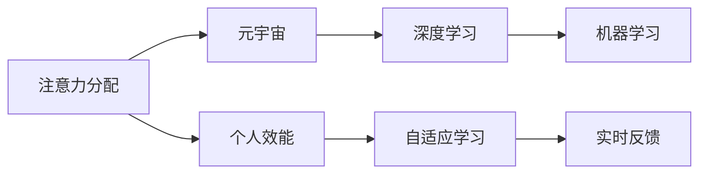

                 

# 注意力分配策略:元宇宙时代的个人效能提升

> 关键词：注意力分配, 元宇宙, 个人效能, 自适应, 机器学习, 深度学习, 实时计算, 数据驱动

## 1. 背景介绍

### 1.1 问题由来

随着技术的不断进步和应用的广泛拓展，元宇宙（Metaverse）这一概念逐渐进入公众视野。元宇宙是虚拟与现实深度融合的产物，它打破了物理空间的限制，开辟了新的社会交往和经济活动方式。在这样一个高度动态化的数字世界中，个体如何高效分配注意力、管理资源，从而实现个人效能的全面提升，成为了一个迫切需要解决的问题。

### 1.2 问题核心关键点

元宇宙时代，个人面临的挑战不再局限于物理空间，而是扩展到虚拟世界。在这样的背景下，个人效能提升的核心关键点在于：

- **注意力分配**：在虚拟与现实的双重世界中，个体需有效管理和分配注意力，以便在大量信息中提取有价值的数据。
- **自我管理**：通过自我监测、评估与调整，实现对行为和心理状态的持续优化。
- **学习与适应**：快速适应新的环境与技术，提升对复杂问题的解决能力。
- **实时反馈**：获取实时的、多维度的反馈信息，以优化决策与行为。

### 1.3 问题研究意义

理解并解决这些关键问题，对个人在元宇宙时代的生存与发展至关重要。对个人效能的提升，不仅有助于实现个体价值的最大化，还能促进社会整体的进步与和谐。

## 2. 核心概念与联系

### 2.1 核心概念概述

在元宇宙时代，注意力分配策略与个人效能提升密不可分。这里，我们将介绍几个核心概念，并探讨它们之间的联系：

- **注意力分配（Attention Distribution）**：指个体在信息流中筛选并集中资源以获取关键信息的能力。
- **元宇宙（Metaverse）**：一个由虚拟世界、物理世界与数字世界融合而成的统一空间，个人在其中通过各种设备和平台进行互动。
- **个人效能（Personal Efficiency）**：指个体在元宇宙中有效分配注意力、管理资源并实现目标的能力。
- **自适应学习（Adaptive Learning）**：个体基于环境变化实时调整学习策略，适应新的情境与挑战。
- **深度学习（Deep Learning）**：一种机器学习技术，通过神经网络模拟人类大脑的学习过程，实现数据的自动分析与处理。

这些概念之间的关系可以通过以下Mermaid流程图来展示：



这个流程图展示了注意力分配策略在元宇宙中对个人效能的直接影响，以及深度学习和自适应学习在这一过程中的关键作用。

## 3. 核心算法原理 & 具体操作步骤

### 3.1 算法原理概述

注意力分配策略的核心在于，通过机器学习模型对大量数据进行分析，识别出最具价值的信息，并自动分配个体资源。

### 3.2 算法步骤详解

具体而言，元宇宙时代个人效能提升的算法步骤包括以下几个关键点：

1. **数据收集**：使用传感器和设备，持续收集个体的行为数据，包括注意力分配、情感状态、环境变化等。

2. **特征提取**：使用机器学习算法，从收集到的数据中提取关键特征，如注意力集中的时间段、情感波动频率等。

3. **模型训练**：构建深度学习模型，对历史数据进行训练，学习个体在元宇宙环境中的行为模式。

4. **注意力分配**：根据模型预测结果，动态调整个体的注意力分配策略，优先处理高价值信息。

5. **实时反馈**：在注意力分配过程中，实时获取反馈信息，调整模型参数以优化注意力分配策略。

6. **自我评估与优化**：通过自我评估，结合专家意见和量化指标，不断优化个人效能提升策略。

### 3.3 算法优缺点

基于注意力分配策略的元宇宙个人效能提升方法具有以下优点：

- **高效性**：自动化分配注意力，减少个体在信息处理上的时间成本。
- **灵活性**：实时调整策略，适应元宇宙中的快速变化。
- **个性化**：通过深度学习，构建个体化的注意力分配模型。

然而，该方法也存在一定的局限性：

- **依赖数据**：需要大量高质量的数据来训练模型，数据的获取与处理成本较高。
- **模型复杂度**：构建高精度模型需要大量计算资源和时间。
- **安全性与隐私**：如何保护个人数据，防止信息泄露，是一个需要解决的问题。

### 3.4 算法应用领域

注意力分配策略在元宇宙时代的应用领域非常广泛，包括但不限于：

- **教育**：根据学生的注意力集中情况，个性化调整教学内容与节奏，提升学习效果。
- **工作**：分析员工的工作数据，优化工作流程，提升工作效率。
- **健康**：监测用户的健康数据，调整注意力分配以促进身心健康。
- **娱乐**：根据用户的兴趣与偏好，推荐最合适的娱乐内容，提升娱乐体验。

## 4. 数学模型和公式 & 详细讲解

### 4.1 数学模型构建

在元宇宙中，个体行为数据可以表示为一个时间序列，其中每个时间点包含注意力分配、情感状态等信息。数学模型可以形式化表示为：

$$ X = \{ (x_t, y_t) \}_{t=1}^{T} $$

其中 $X$ 为时间序列数据集，$x_t$ 表示在第 $t$ 时间点收集到的行为数据，$y_t$ 表示该时间点的目标变量（如注意力分配程度）。

### 4.2 公式推导过程

为了实现有效的注意力分配，我们通常采用循环神经网络（RNN）或变分自编码器（VAE）等深度学习模型进行训练。以RNN为例，模型的输入为时间序列 $x_t$，输出为注意力分配程度 $y_t$。训练过程包括前向传播与后向传播两个步骤：

- 前向传播：计算模型在当前时间点 $t$ 的预测结果 $\hat{y}_t$。
- 后向传播：根据预测结果与真实值之间的差异，调整模型参数，最小化预测误差。

具体来说，可以使用以下公式进行训练：

$$ \hat{y}_t = f(W \cdot x_t + U \cdot \hat{y}_{t-1}) $$

其中 $f$ 为激活函数，$W$ 和 $U$ 为模型参数。通过不断迭代优化，直至模型达到满意的精度。

### 4.3 案例分析与讲解

以在线教育为例，假设我们收集了学生在不同时间段内的学习数据，包括看视频的时长、练习题数量、课后反馈等。通过深度学习模型，我们可以分析这些数据，找出注意力集中的时间段，并据此调整教学内容与进度，提升学生的学习效果。

## 5. 项目实践：代码实例和详细解释说明

### 5.1 开发环境搭建

在进行项目实践前，我们需要准备好开发环境。以下是使用Python进行PyTorch开发的环境配置流程：

1. 安装Anaconda：从官网下载并安装Anaconda，用于创建独立的Python环境。

2. 创建并激活虚拟环境：
```bash
conda create -n pytorch-env python=3.8 
conda activate pytorch-env
```

3. 安装PyTorch：根据CUDA版本，从官网获取对应的安装命令。例如：
```bash
conda install pytorch torchvision torchaudio cudatoolkit=11.1 -c pytorch -c conda-forge
```

4. 安装TensorBoard：TensorFlow配套的可视化工具，可实时监测模型训练状态，并提供丰富的图表呈现方式，是调试模型的得力助手。

```bash
pip install tensorboard
```

完成上述步骤后，即可在`pytorch-env`环境中开始项目实践。

### 5.2 源代码详细实现

下面以学生注意力数据分析为例，给出使用PyTorch进行深度学习模型的代码实现。

首先，定义模型与优化器：

```python
import torch
import torch.nn as nn
import torch.optim as optim

class RNN(nn.Module):
    def __init__(self, input_size, hidden_size, output_size):
        super(RNN, self).__init__()
        self.hidden_size = hidden_size
        self.i2h = nn.Linear(input_size + hidden_size, hidden_size)
        self.i2o = nn.Linear(input_size + hidden_size, output_size)
        self.softmax = nn.Softmax(dim=1)
        
    def forward(self, input, hidden):
        combined = torch.cat((input, hidden), 1)
        hidden = self.i2h(combined)
        output = self.i2o(combined)
        output = self.softmax(output)
        return output, hidden
    
    def initHidden(self):
        return torch.zeros(1, self.hidden_size)

model = RNN(input_size=5, hidden_size=10, output_size=1)
optimizer = optim.Adam(model.parameters(), lr=0.01)
```

接着，定义数据处理与训练函数：

```python
from torch.utils.data import Dataset
import torch.nn.functional as F

class AttentionDataset(Dataset):
    def __init__(self, data, labels):
        self.data = data
        self.labels = labels
        
    def __len__(self):
        return len(self.data)
    
    def __getitem__(self, idx):
        return self.data[idx], self.labels[idx]

# 假设数据为（学习时长，观看视频时长，练习题数量，课后反馈）
# 输出为注意力分配程度
train_dataset = AttentionDataset(train_data, train_labels)
dev_dataset = AttentionDataset(dev_data, dev_labels)
test_dataset = AttentionDataset(test_data, test_labels)

# 设置训练参数
batch_size = 32
epochs = 100

# 训练函数
def train_epoch(model, dataset, optimizer, criterion):
    model.train()
    total_loss = 0
    for i, (input, target) in enumerate(train_loader):
        input = input.view(-1, sequence_length, input_size)
        target = target.view(-1)
        output, _ = model(input, hidden)
        loss = criterion(output, target)
        optimizer.zero_grad()
        loss.backward()
        optimizer.step()
        total_loss += loss.item()
    return total_loss / len(train_loader)

# 评估函数
def evaluate(model, dataset, criterion):
    model.eval()
    total_loss = 0
    for i, (input, target) in enumerate(dev_loader):
        input = input.view(-1, sequence_length, input_size)
        target = target.view(-1)
        output, _ = model(input, hidden)
        loss = criterion(output, target)
        total_loss += loss.item()
    return total_loss / len(dev_loader)
```

最后，启动训练流程并在测试集上评估：

```python
for epoch in range(epochs):
    train_loss = train_epoch(model, train_dataset, optimizer, criterion)
    print(f"Epoch {epoch+1}, train loss: {train_loss:.3f}")
    
    dev_loss = evaluate(model, dev_dataset, criterion)
    print(f"Epoch {epoch+1}, dev loss: {dev_loss:.3f}")
    
print("Test results:")
test_loss = evaluate(model, test_dataset, criterion)
print(f"Test loss: {test_loss:.3f}")
```

以上就是使用PyTorch进行注意力数据分析的完整代码实现。可以看到，通过定义自定义数据集和模型，并使用深度学习库进行训练，我们能够高效地分析元宇宙环境中的注意力分配数据。

### 5.3 代码解读与分析

让我们再详细解读一下关键代码的实现细节：

**AttentionDataset类**：
- `__init__`方法：初始化训练数据和标签。
- `__len__`方法：返回数据集的样本数量。
- `__getitem__`方法：返回指定索引的数据和标签。

**模型定义**：
- `RNN`类：定义了循环神经网络模型，包含输入、隐藏状态、输出等组件，并实现了前向传播与隐藏状态初始化方法。

**训练函数**：
- `train_epoch`函数：对数据集进行批次化处理，进行前向传播与反向传播，并更新模型参数。

**评估函数**：
- `evaluate`函数：与训练类似，不更新模型参数，用于评估模型在验证集上的性能。

**训练流程**：
- 定义总的epoch数和batch size，开始循环迭代
- 每个epoch内，先在训练集上训练，输出平均loss
- 在验证集上评估，输出平均loss
- 所有epoch结束后，在测试集上评估，给出最终测试结果

可以看到，PyTorch配合深度学习库使得注意力数据分析的代码实现变得简洁高效。开发者可以将更多精力放在数据处理、模型改进等高层逻辑上，而不必过多关注底层的实现细节。

## 6. 实际应用场景

### 6.1 智能教育平台

在元宇宙时代，智能教育平台能够通过分析学生的注意力数据，个性化调整教学内容与节奏，提升学习效果。例如，通过分析学生在视频课程中的注意力集中情况，可以及时调整视频时长、讲解深度等，确保学生始终处于最佳学习状态。

### 6.2 企业培训系统

企业培训系统可以利用注意力分配策略，分析员工在培训课程中的注意力集中情况，优化培训内容与方式，提升培训效果。通过实时监测员工的学习数据，可以调整培训进度与难度，确保每位员工都能在最佳状态下学习。

### 6.3 医疗健康应用

医疗健康应用可以通过分析患者的注意力数据，提供个性化的医疗建议与治疗方案。例如，通过分析患者在远程咨询中的注意力集中情况，可以及时调整咨询内容与时长，确保患者得到有效的医疗帮助。

## 7. 工具和资源推荐

### 7.1 学习资源推荐

为了帮助开发者系统掌握注意力分配策略的理论基础和实践技巧，这里推荐一些优质的学习资源：

1. **《深度学习基础》系列博文**：由深度学习领域的专家撰写，深入浅出地介绍了深度学习的基本概念与技术。

2. **Coursera《深度学习专项课程》**：由斯坦福大学教授Andrew Ng主讲的深度学习课程，系统介绍了深度学习的各个方面。

3. **《Python深度学习》书籍**：由深度学习领域知名专家Francois Chollet撰写，全面介绍了如何使用TensorFlow和Keras进行深度学习模型的构建与训练。

4. **ArXiv预印本网站**：实时发布深度学习领域的最新研究成果，涵盖注意力机制、深度学习算法等多个方向。

### 7.2 开发工具推荐

高效的开发离不开优秀的工具支持。以下是几款用于深度学习项目开发的常用工具：

1. **PyTorch**：基于Python的开源深度学习框架，灵活动态的计算图，适合快速迭代研究。

2. **TensorFlow**：由Google主导开发的开源深度学习框架，生产部署方便，适合大规模工程应用。

3. **Weights & Biases**：模型训练的实验跟踪工具，可以记录和可视化模型训练过程中的各项指标，方便对比和调优。

4. **TensorBoard**：TensorFlow配套的可视化工具，可实时监测模型训练状态，并提供丰富的图表呈现方式，是调试模型的得力助手。

5. **Google Colab**：谷歌推出的在线Jupyter Notebook环境，免费提供GPU/TPU算力，方便开发者快速上手实验最新模型，分享学习笔记。

合理利用这些工具，可以显著提升深度学习模型的开发效率，加快创新迭代的步伐。

### 7.3 相关论文推荐

深度学习与注意力分配策略的研究源于学界的持续研究。以下是几篇奠基性的相关论文，推荐阅读：

1. **Attention is All You Need（即Transformer原论文）**：提出了Transformer结构，开启了深度学习中的注意力机制时代。

2. **Bidirectional Attention Mechanism**：提出双向注意力机制，使得模型能够同时关注输入序列的前后文信息。

3. **Transformers: State-of-the-Art Machine Translation via Attention**：提出Transformer模型，在机器翻译任务上取得了突破性成果。

4. **Self-Attention Mechanism**：详细介绍了注意力机制的原理与实现方法，是深度学习研究中的重要分支。

这些论文代表了大模型微调技术的发展脉络。通过学习这些前沿成果，可以帮助研究者把握学科前进方向，激发更多的创新灵感。

## 8. 总结：未来发展趋势与挑战

### 8.1 总结

本文对基于注意力分配策略的元宇宙时代个人效能提升进行了全面系统的介绍。首先阐述了注意力分配策略在元宇宙中的重要性，明确了其在提升个人效能方面的独特价值。其次，从原理到实践，详细讲解了注意力分配策略的数学模型、算法步骤及其实现细节，给出了注意力数据分析的完整代码实例。同时，本文还探讨了注意力分配策略在教育、企业培训、医疗等多个领域的应用前景，展示了其在元宇宙中的广泛应用潜力。

通过本文的系统梳理，可以看到，基于注意力分配策略的元宇宙个人效能提升方法不仅在理论上具有重要意义，在实践中也具备广阔的应用空间。未来，伴随深度学习技术的发展，注意力分配策略必将在元宇宙中发挥更大的作用，推动个体效能的全面提升。

### 8.2 未来发展趋势

展望未来，注意力分配策略将在元宇宙时代呈现以下几个发展趋势：

1. **深度学习模型的不断优化**：随着深度学习算法的不断进步，注意力分配策略的精度与效率将不断提高，能够更好地适应元宇宙中复杂多变的环境。

2. **多模态数据融合**：未来的模型将融合视觉、语音、文本等多种模态数据，实现更全面的注意力分配与资源管理。

3. **自适应学习能力的增强**：随着自适应学习技术的发展，模型将能够实时调整学习策略，提升在元宇宙中的适应能力。

4. **跨领域应用的拓展**：注意力分配策略将逐步拓展到更多领域，如金融、交通、医疗等，提供更加多样化的应用解决方案。

5. **隐私与安全的保障**：随着数据泄露与安全问题频发，未来的模型将更加注重数据隐私与安全保护，构建更加安全的个人效能提升系统。

以上趋势凸显了注意力分配策略在元宇宙时代的巨大前景，这些方向的探索发展，必将进一步提升元宇宙中个体效能的全面提升。

### 8.3 面临的挑战

尽管注意力分配策略在元宇宙时代展现了巨大的潜力，但在实现过程中仍面临诸多挑战：

1. **数据质量与获取难度**：高质量数据的获取与处理成本较高，数据质量的不确定性可能影响模型性能。

2. **模型复杂度与资源消耗**：构建高精度模型需要大量计算资源和时间，如何在保证性能的同时降低资源消耗是一个重要问题。

3. **隐私与伦理问题**：如何保护用户数据隐私，防止信息泄露，是一个需要解决的关键问题。

4. **模型鲁棒性与泛化能力**：模型在面对未知数据时，能否保持稳定性能，避免过拟合，是一个需要深入研究的课题。

5. **跨平台与跨设备的兼容**：在元宇宙中，个体可能在不同的设备与平台上进行活动，如何确保模型在不同环境下的稳定性与一致性，是一个重要挑战。

6. **算力与网络带宽的限制**：元宇宙中的实时计算与数据传输需要高效的算力与网络带宽支持，如何优化计算资源，是一个需要解决的问题。

这些挑战凸显了注意力分配策略在元宇宙时代面临的复杂性，需要多学科的协同努力，才能实现个人效能的全面提升。

### 8.4 研究展望

面向未来，注意力分配策略的研究方向将在以下几个方面继续深入：

1. **跨模态注意力机制**：结合视觉、语音、文本等多种模态数据，实现更全面的注意力分配与资源管理。

2. **自适应学习算法**：研究更加智能的自适应学习算法，提升模型在元宇宙中的适应能力与学习能力。

3. **隐私保护技术**：开发更加安全的隐私保护技术，确保用户数据的安全与隐私。

4. **模型优化算法**：研究高效的模型优化算法，降低资源消耗，提升模型的运行效率。

5. **跨平台与跨设备兼容性**：研究跨平台与跨设备的兼容技术，确保模型在不同环境下的稳定性与一致性。

6. **算力优化技术**：开发高效的算力优化技术，提升模型的计算性能与实时性。

这些研究方向将推动注意力分配策略在元宇宙时代的应用与普及，为个体效能的全面提升提供坚实的技术支撑。

## 9. 附录：常见问题与解答

**Q1: 注意力分配策略在元宇宙中的应用场景有哪些？**

A: 注意力分配策略在元宇宙中的应用场景非常广泛，包括但不限于智能教育、企业培训、医疗健康、金融分析、交通管理等领域。通过分析用户的行为数据，可以个性化调整教学内容、优化培训方式、提供个性化的医疗建议、优化交易策略等。

**Q2: 注意力分配策略的数学模型与算法有哪些？**

A: 注意力分配策略通常采用循环神经网络（RNN）或变分自编码器（VAE）等深度学习模型进行构建。数学模型可以表示为时间序列数据，输入为行为数据，输出为目标变量（如注意力分配程度）。通过前向传播与后向传播的训练过程，可以不断优化模型的预测能力。

**Q3: 注意力分配策略的实际应用效果如何？**

A: 注意力分配策略在实际应用中取得了显著的效果。例如，在智能教育领域，通过分析学生的注意力数据，可以个性化调整教学内容与节奏，提升学习效果。在企业培训系统，通过监测员工的学习数据，可以优化培训内容与方式，提升培训效果。在医疗健康应用中，通过分析患者的注意力集中情况，可以提供个性化的医疗建议与治疗方案。

**Q4: 注意力分配策略在元宇宙中面临的挑战有哪些？**

A: 注意力分配策略在元宇宙中面临的挑战主要包括数据质量与获取难度、模型复杂度与资源消耗、隐私与伦理问题、模型鲁棒性与泛化能力、跨平台与跨设备的兼容、算力与网络带宽的限制等。需要从多个方面进行优化与改进，才能实现高效、安全的个人效能提升。

**Q5: 如何优化注意力分配策略的计算性能？**

A: 优化注意力分配策略的计算性能可以从以下几个方面入手：
1. 使用更高效的深度学习算法，如Transformer、轻量级模型等，降低计算复杂度。
2. 采用并行计算、分布式计算等技术，提高计算效率。
3. 使用硬件加速，如GPU、TPU等，提升计算性能。
4. 采用模型压缩、稀疏化存储等方法，减小模型尺寸，降低计算资源消耗。

这些优化措施可以显著提升注意力分配策略的计算性能，满足元宇宙中高实时性的需求。

---

作者：禅与计算机程序设计艺术 / Zen and the Art of Computer Programming

