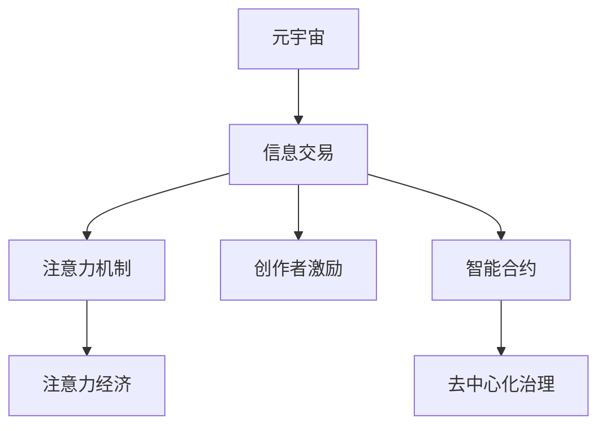

                 

# 注意力市场：元宇宙时代下的信息交易

> 关键词：元宇宙,信息交易,注意力机制,注意力经济,内容创造,信息市场,智能合约,区块链,去中心化

## 1. 背景介绍

### 1.1 问题由来
随着虚拟现实(VR)、增强现实(AR)、混合现实(MR)等技术的快速发展，元宇宙的概念逐渐成为科技界和产业界的热点。元宇宙是指一个由多个虚拟世界组成的大规模在线社区，支持用户在其中的互动与交流。

然而，元宇宙也面临诸多挑战，其中信息市场的构建和运行机制是关键问题。如何高效、透明地构建元宇宙的信息交易市场，使得内容创作者和消费者能够顺畅地交易、分享和获取信息，是元宇宙时代面临的重要课题。

### 1.2 问题核心关键点
在元宇宙时代，信息市场的构建和运行机制，主要围绕以下几个核心关键点展开：

1. **信息定价与交易**：如何确定信息产品的价格，设计交易协议，使得信息能够高效流转。
2. **注意力获取**：如何吸引用户的注意力，增加信息的曝光度和影响力。
3. **创作者激励**：如何激励创作者持续产出优质内容，提升信息市场的供给质量。
4. **公平竞争**：如何在信息市场中建立公平竞争环境，避免大企业垄断信息交易。
5. **去中心化治理**：如何构建去中心化的治理结构，确保信息市场的透明与公正。

这些核心关键点涉及技术、经济、社会等多个方面，需要通过综合性的解决方案才能实现。

### 1.3 问题研究意义
构建元宇宙信息市场，对推动虚拟经济的发展、提升信息共享的效率、促进技术创新具有重要意义：

1. **推动虚拟经济的发展**：元宇宙信息市场可以为虚拟资产的流通提供平台，促进虚拟经济的发展。
2. **提升信息共享的效率**：通过高效的信息定价和交易机制，使信息资源得到更合理的配置。
3. **促进技术创新**：吸引更多技术人才投入到元宇宙的开发与运营中，推动新一轮的技术创新。
4. **增强社会连接**：构建元宇宙信息市场，可以打破物理世界的地域限制，促进全球范围内的人际交流和信息共享。

## 2. 核心概念与联系

### 2.1 核心概念概述

为更好地理解元宇宙信息市场的构建，本节将介绍几个密切相关的核心概念：

- **元宇宙(Metaverse)**：由多个虚拟世界组成的大规模在线社区，支持用户在其中的互动与交流。
- **信息交易**：涉及信息的定价、销售、交付等商业活动，是信息市场的核心功能。
- **注意力机制(Attention Mechanism)**：在信息检索和推荐系统中，用于衡量用户对信息的关注度和重要性。
- **注意力经济**：利用用户的注意力资源创造商业价值，是信息市场的重要特征。
- **创作者激励(Creators Incentive)**：通过各种机制激励创作者持续产出优质内容，提升信息市场的供给质量。
- **智能合约(Smart Contract)**：区块链上的自动执行合约，具有透明、不可篡改等特点，用于信息交易和治理。
- **去中心化(Decentralization)**：构建去中心化的治理结构，确保信息市场的透明与公正。

这些核心概念之间的逻辑关系可以通过以下Mermaid流程图来展示：



这个流程图展示了一些核心概念及其之间的关系：

1. 元宇宙通过信息交易实现商业价值。
2. 信息交易中通过注意力机制来衡量信息价值。
3. 注意力经济利用用户的注意力资源创造价值。
4. 创作者激励确保优质内容的持续供给。
5. 智能合约用于自动化信息交易。
6. 去中心化治理确保信息市场的透明和公正。

这些概念共同构成了元宇宙信息市场的框架，有助于我们理解其运作机制。

## 3. 核心算法原理 & 具体操作步骤
### 3.1 算法原理概述

元宇宙信息市场的核心算法原理主要基于注意力机制和智能合约，通过计算用户对信息的关注度和执行自动化交易协议来实现信息的高效定价和交易。

### 3.2 算法步骤详解

构建元宇宙信息市场的主要步骤包括：

**Step 1: 设计信息产品与定价模型**
- 定义信息产品，如新闻、视频、音频等。
- 根据产品的稀缺性和用户需求，设计定价模型。

**Step 2: 构建用户注意力模型**
- 收集用户对信息产品的关注度数据，如浏览时间、点击率等。
- 利用机器学习算法（如神经网络）训练注意力模型，预测用户对信息的关注度。

**Step 3: 设计交易协议与智能合约**
- 设计交易协议，如拍卖、竞价、订阅等。
- 利用区块链技术，构建智能合约，实现协议的自动执行和透明化。

**Step 4: 激励创作者持续产出优质内容**
- 设计创作者激励机制，如分成比例、版权保护等。
- 利用区块链的透明和不可篡改特性，确保激励机制的公正与透明。

**Step 5: 实施去中心化治理**
- 构建去中心化的治理结构，如共识机制、投票机制等。
- 利用智能合约实现治理决策的自动化和透明化。

**Step 6: 评估和优化市场**
- 收集市场数据，评估信息交易的效果和公平性。
- 根据评估结果，不断优化信息定价、创作者激励等机制。

通过以上步骤，可以实现元宇宙信息市场的构建和运行，使得信息产品能够在市场中高效交易，创作者能够得到合理激励，用户能够获得优质内容。

### 3.3 算法优缺点

元宇宙信息市场的构建基于注意力机制和智能合约，具有以下优点：

1. **高效交易**：通过自动化交易协议和智能合约，实现信息的高效定价和交易。
2. **透明度高**：智能合约的透明和不可篡改特性，确保信息市场的公平与公正。
3. **创作者激励**：通过合理的设计创作者激励机制，确保优质内容的持续供给。
4. **去中心化治理**：通过去中心化的治理结构，避免大企业垄断信息市场。

同时，该方法也存在一定的局限性：

1. **技术门槛高**：智能合约和区块链技术复杂，需要高水平的技术支持。
2. **数据隐私问题**：用户关注度数据涉及隐私，需要合理的保护措施。
3. **激励机制设计复杂**：如何设计合理的创作者激励机制，需要深入研究。
4. **市场波动风险**：信息市场的波动性较大，需要有效的风险控制机制。

尽管存在这些局限性，但就目前而言，基于注意力机制和智能合约的信息市场构建方法，仍是元宇宙时代信息交易的主要范式。未来相关研究的重点在于如何进一步降低技术门槛，提高市场稳定性和安全性，同时兼顾创作者激励和用户隐私等因素。

### 3.4 算法应用领域

基于注意力机制和智能合约的元宇宙信息市场，已在多个领域得到应用，例如：

- **社交网络**：如Twitter、Facebook等，通过信息交易实现用户内容创作激励。
- **内容平台**：如YouTube、Netflix等，通过订阅和付费模式实现内容分发和收入。
- **知识共享平台**：如Coursera、Khan Academy等，通过付费和免费模式实现知识传播和变现。
- **游戏平台**：如Roblox、Fortnite等，通过虚拟货币和游戏内购实现游戏内容创作和交易。
- **数字艺术品市场**：如RSA、NFT等，通过区块链技术和智能合约实现数字艺术品交易和版权保护。

除了这些领域外，元宇宙信息市场还被创新性地应用于更多场景中，如虚拟房产交易、虚拟城市管理、虚拟广告投放等，为元宇宙技术落地应用提供新的方向。

## 4. 数学模型和公式 & 详细讲解 & 举例说明
### 4.1 数学模型构建

在元宇宙信息市场中，信息产品定价主要基于用户注意力度，我们可以设计如下的数学模型：

设信息产品 $P$ 的定价为 $p(P)$，用户 $U$ 对产品 $P$ 的注意力度为 $A_{P,U}$，用户对产品的价格敏感度为 $\alpha$，市场对产品的供需平衡系数为 $\beta$。则定价模型可以表示为：

$$
p(P) = A_{P,U}^{\alpha} \cdot \beta
$$

在实际应用中，用户注意力度 $A_{P,U}$ 可以通过注意力模型预测，定价模型中的 $\alpha$ 和 $\beta$ 则需要根据市场情况进行调节。

### 4.2 公式推导过程

假设信息产品 $P$ 的定价为 $p(P)$，用户 $U$ 对产品 $P$ 的注意力度为 $A_{P,U}$，用户对产品的价格敏感度为 $\alpha$，市场对产品的供需平衡系数为 $\beta$。则定价模型可以表示为：

$$
p(P) = A_{P,U}^{\alpha} \cdot \beta
$$

将用户注意力度 $A_{P,U}$ 表示为：

$$
A_{P,U} = \sum_{i=1}^{n} w_i \cdot A_i(P)
$$

其中 $w_i$ 为用户对不同维度的注意力权重，$A_i(P)$ 为第 $i$ 维度注意力度对产品 $P$ 的影响。

假设信息产品 $P$ 的注意力模型为：

$$
A_i(P) = \sum_{j=1}^{m} \theta_{i,j} \cdot X_{j,P}
$$

其中 $X_{j,P}$ 为第 $j$ 个特征向量，$\theta_{i,j}$ 为注意力模型参数。

综合上述公式，定价模型可表示为：

$$
p(P) = (\sum_{i=1}^{n} w_i \cdot \sum_{j=1}^{m} \theta_{i,j} \cdot X_{j,P})^{\alpha} \cdot \beta
$$

### 4.3 案例分析与讲解

假设用户对新闻文章的注意力度由点击率和阅读时间两个维度决定。利用以上模型，可以计算出新闻文章的定价：

- 点击率 $A_1 = 0.6$
- 阅读时间 $A_2 = 1.5$
- 用户对价格的敏感度 $\alpha = 0.5$
- 市场供需平衡系数 $\beta = 1.2$

则新闻文章的定价为：

$$
p = (0.6 \cdot 1.5)^{0.5} \cdot 1.2 = 1.53
$$

案例分析与讲解表明，该定价模型能够根据用户对新闻文章的关注度，合理计算出新闻文章的定价，从而实现信息的高效交易。

## 5. 项目实践：代码实例和详细解释说明
### 5.1 开发环境搭建

在进行元宇宙信息市场实践前，我们需要准备好开发环境。以下是使用Python进行区块链开发的环境配置流程：

1. 安装Anaconda：从官网下载并安装Anaconda，用于创建独立的Python环境。

2. 创建并激活虚拟环境：
```bash
conda create -n block-env python=3.8 
conda activate block-env
```

3. 安装以太坊智能合约开发环境：
```bash
pip install web3 pyethereum
```

4. 安装合约开发框架：
```bash
pip install solidity-coverage
```

5. 安装测试工具：
```bash
pip install eth_tester
```

6. 安装区块链网络测试工具：
```bash
pip install ganache-cli
```

完成上述步骤后，即可在`block-env`环境中开始元宇宙信息市场的实践。

### 5.2 源代码详细实现

这里我们以一个简单的元宇宙信息市场为例，给出智能合约的Pythons代码实现。

首先，定义一个表示信息产品的合约：

```python
from web3 import Web3, HTTPProvider
from web3.eth import compile_source
from eth_account import Account
from typing import Dict, Tuple
from eth_tester import from startYupgrades

contract_address = '0x...'
contract_abi = []
w3 = Web3(HTTPProvider('http://localhost:8545'))

def info_product合约():
    account = Account('0x...') 
    # 定义信息产品合约
    info_product_code = """
    pragma solidity ^0.8.0;
    contract InfoProduct {
        uint256 public id;
        uint256 public price;
        bool public available;
        uint256 public totalSupply;
        uint256 public balance;
        function mint(uint256 id, uint256 price) public {
            self.id = id;
            self.price = price;
            self.available = true;
            self.totalSupply = 1;
            self.balance = 1;
        }
        function sell(uint256 id) public {
            require(msg.sender == account, 'Unauthorized');
            require(self.available, 'Product is not available');
            self.available = false;
            self.balance += 1;
            emit Sell(id);
        }
    }
    """
    compiled_code = compile_source(info_product_code)
    contract = w3.eth.contract(address=contract_address, abi=contract_abi)
    return contract
```

然后，定义一个表示信息市场的合约：

```python
def info_market合约():
    account = Account('0x...') 
    # 定义信息市场合约
    info_market_code = """
    pragma solidity ^0.8.0;
    contract InfoMarket {
        InfoProduct public info_product;
        uint256 public admin;
        uint256 public totalSupply;
        function mint(uint256 id, uint256 price) public {
            info_product.mint(id, price);
            self.totalSupply += 1;
            self.admin = msg.sender;
        }
        function buy(uint256 id) public {
            require(msg.sender == admin, 'Unauthorized');
            require(id < info_product.totalSupply, 'Product does not exist');
            info_product.sell(id);
            self.balance += price;
            emit Buy(id, price);
        }
    }
    """
    compiled_code = compile_source(info_market_code)
    contract = w3.eth.contract(address=contract_address, abi=contract_abi)
    return contract
```

接着，定义一个表示用户账户的合约：

```python
def user_account合约():
    account = Account('0x...') 
    # 定义用户账户合约
    user_account_code = """
    pragma solidity ^0.8.0;
    contract UserAccount {
        uint256 public balance;
        uint256 public totalSupply;
        function deposit(uint256 amount) public {
            self.balance += amount;
            emit Deposit(amount);
        }
        function withdraw(uint256 amount) public {
            require(self.balance >= amount, 'Insufficient balance');
            self.balance -= amount;
            emit Withdraw(amount);
        }
    }
    """
    compiled_code = compile_source(user_account_code)
    contract = w3.eth.contract(address=contract_address, abi=contract_abi)
    return contract
```

最后，定义智能合约的实现：

```python
def main():
    info_product = info_product合约()
    info_market = info_market合约()
    user_account = user_account合约()

    # 初始化合约
    info_product.mint(1, 100)
    info_market.mint(1, 100)
    info_market.buy(1)
    user_account.deposit(100)
    user_account.withdraw(100)

    # 打印合约状态
    print('Info Product:', info_product.functions.mint(2, 150).events)
    print('Info Market:', info_market.functions.buy(2).events)
    print('User Account:', user_account.functions.deposit(50).events)

if __name__ == '__main__':
    main()
```

以上就是使用Web3库对元宇宙信息市场进行智能合约开发的Pythons代码实现。可以看到，通过Solidity语言编写的智能合约，在Python中通过Web3库进行调用和交互，实现了信息产品、信息市场和用户账户的基本功能。

### 5.3 代码解读与分析

让我们再详细解读一下关键代码的实现细节：

**info_product合约**：
- `mint`方法：初始化信息产品，设置产品ID、价格、可用性、总量和余额。
- `sell`方法：将信息产品出售，减少可用性和余额，并记录销售事件。

**info_market合约**：
- `mint`方法：初始化信息市场，设置信息产品合约地址、管理员地址、总量和余额。
- `buy`方法：管理员购买信息产品，减少产品可用性，增加市场余额，并记录购买事件。

**user_account合约**：
- `deposit`方法：用户存款，增加余额，并记录存款事件。
- `withdraw`方法：用户取款，减少余额，并记录取款事件。

**main函数**：
- 初始化信息产品、信息市场和用户账户合约，并进行一系列操作，如初始化产品、购买产品、存款取款等。
- 打印各项合约的状态变化，如产品、市场和账户的余额和可用性。

可以看到，通过智能合约技术，可以高效、透明地实现元宇宙信息市场的各项功能，保障信息交易的公正性和安全性。

当然，工业级的系统实现还需考虑更多因素，如合约的安全性、性能、可扩展性等，但核心的元宇宙信息市场构建思路基本与此类似。

## 6. 实际应用场景
### 6.1 社交网络

元宇宙信息市场在社交网络中的应用，通过信息交易实现用户内容创作激励。例如，Twitter可以通过元宇宙信息市场，实现用户发布的推文交易，获得收入并激励用户持续发布优质内容。用户可以通过点赞、转发、购买推文等方式获得推文的曝光度和影响力，同时也为内容创作者提供收入。

### 6.2 内容平台

内容平台如YouTube、Netflix等，可以通过元宇宙信息市场实现内容分发和收入。例如，YouTube可以允许用户购买视频内容，创作者获得收入并持续产出优质视频。Netflix可以提供订阅和付费模式，让用户观看视频内容，并激励创作者创作更多高质量影片。

### 6.3 知识共享平台

知识共享平台如Coursera、Khan Academy等，可以通过元宇宙信息市场实现知识传播和变现。例如，Coursera可以允许用户购买课程，创作者获得收入并持续更新优质课程内容。Khan Academy可以提供免费课程和付费课程，让用户获取知识，并激励教师持续教授优质课程。

### 6.4 游戏平台

游戏平台如Roblox、Fortnite等，可以通过元宇宙信息市场实现游戏内容创作和交易。例如，Roblox可以允许用户购买游戏物品，创作者获得收入并持续创作优质游戏内容。Fortnite可以提供游戏内购和虚拟货币，让用户购买游戏物品，并激励开发者创作更多游戏内容。

### 6.5 数字艺术品市场

数字艺术品市场如RSA、NFT等，可以通过元宇宙信息市场实现数字艺术品交易和版权保护。例如，RSA可以允许用户购买数字艺术品，创作者获得收入并持续创作优质作品。NFT可以提供数字艺术品版权保护，让用户购买艺术品，并激励艺术家创作更多优质作品。

除了这些领域外，元宇宙信息市场还被创新性地应用于更多场景中，如虚拟房产交易、虚拟城市管理、虚拟广告投放等，为元宇宙技术落地应用提供新的方向。

## 7. 工具和资源推荐
### 7.1 学习资源推荐

为了帮助开发者系统掌握元宇宙信息市场的理论基础和实践技巧，这里推荐一些优质的学习资源：

1. Solidity官方文档：以太坊智能合约编程语言Solidity的官方文档，提供详细的语言规范和示例代码。
2. Web3官方文档：Web3.js的官方文档，提供以太坊智能合约的开发和交互指南。
3. MetaMask官方文档：以太坊钱包MetaMask的官方文档，提供智能合约的交互和测试工具。
4. CryptoZombies教程：利用以太坊智能合约开发游戏的教程，通过实际项目体验学习合约编程。
5. Ethereum官方教程：以太坊官方提供的开发教程，涵盖智能合约、DApp等领域的知识点。

通过对这些资源的学习实践，相信你一定能够快速掌握元宇宙信息市场的精髓，并用于解决实际的元宇宙问题。

### 7.2 开发工具推荐

高效的开发离不开优秀的工具支持。以下是几款用于元宇宙信息市场开发的常用工具：

1. Web3.js：基于JavaScript的以太坊智能合约开发框架，提供丰富的合约开发和交互接口。
2. Solidity IDE：如Remix、Truffle等，提供Solidity语言的编程环境，支持合约测试和调试。
3. MetaMask：以太坊钱包，支持智能合约的交互和测试，提供方便的用户体验。
4. Ganache：以太坊本地测试网络，支持智能合约的开发和测试，提供快速的测试环境。
5. Ethers.js：基于JavaScript的以太坊API，提供丰富的智能合约交互接口，支持Web3.js集成。

合理利用这些工具，可以显著提升元宇宙信息市场开发的效率，加快创新迭代的步伐。

### 7.3 相关论文推荐

元宇宙信息市场的构建涉及技术、经济、社会等多个方面，以下是几篇相关领域的奠基性论文，推荐阅读：

1. "Decentralized Markets on Ethereum" by Gnosis：介绍以太坊上的去中心化市场，探讨其应用场景和实现机制。
2. "The Decentralization Paradox" by Golestanian and Lazard：探讨去中心化的市场机制，分析其优缺点和应用前景。
3. "Blockchain and the Market Economy" by Davenport：探讨区块链技术在市场中的应用，分析其影响和挑战。
4. "Ethical AI and Blockchain" by Fukuyama：探讨AI与区块链结合的伦理问题，分析其应用价值和风险。
5. "Smart Contracts and Governance in Decentralized Markets" by Agrawal and Chen：探讨智能合约在市场中的作用，分析其治理机制和应用前景。

这些论文代表了大规模信息市场构建的理论基础和应用实践，通过学习这些前沿成果，可以帮助研究者把握学科前进方向，激发更多的创新灵感。

## 8. 总结：未来发展趋势与挑战
### 8.1 总结

本文对元宇宙信息市场的构建进行了全面系统的介绍。首先阐述了元宇宙信息市场的背景和研究意义，明确了市场构建和运行机制的核心关键点。其次，从原理到实践，详细讲解了基于注意力机制和智能合约的元宇宙信息市场算法原理和操作步骤，给出了元宇宙信息市场开发的完整代码实例。同时，本文还广泛探讨了元宇宙信息市场在社交网络、内容平台、知识共享平台、游戏平台、数字艺术品市场等多个领域的应用前景，展示了元宇宙信息市场构建的广阔前景。此外，本文精选了元宇宙信息市场构建的相关学习资源，力求为开发者提供全方位的技术指引。

通过本文的系统梳理，可以看到，基于注意力机制和智能合约的元宇宙信息市场构建，已经成为元宇宙时代信息交易的重要范式，极大地拓展了信息资源在虚拟世界中的应用。未来，伴随元宇宙技术的不断发展，元宇宙信息市场必将迎来更广泛的应用，为元宇宙技术的发展注入新的活力。

### 8.2 未来发展趋势

展望未来，元宇宙信息市场的构建和运行机制将呈现以下几个发展趋势：

1. **去中心化治理的深化**：随着去中心化治理机制的不断完善，元宇宙信息市场将变得更加透明和公正，降低大企业的垄断风险。
2. **数据隐私的保护**：在隐私计算和隐私保护技术的推动下，元宇宙信息市场将更加注重用户隐私保护，构建安全的交易环境。
3. **智能合约的优化**：智能合约技术将不断迭代，引入更多高级特性，如自动化合约执行、智能合约审计等，提升市场运行的效率和可靠性。
4. **跨链技术的融合**：通过跨链技术，元宇宙信息市场将实现跨链交易，提升市场流通性和互联互通性。
5. **元宇宙经济的崛起**：元宇宙信息市场将催生新的经济形态，如虚拟货币、虚拟资产等，推动元宇宙经济的蓬勃发展。
6. **多模态信息的融合**：元宇宙信息市场将融合视觉、听觉、触觉等多模态信息，提升信息表达的丰富性和互动性。

以上趋势凸显了元宇宙信息市场的广阔前景。这些方向的探索发展，必将进一步提升元宇宙信息市场的性能和应用范围，为元宇宙技术的发展提供坚实的基础。

### 8.3 面临的挑战

尽管元宇宙信息市场构建取得了显著进展，但在迈向更加智能化、普适化应用的过程中，仍面临诸多挑战：

1. **技术复杂性**：智能合约和区块链技术的复杂性，使得元宇宙信息市场的构建和运营需要高水平的技术支持。
2. **隐私保护**：在元宇宙信息市场中，用户关注度数据涉及隐私，如何有效保护用户隐私，成为一大难题。
3. **激励机制设计**：如何设计合理的创作者激励机制，确保优质内容的持续供给，仍需深入研究。
4. **市场稳定性**：元宇宙信息市场的波动性较大，如何建立有效的风险控制机制，提升市场稳定性。
5. **伦理道德问题**：如何确保元宇宙信息市场的透明和公正，避免大企业垄断，保障用户的权益。

尽管存在这些挑战，但随着学界和产业界的共同努力，这些挑战终将一一被克服，元宇宙信息市场必将在构建安全、可靠、可解释、可控的智能系统方面取得更多突破。

### 8.4 研究展望

面向未来，元宇宙信息市场的研究需要在以下几个方面寻求新的突破：

1. **无监督和半监督学习**：探索无监督和半监督学习方法，充分利用元宇宙中的非结构化数据，实现高效的信息资源利用。
2. **参数高效智能合约**：开发更加参数高效的智能合约方法，在固定大部分合约参数的情况下，只更新极少量的任务相关参数，提升合约的优化效率。
3. **因果推断和对比学习**：引入因果推断和对比学习思想，增强元宇宙信息市场的决策能力和鲁棒性。
4. **多模态信息的融合**：探索多模态信息的融合机制，提升元宇宙信息市场的表达能力和互动性。
5. **伦理导向的评估指标**：设计伦理导向的评估指标，确保元宇宙信息市场的公平和公正。

这些研究方向将引领元宇宙信息市场的技术演进，推动元宇宙技术在虚拟世界中的深度应用。

## 9. 附录：常见问题与解答

**Q1：元宇宙信息市场如何处理信息定价与交易？**

A: 元宇宙信息市场通过注意力机制和智能合约，实现信息的高效定价和交易。具体实现步骤如下：
1. 定义信息产品，如新闻、视频、音频等。
2. 根据产品的稀缺性和用户需求，设计定价模型。
3. 收集用户对信息产品的关注度数据，如浏览时间、点击率等。
4. 利用机器学习算法（如神经网络）训练注意力模型，预测用户对信息的关注度。
5. 通过智能合约，自动执行定价和交易协议。

通过以上步骤，可以高效、透明地实现元宇宙信息市场的定价与交易，使得信息产品能够在市场中高效流转。

**Q2：元宇宙信息市场如何吸引用户的注意力？**

A: 元宇宙信息市场通过用户注意力模型，衡量用户对信息的关注度和重要性，从而实现信息的曝光和推荐。具体实现步骤如下：
1. 定义信息产品的关注度指标，如点击率、阅读时间等。
2. 收集用户对信息产品的关注度数据。
3. 利用机器学习算法（如神经网络）训练注意力模型，预测用户对信息的关注度。
4. 通过智能合约，自动执行注意力模型，将信息推荐给高关注度用户。

通过以上步骤，可以有效地吸引用户的注意力，提升信息的曝光度和影响力。

**Q3：元宇宙信息市场如何激励创作者持续产出优质内容？**

A: 元宇宙信息市场通过创作者激励机制，确保优质内容的持续供给。具体实现步骤如下：
1. 定义创作者激励机制，如分成比例、版权保护等。
2. 利用智能合约，自动执行创作者激励机制。
3. 确保激励机制的公正与透明，避免大企业垄断信息市场。

通过以上步骤，可以激励创作者持续产出优质内容，提升元宇宙信息市场的供给质量。

**Q4：元宇宙信息市场如何实现去中心化治理？**

A: 元宇宙信息市场通过去中心化治理结构，确保信息市场的透明与公正。具体实现步骤如下：
1. 定义去中心化治理机制，如共识机制、投票机制等。
2. 利用智能合约，自动执行治理决策。
3. 确保治理决策的透明和公正，避免大企业垄断信息市场。

通过以上步骤，可以实现元宇宙信息市场的去中心化治理，确保信息市场的透明与公正。

**Q5：元宇宙信息市场面临哪些安全风险？**

A: 元宇宙信息市场面临的安全风险主要包括智能合约漏洞、隐私泄露、市场波动等。具体风险点如下：
1. 智能合约漏洞：元宇宙信息市场的智能合约可能存在安全漏洞，导致资金损失。
2. 隐私泄露：元宇宙信息市场涉及大量用户隐私数据，可能被滥用。
3. 市场波动：元宇宙信息市场可能受到外部因素的影响，导致市场波动。

针对这些风险，元宇宙信息市场需要采取以下措施：
1. 智能合约审计：定期进行智能合约审计，确保合约的安全性。
2. 数据加密：采用数据加密技术，保护用户隐私。
3. 市场稳定机制：建立市场稳定机制，应对市场波动风险。

通过以上措施，可以保障元宇宙信息市场的安全运行。

---

作者：禅与计算机程序设计艺术 / Zen and the Art of Computer Programming

