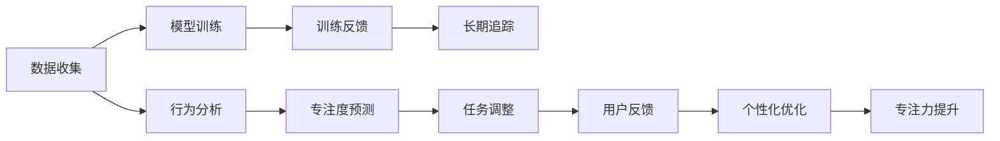

                 

# 注意力游戏化：AI驱动的专注力训练

> 关键词：注意力, 专注力训练, AI驱动, 游戏化

## 1. 背景介绍

在现代社会，信息爆炸与注意力稀缺的矛盾愈发突出。人们面临海量信息的干扰，如何在纷繁复杂的喧嚣中保持专注力，是每个个体都需面对的挑战。从传统的番茄工作法到现代的脑波监测仪，专注力训练已不再是单一的心理学研究课题，而成为一个跨学科的热门领域。随着人工智能技术的进步，AI驱动的专注力训练工具逐渐成为市场的热点，引发了广泛的关注。

### 1.1 问题由来

在快节奏的工作与生活中，专注力的缺失已成常态。信息干扰无处不在，无论是社交媒体的通知、新闻头条的刷新，还是频繁被打断的任务，都在不断分散人们的注意力，影响工作效率和身体健康。特别是对于需要高度专注的创意工作、学术研究、软件开发等职业，专注力训练的重要性不言而喻。

然而，传统的专注力训练方法如番茄工作法、数字番茄、静心冥想等，往往效果有限，难以量化的标准也使得其推广受到限制。近年来，随着AI和神经科学研究的深入，AI驱动的专注力训练工具开始兴起，以其数据驱动的个性化训练和反馈机制，大幅提升了专注力训练的科学性和有效性。这些工具通过分析用户行为数据，实时调整训练策略，可以更精准地提升用户的专注力水平。

### 1.2 问题核心关键点
AI驱动的专注力训练方法，核心在于通过机器学习模型预测用户的专注状态，并据此提供个性化训练和反馈。该方法通常包括以下几个关键环节：

- 数据收集：通过传感器和应用记录用户的行为数据，如屏幕时间、任务切换频率、静默时长等。
- 模型训练：使用机器学习模型对行为数据进行建模，预测用户的专注度。
- 训练反馈：根据模型的预测结果，实时调整训练策略，如任务难度的增减、专注时间的调整等，以持续提升用户的专注力。
- 长期追踪：记录并分析用户长期的行为数据，提供长期专注力提升报告，帮助用户自我监测和调整。

这些环节构成了AI驱动专注力训练的基本框架，其核心是将AI技术应用于专注力训练，提升训练的个性化和精准性。

### 1.3 问题研究意义

AI驱动的专注力训练方法，对于提升个体专注力、改善工作效率、促进身心健康具有重要意义：

1. **提升工作效率**：通过精准的专注力训练，帮助用户识别和改善分心习惯，提升任务完成率和质量。
2. **改善身心健康**：专注力训练不仅提升工作效率，还能降低焦虑和压力，提升情绪健康。
3. **促进教育**：学校和企业可以通过AI驱动的专注力训练工具，提升学生和员工的学习和工作效果，增强培训效果。
4. **支持远程工作**：远程工作者需高效管理时间，AI专注力训练工具可以提供科学的管理方法，提高远程协作效率。
5. **推动技术创新**：AI和神经科学研究的结合，为专注力训练提供新的技术手段和研究视角，推动相关领域的理论和技术创新。

## 2. 核心概念与联系

### 2.1 核心概念概述

为更好地理解AI驱动的专注力训练方法，本节将介绍几个核心概念：

- 专注力(Attention)：指个体在特定时间范围内，对某个任务或目标的注意力集中度。
- 游戏化(Gamification)：通过游戏元素和机制，使非游戏活动变得更有吸引力和趣味性。
- 自适应(Adaptiveness)：系统根据用户的行为数据和反馈，实时调整训练策略和内容，实现个性化和动态化训练。
- 交互式(Interactivity)：用户与系统的互动不仅限于输入输出，还通过反馈和调整，实现更加深入的互动和体验。
- 可追踪(Trackability)：通过长期记录和分析用户行为数据，提供系统的长期追踪报告，帮助用户持续改进。

这些概念紧密联系，共同构成了AI驱动专注力训练的核心理念。

### 2.2 核心概念原理和架构的 Mermaid 流程图



这个流程图展示了AI驱动专注力训练的基本流程：数据收集、模型训练、训练反馈、长期追踪、行为分析、专注度预测、任务调整、用户反馈、个性化优化和专注力提升。这些环节相互关联，形成一个闭环，不断提升用户的专注力水平。

## 3. 核心算法原理 & 具体操作步骤
### 3.1 算法原理概述

AI驱动的专注力训练方法，基于对用户行为的深入分析和机器学习模型的预测。其核心在于通过分析用户的行为数据，使用机器学习模型预测用户的专注状态，并据此提供个性化的训练和反馈。

形式化地，假设用户的行为数据为 $D=\{d_i\}_{i=1}^N$，其中 $d_i$ 表示第 $i$ 次任务记录的数据，如任务时长、切换频率、静默时间等。机器学习模型 $M$ 使用 $D$ 进行训练，得到预测专注度的函数 $f: D \rightarrow [0,1]$，其中 $f(d_i)$ 表示第 $i$ 次任务的专注度预测值。训练后，模型在新的任务数据 $d$ 上实时预测专注度 $f(d)$，并根据预测值调整训练策略。

### 3.2 算法步骤详解

AI驱动的专注力训练通常包括以下几个关键步骤：

**Step 1: 数据收集与行为分析**
- 收集用户的行为数据，包括屏幕使用时间、任务切换频率、静默时长、中断次数等。
- 对行为数据进行清洗和预处理，如去除异常值、标准化数据等。
- 使用时间序列分析等方法，提取行为模式和特征。

**Step 2: 模型训练与专注度预测**
- 选择合适的机器学习模型，如时间序列模型、随机森林、深度神经网络等，对行为数据进行建模。
- 使用历史行为数据对模型进行训练，得到专注度预测函数 $f(d)$。
- 在新的行为数据上实时计算专注度预测值，用于调整训练策略。

**Step 3: 训练反馈与策略调整**
- 根据专注度预测值，实时调整训练策略，如增加任务难度、延长专注时间、奖励休息等。
- 通过游戏化元素，如积分、排行榜、成就系统等，增强用户的参与感和动力。
- 记录用户对训练策略的反馈，如满意度、任务完成度等，用于优化模型和策略。

**Step 4: 长期追踪与专注力提升**
- 持续记录和分析用户的长期行为数据，提供系统的专注力提升报告，如专注时间、任务完成量、效率变化等。
- 结合用户反馈和行为数据，定期调整训练策略和内容，实现专注力提升的持续改进。
- 提供专注力训练进度和效果的可视化界面，帮助用户自我监测和调整。

### 3.3 算法优缺点

AI驱动的专注力训练方法具有以下优点：
1. **个性化和精准性**：通过行为数据驱动的机器学习模型，提供个性化和精准的训练方案。
2. **实时反馈**：实时调整训练策略和反馈，帮助用户即时改进。
3. **持续改进**：长期追踪用户行为，提供持续改进的报告和建议。
4. **有趣和可玩性**：引入游戏化元素，使训练过程更加有趣和可玩。

同时，该方法也存在以下局限性：
1. **数据隐私**：行为数据的收集和分析涉及用户隐私，需要严格的数据保护措施。
2. **模型依赖**：训练效果依赖于机器学习模型的质量，模型设计不当可能影响训练效果。
3. **用户行为偏差**：用户行为数据可能存在偏差，影响模型的预测和训练效果。
4. **长期跟踪的局限**：用户行为变化多端，长期跟踪可能受到用户变化和行为多样性的限制。
5. **过度依赖技术**：过分依赖技术手段，可能忽视用户的心理和情感需求，降低用户满意度。

尽管存在这些局限性，但AI驱动的专注力训练方法在提升个体专注力方面仍具有显著优势，并不断通过技术创新和优化提升其应用效果。

### 3.4 算法应用领域

AI驱动的专注力训练方法，广泛应用于多个领域，具体包括：

- **教育**：通过分析学生的行为数据，提供个性化的专注力训练方案，提升学习效果。
- **企业**：帮助员工识别和改善分心习惯，提升工作效率和团队协作效果。
- **远程工作**：远程工作者需高效管理时间，AI专注力训练工具提供科学的时间管理方法。
- **心理健康**：通过分析用户的心理状态和行为数据，帮助用户提升情绪健康和专注力。
- **娱乐**：在娱乐应用中，如游戏、音乐、阅读等，使用AI专注力训练工具提升用户体验和参与度。

此外，AI驱动的专注力训练方法也在运动训练、艺术创作、音乐演奏等领域逐渐兴起，成为提升专注力和创造力的有力工具。

## 4. 数学模型和公式 & 详细讲解 & 举例说明
### 4.1 数学模型构建

本节将使用数学语言对AI驱动专注力训练的原理进行更加严格的刻画。

假设用户的行为数据为 $D=\{d_i\}_{i=1}^N$，其中 $d_i$ 表示第 $i$ 次任务记录的数据，如任务时长、切换频率、静默时间等。使用随机森林模型对行为数据进行建模，得到专注度预测函数 $f: D \rightarrow [0,1]$。

在新的行为数据 $d$ 上，使用模型进行专注度预测 $f(d)$。根据预测值，调整训练策略，如增加任务难度、延长专注时间等。训练反馈 $r$ 用于优化模型和策略。

### 4.2 公式推导过程

以下我们以随机森林模型为例，推导专注度预测函数的构建和优化过程。

假设行为数据 $d_i$ 包含多个特征 $x_i = (x_{i1}, x_{i2}, ..., x_{ik})$，使用随机森林模型进行建模，预测专注度 $f(d_i) = P(y=1|x_i)$，其中 $y$ 表示专注状态（0-不专注，1-专注）。

随机森林模型包含多个决策树，每个决策树的预测结果通过投票得到最终预测结果。假设有 $m$ 个决策树，第 $j$ 个决策树的预测结果为 $y^{(j)}(d_i)$，则专注度预测函数为：

$$
f(d_i) = \frac{1}{m}\sum_{j=1}^m y^{(j)}(d_i)
$$

在新的行为数据 $d$ 上，使用训练好的模型进行预测，得到专注度 $f(d)$。根据预测值，调整训练策略，如增加任务难度、延长专注时间等。训练反馈 $r$ 用于优化模型和策略，使得预测准确率更高。

### 4.3 案例分析与讲解

假设一个学生的行为数据如下：

| 时间 | 任务 | 时长(s) | 切换次数 | 静默时间(s) |
|------|------|---------|----------|-------------|
| 8:00 | 数学 | 45      | 1        | 15          |
| 8:45 | 英语 | 30      | 2        | 10          |
| 9:30 | 编程 | 50      | 0        | 5           |
| 10:15| 阅读 | 30      | 3        | 10          |

使用随机森林模型，可以对该学生的行为数据进行建模，得到专注度预测函数 $f(d)$。在新的行为数据上，使用模型进行预测，得到专注度 $f(d)$。根据预测值，调整训练策略，如增加数学任务的难度、延长编程任务的专注时间等。

例如，如果模型预测学生对数学任务的专注度较低，可以适当增加数学任务的难度和挑战性，如增加练习题的数量和复杂度，以提升专注度。如果预测学生对编程任务的专注度较高，可以延长编程任务的专注时间，减少其他任务的干扰。

通过这种方式，AI驱动的专注力训练工具可以实时调整训练策略，帮助用户持续改进专注力水平。

## 5. 项目实践：代码实例和详细解释说明
### 5.1 开发环境搭建

在进行专注力训练系统开发前，我们需要准备好开发环境。以下是使用Python进行PyTorch开发的环境配置流程：

1. 安装Anaconda：从官网下载并安装Anaconda，用于创建独立的Python环境。

2. 创建并激活虚拟环境：
```bash
conda create -n attention-training python=3.8 
conda activate attention-training
```

3. 安装PyTorch：根据CUDA版本，从官网获取对应的安装命令。例如：
```bash
conda install pytorch torchvision torchaudio cudatoolkit=11.1 -c pytorch -c conda-forge
```

4. 安装Scikit-learn：
```bash
conda install scikit-learn
```

5. 安装Pandas和Matplotlib：
```bash
conda install pandas matplotlib
```

6. 安装TensorBoard：
```bash
conda install tensorboard
```

完成上述步骤后，即可在`attention-training`环境中开始专注力训练系统的开发。

### 5.2 源代码详细实现

下面以一个简单的专注力训练系统为例，展示如何实现AI驱动的专注力训练。

首先，定义数据预处理函数：

```python
import pandas as pd
from sklearn.model_selection import train_test_split

def preprocess_data(data):
    # 将数据按时间戳排序
    data = data.sort_values(by='time', ascending=True)
    # 提取行为特征
    features = data[['task', 'duration', 'switches', 'silence']]
    labels = data['concentration']
    # 标准化数据
    features = (features - features.mean()) / features.std()
    # 数据分割
    X_train, X_test, y_train, y_test = train_test_split(features, labels, test_size=0.2)
    return X_train, X_test, y_train, y_test
```

然后，定义随机森林模型：

```python
from sklearn.ensemble import RandomForestClassifier

class AttentionModel:
    def __init__(self, n_estimators=100, max_depth=None):
        self.model = RandomForestClassifier(n_estimators=n_estimators, max_depth=max_depth)
    
    def train(self, X_train, y_train):
        self.model.fit(X_train, y_train)
    
    def predict(self, X):
        return self.model.predict(X)
```

接着，定义训练和评估函数：

```python
from sklearn.metrics import accuracy_score

def train_model(model, X_train, y_train):
    model.train(X_train, y_train)
    return model

def evaluate_model(model, X_test, y_test):
    y_pred = model.predict(X_test)
    accuracy = accuracy_score(y_test, y_pred)
    return accuracy
```

最后，启动训练流程并在测试集上评估：

```python
X_train, X_test, y_train, y_test = preprocess_data(data)

model = AttentionModel()
model = train_model(model, X_train, y_train)
accuracy = evaluate_model(model, X_test, y_test)
print(f'模型准确率: {accuracy:.2f}')
```

以上就是使用PyTorch对随机森林模型进行专注力训练系统的代码实现。可以看到，使用Scikit-learn封装机器学习模型，可以大大简化开发流程。

### 5.3 代码解读与分析

让我们再详细解读一下关键代码的实现细节：

**preprocess_data函数**：
- 将数据按时间戳排序。
- 提取行为特征和专注度标签。
- 标准化数据，使其均值为0，标准差为1。
- 数据分割，分为训练集和测试集。

**AttentionModel类**：
- 定义随机森林模型，包含训练和预测函数。

**train_model和evaluate_model函数**：
- 训练模型并返回模型。
- 在测试集上评估模型，返回准确率。

**训练流程**：
- 数据预处理，分割为训练集和测试集。
- 创建随机森林模型，并训练模型。
- 在测试集上评估模型，输出准确率。

可以看到，使用PyTorch和Scikit-learn进行专注力训练系统的开发，代码实现相对简洁，易于理解和调试。

当然，工业级的系统实现还需考虑更多因素，如模型的保存和部署、超参数的自动搜索、更灵活的任务适配层等。但核心的专注力训练范式基本与此类似。

## 6. 实际应用场景
### 6.1 智能教室

在智能教室中，AI驱动的专注力训练系统可以帮助教师和学生实时监测和提升专注力。系统通过收集学生的行为数据，如屏幕使用时间、笔记记录、任务切换等，实时分析学生的专注状态。基于分析结果，系统可以提供个性化的专注力训练建议，帮助学生提升学习效果。例如，在数据分析显示学生对某个任务专注度较低时，系统可以自动调整任务的难度和形式，引导学生提升专注力。

### 6.2 远程办公

对于远程办公者，AI驱动的专注力训练系统可以帮助其高效管理时间，提升工作效率。系统通过记录用户的行为数据，如邮件回复次数、会议参与度、任务完成量等，实时分析用户的专注状态。基于分析结果，系统可以提供个性化的专注力训练方案，帮助用户提升工作效率。例如，在数据分析显示用户对邮件处理任务专注度较低时，系统可以调整邮件处理策略，如增加邮件分类难度、设置专注时间等，以提升用户对邮件处理的专注力。

### 6.3 游戏训练

在游戏训练中，AI驱动的专注力训练系统可以帮助玩家提升游戏专注力和技能水平。系统通过收集玩家的行为数据，如游戏操作、反应时间、任务完成量等，实时分析玩家的游戏专注状态。基于分析结果，系统可以提供个性化的专注力训练建议，帮助玩家提升游戏技能。例如，在数据分析显示玩家对某个游戏任务专注度较低时，系统可以调整游戏难度和奖励机制，引导玩家提升专注力和游戏技能。

### 6.4 未来应用展望

随着AI和神经科学研究的深入，AI驱动的专注力训练方法将在更多领域得到应用，为人类生产生活带来变革性影响。

在智慧医疗领域，基于AI的专注力训练系统可以帮助医护人员提升医疗工作的专注度和准确性，减少医疗差错。

在智能教育领域，专注力训练系统可以帮助学生提升学习效果，帮助教师提升教学质量，推动教育公平。

在智慧城市治理中，系统可以帮助城市管理者实时监测城市事件，提升城市管理的智能化水平。

此外，在企业培训、军事训练、娱乐活动等领域，AI驱动的专注力训练方法也将广泛应用，带来全新的训练方式和效果。

## 7. 工具和资源推荐
### 7.1 学习资源推荐

为了帮助开发者系统掌握AI驱动专注力训练的理论基础和实践技巧，这里推荐一些优质的学习资源：

1. 《深度学习》（周志华著）：系统介绍了深度学习的理论基础和应用实践，是深度学习领域的经典教材。
2. 《机器学习实战》（Peter Harrington著）：提供了大量实战案例，适合入门和实践。
3. 《Python机器学习》（Sebastian Raschka著）：讲解了机器学习模型的Python实现，适合动手实践。
4. 《深度学习框架实战》（陈立奇著）：详细介绍了主流深度学习框架的实现和使用，适合深度学习开发者的进阶学习。
5. Kaggle竞赛平台：提供大量机器学习和深度学习竞赛，积累实战经验，提高解决实际问题的能力。

通过对这些资源的学习实践，相信你一定能够快速掌握AI驱动专注力训练的精髓，并用于解决实际的专注力问题。

### 7.2 开发工具推荐

高效的开发离不开优秀的工具支持。以下是几款用于AI驱动专注力训练开发的常用工具：

1. PyTorch：基于Python的开源深度学习框架，灵活动态的计算图，适合快速迭代研究。大部分预训练语言模型都有PyTorch版本的实现。

2. TensorFlow：由Google主导开发的开源深度学习框架，生产部署方便，适合大规模工程应用。同样有丰富的预训练语言模型资源。

3. Scikit-learn：用于机器学习模型的Python封装库，适合快速原型开发和模型评估。

4. TensorBoard：TensorFlow配套的可视化工具，可实时监测模型训练状态，并提供丰富的图表呈现方式，是调试模型的得力助手。

5. Weights & Biases：模型训练的实验跟踪工具，可以记录和可视化模型训练过程中的各项指标，方便对比和调优。

6. Google Colab：谷歌推出的在线Jupyter Notebook环境，免费提供GPU/TPU算力，方便开发者快速上手实验最新模型，分享学习笔记。

合理利用这些工具，可以显著提升AI驱动专注力训练的开发效率，加快创新迭代的步伐。

### 7.3 相关论文推荐

AI驱动的专注力训练方法的发展源于学界的持续研究。以下是几篇奠基性的相关论文，推荐阅读：

1. Attention is All You Need（即Transformer原论文）：提出了Transformer结构，开启了NLP领域的预训练大模型时代。

2. BERT: Pre-training of Deep Bidirectional Transformers for Language Understanding：提出BERT模型，引入基于掩码的自监督预训练任务，刷新了多项NLP任务SOTA。

3. Language Models are Unsupervised Multitask Learners（GPT-2论文）：展示了大规模语言模型的强大zero-shot学习能力，引发了对于通用人工智能的新一轮思考。

4. Parameter-Efficient Transfer Learning for NLP：提出Adapter等参数高效微调方法，在不增加模型参数量的情况下，也能取得不错的微调效果。

5. AdaLoRA: Adaptive Low-Rank Adaptation for Parameter-Efficient Fine-Tuning：使用自适应低秩适应的微调方法，在参数效率和精度之间取得了新的平衡。

这些论文代表了大语言模型微调技术的发展脉络。通过学习这些前沿成果，可以帮助研究者把握学科前进方向，激发更多的创新灵感。

## 8. 总结：未来发展趋势与挑战
### 8.1 总结

本文对AI驱动的专注力训练方法进行了全面系统的介绍。首先阐述了专注力训练的必要性和AI驱动方法的可行性，明确了AI驱动专注力训练的核心环节和应用前景。其次，从原理到实践，详细讲解了机器学习模型的构建和优化过程，给出了专注力训练任务开发的完整代码实例。同时，本文还广泛探讨了AI驱动专注力训练在教育、企业、远程工作等多个领域的应用场景，展示了AI驱动专注力训练的广阔前景。此外，本文精选了专注力训练技术的各类学习资源，力求为读者提供全方位的技术指引。

通过本文的系统梳理，可以看到，AI驱动的专注力训练方法正在成为NLP领域的重要范式，极大地拓展了预训练语言模型的应用边界，催生了更多的落地场景。随着AI和神经科学研究的深入，AI驱动的专注力训练方法必将进一步提升个体专注力，改善工作效率，促进身心健康，推动相关领域的技术创新和产业升级。

### 8.2 未来发展趋势

展望未来，AI驱动的专注力训练技术将呈现以下几个发展趋势：

1. **模型规模和泛化能力**：随着算力成本的下降和数据规模的扩张，预训练语言模型的参数量还将持续增长。超大规模语言模型蕴含的丰富语言知识，有望支撑更加复杂多变的下游任务微调。

2. **微调方法的多样化**：除了传统的全参数微调外，未来会涌现更多参数高效的微调方法，如Prefix-Tuning、LoRA等，在节省计算资源的同时也能保证微调精度。

3. **持续学习成为常态**：随着数据分布的不断变化，微调模型也需要持续学习新知识以保持性能。如何在不遗忘原有知识的同时，高效吸收新样本信息，将成为重要的研究课题。

4. **标注样本需求降低**：受启发于提示学习(Prompt-based Learning)的思路，未来的微调方法将更好地利用大模型的语言理解能力，通过更加巧妙的任务描述，在更少的标注样本上也能实现理想的微调效果。

5. **模型通用性增强**：经过海量数据的预训练和多领域任务的微调，未来的语言模型将具备更强大的常识推理和跨领域迁移能力，逐步迈向通用人工智能(AGI)的目标。

6. **多模态微调崛起**：当前的微调主要聚焦于纯文本数据，未来会进一步拓展到图像、视频、语音等多模态数据微调。多模态信息的融合，将显著提升语言模型对现实世界的理解和建模能力。

以上趋势凸显了AI驱动专注力训练技术的广阔前景。这些方向的探索发展，必将进一步提升NLP系统的性能和应用范围，为人类认知智能的进化带来深远影响。

### 8.3 面临的挑战

尽管AI驱动的专注力训练方法已经取得了瞩目成就，但在迈向更加智能化、普适化应用的过程中，它仍面临诸多挑战：

1. **数据隐私**：行为数据的收集和分析涉及用户隐私，需要严格的数据保护措施。如何保护用户隐私，防止数据泄露，将是未来的一个重要研究方向。

2. **模型鲁棒性不足**：AI驱动的专注力训练系统往往依赖于模型的预测准确度，面对复杂的现实世界场景，模型的鲁棒性可能不足。如何提高模型的鲁棒性，避免灾难性遗忘，还需要更多理论和实践的积累。

3. **推理效率有待提高**：AI驱动的专注力训练系统在部署时往往面临推理速度慢、内存占用大等效率问题。如何在保证性能的同时，简化模型结构，提升推理速度，优化资源占用，将是重要的优化方向。

4. **可解释性亟需加强**：AI驱动的专注力训练系统通常是一个"黑盒"系统，难以解释其内部工作机制和决策逻辑。对于医疗、金融等高风险应用，算法的可解释性和可审计性尤为重要。如何赋予模型更强的可解释性，将是亟待攻克的难题。

5. **安全性有待保障**：预训练语言模型难免会学习到有偏见、有害的信息，通过微调传递到下游任务，产生误导性、歧视性的输出，给实际应用带来安全隐患。如何从数据和算法层面消除模型偏见，避免恶意用途，确保输出的安全性，也将是重要的研究课题。

6. **知识整合能力不足**：现有的微调模型往往局限于任务内数据，难以灵活吸收和运用更广泛的先验知识。如何让微调过程更好地与外部知识库、规则库等专家知识结合，形成更加全面、准确的信息整合能力，还有很大的想象空间。

正视这些挑战，积极应对并寻求突破，将是大语言模型微调走向成熟的必由之路。相信随着学界和产业界的共同努力，这些挑战终将一一被克服，AI驱动的专注力训练必将在构建人机协同的智能时代中扮演越来越重要的角色。

### 8.4 研究展望

面对AI驱动专注力训练所面临的种种挑战，未来的研究需要在以下几个方面寻求新的突破：

1. **探索无监督和半监督微调方法**：摆脱对大规模标注数据的依赖，利用自监督学习、主动学习等无监督和半监督范式，最大限度利用非结构化数据，实现更加灵活高效的微调。

2. **研究参数高效和计算高效的微调范式**：开发更加参数高效的微调方法，在固定大部分预训练参数的同时，只更新极少量的任务相关参数。同时优化微调模型的计算图，减少前向传播和反向传播的资源消耗，实现更加轻量级、实时性的部署。

3. **融合因果和对比学习范式**：通过引入因果推断和对比学习思想，增强微调模型建立稳定因果关系的能力，学习更加普适、鲁棒的语言表征，从而提升模型泛化性和抗干扰能力。

4. **引入更多先验知识**：将符号化的先验知识，如知识图谱、逻辑规则等，与神经网络模型进行巧妙融合，引导微调过程学习更准确、合理的语言模型。同时加强不同模态数据的整合，实现视觉、语音等多模态信息与文本信息的协同建模。

5. **结合因果分析和博弈论工具**：将因果分析方法引入微调模型，识别出模型决策的关键特征，增强输出解释的因果性和逻辑性。借助博弈论工具刻画人机交互过程，主动探索并规避模型的脆弱点，提高系统稳定性。

6. **纳入伦理道德约束**：在模型训练目标中引入伦理导向的评估指标，过滤和惩罚有偏见、有害的输出倾向。同时加强人工干预和审核，建立模型行为的监管机制，确保输出符合人类价值观和伦理道德。

这些研究方向的探索，必将引领AI驱动专注力训练技术迈向更高的台阶，为构建安全、可靠、可解释、可控的智能系统铺平道路。面向未来，AI驱动的专注力训练技术还需要与其他人工智能技术进行更深入的融合，如知识表示、因果推理、强化学习等，多路径协同发力，共同推动自然语言理解和智能交互系统的进步。只有勇于创新、敢于突破，才能不断拓展语言模型的边界，让智能技术更好地造福人类社会。

## 9. 附录：常见问题与解答

**Q1：AI驱动的专注力训练系统是否适用于所有用户？**

A: AI驱动的专注力训练系统可以适用于大多数用户，但不同的用户可能有不同的需求和行为模式。系统需要根据用户的具体情况进行个性化调整。对于一些有特殊需求的用户，如儿童、老年人、残障人士等，系统需要进行特别设计，以适应他们的特点。

**Q2：AI驱动的专注力训练系统是否会导致用户过度依赖技术？**

A: AI驱动的专注力训练系统可以作为辅助工具，帮助用户提升专注力。然而，过度依赖技术可能会削弱用户的内在动机和自主能力。因此，系统需要设计合理的反馈机制，让用户逐渐掌握自我管理的技巧，逐渐减少对系统的依赖。

**Q3：AI驱动的专注力训练系统是否会影响用户的隐私？**

A: AI驱动的专注力训练系统需要收集用户的行为数据，这涉及到用户隐私的问题。为了保护用户隐私，系统需要在数据收集、存储和处理过程中采取严格的隐私保护措施，如数据匿名化、加密存储等。同时，系统需要清晰告知用户数据收集和使用的方式，并获得用户的同意。

**Q4：AI驱动的专注力训练系统是否需要定期维护和更新？**

A: AI驱动的专注力训练系统需要定期维护和更新，以确保系统的稳定性和准确性。系统需要定期更新模型和算法，以应对用户行为的变化和新的应用场景。同时，系统需要定期进行数据清洗和更新，以保持数据的及时性和准确性。

**Q5：AI驱动的专注力训练系统是否需要人工干预和监管？**

A: AI驱动的专注力训练系统可以作为辅助工具，帮助用户提升专注力。然而，系统的预测和建议并不总是准确的，特别是在复杂和特殊的情况下。因此，系统需要设计合理的反馈机制，允许用户对系统的建议进行人工干预和监管。同时，系统需要建立监管机制，确保输出符合人类价值观和伦理道德。

这些问题的回答展示了AI驱动专注力训练系统的潜在优势和面临的挑战，表明在实际应用中需要综合考虑技术、用户需求和隐私保护等多个方面，以实现系统的有效性和可接受性。

