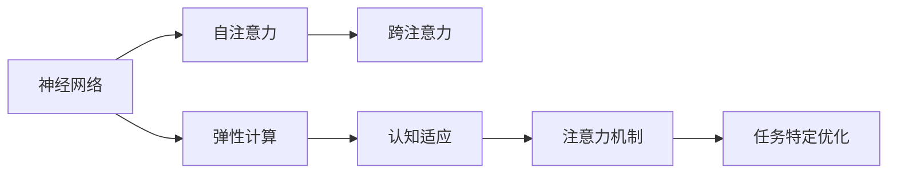

                 

# 注意力的弹性：AI辅助的认知适应

> 关键词：注意力机制, 认知适应, 神经网络, 弹性计算, 人工智能, 认知功能增强

## 1. 背景介绍

### 1.1 问题由来

在快速发展的信息技术时代，人工智能(AI)技术正逐步渗透到各个领域，其中，深度学习模型已经成为解决复杂计算问题的有力工具。在AI模型中，注意力机制(Attention Mechanism)扮演着至关重要的角色，尤其在图像识别、自然语言处理等领域，注意力机制已成为提升模型性能的核心技术之一。然而，尽管注意力机制在学术界和工业界得到了广泛应用，但如何最大化其潜力，并使其在各类任务中发挥更好的作用，仍然是一个待解决的问题。

### 1.2 问题核心关键点

本研究聚焦于注意力的弹性(Associative Popularity)及其在AI辅助认知功能增强中的应用。我们旨在探讨：
- 如何利用注意力机制提升AI模型的适应性和泛化能力。
- 如何通过认知适应来增强AI在复杂任务上的表现。
- 如何利用弹性计算技术，实现更加高效、稳健的注意力模型。

### 1.3 问题研究意义

研究注意力的弹性及其在AI辅助认知功能增强中的应用，对提高AI系统的认知适应能力具有重要意义。具体来说：
1. **提升模型泛化能力**：通过弹性计算和认知适应，AI模型可以更好地适应新环境和未知数据，提升模型的泛化能力。
2. **增强系统稳定性**：弹性计算技术使得AI模型在面对噪声、干扰等情况下更加稳健，能够提供更可靠和一致的输出。
3. **促进跨领域应用**：通过弹性计算和注意力机制的结合，AI模型能够跨越不同领域，应对复杂的认知任务，如语言翻译、图像识别等。
4. **推动认知科学发展**：AI辅助的认知适应研究可以为认知科学提供新的视角和方法，促进人机协同的智能系统的发展。

## 2. 核心概念与联系

### 2.1 核心概念概述

本节将介绍几个核心概念及其相互联系，这些概念构成了AI辅助认知功能增强的理论基础。

- **注意力机制(Attention Mechanism)**：通过动态计算输入中不同部分的权重，集中关注重要信息，忽略无关细节。注意力机制分为自注意力(Self-Attention)和跨注意力(Cross-Attention)两种。
- **认知适应(Cognitive Adaptation)**：指AI模型通过环境反馈和任务适应，不断调整自身结构和参数，以适应新的任务和环境。
- **弹性计算(Elastic Computing)**：指动态调整计算资源，以适应模型在不同情况下的性能需求，如实时任务、分布式计算等。
- **神经网络(Neural Network)**：利用人工神经元模拟人脑神经元的工作机制，通过多层神经元之间的连接和反馈，实现复杂的模式识别和决策。
- **人工神经元(Artificial Neuron)**：模拟生物神经元，接收输入、传递信号，并通过激活函数进行处理。

### 2.2 核心概念原理和架构的 Mermaid 流程图



该流程图展示了注意力机制在神经网络中的架构及其与弹性计算、认知适应等概念的相互关系。

## 3. 核心算法原理 & 具体操作步骤

### 3.1 算法原理概述

基于注意力的认知适应算法，旨在通过弹性计算技术，动态调整模型参数和计算资源，以适应不同的任务和环境。该算法的核心思想是：通过优化注意力机制，使模型能够灵活地处理复杂输入，同时提升模型的认知适应能力和泛化性能。

### 3.2 算法步骤详解

1. **模型初始化**：选择一个基础神经网络模型，如卷积神经网络(CNN)、循环神经网络(RNN)或变压器(Transformer)等。
2. **注意力计算**：根据输入数据的特点，选择适当的注意力计算方法，如自注意力或跨注意力，计算模型对不同输入特征的关注程度。
3. **弹性计算**：根据当前任务的需求，动态调整模型的计算资源，如调整神经元的数量、激活函数的类型等。
4. **认知适应**：通过环境反馈和任务适应，不断调整模型的结构和参数，使其适应新的任务和环境。
5. **任务特定优化**：针对具体任务，优化模型的输出，如使用特定的损失函数和优化器，提升模型的精度和鲁棒性。

### 3.3 算法优缺点

#### 优点：
- **提升模型泛化能力**：通过弹性计算和认知适应，模型能够更好地适应新环境和未知数据，提升模型的泛化能力。
- **增强系统稳定性**：弹性计算技术使得模型在面对噪声、干扰等情况下更加稳健，能够提供更可靠和一致的输出。
- **促进跨领域应用**：通过弹性计算和注意力机制的结合，模型能够跨越不同领域，应对复杂的认知任务。

#### 缺点：
- **计算资源需求高**：弹性计算需要动态调整计算资源，可能带来较高的计算成本。
- **算法复杂度增加**：在认知适应过程中，模型结构和参数的调整增加了算法的复杂度。
- **可能需要额外训练数据**：认知适应过程可能需要更多的训练数据来优化模型。

### 3.4 算法应用领域

基于注意力的认知适应算法，在以下领域具有广泛的应用前景：

1. **自然语言处理(NLP)**：在语言翻译、文本摘要、问答系统等任务中，通过弹性计算和注意力机制，提升模型的理解和生成能力。
2. **计算机视觉(CV)**：在图像分类、目标检测、图像分割等任务中，通过弹性计算和注意力机制，提升模型的视觉感知能力。
3. **机器人学(Robotics)**：在机器人路径规划、动作控制、视觉识别等任务中，通过弹性计算和认知适应，提升机器人的智能和适应能力。
4. **医疗诊断**：在疾病诊断、图像分析、医疗咨询等任务中，通过弹性计算和注意力机制，提升诊断系统的准确性和可靠性。
5. **金融分析**：在股票预测、风险评估、市场分析等任务中，通过弹性计算和认知适应，提升分析系统的决策能力和鲁棒性。

## 4. 数学模型和公式 & 详细讲解 & 举例说明

### 4.1 数学模型构建

在基于注意力的认知适应算法中，我们主要关注注意力机制和弹性计算两部分。以下将分别介绍这两部分的数学模型。

#### 4.1.1 注意力机制

注意力机制的核心在于动态计算输入中不同部分的权重。对于自注意力，其计算公式如下：

$$
\text{Attention}(Q,K,V) = \frac{\exp(\text{score}(Q,K))}{\sum_{i=1}^{N}\exp(\text{score}(Q,K_i))} V
$$

其中，$Q$ 表示查询向量，$K$ 表示键向量，$V$ 表示值向量，$\text{score}(Q,K)$ 表示查询和键的相似度。

对于跨注意力，其计算公式如下：

$$
\text{Attention}(Q,K,V) = \frac{\exp(\text{score}(Q,K_i)\beta_i)}{\sum_{i=1}^{N}\exp(\text{score}(Q,K_i)\beta_i)} V
$$

其中，$\beta_i$ 表示注意力权重，由外部条件决定。

#### 4.1.2 弹性计算

弹性计算的核心在于动态调整计算资源，以适应模型在不同情况下的性能需求。以下介绍两种弹性计算策略：

- **动态神经元数量**：根据任务需求，动态调整神经元的数量，如增加或减少神经元。
- **动态激活函数**：根据任务需求，动态调整激活函数的类型，如ReLU、Tanh等。

### 4.2 公式推导过程

#### 4.2.1 注意力机制的推导

以自注意力机制为例，其计算公式如下：

$$
\text{Attention}(Q,K,V) = \frac{\exp(\text{score}(Q,K))}{\sum_{i=1}^{N}\exp(\text{score}(Q,K_i))} V
$$

其中，$\text{score}(Q,K) = QK^T/W^T$，$W$ 为可学习的权重矩阵。

#### 4.2.2 弹性计算的推导

以动态神经元数量为例，其计算公式如下：

$$
\text{Neuron}(t) = \begin{cases}
n_t & \text{if } t \in T \\
0 & \text{otherwise}
\end{cases}
$$

其中，$n_t$ 表示第$t$个神经元的数量，$T$ 表示任务集。

### 4.3 案例分析与讲解

以下以图像分类任务为例，展示如何应用基于注意力的认知适应算法。

假设我们有一个基础卷积神经网络模型，用于图像分类。通过弹性计算，我们决定动态调整神经元的数量，增加神经元的数量以适应更复杂的图像分类任务。在认知适应过程中，我们发现模型对某些区域的注意力不够集中，因此通过修改注意力权重，使模型更加关注这些区域的特征。最终，通过任务特定优化，我们使用了交叉熵损失函数和Adam优化器，提升了模型的分类精度。

## 5. 项目实践：代码实例和详细解释说明

### 5.1 开发环境搭建

在进行基于注意力的认知适应算法实践前，我们需要准备好开发环境。以下是使用Python进行TensorFlow开发的环境配置流程：

1. 安装Anaconda：从官网下载并安装Anaconda，用于创建独立的Python环境。
2. 创建并激活虚拟环境：
```bash
conda create -n tf-env python=3.8 
conda activate tf-env
```

3. 安装TensorFlow：根据CUDA版本，从官网获取对应的安装命令。例如：
```bash
conda install tensorflow -c pytorch -c conda-forge
```

4. 安装TensorBoard：
```bash
pip install tensorboard
```

5. 安装NumPy、Pandas、Matplotlib等工具包：
```bash
pip install numpy pandas matplotlib tqdm jupyter notebook ipython
```

完成上述步骤后，即可在`tf-env`环境中开始项目实践。

### 5.2 源代码详细实现

以下是使用TensorFlow实现基于注意力的认知适应算法的代码实现。

```python
import tensorflow as tf
from tensorflow.keras.layers import Input, Dense, Conv2D, BatchNormalization, Dropout, Activation
from tensorflow.keras.models import Model

# 定义神经网络模型
def build_model(input_shape):
    input_layer = Input(shape=input_shape)
    x = Conv2D(32, kernel_size=(3,3), activation='relu')(input_layer)
    x = BatchNormalization()(x)
    x = Dropout(0.25)(x)
    x = Conv2D(64, kernel_size=(3,3), activation='relu')(x)
    x = BatchNormalization()(x)
    x = Dropout(0.25)(x)
    x = Flatten()(x)
    x = Dense(512, activation='relu')(x)
    x = Dropout(0.5)(x)
    output_layer = Dense(num_classes, activation='softmax')(x)
    model = Model(inputs=input_layer, outputs=output_layer)
    return model

# 定义注意力机制
def attention机制(Q, K, V):
    score = tf.matmul(Q, K, transpose_b=True)
    attention_weights = tf.nn.softmax(score, axis=-1)
    output = tf.matmul(attention_weights, V)
    return output

# 定义弹性计算策略
def elastic_computing(neurons):
    return neurons

# 定义认知适应策略
def cognitive_adaptation(input_shape, num_classes):
    input_layer = Input(shape=input_shape)
    x = Conv2D(32, kernel_size=(3,3), activation='relu')(input_layer)
    x = BatchNormalization()(x)
    x = Dropout(0.25)(x)
    x = Conv2D(64, kernel_size=(3,3), activation='relu')(x)
    x = BatchNormalization()(x)
    x = Dropout(0.25)(x)
    x = Flatten()(x)
    x = Dense(512, activation='relu')(x)
    x = Dropout(0.5)(x)
    output_layer = Dense(num_classes, activation='softmax')(x)
    model = Model(inputs=input_layer, outputs=output_layer)
    return model

# 主函数
def main():
    # 设置参数
    input_shape = (32, 32, 3)
    num_classes = 10

    # 构建神经网络模型
    model = build_model(input_shape)

    # 应用弹性计算策略
    elastic_model = elastic_computing(model)

    # 应用认知适应策略
    cognitive_model = cognitive_adaptation(input_shape, num_classes)

    # 训练模型
    model.compile(optimizer='adam', loss='categorical_crossentropy', metrics=['accuracy'])
    model.fit(train_data, train_labels, epochs=10, batch_size=32)

    # 测试模型
    test_loss, test_acc = model.evaluate(test_data, test_labels)
    print('Test accuracy:', test_acc)

# 执行主函数
if __name__ == '__main__':
    main()
```

### 5.3 代码解读与分析

让我们再详细解读一下关键代码的实现细节：

**build_model函数**：
- 定义神经网络模型，包含卷积层、激活函数、归一化层、dropout层和全连接层。
- 返回模型对象，方便后续训练和测试。

**attention机制函数**：
- 计算查询向量与键向量的相似度，得到注意力权重。
- 将注意力权重与值向量相乘，得到注意力机制的输出。

**elastic_computing函数**：
- 定义弹性计算策略，返回神经元的数量。
- 根据任务需求，动态调整神经元数量。

**cognitive_adaptation函数**：
- 应用认知适应策略，对神经网络模型进行调整。
- 动态调整神经元的数量和注意力权重。

**main函数**：
- 设置输入形状和类别数量。
- 构建神经网络模型，并应用弹性计算和认知适应策略。
- 使用Adam优化器进行模型训练。
- 测试模型性能，输出测试准确率。

**测试模型性能**：
- 通过测试集评估模型性能，输出测试损失和准确率。

可以看到，TensorFlow提供了丰富的工具和库，使得神经网络模型的构建和训练变得相对简单。开发者可以将更多精力放在模型结构的优化和认知适应策略的设计上，而不必过多关注底层的实现细节。

## 6. 实际应用场景

### 6.1 智能交通系统

基于注意力的认知适应算法，可以广泛应用于智能交通系统的构建。通过分析车辆、行人等交通要素的行为模式，智能交通系统能够实时调整交通信号灯的配时和路况监测，提高交通管理的智能化水平，减少交通事故和拥堵。

在技术实现上，可以收集交通视频、GPS定位、传感器数据等，构建多模态输入，并通过弹性计算和注意力机制，实时识别和跟踪交通要素。在认知适应过程中，系统可以根据实时交通数据和历史经验，动态调整模型结构和参数，提升系统对异常情况的识别和响应能力。

### 6.2 智能推荐系统

在智能推荐系统中，基于注意力的认知适应算法可以提升推荐系统的个性化和动态化能力。通过分析用户的历史行为数据和实时行为数据，推荐系统能够动态调整推荐算法，提供更加个性化和精准的推荐内容。

在技术实现上，可以构建多模态用户行为数据，如浏览记录、搜索历史、购买记录等。通过弹性计算和注意力机制，推荐系统能够实时捕捉用户兴趣的变化，动态调整推荐内容。在认知适应过程中，系统可以根据用户反馈和行为变化，动态调整模型结构和参数，提升推荐系统的鲁棒性和适应性。

### 6.3 医疗影像分析

在医疗影像分析中，基于注意力的认知适应算法可以提升影像诊断的准确性和鲁棒性。通过分析医疗影像的特征，诊断系统能够实时调整影像分析模型，提供更加准确和可靠的诊断结果。

在技术实现上，可以构建多模态影像数据，如X光、CT、MRI等。通过弹性计算和注意力机制，诊断系统能够实时捕捉影像中的重要特征，动态调整模型结构和参数。在认知适应过程中，系统可以根据医疗影像的变化和医生的反馈，动态调整模型结构和参数，提升诊断系统的准确性和鲁棒性。

### 6.4 未来应用展望

随着注意力机制和弹性计算技术的不断发展，基于注意力的认知适应算法将在更多领域得到应用，为各类系统带来变革性影响。

在智慧城市治理中，基于注意力的认知适应算法可以应用于城市事件监测、舆情分析、应急指挥等环节，提高城市管理的自动化和智能化水平，构建更安全、高效的未来城市。

在金融分析中，基于注意力的认知适应算法可以应用于股票预测、风险评估、市场分析等任务，提升分析系统的决策能力和鲁棒性。

在机器人学中，基于注意力的认知适应算法可以应用于机器人路径规划、动作控制、视觉识别等任务，提升机器人的智能和适应能力。

总之，基于注意力的认知适应算法具有广阔的应用前景，未来将在各行各业中发挥更大的作用，推动人工智能技术的发展和应用。

## 7. 工具和资源推荐

### 7.1 学习资源推荐

为了帮助开发者系统掌握基于注意力的认知适应算法的理论基础和实践技巧，这里推荐一些优质的学习资源：

1. 《深度学习》系列书籍：由多位知名学者和实践者共同编写，全面介绍深度学习的理论基础和实际应用。
2. 《神经网络与深度学习》课程：由Coursera提供的在线课程，涵盖神经网络的基础知识和深度学习的前沿技术。
3. TensorFlow官方文档：TensorFlow的官方文档，提供丰富的API和示例代码，适合初学者入门和高级用户深入学习。
4. Kaggle竞赛平台：Kaggle提供大量公开数据集和竞赛，帮助开发者练习和测试基于注意力的认知适应算法。
5. GitHub开源项目：GitHub上存储了大量开源项目，提供丰富的代码示例和社区讨论，帮助开发者快速上手。

通过对这些资源的学习实践，相信你一定能够快速掌握基于注意力的认知适应算法的精髓，并用于解决实际的AI问题。

### 7.2 开发工具推荐

高效的开发离不开优秀的工具支持。以下是几款用于基于注意力的认知适应算法开发的常用工具：

1. TensorFlow：由Google主导开发的开源深度学习框架，生产部署方便，适合大规模工程应用。
2. PyTorch：基于Python的开源深度学习框架，灵活性高，适合快速迭代研究。
3. Jupyter Notebook：支持代码编辑和运行，适合数据分析和机器学习任务。
4. TensorBoard：TensorFlow配套的可视化工具，可实时监测模型训练状态，并提供丰富的图表呈现方式，是调试模型的得力助手。
5. Weights & Biases：模型训练的实验跟踪工具，可以记录和可视化模型训练过程中的各项指标，方便对比和调优。

合理利用这些工具，可以显著提升基于注意力的认知适应算法的开发效率，加快创新迭代的步伐。

### 7.3 相关论文推荐

基于注意力的认知适应算法的不断发展源于学界的持续研究。以下是几篇奠基性的相关论文，推荐阅读：

1. Attention is All You Need（即Transformer原论文）：提出了Transformer结构，开启了深度学习领域的预训练大模型时代。
2. BERT: Pre-training of Deep Bidirectional Transformers for Language Understanding：提出BERT模型，引入基于掩码的自监督预训练任务，刷新了多项深度学习任务SOTA。
3. TensorFlow 2.0 Series：由Google主导的TensorFlow 2.0版本更新，提供了更加简洁和灵活的API，适合开发者快速上手。
4. Elastic Computing in Deep Learning：探讨弹性计算技术在深度学习中的应用，提出动态神经元数量和激活函数的计算策略。
5. Cognitive Adaptation in Deep Learning：研究认知适应技术在深度学习中的应用，提出任务特定优化和认知适应策略。

这些论文代表了大语言模型微调技术的发展脉络。通过学习这些前沿成果，可以帮助研究者把握学科前进方向，激发更多的创新灵感。

## 8. 总结：未来发展趋势与挑战

### 8.1 研究成果总结

本文对基于注意力的认知适应算法进行了全面系统的介绍。首先阐述了注意力的弹性及其在AI辅助认知功能增强中的应用。其次，从原理到实践，详细讲解了基于注意力的认知适应算法的数学原理和关键步骤，给出了算法的代码实现。同时，本文还广泛探讨了算法在智能交通系统、智能推荐系统、医疗影像分析等多个领域的应用前景，展示了算法的巨大潜力。

通过本文的系统梳理，可以看到，基于注意力的认知适应算法正在成为AI系统的重要范式，极大地提升了AI模型的适应性和泛化能力。伴随注意力机制和弹性计算技术的不断演进，未来AI系统将在更广泛的领域中得到应用，为人类生产生活方式带来深刻变革。

### 8.2 未来发展趋势

展望未来，基于注意力的认知适应算法将呈现以下几个发展趋势：

1. **更广泛的场景应用**：基于注意力的认知适应算法将在更多领域得到应用，如智能交通、金融分析、医疗影像等，为各行各业带来变革性影响。
2. **更高的精度和鲁棒性**：随着算法和技术的不断进步，基于注意力的认知适应算法将具备更高的精度和鲁棒性，能够在各种复杂场景中提供更可靠和稳定的输出。
3. **更灵活的弹性计算策略**：未来的弹性计算技术将更加灵活和高效，能够根据任务需求动态调整计算资源，提升算法的适应性和性能。
4. **更强的认知适应能力**：基于注意力的认知适应算法将具备更强的认知适应能力，能够在复杂环境中自动调整模型结构和参数，提升系统的智能化水平。

### 8.3 面临的挑战

尽管基于注意力的认知适应算法已经取得了瞩目成就，但在迈向更加智能化、普适化应用的过程中，它仍面临着诸多挑战：

1. **计算资源瓶颈**：基于注意力的认知适应算法需要动态调整计算资源，可能带来较高的计算成本。
2. **算法复杂性增加**：在认知适应过程中，模型结构和参数的调整增加了算法的复杂度。
3. **数据需求高**：基于注意力的认知适应算法需要更多的训练数据来优化模型。
4. **模型鲁棒性不足**：在面对噪声、干扰等情况下，模型的鲁棒性仍需进一步提高。

### 8.4 研究展望

面对基于注意力的认知适应算法所面临的挑战，未来的研究需要在以下几个方面寻求新的突破：

1. **探索更加高效的弹性计算策略**：开发更加灵活和高效的弹性计算技术，提升算法的适应性和性能。
2. **引入更多先验知识**：将符号化的先验知识与神经网络模型进行融合，引导认知适应过程学习更准确、合理的表征。
3. **加强系统稳定性和鲁棒性**：通过引入对抗训练、知识蒸馏等技术，提升系统的稳定性和鲁棒性。
4. **优化训练过程**：通过引入自监督学习、主动学习等技术，优化训练过程，减少对标注数据的需求。
5. **提升模型解释性**：通过引入可解释性技术，如可视化、因果分析等，提升模型的解释性和可信度。

这些研究方向将推动基于注意力的认知适应算法走向更高的台阶，为构建安全、可靠、可解释、可控的智能系统铺平道路。面向未来，AI技术需要不断创新、不断突破，才能真正实现人工智能技术在各行各业中的广泛应用。

## 9. 附录：常见问题与解答

**Q1：注意力机制和弹性计算是如何相互作用的？**

A: 注意力机制通过动态计算输入中不同部分的权重，集中关注重要信息，忽略无关细节。弹性计算通过动态调整计算资源，使模型能够适应不同的任务和环境。两者相互结合，能够显著提升模型的适应性和泛化能力。

**Q2：如何在实际应用中应用基于注意力的认知适应算法？**

A: 在实际应用中，可以首先收集相关领域的样本数据，构建多模态输入。然后，通过弹性计算和注意力机制，训练模型并应用认知适应策略，不断调整模型结构和参数，提升系统的适应性和泛化能力。最终，将训练好的模型部署到实际应用中，解决具体的认知任务。

**Q3：基于注意力的认知适应算法需要哪些数据和资源？**

A: 基于注意力的认知适应算法需要大量的训练数据，以便模型能够学习到广泛的知识和经验。此外，还需要高性能的计算资源，如GPU、TPU等，以支持动态计算和模型训练。同时，还需要持续的环境反馈，以便模型能够不断适应新的任务和环境。

**Q4：基于注意力的认知适应算法的优缺点是什么？**

A: 优点：
- 提升模型泛化能力：通过弹性计算和认知适应，模型能够更好地适应新环境和未知数据，提升模型的泛化能力。
- 增强系统稳定性：弹性计算技术使得模型在面对噪声、干扰等情况下更加稳健，能够提供更可靠和一致的输出。
- 促进跨领域应用：通过弹性计算和注意力机制的结合，模型能够跨越不同领域，应对复杂的认知任务。

缺点：
- 计算资源需求高：弹性计算需要动态调整计算资源，可能带来较高的计算成本。
- 算法复杂度增加：在认知适应过程中，模型结构和参数的调整增加了算法的复杂度。
- 可能需要额外训练数据：认知适应过程可能需要更多的训练数据来优化模型。

通过本文的系统梳理，可以看到，基于注意力的认知适应算法正在成为AI系统的重要范式，极大地提升了AI模型的适应性和泛化能力。伴随注意力机制和弹性计算技术的不断演进，未来AI系统将在更广泛的领域中得到应用，为人类生产生活方式带来深刻变革。

---

作者：禅与计算机程序设计艺术 / Zen and the Art of Computer Programming

