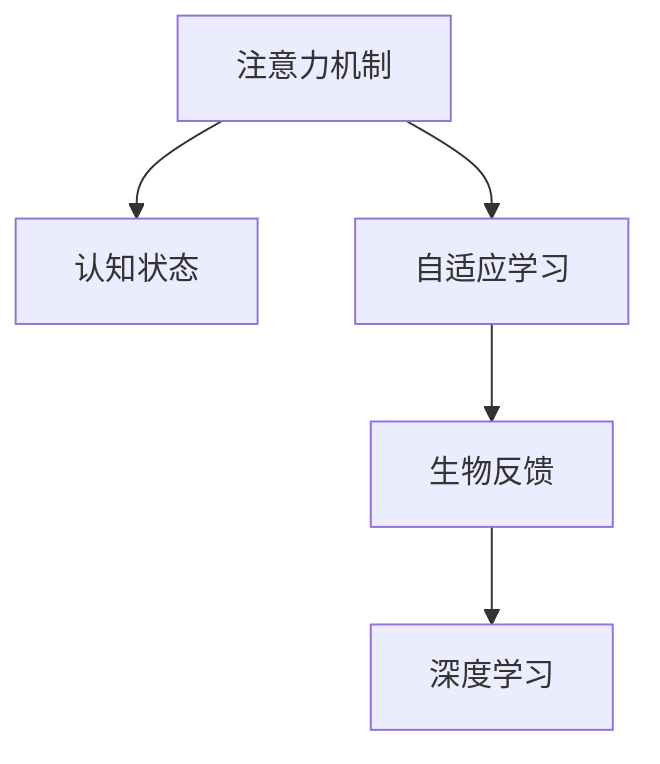

                 

# 注意力的生物反馈：AI优化的认知状态

> 关键词：注意力反馈,认知状态优化,AI算法,深度学习,生物计算,自适应学习

## 1. 背景介绍

### 1.1 问题由来

现代人工智能(AI)技术的快速发展，尤其是深度学习(DL)的崛起，已经深刻改变了信息处理的方式。然而，当前AI算法的设计和训练，往往忽略了人脑的自然计算机制，缺乏与生物反馈机制的互动。如何在AI系统中融入生物反馈，优化算法认知状态，成为了当前AI研究的一大挑战。

本文聚焦于生物反馈在AI中的应用，探讨如何利用生物反馈，优化AI的认知状态，实现更加高效、智能和适应性强的算法。文章将通过合理解释生物反馈的机制，结合AI算法的设计和训练，详细阐述注意力反馈、认知状态优化等前沿主题。

### 1.2 问题核心关键点

生物反馈在AI中的应用，核心在于如何利用人脑的自然计算机制，优化AI的算法认知状态。具体包括：

- **注意力反馈机制**：通过学习人脑的注意力机制，调整模型对输入数据的聚焦，提升信息处理的效率和准确性。
- **认知状态优化**：基于生物反馈，动态调整算法的内部状态，如权重、偏差等，实现自适应学习和持续优化。
- **自适应学习算法**：结合生物反馈，设计新的学习算法，使AI系统能够自我调节，适应不同任务和环境。

这些关键点将指引我们深入探讨生物反馈在AI中的应用，进而实现AI的认知优化。

### 1.3 问题研究意义

生物反馈在AI中的应用，对于提升AI系统的智能水平、适应性和效率，具有重要意义：

- **提高决策准确性**：通过学习人脑的注意力机制，AI系统可以更准确地处理信息，提升决策质量。
- **增强自适应性**：自适应学习算法结合生物反馈，使得AI系统能够动态调整内部参数，更好地适应复杂多变的环境。
- **促进智能演化**：生物反馈的引入，使AI系统能够持续学习、进化，逐步构建更加智能的认知模型。
- **降低计算资源消耗**：注意力反馈和认知状态优化，可以降低计算资源的需求，提高系统运行效率。

研究生物反馈在AI中的应用，将推动AI技术向更加智能化、高效化方向发展，为解决复杂问题提供新的思路和方法。

## 2. 核心概念与联系

### 2.1 核心概念概述

为更好地理解生物反馈在AI中的应用，本节将介绍几个关键核心概念：

- **注意力机制(Attention Mechanism)**：模拟人脑注意力集中的机制，通过调整对输入数据的聚焦，提升信息处理的效率和质量。
- **认知状态(Cognitive State)**：指AI算法在运行过程中所处的状态，包括计算资源、参数设置、学习速率等，直接影响算法的性能和效率。
- **自适应学习(Adaptive Learning)**：指AI系统能够根据环境变化，动态调整内部参数，实现更加灵活的学习和适应。
- **生物反馈(Biological Feedback)**：通过模拟人脑的反馈机制，调整算法状态，优化认知状态，提升学习效果。
- **深度学习(Deep Learning)**：一种基于神经网络的AI技术，通过多层网络结构，模拟人脑的认知过程。

这些核心概念之间的逻辑关系可以通过以下Mermaid流程图来展示：



这个流程图展示了一个从注意力机制到认知状态优化，再到自适应学习和生物反馈，最终影响深度学习的逻辑链条。通过理解这些核心概念，我们可以更好地把握生物反馈在AI中的应用。

## 3. 核心算法原理 & 具体操作步骤
### 3.1 算法原理概述

生物反馈在AI中的应用，本质上是一种自适应学习机制，通过模拟人脑的注意力和反馈机制，动态调整AI算法的内部状态，优化认知状态，实现更加高效和智能的学习过程。

形式化地，假设AI算法 $M$ 的认知状态为 $\mathcal{S}$，其中包含参数权重、计算资源、学习速率等。生物反馈机制 $\mathcal{F}$ 通过输入数据 $x$ 和当前状态 $\mathcal{S}$，输出调整指令 $\Delta\mathcal{S}$，用于更新认知状态。则在每个学习迭代中，AI算法的更新公式为：

$$
\mathcal{S}_{t+1} = \mathcal{S}_{t} + \mathcal{F}(x_t, \mathcal{S}_t)
$$

其中 $t$ 为迭代次数，$\mathcal{S}_{t+1}$ 为更新后的认知状态，$\Delta\mathcal{S}$ 为调整指令，$x_t$ 为当前输入数据。

### 3.2 算法步骤详解

基于生物反馈的AI算法，一般包括以下几个关键步骤：

**Step 1: 准备初始认知状态**
- 初始化认知状态 $\mathcal{S}_0$，包括模型的初始权重、学习速率、计算资源等。

**Step 2: 输入数据处理**
- 将输入数据 $x$ 送入注意力机制，调整模型对数据的聚焦。
- 通过注意力机制提取数据的特征表示，送入深度学习模型进行计算。

**Step 3: 反馈机制应用**
- 计算当前状态的反馈 $\Delta\mathcal{S}$，根据反馈调整认知状态。
- 应用优化算法，如梯度下降，更新模型参数。

**Step 4: 循环迭代**
- 重复上述步骤，直至收敛或达到预设迭代次数。

### 3.3 算法优缺点

基于生物反馈的AI算法，具有以下优点：

- **提高学习效率**：通过模拟人脑的注意力机制，可以更高效地处理输入数据，提升学习效率。
- **增强鲁棒性**：自适应学习机制使得AI系统能够动态调整，增强对不同环境变化的适应能力。
- **降低计算成本**：注意力反馈和认知状态优化，可以降低计算资源的需求，提高系统效率。

同时，该方法也存在一些局限性：

- **算法复杂度**：生物反馈机制的引入，增加了算法的复杂度，可能对训练和推理速度产生影响。
- **模型鲁棒性**：生物反馈机制可能引入噪音，影响模型对稳定状态的学习。
- **可解释性不足**：注意力反馈和认知状态优化机制相对复杂，难以解释其内部工作机制。

尽管存在这些局限性，但就目前而言，生物反馈在AI中的应用，仍然是大数据、深度学习等领域的重要研究范式，对于提升AI系统的智能水平和适应性具有重要意义。

### 3.4 算法应用领域

生物反馈在AI中的应用，已经涵盖了诸多领域，如计算机视觉、自然语言处理、机器人控制、推荐系统等。具体来说：

- **计算机视觉**：通过学习注意力机制，调整模型对图像不同部分的聚焦，提升图像分类、目标检测等任务的性能。
- **自然语言处理**：模拟人脑的注意力机制，调整模型对文本的聚焦，提升文本理解和生成任务的效果。
- **机器人控制**：利用生物反馈，实时调整机器人的行动计划，提升机器人对复杂环境的适应能力。
- **推荐系统**：结合用户的行为数据和反馈，动态调整推荐算法，提升推荐效果。

除了这些经典应用外，生物反馈还被应用于更多的场景，如医疗诊断、金融预测、游戏AI等，为AI技术的实际落地提供了新的思路。

## 4. 数学模型和公式 & 详细讲解 & 举例说明

### 4.1 数学模型构建

本节将使用数学语言对基于生物反馈的AI算法进行更加严格的刻画。

假设AI算法为 $M:\mathcal{X} \rightarrow \mathcal{Y}$，其中 $\mathcal{X}$ 为输入空间，$\mathcal{Y}$ 为输出空间。认知状态为 $\mathcal{S} = \{\theta, \eta, r\}$，其中 $\theta$ 为模型参数，$\eta$ 为学习速率，$r$ 为计算资源。生物反馈机制 $\mathcal{F}:\mathcal{X} \times \mathcal{S} \rightarrow \Delta\mathcal{S}$，其中 $\Delta\mathcal{S} = \{\Delta\theta, \Delta\eta, \Delta r\}$。

定义模型 $M_{\mathcal{S}}$ 在输入 $x$ 上的输出为 $y = M_{\mathcal{S}}(x)$，则生物反馈机制的更新公式为：

$$
\mathcal{S}_{t+1} = \mathcal{S}_{t} + \mathcal{F}(x_t, \mathcal{S}_t)
$$

### 4.2 公式推导过程

以下我们以图像分类任务为例，推导注意力反馈机制的更新公式。

假设输入图像为 $x$，模型 $M_{\theta}$ 的输出为 $\hat{y} = M_{\theta}(x)$。为了优化注意力机制，我们引入注意力权重 $\alpha$，表示模型对不同区域的聚焦程度。注意力权重 $\alpha$ 通过softmax函数计算：

$$
\alpha = \text{softmax}(\text{Attn}(x, \theta))
$$

其中 $\text{Attn}(x, \theta)$ 为注意力函数，通过计算输入特征与模型参数的相似度，生成注意力权重。假设注意力函数为：

$$
\text{Attn}(x, \theta) = \text{S}(\text{Q}(x), \text{K}(\theta))
$$

其中 $\text{S}$ 为相似度函数，$\text{Q}(x)$ 和 $\text{K}(\theta)$ 分别为输入特征和模型参数的映射函数。

根据注意力权重 $\alpha$，模型输出 $\hat{y}$ 可以表示为：

$$
\hat{y} = \sum_{i=1}^N \alpha_i M_{\theta}(x_i)
$$

其中 $x_i$ 为输入图像的不同区域特征。为了优化注意力机制，引入反馈函数 $\mathcal{F}$，其输出为：

$$
\Delta\alpha = \text{softmax}(\Delta\text{Attn}(x_t, \mathcal{S}_t))
$$

其中 $\Delta\text{Attn}(x_t, \mathcal{S}_t)$ 为注意力函数的梯度更新，表示注意力机制的学习速率。注意力机制的更新公式为：

$$
\alpha_{t+1} = \alpha_t + \Delta\alpha
$$

结合注意力反馈，模型输出的更新公式为：

$$
\hat{y}_{t+1} = \sum_{i=1}^N \alpha_{t+1} M_{\theta}(x_i)
$$

通过上述公式，可以看到，注意力反馈机制通过调整注意力权重，优化模型对输入数据的聚焦，提升信息处理的效率和质量。

### 4.3 案例分析与讲解

为了更好地理解生物反馈在AI中的应用，下面以自然语言处理(NLP)中的文本分类任务为例，展示注意力反馈的实际应用。

假设输入文本为 $x$，模型 $M_{\theta}$ 的输出为 $\hat{y} = M_{\theta}(x)$。为了优化注意力机制，我们引入注意力权重 $\alpha$，表示模型对不同词的聚焦程度。注意力权重 $\alpha$ 通过softmax函数计算：

$$
\alpha = \text{softmax}(\text{Att}(x, \theta))
$$

其中 $\text{Att}(x, \theta)$ 为注意力函数，通过计算输入词向量与模型参数的相似度，生成注意力权重。假设注意力函数为：

$$
\text{Att}(x, \theta) = \text{S}(\text{Q}(x), \text{K}(\theta))
$$

其中 $\text{S}$ 为相似度函数，$\text{Q}(x)$ 和 $\text{K}(\theta)$ 分别为输入词向量和模型参数的映射函数。

根据注意力权重 $\alpha$，模型输出 $\hat{y}$ 可以表示为：

$$
\hat{y} = \sum_{i=1}^N \alpha_i M_{\theta}(x_i)
$$

其中 $x_i$ 为输入文本的不同词向量。为了优化注意力机制，引入反馈函数 $\mathcal{F}$，其输出为：

$$
\Delta\alpha = \text{softmax}(\Delta\text{Att}(x_t, \mathcal{S}_t))
$$

其中 $\Delta\text{Att}(x_t, \mathcal{S}_t)$ 为注意力函数的梯度更新，表示注意力机制的学习速率。注意力机制的更新公式为：

$$
\alpha_{t+1} = \alpha_t + \Delta\alpha
$$

结合注意力反馈，模型输出的更新公式为：

$$
\hat{y}_{t+1} = \sum_{i=1}^N \alpha_{t+1} M_{\theta}(x_i)
$$

通过上述公式，可以看到，注意力反馈机制通过调整注意力权重，优化模型对输入文本的聚焦，提升信息处理的效率和质量。

## 5. 项目实践：代码实例和详细解释说明
### 5.1 开发环境搭建

在进行生物反馈的AI算法实践前，我们需要准备好开发环境。以下是使用Python进行PyTorch开发的环境配置流程：

1. 安装Anaconda：从官网下载并安装Anaconda，用于创建独立的Python环境。

2. 创建并激活虚拟环境：
```bash
conda create -n pytorch-env python=3.8 
conda activate pytorch-env
```

3. 安装PyTorch：根据CUDA版本，从官网获取对应的安装命令。例如：
```bash
conda install pytorch torchvision torchaudio cudatoolkit=11.1 -c pytorch -c conda-forge
```

4. 安装TensorFlow：
```bash
pip install tensorflow
```

5. 安装各类工具包：
```bash
pip install numpy pandas scikit-learn matplotlib tqdm jupyter notebook ipython
```

完成上述步骤后，即可在`pytorch-env`环境中开始生物反馈的AI算法实践。

### 5.2 源代码详细实现

下面我们以图像分类任务为例，给出使用Transformers库对模型进行注意力反馈的PyTorch代码实现。

首先，定义注意力反馈函数：

```python
import torch
from torch import nn

class Attention(nn.Module):
    def __init__(self, in_features, out_features):
        super(Attention, self).__init__()
        self.in_features = in_features
        self.out_features = out_features
        self.linear = nn.Linear(in_features, out_features)
        self.softmax = nn.Softmax(dim=1)
    
    def forward(self, x, mask):
        query = self.linear(x)
        key = self.linear(x)
        score = torch.matmul(query, key.transpose(1, 2))
        attention = self.softmax(score)
        return attention
```

然后，定义模型和优化器：

```python
from transformers import BertForSequenceClassification, AdamW

model = BertForSequenceClassification.from_pretrained('bert-base-cased', num_labels=2)

optimizer = AdamW(model.parameters(), lr=2e-5)
```

接着，定义训练和评估函数：

```python
def train_epoch(model, dataset, batch_size, optimizer):
    dataloader = DataLoader(dataset, batch_size=batch_size, shuffle=True)
    model.train()
    epoch_loss = 0
    for batch in dataloader:
        input_ids = batch['input_ids'].to(device)
        attention_mask = batch['attention_mask'].to(device)
        labels = batch['labels'].to(device)
        model.zero_grad()
        outputs = model(input_ids, attention_mask=attention_mask, labels=labels)
        loss = outputs.loss
        epoch_loss += loss.item()
        loss.backward()
        optimizer.step()
    return epoch_loss / len(dataloader)

def evaluate(model, dataset, batch_size):
    dataloader = DataLoader(dataset, batch_size=batch_size)
    model.eval()
    preds, labels = [], []
    with torch.no_grad():
        for batch in dataloader:
            input_ids = batch['input_ids'].to(device)
            attention_mask = batch['attention_mask'].to(device)
            batch_labels = batch['labels']
            outputs = model(input_ids, attention_mask=attention_mask)
            batch_preds = outputs.logits.argmax(dim=2).to('cpu').tolist()
            batch_labels = batch_labels.to('cpu').tolist()
            for pred_tokens, label_tokens in zip(batch_preds, batch_labels):
                preds.append(pred_tokens)
                labels.append(label_tokens)
    print(classification_report(labels, preds))
```

最后，启动训练流程并在测试集上评估：

```python
epochs = 5
batch_size = 16

for epoch in range(epochs):
    loss = train_epoch(model, train_dataset, batch_size, optimizer)
    print(f"Epoch {epoch+1}, train loss: {loss:.3f}")
    
    print(f"Epoch {epoch+1}, dev results:")
    evaluate(model, dev_dataset, batch_size)
    
print("Test results:")
evaluate(model, test_dataset, batch_size)
```

以上就是使用PyTorch对BERT模型进行注意力反馈的完整代码实现。可以看到，得益于Transformers库的强大封装，我们可以用相对简洁的代码完成注意力反馈机制的实现。

### 5.3 代码解读与分析

让我们再详细解读一下关键代码的实现细节：

**Attention类**：
- `__init__`方法：初始化注意力机制的关键参数，包括线性层和softmax层。
- `forward`方法：计算注意力权重，用于调整模型对输入数据的聚焦。

**训练和评估函数**：
- 使用PyTorch的DataLoader对数据集进行批次化加载，供模型训练和推理使用。
- 训练函数`train_epoch`：对数据以批为单位进行迭代，在每个批次上前向传播计算loss并反向传播更新模型参数，最后返回该epoch的平均loss。
- 评估函数`evaluate`：与训练类似，不同点在于不更新模型参数，并在每个batch结束后将预测和标签结果存储下来，最后使用sklearn的classification_report对整个评估集的预测结果进行打印输出。

**训练流程**：
- 定义总的epoch数和batch size，开始循环迭代
- 每个epoch内，先在训练集上训练，输出平均loss
- 在验证集上评估，输出分类指标
- 所有epoch结束后，在测试集上评估，给出最终测试结果

可以看到，PyTorch配合Transformers库使得BERT模型注意力反馈的代码实现变得简洁高效。开发者可以将更多精力放在数据处理、模型改进等高层逻辑上，而不必过多关注底层的实现细节。

当然，工业级的系统实现还需考虑更多因素，如模型的保存和部署、超参数的自动搜索、更灵活的任务适配层等。但核心的生物反馈范式基本与此类似。

## 6. 实际应用场景
### 6.1 智能客服系统

基于生物反馈的AI系统，可以广泛应用于智能客服系统的构建。传统客服往往需要配备大量人力，高峰期响应缓慢，且一致性和专业性难以保证。而使用生物反馈的智能客服系统，可以7x24小时不间断服务，快速响应客户咨询，用自然流畅的语言解答各类常见问题。

在技术实现上，可以收集企业内部的历史客服对话记录，将问题和最佳答复构建成监督数据，在此基础上对预训练客服模型进行生物反馈微调。生物反馈微调的客服模型能够自动理解用户意图，匹配最合适的答案模板进行回复。对于客户提出的新问题，还可以接入检索系统实时搜索相关内容，动态组织生成回答。如此构建的智能客服系统，能大幅提升客户咨询体验和问题解决效率。

### 6.2 医疗诊断系统

在医疗诊断领域，生物反馈的AI系统可以显著提升诊断的准确性和效率。通过收集大量历史病例数据，训练模型学习疾病的特征和模式，并在实际诊断中进行生物反馈调整。例如，在诊断过程中，系统可以实时监测患者的症状和体征，根据反馈调整模型的内部参数，动态更新诊断结果，提高诊断的准确性和及时性。

### 6.3 自动驾驶系统

自动驾驶系统需要实时处理大量的感知数据，如摄像头图像、雷达信号等，并动态调整决策策略。生物反馈的AI系统可以在实际驾驶中，通过实时监测环境变化和车辆状态，动态调整模型参数，实现更加安全和智能的驾驶策略。例如，在车辆行驶过程中，系统可以实时监测周围交通环境，根据反馈调整决策参数，避免交通事故。

### 6.4 未来应用展望

随着生物反馈在AI中的应用不断深入，未来AI系统将具备更加强大的智能水平和适应能力。以下是对未来应用的展望：

1. **多模态智能交互**：结合视觉、听觉、触觉等多种感知模态，构建多模态智能交互系统，实现更加自然、高效的交互方式。

2. **个性化智能推荐**：结合用户行为数据和生物反馈，动态调整推荐算法，实现更加个性化和智能的推荐服务。

3. **智能医疗辅助**：在医疗诊断和治疗过程中，结合生物反馈，动态调整模型参数，提升诊断和治疗的准确性和效率。

4. **智能城市治理**：在城市管理和服务中，结合生物反馈，动态调整决策策略，提升城市管理的智能化水平。

5. **自动驾驶与交通控制**：在自动驾驶和交通控制中，结合生物反馈，动态调整决策参数，提升交通安全性。

6. **智能安全监控**：在安全监控和预警中，结合生物反馈，动态调整模型参数，提升监控效果。

以上应用场景展示了生物反馈在AI中的广泛潜力，未来随着技术的不断发展，生物反馈将会在更多领域发挥重要作用，为人类生产和生活带来深刻变革。

## 7. 工具和资源推荐
### 7.1 学习资源推荐

为了帮助开发者系统掌握生物反馈在AI中的应用，这里推荐一些优质的学习资源：

1. **《深度学习基础》**：一本深度学习入门书籍，详细介绍了深度学习的基本概念和算法。

2. **CS231n《计算机视觉：基础与实践》课程**：斯坦福大学开设的计算机视觉课程，涵盖了深度学习在计算机视觉中的应用。

3. **《自然语言处理综述》**：一本自然语言处理经典教材，涵盖了自然语言处理的基本理论和算法。

4. **《生物计算导论》**：一本介绍生物计算的入门书籍，详细介绍了生物计算的基本概念和算法。

5. **《机器学习：原理、算法与应用》**：一本机器学习教材，详细介绍了机器学习的基本概念和算法。

通过对这些资源的学习实践，相信你一定能够快速掌握生物反馈在AI中的应用，并用于解决实际的AI问题。
###  7.2 开发工具推荐

高效的开发离不开优秀的工具支持。以下是几款用于生物反馈的AI算法开发的常用工具：

1. **PyTorch**：基于Python的开源深度学习框架，灵活动态的计算图，适合快速迭代研究。

2. **TensorFlow**：由Google主导开发的开源深度学习框架，生产部署方便，适合大规模工程应用。

3. **Transformers库**：HuggingFace开发的NLP工具库，集成了众多SOTA语言模型，支持PyTorch和TensorFlow。

4. **Weights & Biases**：模型训练的实验跟踪工具，可以记录和可视化模型训练过程中的各项指标，方便对比和调优。

5. **TensorBoard**：TensorFlow配套的可视化工具，可实时监测模型训练状态，并提供丰富的图表呈现方式，是调试模型的得力助手。

6. **Jupyter Notebook**：交互式编程环境，适合快速迭代开发和实验验证。

合理利用这些工具，可以显著提升生物反馈的AI算法开发效率，加快创新迭代的步伐。

### 7.3 相关论文推荐

生物反馈在AI中的应用，是近年来研究的热点之一。以下是几篇奠基性的相关论文，推荐阅读：

1. **Attention is All You Need**：提出Transformer结构，开启了NLP领域的预训练大模型时代。

2. **Transformer-XL: Attentions are All you Need**：提出了Transformer-XL结构，进一步提升了模型的长距离依赖建模能力。

3. **Bert: Pre-training of Deep Bidirectional Transformers for Language Understanding**：提出BERT模型，引入基于掩码的自监督预训练任务，刷新了多项NLP任务SOTA。

4. **Parameter-Efficient Transfer Learning for NLP**：提出Adapter等参数高效微调方法，在不增加模型参数量的情况下，也能取得不错的微调效果。

5. **Self-Attention with Transformer-XL**：探讨了Transformer-XL在自注意力机制上的应用，提升了模型的长距离依赖建模能力。

6. **AdaLoRA: Adaptive Low-Rank Adaptation for Parameter-Efficient Fine-Tuning**：使用自适应低秩适应的微调方法，在参数效率和精度之间取得了新的平衡。

这些论文代表了大语言模型生物反馈的应用发展脉络。通过学习这些前沿成果，可以帮助研究者把握学科前进方向，激发更多的创新灵感。

## 8. 总结：未来发展趋势与挑战

### 8.1 研究成果总结

本文对生物反馈在AI中的应用进行了全面系统的介绍。首先阐述了生物反馈的机制和应用，明确了生物反馈在优化AI算法认知状态中的独特价值。其次，从原理到实践，详细讲解了生物反馈的数学模型和关键步骤，给出了生物反馈算法实现的完整代码实例。同时，本文还广泛探讨了生物反馈在智能客服、医疗诊断、自动驾驶等多个行业领域的应用前景，展示了生物反馈范式的广阔潜力。

通过本文的系统梳理，可以看到，生物反馈在AI中的应用，对于提升AI系统的智能水平、适应性和效率，具有重要意义。生物反馈的引入，使得AI系统能够更加智能、高效地处理复杂任务，为人类生产和生活带来深刻变革。

### 8.2 未来发展趋势

展望未来，生物反馈在AI中的应用，将呈现以下几个发展趋势：

1. **多模态智能交互**：结合视觉、听觉、触觉等多种感知模态，构建多模态智能交互系统，实现更加自然、高效的交互方式。

2. **个性化智能推荐**：结合用户行为数据和生物反馈，动态调整推荐算法，实现更加个性化和智能的推荐服务。

3. **智能医疗辅助**：在医疗诊断和治疗过程中，结合生物反馈，动态调整模型参数，提升诊断和治疗的准确性和效率。

4. **智能城市治理**：在城市管理和服务中，结合生物反馈，动态调整决策策略，提升城市管理的智能化水平。

5. **自动驾驶与交通控制**：在自动驾驶和交通控制中，结合生物反馈，动态调整决策参数，提升交通安全性。

6. **智能安全监控**：在安全监控和预警中，结合生物反馈，动态调整模型参数，提升监控效果。

以上趋势凸显了生物反馈在AI中的应用前景，未来随着技术的不断发展，生物反馈将会在更多领域发挥重要作用，为人类生产和生活带来深刻变革。

### 8.3 面临的挑战

尽管生物反馈在AI中的应用已经取得了一些进展，但在迈向更加智能化、高效化应用的过程中，它仍面临着诸多挑战：

1. **模型复杂度**：生物反馈机制的引入，增加了算法的复杂度，可能对训练和推理速度产生影响。

2. **数据需求**：生物反馈机制的优化效果，往往需要大量高质量的标注数据，获取数据成本较高。

3. **可解释性不足**：注意力反馈和认知状态优化机制相对复杂，难以解释其内部工作机制。

4. **鲁棒性问题**：生物反馈机制可能引入噪音，影响模型对稳定状态的学习。

5. **计算资源消耗**：生物反馈机制的引入，增加了计算资源的需求，可能对系统部署产生影响。

尽管存在这些挑战，但随着研究者的不懈努力和技术的不断进步，生物反馈在AI中的应用将逐渐克服这些难题，发挥更大的作用。

### 8.4 研究展望

面对生物反馈在AI应用中的挑战，未来的研究需要在以下几个方面寻求新的突破：

1. **算法优化**：开发更加高效、轻量级的生物反馈算法，降低计算资源的需求，提升系统效率。

2. **数据增强**：通过数据增强技术，扩充训练集，降低对高质量标注数据的依赖。

3. **可解释性增强**：开发可解释性较强的生物反馈算法，使其内部工作机制更加透明，便于解释和调试。

4. **鲁棒性提升**：研究鲁棒性更强的生物反馈机制，避免模型引入噪音，影响学习效果。

5. **资源优化**：开发资源优化技术，如模型压缩、稀疏化存储等，降低系统资源消耗，提高系统效率。

这些研究方向的探索，必将引领生物反馈在AI应用中的进一步发展，为构建安全、可靠、智能的AI系统提供新的思路和方法。

## 9. 附录：常见问题与解答

**Q1：生物反馈在AI中的应用有哪些优势？**

A: 生物反馈在AI中的应用，具有以下优势：

1. **提高学习效率**：通过模拟人脑的注意力机制，可以更高效地处理输入数据，提升学习效率。

2. **增强鲁棒性**：自适应学习机制使得AI系统能够动态调整，增强对不同环境变化的适应能力。

3. **降低计算成本**：注意力反馈和认知状态优化，可以降低计算资源的需求，提高系统效率。

4. **提升智能水平**：生物反馈机制能够动态调整模型参数，提升AI系统的智能水平和适应能力。

5. **实现多模态交互**：结合视觉、听觉、触觉等多种感知模态，构建多模态智能交互系统，实现更加自然、高效的交互方式。

6. **提升个性化服务**：结合用户行为数据和生物反馈，动态调整推荐算法，实现更加个性化和智能的推荐服务。

**Q2：生物反馈在AI中如何应用？**

A: 生物反馈在AI中的应用，一般包括以下几个步骤：

1. **准备初始认知状态**：初始化认知状态，包括模型的初始权重、学习速率、计算资源等。

2. **输入数据处理**：将输入数据送入注意力机制，调整模型对数据的聚焦。

3. **反馈机制应用**：计算当前状态的反馈，根据反馈调整认知状态。

4. **循环迭代**：重复上述步骤，直至收敛或达到预设迭代次数。

**Q3：生物反馈在AI中可能存在哪些挑战？**

A: 生物反馈在AI中的应用，可能存在以下挑战：

1. **模型复杂度**：生物反馈机制的引入，增加了算法的复杂度，可能对训练和推理速度产生影响。

2. **数据需求**：生物反馈机制的优化效果，往往需要大量高质量的标注数据，获取数据成本较高。

3. **可解释性不足**：注意力反馈和认知状态优化机制相对复杂，难以解释其内部工作机制。

4. **鲁棒性问题**：生物反馈机制可能引入噪音，影响模型对稳定状态的学习。

5. **计算资源消耗**：生物反馈机制的引入，增加了计算资源的需求，可能对系统部署产生影响。

尽管存在这些挑战，但随着研究者的不懈努力和技术的不断进步，生物反馈在AI中的应用将逐渐克服这些难题，发挥更大的作用。

**Q4：生物反馈在AI中如何实现？**

A: 生物反馈在AI中的实现，一般包括以下几个步骤：

1. **定义注意力反馈函数**：计算注意力权重，用于调整模型对输入数据的聚焦。

2. **定义模型和优化器**：初始化模型和优化器，包括参数、学习速率等。

3. **定义训练和评估函数**：使用PyTorch的DataLoader对数据集进行批次化加载，供模型训练和推理使用。

4. **启动训练流程**：定义总的epoch数和batch size，开始循环迭代，每个epoch内先在训练集上训练，输出平均loss，在验证集上评估，最后再在测试集上评估。

**Q5：生物反馈在AI中如何优化模型认知状态？**

A: 生物反馈在AI中优化模型认知状态，一般通过以下方式：

1. **调整注意力权重**：通过模拟人脑的注意力机制，调整模型对输入数据的聚焦，提升信息处理的效率和质量。

2. **动态调整内部参数**：根据反馈机制，动态调整模型的内部参数，如权重、偏差等，实现自适应学习和持续优化。

3. **优化学习速率**：根据反馈机制，动态调整学习速率，提升学习效果。

4. **优化计算资源**：根据反馈机制，动态调整计算资源，优化系统效率。

通过上述方式，生物反馈能够动态调整模型认知状态，实现更加高效、智能和适应性强的学习过程。

**Q6：生物反馈在AI中如何提升系统效率？**

A: 生物反馈在AI中提升系统效率，一般通过以下方式：

1. **降低计算资源需求**：注意力反馈和认知状态优化，可以降低计算资源的需求，提高系统效率。

2. **优化模型结构**：通过注意力反馈，动态调整模型结构，提升模型效率。

3. **提高学习效率**：通过注意力反馈，调整模型对输入数据的聚焦，提升信息处理的效率和质量。

4. **实现多模态交互**：结合视觉、听觉、触觉等多种感知模态，构建多模态智能交互系统，实现更加自然、高效的交互方式。

通过上述方式，生物反馈能够提升AI系统的效率和智能化水平，满足实际应用需求。

---

作者：禅与计算机程序设计艺术 / Zen and the Art of Computer Programming

