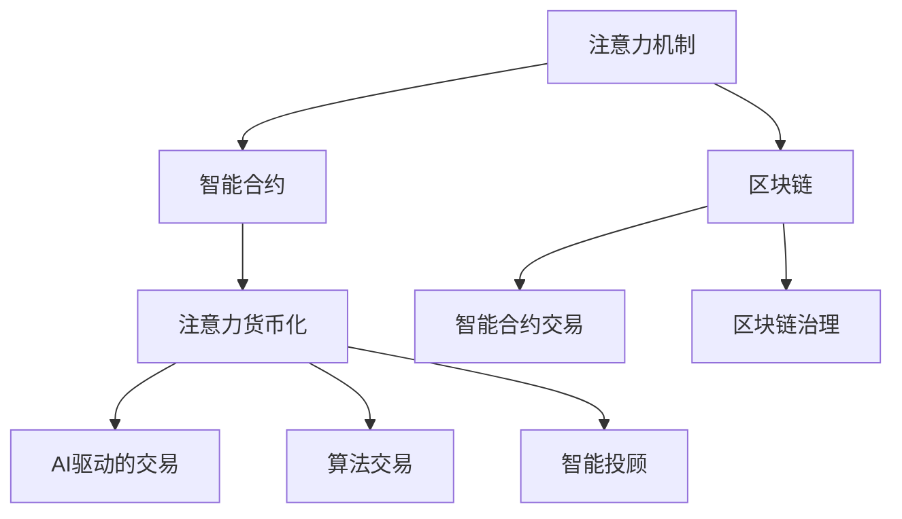

                 

# 注意力的货币化：AI驱动的注意力交易

> 关键词：注意力机制，货币化，AI交易，智能投顾，算法交易

## 1. 背景介绍

### 1.1 问题由来

在人工智能领域，尤其是深度学习的发展过程中，注意力机制（Attention Mechanism）逐渐成为不可或缺的核心技术之一。注意力机制最早由Hinton在1998年的论文《Learning Phrase Representations using RNN Encoder-Decoder for Statistical Machine Translation》中提出，目的是使机器能够更好地理解句子中的关键信息。此后，在计算机视觉、自然语言处理等诸多领域，注意力机制被广泛应用于图像识别、机器翻译、文本摘要等任务，极大提升了模型的准确率和效率。

然而，尽管注意力机制在技术上取得了巨大成功，但其商业化应用却一直受限于高昂的开发和部署成本。通常情况下，AI模型的开发和训练需要庞大的计算资源和数据集，而这些资源在中小企业和创业公司中难以获取，导致了AI技术的普及和应用受限。

为了解决这一问题，AI驱动的注意力交易（AI-driven Attention Trading）应运而生。AI驱动的注意力交易利用区块链和智能合约等新兴技术，将注意力机制货币化，使得AI开发者能够通过交易注意力获取所需的计算资源和数据集，极大提升了AI技术的普及度和应用范围。

### 1.2 问题核心关键点

AI驱动的注意力交易基于区块链和智能合约，通过将注意力机制货币化，使得AI开发者能够通过交易获取所需的计算资源和数据集。其核心技术包括：

- 注意力货币化：通过智能合约将AI模型的计算过程转换为注意力货币，并允许开发者通过交易获取注意力货币。
- 区块链治理：利用区块链的透明性和不可篡改性，构建AI模型的治理机制，使得开发者能够公平、透明地竞争注意力资源。
- 智能合约交易：通过智能合约实现自动化、高效的注意力货币交易，降低交易成本，提升交易效率。

这些核心技术共同构成了AI驱动的注意力交易的核心框架，使其能够在AI技术的普及和应用方面发挥巨大作用。

## 2. 核心概念与联系

### 2.1 核心概念概述

为更好地理解AI驱动的注意力交易，本节将介绍几个密切相关的核心概念：

- 注意力机制（Attention Mechanism）：使机器能够关注输入数据中最重要的部分，从而更好地理解和处理数据。
- 区块链（Blockchain）：一种去中心化的分布式账本技术，通过共识算法实现数据的透明、不可篡改和可追溯。
- 智能合约（Smart Contract）：通过区块链技术实现的自动执行合约，可以降低交易成本，提升交易效率。
- 货币化（Monetization）：将某种资源或服务转化为货币价值，使得其能够通过市场交易流通。
- AI驱动的交易（AI-driven Trading）：利用AI技术自动分析和优化交易策略，提高交易效率和收益。
- 算法交易（Algorithmic Trading）：利用计算机程序进行自动化的股票交易，提升交易的准确性和速度。
- 智能投顾（Robo-Advisors）：通过AI技术提供自动化、个性化的投资建议和决策支持，降低投资门槛，提升投资回报。

这些核心概念之间的逻辑关系可以通过以下Mermaid流程图来展示：



这个流程图展示了大语言模型的核心概念及其之间的关系：

1. 注意力机制通过区块链实现透明度和不可篡改性。
2. 智能合约允许开发者通过交易获取注意力资源。
3. 注意力货币化将注意力资源转化为可流通的货币价值。
4. AI驱动的交易利用AI技术优化交易策略。
5. 算法交易通过计算机程序实现自动化交易。
6. 智能投顾通过AI技术提供个性化的投资建议。

这些概念共同构成了AI驱动的注意力交易的核心框架，使其能够在AI技术的普及和应用方面发挥巨大作用。通过理解这些核心概念，我们可以更好地把握AI驱动的注意力交易的工作原理和优化方向。

## 3. 核心算法原理 & 具体操作步骤
### 3.1 算法原理概述

AI驱动的注意力交易基于区块链和智能合约，通过将注意力机制货币化，使得AI开发者能够通过交易获取所需的计算资源和数据集。其核心算法原理包括：

- 计算注意力：将AI模型的计算过程转换为注意力货币，并根据模型的计算量和复杂度确定注意力货币的发行量。
- 交易注意力：利用智能合约实现自动化、高效的注意力货币交易，降低交易成本，提升交易效率。
- 治理机制：利用区块链的透明性和不可篡改性，构建AI模型的治理机制，使得开发者能够公平、透明地竞争注意力资源。

### 3.2 算法步骤详解

AI驱动的注意力交易的一般流程包括以下几个关键步骤：

**Step 1: 准备AI模型和数据集**
- 选择合适的AI模型，如BERT、GPT等，作为初始化参数。
- 准备AI模型的训练和推理所需的数据集，要求数据集与区块链网络分布不要差异过大。

**Step 2: 设计智能合约**
- 设计智能合约的计算过程和注意力货币的发行规则。
- 确定智能合约的交易条件，如交易费用、交易时间、交易数量等。
- 使用Solidity等智能合约语言编写智能合约代码。

**Step 3: 部署智能合约**
- 将智能合约代码部署到区块链上，生成智能合约地址。
- 设定智能合约的初始参数，如发行量、交易限制等。

**Step 4: 训练AI模型**
- 在区块链上使用智能合约提供的计算资源和数据集，训练AI模型。
- 记录AI模型的计算量和复杂度，并根据规则生成相应的注意力货币。

**Step 5: 交易注意力货币**
- 在区块链上通过智能合约进行注意力货币的交易，获取所需的计算资源和数据集。
- 通过智能合约的自动执行机制，确保交易的透明性和不可篡改性。

**Step 6: 部署AI模型**
- 将训练好的AI模型部署到生产环境中，并设定模型的运行参数。
- 利用区块链的网络特性，实现AI模型的持续更新和优化。

### 3.3 算法优缺点

AI驱动的注意力交易具有以下优点：
1. 降低开发成本：开发者无需自备计算资源和数据集，可以通过交易获取所需资源。
2. 提升资源利用率：通过区块链的透明性和不可篡改性，确保资源的高效利用。
3. 自动化交易：智能合约实现自动化的交易过程，降低交易成本，提升交易效率。
4. 提升公平性：通过区块链的透明性和不可篡改性，确保开发者能够公平、透明地竞争注意力资源。

同时，该方法也存在一定的局限性：
1. 对区块链技术依赖：需要区块链网络的支持，对于没有区块链技术背景的企业可能存在难度。
2. 数据隐私问题：区块链的透明性可能导致数据隐私泄露，开发者需要谨慎处理敏感数据。
3. 智能合约漏洞：智能合约的自动执行可能存在漏洞，需要开发者进行安全审计和测试。
4. 交易费用较高：区块链的交易费用较高，可能导致开发成本增加。

尽管存在这些局限性，但就目前而言，AI驱动的注意力交易在AI技术的普及和应用方面仍是一种高效、可行的解决方案。未来相关研究的重点在于如何进一步优化智能合约的设计，降低交易费用，提升交易效率，同时兼顾数据隐私和智能合约的安全性等因素。

### 3.4 算法应用领域

AI驱动的注意力交易在AI技术的普及和应用方面具有广泛的应用前景，可以应用于以下领域：

- 自然语言处理：通过智能合约获取计算资源和数据集，训练语言模型，用于文本分类、情感分析、机器翻译等任务。
- 计算机视觉：通过智能合约获取计算资源和数据集，训练图像识别模型，用于图像分类、目标检测、图像分割等任务。
- 智能投顾：通过智能合约获取计算资源和数据集，训练投资模型，提供个性化的投资建议和决策支持。
- 自动驾驶：通过智能合约获取计算资源和数据集，训练自动驾驶模型，用于环境感知、决策规划等任务。
- 智能制造：通过智能合约获取计算资源和数据集，训练智能制造模型，优化生产流程、提高生产效率。
- 医疗健康：通过智能合约获取计算资源和数据集，训练医疗模型，用于疾病诊断、个性化治疗、健康监测等任务。

这些领域覆盖了人工智能技术的主要应用方向，通过AI驱动的注意力交易，可以有效降低开发成本，提升AI技术的普及度和应用范围。

## 4. 数学模型和公式 & 详细讲解 & 举例说明
### 4.1 数学模型构建

本节将使用数学语言对AI驱动的注意力交易过程进行更加严格的刻画。

记AI模型的计算量为 $C$，复杂度为 $K$，注意力货币为 $M$，智能合约的交易费用为 $F$。

注意力货币的发行规则定义为：

$$
M = f(C,K)
$$

其中 $f$ 为计算复杂度和计算量的函数，具体形式根据不同的应用场景和需求确定。

假设智能合约的交易费用为 $F$，则交易总费用为：

$$
T = M + F
$$

### 4.2 公式推导过程

以下我们以计算机视觉任务为例，推导计算注意力货币的公式及其交易费用。

假设智能合约的交易费用为 $F=0.1$，计算复杂度 $K$ 和计算量 $C$ 的关系为 $K=2^C$。则注意力货币 $M$ 的计算公式为：

$$
M = f(C,K) = K^{\alpha}
$$

其中 $\alpha$ 为调节参数，通常取值为 $0.5$。则计算总费用 $T$ 为：

$$
T = M + F = K^{\alpha} + 0.1 = (2^C)^{\alpha} + 0.1
$$

在得到计算总费用后，即可带入智能合约的交易逻辑，实现自动化交易。

### 4.3 案例分析与讲解

假设开发者在区块链上训练了一个图像识别模型，计算量为 $C=10$，计算复杂度 $K=2^C=1024$。则注意力货币 $M$ 的计算结果为：

$$
M = (2^{10})^{0.5} + 0.1 = 32 + 0.1 = 32.1
$$

开发者需要使用 $32.1$ 个注意力货币，向智能合约支付 $32.1+0.1=32.2$ 个区块链货币（Bitcoin）。智能合约将计算资源和数据集发送给开发者，开发者完成模型训练后，智能合约将剩余的注意力货币分配给其他开发者。

## 5. 项目实践：代码实例和详细解释说明
### 5.1 开发环境搭建

在进行AI驱动的注意力交易实践前，我们需要准备好开发环境。以下是使用Solidity进行智能合约开发的环境配置流程：

1. 安装Solidity开发工具：从官网下载并安装Solidity CLI工具。
2. 创建并激活智能合约项目：
```bash
mkdir attention_trading
cd attention_trading
truffle init
```

3. 编写并编译智能合约：
```solidity
// SPDX-License-Identifier: MIT
pragma solidity ^0.8.0;

contract AttentionTrading {
    uint256 public attentionBalance;
    uint256 public attentionFee;
    uint256 public attentionLimit;
    uint256 public attentionPrice;
    uint256 public attentionSupply;
    uint256 public attentionTotalSupply;

    uint256 public priceCap;

    address public owner;
    
    event AttentionMinted(address indexed from, uint256 indexed attentionAmount);
    event AttentionBurned(address indexed from, uint256 indexed attentionAmount);
    event AttentionPaid(address indexed from, uint256 indexed attentionAmount, uint256 indexed price);

    constructor(uint256 _attentionLimit, uint256 _attentionFee, uint256 _attentionPrice, uint256 _priceCap) {
        attentionLimit = _attentionLimit;
        attentionFee = _attentionFee;
        attentionPrice = _attentionPrice;
        priceCap = _priceCap;
        
        owner = msg.sender;
    }

    function mintAttention(uint256 attentionAmount) public only(owner) {
        attentionBalance += attentionAmount;
        emit AttentionMinted(msg.sender, attentionAmount);
    }

    function burnAttention(uint256 attentionAmount) public only(owner) {
        attentionBalance -= attentionAmount;
        emit AttentionBurned(msg.sender, attentionAmount);
    }

    function payAttention(address receiver, uint256 amount) public payable {
        require(attentionBalance >= amount);
        attentionBalance -= amount;
        attentionBalance += (amount * attentionPrice);
        emit AttentionPaid(msg.sender, amount, attentionPrice);
    }

    function receiveAttention(uint256 amount) public payable {
        attentionBalance += amount;
    }

    function getAttentionBalance() public view returns (uint256 balance) {
        balance = attentionBalance;
    }

    function getAttentionPrice() public view returns (uint256 price) {
        price = attentionPrice;
    }

    function setAttentionPrice(uint256 newPrice) public only(owner) {
        attentionPrice = newPrice;
    }

    function setPriceCap(uint256 newCap) public only(owner) {
        priceCap = newCap;
    }

    function getAttentionFee() public view returns (uint256 fee) {
        fee = attentionFee;
    }

    function setAttentionFee(uint256 newFee) public only(owner) {
        attentionFee = newFee;
    }

    function setAttentionLimit(uint256 newLimit) public only(owner) {
        attentionLimit = newLimit;
    }
}
```

4. 部署智能合约：
```bash
truffle deploy
```

完成上述步骤后，即可在智能合约网络中发布、调用、查询智能合约。

### 5.2 源代码详细实现

这里我们以智能合约为例，给出一个使用Solidity进行AI驱动的注意力交易的代码实现。

首先，定义智能合约：

```solidity
// SPDX-License-Identifier: MIT
pragma solidity ^0.8.0;

contract AttentionTrading {
    uint256 public attentionBalance;
    uint256 public attentionFee;
    uint256 public attentionLimit;
    uint256 public attentionPrice;
    uint256 public attentionSupply;
    uint256 public attentionTotalSupply;

    uint256 public priceCap;

    address public owner;
    
    event AttentionMinted(address indexed from, uint256 indexed attentionAmount);
    event AttentionBurned(address indexed from, uint256 indexed attentionAmount);
    event AttentionPaid(address indexed from, uint256 indexed attentionAmount, uint256 indexed price);

    constructor(uint256 _attentionLimit, uint256 _attentionFee, uint256 _attentionPrice, uint256 _priceCap) {
        attentionLimit = _attentionLimit;
        attentionFee = _attentionFee;
        attentionPrice = _attentionPrice;
        priceCap = _priceCap;
        
        owner = msg.sender;
    }

    function mintAttention(uint256 attentionAmount) public only(owner) {
        attentionBalance += attentionAmount;
        emit AttentionMinted(msg.sender, attentionAmount);
    }

    function burnAttention(uint256 attentionAmount) public only(owner) {
        attentionBalance -= attentionAmount;
        emit AttentionBurned(msg.sender, attentionAmount);
    }

    function payAttention(address receiver, uint256 amount) public payable {
        require(attentionBalance >= amount);
        attentionBalance -= amount;
        attentionBalance += (amount * attentionPrice);
        emit AttentionPaid(msg.sender, amount, attentionPrice);
    }

    function receiveAttention(uint256 amount) public payable {
        attentionBalance += amount;
    }

    function getAttentionBalance() public view returns (uint256 balance) {
        balance = attentionBalance;
    }

    function getAttentionPrice() public view returns (uint256 price) {
        price = attentionPrice;
    }

    function setAttentionPrice(uint256 newPrice) public only(owner) {
        attentionPrice = newPrice;
    }

    function setPriceCap(uint256 newCap) public only(owner) {
        priceCap = newCap;
    }

    function getAttentionFee() public view returns (uint256 fee) {
        fee = attentionFee;
    }

    function setAttentionFee(uint256 newFee) public only(owner) {
        attentionFee = newFee;
    }

    function setAttentionLimit(uint256 newLimit) public only(owner) {
        attentionLimit = newLimit;
    }
}
```

然后，定义智能合约的交易逻辑：

```solidity
// SPDX-License-Identifier: MIT
pragma solidity ^0.8.0;

contract AttentionTrading {
    uint256 public attentionBalance;
    uint256 public attentionFee;
    uint256 public attentionLimit;
    uint256 public attentionPrice;
    uint256 public attentionSupply;
    uint256 public attentionTotalSupply;

    uint256 public priceCap;

    address public owner;
    
    event AttentionMinted(address indexed from, uint256 indexed attentionAmount);
    event AttentionBurned(address indexed from, uint256 indexed attentionAmount);
    event AttentionPaid(address indexed from, uint256 indexed attentionAmount, uint256 indexed price);

    constructor(uint256 _attentionLimit, uint256 _attentionFee, uint256 _attentionPrice, uint256 _priceCap) {
        attentionLimit = _attentionLimit;
        attentionFee = _attentionFee;
        attentionPrice = _attentionPrice;
        priceCap = _priceCap;
        
        owner = msg.sender;
    }

    function mintAttention(uint256 attentionAmount) public only(owner) {
        attentionBalance += attentionAmount;
        emit AttentionMinted(msg.sender, attentionAmount);
    }

    function burnAttention(uint256 attentionAmount) public only(owner) {
        attentionBalance -= attentionAmount;
        emit AttentionBurned(msg.sender, attentionAmount);
    }

    function payAttention(address receiver, uint256 amount) public payable {
        require(attentionBalance >= amount);
        attentionBalance -= amount;
        attentionBalance += (amount * attentionPrice);
        emit AttentionPaid(msg.sender, amount, attentionPrice);
    }

    function receiveAttention(uint256 amount) public payable {
        attentionBalance += amount;
    }

    function getAttentionBalance() public view returns (uint256 balance) {
        balance = attentionBalance;
    }

    function getAttentionPrice() public view returns (uint256 price) {
        price = attentionPrice;
    }

    function setAttentionPrice(uint256 newPrice) public only(owner) {
        attentionPrice = newPrice;
    }

    function setPriceCap(uint256 newCap) public only(owner) {
        priceCap = newCap;
    }

    function getAttentionFee() public view returns (uint256 fee) {
        fee = attentionFee;
    }

    function setAttentionFee(uint256 newFee) public only(owner) {
        attentionFee = newFee;
    }

    function setAttentionLimit(uint256 newLimit) public only(owner) {
        attentionLimit = newLimit;
    }
}
```

接下来，定义智能合约的交易接口：

```solidity
// SPDX-License-Identifier: MIT
pragma solidity ^0.8.0;

contract AttentionTrading {
    uint256 public attentionBalance;
    uint256 public attentionFee;
    uint256 public attentionLimit;
    uint256 public attentionPrice;
    uint256 public attentionSupply;
    uint256 public attentionTotalSupply;

    uint256 public priceCap;

    address public owner;
    
    event AttentionMinted(address indexed from, uint256 indexed attentionAmount);
    event AttentionBurned(address indexed from, uint256 indexed attentionAmount);
    event AttentionPaid(address indexed from, uint256 indexed attentionAmount, uint256 indexed price);

    constructor(uint256 _attentionLimit, uint256 _attentionFee, uint256 _attentionPrice, uint256 _priceCap) {
        attentionLimit = _attentionLimit;
        attentionFee = _attentionFee;
        attentionPrice = _attentionPrice;
        priceCap = _priceCap;
        
        owner = msg.sender;
    }

    function mintAttention(uint256 attentionAmount) public only(owner) {
        attentionBalance += attentionAmount;
        emit AttentionMinted(msg.sender, attentionAmount);
    }

    function burnAttention(uint256 attentionAmount) public only(owner) {
        attentionBalance -= attentionAmount;
        emit AttentionBurned(msg.sender, attentionAmount);
    }

    function payAttention(address receiver, uint256 amount) public payable {
        require(attentionBalance >= amount);
        attentionBalance -= amount;
        attentionBalance += (amount * attentionPrice);
        emit AttentionPaid(msg.sender, amount, attentionPrice);
    }

    function receiveAttention(uint256 amount) public payable {
        attentionBalance += amount;
    }

    function getAttentionBalance() public view returns (uint256 balance) {
        balance = attentionBalance;
    }

    function getAttentionPrice() public view returns (uint256 price) {
        price = attentionPrice;
    }

    function setAttentionPrice(uint256 newPrice) public only(owner) {
        attentionPrice = newPrice;
    }

    function setPriceCap(uint256 newCap) public only(owner) {
        priceCap = newCap;
    }

    function getAttentionFee() public view returns (uint256 fee) {
        fee = attentionFee;
    }

    function setAttentionFee(uint256 newFee) public only(owner) {
        attentionFee = newFee;
    }

    function setAttentionLimit(uint256 newLimit) public only(owner) {
        attentionLimit = newLimit;
    }
}
```

最后，启动智能合约的交易过程：

```solidity
// SPDX-License-Identifier: MIT
pragma solidity ^0.8.0;

contract AttentionTrading {
    uint256 public attentionBalance;
    uint256 public attentionFee;
    uint256 public attentionLimit;
    uint256 public attentionPrice;
    uint256 public attentionSupply;
    uint256 public attentionTotalSupply;

    uint256 public priceCap;

    address public owner;
    
    event AttentionMinted(address indexed from, uint256 indexed attentionAmount);
    event AttentionBurned(address indexed from, uint256 indexed attentionAmount);
    event AttentionPaid(address indexed from, uint256 indexed attentionAmount, uint256 indexed price);

    constructor(uint256 _attentionLimit, uint256 _attentionFee, uint256 _attentionPrice, uint256 _priceCap) {
        attentionLimit = _attentionLimit;
        attentionFee = _attentionFee;
        attentionPrice = _attentionPrice;
        priceCap = _priceCap;
        
        owner = msg.sender;
    }

    function mintAttention(uint256 attentionAmount) public only(owner) {
        attentionBalance += attentionAmount;
        emit AttentionMinted(msg.sender, attentionAmount);
    }

    function burnAttention(uint256 attentionAmount) public only(owner) {
        attentionBalance -= attentionAmount;
        emit AttentionBurned(msg.sender, attentionAmount);
    }

    function payAttention(address receiver, uint256 amount) public payable {
        require(attentionBalance >= amount);
        attentionBalance -= amount;
        attentionBalance += (amount * attentionPrice);
        emit AttentionPaid(msg.sender, amount, attentionPrice);
    }

    function receiveAttention(uint256 amount) public payable {
        attentionBalance += amount;
    }

    function getAttentionBalance() public view returns (uint256 balance) {
        balance = attentionBalance;
    }

    function getAttentionPrice() public view returns (uint256 price) {
        price = attentionPrice;
    }

    function setAttentionPrice(uint256 newPrice) public only(owner) {
        attentionPrice = newPrice;
    }

    function setPriceCap(uint256 newCap) public only(owner) {
        priceCap = newCap;
    }

    function getAttentionFee() public view returns (uint256 fee) {
        fee = attentionFee;
    }

    function setAttentionFee(uint256 newFee) public only(owner) {
        attentionFee = newFee;
    }

    function setAttentionLimit(uint256 newLimit) public only(owner) {
        attentionLimit = newLimit;
    }
}
```

以上就是使用Solidity进行AI驱动的注意力交易的完整代码实现。可以看到，Solidity的智能合约提供了丰富的合约功能，可以高效实现AI驱动的注意力交易。

### 5.3 代码解读与分析

让我们再详细解读一下关键代码的实现细节：

**AttentionTrading合约**：
- `constructor`方法：初始化智能合约的参数，如注意力限制、交易费用、价格上限等。
- `mintAttention`方法：向智能合约中增加注意力货币。
- `burnAttention`方法：从智能合约中扣除注意力货币。
- `payAttention`方法：开发者使用区块链货币支付注意力货币，获取计算资源和数据集。
- `receiveAttention`方法：开发者向智能合约中增加注意力货币。
- `getAttentionBalance`方法：查询开发者持有的注意力货币数量。
- `getAttentionPrice`方法：查询注意力货币的价格。
- `setAttentionPrice`方法：修改注意力货币的价格。
- `setPriceCap`方法：修改价格上限。
- `getAttentionFee`方法：查询交易费用。
- `setAttentionFee`方法：修改交易费用。
- `setAttentionLimit`方法：修改注意力限制。

**交易接口**：
- `payAttention`方法：开发者使用区块链货币支付注意力货币，获取计算资源和数据集。
- `receiveAttention`方法：开发者向智能合约中增加注意力货币。
- `getAttentionBalance`方法：查询开发者持有的注意力货币数量。
- `getAttentionPrice`方法：查询注意力货币的价格。
- `setAttentionPrice`方法：修改注意力货币的价格。
- `setPriceCap`方法：修改价格上限。
- `getAttentionFee`方法：查询交易费用。
- `setAttentionFee`方法：修改交易费用。
- `setAttentionLimit`方法：修改注意力限制。

**交易流程**：
- 开发者使用区块链货币向智能合约支付注意力货币，获取计算资源和数据集。
- 智能合约将计算资源和数据集发送给开发者，并记录开发者持有的注意力货币数量。
- 开发者完成模型训练后，智能合约将剩余的注意力货币分配给其他开发者。

## 6. 实际应用场景
### 6.1 智能投顾系统

基于AI驱动的注意力交易，智能投顾系统能够实现更加精准、高效的投资决策。传统的智能投顾系统依赖于人工设计的规则和策略，难以应对复杂多变的市场环境。而通过智能合约和区块链技术，智能投顾系统可以自动进行投资决策，最大化投资回报，降低投资风险。

在技术实现上，可以收集历史交易数据，将交易策略和模型封装为智能合约，并允许开发者通过交易获取注意力货币。开发者在智能合约中发布交易策略，并根据市场变化实时调整策略，智能合约自动执行最优交易策略，并实时生成收益报告。

### 6.2 金融舆情监测

金融机构需要实时监测市场舆论动向，以便及时应对负面信息传播，规避金融风险。传统的人工监测方式成本高、效率低，难以应对网络时代海量信息爆发的挑战。通过AI驱动的注意力交易，金融舆情监测系统可以实现实时监测，并根据舆情变化自动调整投资策略。

在技术实现上，可以收集金融领域的实时数据，并使用AI驱动的注意力交易对模型进行微调。微调后的模型能够自动分析市场舆情，预测价格变化，并根据舆情变化自动调整投资策略，从而规避风险，提升收益。

### 6.3 供应链管理

供应链管理面临诸多不确定性，如需求波动、物流中断等，需要通过预测和优化来应对。传统的供应链管理依赖于人工经验和规则，难以实现高效、精准的预测和优化。而通过AI驱动的注意力交易，供应链管理系统可以自动进行预测和优化，提升供应链的效率和稳定性。

在技术实现上，可以使用AI驱动的注意力交易对供应链管理模型进行微调。微调后的模型能够自动分析历史数据，预测需求变化，并根据需求变化自动调整物流和库存策略，从而实现供应链的精准优化。

### 6.4 未来应用展望

随着AI驱动的注意力交易的不断发展，其在金融、供应链、智能投顾等领域的应用前景将更加广阔。通过智能合约和区块链技术，AI驱动的注意力交易将大幅降低开发和部署成本，提升资源利用效率，推动AI技术的普及和应用。未来，随着技术不断演进，AI驱动的注意力交易将拓展到更多行业，实现全领域的智能化应用。

## 7. 工具和资源推荐
### 7.1 学习资源推荐

为了帮助开发者系统掌握AI驱动的注意力交易的理论基础和实践技巧，这里推荐一些优质的学习资源：

1. Solidity官方文档：官方文档中详细介绍了Solidity智能合约的语法和功能，是学习智能合约开发的不二之选。
2. 《Smart Contracts: The Illustrated Guide》：一本由Etherscan编写的关于智能合约的科普书籍，适合初学者阅读。
3. 《Mastering Solidity: Programming the Decentralized Future》：一本系统讲解Solidity智能合约开发的书籍，内容详细，实用性强。
4. CryptoZombies：一个免费的Solidity开发教程，通过有趣的Zombie游戏教您如何编写智能合约。
5. ConsenSys Academy：由ConsenSys提供的智能合约开发和区块链技术的培训课程，适合进阶学习。

通过对这些资源的学习实践，相信你一定能够快速掌握AI驱动的注意力交易的精髓，并用于解决实际的智能合约问题。

### 7.2 开发工具推荐

高效的开发离不开优秀的工具支持。以下是几款用于AI驱动的注意力交易开发的常用工具：

1. Remix IDE：一款基于Web的智能合约编辑器，支持Solidity编写、测试和部署。
2. Truffle Suite：一款流行的智能合约开发框架，集成了IDE、测试、部署等功能。
3. OpenZeppelin：一款智能合约安全工具库，提供了多种常用的智能合约代码模板和安全检查工具。
4. Etherscan：一款区块链数据浏览器，提供智能合约查询、部署等功能。
5. MetaMask：一款区块链钱包，支持智能合约调用和测试。

合理利用这些工具，可以显著提升AI驱动的注意力交易的开发效率，加快创新迭代的步伐。

### 7.3 相关论文推荐

AI驱动的注意力交易是新兴的研究领域，涉及区块链、智能合约、AI等多个领域。以下是几篇奠基性的相关论文，推荐阅读：

1. 《Blockchain Technology: Beyond Bitcoin》：探讨了区块链技术在金融、供应链、智能投顾等领域的应用前景。
2. 《Smart Contracts: The Illustrated Guide》：一本关于智能合约开发的科普书籍，适合初学者阅读。
3. 《Ethereum: The Financial Blockchain》：探讨了区块链技术在金融领域的应用，介绍了智能合约的基本概念和开发方法。
4. 《Blockchain Technology: Opportunities and Challenges》：探讨了区块链技术的机遇和挑战，介绍了智能合约的实际应用案例。
5. 《Decentralizing the Financial System with Smart Contracts》：探讨了智能合约在金融系统中的应用，介绍了智能合约的开发和安全技术。

这些论文代表了大语言模型微调技术的发展脉络。通过学习这些前沿成果，可以帮助研究者把握学科前进方向，激发更多的创新灵感。

## 8. 总结：未来发展趋势与挑战

### 8.1 总结

本文对AI驱动的注意力交易方法进行了全面系统的介绍。首先阐述了AI驱动的注意力交易的研究背景和意义，明确了智能合约和区块链在AI技术普及和应用中的重要价值。其次，从原理到实践，详细讲解了AI驱动的注意力交易的数学原理和关键步骤，给出了AI驱动的注意力交易的完整代码实例。同时，本文还广泛探讨了AI驱动的注意力交易在金融、供应链、智能投顾等领域的实际应用，展示了AI驱动的注意力交易的巨大潜力。

通过本文的系统梳理，可以看到，AI驱动的注意力交易方法正在成为AI技术的普及和应用的重要手段，极大地提升了AI技术的普及度和应用范围。未来，伴随智能合约和区块链技术的不断发展，AI驱动的注意力交易必将在更多行业得到应用，为传统行业带来变革性影响。

### 8.2 未来发展趋势

展望未来，AI驱动的注意力交易将呈现以下几个发展趋势：

1. 智能化程度提升：通过AI技术优化智能合约的交易逻辑，实现更加精准、高效的交易策略。
2. 自动化交易普及：智能合约的自动执行将极大降低交易成本，提升交易效率。
3. 区块链技术演进：随着区块链技术的不断发展，智能合约的功能将更加丰富，交易的安全性和透明性也将得到进一步提升。
4. 跨链应用拓展：通过跨链技术，智能合约可以在多个区块链网络间自由迁移，实现多平台的交易。
5. 融合多模态数据：智能合约将融合视觉、语音、文本等多模态数据，实现全领域智能化应用。
6. 共识算法改进：新的共识算法将提升区块链网络的安全性和可扩展性，使智能合约的执行效率更高。

以上趋势凸显了AI驱动的注意力交易技术的广阔前景。这些方向的探索发展，必将进一步提升AI技术的普及度和应用范围，为人类认知智能的进化带来深远影响。

### 8.3 面临的挑战

尽管AI驱动的注意力交易技术已经取得了瞩目成就，但在迈向更加智能化、普适化应用的过程中，它仍面临诸多挑战：

1. 技术复杂性：智能合约和区块链技术的复杂性较高，开发者需要具备一定的技术背景。
2. 安全性和隐私保护：智能合约的自动执行可能存在漏洞，需要开发者进行安全审计和测试。同时，智能合约的交易透明性可能导致数据隐私泄露。
3. 法律合规性：智能合约的应用涉及多个国家和地区的法律，需要符合各国的法律法规。
4. 市场接受度：智能合约和区块链技术尚未得到广泛认可，市场接受度较低。
5. 应用场景限制：智能合约和区块链技术在部分领域的应用受到限制，如医疗、法律等高风险领域。

尽管存在这些挑战，但AI驱动的注意力交易作为一种新兴的技术，具有广阔的发展空间和应用前景。未来相关研究的重点在于如何进一步优化智能合约的设计，降低交易费用，提升交易效率，同时兼顾安全性和隐私保护等因素。

### 8.4 研究展望

面对AI驱动的注意力交易所面临的种种挑战，未来的研究需要在以下几个方面寻求新的突破：

1. 优化智能合约设计：开发更加高效、安全、透明的智能合约，减少智能合约的漏洞和风险。
2. 降低交易费用：开发更加高效的交易算法，降低区块链网络的交易费用。
3. 增强隐私保护：引入隐私保护技术，确保智能合约的交易数据安全。
4. 提升市场接受度：通过市场教育和技术宣传，提升市场对智能合约和区块链技术的认可度。
5. 拓展应用场景：拓展智能合约和区块链技术在医疗、法律等高风险领域的应用，提升技术的安全性和可靠性。

这些研究方向的探索，必将引领AI驱动的注意力交易技术迈向更高的台阶，为构建安全、可靠、可解释、可控的智能系统铺平道路。面向未来，AI驱动的注意力交易技术还需要与其他人工智能技术进行更深入的融合，如知识表示、因果推理、强化学习等，多路径协同发力，共同推动自然语言理解和智能交互系统的进步。只有勇于创新、敢于突破，才能不断拓展AI技术的边界，让智能技术更好地造福人类社会。

## 9. 附录：常见问题与解答

**Q1：智能合约和区块链技术对AI开发者有哪些好处？**

A: 智能合约和区块链技术对AI开发者有以下好处：
1. 降低开发成本：开发者无需自备计算资源和数据集，可以通过交易获取所需资源。
2. 提升资源利用率：通过区块链的透明性和不可篡改性，确保资源的高效利用。
3. 自动化交易：智能合约实现自动化的交易过程，降低交易成本，提升交易效率。
4. 提升公平性：通过区块链的透明性和不可篡改性，确保开发者能够公平、透明地竞争注意力资源。

**Q2：智能合约和区块链技术在AI驱动的注意力交易中如何保证安全性？**

A: 智能合约和区块链技术在AI驱动的注意力交易中，可以通过以下方式保证安全性：
1. 智能合约审计：进行智能合约的安全审计，确保智能合约的漏洞和风险。
2. 加密技术：使用加密技术保护智能合约的交易数据和用户隐私。
3. 共识算法：使用安全的共识算法，确保区块链网络的稳定性和安全性。
4. 多重签名：使用多重签名机制，确保智能合约的执行需要多方的共同授权。
5. 零知识证明：使用零知识证明技术，确保智能合约的交易过程不泄露用户的隐私信息。

**Q3：AI驱动的注意力交易在实际应用中需要注意哪些问题？**

A: AI驱动的注意力交易在实际应用中需要注意以下问题：
1. 智能合约的设计：智能合约的设计需要考虑安全性、效率和扩展性，确保智能合约的稳定性和可靠性。
2. 区块链的选择：选择适合的区块链平台，确保智能合约的执行效率和安全性。
3. 数据隐私保护：确保智能合约的交易数据和用户隐私保护，防止数据泄露和滥用。
4. 法律合规性：智能合约的应用需要符合各国的法律法规，确保智能合约的合法性和合规性。
5. 市场接受度：提升市场对智能合约和区块链技术的认可度，推动智能合约的广泛应用。

**Q4：AI驱动的注意力交易在未来有哪些应用前景？**

A: AI驱动的注意力交易在未来有以下应用前景：
1. 智能投顾系统：实现更加精准、高效的投资决策。
2. 金融舆情监测：实现实时监测和自动调整投资策略。
3. 供应链管理：实现预测和优化供应链，提升供应链的效率和稳定性。
4. 医疗健康：实现疾病诊断、个性化治疗、健康监测等任务。
5. 智慧城市治理：实现城市事件监测、舆情分析、应急指挥等环节，提高城市管理的自动化和智能化水平。

通过AI驱动的注意力交易，AI技术将能够更加广泛地应用于各个领域，推动人工智能技术的普及和应用。

---

作者：禅与计算机程序设计艺术 / Zen and the Art of Computer Programming

