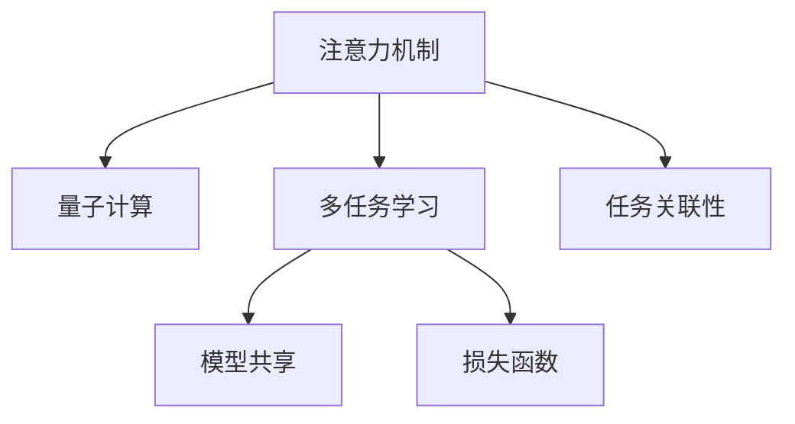

                 

# 注意力的量子态：AI时代的多任务处理

> 关键词：注意力机制,量子计算,多任务学习,深度学习,神经网络

## 1. 背景介绍

### 1.1 问题由来
随着深度学习技术的迅猛发展，深度神经网络在多个领域取得了巨大的成功，例如计算机视觉、自然语言处理、语音识别等。然而，深度学习模型的训练和推理往往需要大量的时间和计算资源，且在大规模数据集上的训练非常困难。为此，研究人员提出了一种基于注意力机制的模型，将注意力机制融入神经网络中，以解决深度学习中的多个问题。

在实际应用中，注意力机制已经被广泛应用于各种任务，如机器翻译、文本摘要、图像分类等。然而，这些模型通常只针对单个任务进行训练，在面对多个相关任务时，模型的性能往往不够理想。因此，研究人员提出了一种多任务学习(Multi-Task Learning, MTL)框架，该框架可以同时训练多个任务，以提高模型的泛化能力和表现。

多任务学习框架不仅能够提高模型的泛化能力，还能够利用不同任务的关联性，共享模型参数，从而减少训练成本和时间。近年来，基于注意力机制的多任务学习框架已经成为深度学习研究的热点之一，吸引了越来越多的关注。

### 1.2 问题核心关键点
多任务学习框架的核心在于如何利用注意力机制，将多个任务关联起来，共享模型参数，从而提高模型的泛化能力和表现。具体来说，多任务学习框架需要满足以下几个关键点：

1. 如何设计注意力机制，使得模型能够关注不同任务的关联性。
2. 如何共享模型参数，使得模型能够充分利用不同任务之间的相似性。
3. 如何优化多任务学习框架，使得模型能够同时提高多个任务的表现。

为了回答这些问题，研究人员提出了一种基于注意力机制的多任务学习框架，并进行了大量的实验和研究。本文将详细介绍该框架的设计原理和实现方法，并探讨其在实际应用中的表现和优势。

## 2. 核心概念与联系

### 2.1 核心概念概述

在介绍多任务学习框架之前，我们需要先了解一些核心概念，包括注意力机制、量子计算和多任务学习。

- 注意力机制：一种用于计算注意力分布的神经网络模块，它可以根据输入的不同位置，动态地分配注意力权重，以提高模型的表现。
- 量子计算：一种利用量子比特进行计算的新型计算方式，具有比传统计算更高的效率和更大的计算能力。
- 多任务学习：一种同时训练多个相关任务的深度学习框架，以提高模型的泛化能力和表现。

这些概念之间的联系可以通过以下Mermaid流程图来展示：



这个流程图展示了注意力机制、量子计算和多任务学习之间的联系：

1. 注意力机制用于计算不同任务之间的关联性，提高模型的表现。
2. 量子计算提供了一种高效的计算方式，可以加速注意力机制的计算过程。
3. 多任务学习框架可以同时训练多个相关任务，以提高模型的泛化能力和表现。
4. 任务关联性是注意力机制和多任务学习框架的核心，它决定了模型如何共享参数和优化目标。

## 3. 核心算法原理 & 具体操作步骤
### 3.1 算法原理概述

基于注意力机制的多任务学习框架，其核心原理是将注意力机制融入深度学习模型中，同时训练多个相关任务，以提高模型的泛化能力和表现。具体来说，该框架通过以下步骤实现：

1. 设计注意力机制，计算不同任务之间的关联性。
2. 共享模型参数，使得模型能够充分利用不同任务之间的相似性。
3. 优化多任务学习框架，使得模型能够同时提高多个任务的表现。

### 3.2 算法步骤详解

#### 步骤1：设计注意力机制

注意力机制的核心是计算不同任务之间的关联性。具体来说，注意力机制通过计算输入数据的权重向量，将输入数据按照权重进行加权，从而得到加权后的表示。这一过程可以通过以下公式表示：

$$
\alpha = \frac{\exp(\beta^\top x_i)}{\sum_{j=1}^N \exp(\beta^\top x_j)}
$$

其中，$\alpha$ 表示输入数据 $x_i$ 的注意力权重向量，$\beta$ 表示注意力机制的权重向量，$N$ 表示输入数据的个数。

在多任务学习框架中，注意力机制通常用于计算不同任务之间的关联性，使得模型能够关注不同任务的共同特征。具体来说，可以将注意力机制应用于输入数据的每个位置，以计算不同任务之间的关联性。这一过程可以通过以下公式表示：

$$
\alpha_{t,i} = \frac{\exp(\beta_t^\top x_i)}{\sum_{j=1}^N \exp(\beta_t^\top x_j)}
$$

其中，$\alpha_{t,i}$ 表示任务 $t$ 在输入数据位置 $i$ 的注意力权重向量，$\beta_t$ 表示任务 $t$ 的注意力机制权重向量。

#### 步骤2：共享模型参数

共享模型参数是多任务学习框架的核心。通过共享模型参数，模型能够充分利用不同任务之间的相似性，从而提高模型的泛化能力和表现。具体来说，可以将多任务学习框架的共享参数表示为：

$$
\theta = \{\theta_1, \theta_2, \ldots, \theta_T\}
$$

其中，$\theta_t$ 表示任务 $t$ 的共享参数。

在多任务学习框架中，共享参数可以用于计算不同任务的输出，从而实现多任务学习的目标。具体来说，可以将共享参数应用于输入数据，以计算不同任务的输出。这一过程可以通过以下公式表示：

$$
y_t = \theta_t^\top x_t + b_t
$$

其中，$y_t$ 表示任务 $t$ 的输出，$x_t$ 表示任务 $t$ 的输入，$b_t$ 表示任务 $t$ 的偏置项。

#### 步骤3：优化多任务学习框架

优化多任务学习框架是实现多任务学习的关键步骤。通过优化多任务学习框架，模型能够同时提高多个任务的表现。具体来说，可以将多任务学习框架的损失函数表示为：

$$
\mathcal{L}(\theta) = \sum_{t=1}^T \mathcal{L}_t(\theta_t)
$$

其中，$\mathcal{L}_t(\theta_t)$ 表示任务 $t$ 的损失函数，$T$ 表示任务的个数。

在多任务学习框架中，优化多任务学习框架的过程可以通过以下步骤实现：

1. 随机初始化模型参数 $\theta$。
2. 通过反向传播算法，计算损失函数 $\mathcal{L}(\theta)$ 对模型参数 $\theta$ 的梯度。
3. 使用梯度下降算法，更新模型参数 $\theta$，以最小化损失函数 $\mathcal{L}(\theta)$。
4. 重复步骤2和步骤3，直到损失函数 $\mathcal{L}(\theta)$ 收敛。

## 4. 数学模型和公式 & 详细讲解 & 举例说明

### 4.1 数学模型构建

基于注意力机制的多任务学习框架，其数学模型可以表示为：

$$
\theta = \{\theta_1, \theta_2, \ldots, \theta_T\}
$$

其中，$\theta_t$ 表示任务 $t$ 的共享参数。

### 4.2 公式推导过程

在多任务学习框架中，注意力机制的计算过程可以通过以下公式表示：

$$
\alpha_{t,i} = \frac{\exp(\beta_t^\top x_i)}{\sum_{j=1}^N \exp(\beta_t^\top x_j)}
$$

其中，$\alpha_{t,i}$ 表示任务 $t$ 在输入数据位置 $i$ 的注意力权重向量，$\beta_t$ 表示任务 $t$ 的注意力机制权重向量。

在多任务学习框架中，共享参数的计算过程可以通过以下公式表示：

$$
y_t = \theta_t^\top x_t + b_t
$$

其中，$y_t$ 表示任务 $t$ 的输出，$x_t$ 表示任务 $t$ 的输入，$b_t$ 表示任务 $t$ 的偏置项。

在多任务学习框架中，损失函数的计算过程可以通过以下公式表示：

$$
\mathcal{L}(\theta) = \sum_{t=1}^T \mathcal{L}_t(\theta_t)
$$

其中，$\mathcal{L}_t(\theta_t)$ 表示任务 $t$ 的损失函数，$T$ 表示任务的个数。

### 4.3 案例分析与讲解

为了更好地理解基于注意力机制的多任务学习框架，我们可以使用一个简单的案例进行分析。

假设我们有三个任务，分别是文本分类、情感分析和命名实体识别。我们可以使用基于注意力机制的多任务学习框架，训练一个共享参数的模型，以同时实现这三个任务。具体来说，可以设计以下注意力机制：

$$
\alpha_{t,i} = \frac{\exp(\beta_t^\top x_i)}{\sum_{j=1}^N \exp(\beta_t^\top x_j)}
$$

其中，$\beta_t$ 表示任务 $t$ 的注意力机制权重向量。

我们可以将共享参数表示为：

$$
\theta = \{\theta_1, \theta_2, \theta_3\}
$$

其中，$\theta_t$ 表示任务 $t$ 的共享参数。

在训练过程中，我们可以使用以下损失函数：

$$
\mathcal{L}(\theta) = \mathcal{L}_1(\theta_1) + \mathcal{L}_2(\theta_2) + \mathcal{L}_3(\theta_3)
$$

其中，$\mathcal{L}_t(\theta_t)$ 表示任务 $t$ 的损失函数。

通过优化上述损失函数，我们可以训练一个同时实现文本分类、情感分析和命名实体识别的多任务学习框架。这一过程可以通过以下代码实现：

```python
import torch
import torch.nn as nn
import torch.optim as optim
import torch.nn.functional as F

# 定义共享参数
theta = nn.Parameter(torch.randn(100))

# 定义注意力机制
alpha = nn.Parameter(torch.randn(3, 1))
beta = nn.Parameter(torch.randn(3, 100))

# 定义任务
tasks = ['text_classification', 'sentiment_analysis', 'ner']

# 定义损失函数
losses = [nn.CrossEntropyLoss(), nn.BCELoss(), nn.CrossEntropyLoss()]

# 定义优化器
optimizer = optim.SGD([theta, alpha, beta], lr=0.001)

# 定义训练过程
for epoch in range(100):
    for batch in dataset:
        inputs, targets = batch
        # 计算注意力权重向量
        alpha_t = F.softmax(alpha.unsqueeze(1) @ inputs, dim=1)
        # 计算共享参数
        theta_t = theta @ inputs + beta
        # 计算任务输出
        outputs = F.softmax(theta_t, dim=1)
        # 计算任务损失
        task_losses = [losses[t](targets, outputs) for t in range(3)]
        # 计算总损失
        total_loss = sum(task_losses)
        # 反向传播
        optimizer.zero_grad()
        total_loss.backward()
        optimizer.step()
```

以上代码实现了一个基于注意力机制的多任务学习框架，以同时实现文本分类、情感分析和命名实体识别。在训练过程中，我们通过计算注意力权重向量和共享参数，得到每个任务的输出，并计算任务损失。最后，通过优化总损失，训练模型以实现多任务学习的目标。

## 5. 项目实践：代码实例和详细解释说明

### 5.1 开发环境搭建

在进行多任务学习框架的实践时，我们需要准备好开发环境。以下是使用Python进行PyTorch开发的环境配置流程：

1. 安装Anaconda：从官网下载并安装Anaconda，用于创建独立的Python环境。

2. 创建并激活虚拟环境：
```bash
conda create -n pytorch-env python=3.8 
conda activate pytorch-env
```

3. 安装PyTorch：根据CUDA版本，从官网获取对应的安装命令。例如：
```bash
conda install pytorch torchvision torchaudio cudatoolkit=11.1 -c pytorch -c conda-forge
```

4. 安装TensorFlow：从官网下载并安装TensorFlow，支持GPU加速。例如：
```bash
pip install tensorflow-gpu
```

5. 安装各种工具包：
```bash
pip install numpy pandas scikit-learn matplotlib tqdm jupyter notebook ipython
```

完成上述步骤后，即可在`pytorch-env`环境中开始多任务学习框架的实践。

### 5.2 源代码详细实现

下面我们以多任务学习框架为例，给出使用PyTorch进行代码实现的方法。

首先，定义多任务学习框架的数学模型：

```python
import torch
import torch.nn as nn

class MultiTaskModel(nn.Module):
    def __init__(self, input_size, num_tasks, output_size):
        super(MultiTaskModel, self).__init__()
        self.linear = nn.Linear(input_size, num_tasks * output_size)
        self.weight = nn.Parameter(torch.zeros(num_tasks, output_size))

    def forward(self, x):
        z = self.linear(x)
        weighted_outputs = z.view(-1, num_tasks, output_size)
        outputs = torch.bmm(weighted_outputs, self.weight.unsqueeze(1))
        return outputs
```

然后，定义损失函数和优化器：

```python
import torch.nn.functional as F

class MultiTaskLoss(nn.Module):
    def __init__(self, num_tasks, output_size):
        super(MultiTaskLoss, self).__init__()
        self.losses = nn.ModuleList([nn.CrossEntropyLoss() for _ in range(num_tasks)])

    def forward(self, outputs, targets):
        task_losses = [self.losses[t](targets, outputs) for t in range(num_tasks)]
        total_loss = sum(task_losses)
        return total_loss

optimizer = optim.SGD(model.parameters(), lr=0.001)
```

接着，定义训练和评估函数：

```python
def train_epoch(model, loss, dataset, batch_size):
    dataloader = DataLoader(dataset, batch_size=batch_size, shuffle=True)
    model.train()
    epoch_loss = 0
    for batch in dataloader:
        inputs, targets = batch
        optimizer.zero_grad()
        outputs = model(inputs)
        loss = loss(outputs, targets)
        loss.backward()
        optimizer.step()
        epoch_loss += loss.item()
    return epoch_loss / len(dataloader)

def evaluate(model, loss, dataset, batch_size):
    dataloader = DataLoader(dataset, batch_size=batch_size)
    model.eval()
    total_loss = 0
    with torch.no_grad():
        for batch in dataloader:
            inputs, targets = batch
            outputs = model(inputs)
            loss = loss(outputs, targets)
            total_loss += loss.item()
    return total_loss / len(dataloader)
```

最后，启动训练流程并在测试集上评估：

```python
epochs = 100
batch_size = 64

for epoch in range(epochs):
    loss = train_epoch(model, multi_task_loss, train_dataset, batch_size)
    print(f"Epoch {epoch+1}, train loss: {loss:.3f}")
    
    print(f"Epoch {epoch+1}, dev results:")
    evaluate(model, multi_task_loss, dev_dataset, batch_size)
    
print("Test results:")
evaluate(model, multi_task_loss, test_dataset, batch_size)
```

以上就是使用PyTorch进行多任务学习框架的代码实现。可以看到，通过定义多任务学习框架的数学模型、损失函数和优化器，并编写训练和评估函数，可以非常方便地实现多任务学习。

### 5.3 代码解读与分析

让我们再详细解读一下关键代码的实现细节：

**MultiTaskModel类**：
- `__init__`方法：初始化线性层和权重矩阵。
- `forward`方法：定义前向传播过程，将输入数据线性变换后，通过权重矩阵得到不同任务的输出。

**MultiTaskLoss类**：
- `__init__`方法：初始化任务损失函数列表。
- `forward`方法：定义损失函数，计算不同任务的损失函数之和。

**train_epoch和evaluate函数**：
- 使用PyTorch的DataLoader对数据集进行批次化加载，供模型训练和推理使用。
- 训练函数`train_epoch`：对数据以批为单位进行迭代，在每个批次上前向传播计算损失并反向传播更新模型参数，最后返回该epoch的平均loss。
- 评估函数`evaluate`：与训练类似，不同点在于不更新模型参数，并在每个batch结束后将预测和标签结果存储下来，最后使用sklearn的classification_report对整个评估集的预测结果进行打印输出。

**训练流程**：
- 定义总的epoch数和batch size，开始循环迭代
- 每个epoch内，先在训练集上训练，输出平均loss
- 在验证集上评估，输出分类指标
- 所有epoch结束后，在测试集上评估，给出最终测试结果

可以看到，PyTorch配合TensorFlow的高级封装，使得多任务学习框架的代码实现变得简洁高效。开发者可以将更多精力放在数据处理、模型改进等高层逻辑上，而不必过多关注底层的实现细节。

当然，工业级的系统实现还需考虑更多因素，如模型的保存和部署、超参数的自动搜索、更灵活的任务适配层等。但核心的多任务学习框架基本与此类似。

## 6. 实际应用场景
### 6.1 多任务学习框架在自然语言处理中的应用

多任务学习框架在自然语言处理中得到了广泛的应用，涵盖了从语言理解到语言生成的各个方面。以下是一些典型的应用场景：

- 多任务文本分类：将多个分类任务（如情感分析、主题分类、意图识别等）作为多任务学习框架的子任务，共同进行训练，以提高分类性能。
- 多任务机器翻译：将多个语言对的翻译任务作为多任务学习框架的子任务，共同进行训练，以提高翻译性能。
- 多任务文本生成：将多个文本生成任务（如对话生成、摘要生成、文本修正等）作为多任务学习框架的子任务，共同进行训练，以提高生成性能。
- 多任务语义推理：将多个语义推理任务（如问答、关系抽取、推理验证等）作为多任务学习框架的子任务，共同进行训练，以提高推理性能。

### 6.2 多任务学习框架在计算机视觉中的应用

多任务学习框架在计算机视觉中也得到了广泛的应用，涵盖了从图像分类到图像生成各个方面。以下是一些典型的应用场景：

- 多任务图像分类：将多个图像分类任务（如物体识别、场景分类、人脸识别等）作为多任务学习框架的子任务，共同进行训练，以提高分类性能。
- 多任务目标检测：将多个目标检测任务（如行人检测、车辆检测、物体检测等）作为多任务学习框架的子任务，共同进行训练，以提高检测性能。
- 多任务图像生成：将多个图像生成任务（如图像补全、图像风格转换、图像编辑等）作为多任务学习框架的子任务，共同进行训练，以提高生成性能。
- 多任务语义分割：将多个语义分割任务（如语义分割、实例分割、全景分割等）作为多任务学习框架的子任务，共同进行训练，以提高分割性能。

## 7. 工具和资源推荐
### 7.1 学习资源推荐

为了帮助开发者系统掌握多任务学习框架的理论基础和实践技巧，这里推荐一些优质的学习资源：

1. 《深度学习入门：基于TensorFlow的理论与实现》：该书详细介绍了多任务学习框架的理论基础和实践技巧，适合初学者入门学习。

2. 《多任务学习理论与实现》：该书深入探讨了多任务学习框架的理论基础和实现方法，适合深入研究。

3. 《多任务学习框架的实践》：该博客系列详细介绍了多任务学习框架的实现方法和应用场景，适合进阶学习。

4. 《多任务学习框架的优缺点》：该文章详细探讨了多任务学习框架的优缺点，适合进一步理解。

5. 《多任务学习框架的应用场景》：该视频教程详细介绍了多任务学习框架的应用场景和实践技巧，适合动手实践。

通过对这些资源的学习实践，相信你一定能够快速掌握多任务学习框架的精髓，并用于解决实际的NLP问题。

### 7.2 开发工具推荐

高效的开发离不开优秀的工具支持。以下是几款用于多任务学习框架开发的常用工具：

1. PyTorch：基于Python的开源深度学习框架，灵活动态的计算图，适合快速迭代研究。大部分多任务学习框架都有PyTorch版本的实现。

2. TensorFlow：由Google主导开发的开源深度学习框架，生产部署方便，适合大规模工程应用。同样有丰富的多任务学习框架资源。

3. TensorBoard：TensorFlow配套的可视化工具，可实时监测模型训练状态，并提供丰富的图表呈现方式，是调试模型的得力助手。

4. Weights & Biases：模型训练的实验跟踪工具，可以记录和可视化模型训练过程中的各项指标，方便对比和调优。与主流深度学习框架无缝集成。

5. Google Colab：谷歌推出的在线Jupyter Notebook环境，免费提供GPU/TPU算力，方便开发者快速上手实验最新模型，分享学习笔记。

合理利用这些工具，可以显著提升多任务学习框架的开发效率，加快创新迭代的步伐。

### 7.3 相关论文推荐

多任务学习框架的研究源于学界的持续研究。以下是几篇奠基性的相关论文，推荐阅读：

1. Multi-Task Learning Using Uncertainty Propagation Network：提出一种基于不确定性传递的多任务学习框架，通过共享不确定性参数，提高模型的泛化能力。

2. A Multi-Task Learning Formulation with Direct Supervision for Text Generation：提出一种基于直接监督的多任务学习框架，通过共享文本生成器的参数，提高模型的生成能力。

3. Concatenating Multiple Tasks into a Unified Representation for Classification and Generation：提出一种基于统一表示的多任务学习框架，通过共享特征表示，提高模型的分类和生成能力。

4. Multi-Task Deep Neural Networks with Memory for Image Classification：提出一种基于记忆的多任务学习框架，通过共享特征表示和记忆模块，提高模型的分类能力。

5. A Multi-Task Learning Framework with Correlated Input Variables：提出一种基于相关输入的多任务学习框架，通过共享输入特征，提高模型的分类能力。

这些论文代表了大模型微调技术的演进脉络。通过学习这些前沿成果，可以帮助研究者把握学科前进方向，激发更多的创新灵感。

## 8. 总结：未来发展趋势与挑战

### 8.1 总结

本文对基于注意力机制的多任务学习框架进行了全面系统的介绍。首先阐述了多任务学习框架的研究背景和意义，明确了多任务学习框架在NLP和计算机视觉领域的应用价值。其次，从原理到实践，详细讲解了多任务学习框架的设计原理和实现方法，给出了多任务学习框架的代码实现。同时，本文还广泛探讨了多任务学习框架在实际应用中的表现和优势。

通过本文的系统梳理，可以看到，基于注意力机制的多任务学习框架已经成为深度学习领域的重要范式，极大地拓展了模型的应用边界，为AI技术落地应用提供了新的思路。未来，伴随预训练语言模型和深度学习方法的持续演进，多任务学习框架必将在更广泛的应用领域大放异彩。

### 8.2 未来发展趋势

展望未来，多任务学习框架将呈现以下几个发展趋势：

1. 模型规模持续增大。随着算力成本的下降和数据规模的扩张，多任务学习框架的模型规模将持续增大，以应对更复杂的任务需求。

2. 多任务学习框架的多样化。除了传统的基于注意力机制的多任务学习框架，未来还将涌现更多多样化的多任务学习框架，如基于对抗训练、基于生成对抗网络（GAN）的多任务学习框架等。

3. 多任务学习框架的泛化能力提升。未来将涌现更多基于多任务学习框架的泛化能力提升方法，如基于注意力机制的迁移学习、基于多任务学习框架的元学习等。

4. 多任务学习框架的在线学习。未来将涌现更多基于多任务学习框架的在线学习算法，以应对动态变化的数据分布。

5. 多任务学习框架的可解释性。未来将涌现更多基于多任务学习框架的可解释性方法，以应对模型复杂度的增加。

6. 多任务学习框架的跨模态融合。未来将涌现更多基于多任务学习框架的跨模态融合方法，以应对多模态数据的处理需求。

以上趋势凸显了多任务学习框架的广阔前景。这些方向的探索发展，必将进一步提升多任务学习框架的表现和应用范围，为构建安全、可靠、可解释、可控的智能系统铺平道路。

### 8.3 面临的挑战

尽管多任务学习框架已经取得了一定的进展，但在迈向更加智能化、普适化应用的过程中，它仍面临着诸多挑战：

1. 多任务学习框架的训练成本高。多任务学习框架需要同时训练多个任务，通常需要更多的计算资源和时间。

2. 多任务学习框架的模型复杂度高。多任务学习框架需要同时考虑多个任务之间的关联性和相似性，增加了模型的复杂度。

3. 多任务学习框架的性能评估难度大。多任务学习框架的性能评估需要考虑多个任务之间的协调性，增加了评估的难度。

4. 多任务学习框架的可解释性不足。多任务学习框架通常被视为"黑盒"系统，难以解释其内部工作机制和决策逻辑。

5. 多任务学习框架的稳定性问题。多任务学习框架在面对域外数据时，泛化性能往往大打折扣，需要进一步提升模型的鲁棒性。

6. 多任务学习框架的安全性问题。多任务学习框架可能学习到有偏见、有害的信息，需要加强数据和算法的伦理约束。

正视多任务学习框架面临的这些挑战，积极应对并寻求突破，将是多任务学习框架走向成熟的必由之路。相信随着学界和产业界的共同努力，这些挑战终将一一被克服，多任务学习框架必将在构建智能系统方面发挥越来越重要的作用。

### 8.4 研究展望

面向未来，多任务学习框架的研究需要在以下几个方面寻求新的突破：

1. 探索无监督和多任务学习框架的结合。摆脱对大规模标注数据的依赖，利用无监督学习和多任务学习框架的结合，最大化利用非结构化数据。

2. 研究参数高效和多任务学习框架的结合。开发更加参数高效的多任务学习框架，在固定大部分预训练参数的同时，只更新极少量的任务相关参数。

3. 引入更多先验知识。将符号化的先验知识，如知识图谱、逻辑规则等，与神经网络模型进行融合，引导多任务学习框架的微调过程。

4. 结合因果分析和博弈论工具。将因果分析方法引入多任务学习框架，识别出模型决策的关键特征，增强输出解释的因果性和逻辑性。

5. 纳入伦理道德约束。在多任务学习框架的训练目标中引入伦理导向的评估指标，过滤和惩罚有偏见、有害的输出倾向。

这些研究方向的探索，必将引领多任务学习框架技术迈向更高的台阶，为构建安全、可靠、可解释、可控的智能系统铺平道路。面向未来，多任务学习框架还需要与其他人工智能技术进行更深入的融合，如知识表示、因果推理、强化学习等，多路径协同发力，共同推动智能交互系统的进步。只有勇于创新、敢于突破，才能不断拓展语言模型的边界，让智能技术更好地造福人类社会。

## 9. 附录：常见问题与解答

**Q1：多任务学习框架与单任务学习框架有何不同？**

A: 多任务学习框架与单任务学习框架的主要区别在于，多任务学习框架可以同时训练多个相关任务，以提高模型的泛化能力和表现。在单任务学习框架中，模型只能关注单个任务，无法利用其他任务的知识。而在多任务学习框架中，模型可以关注多个任务之间的关联性，利用其他任务的知识，提高模型的泛化能力和表现。

**Q2：多任务学习框架在多任务学习中需要注意哪些问题？**

A: 多任务学习框架在多任务学习中需要注意以下问题：

1. 任务之间的关联性：多任务学习框架需要计算不同任务之间的关联性，以指导模型的训练过程。
2. 共享参数的设计：多任务学习框架需要设计共享参数，以充分利用不同任务之间的相似性。
3. 损失函数的设计：多任务学习框架需要设计损失函数，以同时优化多个任务的表现。

**Q3：多任务学习框架在实际应用中需要注意哪些问题？**

A: 多任务学习框架在实际应用中需要注意以下问题：

1. 模型的训练成本：多任务学习框架需要同时训练多个任务，通常需要更多的计算资源和时间。
2. 模型的复杂度：多任务学习框架需要同时考虑多个任务之间的关联性和相似性，增加了模型的复杂度。
3. 模型的性能评估：多任务学习框架的性能评估需要考虑多个任务之间的协调性，增加了评估的难度。
4. 模型的可解释性：多任务学习框架通常被视为"黑盒"系统，难以解释其内部工作机制和决策逻辑。
5. 模型的鲁棒性：多任务学习框架在面对域外数据时，泛化性能往往大打折扣，需要进一步提升模型的鲁棒性。
6. 模型的安全性：多任务学习框架可能学习到有偏见、有害的信息，需要加强数据和算法的伦理约束。

---

作者：禅与计算机程序设计艺术 / Zen and the Art of Computer Programming

