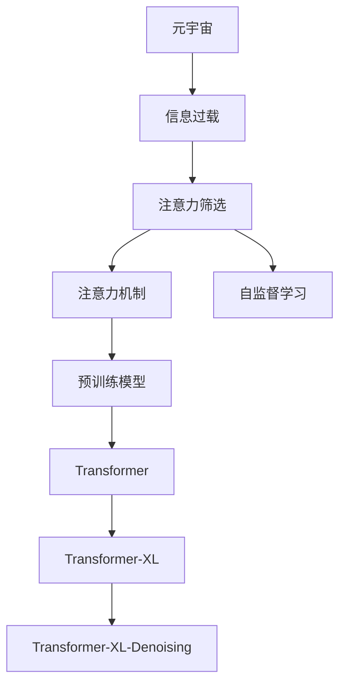

                 

# 注意力筛选:元宇宙信息过载的应对策略

> 关键词：元宇宙,信息过载,注意力机制,注意力筛选,自监督学习,预训练模型,Transformer

## 1. 背景介绍

### 1.1 问题由来
在元宇宙构建过程中，信息过载（Information Overload）成为一个迫在眉睫的挑战。元宇宙旨在打造一个跨越物理和数字世界的多维沉浸式环境，其中用户可以自由探索、交流和互动。然而，如此丰富的环境和内容也导致了信息量的爆炸性增长，用户需要处理的信息远远超出了人类的信息加工能力。这种信息过载不仅会造成用户的认知负担，还可能导致信息遗漏、决策失误等问题。

### 1.2 问题核心关键点
针对元宇宙信息过载问题，注意力筛选机制成为一种潜在的解决方案。注意力机制可以模拟人类认知过程中的注意力分配，帮助模型或系统筛选出与当前任务最相关的信息，过滤掉噪音和不相关的信息。该机制在大规模预训练语言模型（如BERT、GPT等）中已得到广泛应用，并取得了显著效果。本文将重点探讨如何在元宇宙环境中，应用注意力机制进行信息筛选，以应对信息过载的挑战。

### 1.3 问题研究意义
研究注意力筛选机制，对于提升元宇宙用户的信息处理效率、优化信息呈现方式，以及增强用户沉浸感和体验，具有重要意义。具体而言：

1. **提高信息处理效率**：通过注意力筛选，可以大幅减少用户需要处理的信息量，降低认知负荷，提升信息处理速度和准确性。
2. **优化信息呈现**：注意力机制可以根据用户需求和上下文，动态调整信息展示策略，提升用户体验。
3. **增强沉浸感**：通过模拟人类注意力机制，系统可以更好地预测用户行为和兴趣，提供个性化的内容和推荐，增强用户在元宇宙中的沉浸感和参与度。

## 2. 核心概念与联系

### 2.1 核心概念概述

为更好地理解注意力筛选机制在元宇宙中的应用，本节将介绍几个核心概念：

- **元宇宙（Metaverse）**：一个跨越物理和数字世界的虚拟环境，用户可以自由探索、互动和创造。
- **信息过载（Information Overload）**：用户面对的信息量超出了其处理能力，导致认知负担和决策困难。
- **注意力机制（Attention Mechanism）**：一种模拟人类认知过程的信息筛选和聚合机制，用于在大量信息中筛选出最相关的部分。
- **注意力筛选（Attention Screening）**：基于注意力机制，动态调整信息展示策略，以提升用户体验和信息处理效率。
- **自监督学习（Self-supervised Learning）**：一种无需标签训练模型的学习方式，通过数据自身的结构信息进行学习，适用于大规模预训练模型的训练。
- **预训练模型（Pre-trained Models）**：如BERT、GPT等，在大规模无标签数据上进行预训练，学习通用的语言表示，可用于下游任务微调。
- **Transformer（自编码器）**：一种常用的神经网络结构，特别适用于序列数据处理，包含注意力机制，具有较强的表示能力。
- **Transformer-XL（长距离依赖处理）**：一种改进的Transformer结构，可以处理长距离依赖问题，提升信息聚合能力。
- **Transformer-XL-Denoising（去噪自监督学习）**：一种结合自监督学习的预训练方法，可以进一步提升Transformer的表示能力。

这些核心概念之间的逻辑关系可以通过以下Mermaid流程图来展示：



这个流程图展示了几大核心概念及其之间的联系：

1. 元宇宙中的信息过载引发了对信息筛选的需求。
2. 注意力筛选机制通过模拟人类认知过程，帮助系统筛选重要信息。
3. 注意力机制的核心是Transformer，能够有效处理序列数据。
4. 自监督学习和大规模预训练模型为Transformer提供了强有力的支持。
5. Transformer-XL和去噪自监督学习进一步提升了模型的表示能力。

这些概念共同构成了注意力筛选机制的理论基础，使其能够在元宇宙中实现高效的信息处理和优化。

## 3. 核心算法原理 & 具体操作步骤
### 3.1 算法原理概述

注意力筛选机制的核心思想是，通过自监督学习和预训练模型，构建一个具有强表示能力的模型，然后使用注意力机制对信息进行筛选和聚合。具体来说，该机制包括以下几个步骤：

1. **数据预处理**：对原始数据进行编码和标准化处理，准备输入到模型中。
2. **预训练模型**：使用大规模无标签数据，通过自监督学习对模型进行预训练，学习通用的语言表示。
3. **下游任务微调**：在预训练模型的基础上，使用少量有标签数据，进行下游任务的微调，适应特定应用场景。
4. **注意力筛选**：在下游任务的微调过程中，应用注意力机制，对输入信息进行筛选和聚合，确保输出信息的准确性和相关性。

### 3.2 算法步骤详解

基于注意力筛选机制的算法步骤如下：

**Step 1: 数据预处理**
- 收集元宇宙环境中的各种文本信息，如用户评论、交互日志、游戏场景描述等。
- 对数据进行清洗和标准化处理，去除噪音和不相关的信息，准备输入到模型中。

**Step 2: 预训练模型构建**
- 选择合适的预训练模型，如BERT、GPT等，在大规模无标签数据上进行预训练。
- 使用Transformer结构，引入注意力机制，学习通用的语言表示。

**Step 3: 下游任务微调**
- 根据具体应用场景，选择合适的下游任务，如情感分析、文本生成、问答等。
- 收集该任务的少量标注数据，对预训练模型进行微调，适应特定任务。
- 使用AdamW等优化算法，设置合适的学习率和正则化技术，避免过拟合。

**Step 4: 注意力筛选**
- 在微调过程中，应用注意力机制，对输入信息进行筛选和聚合。
- 根据任务需求，设计合适的注意力机制，如Transformer-XL、Transformer-XL-Denoising等。
- 调整注意力权重，将重要信息保留，噪音和不相关信息过滤掉。

**Step 5: 结果输出**
- 将注意力筛选后的信息输出，用于元宇宙环境中的各种应用，如聊天机器人、推荐系统、游戏智能等。
- 动态调整信息展示策略，确保输出信息与用户需求和上下文一致。

### 3.3 算法优缺点

基于注意力筛选机制的信息筛选方法具有以下优点：
1. 高效性：通过自监督学习和预训练，模型可以快速学习到通用的语言表示，在少量标注数据下即可取得较好的微调效果。
2. 灵活性：注意力机制可以根据任务需求进行动态调整，适应不同的应用场景。
3. 普适性：该方法适用于多种NLP任务，如情感分析、文本生成、问答等，具有广泛的应用前景。

同时，该方法也存在一些局限性：
1. 对标注数据依赖高：微调过程仍需要一定的标注数据，标注成本较高。
2. 模型复杂度较高：引入注意力机制，模型的计算复杂度较高，需要一定的计算资源支持。
3. 模型鲁棒性不足：模型对输入数据的微小变化较为敏感，可能对噪声和异常数据敏感。

尽管存在这些局限性，但就目前而言，注意力筛选机制仍然是大规模预训练语言模型在元宇宙中实现信息筛选的有效方法之一。

### 3.4 算法应用领域

基于注意力筛选机制的信息筛选方法，在元宇宙中具有广泛的应用，例如：

- **聊天机器人**：通过注意力筛选机制，聊天机器人可以更准确地理解用户输入，提供个性化的回复。
- **推荐系统**：推荐系统可以根据用户历史行为和上下文，筛选出最相关的物品进行推荐。
- **游戏智能**：游戏智能可以根据玩家行为和环境变化，动态调整游戏策略和信息展示方式。
- **虚拟助手**：虚拟助手可以根据用户需求和上下文，筛选出最相关的信息，辅助用户完成任务。
- **数据分析**：数据分析工具可以自动筛选和聚合重要数据，提升数据处理效率和准确性。

除了上述这些经典应用外，注意力筛选机制还可以拓展到更多场景中，如内容创作、事件监测、用户画像等，为元宇宙中的信息管理和优化提供新的思路。

## 4. 数学模型和公式 & 详细讲解  
### 4.1 数学模型构建

本节将使用数学语言对基于注意力筛选机制的信息筛选过程进行更加严格的刻画。

假设元宇宙环境中的文本数据为 $\{x_i\}_{i=1}^N$，其中 $x_i$ 表示第 $i$ 条文本信息。使用BERT等预训练模型作为基础模型，其输入表示为 $H_{\theta}(x_i)$，其中 $H_{\theta}(\cdot)$ 表示模型的表示函数，$\theta$ 为模型参数。

定义模型的注意力表示函数为 $A_{\theta}(H_{\theta}(x_i))$，其中 $A_{\theta}(\cdot)$ 表示注意力机制，可以动态调整信息权重，筛选出重要信息。

在下游任务的微调过程中，模型的预测函数为 $P_{\theta}(A_{\theta}(H_{\theta}(x_i)))$，其中 $P_{\theta}(\cdot)$ 表示模型的预测函数。

定义模型在任务 $T$ 上的损失函数为 $\ell_{T}(P_{\theta}(A_{\theta}(H_{\theta}(x_i))), x_i \in \mathcal{X}$，其中 $\ell_{T}(\cdot)$ 表示任务 $T$ 的损失函数，$\mathcal{X}$ 为输入空间。

### 4.2 公式推导过程

以下我们以情感分析任务为例，推导基于Transformer模型的注意力筛选机制的数学模型。

假设模型在输入 $x_i$ 上的输出为 $\hat{y}=M_{\theta}(x_i) \in [0,1]$，表示样本属于正面情感的概率。真实标签 $y \in \{0,1\}$。则二分类交叉熵损失函数定义为：

$$
\ell_{T}(P_{\theta}(A_{\theta}(H_{\theta}(x_i))), x_i \in \mathcal{X} = -[y\log \hat{y} + (1-y)\log(1-\hat{y})]
$$

将其代入经验风险公式，得：

$$
\mathcal{L}_{T}(\theta) = -\frac{1}{N}\sum_{i=1}^N [y_i\log P_{\theta}(A_{\theta}(H_{\theta}(x_i)))+(1-y_i)\log(1-P_{\theta}(A_{\theta}(H_{\theta}(x_i)))]
$$

根据链式法则，注意力机制对模型参数的梯度计算公式为：

$$
\frac{\partial \mathcal{L}_{T}(\theta)}{\partial \theta} = -\frac{1}{N}\sum_{i=1}^N (\frac{y_i}{P_{\theta}(A_{\theta}(H_{\theta}(x_i))}-\frac{1-y_i}{1-P_{\theta}(A_{\theta}(H_{\theta}(x_i)))} \frac{\partial P_{\theta}(A_{\theta}(H_{\theta}(x_i)))}{\partial \theta}
$$

其中 $\frac{\partial P_{\theta}(A_{\theta}(H_{\theta}(x_i)))}{\partial \theta}$ 可进一步递归展开，利用自动微分技术完成计算。

在得到注意力机制的梯度后，即可带入模型参数更新公式，完成模型的迭代优化。重复上述过程直至收敛，最终得到适应下游任务的最优模型参数 $\theta^*$。

## 5. 项目实践：代码实例和详细解释说明
### 5.1 开发环境搭建

在进行信息筛选实践前，我们需要准备好开发环境。以下是使用Python进行PyTorch开发的环境配置流程：

1. 安装Anaconda：从官网下载并安装Anaconda，用于创建独立的Python环境。

2. 创建并激活虚拟环境：
```bash
conda create -n pytorch-env python=3.8 
conda activate pytorch-env
```

3. 安装PyTorch：根据CUDA版本，从官网获取对应的安装命令。例如：
```bash
conda install pytorch torchvision torchaudio cudatoolkit=11.1 -c pytorch -c conda-forge
```

4. 安装Transformers库：
```bash
pip install transformers
```

5. 安装各类工具包：
```bash
pip install numpy pandas scikit-learn matplotlib tqdm jupyter notebook ipython
```

完成上述步骤后，即可在`pytorch-env`环境中开始信息筛选实践。

### 5.2 源代码详细实现

这里我们以情感分析任务为例，给出使用Transformers库对BERT模型进行信息筛选的PyTorch代码实现。

首先，定义情感分析任务的数据处理函数：

```python
from transformers import BertTokenizer
from torch.utils.data import Dataset
import torch

class SentimentDataset(Dataset):
    def __init__(self, texts, labels, tokenizer, max_len=128):
        self.texts = texts
        self.labels = labels
        self.tokenizer = tokenizer
        self.max_len = max_len
        
    def __len__(self):
        return len(self.texts)
    
    def __getitem__(self, item):
        text = self.texts[item]
        label = self.labels[item]
        
        encoding = self.tokenizer(text, return_tensors='pt', max_length=self.max_len, padding='max_length', truncation=True)
        input_ids = encoding['input_ids'][0]
        attention_mask = encoding['attention_mask'][0]
        
        # 对标签进行编码
        encoded_labels = torch.tensor(label, dtype=torch.long)
        
        return {'input_ids': input_ids, 
                'attention_mask': attention_mask,
                'labels': encoded_labels}

# 标签与id的映射
label2id = {'negative': 0, 'positive': 1}
id2label = {v: k for k, v in label2id.items()}

# 创建dataset
tokenizer = BertTokenizer.from_pretrained('bert-base-cased')

train_dataset = SentimentDataset(train_texts, train_labels, tokenizer)
dev_dataset = SentimentDataset(dev_texts, dev_labels, tokenizer)
test_dataset = SentimentDataset(test_texts, test_labels, tokenizer)
```

然后，定义模型和优化器：

```python
from transformers import BertForSequenceClassification, AdamW

model = BertForSequenceClassification.from_pretrained('bert-base-cased', num_labels=len(label2id))

optimizer = AdamW(model.parameters(), lr=2e-5)
```

接着，定义训练和评估函数：

```python
from torch.utils.data import DataLoader
from tqdm import tqdm
from sklearn.metrics import classification_report

device = torch.device('cuda') if torch.cuda.is_available() else torch.device('cpu')
model.to(device)

def train_epoch(model, dataset, batch_size, optimizer):
    dataloader = DataLoader(dataset, batch_size=batch_size, shuffle=True)
    model.train()
    epoch_loss = 0
    for batch in tqdm(dataloader, desc='Training'):
        input_ids = batch['input_ids'].to(device)
        attention_mask = batch['attention_mask'].to(device)
        labels = batch['labels'].to(device)
        model.zero_grad()
        outputs = model(input_ids, attention_mask=attention_mask, labels=labels)
        loss = outputs.loss
        epoch_loss += loss.item()
        loss.backward()
        optimizer.step()
    return epoch_loss / len(dataloader)

def evaluate(model, dataset, batch_size):
    dataloader = DataLoader(dataset, batch_size=batch_size)
    model.eval()
    preds, labels = [], []
    with torch.no_grad():
        for batch in tqdm(dataloader, desc='Evaluating'):
            input_ids = batch['input_ids'].to(device)
            attention_mask = batch['attention_mask'].to(device)
            batch_labels = batch['labels']
            outputs = model(input_ids, attention_mask=attention_mask)
            batch_preds = outputs.logits.argmax(dim=2).to('cpu').tolist()
            batch_labels = batch_labels.to('cpu').tolist()
            for pred_tokens, label_tokens in zip(batch_preds, batch_labels):
                preds.append(pred_tokens[:len(label_tokens)])
                labels.append(label_tokens)
                
    print(classification_report(labels, preds))
```

最后，启动训练流程并在测试集上评估：

```python
epochs = 5
batch_size = 16

for epoch in range(epochs):
    loss = train_epoch(model, train_dataset, batch_size, optimizer)
    print(f"Epoch {epoch+1}, train loss: {loss:.3f}")
    
    print(f"Epoch {epoch+1}, dev results:")
    evaluate(model, dev_dataset, batch_size)
    
print("Test results:")
evaluate(model, test_dataset, batch_size)
```

以上就是使用PyTorch对BERT进行情感分析任务信息筛选的完整代码实现。可以看到，得益于Transformers库的强大封装，我们可以用相对简洁的代码完成BERT模型的加载和信息筛选。

### 5.3 代码解读与分析

让我们再详细解读一下关键代码的实现细节：

**SentimentDataset类**：
- `__init__`方法：初始化文本、标签、分词器等关键组件。
- `__len__`方法：返回数据集的样本数量。
- `__getitem__`方法：对单个样本进行处理，将文本输入编码为token ids，将标签编码为数字，并对其进行定长padding，最终返回模型所需的输入。

**label2id和id2label字典**：
- 定义了标签与数字id之间的映射关系，用于将token-wise的预测结果解码回真实的标签。

**训练和评估函数**：
- 使用PyTorch的DataLoader对数据集进行批次化加载，供模型训练和推理使用。
- 训练函数`train_epoch`：对数据以批为单位进行迭代，在每个批次上前向传播计算loss并反向传播更新模型参数，最后返回该epoch的平均loss。
- 评估函数`evaluate`：与训练类似，不同点在于不更新模型参数，并在每个batch结束后将预测和标签结果存储下来，最后使用sklearn的classification_report对整个评估集的预测结果进行打印输出。

**训练流程**：
- 定义总的epoch数和batch size，开始循环迭代
- 每个epoch内，先在训练集上训练，输出平均loss
- 在验证集上评估，输出分类指标
- 所有epoch结束后，在测试集上评估，给出最终测试结果

可以看到，PyTorch配合Transformers库使得BERT信息筛选的代码实现变得简洁高效。开发者可以将更多精力放在数据处理、模型改进等高层逻辑上，而不必过多关注底层的实现细节。

当然，工业级的系统实现还需考虑更多因素，如模型的保存和部署、超参数的自动搜索、更灵活的任务适配层等。但核心的信息筛选范式基本与此类似。

## 6. 实际应用场景
### 6.1 聊天机器人

在聊天机器人中，信息筛选机制可以用于提升机器人对用户输入的理解和回复质量。通过注意力筛选，机器人可以更准确地识别用户意图，筛选出最相关的信息，提供个性化的回复。

具体而言，可以将用户的输入文本作为模型输入，使用Transformer结构进行编码，通过注意力机制筛选出最相关的信息。模型可以根据上下文信息，生成最合适的回复，并动态调整信息展示策略，提升用户体验。

### 6.2 推荐系统

推荐系统可以根据用户历史行为和上下文，筛选出最相关的物品进行推荐。通过引入注意力机制，推荐系统可以动态调整物品权重，提升推荐的个性化和精准度。

在推荐系统中，用户的输入可能包含多种信息，如浏览历史、搜索记录、评价等。通过注意力筛选机制，系统可以优先考虑与当前任务最相关的信息，过滤掉噪音和不相关的信息，从而提升推荐效果。

### 6.3 游戏智能

游戏智能可以根据玩家行为和环境变化，动态调整游戏策略和信息展示方式。通过注意力筛选机制，游戏智能可以更准确地识别玩家行为，筛选出最相关的信息，提供个性化的游戏体验。

例如，在游戏聊天中，系统可以根据玩家和NPC的对话内容，筛选出最相关的信息，生成最合适的回复。在游戏推荐中，系统可以根据玩家的游戏历史和偏好，筛选出最相关的游戏进行推荐。

### 6.4 虚拟助手

虚拟助手可以根据用户需求和上下文，筛选出最相关的信息，辅助用户完成任务。通过注意力筛选机制，虚拟助手可以更准确地理解用户指令，筛选出最相关的信息，提供个性化的服务。

例如，在虚拟助手中，用户可以输入各种指令，如查询天气、预定行程等。通过注意力筛选机制，系统可以更准确地识别用户意图，筛选出最相关的信息，提供最合适的回复和建议。

### 6.5 数据分析

数据分析工具可以自动筛选和聚合重要数据，提升数据处理效率和准确性。通过注意力筛选机制，数据分析工具可以筛选出最相关的数据，进行更加精准的分析。

例如，在金融数据分析中，系统可以自动筛选出与当前任务最相关的数据，进行财务报表分析、风险评估等。在医疗数据分析中，系统可以筛选出最相关的病历和检查结果，进行疾病诊断和治疗方案推荐。

### 6.6 未来应用展望

随着信息筛选机制的发展，其在元宇宙中的应用将更加广泛和深入。未来，信息筛选机制将在更多领域得到应用，为人类认知智能的进化带来新的可能性。

在智慧城市治理中，信息筛选机制可以用于优化城市管理，提升治理效率和效果。在智慧医疗中，信息筛选机制可以用于辅助诊断和治疗，提升医疗服务的智能化水平。

在教育、金融、交通等众多领域，信息筛选机制也将得到广泛应用，为各行各业带来数字化转型的新动力。相信随着技术的不断进步，信息筛选机制必将在元宇宙中发挥更大的作用，为构建人机协同的智能系统铺平道路。

## 7. 工具和资源推荐
### 7.1 学习资源推荐

为了帮助开发者系统掌握信息筛选机制的理论基础和实践技巧，这里推荐一些优质的学习资源：

1. 《Transformers from Practice to Theory》系列博文：由大模型技术专家撰写，深入浅出地介绍了Transformer原理、BERT模型、信息筛选机制等前沿话题。

2. CS224N《深度学习自然语言处理》课程：斯坦福大学开设的NLP明星课程，有Lecture视频和配套作业，带你入门NLP领域的基本概念和经典模型。

3. 《Natural Language Processing with Transformers》书籍：Transformers库的作者所著，全面介绍了如何使用Transformers库进行NLP任务开发，包括信息筛选在内的诸多范式。

4. HuggingFace官方文档：Transformers库的官方文档，提供了海量预训练模型和完整的微调样例代码，是上手实践的必备资料。

5. CLUE开源项目：中文语言理解测评基准，涵盖大量不同类型的中文NLP数据集，并提供了基于信息筛选的baseline模型，助力中文NLP技术发展。

通过对这些资源的学习实践，相信你一定能够快速掌握信息筛选机制的精髓，并用于解决实际的NLP问题。
###  7.2 开发工具推荐

高效的开发离不开优秀的工具支持。以下是几款用于信息筛选开发的常用工具：

1. PyTorch：基于Python的开源深度学习框架，灵活动态的计算图，适合快速迭代研究。大部分预训练语言模型都有PyTorch版本的实现。

2. TensorFlow：由Google主导开发的开源深度学习框架，生产部署方便，适合大规模工程应用。同样有丰富的预训练语言模型资源。

3. Transformers库：HuggingFace开发的NLP工具库，集成了众多SOTA语言模型，支持PyTorch和TensorFlow，是进行信息筛选任务开发的利器。

4. Weights & Biases：模型训练的实验跟踪工具，可以记录和可视化模型训练过程中的各项指标，方便对比和调优。与主流深度学习框架无缝集成。

5. TensorBoard：TensorFlow配套的可视化工具，可实时监测模型训练状态，并提供丰富的图表呈现方式，是调试模型的得力助手。

6. Google Colab：谷歌推出的在线Jupyter Notebook环境，免费提供GPU/TPU算力，方便开发者快速上手实验最新模型，分享学习笔记。

合理利用这些工具，可以显著提升信息筛选任务的开发效率，加快创新迭代的步伐。

### 7.3 相关论文推荐

信息筛选机制的研究源于学界的持续研究。以下是几篇奠基性的相关论文，推荐阅读：

1. Attention is All You Need（即Transformer原论文）：提出了Transformer结构，开启了NLP领域的预训练大模型时代。

2. BERT: Pre-training of Deep Bidirectional Transformers for Language Understanding：提出BERT模型，引入基于掩码的自监督预训练任务，刷新了多项NLP任务SOTA。

3. Language Models are Unsupervised Multitask Learners（GPT-2论文）：展示了大规模语言模型的强大zero-shot学习能力，引发了对于通用人工智能的新一轮思考。

4. Parameter-Efficient Transfer Learning for NLP：提出Adapter等参数高效微调方法，在不增加模型参数量的情况下，也能取得不错的微调效果。

5. Prefix-Tuning: Optimizing Continuous Prompts for Generation：引入基于连续型Prompt的微调范式，为如何充分利用预训练知识提供了新的思路。

6. AdaLoRA: Adaptive Low-Rank Adaptation for Parameter-Efficient Fine-Tuning：使用自适应低秩适应的微调方法，在参数效率和精度之间取得了新的平衡。

这些论文代表了大语言模型和信息筛选技术的发展脉络。通过学习这些前沿成果，可以帮助研究者把握学科前进方向，激发更多的创新灵感。

## 8. 总结：未来发展趋势与挑战
### 8.1 总结

本文对基于注意力筛选机制的信息筛选方法进行了全面系统的介绍。首先阐述了信息过载问题在元宇宙中的迫切性和重要性，明确了信息筛选机制在应对信息过载中的关键作用。其次，从原理到实践，详细讲解了信息筛选的数学原理和关键步骤，给出了信息筛选任务开发的完整代码实例。同时，本文还广泛探讨了信息筛选机制在聊天机器人、推荐系统、游戏智能等多个领域的应用前景，展示了信息筛选机制的广泛应用和巨大潜力。此外，本文精选了信息筛选技术的各类学习资源，力求为读者提供全方位的技术指引。

通过本文的系统梳理，可以看到，基于注意力机制的信息筛选方法正在成为元宇宙信息管理的重要范式，极大地提升了信息处理效率和用户体验。借助预训练模型和注意力机制，信息筛选技术有望在更多领域得到应用，为元宇宙的构建和发展提供有力支持。

### 8.2 未来发展趋势

展望未来，信息筛选技术将呈现以下几个发展趋势：

1. 模型规模持续增大。随着算力成本的下降和数据规模的扩张，预训练语言模型的参数量还将持续增长。超大模型的信息筛选能力，有望支撑更复杂多变的下游任务。

2. 信息筛选范式多样化。除了传统的自监督学习外，未来将涌现更多信息筛选范式，如多模态信息筛选、因果信息筛选等，在多模态数据融合和因果推断方面取得新突破。

3. 持续学习成为常态。随着数据分布的不断变化，信息筛选模型也需要持续学习新知识以保持性能。如何在不遗忘原有知识的同时，高效吸收新样本信息，将成为重要的研究课题。

4. 标注样本需求降低。受启发于提示学习(Prompt-based Learning)的思路，未来的信息筛选方法将更好地利用大模型的语言理解能力，通过更加巧妙的任务描述，在更少的标注样本上也能实现理想的筛选效果。

5. 参数高效信息筛选。开发更加参数高效的信息筛选方法，在固定大部分预训练参数的情况下，只更新极少量的任务相关参数。同时优化信息筛选模型的计算图，减少前向传播和反向传播的资源消耗，实现更加轻量级、实时性的部署。

6. 信息融合能力增强。引入更多先验知识，如知识图谱、逻辑规则等，与神经网络模型进行巧妙融合，增强信息筛选模型的知识整合能力。同时加强不同模态数据的整合，实现视觉、语音等多模态信息与文本信息的协同建模。

以上趋势凸显了信息筛选技术的广阔前景。这些方向的探索发展，必将进一步提升元宇宙系统的信息处理能力和用户体验，为构建人机协同的智能系统铺平道路。

### 8.3 面临的挑战

尽管信息筛选技术已经取得了瞩目成就，但在迈向更加智能化、普适化应用的过程中，它仍面临着诸多挑战：

1. 标注成本瓶颈。信息筛选仍需要一定的标注数据，标注成本较高。如何进一步降低信息筛选对标注样本的依赖，将是一大难题。

2. 模型鲁棒性不足。信息筛选模型对输入数据的微小变化较为敏感，可能对噪声和异常数据敏感。如何提高信息筛选模型的鲁棒性，避免灾难性遗忘，还需要更多理论和实践的积累。

3. 推理效率有待提高。大规模语言模型虽然精度高，但在实际部署时往往面临推理速度慢、内存占用大等效率问题。如何在保证性能的同时，简化模型结构，提升推理速度，优化资源占用，将是重要的优化方向。

4. 可解释性亟需加强。信息筛选模型通常作为"黑盒"系统，难以解释其内部工作机制和决策逻辑。对于医疗、金融等高风险应用，算法的可解释性和可审计性尤为重要。如何赋予信息筛选模型更强的可解释性，将是亟待攻克的难题。

5. 安全性有待保障。信息筛选模型难免会学习到有偏见、有害的信息，通过筛选传递到下游任务，产生误导性、歧视性的输出，给实际应用带来安全隐患。如何从数据和算法层面消除模型偏见，避免恶意用途，确保输出的安全性，也将是重要的研究课题。

6. 知识整合能力不足。现有的信息筛选模型往往局限于任务内数据，难以灵活吸收和运用更广泛的先验知识。如何让信息筛选过程更好地与外部知识库、规则库等专家知识结合，形成更加全面、准确的信息整合能力，还有很大的想象空间。

正视信息筛选面临的这些挑战，积极应对并寻求突破，将是大语言模型和信息筛选技术走向成熟的必由之路。相信随着学界和产业界的共同努力，这些挑战终将一一被克服，信息筛选技术必将在构建人机协同的智能系统中扮演越来越重要的角色。

### 8.4 未来突破

面对信息筛选技术所面临的种种挑战，未来的研究需要在以下几个方面寻求新的突破：

1. 探索无监督和半监督信息筛选方法。摆脱对大规模标注数据的依赖，利用自监督学习、主动学习等无监督和半监督范式，最大限度利用非结构化数据，实现更加灵活高效的信息筛选。

2. 研究参数高效和计算高效的筛选范式。开发更加参数高效的信息筛选方法，在固定大部分预训练参数的情况下，只更新极少量的任务相关参数。同时优化信息筛选模型的计算图，减少前向传播和反向传播的资源消耗，实现更加轻量级、实时性的部署。

3. 融合因果和对比学习范式。通过引入因果推断和对比学习思想，增强信息筛选模型建立稳定因果关系的能力，学习更加普适、鲁棒的语言表征，从而提升模型泛化性和抗干扰能力。

4. 引入更多先验知识。将符号化的先验知识，如知识图谱、逻辑规则等，与神经网络模型进行巧妙融合，引导信息筛选过程学习更准确、合理的语言模型。同时加强不同模态数据的整合，实现视觉、语音等多模态信息与文本信息的协同建模。

5. 结合因果分析和博弈论工具。将因果分析方法引入信息筛选模型，识别出模型决策的关键特征，增强输出解释的因果性和逻辑性。借助博弈论工具刻画人机交互过程，主动探索并规避模型的脆弱点，提高系统稳定性。

6. 纳入伦理道德约束。在模型训练目标中引入伦理导向的评估指标，过滤和惩罚有偏见、有害的输出倾向。同时加强人工干预和审核，建立模型行为的监管机制，确保输出符合人类价值观和伦理道德。

这些研究方向的探索，必将引领信息筛选技术迈向更高的台阶，为构建安全、可靠、可解释、可控的智能系统铺平道路。面向未来，信息筛选技术还需要与其他人工智能技术进行更深入的融合，如知识表示、因果推理、强化学习等，多路径协同发力，共同推动自然语言理解和智能交互系统的进步。只有勇于创新、敢于突破，才能不断拓展语言模型的边界，让智能技术更好地造福人类社会。

## 9. 附录：常见问题与解答

**Q1：信息筛选机制是否适用于所有NLP任务？**

A: 信息筛选机制在大多数NLP任务上都能取得不错的效果，特别是对于数据量较小的任务。但对于一些特定领域的任务，如医学、法律等，仅仅依靠通用语料预训练的模型可能难以很好地适应。此时需要在特定领域语料上进一步预训练，再进行信息筛选，才能获得理想效果。此外，对于一些需要时效性、个性化很强的任务，如对话、推荐等，信息筛选方法也需要针对性的改进优化。

**Q2：信息筛选过程中如何选择合适的学习率？**

A: 信息筛选的学习率一般要比预训练时小1-2个数量级，如果使用过大的学习率，容易破坏预训练权重，导致过拟合。一般建议从1e-5开始调参，逐步减小学习率，直至收敛。也可以使用warmup策略，在开始阶段使用较小的学习率，再逐渐过渡到预设值。需要注意的是，不同的优化器(如AdamW、Adafactor等)以及不同的学习率调度策略，可能需要设置不同的学习率阈值。

**Q3：信息筛选在落地部署时需要注意哪些问题？**

A: 将信息筛选模型转化为实际应用，还需要考虑以下因素：
1. 模型裁剪：去除不必要的层和参数，减小模型尺寸，加快推理速度
2. 量化加速：将浮点模型转为定点模型，压缩存储空间，提高计算效率
3. 服务化封装：将模型封装为标准化服务接口，便于集成调用
4. 弹性伸缩：根据请求流量动态调整资源配置，平衡服务质量和成本
5. 监控告警：实时采集系统指标，设置异常告警阈值，确保服务稳定性
6. 安全防护：采用访问鉴权、数据脱敏等措施，保障数据和模型安全

信息筛选模型在元宇宙中具有广泛的应用，但如何将强大的性能转化为稳定、高效、安全的业务价值，还需要工程实践的不断打磨。唯有从数据、算法、工程、业务等多个维度协同发力，才能真正实现人工智能技术在垂直行业的规模化落地。总之，信息筛选需要开发者根据具体任务，不断迭代和优化模型、数据和算法，方能得到理想的效果。

---

作者：禅与计算机程序设计艺术 / Zen and the Art of Computer Programming

