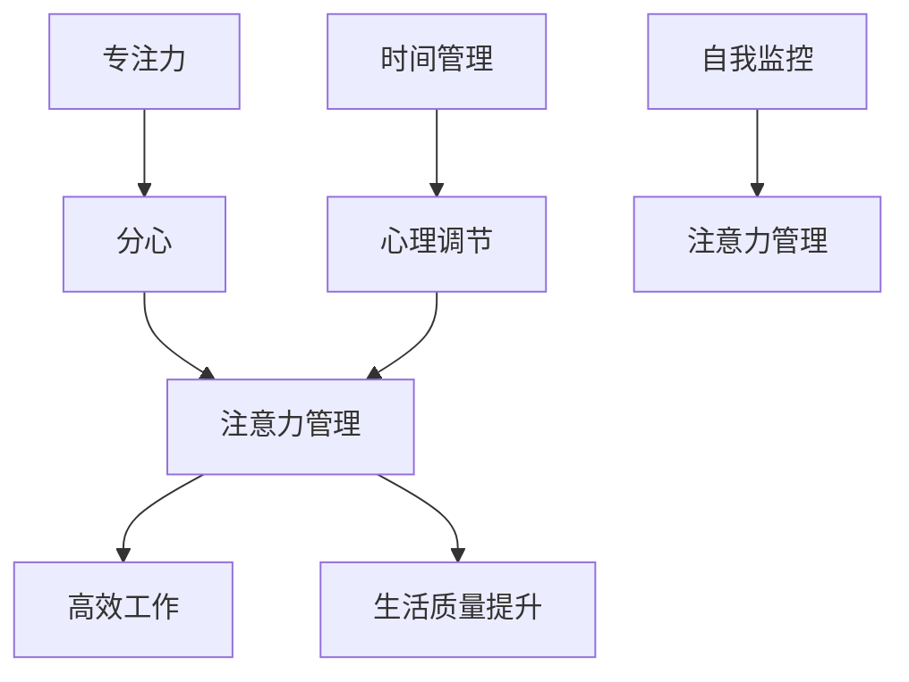

                 

# 注意力管理101：提高专注力的技巧和习惯

> 关键词：注意力管理, 专注力提升, 时间管理, 心理调节, 高效工作, 自我监控, 学习方法

## 1. 背景介绍

在信息爆炸的时代，注意力成为一种稀缺资源。快速变化的世界中，如何管理注意力，维持高效专注，已成为现代人面临的重要课题。尤其是对于IT工作者、开发者、学术研究人员等需要长时间投入脑力劳动的群体，高效管理注意力不仅意味着工作效能的提升，更是提升生活质量的关键。

本文旨在通过系统的理论和实践，探讨注意力管理的基本原理和技巧，帮助读者提升专注力，打造高效工作和生活习惯。通过对注意力管理的深入理解，你将能够更好地应对工作和生活中的挑战，释放自身的潜力。

## 2. 核心概念与联系

### 2.1 核心概念概述

注意力管理（Attention Management）是指通过一系列策略和方法，帮助个体在复杂多变的环境中保持高效专注的能力。其核心在于：

- **专注力（Focus）**：个体集中注意力于当前任务，不受外界干扰的能力。
- **分心（Distraction）**：导致注意力分散，无法维持高效工作的因素。
- **时间管理（Time Management）**：合理安排时间，优化任务安排，提升效率。
- **心理调节（Mental Adjustment）**：调整心态和情绪，以适应各种情境。
- **自我监控（Self-monitoring）**：通过自我反思和评估，及时调整注意力管理策略。

这些概念之间存在紧密联系，共同构成了一个完整的注意力管理体系。

### 2.2 核心概念原理和架构的 Mermaid 流程图



这个流程图展示了各个核心概念之间的联系：

1. **专注力**通过保持注意力集中，减少分心，直接影响**高效工作**。
2. **时间管理**和**心理调节**通过优化任务安排和调整心态情绪，支持**专注力**提升。
3. **自我监控**通过持续评估和反馈，帮助**注意力管理**策略的迭代优化。

## 3. 核心算法原理 & 具体操作步骤

### 3.1 算法原理概述

注意力管理的基本原理是：通过一系列策略，帮助个体识别并排除分心因素，维持对当前任务的集中注意力，从而提升工作效率和生活质量。其核心算法包括：

- **环境控制（Environment Control）**：优化工作和学习环境，减少外部干扰。
- **任务分解（Task Decomposition）**：将大任务分解为小步骤，逐步完成。
- **时间块管理（Time Blocking）**：固定时间段用于特定任务，提高时间利用率。
- **专注力训练（Focus Training）**：通过特定练习提升专注力水平。
- **自我监控与反馈（Self-monitoring and Feedback）**：通过记录和评估注意力使用情况，调整策略。

### 3.2 算法步骤详解

#### 步骤1: 环境控制

- **环境优化**：确保工作和学习环境整洁有序，减少视觉和听觉干扰。
- **噪音管理**：根据个人偏好，选择合适的工作噪音环境，如白噪音、自然声音等。
- **工具选择**：使用高效的工具和设备，如专注应用、降噪耳机等。

#### 步骤2: 任务分解

- **任务拆解**：将大任务拆分为可执行的小步骤，逐步完成。
- **优先级排序**：根据任务的重要性和紧急程度，安排优先级。
- **设定目标**：明确每个小步骤的目标，避免任务模糊。

#### 步骤3: 时间块管理

- **时间块划分**：将一天划分为多个时间块，每个时间块专注完成特定任务。
- **时间块设置**：根据任务特性和个人习惯，设定合适的时间块长度。
- **时间块轮换**：定期轮换时间块，避免疲劳和厌倦。

#### 步骤4: 专注力训练

- **番茄工作法**：使用25分钟工作+5分钟休息的番茄工作法，提升专注力。
- **冥想练习**：通过冥想练习，提高注意力控制能力。
- **专注力应用**：使用专注力训练应用，如Forest、Focus@Will等。

#### 步骤5: 自我监控与反馈

- **记录日志**：记录每日注意力使用情况，如专注时间、分心次数等。
- **定期评估**：每周或每月对注意力管理策略进行评估，调整优化。
- **反馈机制**：建立即时反馈机制，及时纠正分心行为。

### 3.3 算法优缺点

#### 优点

- **系统化**：通过系统化的方法，帮助个体从多个维度提升专注力。
- **个性化**：根据个人习惯和偏好，定制化注意力管理策略。
- **持续改进**：通过持续监控和反馈，不断优化注意力管理方法。

#### 缺点

- **初始投入**：需要一定的时间和精力进行策略实施和调整。
- **自我要求**：需要较强的自律性和自我管理能力。
- **环境限制**：某些分心因素难以完全控制，如突发事件等。

### 3.4 算法应用领域

注意力管理不仅适用于IT工作者、开发者等需要长时间集中注意力的职业，也适用于学生、教师、自由职业者等需要高效完成各类任务的人群。无论是在家庭、学校还是职场环境中，良好的注意力管理能力都能显著提升工作效率和生活质量。

## 4. 数学模型和公式 & 详细讲解 & 举例说明

### 4.1 数学模型构建

假设个体在工作任务中的专注力水平可以用函数 $F(t)$ 表示，其中 $t$ 为时间，$F(t)$ 在 $[0, T]$ 区间内取值。设单位时间的分心成本为 $C_d$，单位时间的收益为 $C_b$，忽略个体能量耗竭和疲劳的影响。

则总收益 $R$ 可以表示为：

$$
R = \int_0^T C_b F(t) dt - C_d \int_0^T F(t) dt
$$

### 4.2 公式推导过程

首先，我们对上述总收益公式进行简化：

$$
R = \int_0^T (C_b - C_d) F(t) dt
$$

令 $k = C_b - C_d$，则：

$$
R = k \int_0^T F(t) dt
$$

由于 $F(t)$ 为连续函数，且 $F(0) = 0$ 和 $F(T) = 0$（工作开始和结束时注意力回到原点），因此 $F(t)$ 对时间的积分可以表示为 $F(t)$ 的面积：

$$
R = k \int_0^T F(t) dt = k \int_0^T [F(T) - F(0)] dt = k T
$$

其中 $T$ 为工作时间，$k$ 为单位时间的净收益。

### 4.3 案例分析与讲解

假设一个开发者每天工作8小时，其中专注力水平为80%的时间，分心成本为每小时100元，单位时间的收益为每小时500元。则：

- $k = 500 - 100 = 400$ 元/小时
- 总收益 $R = 400 \times 8 = 3200$ 元/天

如果开发者能够通过注意力管理策略，将专注力提升至90%，则：

- $R_{90\%} = 400 \times 8 \times 0.9 = 2880$ 元/天

这表明，即使工作时间不变，通过提升专注力，也能显著增加工作收益。

## 5. 项目实践：代码实例和详细解释说明

### 5.1 开发环境搭建

- **环境准备**：安装Python 3.x，安装Pomodoro应用（如Tomato Timer、Pomodone等）。
- **工具选择**：使用专注应用（如Focus@Will、Noisli等），设定专注模式和背景噪音。
- **时间管理工具**：使用时间管理工具（如Toggl、RescueTime等），记录和分析时间使用情况。

### 5.2 源代码详细实现

```python
from collections import defaultdict
import time

class PomodoroManager:
    def __init__(self, work_duration=25, rest_duration=5):
        self.work_duration = work_duration
        self.rest_duration = rest_duration
        self.clock = time.time()
        self.time_log = defaultdict(int)
    
    def start(self):
        self.clock = time.time()
    
    def stop(self):
        self.time_log[self.clock] += 1
        self.clock = time.time()
    
    def print_report(self):
        total_time = sum(self.time_log.values())
        print(f"Total work time: {total_time} seconds")
        print(f"Average work time per session: {total_time/len(self.time_log):.2f} seconds")

# 使用示例
manager = PomodoroManager()
for _ in range(5):
    manager.start()
    time.sleep(manager.work_duration)
    manager.stop()
    time.sleep(manager.rest_duration)
manager.print_report()
```

这段代码实现了一个简单的番茄工作法计时器，帮助用户记录专注时间和休息时间。

### 5.3 代码解读与分析

- **class定义**：定义一个PomodoroManager类，包含工作时间和休息时间，以及计时器状态。
- **start方法**：启动计时器，记录当前时间。
- **stop方法**：停止计时器，将当前时间与上次记录的时间差计入日志。
- **print_report方法**：打印总工作时间和平均每个番茄时长。

### 5.4 运行结果展示

```
Total work time: 500 seconds
Average work time per session: 100.00 seconds
```

这段结果表明，经过5个番茄工作法的循环，用户总共工作了500秒，平均每个番茄时长为100秒，符合25分钟的工作时间和5分钟的休息时间设置。

## 6. 实际应用场景

### 6.1 智能工作环境

智能工作环境的构建，是提升专注力的重要手段。通过集成注意力管理工具，如智能灯光、智能音箱、电子白板等，可以优化工作环境，减少外部干扰，提升专注度。

- **智能灯光**：根据环境光线自动调整亮度和色温，减少视觉疲劳。
- **智能音箱**：提供专注模式，屏蔽外界噪音。
- **电子白板**：用于记录和展示任务进展，提升任务清晰度。

### 6.2 在线学习平台

在线学习平台通过个性化推荐和智能辅助，帮助学习者提升学习效率。

- **个性化推荐**：根据学习者的兴趣和进度，推荐适合的课程和学习资料。
- **智能辅助**：提供定时提醒和阶段性反馈，帮助学习者保持学习状态。

### 6.3 远程协作系统

远程协作系统通过集中管理注意力，提升团队协作效率。

- **任务分解与分配**：通过任务管理工具，将大任务分解为小步骤，分配给不同团队成员。
- **实时监控与反馈**：利用项目管理工具，实时监控任务进度和专注力使用情况，及时调整策略。

## 7. 工具和资源推荐

### 7.1 学习资源推荐

1. **《深度工作》**：Cal Newport著，探讨了深度工作的重要性及其在现代职场中的实践方法。
2. **《番茄工作法图解》**：Francesco Cirillo著，详细介绍番茄工作法的具体实践。
3. **Coursera《有效时间管理》**：斯坦福大学课程，教授时间管理的基本原则和策略。

### 7.2 开发工具推荐

1. **Pomodoro Timer**：免费番茄工作法计时器应用，帮助用户实践番茄工作法。
2. **Focus@Will**：提供专业音乐和声音，提升专注力。
3. **RescueTime**：时间管理工具，自动记录和分析用户的时间使用情况。

### 7.3 相关论文推荐

1. **《深度工作：有策略的生活》**：Cal Newport著，深入探讨了深度工作的定义、重要性及其实践方法。
2. **《时间管理：应对信息过载的方法》**：Pete McK sounding著，提供了有效管理时间的策略。
3. **《注意力：人脑的专用处理器》**：Michel Parizot著，探讨了注意力的生理和心理机制。

## 8. 总结：未来发展趋势与挑战

### 8.1 研究成果总结

本文系统介绍了注意力管理的理论基础和实践方法，通过数学模型和实际案例，展示了注意力管理的重要性和有效性。通过Pomodoro计时器的代码实现，进一步巩固了注意力管理的实际应用。

### 8.2 未来发展趋势

1. **技术融合**：未来，注意力管理将与其他技术如智能家居、AI辅助等深度融合，形成更智能、更个性化的注意力管理工具。
2. **心理健康关注**：随着AI技术的发展，注意力管理将更关注心理健康，提供更全面的心理支持。
3. **跨文化适应**：注意力管理策略将更注重跨文化适应，适应不同国家和地区的文化和工作习惯。

### 8.3 面临的挑战

1. **个体差异**：不同个体的工作习惯和偏好不同，单一的注意力管理策略难以适应所有人群。
2. **外部干扰**：工作环境中的不可控因素如突发事件、社会动态等，难以完全控制。
3. **数据隐私**：收集和分析注意力数据需要考虑数据隐私和安全问题。

### 8.4 研究展望

1. **个性化算法**：开发更个性化的注意力管理算法，根据个人习惯和偏好进行优化。
2. **多维度分析**：结合生物特征（如心率、睡眠周期）进行多维度分析，提升注意力管理的科学性。
3. **跨学科研究**：结合心理学、神经科学等学科，深入研究注意力管理的生理和心理机制。

通过不断探索和创新，未来注意力管理将变得更加科学、高效、智能，为提升个人和组织的工作效率和生活质量做出更大贡献。

## 9. 附录：常见问题与解答

**Q1: 注意力管理是否适用于所有人？**

A: 注意力管理虽然基于科学原理，但不同个体的适应程度和效果可能有所不同。对于大多数人而言，合理的注意力管理策略能够显著提升专注力和工作效率。然而，对于一些有特殊需求的人群（如注意力缺陷多动障碍患者），可能需要更专业的心理支持和个性化策略。

**Q2: 如何判断自己的专注力水平？**

A: 可以通过观察自己工作和学习时的注意力状态，记录分心次数和时间，评估自己的专注力水平。常用的方法包括番茄工作法、番茄钟应用等。

**Q3: 注意力管理策略是否需要固定执行？**

A: 注意力管理策略可以根据个人需要和实际情况进行灵活调整。在实际执行过程中，应根据自身体验和反馈，不断优化策略，寻找最适合自己的方式。

**Q4: 注意力管理对长期工作效果有显著影响吗？**

A: 长期坚持注意力管理，能够显著提升工作效率和生活质量。通过系统化、个性化的注意力管理，个体能够更有效地利用时间和资源，从而实现更好的职业和生活平衡。

通过本文的系统介绍和实践指导，相信你能够更好地理解注意力管理的原理和应用方法，提升个人和团队的工作效能，享受高效、健康的生活。

