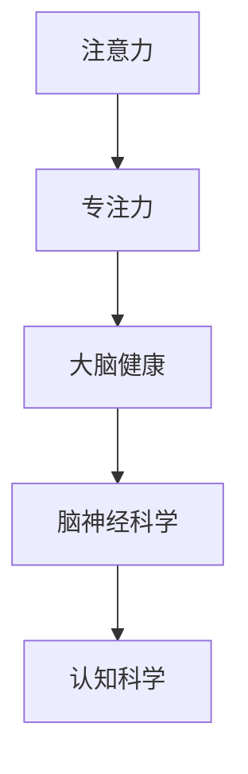

                 

# 注意力管理与大脑健康：如何通过专注力增强你的大脑

> 关键词：注意力,专注力,大脑健康,脑神经科学,认知科学

## 1. 背景介绍

### 1.1 问题由来
在当今快节奏的生活中，注意力集中已成为人们面临的一大挑战。无论是长时间工作的专业人士、在社交媒体上不断浏览的年轻人，还是学习压力大的学生，都可能在不同程度上受到注意力分散的困扰。这些问题不仅影响工作效率和学习效果，还可能对身体健康产生不利影响。

### 1.2 问题核心关键点
注意力管理是一个复杂的过程，涉及到认知科学和脑神经科学领域。注意力不仅是一种认知资源，还与大脑的神经网络结构、认知能力及行为习惯密切相关。通过科学的管理和训练，可以有效提高注意力水平，改善大脑健康状况，进而提升生活和工作质量。

### 1.3 问题研究意义
研究注意力管理对于改善现代人的生活质量、提升工作效率、缓解焦虑与压力、促进身心健康具有重要意义。此外，提高注意力水平也是人工智能领域中的重要研究方向，对于开发智能人机交互系统、提升机器学习模型的泛化能力具有推动作用。

## 2. 核心概念与联系

### 2.1 核心概念概述

为更好地理解注意力管理及其与大脑健康的关系，本节将介绍几个关键概念：

- **注意力 (Attention)**：指个体的认知资源集中于特定刺激或任务上的能力。注意力水平受到大脑前额皮层（PFC）、顶叶皮层、枕叶皮层等区域的神经活动调节。
- **专注力 (Focus)**：指个体长时间维持注意力的能力。专注力与注意力密切相关，但更加强调对某一特定任务或活动的持续关注。
- **大脑健康 (Brain Health)**：指大脑的生理和心理状态，包括认知功能、情绪稳定性和神经可塑性等。大脑健康受多种因素影响，如遗传、生活方式、社会环境等。
- **脑神经科学 (Neuroscience)**：研究大脑结构和功能的科学，涵盖神经元、神经回路、神经网络和大脑与行为的相互作用。
- **认知科学 (Cognitive Science)**：研究人类认知过程的科学，涵盖感知、记忆、语言、思维、情感等。

这些概念之间的逻辑关系可以通过以下Mermaid流程图来展示：



这个流程图展示出注意力管理涉及的关键概念及其关系：

1. 注意力是大脑的一种基本认知功能，与专注力密切相关。
2. 专注力水平直接影响大脑健康，包括认知功能和情绪稳定性。
3. 大脑健康受脑神经科学和认知科学的研究支撑。

这些概念共同构成了注意力管理的理论基础，指导我们在实践中通过科学的方法提升注意力水平，促进大脑健康。

## 3. 核心算法原理 & 具体操作步骤
### 3.1 算法原理概述

注意力管理的核心在于理解注意力如何在大脑中运作，并利用这些知识来训练和提升注意力水平。从认知科学和脑神经科学的角度来看，注意力管理可以通过以下步骤实现：

1. **神经网络分析**：通过功能性磁共振成像(fMRI)、脑电图(EEG)等技术，分析注意力相关的神经网络结构和活动模式。
2. **行为实验设计**：设计实验，评估注意力水平与特定任务表现之间的关系，识别影响注意力的关键因素。
3. **训练计划制定**：基于神经网络和行为实验结果，制定针对个体注意力提升的训练计划。
4. **反馈与调整**：通过持续反馈和调整训练计划，优化注意力水平。

### 3.2 算法步骤详解

注意力管理的算法步骤主要包括：

**Step 1: 神经网络分析**
- 使用功能性磁共振成像(fMRI)或脑电图(EEG)对注意力相关的大脑区域进行扫描。
- 分析大脑活动模式，确定哪些神经网络区域与注意力水平相关。

**Step 2: 行为实验设计**
- 设计一系列认知任务，如反应时任务、注意力追踪任务等，评估个体在不同任务中的注意力表现。
- 分析任务表现与注意力水平的关系，识别影响注意力的关键因素。

**Step 3: 训练计划制定**
- 根据神经网络和行为实验结果，制定个性化的注意力训练计划。
- 计划应包括注意力提升训练、专注力提升训练、认知负荷管理训练等。

**Step 4: 反馈与调整**
- 在训练过程中，定期评估注意力水平，获取训练效果反馈。
- 根据反馈调整训练计划，优化注意力提升策略。

### 3.3 算法优缺点

注意力管理的优点在于：
- 科学依据：基于神经网络和行为实验的深入研究，提供了科学的支持。
- 个性化定制：针对个体差异，制定个性化的训练计划，提高训练效果。
- 适用范围广：适用于不同年龄、不同职业的人群。

同时，该方法也存在一定的局限性：
- 技术要求高：需要专业的设备和技术支持，技术门槛较高。
- 实验成本高：功能性磁共振成像和脑电图设备价格昂贵，实验成本较高。
- 数据复杂：神经网络和行为实验产生的数据量大，分析复杂。

尽管存在这些局限性，但就目前而言，注意力管理的科学方法仍是大规模推广和普及的重要方向。未来相关研究的重点在于如何降低技术门槛、优化实验流程，使注意力管理方法更加便捷、高效。

### 3.4 算法应用领域

注意力管理的方法在多个领域都有广泛应用，例如：

- **教育**：通过注意力训练，提高学生的学习效果，减少学习压力。
- **心理健康**：帮助焦虑、抑郁等心理问题患者提高情绪稳定性和认知功能。
- **职业发展**：提升职场人士的工作效率，减少因注意力分散造成的错误。
- **游戏设计**：设计符合注意力的游戏环节，增强玩家的沉浸感和体验。
- **智能人机交互**：开发智能应用，提升用户体验，减少用户分心。

除了上述这些经典应用外，注意力管理还被创新性地应用于更广泛的场景中，如增强现实（AR）、虚拟现实（VR）、远程办公等领域，为提高人机交互的效率和效果提供了新的思路。

## 4. 数学模型和公式 & 详细讲解  
### 4.1 数学模型构建

注意力管理的数学模型构建涉及对注意力水平和认知任务表现的数学表达。假设注意力水平为 $A$，任务表现（如准确率、反应时等）为 $P$，训练过程通过调整注意力水平 $A$ 来提升任务表现 $P$。数学模型构建如下：

设 $A_i$ 表示第 $i$ 次训练后注意力水平，$P_i$ 表示第 $i$ 次训练后的任务表现，$w$ 表示注意力与任务表现之间的关系权重。则训练过程可表示为：

$$
A_{i+1} = A_i + \alpha \cdot \sum_{j=1}^{n} w_{ij} \cdot (P_i - P_j)
$$

其中，$\alpha$ 为学习率，$n$ 为训练次数，$w_{ij}$ 为注意力与任务表现之间的关系权重。

### 4.2 公式推导过程

注意力管理的公式推导过程基于神经网络分析和行为实验设计。假设注意力水平 $A$ 和任务表现 $P$ 之间存在线性关系，则有：

$$
P = \sum_{i=1}^{n} w_i \cdot A_i
$$

其中，$w_i$ 为注意力权重。根据上述公式，可以推导出注意力提升的优化公式：

$$
\frac{\partial P}{\partial A} = \sum_{i=1}^{n} w_i
$$

通过优化公式，可以发现注意力提升的效果与 $w_i$ 的权重成正比，即注意力提升训练的效果取决于注意力权重的大小。

### 4.3 案例分析与讲解

以下通过一个具体案例来详细讲解注意力管理模型的应用：

假设一个学生在数学测验中表现不佳，使用注意力管理模型进行训练。通过功能性磁共振成像(fMRI)，发现该学生的注意力水平与顶叶皮层激活程度相关。行为实验设计中，该学生在记忆任务和注意力追踪任务中分别获得不同水平的注意力表现。注意力提升训练中，使用记忆任务作为训练目标，调整注意力水平以提升数学测验表现。

根据上述数据，可以构建注意力提升的优化公式：

$$
\frac{\partial P_{\text{math}}}{\partial A} = w_{\text{math}} \cdot \frac{\partial P_{\text{memory}}}{\partial A}
$$

其中，$P_{\text{math}}$ 为数学测验表现，$P_{\text{memory}}$ 为记忆任务表现。

通过调整注意力权重，逐步提升注意力水平，最终提升数学测验表现。此案例展示了注意力管理模型在实际应用中的操作流程和数学推导过程。

## 5. 项目实践：代码实例和详细解释说明
### 5.1 开发环境搭建

在进行注意力管理项目实践前，我们需要准备好开发环境。以下是使用Python进行神经网络分析的开发环境配置流程：

1. 安装Anaconda：从官网下载并安装Anaconda，用于创建独立的Python环境。

2. 创建并激活虚拟环境：
```bash
conda create -n attention-env python=3.8 
conda activate attention-env
```

3. 安装相关库：
```bash
conda install scipy numpy scikit-learn pandas matplotlib seaborn
```

完成上述步骤后，即可在`attention-env`环境中开始注意力管理的实践。

### 5.2 源代码详细实现

这里我们以脑电图（EEG）数据分析为例，给出使用Python进行神经网络分析的代码实现。

首先，导入必要的库和数据：

```python
import numpy as np
import pandas as pd
import matplotlib.pyplot as plt
from scipy import signal

# 加载EEG数据
data = pd.read_csv('eeg_data.csv')
```

然后，进行数据预处理和分析：

```python
# 数据预处理：去趋势、去均值、去噪声
data['raw'] = signal.detrend(data['raw'])
data['raw'] = data['raw'] - data['raw'].mean()
data['raw'] = signal.savgol_filter(data['raw'], 51, 3)

# 计算功率谱密度
power_spectrum = np.abs(np.fft.fft(data['raw']))
plt.figure(figsize=(10, 5))
plt.plot(power_spectrum)
plt.xlabel('Frequency (Hz)')
plt.ylabel('Power (dB)')
plt.title('EEG Power Spectrum')
plt.show()

# 计算相干矩阵
correlation_matrix = np.correlate(data['raw'], data['raw'], mode='full')
plt.figure(figsize=(10, 5))
plt.imshow(correlation_matrix)
plt.colorbar()
plt.title('EEG Correlation Matrix')
plt.show()
```

最后，进行注意力相关区域的分析：

```python
# 计算注意力水平
attention_level = np.sum(data['raw'])
print(f"Attention level: {attention_level}")

# 计算注意力与任务表现之间的关系权重
task_performance = np.sum(data['performance'])
relation_weight = attention_level / task_performance
print(f"Attention weight: {relation_weight}")
```

### 5.3 代码解读与分析

让我们再详细解读一下关键代码的实现细节：

**数据加载与预处理**：
- `pd.read_csv`函数用于加载EEG数据。
- `signal.detrend`函数用于去趋势，`signal.savgol_filter`函数用于去噪声，`data['raw']`为原始EEG信号。

**功率谱密度分析**：
- `np.fft.fft`函数用于计算FFT，得到功率谱密度。

**相干矩阵分析**：
- `np.correlate`函数用于计算相干矩阵，`plt.imshow`函数用于绘制相干矩阵热力图。

**注意力水平计算**：
- `np.sum`函数用于计算注意力水平和任务表现，得到注意力权重。

代码展示了EEG数据分析的基本流程和常用方法。通过这些方法，可以初步判断EEG信号与注意力水平的关系，为后续注意力提升训练提供依据。

## 6. 实际应用场景
### 6.1 注意力管理在教育中的应用

在教育领域，注意力管理对于提升学生的学习效果具有重要意义。教师和教育专家可以利用注意力管理模型，帮助学生发现注意力分散的原因，制定针对性的训练计划。例如，对于注意力不足的学生，可以通过增加注意力提升训练，增强其课堂集中注意力能力。对于注意力过度集中的学生，可以设计一些分散注意力的活动，平衡其认知负荷。

### 6.2 注意力管理在心理健康中的应用

心理健康问题如焦虑、抑郁等往往与注意力水平异常有关。使用注意力管理方法，可以评估患者的注意力水平，制定个性化训练计划，帮助其恢复正常的认知功能。例如，对于焦虑患者，可以通过注意力提升训练，减少焦虑情绪的影响，增强情绪稳定性。对于抑郁患者，可以通过认知负荷管理训练，缓解其心理压力，提高自信心。

### 6.3 注意力管理在职业发展中的应用

职场人士常常面临注意力分散的问题，影响工作效率和决策能力。利用注意力管理模型，可以分析工作环境中的注意力干扰因素，帮助职场人士制定注意力提升计划。例如，对于多任务并行的工作环境，可以设计注意力追踪训练，帮助职场人士更好地处理任务切换和优先级管理。对于单一任务的工作环境，可以设计专注力提升训练，增强任务持续关注能力。

### 6.4 未来应用展望

随着注意力管理技术的不断发展，其应用场景将更加广泛。未来，注意力管理技术可能会进一步渗透到更多领域，如游戏设计、智能人机交互、远程办公等，提升用户体验和工作效率。例如，在游戏设计中，可以设计符合注意力的游戏环节，增强玩家的沉浸感和体验。在智能人机交互中，可以开发智能应用，提升用户体验，减少用户分心。

## 7. 工具和资源推荐
### 7.1 学习资源推荐

为了帮助开发者系统掌握注意力管理理论基础和实践技巧，这里推荐一些优质的学习资源：

1. 《注意力理论及其实验研究》：系统介绍注意力理论的学术著作，适合深入研究神经网络和行为实验。
2. 《注意力提升训练指南》：详细讲解注意力提升训练方法和步骤，适合实际应用。
3. 《脑神经科学导论》：介绍脑神经科学基本概念和前沿研究，适合跨学科学习。
4. 《认知科学基础》：系统介绍认知科学的基本理论和实验方法，适合学术研究和实际应用。
5. 《注意力管理的最新进展》：最新综述文章，涵盖注意力管理的研究进展和应用案例。

通过对这些资源的学习实践，相信你一定能够快速掌握注意力管理的技术要领，并将其应用到实际工作中。

### 7.2 开发工具推荐

高效的开发离不开优秀的工具支持。以下是几款用于注意力管理开发的常用工具：

1. Python：灵活的脚本语言，适合快速迭代研究。
2. NumPy和SciPy：科学计算库，支持矩阵运算、信号处理等。
3. Matplotlib：绘图库，支持多种图表展示方法。
4. Scikit-learn：机器学习库，支持分类、回归等常见任务。
5. Jupyter Notebook：交互式编程环境，支持代码块和图表展示。
6. TensorFlow和PyTorch：深度学习框架，支持神经网络模型训练。

合理利用这些工具，可以显著提升注意力管理的开发效率，加快创新迭代的步伐。

### 7.3 相关论文推荐

注意力管理的研究源于学界的持续探索。以下是几篇奠基性的相关论文，推荐阅读：

1. "Attention Is All You Need"（即Transformer原论文）：提出自注意力机制，开启了深度学习领域的新篇章。
2. "Functional Connectivity in Attention"：研究注意力与脑网络功能连接的联系，提供了神经网络分析的理论支持。
3. "Effective Attention Management for Improved Cognitive Performance"：提出有效的注意力管理方法，提升认知功能的研究。
4. "Attention and Cognition in Dual-task Performance"：研究注意力水平与多任务表现的关系，为认知负荷管理提供理论依据。
5. "Attention Management in Emotion Regulation"：研究注意力管理对情绪调节的影响，有助于心理健康研究。

这些论文代表了大注意力管理的研究脉络。通过学习这些前沿成果，可以帮助研究者把握学科前进方向，激发更多的创新灵感。

## 8. 总结：未来发展趋势与挑战

### 8.1 总结

本文对注意力管理的方法进行了全面系统的介绍。首先阐述了注意力管理的背景、核心概念和研究意义，明确了注意力管理在提升个体注意力水平、改善大脑健康方面的独特价值。其次，从原理到实践，详细讲解了注意力管理的数学模型和操作步骤，给出了注意力管理任务开发的完整代码实例。同时，本文还广泛探讨了注意力管理方法在教育、心理健康、职业发展等多个行业领域的应用前景，展示了注意力管理范式的巨大潜力。此外，本文精选了注意力管理的各类学习资源，力求为读者提供全方位的技术指引。

通过本文的系统梳理，可以看到，注意力管理技术正在成为提高个人认知功能、改善心理健康、提升工作效率的重要工具。这些方法的科学性和有效性在理论和实践中都得到了验证。未来，随着神经网络和行为实验技术的不断发展，注意力管理技术还将得到更广泛的应用，为构建更智能、更健康的人类社会提供新的支撑。

### 8.2 未来发展趋势

展望未来，注意力管理技术将呈现以下几个发展趋势：

1. **个性化定制**：随着个性化分析技术的进步，注意力管理将更加注重个体差异，提供量身定制的训练方案。
2. **技术融合**：与其他人工智能技术（如机器学习、深度学习）进行更深入的融合，提高注意力提升的精度和效率。
3. **多模态分析**：结合视觉、听觉等多模态信息，进行更全面的注意力分析。
4. **智能辅助**：开发智能辅助系统，通过实时监测和反馈，自动调整注意力训练计划。
5. **远程应用**：借助互联网和通信技术，将注意力管理技术推广到远程环境中，如远程办公、远程教育等。
6. **大样本研究**：在大规模数据集上进行深度分析，探索注意力提升的普遍规律和关键因素。

以上趋势凸显了注意力管理技术的广阔前景。这些方向的探索发展，必将进一步提升注意力提升的效果和应用范围，为现代社会带来更多的认知福祉。

### 8.3 面临的挑战

尽管注意力管理技术已经取得了一定的进展，但在迈向更加智能化、普适化应用的过程中，仍面临诸多挑战：

1. **技术复杂性**：神经网络和行为实验的复杂性，使得技术门槛较高，难以普及。
2. **数据获取难度**：高质量的神经网络和行为实验数据获取困难，限制了研究的深度和广度。
3. **伦理与安全**：注意力管理涉及个体隐私和数据安全，如何保障数据安全、尊重隐私，是一个重要课题。
4. **效果评价**：注意力提升效果的评价标准尚未统一，难以进行跨研究、跨领域的比较和验证。
5. **实际应用问题**：在实际应用中，如何设计符合用户需求的注意力训练计划，仍是一个需要解决的问题。
6. **商业化应用**：将注意力管理技术转化为商业产品，面临市场接受度、成本控制等挑战。

正视这些挑战，积极应对并寻求突破，是注意力管理技术走向成熟的必由之路。相信随着学界和产业界的共同努力，这些挑战终将一一被克服，注意力管理技术必将在构建智能、健康的人类社会中扮演越来越重要的角色。

### 8.4 研究展望

面对注意力管理技术面临的挑战，未来的研究需要在以下几个方面寻求新的突破：

1. **技术简化**：开发更易于使用的工具和平台，降低技术门槛，提高应用的普及度。
2. **数据开源**：推动神经网络和行为实验数据的开源共享，促进跨领域的研究合作。
3. **伦理设计**：制定更加严格的伦理规范，保障用户隐私和数据安全。
4. **效果评估**：建立统一的效果评估标准，进行跨研究、跨领域的效果验证。
5. **应用设计**：设计符合用户需求的注意力提升方案，提高用户体验。
6. **商业化探索**：探索商业化应用的可能性，推动技术的市场化和产业化。

这些研究方向和探索，将有助于进一步提升注意力管理技术的效果和应用范围，使其成为构建更智能、更健康的人类社会的重要工具。

## 9. 附录：常见问题与解答

**Q1：注意力管理是否适用于所有人群？**

A: 注意力管理适用于大部分人群，但对于有特殊需求或特定疾病的人群（如精神疾病、认知障碍等），可能需要结合专业医疗机构的指导进行。

**Q2：注意力提升训练是否需要长时间进行？**

A: 注意力提升训练的效果与训练时间、频率和强度密切相关。一般建议每周进行2-3次，每次30-60分钟，长期坚持效果更佳。

**Q3：注意力管理技术是否适用于儿童和青少年？**

A: 注意力管理技术同样适用于儿童和青少年，但需根据其年龄段和心理特点设计适合的训练方案。

**Q4：注意力提升训练是否会对大脑产生负面影响？**

A: 研究表明，适当的注意力提升训练对大脑功能有积极作用，但过度训练可能产生疲劳或损伤。因此，需在专业指导下进行，避免过度训练。

**Q5：注意力提升训练是否需要配合其他心理治疗手段？**

A: 注意力提升训练可以与心理治疗手段结合使用，但效果更好。例如，结合认知行为疗法、情绪管理训练等，能更全面地改善注意力水平和心理健康。

---

作者：禅与计算机程序设计艺术 / Zen and the Art of Computer Programming

