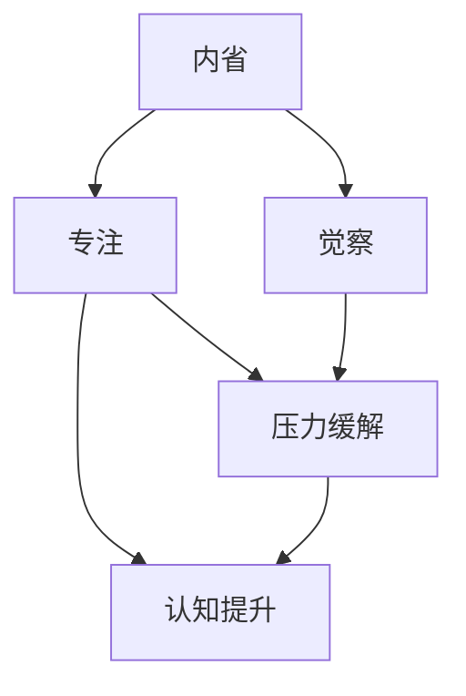

                 

# 注意力管理与正念冥想实践：如何通过内省和专注增强心灵

> 关键词：注意力管理, 正念冥想, 内省, 专注, 心理健康, 压力缓解, 认知提升

## 1. 背景介绍

### 1.1 问题由来

在现代社会，快节奏的生活和工作方式让人们常常感到压力山大，精神状态紧张，导致许多人的心理健康问题日益凸显。长时间高强度的工作、生活中的琐事、人际关系的处理等，都可能让人陷入焦虑、抑郁、失眠等困境。为了应对这些挑战，许多人开始转向传统的心理疗愈方式，如正念冥想(Mindfulness Meditation)，以期通过内省和专注提升心灵状态。

### 1.2 问题核心关键点

正念冥想的核心在于“觉察当下”，通过专注于当前时刻，观察自己的思维、情绪、身体状态，增强自我意识，缓解心理压力，提升心灵品质。其核心理念是，通过反复练习，使人们可以更加冷静、理智地处理生活中的各种问题。然而，对于初次接触正念冥想的人来说，如何在日常实践中持续进行内省和专注，如何规避练习中的常见误区，如何评估和调整自己的冥想状态，都是需要认真思考和探究的问题。

### 1.3 问题研究意义

正念冥想在当前心理疗愈领域已经得到了广泛的认可和应用，被视为一种有效的压力缓解和心理健康提升手段。但如何结合现代科技，使其在更多人中推广应用，如何通过内省和专注真正达到提升心灵品质的目标，仍然需要深入的研究。本文旨在探讨注意力管理与正念冥想的核心原理，提供具体的实践步骤和技巧，以期为更多的人提供指导和帮助。

## 2. 核心概念与联系

### 2.1 核心概念概述

正念冥想与注意力管理息息相关。内省、专注、觉察等关键概念，构成了正念冥想的基石。下面将逐一解释这些核心概念：

- **内省(Introspection)**：指对自身的心理状态、情绪、思维等进行观察和反思。内省有助于提升自我认识，洞察自身的问题，从而做出更合理的决策。
- **专注(Concentration)**：指在特定时间内集中注意力，避免分散。专注有助于提升工作效率，增强决策力，缓解压力。
- **觉察(Awareness)**：指对当前时刻的全面感知，包括环境、身体、情绪等。觉察有助于提升当下体验，减少无意识的冲动行为。
- **压力缓解(Stress Relief)**：指通过特定的训练方式，缓解心理压力，提升情绪稳定性。
- **认知提升(Cognitive Enhancement)**：指通过练习增强自我认知、决策能力、问题解决能力等认知功能。

这些概念通过内省和专注，形成一套系统的心理训练方法，最终实现压力缓解和认知提升的效果。

### 2.2 核心概念原理和架构的 Mermaid 流程图



此流程图展示了大语言模型微调方法的内在联系：内省引导觉察，觉察支撑专注，专注辅助压力缓解，压力缓解和认知提升相互促进，形成良性循环。

## 3. 核心算法原理 & 具体操作步骤

### 3.1 算法原理概述

正念冥想的核心在于通过特定的训练方法，使人们能够更加有效地进行内省和专注，从而达到缓解压力、提升认知的目的。其基本原理可以分为以下几个步骤：

1. **内省训练**：通过观察自身心理状态，增强自我意识，提升自我认识。
2. **觉察训练**：通过观察当前时刻，提升全面感知，减少无意识冲动。
3. **专注训练**：通过集中注意力，提高工作效率，增强决策力。
4. **压力缓解**：通过特定的冥想练习，缓解心理压力，提升情绪稳定性。
5. **认知提升**：通过练习提升自我认知、决策能力、问题解决能力等认知功能。

### 3.2 算法步骤详解

**步骤1：内省训练**

1. **每日定时内省**：每天选择一个固定时间段，进行15-30分钟的内省训练。这个时间段可以是早晨起床后、晚上睡前、午休时等。
2. **坐立或平躺**：选择一个安静舒适的位置，可以坐在椅子上或平躺在地板上。
3. **关注呼吸**：闭上眼睛，集中注意力在呼吸上。感受每一次吸气和呼气，注意呼吸的节奏和深度。
4. **记录感受**：每当注意到自己的思维、情绪、身体感受时，记录下来。这有助于增强自我意识。

**步骤2：觉察训练**

1. **观察环境**：在每次冥想前，观察周围环境，注意颜色、声音、气味等细节。
2. **身体扫描**：从头到脚逐步关注身体的每一个部位，注意任何不适或紧张感。
3. **情绪觉察**：注意自己的情绪状态，如快乐、悲伤、愤怒等。不要刻意改变情绪，而是观察它们自然流动。
4. **思维觉察**：观察自己的思维流动，不要评判或阻止它们，只是观察。

**步骤3：专注训练**

1. **单点专注**：选择一个特定的物体、声音或概念，持续集中注意力。如一个蜡烛火焰、一段音乐、一个词语等。
2. **时间累积**：从10分钟开始，逐渐增加专注时间。每天至少进行一次专注训练。
3. **记录分心**：每次分心时，记录下来，并尝试将注意力重新拉回专注对象。
4. **奖励机制**：每次成功集中注意力10分钟以上，可以给自己一个奖励，如短暂休息或吃一点零食。

**步骤4：压力缓解**

1. **呼吸调节**：通过深呼吸、腹式呼吸等方式，调节身体状态，减轻压力。
2. **肌肉放松**：逐步放松身体的每一个部位，从头到脚，感受肌肉的放松和紧张。
3. **正念行走**：每天选择一个固定时间，进行正念行走，注意脚步的感觉和周围环境。
4. **渐进式放松**：从脚趾开始，逐步放松到头顶，感受全身的放松。

**步骤5：认知提升**

1. **问题分析**：每天选择一个小问题，从多个角度进行分析，尽量找到问题的解决方案。
2. **决策训练**：通过冥想，培养直觉和决策能力，做出更合理的判断。
3. **问题解决**：尝试解决一些日常生活中的问题，记录下解决过程和心得。
4. **自我反思**：定期进行自我反思，总结学习经验和教训。

### 3.3 算法优缺点

**优点**：
- **简单易行**：正念冥想的方法简单，不需要特殊的设备，几乎每个人都可以尝试。
- **成本低廉**：无需任何费用，只需利用自己的时间即可进行练习。
- **效果显著**：对于缓解压力、提升认知等，正念冥想已经得到了广泛认可和验证。

**缺点**：
- **初期难度**：对于初学者，可能会觉得难以集中注意力，容易分心。
- **个性化问题**：每个人的内省和专注方法不同，需要根据自己的情况进行调整。
- **效果因人而异**：不同的人在练习中可能会感受到不同的效果，效果可能因个体差异而不同。

### 3.4 算法应用领域

正念冥想广泛应用于以下领域：

1. **心理健康**：缓解焦虑、抑郁、失眠等问题，提升情绪稳定性。
2. **工作学习**：提升工作效率，增强决策力，缓解工作学习压力。
3. **人际关系**：改善沟通技巧，提升人际交往能力，增强人际关系。
4. **自我认知**：增强自我意识，提升自我认识，实现自我成长。
5. **身体健康**：缓解身体疲劳，提升身体健康状态，增强免疫力。
6. **社会实践**：提升社会责任感，增强社会适应能力，实现社会融入。

## 4. 数学模型和公式 & 详细讲解 & 举例说明

### 4.1 数学模型构建

正念冥想的数学模型可以通过一个简单的正态分布来表示：

$$ P(x) = \frac{1}{\sqrt{2\pi\sigma^2}} e^{-\frac{(x-\mu)^2}{2\sigma^2}} $$

其中，$x$ 为冥想者的情绪状态，$\mu$ 为情绪状态的均值，$\sigma$ 为情绪状态的标准差。情绪状态可以表示为 $x$ 的连续分布，均值 $\mu$ 和标准差 $\sigma$ 为冥想者的情绪特征。

### 4.2 公式推导过程

1. **均值计算**：
   - 初始化 $\mu_0 = 0$，表示情绪状态的初始值。
   - 在每次内省训练中，计算情绪状态的均值：$\mu_{n+1} = \alpha \mu_n + (1-\alpha) x_n$，其中 $x_n$ 为第 $n$ 次内省训练的情绪状态，$\alpha$ 为遗忘系数，通常取值为 $0.9$。

2. **标准差计算**：
   - 初始化 $\sigma_0 = 0$，表示情绪状态的标准差。
   - 在每次内省训练中，计算情绪状态的标准差：$\sigma_{n+1} = \beta \sigma_n + (1-\beta) \sqrt{(x_n - \mu_n)^2}$，其中 $x_n$ 和 $\mu_n$ 如上所示，$\beta$ 为遗忘系数，通常取值为 $0.9$。

3. **情绪状态更新**：
   - 每次内省训练后，更新情绪状态：$x_{n+1} = \gamma x_n + (1-\gamma) \mu_n$，其中 $x_n$ 为第 $n$ 次内省训练的情绪状态，$\mu_n$ 为情绪状态的均值，$\gamma$ 为更新系数，通常取值为 $0.8$。

### 4.3 案例分析与讲解

以一个例子来说明上述数学模型的应用：假设一个人在一天中的情绪状态变化如下：

- 早晨：$x_0 = 3$（较快乐）
- 中午：$x_1 = 2$（略显低落）
- 傍晚：$x_2 = 4$（非常快乐）

根据上述公式，可以计算出每天的均值和标准差，以及更新后的情绪状态：

- 初始均值：$\mu_0 = 0$
- 初始标准差：$\sigma_0 = 0$
- 中午情绪状态均值：$\mu_1 = 0.9 \times 0 + 0.1 \times 2 = 0.2$
- 中午情绪状态标准差：$\sigma_1 = 0.9 \times 0 + 0.1 \times \sqrt{(2-0)^2} = 0.3$
- 傍晚情绪状态均值：$\mu_2 = 0.9 \times 0.2 + 0.1 \times 4 = 1.8$
- 傍晚情绪状态标准差：$\sigma_2 = 0.9 \times 0.3 + 0.1 \times \sqrt{(4-1.8)^2} = 1.02$
- 次晨情绪状态均值：$\mu_3 = 0.9 \times 1.8 + 0.1 \times 3 = 1.98$
- 次晨情绪状态标准差：$\sigma_3 = 0.9 \times 1.02 + 0.1 \times \sqrt{(3-1.98)^2} = 1.04$

通过这个简单的例子，可以看出，情绪状态在正念冥想训练中逐步趋向平稳，波动幅度逐渐减小，说明正念冥想有助于缓解压力，提升情绪稳定性。

## 5. 项目实践：代码实例和详细解释说明

### 5.1 开发环境搭建

正念冥想的实践无需特定的编程环境，只需一个安静的空间即可进行。以下是一些简单的准备工作：

1. **选择时间**：每天选择一个固定时间段进行冥想，避免干扰。
2. **选择地点**：选择一个安静、舒适的地方，避免过于拥挤和嘈杂的环境。
3. **准备工具**：可以使用一个舒适的坐垫或垫子，以增加舒适度。

### 5.2 源代码详细实现

由于正念冥想的实践无需编程，这里主要介绍一些简单的工具和应用，可以辅助正念冥想的实践：

1. **应用软件**：如Headspace、Calm等，这些应用提供结构化的冥想练习，帮助初学者逐步掌握技巧。
2. **工具类应用**：如Forest、Focus@Will等，这些工具可以帮助人们专注，避免分心。
3. **在线资源**：如YouTube上的正念冥想视频，可以提供引导和支持。

### 5.3 代码解读与分析

正念冥想的核心在于内省和专注，而不是编程或数据分析。因此，正念冥想的代码实现主要围绕如何辅助这种实践。以下是一些基本的代码示例：

**内省训练**

```python
import time
import random

# 设定内省训练时间和迭代次数
total_time = 15
iterations = 5

# 初始化情绪状态均值和标准差
mu = 0
sigma = 0

# 进行内省训练
for i in range(iterations):
    x = random.random()  # 生成一个随机数表示情绪状态
    mu = 0.9 * mu + 0.1 * x  # 更新均值
    sigma = 0.9 * sigma + 0.1 * abs(x - mu)  # 更新标准差
    time.sleep(total_time - i * (total_time / iterations))  # 每次训练间歇
    print(f"Iteration {i+1}: Mu = {mu:.2f}, Sigma = {sigma:.2f}")
```

**觉察训练**

```python
# 设定觉察训练时间
total_time = 5

# 进行觉察训练
while total_time > 0:
    x = random.random()  # 生成一个随机数表示环境或身体状态
    time.sleep(1)
    total_time -= 1
    print(f"Observation {total_time:.1f}: x = {x}")
```

**专注训练**

```python
# 设定专注训练时间
total_time = 10

# 进行专注训练
while total_time > 0:
    x = random.random()  # 生成一个随机数表示专注对象
    time.sleep(1)
    total_time -= 1
    print(f"Concentration {total_time:.1f}: x = {x}")
```

**压力缓解**

```python
# 设定压力缓解时间
total_time = 5

# 进行压力缓解训练
while total_time > 0:
    x = random.random()  # 生成一个随机数表示呼吸调节或肌肉放松状态
    time.sleep(1)
    total_time -= 1
    print(f"Stress Relief {total_time:.1f}: x = {x}")
```

### 5.4 运行结果展示

这些简单的代码示例展示了正念冥想的几个基本训练方法，通过观察和模拟，可以在实践中逐步体验内省和专注的效果。

## 6. 实际应用场景

### 6.1 智能健身应用

智能健身应用可以将正念冥想与日常锻炼结合，提供结构化的冥想指导，同时监测用户的心率、呼吸等生理指标，帮助用户更好地控制情绪和压力。

### 6.2 心理健康应用

心理健康应用可以提供一系列的正念冥想练习，帮助用户缓解焦虑、抑郁、失眠等问题，提升情绪稳定性。通过用户反馈，应用可以持续优化练习方案，提高效果。

### 6.3 教育应用

教育应用可以提供正念冥想的课程和练习，帮助学生在学习过程中保持专注，缓解学习压力，提升学习效果。通过数据分析，应用可以提供个性化的冥想方案，适应不同学生的需要。

## 7. 工具和资源推荐

### 7.1 学习资源推荐

1. **《正念与冥想》（Mindfulness and Meditation）**：一本介绍正念冥想的经典书籍，系统讲解了正念冥想的基本概念、实践方法和效果评估。
2. **《减压冥想》（The Stress-Reducing Guide to Mindfulness Meditation）**：一本介绍正念冥想的实用书籍，提供了详细的冥想练习步骤和实践指南。
3. **《正念冥想指南》（The Mindful Way Workbook）**：一本提供详细冥想练习计划的书籍，适合初学者逐步掌握正念冥想技巧。

### 7.2 开发工具推荐

1. **正念冥想应用**：如Headspace、Calm等，这些应用提供结构化的冥想练习，帮助用户逐步掌握正念冥想技巧。
2. **专注工具**：如Forest、Focus@Will等，这些工具可以帮助用户专注，避免分心。
3. **在线资源**：如YouTube上的正念冥想视频，可以提供引导和支持。

### 7.3 相关论文推荐

1. **《正念冥想在心理健康中的应用》（Mindfulness Meditation in Mental Health）**：详细介绍了正念冥想在心理健康领域的研究和应用。
2. **《正念冥想与压力管理》（Mindfulness Meditation and Stress Management）**：研究正念冥想在缓解压力方面的效果。
3. **《正念冥想在教育中的应用》（Mindfulness Meditation in Education）**：研究正念冥想在提升学生学习效果方面的效果。

## 8. 总结：未来发展趋势与挑战

### 8.1 研究成果总结

正念冥想作为一种古老的心理疗愈方式，在现代科技的推动下，得到了广泛的应用和发展。其核心原理是通过内省和专注，缓解压力，提升认知，改善生活质量。未来，正念冥想将在更多领域得到推广应用，如智能健身、心理健康、教育等。

### 8.2 未来发展趋势

1. **技术融合**：正念冥想将与AI、VR等技术结合，提供更加个性化的训练方案，提升效果。
2. **普适化**：正念冥想将更多地应用于公共领域，如职场、学校、社区等，提高普适性和可访问性。
3. **科学研究**：正念冥想在心理学和神经科学领域的理论研究将进一步深入，提供更多的科学依据。
4. **全球化**：正念冥想将更多地应用于全球不同文化和地域，提高跨文化理解和包容性。

### 8.3 面临的挑战

1. **认知偏见**：正念冥想的效果依赖于个人的认知水平和接受度，可能对某些人效果有限。
2. **时间投入**：正念冥想需要一定的时间投入，对于忙碌的现代人来说，可能难以坚持。
3. **效果评估**：正念冥想的效果评估缺乏统一的标准和工具，难以进行科学比较。
4. **文化差异**：不同文化对正念冥想的理解和接受度可能存在差异，需要个性化指导。

### 8.4 研究展望

正念冥想的未来发展需要综合考虑技术、心理学、文化等多个因素。未来研究应从以下几个方向进行探索：

1. **技术优化**：通过AI、VR等技术，提供更加个性化的正念冥想训练方案，提高效果。
2. **普适化研究**：研究不同文化、年龄、性别等因素对正念冥想的影响，制定更具普适性的训练方案。
3. **效果评估**：建立统一的正念冥想效果评估标准和工具，进行科学比较和验证。
4. **跨学科研究**：结合神经科学、心理学、社会学等多个学科，深入研究正念冥想的原理和应用。

总之，正念冥想作为一种有效的心理疗愈方式，其发展前景广阔。未来，在技术的推动下，正念冥想将更好地应用于各个领域，帮助人们提升心理健康和认知能力。

## 9. 附录：常见问题与解答

**Q1：正念冥想需要每天练习吗？**

A: 是的，正念冥想的效果依赖于持续的练习。建议每天至少练习15-30分钟，逐渐增加练习时间。

**Q2：正念冥想可以同时进行其他活动吗？**

A: 不完全建议。正念冥想的核心在于专注和觉察，分散注意力会削弱其效果。建议在冥想时保持安静、专注的状态。

**Q3：正念冥想对所有人都有效吗？**

A: 正念冥想在很多人中取得了不错的效果，但不同的人可能会感受到不同的效果。对于有严重心理疾病的人，建议在专业医生指导下进行。

**Q4：正念冥想需要参加专门的课程吗？**

A: 并不需要。正念冥想的核心在于内省和专注，可以通过简单的练习逐步掌握。但参加专门的课程可以提供系统的指导和支持。

**Q5：正念冥想可以与其他心理疗愈方式结合吗？**

A: 是的，正念冥想可以与其他心理疗愈方式结合，如认知行为疗法、心理动力学等，形成更加全面的心理治疗方案。

---

作者：禅与计算机程序设计艺术 / Zen and the Art of Computer Programming

