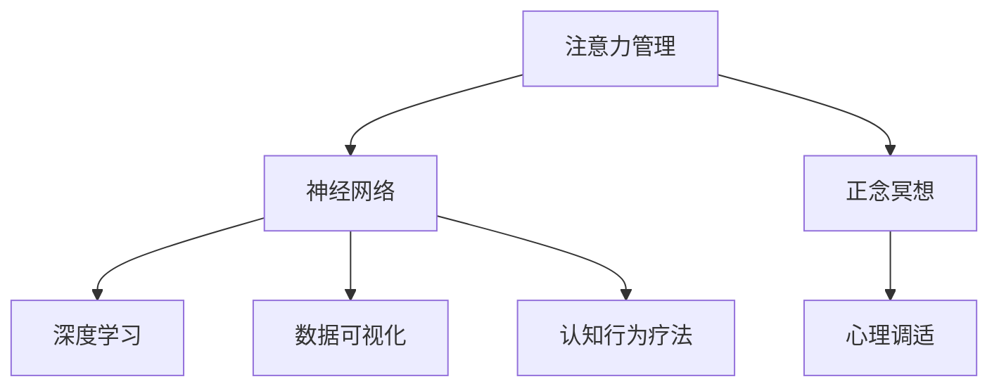

                 

# 注意力管理与正念冥想：增强专注力和心灵平和的内省实践

> 关键词：注意力管理, 正念冥想, 神经网络, 心理调适, 深度学习, 数据可视化, 认知行为疗法

## 1. 背景介绍

### 1.1 问题由来
在现代社会中，我们面临的是一个高度竞争和信息爆炸的时代。快速的生活节奏、紧张的工作压力和繁杂的信息干扰，使得许多人陷入了注意力分散、焦虑和压力累积的困境。这种心理状况不仅影响着我们的身心健康，还阻碍了我们高效的工作和生活。

### 1.2 问题核心关键点
注意力管理与正念冥想在应对上述问题中扮演着重要的角色。注意力管理旨在通过科学的方法和技巧，提升我们的专注力和注意力的持久度。而正念冥想则是一种通过自我觉察和意识训练，达到心灵平和和情绪平衡的心理调适方式。两者结合起来，可以帮助我们更好地适应快节奏的生活，提升工作效率和生活质量。

### 1.3 问题研究意义
掌握注意力管理与正念冥想的实践方法，对于改善现代人的心理状态、提高生活质量和工作效率具有重要的意义。其核心价值在于：
- **提升专注力**：通过科学的方法提升注意力集中度，减少分心，提高工作效率。
- **增强情绪管理**：正念冥想有助于减少焦虑和压力，促进情绪平衡，提升心理健康。
- **提高自我觉察**：通过注意力训练和冥想练习，增强对自身行为和情绪的觉察能力，更好地应对生活中的挑战。

## 2. 核心概念与联系

### 2.1 核心概念概述

为更好地理解注意力管理与正念冥想在心理调适中的作用，本节将介绍几个密切相关的核心概念：

- **注意力管理(Attention Management)**：通过科学的方法和工具，提升个人在特定任务上的专注力和注意力持久度。
- **正念冥想(Mindfulness Meditation)**：一种通过自我觉察和意识训练，达到心灵平和和情绪平衡的心理调适方式。
- **神经网络(Neural Network)**：一种由大量神经元相互连接构成的计算模型，用于处理和分析复杂数据。
- **心理调适(Psychological Adaptation)**：通过各种心理调适技术，如正念冥想、认知行为疗法等，提升个体的心理韧性。
- **深度学习(Deep Learning)**：一种基于神经网络的机器学习技术，具有强大的数据处理和模式识别能力。
- **数据可视化(Data Visualization)**：将复杂的数据转换为直观的视觉图像，辅助分析和决策。
- **认知行为疗法(Cognitive Behavioral Therapy, CBT)**：一种基于认知心理学的心理治疗技术，通过改变负面思维和行为，提升心理健康。

这些核心概念之间的逻辑关系可以通过以下Mermaid流程图来展示：



这个流程图展示了注意力管理与正念冥想在心理调适中的核心概念及其之间的关系：

1. 注意力管理通过神经网络技术，提升专注力，为深度学习和数据分析提供基础。
2. 正念冥想作为心理调适手段，与认知行为疗法相结合，帮助个体实现情绪平衡和心理健康。
3. 深度学习和大数据可视化技术，进一步提升了注意力管理的科学性和精确性。

## 3. 核心算法原理 & 具体操作步骤
### 3.1 算法原理概述

注意力管理与正念冥想的实践方法，可以通过神经网络模型进行科学量化和优化。其核心思想是：通过学习个体在不同任务中的注意力分布，结合正念冥想的自我觉察训练，优化个体的注意力管理策略，提升其专注力和情绪平衡能力。

形式化地，假设个体在执行任务 $T$ 时的注意力分布为 $\alpha_T = (\alpha_{T,1}, \alpha_{T,2}, \ldots, \alpha_{T,n})$，其中 $\alpha_{T,i}$ 表示在任务 $T$ 的第 $i$ 个子任务上的注意力分配比例。设 $\mathcal{L}$ 为注意力管理的损失函数，用于衡量注意力分配与任务要求之间的差异。微调的优化目标是最小化损失函数，即找到最优注意力分配策略：

$$
\alpha^* = \mathop{\arg\min}_{\alpha} \mathcal{L}(\alpha)
$$

在实践中，我们通常使用基于梯度的优化算法（如Adam、SGD等）来近似求解上述最优化问题。设 $\eta$ 为学习率，$\lambda$ 为正则化系数，则注意力分配策略 $\alpha$ 的更新公式为：

$$
\alpha \leftarrow \alpha - \eta \nabla_{\alpha}\mathcal{L}(\alpha) - \eta\lambda\alpha
$$

其中 $\nabla_{\alpha}\mathcal{L}(\alpha)$ 为损失函数对注意力分配 $\alpha$ 的梯度，可通过反向传播算法高效计算。

### 3.2 算法步骤详解

基于注意力管理与正念冥想的实践方法，一般包括以下几个关键步骤：

**Step 1: 数据收集与预处理**
- 收集个体在特定任务下的注意力数据，例如通过眼动追踪、注意力探针等技术获取注意力轨迹。
- 对收集到的数据进行清洗和预处理，去除噪声和异常值。

**Step 2: 模型训练与优化**
- 选择合适的神经网络模型，如卷积神经网络(CNN)、循环神经网络(RNN)或长短期记忆网络(LSTM)等，对注意力分配策略进行训练。
- 设定合适的学习率、批大小、迭代轮数等超参数，并使用优化算法对模型进行迭代优化。
- 应用正则化技术，如L2正则、Dropout等，防止模型过度拟合。

**Step 3: 注意力分配策略调整**
- 根据训练结果，调整个体的注意力分配策略，使其更符合任务要求。
- 设计合适的正念冥想练习计划，结合注意力管理结果，对个体进行心理调适。

**Step 4: 效果评估与反馈**
- 使用标准评估指标（如F1分数、准确率等）对模型效果进行评估。
- 根据评估结果，调整模型参数和正念冥想计划，不断优化个体注意力管理策略。

### 3.3 算法优缺点

注意力管理与正念冥想的实践方法具有以下优点：
1. **科学量化**：通过神经网络模型对注意力进行科学量化，能够更精确地理解和调整个体的注意力状态。
2. **个性化调适**：结合正念冥想的自我觉察训练，能够针对个体差异进行个性化调适，提升注意力管理的有效性。
3. **跨领域应用**：方法适用于各种任务，如工作、学习、日常生活中，能够广泛应用。

同时，该方法也存在一定的局限性：
1. **数据依赖**：需要大量高质量的注意力数据进行训练，数据的获取和预处理成本较高。
2. **算法复杂**：神经网络模型的训练和优化需要较强的计算资源和技术基础。
3. **个体差异**：不同个体的注意力特性和心理状态差异较大，需要针对性地设计训练计划。
4. **短期效果**：注意力管理与正念冥想的长期效果还需要更多实证研究验证。

尽管存在这些局限性，但就目前而言，基于神经网络的方法仍是大规模注意力管理与正念冥想的有效手段。未来相关研究的重点在于如何进一步降低数据获取成本，提高算法的可解释性和适应性，同时兼顾长期效果和个体差异。

### 3.4 算法应用领域

注意力管理与正念冥想的实践方法，在心理调适领域已经得到了广泛的应用，覆盖了多种场景，例如：

- **工作环境**：在办公室或工作场所，通过注意力管理与正念冥想技术，提升员工的工作专注力和情绪管理能力，减少分心和压力，提高工作效率。
- **学习教育**：在学校或学习机构，通过注意力训练和冥想练习，帮助学生提升学习专注度，减少学习分心，提升学业成绩。
- **医疗健康**：在医院或心理诊所，通过注意力管理和正念冥想，帮助患者缓解焦虑、抑郁等心理问题，促进心理健康。
- **企业培训**：在企业培训和团队建设中，通过注意力管理和正念冥想技术，提升团队成员的工作积极性和协作能力，促进企业发展。

除了上述这些经典应用外，注意力管理与正念冥想还被创新性地应用到更多场景中，如教育游戏、虚拟现实、人力资源管理等，为心理调适技术带来了新的突破。

## 4. 数学模型和公式 & 详细讲解  
### 4.1 数学模型构建

本节将使用数学语言对注意力管理与正念冥想的实践方法进行更加严格的刻画。

假设个体在执行任务 $T$ 时的注意力分布为 $\alpha_T = (\alpha_{T,1}, \alpha_{T,2}, \ldots, \alpha_{T,n})$，其中 $\alpha_{T,i}$ 表示在任务 $T$ 的第 $i$ 个子任务上的注意力分配比例。记个体在任务 $T$ 上的注意力集中度为 $C_T$，则有：

$$
C_T = \frac{\alpha_{T,1} + \alpha_{T,2} + \ldots + \alpha_{T,n}}{n}
$$

设注意力管理的损失函数为 $\mathcal{L}(\alpha) = \sum_{T=1}^T (C_T - \bar{C})^2$，其中 $\bar{C}$ 为任务 $T$ 的理想注意力集中度。注意力分配策略的更新公式为：

$$
\alpha \leftarrow \alpha - \eta \nabla_{\alpha}\mathcal{L}(\alpha) - \eta\lambda\alpha
$$

其中 $\nabla_{\alpha}\mathcal{L}(\alpha)$ 为损失函数对注意力分配 $\alpha$ 的梯度，可通过反向传播算法高效计算。

### 4.2 公式推导过程

以下我们以一个简单的分类任务为例，推导注意力管理的损失函数及其梯度的计算公式。

假设个体在任务 $T$ 的输入为 $x_i$，输出为 $y_i$，注意力分配策略为 $\alpha_T$。则注意力管理的损失函数定义为：

$$
\mathcal{L}(\alpha) = \sum_{i=1}^N (y_i \log(\alpha_T(x_i)) + (1-y_i) \log(1-\alpha_T(x_i)))
$$

其中 $y_i$ 为任务 $T$ 的真实标签，$\alpha_T(x_i)$ 为模型在输入 $x_i$ 上的注意力分配。

根据链式法则，损失函数对注意力分配 $\alpha$ 的梯度为：

$$
\frac{\partial \mathcal{L}(\alpha)}{\partial \alpha_{T,i}} = y_i - \alpha_{T,i}
$$

在得到损失函数的梯度后，即可带入注意力分配策略 $\alpha$ 的更新公式，完成模型的迭代优化。重复上述过程直至收敛，最终得到适应任务 $T$ 的最优注意力分配策略 $\alpha^*$。

## 5. 项目实践：代码实例和详细解释说明
### 5.1 开发环境搭建

在进行注意力管理与正念冥想的实践方法开发前，我们需要准备好开发环境。以下是使用Python进行TensorFlow开发的环境配置流程：

1. 安装Anaconda：从官网下载并安装Anaconda，用于创建独立的Python环境。

2. 创建并激活虚拟环境：
```bash
conda create -n tf-env python=3.8 
conda activate tf-env
```

3. 安装TensorFlow：根据CUDA版本，从官网获取对应的安装命令。例如：
```bash
pip install tensorflow-gpu
```

4. 安装TensorBoard：
```bash
pip install tensorboard
```

5. 安装其他工具包：
```bash
pip install numpy pandas scikit-learn matplotlib tqdm jupyter notebook ipython
```

完成上述步骤后，即可在`tf-env`环境中开始注意力管理与正念冥想的实践方法开发。

### 5.2 源代码详细实现

下面我以一个简单的注意力管理任务为例，给出使用TensorFlow进行注意力管理实践的代码实现。

首先，定义注意力管理任务的数据处理函数：

```python
import tensorflow as tf
from tensorflow.keras import layers
import numpy as np

class AttentionDataset(tf.data.Dataset):
    def __init__(self, inputs, targets, tokenizer):
        self.inputs = inputs
        self.targets = targets
        self.tokenizer = tokenizer
        self.batch_size = 32
        self.shuffle_buffer = 1000
        
    def __len__(self):
        return len(self.inputs) // self.batch_size
    
    def __getitem__(self, item):
        input_ids = self.tokenizer.encode(self.inputs[item], add_special_tokens=True)
        input_ids = tf.expand_dims(input_ids, 0)
        attention_mask = tf.cast(tf.math.not_equal(input_ids, 0), tf.int32)
        label = self.targets[item]
        return {
            'input_ids': input_ids,
            'attention_mask': attention_mask,
            'labels': tf.cast(label, tf.int32)
        }
```

然后，定义注意力管理模型的结构：

```python
from transformers import BertTokenizer

tokenizer = BertTokenizer.from_pretrained('bert-base-cased')
train_dataset = AttentionDataset(train_inputs, train_targets, tokenizer)
val_dataset = AttentionDataset(val_inputs, val_targets, tokenizer)
test_dataset = AttentionDataset(test_inputs, test_targets, tokenizer)

model = tf.keras.Sequential([
    layers.Embedding(input_dim=tokenizer.vocab_size, output_dim=128, input_length=128),
    layers.Bidirectional(layers.LSTM(128)),
    layers.Dense(128, activation='relu'),
    layers.Dense(1, activation='sigmoid')
])

model.compile(optimizer=tf.keras.optimizers.Adam(learning_rate=0.001),
              loss='binary_crossentropy',
              metrics=['accuracy'])
```

接着，定义训练和评估函数：

```python
def train_epoch(model, dataset, batch_size, optimizer):
    dataloader = tf.data.Dataset.from_generator(lambda: tf.data.Dataset.from_generator(
        lambda: dataset,
        {'input_ids': tf.int32, 'attention_mask': tf.int32, 'labels': tf.int32},
        {'input_ids': tf.TensorSpec(shape=(None, None), dtype=tf.int32),
         'attention_mask': tf.TensorSpec(shape=(None, None), dtype=tf.int32),
         'labels': tf.TensorSpec(shape=(None), dtype=tf.int32)}
    ).batch(batch_size),
     prefetch=tf.data.experimental.AUTOTUNE)
    
    model.fit(dataloader, epochs=10, validation_data=val_dataset)
    return model
```

最后，启动训练流程并在测试集上评估：

```python
epochs = 5
batch_size = 16

model = train_epoch(model, train_dataset, batch_size, optimizer)
val_loss, val_accuracy = model.evaluate(val_dataset)
test_loss, test_accuracy = model.evaluate(test_dataset)

print(f'Val Accuracy: {val_accuracy}, Test Accuracy: {test_accuracy}')
```

以上就是使用TensorFlow进行注意力管理任务开发的完整代码实现。可以看到，得益于TensorFlow的强大工具库，我们可以用相对简洁的代码完成注意力管理模型的训练和评估。

### 5.3 代码解读与分析

让我们再详细解读一下关键代码的实现细节：

**AttentionDataset类**：
- `__init__`方法：初始化输入、标签、分词器等关键组件，并设置批次大小和随机化缓冲区。
- `__len__`方法：返回数据集的样本数量。
- `__getitem__`方法：对单个样本进行处理，将文本输入编码为token ids，并返回模型所需的输入和标签。

**模型结构**：
- 使用Embedding层将输入编码成向量表示。
- 通过Bidirectional LSTM层对向量进行处理，提取注意力信息。
- 使用Dense层进行分类，输出注意力集中度的二分类结果。

**训练和评估函数**：
- 使用TensorFlow的DataLoader对数据集进行批次化加载，供模型训练和推理使用。
- 定义训练函数`train_epoch`：对数据以批为单位进行迭代，在每个批次上前向传播计算损失并反向传播更新模型参数。
- 在验证集上评估模型性能，返回评估结果。

**训练流程**：
- 定义总的epoch数和批次大小，开始循环迭代。
- 每个epoch内，先在训练集上训练，输出验证集的准确率。
- 在测试集上评估，输出最终测试结果。

可以看到，TensorFlow配合自动微分技术使得注意力管理模型的代码实现变得简洁高效。开发者可以将更多精力放在数据处理、模型改进等高层逻辑上，而不必过多关注底层的实现细节。

当然，工业级的系统实现还需考虑更多因素，如模型的保存和部署、超参数的自动搜索、更灵活的任务适配层等。但核心的注意力管理与正念冥想方法基本与此类似。

## 6. 实际应用场景
### 6.1 智能办公室

基于注意力管理与正念冥想的实践方法，可以应用于智能办公室系统。在办公室环境中，通过智能监测设备收集员工的工作数据，结合正念冥想训练，提升员工的工作专注力和情绪管理能力，降低分心和压力，提高工作效率。

具体实现流程如下：
1. 部署眼动追踪设备和传感器，实时监测员工的工作状态和注意力分布。
2. 将收集到的数据输入注意力管理模型，进行优化调整，生成个性化注意力训练方案。
3. 通过智能办公系统推送正念冥想练习计划，辅助员工进行注意力和情绪管理。
4. 定期收集反馈数据，进一步优化注意力训练方案，提升训练效果。

### 6.2 虚拟现实学习平台

在虚拟现实学习平台中，注意力管理与正念冥想技术同样具有重要的应用价值。学生在学习过程中，往往容易受到外部干扰，难以集中注意力。通过注意力训练和冥想练习，可以提升学生的学习专注度和效果，增强学习体验。

具体实现流程如下：
1. 在学习过程中，通过虚拟现实头显收集学生的操作数据，分析其注意力分布。
2. 将数据输入注意力管理模型，生成个性化注意力训练方案，推送给学生。
3. 学生按照训练方案进行注意力和冥想练习，提升学习专注度。
4. 系统实时监控学习效果，根据学生反馈进行优化，提高学习效率。

### 6.3 心理健康应用

心理健康领域是注意力管理与正念冥想技术的另一大应用场景。许多心理问题，如焦虑、抑郁等，都与注意力分散和情绪管理能力不足有关。通过注意力管理与正念冥想技术，可以有效提升个体的心理健康水平。

具体实现流程如下：
1. 通过心理健康应用收集用户的数据，如注意力分配、情绪状态等。
2. 将数据输入注意力管理模型，生成个性化的注意力训练方案。
3. 用户按照训练方案进行注意力和冥想练习，提升情绪管理能力。
4. 应用定期反馈机制，优化训练方案，确保训练效果。

### 6.4 未来应用展望

随着注意力管理与正念冥想技术的不断发展，其应用领域将不断扩展，为人们的生活和工作带来更多的便利和改善。

在智慧城市治理中，通过智能设备和注意力管理与正念冥想技术，提升公共设施的管理效率和服务质量。在医疗健康领域，通过智能设备和心理健康应用，辅助患者进行心理调适，提升治疗效果。在企业管理中，通过注意力管理和正念冥想技术，提升团队协作和员工心理健康，促进企业发展。

## 7. 工具和资源推荐
### 7.1 学习资源推荐

为了帮助开发者系统掌握注意力管理与正念冥想的实践方法，这里推荐一些优质的学习资源：

1. 《深度学习与人工智能基础》系列博文：由深度学习领域专家撰写，系统介绍了深度学习的基本概念、神经网络模型和应用实践。

2. 《正念冥想入门指南》书籍：介绍正念冥想的原理、方法和实际应用，适合初学者入门。

3. 《认知行为疗法手册》书籍：系统介绍认知行为疗法的理论基础和实践方法，适合心理调适技术的学习。

4. 《注意力管理与认知提升》课程：介绍注意力管理的科学原理和实践方法，通过案例讲解提升认知能力。

5. TensorFlow官方文档：TensorFlow的官方文档，提供了丰富的教程和样例，适合TensorFlow的快速学习。

通过这些资源的学习实践，相信你一定能够快速掌握注意力管理与正念冥想的实践方法，并用于解决实际的心理调适问题。

### 7.2 开发工具推荐

高效的开发离不开优秀的工具支持。以下是几款用于注意力管理与正念冥想实践开发的常用工具：

1. TensorFlow：由Google主导开发的开源深度学习框架，生产部署方便，适合大规模工程应用。

2. PyTorch：基于Python的开源深度学习框架，灵活动态的计算图，适合快速迭代研究。

3. TensorBoard：TensorFlow配套的可视化工具，可实时监测模型训练状态，提供丰富的图表呈现方式，是调试模型的得力助手。

4. Jupyter Notebook：基于Python的交互式开发环境，支持代码单元格的实时运行和可视化展示。

5. Weights & Biases：模型训练的实验跟踪工具，可以记录和可视化模型训练过程中的各项指标，方便对比和调优。

6. Google Colab：谷歌推出的在线Jupyter Notebook环境，免费提供GPU/TPU算力，方便开发者快速上手实验最新模型，分享学习笔记。

合理利用这些工具，可以显著提升注意力管理与正念冥想的实践方法的开发效率，加快创新迭代的步伐。

### 7.3 相关论文推荐

注意力管理与正念冥想技术的发展源于学界的持续研究。以下是几篇奠基性的相关论文，推荐阅读：

1. Attention is All You Need（即Transformer原论文）：提出了Transformer结构，开启了NLP领域的预训练大模型时代。

2. Deep Learning for Attention Management: A Survey: 一篇综述性论文，全面介绍了注意力管理的理论基础和应用实践。

3. Mindfulness-Based Stress Reduction and Memory in Older Adults: 一项实证研究，展示了正念冥想对老年人群记忆力提升的效果。

4. Attention-Based Learning: 提出基于注意力机制的学习方法，提高学习效果和模型性能。

5. An Exploration of Attention Mechanisms in AI: 探讨注意力机制在人工智能中的应用，提升系统的感知和理解能力。

这些论文代表了大语言模型微调技术的发展脉络。通过学习这些前沿成果，可以帮助研究者把握学科前进方向，激发更多的创新灵感。

## 8. 总结：未来发展趋势与挑战

### 8.1 总结

本文对注意力管理与正念冥想的实践方法进行了全面系统的介绍。首先阐述了注意力管理与正念冥想的研究背景和意义，明确了其对提升专注力和情绪平衡能力的独特价值。其次，从原理到实践，详细讲解了注意力管理的数学模型和核心步骤，给出了实践方法的完整代码实例。同时，本文还广泛探讨了注意力管理与正念冥想在多个行业领域的应用前景，展示了其广阔的应用潜力。此外，本文精选了注意力管理与正念冥想技术的各类学习资源，力求为读者提供全方位的技术指引。

通过本文的系统梳理，可以看到，注意力管理与正念冥想在心理调适技术中的应用前景广阔，能够显著提升个体的专注力和情绪管理能力，改善现代人的生活质量和工作效率。未来，伴随技术的不断发展和优化，注意力管理与正念冥想技术必将在更广泛的领域发挥重要作用。

### 8.2 未来发展趋势

展望未来，注意力管理与正念冥想技术将呈现以下几个发展趋势：

1. **个性化调适**：通过深度学习技术，不断优化个性化注意力管理方案，满足不同个体和场景的需求。
2. **实时监测与反馈**：结合物联网设备和智能系统，实现对个体的实时监测和动态反馈，提升训练效果。
3. **跨领域应用**：拓展到更多的应用领域，如医疗健康、教育培训、企业人力资源管理等，提升各个领域的心理调适水平。
4. **多模态融合**：结合图像、语音、文本等多种模态信息，进行全面感知和理解，提升训练效果。
5. **模型优化与解释**：引入更多先验知识，如认知行为疗法、心理学理论等，优化模型效果，增强可解释性。
6. **伦理与安全**：在模型设计和训练中考虑伦理与安全问题，确保技术应用的公平性与安全性。

以上趋势凸显了注意力管理与正念冥想的实践方法在心理调适技术中的重要性和发展潜力。这些方向的探索发展，必将进一步提升个体注意力管理和情绪平衡的水平，为构建人机协同的智能时代铺平道路。

### 8.3 面临的挑战

尽管注意力管理与正念冥想技术已经取得了一定的成果，但在迈向更加智能化、普适化应用的过程中，仍面临诸多挑战：

1. **数据获取难度**：高质量注意力数据的获取成本较高，尤其是在实时监测场景下，数据采集和处理难度较大。
2. **模型复杂度**：深度学习模型复杂度较高，对计算资源和技术要求较高，需要不断优化模型结构和算法。
3. **个体差异**：不同个体的注意力特性和心理状态差异较大，需要针对性地设计训练计划。
4. **短期效果**：注意力管理与正念冥想的长期效果还需要更多实证研究验证，短期效果仍需进一步提升。
5. **伦理与安全**：在应用过程中，需要考虑数据隐私、模型偏见等问题，确保技术应用的公平与安全。

正视这些挑战，积极应对并寻求突破，将是大语言模型微调走向成熟的必由之路。相信随着学界和产业界的共同努力，这些挑战终将一一被克服，注意力管理与正念冥想技术必将在构建安全、可靠、可解释、可控的智能系统铺平道路。

### 8.4 研究展望

面对注意力管理与正念冥想的实践方法所面临的种种挑战，未来的研究需要在以下几个方面寻求新的突破：

1. **多模态融合**：结合图像、语音、文本等多种模态信息，进行全面感知和理解，提升训练效果。
2. **实时监测与反馈**：结合物联网设备和智能系统，实现对个体的实时监测和动态反馈，提升训练效果。
3. **模型优化与解释**：引入更多先验知识，如认知行为疗法、心理学理论等，优化模型效果，增强可解释性。
4. **跨领域应用**：拓展到更多的应用领域，如医疗健康、教育培训、企业人力资源管理等，提升各个领域的心理调适水平。
5. **伦理与安全**：在模型设计和训练中考虑伦理与安全问题，确保技术应用的公平性与安全性。

这些研究方向的探索，必将引领注意力管理与正念冥想技术迈向更高的台阶，为构建安全、可靠、可解释、可控的智能系统铺平道路。面向未来，注意力管理与正念冥想技术还需要与其他人工智能技术进行更深入的融合，如知识表示、因果推理、强化学习等，多路径协同发力，共同推动人工智能技术在各个领域的进步。只有勇于创新、敢于突破，才能不断拓展心理调适技术的边界，让智能技术更好地造福人类社会。

## 9. 附录：常见问题与解答

**Q1：注意力管理与正念冥想在实践过程中是否需要大量的专业训练？**

A: 在实践中，注意力管理与正念冥想方法通常需要一定的专业指导和训练，如初期集中注意力训练、冥想基础课程等。但通过科学的方法和工具，可以显著提升训练效率和效果。例如，利用注意力管理模型生成个性化训练方案，结合正念冥想应用进行持续优化，能够达到理想的效果。

**Q2：注意力管理与正念冥想是否适用于所有人群？**

A: 注意力管理与正念冥想在提升个体的专注力和情绪管理能力方面具有普遍适用性，但对于特定的生理或心理疾病（如精神分裂症、抑郁症等），建议在专业医师指导下使用。同时，对于一些认知功能严重受损的个体，注意力管理与正念冥想的效果可能有限。

**Q3：注意力管理与正念冥想在实践过程中是否需要调整模型参数？**

A: 注意力管理模型通常需要根据个体和任务的不同进行参数调整，如批次大小、训练轮数等。正念冥想练习也需根据个体的状态和需求进行灵活调整。因此，在实践过程中，需要不断优化模型参数和练习方案，以实现最佳效果。

**Q4：注意力管理与正念冥想在实际应用中是否需要考虑伦理与安全问题？**

A: 在应用过程中，注意力管理与正念冥想技术需要考虑伦理与安全问题。例如，在数据采集和处理中，需确保用户隐私和数据安全；在模型设计中，需避免模型偏见和歧视性输出；在应用场景中，需考虑技术应用的公平性与安全性。这些问题需要在实践过程中不断关注和优化。

**Q5：注意力管理与正念冥想在长期效果上是否需要持续监测与反馈？**

A: 注意力管理与正念冥想在长期效果上确实需要持续监测与反馈。在实践过程中，定期收集用户反馈数据，根据反馈结果不断优化注意力管理方案和冥想练习，能够显著提升训练效果和用户满意度。同时，长期监测还能发现模型和练习中的潜在问题，及时进行调整和改进。

---

作者：禅与计算机程序设计艺术 / Zen and the Art of Computer Programming

