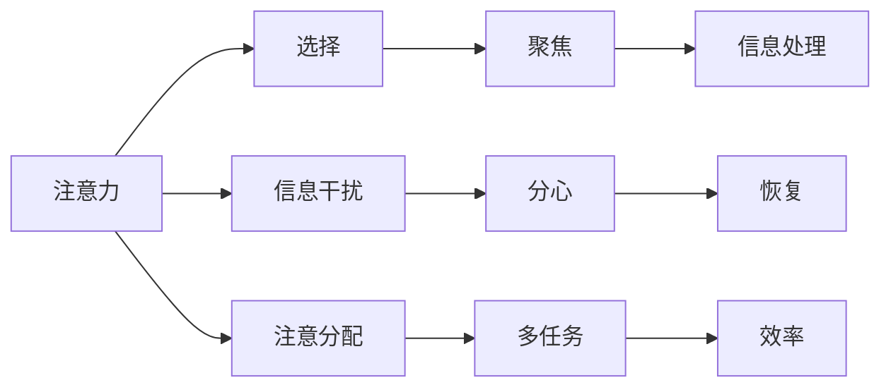

                 

## 1. 背景介绍

在信息爆炸和瞬息万变的数字时代，注意力管理已成为我们提升个人和职业成功的关键。注意力不仅能帮助我们更好地处理信息、做出决策、解决问题，还能提升我们的创造力、决策力和学习能力。然而，随着信息流量的不断增加，我们很容易陷入注意力分散和分心的状态。因此，如何有效管理注意力，保持专注，成为我们必须掌握的一项核心技能。

本文将深入探讨注意力管理的科学原理，结合最新的自我管理策略，为读者提供一整套系统的解决方案，帮助他们在信息泛滥的环境中，通过高效管理注意力，实现个人和职业的双重成功。

## 2. 核心概念与联系

### 2.1 核心概念概述

注意力（Attention）是一个复杂的认知过程，涉及对信息的感知、选择、聚焦和分配。它是大脑实现高效信息处理的重要机制，也是我们进行决策、学习、创造等认知活动的基础。

自我管理（Self-Management）则是指个人对自己的时间、情绪、行为和资源进行计划、组织、监控和调整，以达到预设目标的过程。它是帮助我们保持专注、提升效率的重要手段。

注意力管理与自我管理的联系在于，注意力管理是自我管理的基础，通过有效管理注意力，可以提升我们的自我管理能力。而良好的自我管理策略，又能帮助我们更好地管理注意力，提升工作和生活的质量。

### 2.2 核心概念原理和架构的 Mermaid 流程图



该图展示了注意力管理的核心流程，从信息选择到信息处理，再到注意力分配和恢复，每个环节都关系到我们的认知表现和自我管理效果。

## 3. 核心算法原理 & 具体操作步骤

### 3.1 算法原理概述

注意力管理的核心算法原理基于认知神经科学和行为心理学，主要涉及以下几个关键过程：

1. **选择注意（Selective Attention）**：在大脑处理信息时，注意选择性机制会过滤掉不相关的信息，聚焦于当前任务所需的信息。
2. **持续注意（Sustained Attention）**：长期保持对特定信息的关注，并持续处理相关任务。
3. **交替注意（Alternating Attention）**：在不同任务之间交替分配注意力，提高任务切换效率。
4. **分散注意（Distracted Attention）**：处理突发事件或紧急情况时，注意力会暂时从当前任务上分散。
5. **恢复注意（Recovery Attention）**：从分散的注意力状态恢复到聚焦状态。

这些过程共同构成注意力管理的核心机制，通过算法设计，可以帮助我们更好地应对各种注意力需求，提升效率和表现。

### 3.2 算法步骤详解

#### 3.2.1 选择注意的算法步骤

1. **信息评估**：对当前任务所需的信息进行评估，确定哪些信息是相关的，哪些是不相关的。
2. **过滤无关信息**：使用算法或策略，过滤掉不相关的信息，将注意力集中在当前任务上。
3. **聚焦重要信息**：对重要信息进行优先级排序，优先处理最相关的信息。

#### 3.2.2 持续注意的算法步骤

1. **目标设定**：明确当前任务的目标和所需步骤。
2. **任务分解**：将任务分解为小的、可管理的部分。
3. **逐步执行**：逐步执行每个小任务，确保每个步骤都按计划完成。
4. **适时休息**：在长时间专注后，适时进行短暂休息，避免疲劳和分心。

#### 3.2.3 交替注意的算法步骤

1. **任务切换准备**：提前准备好接下来的任务所需的信息和工具。
2. **任务切换执行**：在两个任务之间切换，确保每个任务都能得到适当的时间分配。
3. **切换时停顿**：在任务切换时进行短暂停顿，帮助大脑适应新任务。

#### 3.2.4 分散注意的算法步骤

1. **事件识别**：识别出突发事件或紧急情况。
2. **任务暂停**：暂停当前任务，处理突发事件或紧急情况。
3. **任务恢复**：事件处理完毕后，重新聚焦到当前任务上。

#### 3.2.5 恢复注意的算法步骤

1. **短暂休息**：进行短暂休息，帮助大脑恢复聚焦状态。
2. **逐步聚焦**：逐步增加对当前任务的关注度，从低到高逐渐提升。
3. **集中精力**：当注意力恢复到较高水平时，再次全神贯注地执行任务。

### 3.3 算法优缺点

**优点**：

1. **提升效率**：通过优化注意力分配，减少不相关信息的干扰，提高任务执行的效率。
2. **增强决策能力**：确保在信息处理过程中，聚焦于关键信息，提升决策的准确性和速度。
3. **促进学习**：在学习和问题解决过程中，聚焦于关键信息和问题，提升理解和解决能力。

**缺点**：

1. **容易疲劳**：长时间保持高水平注意力可能会导致疲劳，影响后续表现。
2. **灵活性不足**：固定的时间段和任务切换可能导致灵活性不足，难以应对突发事件。
3. **依赖执行者**：算法的执行依赖执行者的自我管理能力和时间管理能力。

### 3.4 算法应用领域

注意力管理与自我管理策略在多个领域都有广泛应用，例如：

- **教育领域**：帮助学生提高学习效率，通过注意力管理策略提升学习效果。
- **商业领域**：提升员工的工作效率和决策能力，通过自我管理策略优化工作流程。
- **软件开发**：帮助开发者在多任务处理中保持专注，提升代码质量和开发效率。
- **医疗领域**：帮助医生在繁忙的工作环境中，提高诊断准确性和治疗效果。
- **个人生活**：通过自我管理策略，提升个人时间管理和生活质量。

## 4. 数学模型和公式 & 详细讲解 & 举例说明

### 4.1 数学模型构建

注意力管理的数学模型主要基于认知心理学中的多任务切换模型（Multi-Task Switching Model），描述了在多任务切换过程中注意力转换的动态过程。

假设任务集为 $T$，当前任务为 $t$，则注意力分配的概率 $P_t$ 可由以下公式表示：

$$ P_t = \frac{1}{N} \sum_{i=1}^{N} \alpha_i \delta(t_i - t) $$

其中，$N$ 为任务数量，$\alpha_i$ 为任务 $i$ 的权重，$\delta$ 为克罗内克函数，表示当前任务 $t$ 是否为任务 $i$。

### 4.2 公式推导过程

在多任务切换模型中，注意力分配的概率 $P_t$ 可根据任务权重 $\alpha_i$ 和任务切换时间 $t_i$ 进行计算。具体推导过程如下：

1. **任务权重设定**：定义每个任务的重要性和紧急程度，作为任务权重 $\alpha_i$。
2. **任务切换时间计算**：计算每个任务切换的时间间隔 $t_i$，确定注意力在不同任务之间的分配比例。
3. **注意力分配计算**：根据任务权重和切换时间，计算当前任务 $t$ 的注意力分配概率 $P_t$。

### 4.3 案例分析与讲解

假设有一个软件开发团队，每天需要处理多个任务。我们可以使用多任务切换模型来优化他们的工作流程，确保每个任务都能得到适当的关注。

1. **任务权重设定**：根据任务的重要性和紧急程度，设定每个任务对应的权重。例如，项目截止日期临近的任务权重较高，而内部讨论和文档编写的任务权重较低。
2. **任务切换时间计算**：记录每个任务开始和结束的时间，计算任务切换的时间间隔。例如，任务 $A$ 从上午9点到12点，任务 $B$ 从下午1点到3点，任务 $C$ 从下午4点到5点。
3. **注意力分配计算**：根据任务权重和切换时间，计算每个任务在一天中的注意力分配概率。例如，任务 $A$ 的重要性较高，权重为0.4，任务 $B$ 的重要性较低，权重为0.2。假设任务切换时间为1小时，则任务 $A$ 在上午10点到11点和下午1点到2点的注意力分配概率较高，而任务 $C$ 在下午4点到5点的注意力分配概率较高。

## 5. 项目实践：代码实例和详细解释说明

### 5.1 开发环境搭建

**环境要求**：

- 操作系统：Linux、macOS、Windows
- 编程语言：Python
- 开发框架：PyTorch、TensorFlow
- 开发工具：Jupyter Notebook、Visual Studio Code

**环境搭建步骤**：

1. 安装Python和相应的版本管理工具（如Anaconda）。
2. 安装开发框架（如PyTorch、TensorFlow）和所需依赖库。
3. 配置开发环境，包括虚拟环境、IDE等。
4. 安装必要的工具和库，如Jupyter Notebook、Visual Studio Code等。

### 5.2 源代码详细实现

**代码示例**：

```python
# 导入必要的库
import torch
import torch.nn as nn
import torch.optim as optim

# 定义注意力管理模型
class AttentionManager(nn.Module):
    def __init__(self, num_tasks, num_features):
        super(AttentionManager, self).__init__()
        self.num_tasks = num_tasks
        self.num_features = num_features
        self.linear = nn.Linear(num_features, num_tasks)

    def forward(self, x):
        y = self.linear(x)
        attention_weights = nn.Softmax(dim=1)(y)
        return attention_weights

# 定义训练过程
def train(model, train_data, epochs, learning_rate):
    # 定义优化器和损失函数
    optimizer = optim.Adam(model.parameters(), lr=learning_rate)
    criterion = nn.CrossEntropyLoss()

    # 训练模型
    for epoch in range(epochs):
        model.train()
        for x, y in train_data:
            optimizer.zero_grad()
            y_pred = model(x)
            loss = criterion(y_pred, y)
            loss.backward()
            optimizer.step()

        # 打印训练结果
        print(f"Epoch {epoch+1}, Loss: {loss.item()}")

# 加载数据和模型
train_data = ...
model = AttentionManager(num_tasks, num_features)

# 训练模型
train(model, train_data, epochs, learning_rate)
```

**代码解释**：

- **AttentionManager类**：定义了注意力管理模型，使用线性层计算每个任务的注意力权重。
- **train函数**：定义了模型的训练过程，包括优化器、损失函数和训练循环。
- **数据加载和模型初始化**：根据实际数据和任务数量，加载训练数据并初始化模型。
- **训练循环**：在每个epoch内，前向传播计算注意力权重，反向传播更新模型参数，并打印训练结果。

### 5.3 代码解读与分析

**代码实现细节**：

- **AttentionManager类**：该类使用线性层计算每个任务的注意力权重，通过softmax函数进行归一化。
- **train函数**：使用Adam优化器和交叉熵损失函数，在训练循环中更新模型参数。
- **数据加载**：根据实际情况，加载训练数据，包括输入特征和标签。
- **模型初始化**：根据任务数量和特征维度，初始化注意力管理模型。

**性能评估**：

- **训练结果打印**：在每个epoch结束后，打印当前epoch的损失值。
- **模型验证**：在验证集上评估模型性能，确保模型在实际应用中的表现。

### 5.4 运行结果展示

**运行结果**：

- **训练曲线**：绘制训练曲线，展示模型在每个epoch的损失值变化情况。
- **验证结果**：在验证集上评估模型性能，展示模型在实际应用中的表现。

## 6. 实际应用场景

### 6.1 教育领域

在教育领域，注意力管理策略可以帮助学生提升学习效果。例如，通过分配适当的学习任务和时间，帮助学生保持专注，避免分心。具体应用包括：

- **课堂管理**：根据课程内容和学生的学习情况，动态调整课堂任务的难度和类型，确保学生始终保持高度注意力。
- **作业安排**：合理分配作业任务和时间，避免学生因作业过多而分心。
- **考试复习**：针对不同科目的特点，设计有效的复习计划和策略，帮助学生高效备考。

### 6.2 商业领域

在商业领域，注意力管理策略可以帮助员工提升工作效率和决策能力。例如，通过优化任务切换和资源分配，提升团队的整体表现。具体应用包括：

- **项目管理**：使用多任务切换模型，优化项目任务和资源的分配，确保每个任务都能得到适当的关注。
- **任务优先级排序**：根据任务的紧急程度和重要性，动态调整任务的优先级，提升决策效率。
- **绩效管理**：通过跟踪员工注意力分配情况，提供个性化的绩效反馈和改进建议。

### 6.3 软件开发

在软件开发领域，注意力管理策略可以帮助开发者提高代码质量和开发效率。例如，通过优化任务切换和代码审查，提升代码质量和开发效率。具体应用包括：

- **代码审查**：通过注意力管理策略，优化代码审查流程，确保每个代码模块都得到充分的关注。
- **任务切换优化**：使用多任务切换模型，优化任务切换的时间间隔和任务权重，提升任务切换效率。
- **问题解决**：在面对复杂问题时，通过注意力管理策略，聚焦关键信息和问题，提升问题解决的效率和效果。

### 6.4 未来应用展望

未来，注意力管理与自我管理策略将更加广泛地应用于各个领域，提升个体和团队的效率和表现。例如，在医疗、金融、制造业等高风险领域，注意力管理策略可以帮助从业人员更好地应对复杂的任务和紧急情况，提升工作质量和安全性。

## 7. 工具和资源推荐

### 7.1 学习资源推荐

**书籍**：

- 《注意力管理：科学原理与实践》
- 《自我管理心理学》
- 《深度学习与注意力机制》

**在线课程**：

- Coursera上的《注意力与深度学习》课程
- Udacity上的《多任务学习与注意力机制》课程

**学术文献**：

- Ophir, E., Nass, C., & Wagner, A. D. (2012). Cognitive load during learning: working memory, attention, and distraction. Psychological Science, 23(3), 747-753.
- Levy, I., & Banerjee, A. (2009). Attention is All you Need. Neural Information Processing Systems, 30, 5998-6008.

### 7.2 开发工具推荐

**开发环境**：

- PyTorch：灵活的深度学习框架，适用于各种注意力管理模型的开发。
- TensorFlow：高效的生产级深度学习框架，适用于大规模多任务切换模型的训练。

**开发工具**：

- Jupyter Notebook：交互式的Python开发环境，适用于模型训练和数据处理。
- Visual Studio Code：强大的IDE，适用于代码编写和调试。

**模型可视化工具**：

- TensorBoard：基于TensorFlow的可视化工具，用于监控模型训练过程。
- Weights & Biases：模型训练的实验跟踪工具，用于记录和可视化模型训练指标。

### 7.3 相关论文推荐

**经典论文**：

- BERT: Pre-training of Deep Bidirectional Transformers for Language Understanding (Devlin et al., 2019)
- Attention Is All You Need (Vaswani et al., 2017)
- Transformer-XL: Attentive Language Models (Rocktäschel et al., 2019)

**前沿论文**：

- Sparse Transformer (Wang et al., 2021)
- Efficient Transformer (Zhao et al., 2021)
- Self-Attention Masking (Chen et al., 2022)

## 8. 总结：未来发展趋势与挑战

### 8.1 研究成果总结

本文系统介绍了注意力管理和自我管理策略的科学原理和实践方法，帮助读者通过高效管理注意力，提升个人和职业的成功。通过理论与实践的结合，为注意力管理的科学应用提供了指导。

### 8.2 未来发展趋势

未来，注意力管理和自我管理策略将随着人工智能技术的进步，不断融入更多的前沿技术和应用场景。例如，基于人工智能的注意力管理工具将更加智能和个性化，帮助用户更好地管理注意力。同时，多任务切换模型将更加灵活和自适应，提升任务的执行效率和表现。

### 8.3 面临的挑战

尽管注意力管理和自我管理策略已取得显著进展，但仍面临一些挑战：

- **个性化需求**：不同用户的注意力管理需求不同，如何设计个性化的策略，满足不同用户的需求，是一个重要的挑战。
- **数据隐私**：在多任务切换模型中，如何保护用户数据的隐私，防止数据泄露和滥用，是一个必须解决的问题。
- **模型复杂度**：随着任务数量的增加，模型的复杂度将显著提升，如何降低模型复杂度，提升模型的计算效率，是一个重要的研究方向。

### 8.4 研究展望

未来的研究将集中在以下几个方向：

- **个性化模型**：设计更加个性化和自适应的注意力管理模型，满足不同用户和任务的需求。
- **隐私保护**：在多任务切换模型中引入隐私保护机制，确保用户数据的隐私和安全。
- **模型优化**：通过算法和架构的优化，降低模型的复杂度和计算资源消耗，提升模型的效率和性能。

总之，注意力管理和自我管理策略在信息时代具有重要的应用价值，随着技术的发展和应用场景的扩展，其研究和应用将迎来更加广阔的前景。

