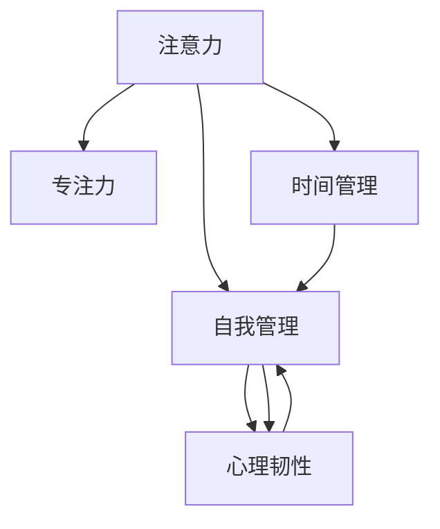

                 

# 注意力管理与自我管理策略：通过专注力增强个人和职业成功

> 关键词：注意力管理, 自我管理, 专注力, 时间管理, 心理韧韧性

## 1. 背景介绍

在当今快节奏的工作与生活中，如何高效利用注意力、保持专注，成为了每个个体追求卓越的必修课。无论是职场人士还是学术研究人员，高质量的专注力都能显著提升工作效率与质量，为个人与职业成功奠定坚实基础。注意力管理与自我管理策略的提出，旨在帮助人们系统提升专注力，更好地掌控个人时间与精力，实现高绩效与工作-生活平衡。

### 1.1 问题由来
注意力作为一种有限的认知资源，在信息爆炸的时代显得尤为稀缺。而缺乏有效管理机制，导致许多人在工作或学习过程中出现分心、拖延、精力不足等问题，严重影响工作效率和成果质量。例如，频繁的中断、信息的过量输入、任务切换等都会导致注意力分散，导致工作进度受阻，甚至产生压力与焦虑。

随着科技的发展，时间管理和注意力管理工具层出不穷，从简单的待办事项清单，到复杂的时间管理软件与应用程序，均试图帮助用户提高生产力与专注力。然而，大多数工具往往只提供粗略的管理建议，缺乏系统性与个性化策略。且许多用户未能有效利用这些工具，反而陷入了更为复杂的时间陷阱。因此，本文将从注意力管理与自我管理策略的角度出发，提供更为科学、系统、个性化的解决方案，帮助用户全面提升专注力与工作效率。

### 1.2 问题核心关键点
本文聚焦于注意力管理与自我管理策略，并通过以下核心关键词详细阐述：
1. **注意力管理**：通过系统工具与策略，优化注意力的使用方式，提升专注力与工作表现。
2. **自我管理**：通过心理韧性与积极心态的培养，增强面对压力与挑战的能力，实现高效与平衡。
3. **专注力**：通过技术手段与训练方法，提升个体在长时间专注状态下的表现，实现深度工作。
4. **时间管理**：通过高效的时间规划与分配，最大化时间资源的利用，提高生产力。
5. **心理韧性**：通过心理训练与自我调节策略，提升应对压力与逆境的能力，保持长期稳定。

## 2. 核心概念与联系

### 2.1 核心概念概述

为更好地理解注意力管理与自我管理策略，本节将介绍几个密切相关的核心概念：

- **注意力**：注意是心理活动对一定对象的指向和集中，它是一种有限的认知资源，需要被有效分配与利用。
- **专注力**：指个体在一段时间内，对某一任务的持续关注与投入，是高效完成复杂任务的基础。
- **自我管理**：通过个人目标设定、时间规划、情绪管理等策略，实现对自身行为的调控与优化。
- **心理韧性**：指个体在面对压力与挑战时，保持心理稳定与积极心态的能力，是应对困难与挫折的关键。
- **时间管理**：通过合理分配时间资源，优化工作与生活安排，实现效率与平衡的统一。

这些核心概念之间的逻辑关系可以通过以下Mermaid流程图来展示：



这个流程图展示了大语言模型的核心概念及其之间的关系：

1. 注意力是基础，对专注力、自我管理、心理韧性、时间管理等各个方面都有影响。
2. 专注力依赖于良好的注意力管理，是高效完成复杂任务的基础。
3. 自我管理通过时间规划与情绪调节，优化专注力的使用，增强心理韧性。
4. 心理韧性帮助个体应对压力，保持情绪稳定，提升专注力与自我管理能力。
5. 时间管理通过优化时间安排，最大化专注力的利用，提升工作效率。

这些概念共同构成了注意力与自我管理的理论基础，为我们提供了科学、系统、个性化的管理策略。通过理解这些核心概念，我们可以更好地把握注意力管理的本质，从而全面提升个人与职业绩效。

## 3. 核心算法原理 & 具体操作步骤
### 3.1 算法原理概述

注意力管理与自我管理策略的核心理念在于：通过科学的注意力分配与优化，提升专注力与工作效率，同时通过心理韧性与情绪管理，增强个体在压力环境下的应对能力，实现高效与平衡。

具体而言，该策略基于以下两个基本假设：

1. 注意力具有可控性：通过系统工具与方法，可以有效地提升注意力的集中度与持续时间。
2. 心理韧性可以通过训练与优化得到提升：通过积极的心态调整与行为控制，可以增强个体应对压力与挑战的能力。

基于这些假设，注意力管理与自我管理策略主要包括以下步骤：

1. **注意力分配**：通过时间管理工具，优化任务分配与优先级，确保高效利用注意力资源。
2. **专注力提升**：通过技术手段与训练方法，提升个体在长时间专注状态下的表现，实现深度工作。
3. **情绪管理**：通过情绪调节策略，保持积极心态，减少心理压力与负面情绪。
4. **心理韧性训练**：通过心理韧性训练与行为调整，增强个体在面对压力与挑战时的应对能力。

### 3.2 算法步骤详解

注意力管理与自我管理策略的实现步骤如下：

**Step 1: 评估注意力现状**
- 使用注意力评估工具（如番茄钟应用、专注力测试等），评估当前注意力的分配与集中情况。
- 记录工作/学习中的常见干扰因素（如社交媒体、邮件、噪音等）。

**Step 2: 设定目标与计划**
- 根据评估结果，设定合理的注意力目标（如每天专注工作2小时）。
- 制定详细的时间规划与任务优先级，确保注意力资源的有效分配。

**Step 3: 专注力训练**
- 使用番茄工作法、深度工作法等技术手段，逐步提升专注力水平。
- 定期进行专注力测试，评估训练效果，调整策略。

**Step 4: 情绪管理与压力调节**
- 使用情绪调节技巧（如深呼吸、正念冥想、情绪日志等），保持积极心态，减少压力与焦虑。
- 识别并记录压力源，制定应对策略，增强心理韧性。

**Step 5: 心理韧性训练**
- 通过心理韧性训练（如心理韧性课程、教练指导等），提升应对压力与逆境的能力。
- 定期进行心理韧性评估，调整训练方法与策略。

**Step 6: 效果评估与反馈**
- 定期评估注意力管理与自我管理策略的效果，调整优化策略。
- 记录与反馈注意力提升与工作表现的变化，持续改进。

### 3.3 算法优缺点

注意力管理与自我管理策略的优点在于：
1. 系统化：通过科学的步骤与工具，系统提升注意力的分配与利用，避免盲目尝试。
2. 个性化：根据个人特点与需求，制定个性化的管理方案，提升效果。
3. 全面性：通过情绪管理与心理韧性训练，全面提升个体在面对压力与挑战时的应对能力。

但该策略也存在一些缺点：
1. 依赖工具与技术：过度依赖外部工具与技术手段，可能失去主动性与自我调节能力。
2. 需要时间投入：系统性训练与评估需花费较多时间，短期内效果可能不明显。
3. 个体差异：不同个体的适应性与执行力不同，效果可能存在差异。

尽管存在这些局限性，但注意力管理与自我管理策略仍是一种较为科学、系统的方法，能够显著提升个体的专注力与工作效率，为职业与个人成长提供有力保障。

### 3.4 算法应用领域

注意力管理与自我管理策略在多个领域均得到广泛应用，例如：

1. **职场**：通过提高专注力与心理韧性，增强职场竞争力，提升工作效率与绩效。
2. **学术研究**：通过优化注意力管理，增强深度工作能力，提升科研产出与创新成果。
3. **个人成长**：通过情绪管理与心理韧性训练，促进个人发展，实现全面成长。
4. **健康管理**：通过注意力与情绪调节，改善睡眠质量，增强身体与心理健康。
5. **教育培训**：通过科学的时间规划与注意力管理，提升学习效果与培训成果。

## 4. 数学模型和公式 & 详细讲解 & 举例说明（备注：数学公式请使用latex格式，latex嵌入文中独立段落使用 $$，段落内使用 $)
### 4.1 数学模型构建

基于注意力管理与自我管理策略的数学模型构建如下：

- **注意力分配模型**：
  $$
  \text{Attention Distribution} = \sum_{i=1}^{n} a_i
  $$
  其中，$a_i$ 表示任务 $i$ 的注意力分配权重，$n$ 为任务总数。
  - 通过优化权重分配，确保注意力资源在各个任务间均衡分配。

- **专注力提升模型**：
  $$
  \text{Concentration Level} = f(t)
  $$
  其中，$t$ 为时间，$f(t)$ 表示专注力随时间的变化函数。
  - 通过时间管理与专注力训练，提升个体在长时间专注状态下的表现。

- **情绪管理模型**：
  $$
  \text{Emotional Stability} = g(s)
  $$
  其中，$s$ 为情绪状态，$g(s)$ 表示情绪管理函数。
  - 通过情绪调节策略，减少压力与负面情绪，保持积极心态。

- **心理韧性模型**：
  $$
  \text{Resilience} = h(p)
  $$
  其中，$p$ 为心理韧性因子，$h(p)$ 表示心理韧性提升函数。
  - 通过心理韧性训练与行为调整，增强个体在面对压力与挑战时的应对能力。

### 4.2 公式推导过程

以下是各模型的公式推导过程：

**注意力分配模型**：

假设个体有 $n$ 个任务，分配给每个任务的注意力权重为 $a_i$，则总注意力分配模型为：
$$
\text{Attention Distribution} = \sum_{i=1}^{n} a_i
$$
其中，$0 \leq a_i \leq 1$ 且 $\sum_{i=1}^{n} a_i = 1$，确保注意力在各个任务间的均衡分配。

**专注力提升模型**：

假设个体在 $t$ 时间内保持专注力，$f(t)$ 为专注力随时间的变化函数，则专注力提升模型为：
$$
\text{Concentration Level} = f(t)
$$
其中，$f(t)$ 可以根据具体的训练方法（如番茄工作法）进行设定。

**情绪管理模型**：

假设情绪状态 $s$ 与情绪管理效果之间存在线性关系，情绪管理模型为：
$$
\text{Emotional Stability} = g(s) = s + \alpha \cdot (1 - s)
$$
其中，$\alpha$ 为情绪管理参数，确保情绪管理效果不会过度。

**心理韧性模型**：

假设心理韧性 $r$ 与心理韧性因子 $p$ 之间存在指数关系，心理韧性提升模型为：
$$
\text{Resilience} = h(p) = p^{\beta}
$$
其中，$\beta$ 为韧性提升参数，确保心理韧性提升过程平稳且可持续。

### 4.3 案例分析与讲解

以职场员工小李为例，对其注意力管理与自我管理策略进行详细讲解：

1. **评估注意力现状**
  - 使用番茄钟应用记录工作中的分心次数与干扰因素。
  - 发现小李在工作过程中频繁被社交媒体和同事打扰，导致注意力不集中。

2. **设定目标与计划**
  - 设定目标：每天专注工作2小时。
  - 制定计划：工作前使用番茄钟，每25分钟专注一次，休息5分钟，每4个番茄钟后进行15分钟的长休息。

3. **专注力训练**
  - 通过深度工作法，逐步提升专注力水平。
  - 定期进行专注力测试，记录与分析专注力的变化。

4. **情绪管理与压力调节**
  - 使用深呼吸和正念冥想技巧，保持积极心态，减少压力与焦虑。
  - 记录并分析压力源，制定相应的应对策略。

5. **心理韧性训练**
  - 参加心理韧性课程，提升应对压力与挑战的能力。
  - 定期进行心理韧性评估，调整训练方法与策略。

## 5. 项目实践：代码实例和详细解释说明
### 5.1 开发环境搭建

在进行注意力管理与自我管理策略的实践前，我们需要准备好开发环境。以下是使用Python进行相关实践的环境配置流程：

1. 安装Anaconda：从官网下载并安装Anaconda，用于创建独立的Python环境。

2. 创建并激活虚拟环境：
```bash
conda create -n attention-env python=3.8 
conda activate attention-env
```

3. 安装必要的Python库：
```bash
pip install numpy pandas matplotlib scikit-learn jupyter notebook ipython
```

4. 安装专注力管理工具：
```bash
pip install pytomato
```

5. 安装情绪管理工具：
```bash
pip install pymental
```

完成上述步骤后，即可在`attention-env`环境中开始注意力管理与自我管理策略的实践。

### 5.2 源代码详细实现

以下是使用Python对番茄钟应用进行定制开发的代码实现。

```python
from pytomato import Tomato
import time

class WorkScheduler:
    def __init__(self):
        self.tomato = Tomato()
        self.current_task = None
        self.work_time = 25 * 60  # 工作时间25分钟
        self.short_break = 5 * 60  # 短休息5分钟
        self.long_break = 15 * 60  # 长休息15分钟

    def start_task(self, task):
        self.current_task = task
        self.tomato.start(self.work_time, self.short_break, self.long_break)
        print(f"Start working on task: {task}")

    def end_task(self):
        self.current_task = None
        self.tomato.end()
        print("Task completed. Next task: Start working")

    def schedule(self):
        while True:
            # 用户输入任务名称
            task = input("Enter task name: ")
            self.start_task(task)
            while self.current_task != None:
                # 监控任务状态
                status = self.tomato.status()
                if status["remaining"] == 0:
                    self.end_task()
                    break

# 实例化WorkScheduler，并开始工作安排
scheduler = WorkScheduler()
scheduler.schedule()
```

在这个例子中，我们定义了一个`WorkScheduler`类，用于管理番茄钟应用的工作安排。主要功能包括：

- `start_task(task)`方法：启动番茄钟应用，开始专注于指定任务。
- `end_task()`方法：结束当前任务，准备进行下一个任务。
- `schedule()`方法：持续循环，等待用户输入任务名称，并自动启动番茄钟应用。

该代码实现了基本的专注力管理功能，通过监控任务剩余时间，自动启动和结束番茄钟应用，帮助用户提升专注力与工作效率。

### 5.3 代码解读与分析

以下是关键代码的详细解读：

**WorkScheduler类**：
- `__init__`方法：初始化番茄钟应用、工作时间、短休息时间和长休息时间。
- `start_task(task)`方法：启动番茄钟应用，设置工作时间、短休息时间和长休息时间，并记录当前任务。
- `end_task()`方法：结束当前任务，停止番茄钟应用。
- `schedule()`方法：持续循环，等待用户输入任务名称，并自动启动和结束番茄钟应用。

**输入与输出**：
- 用户通过`input()`函数输入任务名称，系统自动启动并监控任务状态，直至任务完成或时间到。
- 输出信息包括任务名称和当前任务状态，帮助用户清晰了解工作进展。

**监控机制**：
- 通过`tomato.status()`方法，监控番茄钟应用的剩余时间，判断是否需要结束当前任务。

## 6. 实际应用场景
### 6.1 智能办公系统

注意力管理与自我管理策略在智能办公系统中得到了广泛应用。智能办公系统通过集中管理员工的工作时间与任务分配，提升整体效率与专注力。

具体而言，智能办公系统可以包括以下功能：
1. **任务分配**：根据员工的工作习惯与任务优先级，自动分配任务，确保注意力资源的高效利用。
2. **专注力监控**：通过专注力应用（如番茄钟、深度工作法等），实时监控员工的工作状态，发现分心与拖延行为。
3. **情绪管理**：结合情绪调节工具（如正念冥想、情绪日志等），帮助员工管理压力与情绪，保持高效工作状态。
4. **心理韧性训练**：提供心理韧性课程与训练工具，帮助员工提升应对压力与挑战的能力，实现工作-生活平衡。

通过智能办公系统的支持，员工可以更系统、全面地进行注意力管理与自我管理，提升整体效率与工作表现。

### 6.2 远程协作平台

远程协作平台通过集中管理团队的工作任务与时间安排，提升协作效率与团队绩效。

具体而言，远程协作平台可以包括以下功能：
1. **任务管理**：通过集中管理任务与进度，确保团队成员在规定时间内完成任务，提升整体效率。
2. **专注力监控**：通过专注力应用（如番茄钟、深度工作法等），实时监控团队成员的工作状态，发现分心与拖延行为。
3. **情绪管理**：结合情绪调节工具（如正念冥想、情绪日志等），帮助团队成员管理压力与情绪，保持高效工作状态。
4. **心理韧性训练**：提供心理韧性课程与训练工具，帮助团队成员提升应对压力与挑战的能力，实现工作-生活平衡。

通过远程协作平台的支持，团队可以更系统、全面地进行注意力管理与自我管理，提升整体效率与工作表现。

### 6.3 教育培训平台

教育培训平台通过集中管理学生的学习任务与时间安排，提升学习效果与培训成果。

具体而言，教育培训平台可以包括以下功能：
1. **任务分配**：根据学生的学习习惯与任务优先级，自动分配学习任务，确保注意力资源的高效利用。
2. **专注力监控**：通过专注力应用（如番茄钟、深度工作法等），实时监控学生的学习状态，发现分心与拖延行为。
3. **情绪管理**：结合情绪调节工具（如正念冥想、情绪日志等），帮助学生管理学习压力与情绪，保持高效学习状态。
4. **心理韧性训练**：提供心理韧性课程与训练工具，帮助学生提升应对学习压力与挑战的能力，实现学习-生活平衡。

通过教育培训平台的支持，学生可以更系统、全面地进行注意力管理与自我管理，提升整体学习效果与培训成果。

## 7. 工具和资源推荐
### 7.1 学习资源推荐

为了帮助开发者系统掌握注意力管理与自我管理策略的理论基础和实践技巧，这里推荐一些优质的学习资源：

1. **《深度工作：如何有效利用你的时间和精力》**：作者Cal Newport，深入剖析了深度工作的原理与实践，提供了详细的注意力管理与专注力训练方法。
2. **《心理学与生活》**：作者Richard J. Gerrig，全面介绍了心理学理论与实践，包括情绪管理、心理韧性等内容。
3. **《番茄工作法图解》**：作者弗朗西斯科·西里洛（Francesco Cirillo），详细介绍了番茄工作法的原理与实践，提供了时间管理与专注力训练的实用技巧。
4. **《正念冥想入门》**：作者Jon Kabat-Zinn，介绍了正念冥想的原理与实践，帮助用户管理情绪与压力。
5. **《情绪管理的心理学》**：作者Joyce M. DeMatteo，深入探讨了情绪管理的理论基础与实践方法，帮助用户保持积极心态，提升生活质量。

通过学习这些资源，相信你一定能够全面掌握注意力管理与自我管理策略的理论基础和实践技巧，提升个人与职业绩效。

### 7.2 开发工具推荐

高效的开发离不开优秀的工具支持。以下是几款用于注意力管理与自我管理策略开发的常用工具：

1. **PyTomato**：Python实现的番茄钟应用，提供专注力管理与时间规划功能。
2. **PyMental**：Python实现的情绪管理工具，提供情绪调节与压力管理功能。
3. **Jupyter Notebook**：Python的交互式开发环境，适合进行代码编写与数据分析。
4. **Scikit-Learn**：Python的机器学习库，适合进行数据分析与模型训练。
5. **SciPy**：Python的科学计算库，适合进行数学建模与数据处理。

合理利用这些工具，可以显著提升注意力管理与自我管理策略的开发效率，加快创新迭代的步伐。

### 7.3 相关论文推荐

注意力管理与自我管理策略的研究源于学界的持续研究。以下是几篇奠基性的相关论文，推荐阅读：

1. **《深度工作：新的工作哲学》**：作者Cal Newport，探讨了深度工作与注意力管理的理论基础与实践方法。
2. **《番茄工作法：提升工作效率的利器》**：作者弗朗西斯科·西里洛（Francesco Cirillo），介绍了番茄工作法的原理与实践，提供了时间管理与专注力训练的实用技巧。
3. **《正念冥想与情绪调节：心理学研究的进展》**：作者Jon Kabat-Zinn，探讨了正念冥想与情绪管理的理论基础与实践方法。
4. **《心理韧性：心理学研究的进展》**：作者Richard Gerrig，探讨了心理韧性的理论基础与实践方法。

这些论文代表了大语言模型微调技术的发展脉络。通过学习这些前沿成果，可以帮助研究者把握学科前进方向，激发更多的创新灵感。

## 8. 总结：未来发展趋势与挑战

### 8.1 总结

本文对注意力管理与自我管理策略进行了全面系统的介绍。首先阐述了注意力管理与自我管理策略的研究背景和意义，明确了这些策略在提升专注力、工作效率与心理韧性方面的独特价值。其次，从原理到实践，详细讲解了注意力管理与自我管理策略的数学模型与操作步骤，给出了详细的代码实例与解读。同时，本文还广泛探讨了这些策略在智能办公、远程协作、教育培训等多个领域的应用前景，展示了其广泛的适用性与实际价值。

通过本文的系统梳理，可以看到，注意力管理与自我管理策略通过科学的方法与工具，系统提升了注意力的分配与利用，增强了个体在面对压力与挑战时的应对能力，实现了高绩效与工作-生活平衡。这些策略为个人与职业成长提供了有力保障，为构建高效、稳定的工作系统打下了坚实基础。

### 8.2 未来发展趋势

展望未来，注意力管理与自我管理策略将呈现以下几个发展趋势：

1. **技术化与智能化**：随着科技的进步，将有更多智能工具和系统支持注意力与自我管理，提供更全面、个性化的解决方案。
2. **动态调整**：通过实时数据反馈与机器学习，动态调整注意力与情绪管理策略，提升适应性与灵活性。
3. **跨平台集成**：未来将出现更多跨平台、跨设备的注意力与自我管理应用，方便用户在不同场景下使用。
4. **数据驱动**：通过大数据与人工智能，分析用户行为与偏好，提供更精准、个性化的管理建议。
5. **多学科融合**：结合心理学、神经科学、人工智能等多学科知识，提供更全面的注意力与自我管理方案。

这些趋势凸显了注意力管理与自我管理策略的广阔前景，为提升个体与组织绩效提供了新的方向。

### 8.3 面临的挑战

尽管注意力管理与自我管理策略已经取得了一定的进展，但在迈向更加智能化、系统化的过程中，仍面临诸多挑战：

1. **个性化需求多样**：不同个体的注意力管理与自我管理需求各异，如何提供差异化的、个性化的解决方案，是未来需要解决的重要问题。
2. **数据隐私与安全**：注意力与情绪管理数据涉及个人隐私，如何在数据收集与处理中保障用户隐私，避免数据滥用，是亟待解决的问题。
3. **技术与工具的适配性**：不同的技术与工具在不同的场景与设备上表现不同，如何实现跨平台、跨设备的无缝适配，是未来需要突破的难点。
4. **持续性与稳定性**：注意力与自我管理策略的效果往往依赖于用户的持续使用与维护，如何提升用户粘性，增强系统的稳定性与可操作性，是未来需要优化的方向。
5. **理论与实践的结合**：注意力与自我管理策略的效果很大程度上依赖于用户的自我约束与行为调整，如何在理论与实践之间找到平衡，提供系统性的解决方案，是未来需要探索的方向。

只有积极应对这些挑战，并不断优化与完善策略，才能真正实现注意力与自我管理的理想效果，推动个体与组织绩效的全面提升。

### 8.4 研究展望

面对注意力管理与自我管理策略面临的挑战，未来的研究需要在以下几个方面寻求新的突破：

1. **个性化策略的开发**：结合心理学与神经科学，开发个性化的注意力与自我管理方案，确保策略的适应性与有效性。
2. **跨学科研究**：结合多学科知识，提供更全面的注意力与自我管理解决方案，提升系统的科学性与系统性。
3. **数据驱动的管理**：通过大数据与人工智能技术，实时分析用户行为与偏好，提供更精准、个性化的管理建议。
4. **跨平台与跨设备适配**：开发跨平台、跨设备的注意力与自我管理工具，方便用户在不同场景下使用。
5. **持续性与稳定性优化**：通过行为心理学与用户体验设计，提升用户粘性，增强系统的稳定性与可操作性。

这些研究方向的探索，必将引领注意力管理与自我管理策略进入新的高度，为个体与组织绩效的全面提升提供坚实保障。面向未来，我们需要积极应对挑战，不断创新与优化，以实现更高水平的注意力管理与自我管理。

## 9. 附录：常见问题与解答

**Q1：如何提升我的注意力管理与自我管理能力？**

A: 提升注意力管理与自我管理能力需要系统性与持续性的努力：
1. **设定明确目标**：通过SMART原则（具体、可测量、可达成、相关、时限）设定明确的目标，确保方向与重点。
2. **制定详细计划**：根据目标设定详细的计划，明确任务分配与时间安排。
3. **专注力训练**：通过番茄钟、深度工作法等技术手段，提升专注力水平。
4. **情绪管理**：通过正念冥想、情绪日志等工具，保持积极心态，减少压力与焦虑。
5. **心理韧性训练**：通过心理韧性课程与训练工具，提升应对压力与挑战的能力。

**Q2：注意力管理与自我管理策略是否适用于所有领域？**

A: 注意力管理与自我管理策略在大多数领域均能取得显著效果，尤其适用于工作、学习、研究等领域。但需要根据具体领域的特点进行适当调整与优化，例如在教育培训领域，需要结合学生的心理特点与学习规律，制定针对性的策略。

**Q3：注意力管理与自我管理策略的实施需要多长时间？**

A: 注意力管理与自我管理策略的实施效果取决于用户的坚持与持续努力。通常需要1-3个月的时间来适应与巩固新的行为习惯，逐步提升注意力管理与自我管理能力。

**Q4：注意力管理与自我管理策略的效果如何评估？**

A: 注意力管理与自我管理策略的效果可以通过多个维度进行评估：
1. **工作/学习效率**：通过任务完成率、工作/学习时长等指标，评估专注力提升效果。
2. **情绪稳定性**：通过情绪日志、压力指数等指标，评估情绪管理效果。
3. **心理韧性**：通过心理韧性测试、行为调整等指标，评估心理韧性提升效果。
4. **用户满意度**：通过问卷调查、反馈评价等指标，评估策略的适用性与用户满意度。

通过多维度评估，可以全面了解注意力管理与自我管理策略的效果，并根据评估结果进行优化与调整。

**Q5：注意力管理与自我管理策略的实现是否需要高昂的成本？**

A: 注意力管理与自我管理策略的实现成本相对较低，主要依赖于时间与持续的努力。通过开源工具与资源，可以实现基本的注意力管理与自我管理功能，而无需高昂的技术与设备投入。

**Q6：注意力管理与自我管理策略是否适合所有人？**

A: 注意力管理与自我管理策略适合大部分人群，尤其是需要长时间专注工作的职场人士、学术研究人员、学生等。但需要根据个人的具体情况进行适当调整与优化，确保策略的适用性与有效性。

---

作者：禅与计算机程序设计艺术 / Zen and the Art of Computer Programming

