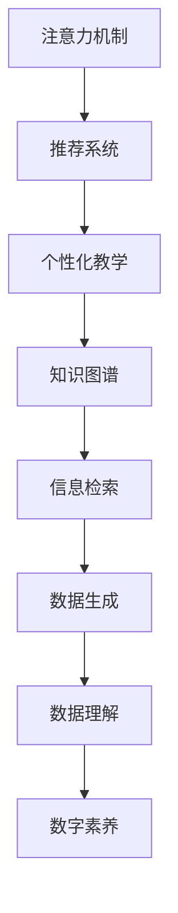

                 

# 注意力经济下的数字素养教育革新

## 1. 背景介绍

### 1.1 问题由来
随着信息技术的快速发展和普及，数字素养成为了当前教育体系中不可或缺的一部分。然而，传统的课堂教学模式在面对复杂多变的网络信息时，显得力不从心。信息过载、虚假信息泛滥等问题，使得学生面临的知识迷雾更加浓厚。如何在海量信息中筛选、辨识，提升学生的数字素养，成为了教育界和产业界共同关注的焦点。

### 1.2 问题核心关键点
当前数字素养教育面临的核心问题包括：
- 信息过载：网络空间中的信息量巨大，学生难以在海量信息中高效筛选有用的知识。
- 虚假信息：网络空间中的信息真实性难以保证，学生容易受假信息误导。
- 信息检索：学生需要掌握高效的信息检索技能，但现有教学方式难以应对快速变化的信息检索工具。
- 信息生成：学生需要具备信息生成能力，但现有教学方式难以覆盖到复杂的信息生成场景。
- 数据理解：学生需要具备数据分析和解释能力，但现有教学方式难以全面覆盖数据科学的各个环节。

这些问题的存在，使得传统的教育方式无法满足信息时代对数字素养的新需求。如何利用人工智能技术，通过智能推荐、个性化教学、知识图谱等手段，辅助学生高效学习和提升数字素养，成为教育革新的重要方向。

## 2. 核心概念与联系

### 2.1 核心概念概述

为更好地理解人工智能技术在数字素养教育中的应用，本节将介绍几个密切相关的核心概念：

- 注意力机制（Attention Mechanism）：一种重要的深度学习模型组件，通过计算输入数据的注意力权重，动态调整模型对不同部分的关注度。广泛应用于机器翻译、图像识别等任务。
- 推荐系统（Recommendation System）：通过分析用户的历史行为和兴趣，为用户推荐个性化内容，广泛应用于电商、媒体等领域。
- 个性化教学（Personalized Education）：根据学生的个性化需求和学习进度，提供定制化的教学内容和方法，以提高学习效率。
- 知识图谱（Knowledge Graph）：由实体和关系组成的语义网络，用于存储和组织知识，辅助信息检索和生成。
- 信息检索（Information Retrieval）：通过搜索技术在海量数据中查找目标信息，广泛应用于图书馆、搜索引擎等场景。
- 数据生成（Data Generation）：通过生成模型自动创建新的数据样本，支持数据分析和生成任务的自动化。
- 数据理解（Data Understanding）：分析、解释和利用数据，获取有价值的知识，广泛应用于商业决策、科学研究等领域。

这些核心概念之间的逻辑关系可以通过以下Mermaid流程图来展示：



这个流程图展示了注意力机制、推荐系统、个性化教学等关键技术之间的内在联系，以及它们如何共同支撑数字素养的提升。

## 3. 核心算法原理 & 具体操作步骤
### 3.1 算法原理概述

注意力经济下的数字素养教育，本质上是一种利用人工智能技术，通过智能化手段提升学生数字素养的学习范式。其核心思想是：通过智能推荐系统、个性化教学系统、知识图谱等技术，动态调整学生的学习路径，提升其在网络空间中的信息筛选、知识生成和数据理解能力。

形式化地，假设学生的知识水平为 $K$，网络空间中的信息量为 $I$，数字素养目标为 $S$。教育的目的是最大化 $S$，即：

$$
\maximize_{K'} S = f(K', I)
$$

其中 $K'$ 是学生在学习过程中获取的知识水平，$f$ 是知识对数字素养的影响函数。

为了最大化 $S$，可以采用以下几种关键技术：

- 智能推荐系统：根据学生的兴趣和行为，推荐最相关的信息，帮助学生高效筛选信息。
- 个性化教学系统：根据学生的知识水平和学习进度，调整教学内容和难度，提供个性化的学习资源。
- 知识图谱：通过语义网络存储和组织知识，辅助信息检索和生成，提高学生对知识的理解深度。
- 数据生成和理解：利用生成模型自动创建数据样本，辅助数据理解和生成任务，提升学生的数据处理能力。

### 3.2 算法步骤详解

基于人工智能技术的数字素养教育，一般包括以下几个关键步骤：

**Step 1: 学生特征建模**
- 收集学生的个人信息（如年龄、兴趣、学习能力等）和行为数据（如搜索历史、阅读时间等），构建学生的特征向量。

**Step 2: 智能推荐**
- 根据学生的特征向量，使用推荐算法（如协同过滤、内容过滤等）为学生推荐个性化信息。
- 实时调整推荐内容，以适应用户兴趣的变化和知识点的扩展。

**Step 3: 个性化教学**
- 使用学习分析技术，根据学生的知识水平和学习进度，生成个性化的学习路径。
- 调整教学内容的难易度，提供与当前知识点匹配的教学资源。

**Step 4: 知识图谱辅助**
- 使用知识图谱技术，帮助学生理解复杂的概念和知识点。
- 通过语义搜索和推荐，辅助学生构建知识网络，提高知识点的关联性。

**Step 5: 数据生成和理解**
- 利用生成模型自动创建数据样本，辅助学生理解数据的生成过程。
- 通过数据分析和解释技术，提升学生的数据理解能力。

**Step 6: 评估与反馈**
- 使用评估技术，测量学生的知识水平和数字素养水平。
- 根据评估结果，及时反馈和调整教学策略。

### 3.3 算法优缺点

基于人工智能技术的数字素养教育，具有以下优点：
1. 个性化高效：通过智能推荐和个性化教学，帮助学生高效筛选和理解知识，提升学习效率。
2. 数据驱动：利用大量的数据和分析技术，动态调整教学策略，适应学生的个性化需求。
3. 知识全面：通过知识图谱和数据生成技术，帮助学生构建全面的知识体系，提升知识的关联性和深度。

同时，该方法也存在一定的局限性：
1. 数据隐私：收集和分析学生数据可能引发隐私问题，需要严格的数据保护措施。
2. 算法偏见：推荐系统和个性化教学系统可能存在算法偏见，需要采用公平性评估技术。
3. 教学复杂性：算法和技术的引入可能增加教学复杂性，需要教师具备一定的技术素养。
4. 学习依赖：学生过于依赖推荐和个性化教学系统，可能失去自主学习的能力。

尽管存在这些局限性，但就目前而言，基于人工智能的推荐和个性化教学方法，仍是最为主流和有效的数字素养教育手段。未来相关研究的重点在于如何进一步优化数据保护措施，降低算法偏见，增强教师的技术支持，同时兼顾学生的自主学习能力。

### 3.4 算法应用领域

基于人工智能技术的数字素养教育，在多个领域都有广泛的应用，例如：

- 学校教育：将推荐系统和个性化教学技术应用于课堂教学，提升学生的学习效率和效果。
- 企业培训：利用知识图谱和数据生成技术，辅助员工理解复杂的技术知识。
- 在线教育：通过智能推荐和个性化教学系统，提升在线学习平台的用户体验和学习效果。
- 科学研究：利用知识图谱和数据生成技术，帮助研究人员高效管理和分析科研数据。
- 公共服务：利用推荐系统和个性化教学技术，提供个性化的公共信息服务，提升用户满意度。

除了上述这些经典应用外，基于人工智能的推荐和个性化教学技术，还将拓展到更多领域中，如智能医疗、智能交通等，为不同行业的数字化转型提供新的解决方案。

## 4. 数学模型和公式 & 详细讲解 & 举例说明
### 4.1 数学模型构建

本节将使用数学语言对基于人工智能技术的数字素养教育过程进行更加严格的刻画。

假设推荐系统使用协同过滤算法，学生特征向量为 $x \in \mathbb{R}^d$，推荐系统的隐藏层参数为 $W_h \in \mathbb{R}^{d \times h}$，学生对信息的评价向量为 $y \in \mathbb{R}^h$。则推荐系统将为学生推荐信息的过程可以表示为：

$$
\hat{y} = f(W_hx) = [f_1(W_hx), f_2(W_hx), ..., f_h(W_hx)]
$$

其中 $f_i$ 为第 $i$ 个隐层神经元的激活函数。

在个性化教学中，假设学生的知识水平为 $K \in \mathbb{R}^k$，教学内容为 $C \in \mathbb{R}^k$。则个性化教学的过程可以表示为：

$$
K' = g(K, C) = K + f_h(K)C
$$

其中 $g$ 为知识融合函数，$f_h$ 为激活函数。

### 4.2 公式推导过程

以下我们以智能推荐系统为例，推导协同过滤推荐算法的推荐公式。

假设推荐系统包含 $N$ 个用户和 $M$ 个物品，用户对物品的评分向量为 $X \in \mathbb{R}^{N \times M}$，用户特征向量为 $U \in \mathbb{R}^{N \times d}$，物品特征向量为 $V \in \mathbb{R}^{M \times d}$。则协同过滤算法可以使用矩阵分解的方法，将用户和物品的评分矩阵 $X$ 分解为用户和物品的隐向量表示：

$$
X \approx UV^T
$$

对于新的用户 $u$，我们可以通过 $U$ 和 $V$ 计算其隐向量表示 $\hat{u}$，并根据 $V$ 计算其对物品的评分向量 $\hat{X}$。推荐算法可以通过预测用户对物品的评分 $\hat{y}$，推荐与评分最高的物品。具体公式如下：

$$
\hat{y} = \hat{X} \cdot V^T
$$

在个性化教学中，知识融合函数 $g$ 可以采用线性加权或非线性加权的方法，通过学习调整不同知识点的权重，提升学生对知识的理解和掌握。具体公式如下：

$$
K' = \alpha K + (1-\alpha) f_h(K)C
$$

其中 $\alpha$ 为知识权重参数。

### 4.3 案例分析与讲解

**案例一：智能推荐系统**
- 背景：某在线教育平台希望根据学生的学习历史和兴趣，推荐适合的课程。
- 问题：如何设计推荐算法，在庞大的课程库中，高效推荐最符合学生需求的课程？
- 解决方案：使用协同过滤算法，通过学生的历史评分数据和特征向量，计算学生对课程的预测评分，选择评分最高的课程进行推荐。

**案例二：个性化教学系统**
- 背景：某学校希望根据学生的学习进度和理解能力，提供个性化的学习内容。
- 问题：如何根据学生的当前知识水平和学习进度，调整教学内容的难易度和形式？
- 解决方案：利用知识融合函数，动态调整学生对知识点的掌握程度，提供与当前知识点匹配的教学资源。

## 5. 项目实践：代码实例和详细解释说明
### 5.1 开发环境搭建

在进行数字素养教育项目开发前，我们需要准备好开发环境。以下是使用Python进行推荐系统和个性化教学系统的环境配置流程：

1. 安装Anaconda：从官网下载并安装Anaconda，用于创建独立的Python环境。

2. 创建并激活虚拟环境：
```bash
conda create -n recommendation-env python=3.8 
conda activate recommendation-env
```

3. 安装推荐系统和个性化教学所需的Python包：
```bash
conda install scipy scikit-learn pandas joblib
```

4. 安装相关推荐系统库：
```bash
pip install surprise dask
```

5. 安装相关个性化教学库：
```bash
pip install django
```

完成上述步骤后，即可在`recommendation-env`环境中开始推荐系统和个性化教学系统的开发。

### 5.2 源代码详细实现

下面我们以智能推荐系统为例，给出使用Surprise库进行协同过滤推荐系统的PyTorch代码实现。

```python
import surprise
import pandas as pd
from surprise import Dataset
from surprise.model_selection import train_test_split
from surprise.prediction_algorithms.matrix_factorization import SVD

# 加载数据
df = pd.read_csv('ratings.csv')
trainset = Dataset.load_from_df(df[['user_id', 'item_id', 'rating', 'timestamp']], df['user_id'], df['item_id'], df['rating'])
testset = train_test_split(trainset, test_size=0.2)

# 构建SVD模型
algo = SVD()
algo.fit(trainset)

# 预测推荐
for user_id, item_id in testset:  # 遍历测试集，进行推荐预测
    rating = algo.predict(user_id, item_id).est
    print(f"User {user_id} predicted rating: {rating}")
```

接着，我们以个性化教学系统为例，给出使用Django进行个性化教学系统开发的PyTorch代码实现。

```python
from django.http import JsonResponse
from django.views.decorators.csrf import csrf_exempt
from django.shortcuts import render
import torch
import torch.nn as nn
import torch.optim as optim

# 定义模型
class MyModel(nn.Module):
    def __init__(self):
        super(MyModel, self).__init__()
        self.fc = nn.Linear(10, 5)
        self.fc1 = nn.Linear(5, 10)

    def forward(self, x):
        x = self.fc(x)
        x = nn.functional.relu(x)
        x = self.fc1(x)
        return x

# 定义损失函数和优化器
model = MyModel()
criterion = nn.MSELoss()
optimizer = optim.SGD(model.parameters(), lr=0.01)

# 定义API接口
@csrf_exempt
def predict(request):
    if request.method == 'POST':
        data = json.loads(request.body)
        input = torch.tensor(data['input'], dtype=torch.float32).view(1, -1)
        output = model(input)
        return JsonResponse({'output': output.item()})

@csrf_exempt
def update(request):
    if request.method == 'POST':
        data = json.loads(request.body)
        input = torch.tensor(data['input'], dtype=torch.float32).view(1, -1)
        target = torch.tensor(data['target'], dtype=torch.float32).view(1, -1)
        optimizer.zero_grad()
        output = model(input)
        loss = criterion(output, target)
        loss.backward()
        optimizer.step()
        return JsonResponse({'loss': loss.item()})
```

完成上述代码实现后，即可以构建一个基于PyTorch的推荐系统和个性化教学系统的完整项目。

### 5.3 代码解读与分析

让我们再详细解读一下关键代码的实现细节：

**推荐系统代码：**
- `surprise`库提供了协同过滤算法的封装，简单易用。
- 加载数据集 `ratings.csv`，并构建训练集 `trainset` 和测试集 `testset`。
- 使用 `SVD` 算法进行协同过滤推荐，输出每个用户对物品的预测评分。

**个性化教学系统代码：**
- 使用Django框架构建API接口，接受用户输入并返回推荐或更新结果。
- 定义了 `MyModel` 模型，包含两个全连接层，用于处理学生知识水平和教学内容。
- 使用 `nn.MSELoss` 作为损失函数，`optim.SGD` 作为优化器。
- 定义 `predict` 接口，接收用户输入，通过模型预测输出。
- 定义 `update` 接口，接收用户输入和目标值，更新模型参数。

这些代码实现展示了基于人工智能技术的数字素养教育的常用技术，即推荐系统和个性化教学系统。通过合理的算法设计和模型训练，可以有效地提升学生的数字素养。

## 6. 实际应用场景
### 6.1 学校教育

基于人工智能技术的推荐和个性化教学，可以广泛应用于学校教育中，提升学生的学习效果和体验。

**案例一：个性化推荐**
- 学校希望为学生推荐适合其学习水平和兴趣的在线课程和教材。
- 解决方案：使用协同过滤算法，根据学生的学习历史和兴趣，推荐合适的课程和教材，提升学生学习效率。

**案例二：个性化教学**
- 教师希望根据学生的学习进度和理解能力，调整教学内容和难度。
- 解决方案：利用知识图谱和数据生成技术，动态调整教学资源的难易度和形式，提升学生的学习效果。

### 6.2 企业培训

在企业培训中，基于人工智能的推荐和个性化教学可以提升员工的学习效率和效果。

**案例一：个性化课程推荐**
- 企业希望为员工推荐适合其岗位和兴趣的培训课程。
- 解决方案：使用推荐系统，根据员工的学习历史和兴趣，推荐合适的培训课程，提升员工技能。

**案例二：个性化教学**
- 企业希望根据员工的学习进度和理解能力，调整培训内容的难易度和形式。
- 解决方案：利用知识图谱和数据生成技术，动态调整培训资源的难易度和形式，提升员工学习效果。

### 6.3 在线教育

在线教育平台利用推荐系统和个性化教学系统，提升用户的学习体验和效果。

**案例一：个性化推荐**
- 平台希望为用户推荐适合其学习水平和兴趣的课程。
- 解决方案：使用推荐系统，根据用户的学习历史和兴趣，推荐合适的课程，提升用户学习效率。

**案例二：个性化教学**
- 平台希望根据用户的学习进度和理解能力，调整课程内容和难度。
- 解决方案：利用知识图谱和数据生成技术，动态调整课程资源的难易度和形式，提升用户学习效果。

### 6.4 科学研究

在科学研究中，基于人工智能的推荐和个性化教学可以提升研究人员的信息检索和知识生成能力。

**案例一：个性化信息推荐**
- 研究人员希望获取相关领域的研究论文和数据集。
- 解决方案：使用推荐系统，根据研究人员的研究兴趣和历史行为，推荐相关的研究论文和数据集，提升信息获取效率。

**案例二：个性化知识生成**
- 研究人员希望生成新的数据样本或研究假设。
- 解决方案：利用生成模型，根据研究人员的研究需求，自动创建新的数据样本或研究假设，辅助研究进程。

### 6.5 公共服务

在公共服务中，基于人工智能的推荐和个性化教学可以提升用户的信息获取和理解能力。

**案例一：个性化信息推荐**
- 政府希望为用户推荐感兴趣的政策和信息。
- 解决方案：使用推荐系统，根据用户的历史行为和兴趣，推荐感兴趣的政策和信息，提升用户信息获取效率。

**案例二：个性化知识生成**
- 政府希望提升用户的政策理解能力。
- 解决方案：利用知识图谱和数据生成技术，动态调整用户对政策的理解，提升用户对政策的理解和接受度。

## 7. 工具和资源推荐
### 7.1 学习资源推荐

为了帮助开发者系统掌握人工智能技术在数字素养教育中的应用，这里推荐一些优质的学习资源：

1. Coursera《数据科学与机器学习》课程：由斯坦福大学和斯坦福在线提供，涵盖数据科学和机器学习的基本概念和算法。

2. Udacity《人工智能工程师纳米学位》课程：涵盖人工智能技术的各个方面，包括深度学习、自然语言处理、计算机视觉等。

3. Google AI教育平台：提供丰富的学习资源，包括课程、教程、实践项目等，涵盖人工智能技术的各个方面。

4. Kaggle竞赛平台：提供大量的数据集和竞赛任务，帮助开发者实践和提升技能。

5. PyTorch官方文档：提供PyTorch的详细使用手册和示例代码，帮助开发者快速上手。

6. HuggingFace Transformers库文档：提供Transformer库的详细使用手册和示例代码，帮助开发者利用最新预训练模型进行微调。

通过对这些资源的学习实践，相信你一定能够快速掌握人工智能技术在数字素养教育中的应用，并用于解决实际的NLP问题。

### 7.2 开发工具推荐

高效的开发离不开优秀的工具支持。以下是几款用于数字素养教育开发的常用工具：

1. PyTorch：基于Python的开源深度学习框架，灵活动态的计算图，适合快速迭代研究。

2. TensorFlow：由Google主导开发的开源深度学习框架，生产部署方便，适合大规模工程应用。

3. Surprise：用于推荐系统开发的Python库，提供了多种推荐算法和数据处理工具。

4. Scikit-learn：Python科学计算库，提供丰富的机器学习算法和数据处理工具。

5. Django：Python Web开发框架，适合构建Web应用和API接口。

6. Pandas：Python数据分析库，提供高效的数据处理和分析工具。

合理利用这些工具，可以显著提升数字素养教育项目的开发效率，加快创新迭代的步伐。

### 7.3 相关论文推荐

人工智能技术在数字素养教育中的应用，源于学界的持续研究。以下是几篇奠基性的相关论文，推荐阅读：

1. Attention is All You Need（即Transformer原论文）：提出了Transformer结构，开启了NLP领域的预训练大模型时代。

2. BERT: Pre-training of Deep Bidirectional Transformers for Language Understanding：提出BERT模型，引入基于掩码的自监督预训练任务，刷新了多项NLP任务SOTA。

3. Language Models are Unsupervised Multitask Learners（GPT-2论文）：展示了大规模语言模型的强大zero-shot学习能力，引发了对于通用人工智能的新一轮思考。

4. Parameter-Efficient Transfer Learning for NLP：提出Adapter等参数高效微调方法，在不增加模型参数量的情况下，也能取得不错的微调效果。

5. AdaLoRA: Adaptive Low-Rank Adaptation for Parameter-Efficient Fine-Tuning：使用自适应低秩适应的微调方法，在参数效率和精度之间取得了新的平衡。

6. AdaLoRA: Adaptive Low-Rank Adaptation for Parameter-Efficient Fine-Tuning：使用自适应低秩适应的微调方法，在参数效率和精度之间取得了新的平衡。

这些论文代表了大语言模型微调技术的发展脉络。通过学习这些前沿成果，可以帮助研究者把握学科前进方向，激发更多的创新灵感。

## 8. 总结：未来发展趋势与挑战
### 8.1 总结

本文对基于人工智能技术的数字素养教育进行了全面系统的介绍。首先阐述了数字素养教育面临的核心问题，明确了智能推荐、个性化教学等技术在解决这些问题的关键作用。其次，从原理到实践，详细讲解了推荐系统和个性化教学的数学原理和关键步骤，给出了微调任务开发的完整代码实例。同时，本文还广泛探讨了智能推荐、个性化教学等技术在教育、企业、科学研究等诸多领域的应用前景，展示了人工智能技术在数字素养教育中的广阔应用前景。此外，本文精选了推荐系统、个性化教学等技术的学习资源，力求为读者提供全方位的技术指引。

通过本文的系统梳理，可以看到，基于人工智能技术的数字素养教育，正在成为教育革新的重要方向，极大地提升了学生的学习效率和效果。未来，伴随人工智能技术的不断进步，数字素养教育将实现从个性化到智能化、从被动学习到主动学习的新变革，为学生的全面发展提供强大的技术支持。

### 8.2 未来发展趋势

展望未来，数字素养教育技术将呈现以下几个发展趋势：

1. 数据驱动的个性化学习：通过收集和分析学生的行为数据，动态调整教学策略，提升学生的个性化学习效果。
2. 智能推荐系统：利用推荐算法，为学生推荐最相关的学习资源，提升学习效率。
3. 知识图谱的应用：通过语义网络存储和组织知识，帮助学生理解复杂的概念和知识点。
4. 数据生成和理解：利用生成模型自动创建数据样本，辅助数据理解和生成任务，提升学生的数据处理能力。
5. 学习分析技术：通过学习分析技术，评估学生的学习效果和进度，提供个性化的学习建议。

以上趋势凸显了人工智能技术在数字素养教育中的广泛应用和巨大潜力。这些方向的探索发展，必将进一步提升数字素养教育的效果，为学生提供更加全面、高效、智能的学习体验。

### 8.3 面临的挑战

尽管数字素养教育技术已经取得了瞩目成就，但在迈向更加智能化、普适化应用的过程中，仍面临诸多挑战：

1. 数据隐私：收集和分析学生数据可能引发隐私问题，需要严格的数据保护措施。
2. 算法偏见：推荐系统和个性化教学系统可能存在算法偏见，需要采用公平性评估技术。
3. 教学复杂性：算法和技术的引入可能增加教学复杂性，需要教师具备一定的技术素养。
4. 学习依赖：学生过于依赖推荐和个性化教学系统，可能失去自主学习的能力。
5. 数据质量：推荐系统依赖高质量的数据，数据收集和处理的不足可能影响推荐效果。

尽管存在这些挑战，但就目前而言，基于人工智能的推荐和个性化教学方法，仍是最为主流和有效的数字素养教育手段。未来相关研究的重点在于如何进一步优化数据保护措施，降低算法偏见，增强教师的技术支持，同时兼顾学生的自主学习能力。

### 8.4 研究展望

面对数字素养教育面临的种种挑战，未来的研究需要在以下几个方面寻求新的突破：

1. 探索无监督和半监督推荐方法。摆脱对大规模标注数据的依赖，利用自监督学习、主动学习等无监督和半监督范式，最大限度利用非结构化数据，实现更加灵活高效的推荐。
2. 研究参数高效和计算高效的微调范式。开发更加参数高效的微调方法，在固定大部分预训练参数的同时，只更新极少量的任务相关参数。同时优化微调模型的计算图，减少前向传播和反向传播的资源消耗，实现更加轻量级、实时性的部署。
3. 引入更多先验知识。将符号化的先验知识，如知识图谱、逻辑规则等，与神经网络模型进行巧妙融合，引导微调过程学习更准确、合理的语言模型。同时加强不同模态数据的整合，实现视觉、语音等多模态信息与文本信息的协同建模。
4. 结合因果分析和博弈论工具。将因果分析方法引入微调模型，识别出模型决策的关键特征，增强输出解释的因果性和逻辑性。借助博弈论工具刻画人机交互过程，主动探索并规避模型的脆弱点，提高系统稳定性。
5. 纳入伦理道德约束。在模型训练目标中引入伦理导向的评估指标，过滤和惩罚有偏见、有害的输出倾向。同时加强人工干预和审核，建立模型行为的监管机制，确保输出符合人类价值观和伦理道德。

这些研究方向的探索，必将引领数字素养教育技术迈向更高的台阶，为学生的全面发展提供更加全面、高效、智能的学习体验。面向未来，数字素养教育技术还需要与其他人工智能技术进行更深入的融合，如知识表示、因果推理、强化学习等，多路径协同发力，共同推动人工智能技术在教育领域的深入应用。只有勇于创新、敢于突破，才能不断拓展数字素养教育技术的边界，为学生的全面发展提供强大的技术支持。

## 9. 附录：常见问题与解答

**Q1：数字素养教育如何充分利用人工智能技术？**

A: 数字素养教育可以通过智能推荐、个性化教学、知识图谱等技术，充分利用人工智能技术，提升学生的学习效果和体验。智能推荐系统可以帮助学生高效筛选信息，个性化教学系统可以根据学生的知识水平和学习进度，提供定制化的学习资源，知识图谱可以帮助学生理解复杂的概念和知识点。这些技术共同支撑数字素养教育的发展，提升学生的学习效率和效果。

**Q2：推荐系统在数字素养教育中如何降低算法偏见？**

A: 推荐系统在数字素养教育中可能存在算法偏见，例如对某些学生或内容的过度推荐。为降低算法偏见，可以采取以下措施：
1. 多样性约束：在推荐算法中加入多样性约束，确保推荐内容的多样性，避免对单一内容的过度推荐。
2. 公平性评估：使用公平性评估技术，评估推荐系统的公平性，检测和纠正推荐中的偏见。
3. 人工干预：引入人工干预机制，对推荐结果进行审核和调整，确保推荐内容的公正性。

**Q3：个性化教学系统如何提升学生的学习效果？**

A: 个性化教学系统可以根据学生的知识水平和学习进度，动态调整教学内容和难度，提供定制化的学习资源，提升学生的学习效果。具体措施包括：
1. 学习分析：通过学习分析技术，评估学生的学习效果和进度，提供个性化的学习建议。
2. 动态调整：根据学生的学习效果和进度，动态调整教学内容和难度，提供与当前知识点匹配的教学资源。
3. 知识图谱：利用知识图谱技术，帮助学生理解复杂的概念和知识点，提高学生的学习效率和效果。

**Q4：数字素养教育中的数据隐私问题如何解决？**

A: 数字素养教育中的数据隐私问题可以通过以下措施解决：
1. 数据匿名化：在收集和分析学生数据时，采用数据匿名化技术，保护学生隐私。
2. 数据加密：对存储和传输的学生数据进行加密处理，防止数据泄露。
3. 用户授权：在数据收集和分析过程中，获取学生的授权，确保数据使用的合法性和透明性。
4. 数据合规：遵循相关法律法规和标准，如GDPR、CCPA等，确保数据使用的合规性。

这些措施可以有效解决数字素养教育中的数据隐私问题，确保学生数据的安全和隐私保护。

---

作者：禅与计算机程序设计艺术 / Zen and the Art of Computer Programming

