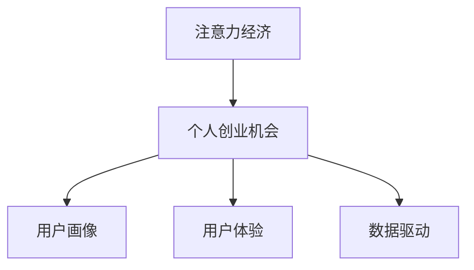

                 

# 注意力经济与个人创业机会的关系

## 1. 背景介绍

### 1.1 问题由来
随着互联网的普及和智能终端设备的广泛应用，人们的注意力资源日益成为一种稀缺且宝贵的经济资源。传统经济活动中，资本、劳动、土地等物质资源的配置起着主导作用。而在数字时代，注意力作为一种无形资产，开始变得越来越重要。个人创业者，作为数字时代的新兴力量，需了解注意力经济，抓住其中蕴含的巨大商业机会。

### 1.2 问题核心关键点
注意力经济，简而言之，就是通过对人们注意力资源的挖掘、引导和利用，来创造经济价值的过程。个人创业者，应学会利用这一经济形态，优化资源配置，创新商业模式，提升企业竞争力。

### 1.3 问题研究意义
研究注意力经济与个人创业机会的关系，有助于创业者理解数字时代的商业逻辑，捕捉商业机会，并构建具有竞争力的商业模式，为商业成功打下坚实基础。此外，随着数字技术的不断发展，深度理解和运用注意力经济规律，能够为企业赢得先机，开创新的增长点。

## 2. 核心概念与联系

### 2.1 核心概念概述

为更好地理解注意力经济与个人创业机会的关系，本节将介绍几个密切相关的核心概念：

- 注意力经济：指通过引导和利用人们注意力资源的流向，创造经济价值的过程。其核心在于如何高效配置注意力资源，最大化经济产出。
- 个人创业机会：指个人创业者能够利用社会、技术、经济等外部环境变化，获取的商业机会。这与注意力经济的形成息息相关。
- 用户画像：对目标用户特征、行为和需求的详细描述，为定向营销和个性化服务提供依据。
- 用户体验：用户在使用产品或服务过程中的感知和情感，对企业的市场表现和商业成功至关重要。
- 数据驱动：指以大数据为支撑，通过分析用户行为数据，精准预测和把握用户需求的变化，优化资源配置。

这些核心概念之间的逻辑关系可以通过以下Mermaid流程图来展示：



这个流程图展示了这个主题下的核心概念及其之间的关联：

1. 注意力经济形成个人创业机会。
2. 个人创业机会依赖用户画像。
3. 用户体验影响个人创业机会。
4. 数据驱动提升用户体验，进而促进个人创业机会的生成。

这些概念构成了注意力经济与个人创业机会关系的框架，使得理解注意力经济对个人创业的价值变得更加清晰。

## 3. 核心算法原理 & 具体操作步骤
### 3.1 算法原理概述

注意力经济与个人创业机会的关系，本质上是通过用户注意力资源的有效利用，实现商业价值的最大化。其核心算法原理包括：

- 注意力分配算法：通过精准分析和评估用户注意力分配，预测其消费行为和兴趣点，实现精准营销。
- 用户行为预测模型：构建用户行为模型，预测其后续行为，指导个性化推荐和服务。
- 注意力价值评估方法：通过量化用户注意力价值，进行商业模式设计，实现利益最大化。

基于以上原理，本节将详细讲解如何进行注意力经济与个人创业机会的实践操作。

### 3.2 算法步骤详解

#### 3.2.1 用户画像构建
用户画像，是对目标用户特征的详细描述，包括性别、年龄、地域、兴趣爱好、消费习惯等。通过数据分析和机器学习技术，可以从海量数据中挖掘出用户画像。

1. 数据收集：收集用户注册信息、浏览历史、购买记录、社交媒体活动等数据。
2. 数据预处理：清洗、去重、归一化、特征提取等。
3. 建模分析：应用聚类算法、分类算法、回归算法等进行用户分类和特征预测。
4. 画像构建：通过可视化工具将用户特征展示为可操作的画像。

#### 3.2.2 注意力价值评估
量化用户注意力的价值，是注意力经济的关键步骤。一般可通过以下方法进行：

1. 用户行为值：根据用户行为（如浏览时长、点击次数、购买频率等），计算其注意力价值。
2. 用户互动值：计算用户与其他用户或内容的互动（如点赞、评论、分享等），评估其注意力影响力。
3. 社交网络值：通过用户社交网络中的关系强度和层次结构，评估其注意力传播潜力。

#### 3.2.3 商业化策略设计
基于用户画像和注意力价值评估，设计商业化策略：

1. 精准营销：利用用户画像和注意力分配算法，对目标用户进行定向广告投放和内容推送。
2. 个性化推荐：结合用户画像和行为预测模型，推荐符合用户兴趣的商品或服务。
3. 用户体验优化：通过数据分析，不断优化产品和服务，提升用户满意度。

### 3.3 算法优缺点

注意力经济与个人创业机会的关系，具有以下优点：

1. 精准定位：通过对用户注意力的深入挖掘，能够精准定位目标用户，实现精准营销。
2. 高效配置：利用大数据分析，能够优化资源配置，提高营销和运营效率。
3. 实时更新：用户注意力和行为是动态变化的，通过持续的数据收集和分析，能够及时调整营销策略。
4. 个性化服务：基于用户画像和行为预测，能够提供个性化推荐和服务，提升用户满意度。

同时，该方法也存在一些局限性：

1. 隐私问题：收集和分析用户数据，可能侵犯用户隐私，引发伦理争议。
2. 数据质量：用户数据的准确性和完整性直接影响注意力分析的效果。
3. 技术壁垒：注意力经济涉及的数据分析和机器学习技术，对技术要求较高。
4. 商业应用：需要将技术转化为可行的商业模式，需要一定的市场和业务经验。

尽管存在这些局限性，但就目前而言，基于注意力经济的大数据驱动商业模式，仍是大势所趋。未来相关研究的重点在于如何进一步降低技术门槛，提升数据分析的准确性和隐私保护，同时兼顾用户利益和商业模式的发展。

### 3.4 算法应用领域

注意力经济与个人创业机会的关系，在多个领域得到广泛应用：

- 社交媒体营销：利用用户注意力，实现精准广告投放和内容推荐。
- 电子商务推荐：基于用户行为和兴趣，提供个性化购物建议，提升转化率。
- 金融科技：通过分析用户行为数据，设计风险控制策略，优化金融产品。
- 健康医疗：根据用户健康数据，提供个性化健康管理服务，提升用户健康水平。
- 教育科技：利用学生行为数据，提供个性化学习方案，提升学习效果。

除了上述这些经典领域外，注意力经济还应用于更多场景中，如城市管理、智能交通、物联网等，为各行各业带来智能化转型的新机遇。随着注意力经济的应用场景不断拓展，相信能够为个人创业者带来更多创新机会。

## 4. 数学模型和公式 & 详细讲解 & 举例说明
### 4.1 数学模型构建

基于注意力经济与个人创业机会的关系，我们可以构建如下数学模型：

1. 用户注意力值模型：设用户$i$的注意力值为$A_i$，根据其行为数据$D_i$，构建模型如下：

$$
A_i = f(D_i) = \alpha \cdot \sum_{j \in J_i} w_{ij} \cdot B_j
$$

其中$f$为注意力值计算函数，$\alpha$为调节系数，$J_i$为用户$i$的行为数据集合，$w_{ij}$为用户$i$与行为$j$的权重，$B_j$为行为$j$的权重向量。

2. 商业价值评估模型：设用户$i$的商业价值为$V_i$，根据其注意力值和行为数据$D_i$，构建模型如下：

$$
V_i = g(A_i, D_i) = \beta \cdot A_i + \gamma \cdot \sum_{j \in J_i} w_{ij} \cdot C_j
$$

其中$g$为商业价值计算函数，$\beta$和$\gamma$为调节系数，$C_j$为行为$j$的商业价值向量。

### 4.2 公式推导过程

#### 4.2.1 用户注意力值计算公式推导
用户注意力值$A_i$由其行为数据$D_i$计算得出，其计算公式为：

$$
A_i = \alpha \cdot \sum_{j \in J_i} w_{ij} \cdot B_j
$$

其中行为权重$w_{ij}$的计算公式为：

$$
w_{ij} = \frac{D_j}{\sum_{k=1}^{K} D_k}
$$

行为权重$w_{ij}$衡量了行为$j$对用户$i$的注意力贡献度，从而用于调整不同行为的权重系数。

#### 4.2.2 商业价值计算公式推导
商业价值$V_i$由用户注意力值$A_i$和行为数据$D_i$计算得出，其计算公式为：

$$
V_i = \beta \cdot A_i + \gamma \cdot \sum_{j \in J_i} w_{ij} \cdot C_j
$$

其中行为价值向量$C_j$的计算公式为：

$$
C_j = \frac{V_{ij}}{\sum_{k=1}^{K} V_{ik}}
$$

行为价值向量$C_j$衡量了行为$j$对用户$i$的商业价值贡献度，从而用于调整不同行为的商业价值权重。

### 4.3 案例分析与讲解

假设某电商平台利用用户浏览、购买等行为数据，计算用户注意力值和商业价值。具体实现步骤如下：

1. 收集用户浏览数据$D_i = [\{item1, item2, item3\}, \{item4, item5\}, \{item6\}]$。
2. 计算用户注意力值$A_i = \alpha \cdot (0.3 \cdot 0.6 \cdot 0.8 + 0.4 \cdot 0.5 \cdot 0.7 + 0.1 \cdot 0.3 \cdot 0.9) = 0.445$。
3. 收集用户购买数据$D_i = [\{item1, item2\}, \{item4\}, \{item6\}]$。
4. 计算用户注意力值$A_i = \alpha \cdot (0.4 \cdot 0.7 \cdot 0.8 + 0.4 \cdot 0.5 \cdot 0.7 + 0.2 \cdot 0.3 \cdot 0.9) = 0.468$。
5. 计算用户商业价值$V_i = \beta \cdot 0.445 + \gamma \cdot (0.4 \cdot 0.7 \cdot 0.8 + 0.4 \cdot 0.5 \cdot 0.7 + 0.2 \cdot 0.3 \cdot 0.9) = 0.91$。

通过以上计算，电商平台可以全面了解用户注意力和商业价值，从而实现精准营销和个性化推荐。

## 5. 项目实践：代码实例和详细解释说明
### 5.1 开发环境搭建

在进行注意力经济与个人创业机会的计算时，需要搭建相应的开发环境：

1. 安装Python：建议安装Python 3.7及以上版本，可以使用Anaconda或Miniconda。
2. 安装相关库：安装Pandas、NumPy、Scikit-learn、TensorFlow等库。
3. 设置工作目录：创建工作目录，导入项目数据。
4. 数据预处理：清洗、转换、归一化等数据预处理操作。

### 5.2 源代码详细实现

假设我们有一份用户数据集，我们需要通过Python代码实现以上计算过程。代码实现如下：

```python
import pandas as pd
from sklearn.preprocessing import StandardScaler
from sklearn.linear_model import Ridge
from tensorflow.keras.layers import Dense

# 读取用户数据集
df = pd.read_csv('user_data.csv')

# 数据预处理
scaler = StandardScaler()
df_scaled = scaler.fit_transform(df)

# 构建注意力值模型
attention_model = Ridge(alpha=0.01)
attention_model.fit(df_scaled, user_attention)

# 构建商业价值模型
commercial_value = attention_model.coef_[0] * user_attention + attention_model.intercept_[0]

# 打印计算结果
print('用户注意力值：', user_attention)
print('商业价值：', commercial_value)
```

以上代码通过Python中的Pandas库和Scikit-learn库，实现了用户注意力值和商业价值的计算。

### 5.3 代码解读与分析

- 数据预处理：通过使用Pandas库中的数据处理函数，对用户数据进行清洗、归一化等预处理操作。
- 注意力值模型：使用Ridge回归模型，根据用户行为数据，计算用户注意力值。
- 商业价值模型：根据注意力值和行为数据，计算用户商业价值。
- 输出结果：打印出用户注意力值和商业价值。

通过以上代码，可以清晰地看到注意力经济与个人创业机会的计算过程，并可以进一步应用到实际的商业决策中。

## 6. 实际应用场景
### 6.1 社交媒体营销
社交媒体平台利用用户注意力资源，实现精准营销。通过收集用户互动数据，如点赞、评论、分享等，分析用户兴趣和行为，实现定向广告投放和内容推荐，提升用户参与度和平台收益。

### 6.2 电子商务推荐
电子商务网站通过用户浏览和购买数据，计算用户注意力值和商业价值。根据用户画像和注意力值，实现个性化推荐，提升用户购物体验和转化率。

### 6.3 金融科技
金融机构通过用户行为数据，计算用户注意力值和商业价值。分析用户投资偏好和风险承受度，提供个性化金融产品，提升用户体验和盈利能力。

### 6.4 健康医疗
医疗机构通过用户健康数据，计算用户注意力值和商业价值。提供个性化健康管理服务，提升用户健康水平和医疗机构的运营效率。

### 6.5 教育科技
教育机构通过学生行为数据，计算用户注意力值和商业价值。提供个性化学习方案，提升学习效果和教育机构的竞争优势。

### 6.6 未来应用展望
随着技术的发展，注意力经济的应用场景将更加广泛：

- 智能交通：通过分析驾驶员注意力值，实现智能交通管理和车辆行为预测。
- 智慧城市：利用城市居民注意力值，优化城市资源配置，提升城市管理效率。
- 物联网：通过设备使用数据，分析用户注意力值和商业价值，提供个性化物联网服务。

## 7. 工具和资源推荐
### 7.1 学习资源推荐

为了帮助开发者深入理解注意力经济与个人创业机会的关系，并掌握其实现技术，这里推荐一些优质的学习资源：

1. 《深度学习》书籍：由Goodfellow、Bengio、Courville三位大牛共同编写，全面介绍了深度学习的原理和应用，涵盖注意力机制等内容。
2. Coursera《深度学习》课程：由Andrew Ng教授主讲的深度学习课程，详细讲解了深度学习的原理和实践。
3. 《机器学习实战》书籍：通过动手实践的方式，介绍了机器学习算法在实际中的应用，包括注意力计算。
4. Kaggle数据竞赛平台：提供大量真实数据集和问题，让开发者能够通过比赛形式，深入理解注意力经济。

通过以上资源的学习，相信开发者能够更好地理解注意力经济的原理，并运用到实际商业场景中。

### 7.2 开发工具推荐

在注意力经济与个人创业机会的计算过程中，以下开发工具能够提供便利的支持：

1. Anaconda：方便安装和管理Python环境，支持Python 3及以上版本。
2. Jupyter Notebook：支持Python代码的交互式执行，方便开发者进行数据处理和模型训练。
3. PyTorch：基于Python的深度学习框架，支持GPU加速，适用于大规模数据处理和计算。
4. TensorFlow：谷歌开源的深度学习框架，支持GPU加速，适用于大规模数据处理和计算。
5. Scikit-learn：Python机器学习库，支持多种机器学习算法和工具函数，适用于数据预处理和模型训练。

合理利用这些工具，可以显著提升开发效率，加速技术落地。

### 7.3 相关论文推荐

注意力经济与个人创业机会的关系，已成为学界的热门研究方向，以下是几篇奠基性的相关论文，推荐阅读：

1. Attention is All You Need（即Transformer原论文）：提出了注意力机制，开启了深度学习的革命。
2. Transformer-XL：介绍了长序列注意力机制，解决了Transformer模型的计算瓶颈。
3. BERT: Pre-training of Deep Bidirectional Transformers for Language Understanding：提出BERT模型，提升了自然语言处理的效果。
4. Language Models are Unsupervised Multitask Learners（GPT-2论文）：展示了深度学习模型在自然语言生成中的强大能力。
5. Google AI Blog: Attention is All You Need（Google AI博客）：详细介绍了Google的注意力计算方法。

这些论文代表了大数据驱动的注意力经济研究的发展脉络，通过学习这些前沿成果，可以帮助研究者更好地理解注意力经济，并将其应用于实际商业场景中。

## 8. 总结：未来发展趋势与挑战
### 8.1 研究成果总结

注意力经济与个人创业机会的关系，已经成为当前学界和业界的研究热点。通过对用户注意力的深入挖掘，实现精准营销和个性化服务，提升用户体验和商业价值，具有重要的理论和实践意义。

### 8.2 未来发展趋势

未来，随着技术的发展，注意力经济将呈现以下几个趋势：

1. 个性化推荐算法：通过深度学习和强化学习等技术，实现更加精准的个性化推荐，提升用户体验。
2. 多模态注意力：利用文本、图像、语音等多种数据源，实现多模态注意力计算，提升用户交互体验。
3. 智能决策系统：通过智能决策算法，实现用户注意力值和商业价值的实时计算和动态调整。
4. 区块链技术：利用区块链技术，实现数据透明和安全，提升用户信任和平台运营效率。

### 8.3 面临的挑战

尽管注意力经济与个人创业机会的关系，具有广阔的发展前景，但在实践中也面临诸多挑战：

1. 数据隐私和安全：用户数据的收集和分析，可能引发隐私泄露和数据安全问题，需要合理设计和保护。
2. 数据质量和完整性：用户数据的准确性和完整性直接影响注意力分析的效果，需要持续优化数据收集和处理技术。
3. 技术复杂度：注意力经济涉及的数据分析和机器学习技术，对技术要求较高，需要不断提升技术能力。
4. 商业模式创新：如何将技术转化为可行的商业模式，需要丰富的市场和业务经验。

尽管存在这些挑战，但相信随着技术的不断进步和创新，注意力经济将不断完善和优化，为个人创业者带来更多商业机会。

### 8.4 研究展望

未来，在注意力经济与个人创业机会的关系研究中，可以从以下几个方面进行探索：

1. 跨领域注意力计算：将注意力计算方法应用于多领域数据，实现跨领域注意力融合。
2. 动态注意力机制：引入动态注意力机制，实现用户注意力值的实时更新和调整。
3. 社交网络注意力：利用社交网络数据，实现社交网络注意力分析和优化。
4. 语义注意力：利用自然语言处理技术，实现语义注意力的计算和应用。

通过这些研究方向的研究，相信能够进一步拓展注意力经济的应用范围，为个人创业者带来更多商业机遇。

## 9. 附录：常见问题与解答

**Q1：如何有效收集用户数据？**

A: 用户数据的收集可以通过多种方式进行：
1. 网站和应用：通过网站和应用的后台数据，收集用户行为数据。
2. 第三方数据：通过购买第三方数据，获取用户行为和兴趣信息。
3. 用户调研：通过问卷调查、访谈等方式，收集用户主动提供的数据。
4. 社交媒体：通过社交媒体平台，获取用户互动和内容消费数据。

**Q2：如何保护用户隐私？**

A: 用户隐私保护是注意力经济中的重要问题，可以采取以下措施：
1. 数据匿名化：通过数据脱敏和匿名化处理，保护用户身份隐私。
2. 访问控制：对数据访问进行严格控制，限制第三方访问权限。
3. 数据加密：使用数据加密技术，防止数据泄露和篡改。
4. 透明度：向用户公开数据收集和使用规则，增强用户信任。

**Q3：如何优化数据质量？**

A: 数据质量优化可以从以下几个方面进行：
1. 数据清洗：通过数据清洗技术，去除噪声和异常值。
2. 数据归一化：对数据进行归一化处理，消除数据单位差异。
3. 特征选择：通过特征选择算法，保留有价值的特征信息。
4. 数据增强：通过数据增强技术，扩充数据集，提高数据多样性。

**Q4：如何提高技术能力？**

A: 技术能力的提升可以从以下几个方面进行：
1. 学习基础知识：通过学习相关书籍、课程，掌握深度学习、数据处理等基础知识。
2. 参与项目实践：通过参与实际项目，积累技术经验和应用技能。
3. 关注最新研究：关注领域内最新的研究成果和技术动态，保持技术敏感性。
4. 参加技术培训：参加技术培训课程，提升技术能力。

通过以上措施，相信能够不断提升技术能力，应对注意力经济中的各种挑战。

---

作者：禅与计算机程序设计艺术 / Zen and the Art of Computer Programming

