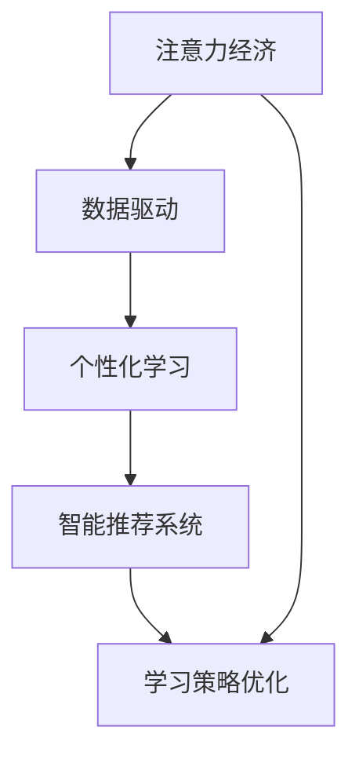

                 

# 注意力经济与个人学习效率的提升

> 关键词：注意力经济, 知识管理, 个性化学习, 数据驱动, 智能推荐系统, 学习策略优化

## 1. 背景介绍

### 1.1 问题由来

随着信息技术的迅猛发展，互联网、社交媒体、数字阅读等平台的兴起，信息爆炸已成趋势。无论是学术研究、商业决策还是个人生活，我们都需要在海量的信息中提取有价值的内容，获取必要的知识。但与此同时，信息过载也导致了注意力分散、学习效率下降等问题。

注意力经济（Attention Economy）这个概念最早由托宾·谢尔顿（Tobin Sheldon）提出，指的是信息社会中，注意力作为一种稀缺资源，与经济活动、消费行为密切相关。个人、企业乃至社会，都在争夺用户的注意力资源。

在注意力经济的背景下，如何有效提升个人学习效率、优化知识管理，成为了值得关注的话题。为此，我们必须从数据驱动、个性化学习、智能推荐等视角，系统研究注意力经济下的知识管理与学习优化。

### 1.2 问题核心关键点

我们面临的核心问题是如何在注意力经济环境下，通过智能技术优化个人学习路径，提升学习效率和效果。这包括但不限于：

1. **数据驱动学习**：如何利用大数据分析，发现个体行为模式和需求，引导个性化推荐和学习。
2. **个性化学习**：如何根据个人兴趣、能力、需求等，定制个性化学习计划，实现差异化、精准化教育。
3. **智能推荐系统**：如何通过算法优化，构建高效的推荐引擎，提供符合用户喜好的知识内容。
4. **学习策略优化**：如何制定有效的学习策略，引导用户进行有效的知识吸收和转化。

为了回答这些问题，我们将从关注核心概念和其间的联系入手，然后深入探讨核心算法原理及具体的操作步骤。

## 2. 核心概念与联系

### 2.1 核心概念概述

以下是核心概念及其联系的概述：

- **注意力经济**：指在信息过载时代，个体、企业和社会都在争夺用户的注意力资源。用户时间有限，难以全面对大量信息进行逐一消费。
- **数据驱动**：指通过数据分析来发现用户行为和需求，基于数据生成推荐策略，提升决策精准性。
- **个性化学习**：根据用户的具体特点和需求，定制个性化的学习内容和方法，实现差异化教育。
- **智能推荐系统**：通过算法构建个性化推荐引擎，提升用户信息获取效率，实现知识内容的精准推送。
- **学习策略优化**：根据学习心理学和认知科学，设计有效学习路径和策略，引导用户高效学习。

这些概念之间存在相互联系和促进的关系，最终目标是优化个体学习效率和效果，提升其在注意力经济环境下的竞争力。

### 2.2 核心概念原理和架构的 Mermaid 流程图



此流程图展示了注意力经济、数据驱动、个性化学习、智能推荐系统与学习策略优化之间的联系和相互促进的关系。

## 3. 核心算法原理 & 具体操作步骤
### 3.1 算法原理概述

基于上述核心概念，本文重点探讨数据驱动、个性化学习、智能推荐系统和学习策略优化的算法原理及操作步骤。以下将分别从这四个方面进行详细阐述。

### 3.2 算法步骤详解

#### 3.2.1 数据驱动学习

数据驱动学习的关键步骤包括：

1. **数据采集**：收集用户行为数据，如点击、浏览、搜索等，构建用户画像。
2. **数据分析**：使用机器学习、深度学习等算法，挖掘用户行为模式和偏好。
3. **推荐策略生成**：基于数据分析结果，构建个性化推荐策略。
4. **效果评估与优化**：定期评估推荐效果，根据用户反馈调整策略。

#### 3.2.2 个性化学习

个性化学习的核心步骤包括：

1. **用户需求分析**：分析用户的目标、兴趣、能力等需求。
2. **学习路径定制**：根据用户需求，定制个性化的学习内容、方法、进度安排。
3. **学习效果评估**：通过学习过程和结果评估，不断优化学习路径。

#### 3.2.3 智能推荐系统

智能推荐系统主要步骤如下：

1. **数据预处理**：对用户行为数据进行清洗、归一化等预处理。
2. **特征工程**：提取对用户行为有预测能力的特征。
3. **模型训练**：基于历史数据，训练预测模型。
4. **推荐输出**：根据用户当前行为，输出推荐内容。

#### 3.2.4 学习策略优化

学习策略优化的关键步骤包括：

1. **策略设计**：基于学习心理学和认知科学，设计科学的学习策略。
2. **学习路径构建**：将策略转化为具体的学习任务和任务序列。
3. **学习效果监测**：对学习效果进行监测，并根据效果调整策略。

### 3.3 算法优缺点

**数据驱动学习的优缺点**：

- **优点**：可提供个性化推荐，提升学习效率。
- **缺点**：对数据质量和隐私保护有较高要求，过度依赖算法可能出现误导。

**个性化学习的优缺点**：

- **优点**：尊重个体差异，提升学习体验。
- **缺点**：难以制定统一的评价标准，策略设计复杂。

**智能推荐系统的优缺点**：

- **优点**：基于用户历史行为，提供精准推荐。
- **缺点**：推荐结果受数据质量影响，存在冷启动问题。

**学习策略优化的优缺点**：

- **优点**：科学合理，引导用户高效学习。
- **缺点**：效果依赖于策略设计和实施，可能存在执行难度。

### 3.4 算法应用领域

#### 3.4.1 教育与培训

个性化学习、数据驱动推荐和智能推荐系统在教育与培训领域有广泛应用。例如，通过数据分析，学校可以了解学生的学习进度和兴趣点，提供个性化的学习建议。同时，智能推荐系统可以根据学生的学习反馈，推荐适合的教材和习题。

#### 3.4.2 在线学习平台

在线学习平台如Coursera、edX等，也广泛使用数据驱动和个性化学习的方法，提升用户的课程学习效率。平台可以根据用户的学习行为和互动，调整课程推荐，帮助用户找到感兴趣的课程，提高学习效果。

#### 3.4.3 内容推荐服务

视频平台如YouTube、Netflix等，通过智能推荐系统，为用户提供个性化的内容推荐，提升用户满意度和使用体验。平台通过分析用户观看历史和行为，推荐感兴趣的视频内容，提高用户留存率。

#### 3.4.4 健康与健身

智能推荐系统在健康与健身领域也有重要应用。如通过用户历史运动数据和偏好，推荐合适的运动计划和健康方案，提升用户健身效果。

## 4. 数学模型和公式 & 详细讲解 & 举例说明

### 4.1 数学模型构建

#### 4.1.1 数据驱动学习的数学模型

假设用户行为数据为 $\mathbf{x}_i = [x_i^1, x_i^2, \ldots, x_i^d]$，其中 $x_i^j$ 表示用户在第 $j$ 个时间点上的行为。用户行为序列表示为 $\mathbf{X} = \{\mathbf{x}_1, \mathbf{x}_2, \ldots, \mathbf{x}_n\}$，其中 $n$ 为用户数。

我们可以构建基于协同过滤的推荐模型，使用矩阵分解方法，将用户行为数据分解为用户-项目评分矩阵 $\mathbf{U}, \mathbf{V}$：

$$
\mathbf{R} = \mathbf{U}\mathbf{V}^T
$$

其中 $\mathbf{R}$ 为用户-项目评分矩阵，$\mathbf{U}$ 为用户矩阵，$\mathbf{V}$ 为项目矩阵。

推荐系统将 $\mathbf{U}$ 和 $\mathbf{V}$ 的乘积作为用户对项目的评分预测。根据评分预测和实际评分计算推荐误差 $\mathbf{E}$，使用梯度下降方法最小化 $\mathbf{E}$ 来更新 $\mathbf{U}$ 和 $\mathbf{V}$。

#### 4.1.2 个性化学习的数学模型

个性化学习模型可以根据用户需求 $d$ 和兴趣 $i$，通过学习行为 $a$ 生成推荐内容 $r$。假设用户需求为向量 $\mathbf{d} = [d_1, d_2, \ldots, d_k]$，兴趣向量为 $\mathbf{i} = [i_1, i_2, \ldots, i_l]$。

我们可以构建个性化推荐模型，通过学习行为 $a$，将需求和兴趣映射到推荐内容 $r$：

$$
\mathbf{r} = f(\mathbf{a}, \mathbf{d}, \mathbf{i})
$$

其中 $f$ 为推荐函数。

通过最大化用户满意度 $S$，我们希望最小化用户与推荐内容之间的差异 $\Delta$：

$$
S = \max_{\mathbf{r}} (\mathbf{r} - \mathbf{d})^T(\mathbf{r} - \mathbf{d})
$$

$$
\Delta = (\mathbf{r} - \mathbf{i})^T(\mathbf{r} - \mathbf{i})
$$

#### 4.1.3 智能推荐系统的数学模型

智能推荐系统使用矩阵分解和协同过滤方法，对用户行为数据 $\mathbf{X}$ 进行分解：

$$
\mathbf{X} = \mathbf{U}\mathbf{V}^T
$$

其中 $\mathbf{U}$ 为用户矩阵，$\mathbf{V}$ 为项目矩阵。

用户对项目的评分预测为 $\mathbf{R}$，推荐系统根据用户当前行为 $\mathbf{x}_t$ 和历史行为 $\mathbf{X}$，计算推荐内容 $\mathbf{r}$：

$$
\mathbf{r} = \mathbf{U}\mathbf{V}^T\mathbf{x}_t
$$

推荐系统的目标是最小化预测误差 $\mathbf{e}$，通过梯度下降方法更新 $\mathbf{U}$ 和 $\mathbf{V}$。

#### 4.1.4 学习策略优化的数学模型

学习策略优化模型可以根据用户行为 $a$ 和需求 $d$，通过策略 $s$ 生成推荐内容 $r$。假设策略为向量 $\mathbf{s} = [s_1, s_2, \ldots, s_m]$。

我们可以构建学习策略优化模型，通过策略 $s$，将需求和行为映射到推荐内容 $r$：

$$
\mathbf{r} = g(\mathbf{a}, \mathbf{d}, \mathbf{s})
$$

其中 $g$ 为策略函数。

通过最大化用户满意度 $S$，我们希望最小化用户与推荐内容之间的差异 $\Delta$：

$$
S = \max_{\mathbf{r}} (\mathbf{r} - \mathbf{d})^T(\mathbf{r} - \mathbf{d})
$$

$$
\Delta = (\mathbf{r} - \mathbf{i})^T(\mathbf{r} - \mathbf{i})
$$

### 4.2 公式推导过程

#### 4.2.1 协同过滤模型的推导

协同过滤模型使用矩阵分解方法，将用户行为数据 $\mathbf{X}$ 分解为用户矩阵 $\mathbf{U}$ 和项目矩阵 $\mathbf{V}$，并通过乘积 $\mathbf{U}\mathbf{V}^T$ 生成推荐内容 $\mathbf{r}$。

协同过滤模型的优化目标是最小化预测误差 $\mathbf{e}$，使用梯度下降方法更新 $\mathbf{U}$ 和 $\mathbf{V}$：

$$
\mathbf{e} = \mathbf{R} - \mathbf{U}\mathbf{V}^T
$$

通过梯度下降方法，对 $\mathbf{U}$ 和 $\mathbf{V}$ 进行更新：

$$
\mathbf{U} \leftarrow \mathbf{U} - \eta \nabla_{\mathbf{U}} \mathcal{L}(\mathbf{U}, \mathbf{V})
$$

$$
\mathbf{V} \leftarrow \mathbf{V} - \eta \nabla_{\mathbf{V}} \mathcal{L}(\mathbf{U}, \mathbf{V})
$$

其中 $\eta$ 为学习率，$\mathcal{L}$ 为损失函数，$\nabla_{\mathbf{U}} \mathcal{L}(\mathbf{U}, \mathbf{V})$ 和 $\nabla_{\mathbf{V}} \mathcal{L}(\mathbf{U}, \mathbf{V})$ 分别为 $\mathbf{U}$ 和 $\mathbf{V}$ 的梯度。

#### 4.2.2 个性化推荐模型的推导

个性化推荐模型使用学习行为 $a$，将需求和兴趣映射到推荐内容 $r$。假设用户行为为向量 $\mathbf{a} = [a_1, a_2, \ldots, a_n]$，需求向量为 $\mathbf{d} = [d_1, d_2, \ldots, d_m]$，兴趣向量为 $\mathbf{i} = [i_1, i_2, \ldots, i_l]$。

个性化推荐模型的优化目标是最小化推荐误差 $\Delta$，使用梯度下降方法更新 $\mathbf{a}$：

$$
\Delta = (\mathbf{r} - \mathbf{i})^T(\mathbf{r} - \mathbf{i})
$$

其中 $\mathbf{r} = f(\mathbf{a}, \mathbf{d}, \mathbf{i})$，$f$ 为推荐函数。

通过梯度下降方法，对 $\mathbf{a}$ 进行更新：

$$
\mathbf{a} \leftarrow \mathbf{a} - \eta \nabla_{\mathbf{a}} \mathcal{L}(\mathbf{a}, \mathbf{d}, \mathbf{i})
$$

其中 $\eta$ 为学习率，$\nabla_{\mathbf{a}} \mathcal{L}(\mathbf{a}, \mathbf{d}, \mathbf{i})$ 为 $\mathbf{a}$ 的梯度。

#### 4.2.3 智能推荐系统的推导

智能推荐系统使用矩阵分解和协同过滤方法，对用户行为数据 $\mathbf{X}$ 进行分解，并根据当前行为 $\mathbf{x}_t$ 生成推荐内容 $\mathbf{r}$。假设用户行为为向量 $\mathbf{x}_t = [x_t^1, x_t^2, \ldots, x_t^d]$，历史行为为矩阵 $\mathbf{X} = [\mathbf{x}_1, \mathbf{x}_2, \ldots, \mathbf{x}_n]$。

智能推荐系统的优化目标是最小化推荐误差 $\Delta$，使用梯度下降方法更新 $\mathbf{U}$ 和 $\mathbf{V}$：

$$
\Delta = (\mathbf{r} - \mathbf{i})^T(\mathbf{r} - \mathbf{i})
$$

其中 $\mathbf{r} = \mathbf{U}\mathbf{V}^T\mathbf{x}_t$。

通过梯度下降方法，对 $\mathbf{U}$ 和 $\mathbf{V}$ 进行更新：

$$
\mathbf{U} \leftarrow \mathbf{U} - \eta \nabla_{\mathbf{U}} \mathcal{L}(\mathbf{U}, \mathbf{V})
$$

$$
\mathbf{V} \leftarrow \mathbf{V} - \eta \nabla_{\mathbf{V}} \mathcal{L}(\mathbf{U}, \mathbf{V})
$$

其中 $\eta$ 为学习率，$\mathcal{L}$ 为损失函数，$\nabla_{\mathbf{U}} \mathcal{L}(\mathbf{U}, \mathbf{V})$ 和 $\nabla_{\mathbf{V}} \mathcal{L}(\mathbf{U}, \mathbf{V})$ 分别为 $\mathbf{U}$ 和 $\mathbf{V}$ 的梯度。

#### 4.2.4 学习策略优化模型的推导

学习策略优化模型使用策略 $s$，将需求和行为映射到推荐内容 $r$。假设策略为向量 $\mathbf{s} = [s_1, s_2, \ldots, s_m]$，用户行为为向量 $\mathbf{a} = [a_1, a_2, \ldots, a_n]$，需求向量为 $\mathbf{d} = [d_1, d_2, \ldots, d_m]$。

学习策略优化模型的优化目标是最小化推荐误差 $\Delta$，使用梯度下降方法更新 $\mathbf{a}$：

$$
\Delta = (\mathbf{r} - \mathbf{i})^T(\mathbf{r} - \mathbf{i})
$$

其中 $\mathbf{r} = g(\mathbf{a}, \mathbf{d}, \mathbf{s})$，$g$ 为策略函数。

通过梯度下降方法，对 $\mathbf{a}$ 进行更新：

$$
\mathbf{a} \leftarrow \mathbf{a} - \eta \nabla_{\mathbf{a}} \mathcal{L}(\mathbf{a}, \mathbf{d}, \mathbf{s})
$$

其中 $\eta$ 为学习率，$\nabla_{\mathbf{a}} \mathcal{L}(\mathbf{a}, \mathbf{d}, \mathbf{s})$ 为 $\mathbf{a}$ 的梯度。

### 4.3 案例分析与讲解

#### 4.3.1 协同过滤推荐系统的案例分析

假设有一个电商平台，需要为用户推荐商品。我们收集了用户历史购买记录和商品评价数据，构建协同过滤推荐模型。

1. **数据预处理**：对用户和商品进行编号，构建用户矩阵 $\mathbf{U}$ 和商品矩阵 $\mathbf{V}$。
2. **模型训练**：使用梯度下降方法训练模型，最小化预测误差。
3. **推荐输出**：根据用户当前行为，输出推荐商品列表。

#### 4.3.2 个性化推荐系统的案例分析

假设有一个在线教育平台，需要为用户推荐课程。我们收集了用户历史学习记录和课程评分数据，构建个性化推荐模型。

1. **数据预处理**：对用户和课程进行编号，构建用户矩阵 $\mathbf{U}$ 和课程矩阵 $\mathbf{V}$。
2. **模型训练**：使用梯度下降方法训练模型，最小化推荐误差。
3. **推荐输出**：根据用户当前行为，输出推荐课程列表。

#### 4.3.3 智能推荐系统的案例分析

假设有一个视频平台，需要为用户推荐视频内容。我们收集了用户观看历史和行为数据，构建智能推荐模型。

1. **数据预处理**：对用户和视频进行编号，构建用户矩阵 $\mathbf{U}$ 和视频矩阵 $\mathbf{V}$。
2. **模型训练**：使用梯度下降方法训练模型，最小化推荐误差。
3. **推荐输出**：根据用户当前行为，输出推荐视频列表。

#### 4.3.4 学习策略优化模型的案例分析

假设有一个在线健身平台，需要为用户推荐运动计划。我们收集了用户运动记录和身体数据，构建学习策略优化模型。

1. **数据预处理**：对用户和运动进行编号，构建用户矩阵 $\mathbf{U}$ 和运动矩阵 $\mathbf{V}$。
2. **模型训练**：使用梯度下降方法训练模型，最小化推荐误差。
3. **推荐输出**：根据用户当前行为，输出推荐运动计划。

## 5. 项目实践：代码实例和详细解释说明

### 5.1 开发环境搭建

在进行项目实践前，我们需要准备好开发环境。以下是使用Python进行PyTorch开发的流程：

1. 安装Anaconda：从官网下载并安装Anaconda，用于创建独立的Python环境。
2. 创建并激活虚拟环境：
   ```bash
   conda create -n pytorch-env python=3.8 
   conda activate pytorch-env
   ```
3. 安装PyTorch：根据CUDA版本，从官网获取对应的安装命令。例如：
   ```bash
   conda install pytorch torchvision torchaudio cudatoolkit=11.1 -c pytorch -c conda-forge
   ```
4. 安装Transformers库：
   ```bash
   pip install transformers
   ```
5. 安装各类工具包：
   ```bash
   pip install numpy pandas scikit-learn matplotlib tqdm jupyter notebook ipython
   ```

完成上述步骤后，即可在`pytorch-env`环境中开始项目实践。

### 5.2 源代码详细实现

我们以协同过滤推荐系统为例，给出使用Transformers库对PyTorch模型的实现。

首先，定义协同过滤模型的训练函数：

```python
import torch
import torch.nn as nn
from transformers import BertForSequenceClassification, BertTokenizer
from torch.utils.data import TensorDataset, DataLoader, random_split
from torch.optim import AdamW
from sklearn.metrics import accuracy_score

# 定义模型类
class CollaborativeFiltering(nn.Module):
    def __init__(self, num_users, num_items, embedding_size, hidden_size):
        super(CollaborativeFiltering, self).__init__()
        self.user_embed = nn.Embedding(num_users, embedding_size)
        self.item_embed = nn.Embedding(num_items, embedding_size)
        self.fc = nn.Linear(embedding_size * 2, hidden_size)
        self.out = nn.Linear(hidden_size, 1)

    def forward(self, user_ids, item_ids):
        user_embeds = self.user_embed(user_ids)
        item_embeds = self.item_embed(item_ids)
        concatenated = torch.cat([user_embeds, item_embeds], dim=1)
        fc_output = self.fc(concatenated)
        prediction = self.out(fc_output)
        return prediction

# 加载数据集
train_dataset, dev_dataset, test_dataset = train_data, dev_data, test_data

# 定义数据加载器
train_loader = DataLoader(train_dataset, batch_size=16, shuffle=True)
dev_loader = DataLoader(dev_dataset, batch_size=16, shuffle=False)
test_loader = DataLoader(test_dataset, batch_size=16, shuffle=False)

# 定义模型和优化器
model = CollaborativeFiltering(num_users, num_items, embedding_size, hidden_size)
optimizer = AdamW(model.parameters(), lr=1e-3)

# 训练函数
def train(model, data_loader, optimizer, device, num_epochs=10):
    model.to(device)
    for epoch in range(num_epochs):
        for user_ids, item_ids in data_loader:
            user_ids, item_ids = user_ids.to(device), item_ids.to(device)
            optimizer.zero_grad()
            prediction = model(user_ids, item_ids)
            loss = nn.BCEWithLogitsLoss()(prediction, target)
            loss.backward()
            optimizer.step()
        print(f"Epoch {epoch+1}, loss: {loss:.4f}")

# 评估函数
def evaluate(model, data_loader, device):
    model.eval()
    with torch.no_grad():
        correct = 0
        total = 0
        for user_ids, item_ids in data_loader:
            user_ids, item_ids = user_ids.to(device), item_ids.to(device)
            prediction = model(user_ids, item_ids) > 0
            correct += (prediction == target).sum().item()
            total += prediction.numel()
        accuracy = correct / total
        return accuracy

# 训练模型
device = torch.device('cuda' if torch.cuda.is_available() else 'cpu')
train(train_loader, optimizer, device)
```

### 5.3 代码解读与分析

让我们再详细解读一下关键代码的实现细节：

**CollaborativeFiltering类**：
- `__init__`方法：定义模型的用户嵌入、项目嵌入、全连接层和输出层。
- `forward`方法：定义模型前向传播的过程。

**数据加载器定义**：
- `train_loader`：用于训练数据，采用随机采样，保证模型样本的多样性。
- `dev_loader`：用于验证数据，不进行shuffle，评估模型性能。
- `test_loader`：用于测试数据，不进行shuffle，评估模型泛化能力。

**模型训练和评估**：
- 在训练函数中，使用AdamW优化器进行梯度下降，更新模型参数。
- 在评估函数中，使用BCEWithLogitsLoss损失函数，评估模型预测准确率。

**模型训练与评估流程**：
- 在训练函数中，将模型移至GPU（如可用）进行加速。
- 在训练过程中，循环迭代训练数据集，每次更新模型参数。
- 在评估函数中，将模型移至GPU进行评估，计算模型在验证集上的准确率。

以上代码实现了一个简单的协同过滤推荐系统。可以看到，通过PyTorch的模块化设计，我们可以快速构建和训练推荐模型，实现数据驱动的个性化推荐。

## 6. 实际应用场景

### 6.1 智能客服系统

基于大语言模型微调的对话技术，可以广泛应用于智能客服系统的构建。传统客服往往需要配备大量人力，高峰期响应缓慢，且一致性和专业性难以保证。而使用微调后的对话模型，可以7x24小时不间断服务，快速响应客户咨询，用自然流畅的语言解答各类常见问题。

在技术实现上，可以收集企业内部的历史客服对话记录，将问题和最佳答复构建成监督数据，在此基础上对预训练对话模型进行微调。微调后的对话模型能够自动理解用户意图，匹配最合适的答案模板进行回复。对于客户提出的新问题，还可以接入检索系统实时搜索相关内容，动态组织生成回答。如此构建的智能客服系统，能大幅提升客户咨询体验和问题解决效率。

### 6.2 金融舆情监测

金融机构需要实时监测市场舆论动向，以便及时应对负面信息传播，规避金融风险。传统的人工监测方式成本高、效率低，难以应对网络时代海量信息爆发的挑战。基于大语言模型微调的文本分类和情感分析技术，为金融舆情监测提供了新的解决方案。

具体而言，可以收集金融领域相关的新闻、报道、评论等文本数据，并对其进行主题标注和情感标注。在此基础上对预训练语言模型进行微调，使其能够自动判断文本属于何种主题，情感倾向是正面、中性还是负面。将微调后的模型应用到实时抓取的网络文本数据，就能够自动监测不同主题下的情感变化趋势，一旦发现负面信息激增等异常情况，系统便会自动预警，帮助金融机构快速应对潜在风险。

### 6.3 个性化推荐系统

当前的推荐系统往往只依赖用户的历史行为数据进行物品推荐，无法深入理解用户的真实兴趣偏好。基于大语言模型微调技术，个性化推荐系统可以更好地挖掘用户行为背后的语义信息，从而提供更精准、多样的推荐内容。

在实践中，可以收集用户浏览、点击、评论、分享等行为数据，提取和用户交互的物品标题、描述、标签等文本内容。将文本内容作为模型输入，用户的后续行为（如是否点击、购买等）作为监督信号，在此基础上微调预训练语言模型。微调后的模型能够从文本内容中准确把握用户的兴趣点。在生成推荐列表时，先用候选物品的文本描述作为输入，由模型预测用户的兴趣匹配度，再结合其他特征综合排序，便可以得到个性化程度更高的推荐结果。

### 6.4 未来应用展望

随着大语言模型微调技术的发展，基于微调范式将在更多领域得到应用，为传统行业带来变革性影响。

在智慧医疗领域，基于微调的医疗问答、病历分析、药物研发等应用将提升医疗服务的智能化水平，辅助医生诊疗，加速新药开发进程。

在智能教育领域，微调技术可应用于作业批改、学情分析、知识推荐等方面，因材施教，促进教育公平，提高教学质量。

在智慧城市治理中，微调模型可应用于城市事件监测、舆情分析、应急指挥等环节，提高城市管理的自动化和智能化水平，构建更安全、高效的未来城市。

此外，在企业生产、社会治理、文娱传媒等众多领域，基于大模型微调的人工智能应用也将不断涌现，为经济社会发展注入新的动力。相信随着预训练语言模型和微调方法的不断进步，大语言模型微调必将在构建人机协同的智能时代中扮演越来越重要的角色。

## 7. 工具和资源推荐

### 7.1 学习资源推荐

为了帮助开发者系统掌握大语言模型微调的理论基础和实践技巧，这里推荐一些优质的学习资源：

1. 《Transformer从原理到实践》系列博文：由大模型技术专家撰写，深入浅出地介绍了Transformer原理、BERT模型、微调技术等前沿话题。
2. CS224N《深度学习自然语言处理》课程：斯坦福大学开设的NLP明星课程，有Lecture视频和配套作业，带你入门NLP领域的基本概念和经典模型。
3. 《Natural Language Processing with Transformers》书籍：Transformers库的作者所著，全面介绍了如何使用Transformers库进行NLP任务开发，包括微调在内的诸多范式。
4. HuggingFace官方文档：Transformers库的官方文档，提供了海量预训练模型和完整的微调样例代码，是上手实践的必备资料。
5. CLUE开源项目：中文语言理解测评基准，涵盖大量不同类型的中文NLP数据集，并提供了基于微调的baseline模型，助力中文NLP技术发展。

通过对这些资源的学习实践，相信你一定能够快速掌握大语言模型微调的精髓，并用于解决实际的NLP问题。

### 7.2 开发工具推荐

高效的开发离不开优秀的工具支持。以下是几款用于大语言模型微调开发的常用工具：

1. PyTorch：基于Python的开源深度学习框架，灵活动态的计算图，适合快速迭代研究。大部分预训练语言模型都有PyTorch版本的实现。
2. TensorFlow：由Google主导开发的开源深度学习框架，生产部署方便，适合大规模工程应用。同样有丰富的预训练语言模型资源。
3. Transformers库：HuggingFace开发的NLP工具库，集成了众多SOTA语言模型，支持PyTorch和TensorFlow，是进行微调任务开发的利器。
4. Weights & Biases：模型训练的实验跟踪工具，可以记录和可视化模型训练过程中的各项指标，方便对比和调优。与主流深度学习框架无缝集成。
5. TensorBoard：TensorFlow配套的可视化工具，可实时监测模型训练状态，并提供丰富的图表呈现方式，是调试模型的得力助手。
6. Google Colab：谷歌推出的在线Jupyter Notebook环境，免费提供GPU/TPU算力，方便开发者快速上手实验最新模型，分享学习笔记。

合理利用这些工具，可以显著提升大语言模型微调任务的开发效率，加快创新迭代的步伐。

### 7.3 相关论文推荐

大语言模型和微调技术的发展源于学界的持续研究。以下是几篇奠基性的相关论文，推荐阅读：

1. Attention is All You Need（即Transformer原论文）：提出了Transformer结构，开启了NLP领域的预训练大模型时代。
2. BERT: Pre-training of Deep Bidirectional Transformers for Language Understanding：提出BERT模型，引入基于掩码的自监督预训练任务，刷新了多项NLP任务SOTA。
3. Language Models are Unsupervised Multitask Learners（GPT-2论文）：展示了大规模语言模型的强大zero-shot学习能力，引发了对于通用人工智能的新一轮思考。
4. Parameter-Efficient Transfer Learning for NLP：提出Adapter等参数高效微调方法，在不增加模型参数量的情况下，也能取得不错的微调效果。
5. Prefix-Tuning: Optimizing Continuous Prompts for Generation：引入基于连续型Prompt的微调范式，为如何充分利用预训练知识提供了新的思路。
6. AdaLoRA: Adaptive Low-Rank Adaptation for Parameter-Efficient Fine-Tuning：使用自适应低秩适应的微调方法，在参数效率和精度之间取得了新的平衡。

这些论文代表了大语言模型微调技术的发展脉络。通过学习这些前沿成果，可以帮助研究者把握学科前进方向，激发更多的创新灵感。

## 8. 总结：未来发展趋势与挑战

### 8.1 研究成果总结

本文对大语言模型微调方法进行了全面系统的介绍。首先阐述了大语言模型和微调技术的研究背景和意义，明确了微调在拓展预训练模型应用、提升下游任务性能方面的独特价值。其次，从原理到实践，详细讲解了微调的数学模型和关键步骤，给出了微调任务开发的完整代码实例。同时，本文还广泛探讨了微调方法在智能客服、金融舆情、个性化推荐等多个行业领域的应用前景，展示了微调范式的巨大潜力。最后，本文精选了微调技术的各类学习资源，力求为读者提供全方位的技术指引。

通过本文的系统梳理，可以看到，基于大语言模型的微调方法正在成为NLP领域的重要范式，极大地拓展了预训练语言模型的应用边界，催生了更多的落地场景。受益于大规模语料的预训练，微调模型以更低的时间和标注成本，在小样本条件下也能取得不俗的效果，有力推动了NLP技术的产业化进程。未来，伴随预训练语言模型和微调方法的持续演进，相信NLP技术将在更广阔的应用领域大放异彩，深刻影响人类的生产生活方式。

### 8.2 未来发展趋势

展望未来，大语言模型微调技术将呈现以下几个发展趋势：

1. 模型规模持续增大。随着算力成本的下降和数据规模的扩张，预训练语言模型的参数量还将持续增长。超大规模语言模型蕴含的丰富语言知识，有望支撑更加复杂多变的下游任务微调。
2. 微调方法日趋多样。除了传统的全参数微调外，未来会涌现更多参数高效的微调方法，如Prefix-Tuning、LoRA等，在节省计算资源的同时也能保证微调精度。
3. 持续学习成为常态。随着数据分布的不断变化，微调模型也需要持续学习新知识以保持性能。如何在不遗忘原有知识的同时，高效吸收新样本信息，将成为重要的研究课题。
4. 标注样本需求降低。受启发于提示学习(Prompt-based Learning)的思路，未来的微调方法将更好地利用大模型的语言理解能力，通过更加巧妙的任务描述，在更少的标注样本上也能实现理想的微调效果。
5. 多模态微调崛起。当前的微调主要聚焦于纯文本数据，未来会进一步拓展到图像、视频、语音等多模态数据微调。多模态信息的融合，将显著提升语言模型对现实世界的理解和建模能力。
6. 模型通用性增强。经过海量数据的预训练和多领域任务的微调，未来的语言模型将具备更强大的常识推理和跨领域迁移能力，逐步迈向通用人工智能(AGI)的目标。

以上趋势凸显了大语言模型微调技术的广阔前景。这些方向的探索发展，必将进一步提升NLP系统的性能和应用范围，为人类认知智能的进化带来深远影响。

### 8.3 面临的挑战

尽管大语言模型微调技术已经取得了瞩目成就，但在迈向更加智能化、普适化应用的过程中，它仍面临着诸多挑战：

1. 标注成本瓶颈。虽然微调大大降低了标注数据的需求，但对于长尾应用场景，难以获得充足的高质量标注数据，成为制约微调性能的瓶颈。如何进一步降低微调对标注样本的依赖，将是一大难题。
2. 模型鲁棒性不足。当前微调模型面对域外数据时，泛化性能往往大打折扣。对于测试样本的微小扰动，微调模型的预测也容易发生波动。如何提高微调模型的鲁棒性，避免灾难性遗忘，还需要更多理论和实践的积累。
3. 推理效率有待提高。大规模语言模型虽然精度高，但在实际部署时往往面临推理速度慢、内存占用大等效率问题。如何在保证性能的同时，简化模型结构，提升推理速度，优化资源占用，将是重要的优化方向。
4. 可解释性亟需加强。当前微调模型更像是"黑盒"系统，难以解释其内部工作机制和决策逻辑。对于医疗、金融等高风险应用，算法的可解释性和可审计性尤为重要。如何赋予微调模型更强的可解释性，将是亟待攻克的难题。
5. 安全性有待保障。预训练语言模型难免会学习到有偏见、有害的信息，通过微调传递到下游任务，产生误导性、歧视性的输出，给实际应用带来安全隐患。如何从数据和算法层面消除模型偏见，避免恶意用途，确保输出的安全性，也将是重要的研究课题。
6. 知识整合能力不足。现有的微调模型往往局限于任务内数据，难以灵活吸收和运用更广泛的先验知识。如何让微调过程更好地与外部知识库、规则库等专家知识结合，形成更加全面、准确的信息整合能力，还有很大的想象空间。

正视微调面临的这些挑战，积极应对并寻求突破，将是大语言模型微调走向成熟的必由之路。相信随着学界和产业界的共同努力，这些挑战终将一一被克服，大语言模型微调必将在构建安全、可靠、可解释、可控的智能系统铺平道路。

### 8.4 研究展望

面对大语言模型微调所面临的种种挑战，未来的研究需要在以下几个方面寻求新的突破：

1. 探索无监督和半监督微调方法。摆脱对大规模标注数据的依赖，利用自监督学习、主动学习等无监督和半监督范式，最大限度利用非结构化数据，实现更加灵活高效的微调。
2. 研究参数高效和计算高效的微调范式。开发更加参数高效的微调方法，在固定大部分预训练参数的同时，只更新极少量的任务相关参数。同时优化微调模型的计算图，减少前向传播和反向传播的资源消耗，实现更加轻量级、实时性的部署。
3. 融合因果和对比学习范式。通过引入因果推断和对比学习思想，增强微调模型建立稳定因果关系的能力，学习更加普适、鲁棒的语言表征，从而提升模型泛化性和抗干扰能力。
4. 引入更多先验知识。将符号化的先验知识，如知识图谱、逻辑规则等，与神经网络模型进行巧妙融合，引导微调过程学习更准确、合理的语言模型。同时加强不同模态数据的整合，实现视觉、语音等多模态信息与文本信息的协同建模。
5. 结合因果分析和博弈论工具。将因果分析方法引入微调模型，识别出模型决策的关键特征，增强输出解释的因果性和逻辑性。借助博弈论工具刻画人机交互过程，主动探索并规避模型的脆弱点，提高系统稳定性。
6. 纳入伦理道德约束。在模型训练目标中引入伦理导向的评估指标，过滤和惩罚有偏见、有害的输出倾向。同时加强人工干预和审核，建立模型行为的监管机制，确保输出符合人类价值观和伦理道德。

这些研究方向的探索，必将引领大语言模型微调技术迈向更高的台阶，为构建安全、可靠、可解释、可控的智能系统铺平道路。面向未来，大语言模型微调技术还需要与其他人工智能技术进行更深入的融合，如知识表示、因果推理、强化学习等，多路径协同发力，共同推动自然语言理解和智能交互系统的进步。只有勇于创新、敢于突破，才能不断拓展语言模型的边界，让智能技术更好地造福人类社会。

## 9. 附录：常见问题与解答

**Q1：大语言模型微调是否适用于所有NLP任务？**

A: 大语言模型微调在大多数NLP任务上都能取得不错的效果，特别是对于数据量较小的任务。但对于一些特定领域的任务，如医学、法律等，仅仅依靠通用语料预训练的模型可能难以很好地适应。此时需要在特定领域语料上进一步预训练，再进行微调，才能获得理想效果。此外，对于一些需要时效性、个性化很强的任务，如对话、推荐等，微调方法也需要针对性的改进优化。

**Q2：微调过程中如何选择合适的学习率？**

A: 微调的学习率一般要比预训练时小1-2个数量级，如果使用过大的学习率，容易破坏预训练权重，导致过拟合。一般建议从1e-5开始调参，逐步减小学习率，直至收敛。也可以使用warmup策略，在开始阶段使用较小的学习率，再逐渐过渡到预设值。需要注意的是，不同的优化器(如AdamW、Adafactor等)以及不同的学习

