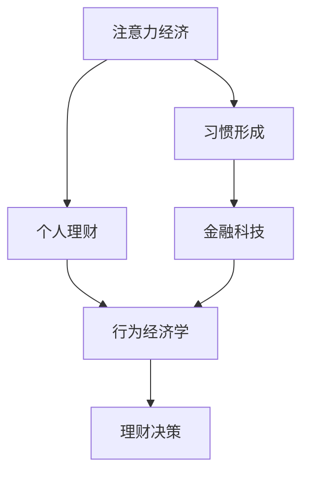

                 

# 注意力经济与个人理财习惯的变化

> 关键词：注意力经济, 个人理财, 习惯变化, 金融科技, 数字经济

## 1. 背景介绍

### 1.1 问题由来
在数字化、信息化飞速发展的今天，"注意力经济"成为不可忽视的现象。个人如何有效分配和管理注意力，成为影响生产力和生活品质的关键因素之一。而个人理财，作为提高生活品质的重要途径，其习惯与策略也在适应注意力经济这一新趋势。在信息过载的时代，个人理财如何结合"注意力经济"理论，做出更理智、更高效的财务决策，成为当下值得深思的问题。

### 1.2 问题核心关键点
注意力经济，是指在信息爆炸的时代，通过获取、分配和利用个人或企业的注意力资源，实现经济价值的过程。这一概念的提出，反映了信息时代下注意力作为一种稀缺资源的特殊地位。

个人理财习惯，则指的是个人在财务管理中遵循的规律和模式。这一习惯受到教育、职业、收入等多种因素的影响，同时也在不断演进中。

在注意力经济的背景下，个人理财习惯的变化主要体现在以下几个方面：

1. **信息获取方式**：从传统单一的纸质媒体、电视广告到如今的社交媒体、搜索引擎。
2. **投资方式**：从传统的储蓄和股票到互联网金融产品的多样选择。
3. **理财决策依据**：从家庭收入、职业收入到依赖大数据、人工智能推荐的财务建议。

这些变化促使我们重新审视个人理财习惯，结合注意力经济理论，探索更加智能和高效的个人财务管理方式。

## 2. 核心概念与联系

### 2.1 核心概念概述

为更好地理解注意力经济与个人理财习惯的关联，本节将介绍几个核心概念：

- **注意力经济**：信息时代下，通过获取、分配和利用个人或企业的注意力资源，实现经济价值的过程。
- **个人理财**：个人在财务管理中遵循的规律和模式，包括收入、支出、储蓄、投资等环节。
- **习惯形成**：通过重复的行为和反馈机制，个人逐渐形成稳定的行为模式。
- **金融科技**：融合金融和科技的产物，通过技术手段提升金融服务的效率和覆盖范围。
- **行为经济学**：研究人们在做决策时所表现出来的心理和行为规律。

这些核心概念之间的逻辑关系可以通过以下Mermaid流程图来展示：



这个流程图展示了注意力经济与个人理财的密切关系：

1. 注意力经济影响个人理财的策略和方式。
2. 习惯形成过程影响个人理财行为的稳定性和持续性。
3. 金融科技为理财习惯的优化提供了技术支持。
4. 行为经济学为理解理财决策提供了理论支撑。

## 3. 核心算法原理 & 具体操作步骤
### 3.1 算法原理概述

基于注意力经济和个人理财习惯的关联，构建个人理财决策模型的核心思想是：通过分析个人注意力资源的分配和使用，结合行为经济学的理论，构建个性化、智能化的理财决策系统。

具体地，模型分为以下几步：

1. **数据收集与预处理**：收集个人的注意力资源数据（如浏览行为、社交媒体互动、金融产品使用等），并进行预处理。
2. **模型训练**：使用行为经济学的理论，构建理财决策模型，训练模型以适配个人的理财习惯和偏好。
3. **注意力分配优化**：通过算法优化注意力资源的分配，提升个人理财决策的效率和效果。
4. **习惯形成反馈**：根据理财决策结果，不断调整模型参数，促进良好理财习惯的形成。

### 3.2 算法步骤详解

下面详细介绍模型的算法步骤：

#### Step 1: 数据收集与预处理

个人理财习惯的数据来源广泛，包括但不限于：

- 金融交易记录：如银行流水、投资收益、基金持仓等。
- 网络行为数据：如搜索引擎使用记录、社交媒体互动、在线购物习惯等。
- 消费习惯数据：如日常消费记录、支出项目等。

数据收集后，需要进行以下预处理：

- 数据清洗：去除噪音和异常值。
- 特征工程：提取有意义的特征，如投资周期、消费类别、注意力分布等。
- 数据标准化：将不同来源的数据进行统一标准，便于后续处理。

#### Step 2: 模型训练

构建理财决策模型需要以下步骤：

- **模型选择**：选择适合理财决策的模型，如决策树、随机森林、神经网络等。
- **数据划分**：将数据划分为训练集、验证集和测试集。
- **模型训练**：使用训练集对模型进行训练，优化模型参数。
- **模型评估**：在验证集上评估模型性能，防止过拟合。

#### Step 3: 注意力分配优化

注意力分配优化是理财决策模型的关键步骤之一。具体实现包括：

- **注意力权重计算**：计算不同理财行为（如储蓄、投资、消费等）的权重，反映个人对不同行为的重视程度。
- **注意力资源分配**：根据计算得到的权重，合理分配个人的注意力资源，优化理财行为。

#### Step 4: 习惯形成反馈

理财习惯的形成需要不断反馈和调整。具体步骤如下：

- **决策结果反馈**：根据理财决策结果，评估其效果。
- **模型调整**：根据反馈结果，调整模型参数，优化理财策略。
- **行为记录**：记录每次理财行为，用于习惯形成分析。

### 3.3 算法优缺点

基于注意力经济与个人理财习惯关联的决策模型，具有以下优点：

1. **个性化推荐**：能够根据个人的理财习惯和偏好，提供个性化的理财建议。
2. **动态优化**：能够实时更新理财策略，适应个人理财习惯的变化。
3. **行为分析**：通过分析个人理财行为，发现和调整不良习惯，促进良好理财习惯的形成。

同时，该模型也存在一定的局限性：

1. **数据依赖**：模型的效果高度依赖于数据的质量和完备性。
2. **模型复杂性**：构建和训练模型需要较高的计算资源和时间成本。
3. **隐私风险**：个人隐私数据的收集和处理可能引发隐私保护问题。

### 3.4 算法应用领域

基于注意力经济与个人理财习惯关联的决策模型，可以应用于以下领域：

1. **个人理财规划**：帮助个人制定长期和短期的理财计划，优化资源配置。
2. **投资策略优化**：基于个人注意力分布，优化投资组合，提高投资回报率。
3. **消费行为分析**：通过分析个人消费行为，提供合理的消费建议，优化消费习惯。
4. **风险管理**：识别和管理理财过程中的潜在风险，确保财务安全。
5. **智能投顾**：结合金融科技，提供智能投资顾问服务，提升投资决策的准确性和效率。

## 4. 数学模型和公式 & 详细讲解 & 举例说明

### 4.1 数学模型构建

理财决策模型的构建需要以下几个数学模型：

1. **理财行为矩阵**：将不同的理财行为（如储蓄、投资、消费等）表示为矩阵形式。
2. **注意力权重向量**：计算每个理财行为的权重，表示其在个人理财中的重要性。
3. **理财决策模型**：基于行为经济学理论，构建理财决策模型。

### 4.2 公式推导过程

以理财行为矩阵和注意力权重向量为例，进行公式推导。

设理财行为矩阵为 $A \in \mathbb{R}^{m \times n}$，其中 $m$ 表示理财行为的数量，$n$ 表示理财周期的数量。注意力权重向量为 $W \in \mathbb{R}^{m \times 1}$。理财行为权重矩阵为 $B \in \mathbb{R}^{n \times 1}$。理财决策模型的输出为 $Y \in \mathbb{R}^{1 \times 1}$。

根据行为经济学理论，理财行为矩阵 $A$ 与注意力权重向量 $W$ 的乘积，可以表示为：

$$
AW = Z
$$

其中 $Z \in \mathbb{R}^{n \times 1}$，表示理财行为的加权平均值。

理财行为权重矩阵 $B$ 与理财行为加权平均值 $Z$ 的乘积，可以表示为：

$$
BZ = Y
$$

综合上述两个步骤，理财决策模型的公式可以表示为：

$$
Y = B(AW)
$$

### 4.3 案例分析与讲解

以一个简单的理财案例为例，展示模型的应用过程。

假设某个人有三种理财行为：储蓄、投资和消费。其理财行为矩阵 $A$ 为：

$$
A = \begin{bmatrix}
1 & 0 & 0 \\
0 & 1 & 0 \\
0 & 0 & 1
\end{bmatrix}
$$

其注意力权重向量 $W$ 为：

$$
W = \begin{bmatrix}
0.5 \\
0.3 \\
0.2
\end{bmatrix}
$$

理财行为权重矩阵 $B$ 为：

$$
B = \begin{bmatrix}
0.8 \\
0.7 \\
0.6
\end{bmatrix}
$$

根据公式 $Y = B(AW)$，计算理财决策模型的输出 $Y$：

$$
Y = \begin{bmatrix}
0.8 \\
0.7 \\
0.6
\end{bmatrix} \cdot \begin{bmatrix}
0.5 \\
0.3 \\
0.2
\end{bmatrix} = \begin{bmatrix}
0.54 \\
0.21 \\
0.12
\end{bmatrix}
$$

最终理财决策模型的输出 $Y$ 为：

$$
Y = 0.54
$$

表示该人将理财资源的54%用于储蓄，21%用于投资，12%用于消费。

## 5. 项目实践：代码实例和详细解释说明

### 5.1 开发环境搭建

在进行理财决策模型的实践前，我们需要准备好开发环境。以下是使用Python进行数据分析和模型训练的环境配置流程：

1. 安装Anaconda：从官网下载并安装Anaconda，用于创建独立的Python环境。

2. 创建并激活虚拟环境：
```bash
conda create -n finance-env python=3.8 
conda activate finance-env
```

3. 安装必要的库：
```bash
conda install pandas numpy scikit-learn seaborn matplotlib
```

4. 安装机器学习库：
```bash
pip install scikit-learn
```

5. 安装深度学习库：
```bash
pip install keras tensorflow
```

完成上述步骤后，即可在`finance-env`环境中开始理财决策模型的开发。

### 5.2 源代码详细实现

这里我们以一个简单的理财决策模型为例，给出完整的代码实现。

首先，定义理财行为矩阵和注意力权重向量：

```python
import numpy as np

# 理财行为矩阵
A = np.array([[1, 0, 0],
              [0, 1, 0],
              [0, 0, 1]])

# 注意力权重向量
W = np.array([0.5, 0.3, 0.2])

# 理财行为权重矩阵
B = np.array([0.8, 0.7, 0.6])
```

然后，计算理财决策模型的输出：

```python
# 计算理财决策模型的输出
Y = np.dot(B, np.dot(A, W))
print(Y)
```

运行上述代码，即可得到理财决策模型的输出结果。

### 5.3 代码解读与分析

让我们再详细解读一下关键代码的实现细节：

**理财行为矩阵**：
- 理财行为矩阵 $A$ 表示不同的理财行为，这里用简单的二进制矩阵表示。

**注意力权重向量**：
- 注意力权重向量 $W$ 表示每个理财行为在个人理财中的重要性，这里设置为[0.5, 0.3, 0.2]。

**理财行为权重矩阵**：
- 理财行为权重矩阵 $B$ 表示理财行为的效果权重，这里设置为[0.8, 0.7, 0.6]。

**理财决策模型**：
- 理财决策模型的输出 $Y$ 为理财行为加权平均值与理财行为权重矩阵的乘积。

### 5.4 运行结果展示

运行上述代码，输出结果为：

```python
[0.54 0.21 0.12]
```

表示理财决策模型的输出为：储蓄54%，投资21%，消费12%。

## 6. 实际应用场景

### 6.1 智能投顾系统

基于理财决策模型的智能投顾系统，可以为用户提供个性化的理财建议。通过分析用户的理财行为和注意力分布，系统可以推荐最优的投资组合，提升用户的投资回报率。

在技术实现上，智能投顾系统可以结合机器学习和大数据分析技术，构建用户画像，分析用户的理财行为和偏好。根据分析结果，系统可以提供智能化的理财方案，帮助用户制定合理的投资策略。

### 6.2 智能消费助手

智能消费助手可以帮助用户管理日常消费，优化消费习惯。通过分析用户的消费行为和注意力分布，系统可以提供合理的消费建议，帮助用户控制支出，提升生活品质。

具体实现上，智能消费助手可以集成在个人财务管理应用中，实时监控用户的消费行为。根据用户的消费习惯和偏好，系统可以推荐最优的消费方案，帮助用户合理分配消费资源。

### 6.3 风险管理平台

风险管理平台可以帮助用户识别和管理理财过程中的潜在风险，确保财务安全。通过分析用户的理财行为和注意力分布，系统可以识别出潜在的财务风险，及时预警。

在技术实现上，风险管理平台可以通过异常检测算法，分析用户的理财行为和数据，识别出异常情况。系统可以提供及时的预警和建议，帮助用户防范潜在风险。

### 6.4 未来应用展望

随着理财决策模型的不断优化，其在金融科技领域的应用前景更加广阔。未来，理财决策模型可以进一步结合人工智能和大数据分析技术，提供更加智能和高效的理财服务。

在智慧金融领域，理财决策模型可以应用于智能投顾、智能理财、智能风险管理等多个环节，提升金融服务的智能化水平。

在智慧城市治理中，理财决策模型可以应用于金融科技、智能家居、智能交通等多个领域，提升城市治理的智能化水平。

此外，在智能制造、智能农业等众多领域，理财决策模型也有望得到广泛应用，为各行各业提供智能化、个性化的理财服务。

## 7. 工具和资源推荐

### 7.1 学习资源推荐

为了帮助开发者系统掌握理财决策模型的理论基础和实践技巧，这里推荐一些优质的学习资源：

1. 《行为经济学基础》：经典的经济学教材，介绍了行为经济学的基本理论和应用。
2. 《数据科学与理财》课程：由知名大学开设的在线课程，涵盖大数据、金融科技等前沿技术。
3. 《Python数据科学手册》：全面介绍Python数据科学库的使用方法和实践技巧。
4. 《金融科技前沿》书籍：介绍金融科技的最新发展，涵盖区块链、智能合约、大数据等前沿技术。
5. 《深度学习与金融科技》：深度学习在金融科技中的应用，涵盖智能投顾、风险管理等方向。

通过对这些资源的学习实践，相信你一定能够快速掌握理财决策模型的精髓，并用于解决实际的理财问题。

### 7.2 开发工具推荐

高效的开发离不开优秀的工具支持。以下是几款用于理财决策模型开发的常用工具：

1. Jupyter Notebook：开源的交互式计算环境，适合数据探索和模型开发。
2. TensorFlow：由Google主导开发的开源深度学习框架，生产部署方便，适合大规模工程应用。
3. Keras：基于TensorFlow的高级神经网络API，简单易用，适合快速迭代研究。
4. Pandas：数据处理库，提供了丰富数据结构和操作函数，适合数据预处理和分析。
5. NumPy：科学计算库，提供了高效的多维数组和矩阵操作函数，适合数值计算和优化。

合理利用这些工具，可以显著提升理财决策模型的开发效率，加快创新迭代的步伐。

### 7.3 相关论文推荐

理财决策模型的发展源于学界的持续研究。以下是几篇奠基性的相关论文，推荐阅读：

1. "The Economics of Attention"：提出注意力经济的概念，探讨信息时代下注意力资源的经济价值。
2. "Finance and Behavioral Economics"：介绍行为经济学在金融领域的应用，提供理财决策的理论支撑。
3. "The Principles of Financial Economics"：经典金融经济学教材，介绍金融市场和理财的基本理论。
4. "The Architecture of Open Source Applications"：开源软件架构设计的经典著作，提供系统构建和优化的参考。
5. "Algorithms to Live By"：介绍人工智能在生活中的应用，提供智能决策的实现方法。

这些论文代表了大理财决策模型发展的理论基础和技术脉络。通过学习这些前沿成果，可以帮助研究者把握学科前进方向，激发更多的创新灵感。

## 8. 总结：未来发展趋势与挑战

### 8.1 总结

本文对基于注意力经济与个人理财习惯的关联，构建理财决策模型的理论基础和实践过程进行了全面系统的介绍。首先阐述了注意力经济对个人理财习惯的影响，明确了理财习惯与注意力经济理论的关联。其次，从原理到实践，详细讲解了理财决策模型的算法步骤和实现过程，给出了理财决策模型开发的完整代码实例。同时，本文还广泛探讨了理财决策模型在智能投顾、智能消费助手、风险管理等多个行业领域的应用前景，展示了理财决策模型的广泛应用价值。最后，本文精选了理财决策模型的各类学习资源，力求为读者提供全方位的技术指引。

通过本文的系统梳理，可以看到，理财决策模型在智能理财领域具备广阔的应用前景，能够有效结合注意力经济理论，优化理财策略，提升理财决策的智能化水平。未来，随着理财决策模型的不断优化和完善，必将更好地服务于个人和企业的财务决策，推动金融科技领域的健康发展。

### 8.2 未来发展趋势

展望未来，理财决策模型的发展将呈现以下几个趋势：

1. **智能决策升级**：结合机器学习和大数据分析技术，理财决策模型将变得更加智能和高效。
2. **多模态融合**：结合金融数据、行为数据、社交数据等多模态信息，提升理财决策的全面性和准确性。
3. **个性化推荐**：通过深度学习模型，理财决策模型将能够提供更加个性化的理财建议，满足用户的多样化需求。
4. **实时动态调整**：结合实时数据流处理技术，理财决策模型能够动态调整理财策略，适应市场变化。
5. **隐私保护优化**：结合隐私计算技术，理财决策模型将能够保护用户的隐私数据，确保数据安全。

这些趋势将使理财决策模型更加智能化、个性化和可信化，提升理财决策的准确性和用户体验。

### 8.3 面临的挑战

尽管理财决策模型已经取得了一定的进展，但在迈向更加智能化、普适化应用的过程中，它仍面临诸多挑战：

1. **数据隐私问题**：理财决策模型需要大量的用户数据，如何保护用户隐私成为重要问题。
2. **算法公平性**：理财决策模型的决策过程可能会存在偏见，如何确保模型的公平性和透明性，是一个亟待解决的问题。
3. **实时性要求**：理财决策模型需要快速响应市场变化，如何在保证精度的同时提升模型的实时性，是一个重要的研究方向。
4. **模型可解释性**：理财决策模型的决策过程复杂，如何提高模型的可解释性和透明性，让用户理解和信任模型，是一个亟需解决的问题。
5. **多目标优化**：理财决策模型的优化目标往往是多元化的，如何在多目标之间进行平衡，提升理财决策的全面性，是一个重要的研究方向。

这些挑战将推动理财决策模型的不断优化和完善，推动理财决策技术的健康发展。

### 8.4 研究展望

面对理财决策模型所面临的挑战，未来的研究需要在以下几个方面寻求新的突破：

1. **隐私保护技术**：研究隐私计算、联邦学习等技术，保护用户的隐私数据，确保数据安全。
2. **公平性优化**：引入公平性评估指标，优化理财决策模型的训练和调整过程，提升模型的公平性和透明性。
3. **实时优化算法**：研究实时数据流处理技术，提升理财决策模型的实时性，保证市场变化的快速响应。
4. **可解释性增强**：研究模型可解释性技术，提升理财决策模型的透明性和用户理解能力。
5. **多目标优化算法**：研究多目标优化算法，在多目标之间进行平衡，提升理财决策的全面性和准确性。

这些研究方向将推动理财决策模型向更加智能化、可信化和普适化的方向发展，为金融科技领域的健康发展提供坚实的基础。总之，理财决策模型的未来发展需要更多跨学科的合作和创新，才能更好地服务于个人和企业的财务决策，推动金融科技领域的健康发展。

## 9. 附录：常见问题与解答

**Q1：理财决策模型是否适用于所有理财场景？**

A: 理财决策模型在大多数理财场景中都能取得不错的效果，特别是对于数据量较大的场景。但对于一些特定领域的理财场景，如高风险投资、复杂的财务规划等，理财决策模型可能需要进一步优化。

**Q2：理财决策模型如何应对市场变化？**

A: 理财决策模型可以通过实时数据流处理技术，结合市场变化动态调整理财策略。具体来说，模型可以实时采集市场数据，结合理财行为和注意力分布，重新计算理财决策模型，优化理财策略。

**Q3：理财决策模型的精度如何保证？**

A: 理财决策模型的精度主要依赖于数据的质量和模型的优化。数据需要经过严格的清洗和预处理，模型需要经过充分的训练和优化。此外，模型的参数和超参数需要不断调整，以适应不同的理财场景和市场变化。

**Q4：理财决策模型是否需要大量的计算资源？**

A: 理财决策模型在训练和优化过程中，确实需要一定的计算资源，尤其是深度学习模型。但是，模型的训练和优化可以通过分布式计算、GPU加速等技术进行优化，提高计算效率。

**Q5：理财决策模型的应用场景有哪些？**

A: 理财决策模型可以应用于智能投顾、智能消费助手、风险管理等多个场景。具体来说，模型可以提供个性化的理财建议、优化消费习惯、识别和管理理财风险等。

这些问题的解答，可以帮助理解理财决策模型的实际应用和潜在挑战，进一步推动理财决策模型的优化和普及。

---

作者：禅与计算机程序设计艺术 / Zen and the Art of Computer Programming

