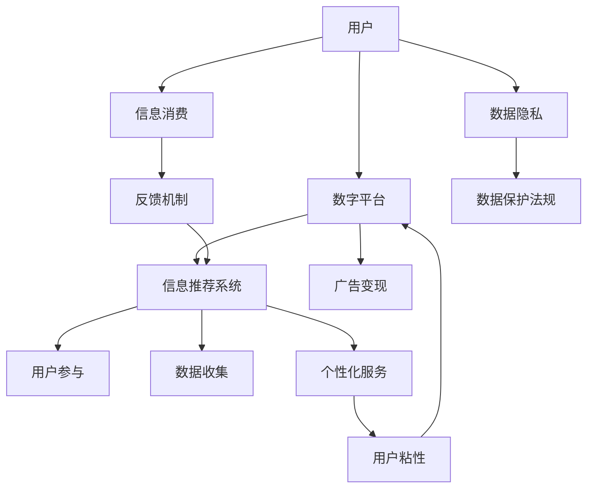

                 

## 1. 背景介绍

在数字化时代，我们正处于一个“注意力经济”的时代。随着互联网技术的飞速发展，信息的海量化和快速更新带来了前所未有的信息过载问题。人们越来越依赖数字平台获取信息，而这些平台也逐渐成为信息的主导者，掌控着人们的时间和注意力。

在这一背景下，个人的职业发展规划也经历了显著的变化。传统的线性职业发展路径、终身雇佣等模式逐渐被打破，取而代之的是更加灵活、自我驱动的职业发展方式。今天，我们通过深度分析“注意力经济”的概念，探讨其对个人职业发展规划带来的影响。

## 2. 核心概念与联系

### 2.1 核心概念概述

为更好地理解“注意力经济”，本文将介绍几个核心概念：

- **注意力经济**：指的是在信息时代，信息供给超过需求，用户的时间和注意力成为稀缺资源，数字平台通过争夺用户注意力来创造价值的一种经济形态。
- **数字平台**：如Google、Facebook、YouTube、微信等，通过算法推荐等手段，引导和控制用户的注意力，从而实现商业变现。
- **信息过载**：大量信息的快速流通，使得用户难以筛选出有价值的信息，导致决策困难和信息疲劳。
- **用户参与**：用户在平台上的行为数据（如浏览、点赞、分享、评论等）成为平台推荐系统的重要依据，驱动平台的个性化服务。
- **数据隐私**：用户数据的收集和使用，一方面提升了平台的服务质量，另一方面也带来了数据隐私和安全问题。

这些核心概念之间通过用户、平台、数据、注意力等联系在一起，共同构成了注意力经济的复杂系统。

### 2.2 核心概念原理和架构的 Mermaid 流程图



## 3. 核心算法原理 & 具体操作步骤

### 3.1 算法原理概述

注意力经济的核心在于如何通过争夺用户的注意力来创造价值。平台通过算法推荐系统，根据用户的历史行为和兴趣，为用户推荐个性化的内容，从而提升用户的参与度和粘性。

### 3.2 算法步骤详解

1. **数据收集**：平台通过API、SDK等手段，收集用户的各类行为数据，如浏览历史、点击行为、社交互动等。
2. **数据预处理**：对收集的数据进行清洗、归一化、特征工程等预处理操作，为后续的推荐模型提供高质量的数据。
3. **算法模型训练**：使用机器学习或深度学习算法（如协同过滤、内容基推荐、神经网络等）对用户行为和内容特征进行建模，生成推荐模型。
4. **推荐结果生成**：根据用户的兴趣和历史行为，生成个性化的推荐结果，展示在用户界面中。
5. **用户反馈**：用户对推荐结果进行反馈（如点击、购买等），平台通过这些反馈不断调整推荐算法，提升推荐质量。

### 3.3 算法优缺点

#### 优点

- **个性化推荐**：通过用户行为数据，提供高度个性化的内容推荐，提升用户体验。
- **用户粘性**：个性化推荐提升用户参与度，增加用户粘性，提高平台的用户留存率。
- **商业变现**：个性化推荐能够增加用户点击和购买行为，为平台带来更多商业变现机会。

#### 缺点

- **信息过载**：个性化推荐可能导致信息过载，用户难以筛选出真正有价值的信息。
- **隐私问题**：平台收集用户数据，可能涉及隐私保护问题。
- **算法偏见**：推荐算法可能存在偏见，导致不公平的推荐结果。
- **依赖性**：用户对平台的依赖可能限制其获取多样化的信息。

### 3.4 算法应用领域

注意力经济的应用领域非常广泛，涵盖了以下几个方面：

- **内容推荐**：新闻、视频、音乐、书籍等内容的个性化推荐，提升用户的消费体验。
- **广告投放**：根据用户的兴趣和行为，精准投放广告，提升广告效果。
- **社交网络**：通过推荐系统，提升用户的内容互动和社交关系。
- **电商推荐**：根据用户行为和历史购买数据，生成个性化购物推荐，提升销售转化率。
- **搜索优化**：在搜索引擎中，通过个性化推荐，提升用户的搜索体验和效率。

## 4. 数学模型和公式 & 详细讲解 & 举例说明

### 4.1 数学模型构建

注意力经济中的推荐算法通常基于协同过滤、内容基推荐、神经网络等方法。这里以基于深度学习的协同过滤算法为例，构建推荐模型的数学模型。

假设用户集为 $U$，物品集为 $I$，用户对物品的评分矩阵为 $R_{U \times I}$，每个用户的特征表示为 $P_U$，每个物品的特征表示为 $P_I$。推荐模型的目标是最小化预测评分与实际评分的差异，即：

$$
\min_{\theta} \sum_{u \in U, i \in I} \text{loss}(R_{ui}, \hat{R}_{ui})
$$

其中 $\theta$ 为模型的参数，$\hat{R}_{ui}$ 为模型预测的用户 $u$ 对物品 $i$ 的评分。

### 4.2 公式推导过程

以基于深度学习的协同过滤模型为例，使用神经网络进行评分预测。设神经网络包含 $L$ 层，输入层为 $U$ 用户的特征 $P_U$ 和 $I$ 物品的特征 $P_I$，输出层为 $R_{U \times I}$ 的预测评分。神经网络的结构和参数可以表示为：

$$
\hat{R}_{ui} = f(\theta) = f^{[L]}(f^{[L-1]}, \ldots, f^{[1]}(P_U, P_I))
$$

其中 $f^{[l]}$ 为第 $l$ 层的非线性变换函数。模型的预测评分与实际评分的差异可以表示为均方误差损失函数：

$$
\text{loss}(R_{ui}, \hat{R}_{ui}) = \frac{1}{2}(R_{ui} - \hat{R}_{ui})^2
$$

### 4.3 案例分析与讲解

以Netflix为例，Netflix使用协同过滤算法为其用户推荐电影。Netflix首先收集了用户观看历史数据，将其作为协同过滤的输入。然后，使用神经网络模型对用户和电影的特征进行编码，生成预测评分。最后，将预测评分与实际评分进行对比，不断调整模型参数，提高推荐质量。

## 5. 项目实践：代码实例和详细解释说明

### 5.1 开发环境搭建

为了进行推荐系统的开发，我们需要搭建一个基本的开发环境。以下是Python开发环境的搭建流程：

1. 安装Anaconda：从官网下载并安装Anaconda，用于创建独立的Python环境。
2. 创建并激活虚拟环境：
```bash
conda create -n recommendation-env python=3.8 
conda activate recommendation-env
```

3. 安装必要的库：
```bash
conda install pandas numpy scikit-learn torch torchvision
```

完成上述步骤后，即可在`recommendation-env`环境中进行推荐系统的开发。

### 5.2 源代码详细实现

下面以协同过滤模型为例，给出推荐系统代码的实现。

```python
import pandas as pd
import numpy as np
from scipy.sparse import csr_matrix
from sklearn.metrics import mean_squared_error
from sklearn.model_selection import train_test_split

# 读取数据
ratings = pd.read_csv('ratings.csv')
users = ratings['user_id'].unique()
items = ratings['item_id'].unique()
ratings = pd.get_dummies(ratings)

# 数据处理
user_features = ratings.groupby('user_id').mean()
item_features = ratings.groupby('item_id').mean()
user_item_features = pd.merge(user_features, item_features, left_index=True, right_index=True)

# 构建稀疏矩阵
user_item_matrix = csr_matrix(ratings.pivot_table(index='user_id', columns='item_id', values='rating').to_dense())

# 划分训练集和测试集
train_ratings, test_ratings = train_test_split(user_item_matrix, test_size=0.2)

# 训练模型
from scipy.sparse.linalg import svds
U, S, V = svds(user_item_matrix, k=10)
R_hat = np.dot(np.dot(U, np.diag(S)), V)

# 评估模型
train_pred = R_hat[train_ratings.nonzero()].mean(axis=1)
test_pred = R_hat[test_ratings.nonzero()].mean(axis=1)
mse = mean_squared_error(test_ratings.toarray(), test_pred)
print('MSE:', mse)
```

### 5.3 代码解读与分析

代码中，我们首先读取数据并处理用户和物品的特征。然后，构建稀疏用户-物品评分矩阵，并划分训练集和测试集。使用奇异值分解(SVD)算法对评分矩阵进行分解，生成低秩矩阵 $U$、$V$ 和 $S$，用于生成预测评分矩阵 $R_{\hat{ui}}$。最后，在测试集上计算预测评分与实际评分的均方误差，评估模型性能。

## 6. 实际应用场景

### 6.1 智能推荐系统

智能推荐系统已成为数字化平台的核心功能。用户通过浏览、点击、评分等行为数据，驱动推荐系统的个性化推荐。推荐系统在电商、内容平台、视频网站等多个领域得到了广泛应用，显著提升了用户体验和平台价值。

### 6.2 数据驱动决策

平台通过用户行为数据，进行数据分析和挖掘，驱动决策过程。例如，电商平台通过推荐系统，提升商品的销售转化率；新闻媒体通过内容推荐，提升用户粘性和阅读时长；社交平台通过用户互动数据，优化社区内容推荐。

### 6.3 用户画像与个性化服务

平台通过收集和分析用户数据，生成用户画像。基于用户画像，平台能够提供更加个性化的服务，提升用户满意度和忠诚度。例如，推荐系统为用户推荐相关商品、文章、视频等，优化搜索排序，提升用户搜索体验。

### 6.4 未来应用展望

未来，随着数据量的进一步增长和算法技术的不断进步，基于注意力经济的推荐系统将更加精准和智能。以下是对未来应用展望的几个方向：

1. **多模态推荐**：结合用户的多模态数据（如图片、音频、视频等），进行多模态推荐，提升推荐质量。
2. **实时推荐**：利用流式数据处理技术，实现实时推荐，提升用户响应速度。
3. **跨领域推荐**：将不同领域的用户数据进行融合，进行跨领域推荐，提升推荐广度。
4. **个性化内容生成**：结合生成对抗网络等技术，生成个性化的内容推荐，提升用户互动性和粘性。
5. **用户行为预测**：利用机器学习算法，预测用户行为，提前进行推荐和干预，提升用户体验。

## 7. 工具和资源推荐

### 7.1 学习资源推荐

为了帮助开发者系统掌握注意力经济的相关知识，这里推荐一些优质的学习资源：

1. **《推荐系统实践》**：由刘群等编著，介绍了推荐系统的基础原理和常用算法，适合初学者入门。
2. **《Deep Learning for Recommender Systems》**：由Jay Van Bockel等编著，涵盖了深度学习在推荐系统中的应用。
3. **《机器学习实战》**：由Peter Harrington编著，介绍了机器学习的基本概念和常用算法，适合实战开发。
4. **Coursera推荐系统课程**：由斯坦福大学开设，系统讲解了推荐系统的基本原理和前沿算法。
5. **Kaggle推荐系统竞赛**：Kaggle举办的多场推荐系统竞赛，提供了大量的实战练习机会。

通过对这些资源的学习实践，相信你一定能够快速掌握注意力经济的基本原理和推荐系统的开发方法。

### 7.2 开发工具推荐

高效的开发离不开优秀的工具支持。以下是几款用于推荐系统开发的常用工具：

1. **TensorFlow**：由Google主导开发的开源深度学习框架，支持大规模分布式训练，适合推荐系统开发。
2. **PyTorch**：由Facebook开源的深度学习框架，灵活易用，支持动态图模型，适合快速迭代实验。
3. **Scikit-learn**：Python的科学计算库，提供了丰富的机器学习算法和工具，适合推荐系统的特征工程和模型评估。
4. **Spark**：Apache开源的大数据处理框架，支持大规模数据处理和分布式计算，适合推荐系统的数据处理和分析。
5. **Jupyter Notebook**：开源的交互式编程工具，方便进行数据探索和模型验证。

合理利用这些工具，可以显著提升推荐系统的开发效率，加快创新迭代的步伐。

### 7.3 相关论文推荐

注意力经济和推荐系统的研究始于学界的持续研究。以下是几篇奠基性的相关论文，推荐阅读：

1. **《Netflix Prize: A Prize for Recommendation Algorithms》**：由Netflix举办的多场推荐系统竞赛，推动了推荐系统的研究与应用。
2. **《A New Recommender System: A Hybrid of User-Based and Item-Based Approaches》**：提出了混合推荐算法，结合用户基推荐和物品基推荐，提升了推荐系统的性能。
3. **《Adaptive Recommender Systems for Image Collections》**：介绍了基于深度学习的推荐系统在图像推荐中的应用。
4. **《Content-Based and Collaborative Filtering for Recommender Systems: A Comparative Study》**：系统比较了内容基推荐和协同过滤推荐算法的效果。
5. **《Hedonic Product Recommendation via Deep Reinforcement Learning》**：介绍了基于强化学习的推荐系统在产品推荐中的应用。

这些论文代表了两大领域的发展脉络，通过学习这些前沿成果，可以帮助研究者把握学科前进方向，激发更多的创新灵感。

## 8. 总结：未来发展趋势与挑战

### 8.1 研究成果总结

本文对注意力经济及其对个人职业发展规划的影响进行了系统介绍。从核心概念、算法原理到项目实践，深入讲解了推荐系统的开发过程，探讨了其广泛的应用场景。通过本文的梳理，可以看到，基于深度学习的推荐系统已经成为数字化平台的重要组成部分，显著提升了用户体验和平台价值。未来，随着算法的不断进步，推荐系统将更加精准和智能，为人们的生活和工作带来更多便利和乐趣。

### 8.2 未来发展趋势

展望未来，推荐系统的发展趋势如下：

1. **个性化推荐**：基于深度学习、生成对抗网络等技术，进行更加个性化、多样化的推荐，提升用户体验。
2. **实时推荐**：利用流式数据处理技术，实现实时推荐，提升用户响应速度。
3. **跨领域推荐**：结合不同领域的数据，进行跨领域推荐，提升推荐广度。
4. **多模态推荐**：结合多模态数据，进行多模态推荐，提升推荐质量。
5. **用户行为预测**：利用机器学习算法，预测用户行为，提前进行推荐和干预，提升用户体验。
6. **推荐系统伦理**：关注推荐系统的伦理问题，如算法偏见、数据隐私等，确保推荐系统的公平性和透明性。

### 8.3 面临的挑战

尽管推荐系统取得了诸多进展，但在迈向更加智能化、普适化应用的过程中，仍面临以下挑战：

1. **信息过载**：个性化推荐可能导致信息过载，用户难以筛选出真正有价值的信息。
2. **算法偏见**：推荐算法可能存在偏见，导致不公平的推荐结果。
3. **数据隐私**：平台收集用户数据，可能涉及隐私保护问题。
4. **模型鲁棒性**：推荐模型可能存在鲁棒性不足的问题，导致对数据分布变化的适应能力不足。
5. **用户依赖**：用户对平台的依赖可能限制其获取多样化的信息。

### 8.4 研究展望

面对推荐系统面临的这些挑战，未来的研究需要在以下几个方面寻求新的突破：

1. **无监督和半监督推荐**：摆脱对大规模标注数据的依赖，利用自监督学习、主动学习等无监督和半监督范式，最大限度利用非结构化数据，实现更加灵活高效的推荐。
2. **参数高效和计算高效的推荐方法**：开发更加参数高效的推荐方法，在固定大部分预训练参数的同时，只更新极少量的任务相关参数。同时优化推荐模型的计算图，减少前向传播和反向传播的资源消耗，实现更加轻量级、实时性的部署。
3. **因果分析和博弈论工具**：将因果分析方法引入推荐系统，识别出模型决策的关键特征，增强推荐系统的可解释性和可信度。借助博弈论工具刻画人机交互过程，主动探索并规避推荐系统的脆弱点，提高系统稳定性。
4. **多模态推荐系统**：结合图像、音频、视频等多模态数据，进行多模态推荐，提升推荐质量和用户体验。
5. **推荐系统伦理**：关注推荐系统的伦理问题，如算法偏见、数据隐私等，确保推荐系统的公平性和透明性。

## 9. 附录：常见问题与解答

**Q1：为什么推荐系统对用户的时间和经济有影响？**

A: 推荐系统通过个性化推荐，提升了用户的体验和满意度，从而增加了用户的粘性和忠诚度。用户更多地花费时间在平台上，平台能够通过广告、订阅、购买等手段获取更多收入。

**Q2：推荐系统如何处理长尾数据？**

A: 长尾数据是指低频次的用户行为数据。推荐系统通常采用协同过滤、内容基推荐等方法，处理长尾数据时，可以通过增加数据稀疏性或使用神经网络模型进行优化，提高长尾数据的推荐效果。

**Q3：推荐系统的用户画像是如何构建的？**

A: 推荐系统的用户画像通常基于用户的历史行为数据，如浏览历史、购买历史、社交互动等。通过数据挖掘和建模，可以生成用户画像，用于个性化推荐和精准营销。

**Q4：推荐系统中的冷启动问题如何解决？**

A: 冷启动问题是指新用户或新商品没有历史行为数据，难以进行推荐。推荐系统通常通过初始化推荐模型、引入外部知识库、使用相似度匹配等方法，解决冷启动问题，确保新用户的推荐效果。

**Q5：推荐系统是否存在安全隐患？**

A: 推荐系统存在数据隐私和安全问题。平台需要加强用户数据保护，遵循数据隐私法规，确保用户数据的安全性和隐私性。同时，推荐系统还需要防范恶意攻击，避免数据泄露和系统破坏。

---

作者：禅与计算机程序设计艺术 / Zen and the Art of Computer Programming

