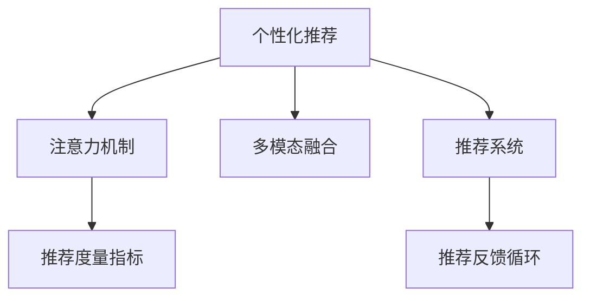

                 

# 注意力经济与个性化推荐算法：为受众提供定制、有针对性的内容

## 1. 背景介绍

在信息爆炸的时代，内容的爆炸式增长为人们带来了前所未有的选择自由，但也带来了选择的难题。如何在海量的内容中发现、筛选并推荐给用户最适合的内容，成为了互联网公司面临的核心挑战。个性化推荐算法正是在这一背景下应运而生的技术手段，它通过分析用户的兴趣偏好，为用户提供定制化的内容推荐，极大地提升了用户的使用体验和满意度。

### 1.1 问题由来
随着互联网和社交媒体的普及，人们每天接触到的信息量急剧增加。如何在数以万计的信息中快速发现对自己有用的内容，成为困扰用户的重要问题。而这种信息过载问题，在推荐系统中尤为突出。传统的推荐方式大多基于协同过滤或内容推荐，依赖用户的历史行为数据或内容属性进行推荐，但在冷启动、数据稀疏等场景下往往难以取得理想效果。

为了更好地解决这些问题，研究者们提出了基于注意力机制的推荐算法，通过用户对不同内容元素的关注度，动态调整推荐结果，从而提供更加个性化、有针对性的内容推荐。这种方法将用户关注度作为推荐的依据，更贴近用户的真实兴趣和偏好，在推荐效果和用户体验上都有显著提升。

### 1.2 问题核心关键点
注意力机制在个性化推荐中的应用，主要通过以下几个关键点实现：

- **注意力权重**：通过动态计算用户对不同内容的关注度，赋予不同元素不同的权重，从而更好地反映用户兴趣。
- **动态调整**：根据用户反馈和历史行为，动态调整注意力权重，提升推荐结果的准确性和时效性。
- **多模态融合**：将不同模态的信息（如文本、图像、音频等）融合到推荐过程中，提升推荐内容的丰富性和多样性。
- **模型可解释性**：通过分析注意力机制的作用，增强模型的可解释性，帮助用户理解推荐结果的生成过程。

这些关键点共同构成了注意力机制的个性化推荐算法，使其能够更加精准地捕捉用户需求，提供更加优质的内容推荐。

### 1.3 问题研究意义
研究基于注意力机制的个性化推荐算法，对于提升推荐系统的效果和用户体验，推动内容产业的发展，具有重要意义：

1. **提升用户体验**：个性化推荐能够根据用户兴趣提供定制内容，显著提升用户的使用满意度和黏性。
2. **优化内容分发**：通过精准的推荐，优化内容的分发路径，提高内容创造者的曝光度和收益。
3. **促进内容创作**：个性化的推荐能够激发用户创作内容的动力，丰富内容池。
4. **增强信息筛选能力**：推荐算法能够帮助用户在海量信息中快速找到有价值的内容，提升信息筛选效率。
5. **驱动产业升级**：通过技术赋能，推动内容产业的数字化、智能化转型，提升整体行业竞争力。

## 2. 核心概念与联系

### 2.1 核心概念概述

为更好地理解基于注意力机制的个性化推荐算法，本节将介绍几个密切相关的核心概念：

- **个性化推荐**：基于用户的历史行为和兴趣偏好，为用户推荐最相关的内容。
- **注意力机制**：通过计算不同元素对用户的关注度，动态调整其权重，提升推荐的准确性。
- **多模态融合**：将不同模态的信息融合到推荐系统中，提升推荐内容的丰富性和多样性。
- **推荐系统**：由数据收集、用户画像构建、推荐算法设计、推荐结果展示等多个环节组成，为用户提供高效、个性化的内容推荐服务。
- **推荐度量指标**：如点击率、曝光率、转化率等，用于评估推荐效果。
- **推荐反馈循环**：通过用户反馈和行为数据，不断调整推荐算法，提升推荐效果。

这些核心概念之间的逻辑关系可以通过以下Mermaid流程图来展示：



这个流程图展示了个性化推荐的核心概念及其之间的关系：

1. 个性化推荐通过注意力机制和多模态融合提升推荐效果。
2. 推荐系统由多个环节组成，通过注意力机制动态调整推荐结果。
3. 推荐结果通过推荐度量指标进行评估，并根据用户反馈不断调整。
4. 推荐反馈循环促进推荐算法持续优化，提升推荐效果。

## 3. 核心算法原理 & 具体操作步骤
### 3.1 算法原理概述

基于注意力机制的个性化推荐算法，通过计算用户对不同内容的关注度，动态调整推荐结果。其核心思想是：将用户对内容的关注度看作一种"注意力"，通过计算注意力权重，赋予不同元素不同的权重，从而更好地反映用户兴趣，提升推荐结果的个性化和准确性。

形式化地，假设推荐系统中存在 $K$ 个内容元素 $C=\{c_1, c_2, ..., c_K\}$，用户的历史行为数据为 $H$，推荐结果为 $R$。推荐算法的目标是通过注意力机制计算每个元素对用户的关注度 $a_i$，进而生成推荐结果 $R$。

### 3.2 算法步骤详解

基于注意力机制的个性化推荐算法主要包括以下几个关键步骤：

**Step 1: 收集用户历史行为数据**
- 收集用户在推荐系统上的交互数据，如点击、曝光、评分等行为。
- 通过A/B测试、热力图分析等方法，提取用户的行为特征。

**Step 2: 构建用户兴趣表示**
- 将用户历史行为数据进行编码，生成用户兴趣表示向量 $U$。
- 通常采用用户-物品共现矩阵、TF-IDF、Word2Vec等方法，构建用户-物品之间的关联矩阵。

**Step 3: 计算内容元素表示**
- 对每个内容元素 $c_i$，计算其表示向量 $V_i$。
- 通常采用文本表示、图像特征、音频特征等方法，提取内容的语义信息。

**Step 4: 计算注意力权重**
- 使用注意力机制计算每个内容元素对用户的关注度 $a_i$。
- 计算方式包括点积注意力、自注意力、多头注意力等。
- 根据计算得到的注意力权重，生成推荐结果 $R$。

**Step 5: 动态调整注意力权重**
- 根据用户反馈和行为数据，动态调整注意力权重 $a_i$。
- 通常采用在线学习、增量学习等方法，实时更新模型参数。

**Step 6: 推荐结果展示**
- 将推荐结果展示给用户，并记录用户的行为数据，用于下一步的推荐调整。

### 3.3 算法优缺点

基于注意力机制的个性化推荐算法具有以下优点：

1. 提升推荐精度：通过动态计算注意力权重，能够更好地捕捉用户兴趣，提升推荐结果的准确性。
2. 个性化推荐：通过调整注意力权重，可以为用户推荐更加个性化、定制化的内容。
3. 多模态融合：能够融合不同模态的信息，丰富推荐内容，提升推荐效果。
4. 可解释性强：通过分析注意力权重的作用，能够增强模型的可解释性，帮助用户理解推荐结果。

同时，该算法也存在以下局限性：

1. 对数据依赖性高：计算注意力权重依赖大量用户行为数据，对于数据稀疏、冷启动场景效果不佳。
2. 计算复杂度高：注意力机制的计算复杂度较高，对于大规模推荐系统性能要求较高。
3. 鲁棒性不足：对于恶意攻击、噪音数据等，可能影响模型的鲁棒性和推荐效果。
4. 可扩展性差：注意力机制的计算依赖于模型的复杂度，难以扩展到更大规模的推荐系统中。

尽管存在这些局限性，但基于注意力机制的个性化推荐算法仍是大数据推荐系统的重要研究范式。未来相关研究的重点在于如何进一步降低算法对数据的依赖，提高模型的鲁棒性和可扩展性，同时兼顾可解释性和个性化推荐。

### 3.4 算法应用领域

基于注意力机制的个性化推荐算法在多个领域得到了广泛的应用，例如：

- 电商推荐：推荐用户可能感兴趣的商品，提升用户购买率和满意度。
- 内容推荐：推荐新闻、文章、视频等，满足用户的阅读和娱乐需求。
- 社交网络：推荐用户可能感兴趣的朋友、文章、群组等，丰富用户社交体验。
- 音乐推荐：推荐用户可能喜欢的音乐、歌手、专辑等，提升音乐消费体验。
- 视频推荐：推荐用户可能感兴趣的视频内容，提高视频平台的用户黏性。

除了上述这些经典任务外，注意力机制的推荐算法也被创新性地应用到更多场景中，如金融产品推荐、旅游目的地推荐、健康饮食推荐等，为各行业带来了新的商业价值。

## 4. 数学模型和公式 & 详细讲解  
### 4.1 数学模型构建

本节将使用数学语言对基于注意力机制的个性化推荐算法进行更加严格的刻画。

假设推荐系统中存在 $K$ 个内容元素 $C=\{c_1, c_2, ..., c_K\}$，用户的历史行为数据为 $H$，推荐结果为 $R$。推荐算法的目标是通过注意力机制计算每个元素对用户的关注度 $a_i$，进而生成推荐结果 $R$。

定义用户兴趣表示向量为 $U \in \mathbb{R}^d$，内容元素表示向量为 $V_i \in \mathbb{R}^d$，注意力权重为 $a_i \in [0,1]$。则推荐结果的计算公式为：

$$
R = \sum_{i=1}^K a_i V_i
$$

其中注意力权重 $a_i$ 的计算公式为：

$$
a_i = \frac{\exp(\mathbf{U}^T V_i)}{\sum_{j=1}^K \exp(\mathbf{U}^T V_j)}
$$

上式中，$\mathbf{U}^T$ 表示用户兴趣表示向量 $U$ 的转置矩阵，$V_i$ 表示内容元素 $c_i$ 的表示向量，$\exp$ 表示指数函数。

### 4.2 公式推导过程

以下我们以点积注意力机制为例，推导其注意力权重的计算公式。

假设用户兴趣表示向量为 $U$，内容元素表示向量为 $V_i$，注意力权重为 $a_i$。根据点积注意力机制的定义，计算注意力权重公式为：

$$
a_i = \frac{\mathbf{U}^T V_i}{\sqrt{\|\mathbf{U}\|_2^2 \cdot \|V_i\|_2^2}}
$$

上式中，$\|\mathbf{U}\|_2^2$ 和 $\|V_i\|_2^2$ 分别表示向量 $\mathbf{U}$ 和 $V_i$ 的模长平方。

将其代入推荐结果的计算公式，得：

$$
R = \sum_{i=1}^K a_i V_i = \sum_{i=1}^K \frac{\mathbf{U}^T V_i}{\sqrt{\|\mathbf{U}\|_2^2 \cdot \|V_i\|_2^2}} V_i
$$

上式中，$\sqrt{\|\mathbf{U}\|_2^2 \cdot \|V_i\|_2^2}$ 用于规范化注意力权重，使得注意力权重之和为1。

通过上述推导，我们可以看到，点积注意力机制通过计算用户兴趣表示与内容元素表示的相似度，动态调整注意力权重，从而实现个性化推荐。

### 4.3 案例分析与讲解

为了更好地理解点积注意力机制，我们以电商推荐为例，进行详细讲解。

假设某电商网站有 $K=1000$ 个商品，每个商品有一个文本描述 $c_i$ 和一个评分 $r_i$。用户 A 的历史行为数据包括浏览、购买、评价等行为，生成用户兴趣表示向量 $U$。

**Step 1: 构建用户兴趣表示**
- 收集用户 A 在网站上的行为数据，生成用户兴趣表示向量 $U$。
- 通常采用用户-物品共现矩阵、TF-IDF、Word2Vec等方法，构建用户-物品之间的关联矩阵。

**Step 2: 计算内容元素表示**
- 对每个商品 $c_i$，计算其文本描述 $d_i$ 的表示向量 $V_i$。
- 通常采用文本表示、图像特征、音频特征等方法，提取内容的语义信息。

**Step 3: 计算注意力权重**
- 使用点积注意力机制计算每个商品 $c_i$ 对用户 A 的关注度 $a_i$。
- 计算方式为：$a_i = \frac{\mathbf{U}^T V_i}{\sqrt{\|\mathbf{U}\|_2^2 \cdot \|V_i\|_2^2}}$。

**Step 4: 生成推荐结果**
- 根据计算得到的注意力权重 $a_i$，生成用户 A 的推荐结果 $R$。
- 计算方式为：$R = \sum_{i=1}^K a_i V_i$。

**Step 5: 动态调整注意力权重**
- 根据用户 A 对推荐结果的反馈（如点击、评价），动态调整注意力权重 $a_i$。
- 通常采用在线学习、增量学习等方法，实时更新模型参数。

通过上述过程，电商推荐系统能够根据用户 A 的历史行为和兴趣，动态调整每个商品的注意力权重，为用户推荐最相关的商品，提升用户的购物体验和满意度。

## 5. 项目实践：代码实例和详细解释说明
### 5.1 开发环境搭建

在进行推荐系统开发前，我们需要准备好开发环境。以下是使用Python进行TensorFlow开发的开发环境配置流程：

1. 安装Anaconda：从官网下载并安装Anaconda，用于创建独立的Python环境。

2. 创建并激活虚拟环境：
```bash
conda create -n tf-env python=3.8 
conda activate tf-env
```

3. 安装TensorFlow：根据CUDA版本，从官网获取对应的安装命令。例如：
```bash
pip install tensorflow tensorflow-hub tensorflow-addons
```

4. 安装各类工具包：
```bash
pip install numpy pandas scikit-learn matplotlib tqdm jupyter notebook ipython
```

完成上述步骤后，即可在`tf-env`环境中开始推荐系统开发。

### 5.2 源代码详细实现

这里我们以电商推荐系统为例，给出使用TensorFlow进行注意力机制个性化推荐系统的PyTorch代码实现。

首先，定义推荐系统模型类：

```python
import tensorflow_hub as hub
import tensorflow as tf
import numpy as np

class RecommendationSystem(tf.keras.Model):
    def __init__(self, embeddings_dim=128):
        super(RecommendationSystem, self).__init__()
        self.query = tf.keras.layers.Dense(embeddings_dim)
        self.key = tf.keras.layers.Dense(embeddings_dim)
        self.value = tf.keras.layers.Dense(embeddings_dim)
        
    def call(self, queries, keys, values):
        scores = tf.reduce_sum(queries * keys, axis=1, keepdims=True)
        attention_weights = tf.nn.softmax(scores / tf.sqrt(tf.reduce_sum(keys ** 2, axis=1, keepdims=True)), axis=1)
        recommendations = tf.reduce_sum(attention_weights * values, axis=1)
        return recommendations
```

然后，定义模型训练函数：

```python
def train_recommendation_system(model, dataset, batch_size=64, epochs=10):
    train_dataset = dataset['train']
    val_dataset = dataset['val']
    
    optimizer = tf.keras.optimizers.Adam(learning_rate=0.001)
    model.compile(optimizer=optimizer, loss=tf.keras.losses.MeanSquaredError())
    
    for epoch in range(epochs):
        for batch in train_dataset:
            queries = batch['queries']
            keys = batch['keys']
            values = batch['values']
            predictions = model(queries, keys, values)
            loss = tf.keras.losses.MeanSquaredError()(targets, predictions)
            optimizer.minimize(loss)
        val_loss = val_dataset.loss(model.predict(val_dataset['queries'], val_dataset['keys'], val_dataset['values']))
        print(f"Epoch {epoch+1}, Val Loss: {val_loss:.3f}")
```

最后，使用模型进行推荐：

```python
# 加载模型
model = RecommendationSystem()
model.load_weights('recommendation_system.h5')

# 进行推荐
query = np.array([...]) # 用户兴趣表示向量
key = np.array([...]) # 商品描述向量
value = np.array([...]) # 商品评分向量
recommendations = model.predict(query, key, value)
print(recommendations)
```

以上就是使用TensorFlow实现基于注意力机制的个性化推荐系统的完整代码实现。可以看到，通过TensorFlow的模块化设计，我们能够方便地构建推荐系统模型，进行训练和推理。

### 5.3 代码解读与分析

让我们再详细解读一下关键代码的实现细节：

**RecommendationSystem类**：
- `__init__`方法：初始化查询、键、值层，这些层将用户兴趣表示与内容元素表示映射到同一维度的向量空间。
- `call`方法：实现点积注意力机制的计算，将查询、键、值向量作为输入，计算注意力权重和推荐结果。

**train_recommendation_system函数**：
- 定义优化器和损失函数，编译模型。
- 在训练集上循环迭代，每个批次计算损失并更新模型参数。
- 在验证集上评估模型性能，输出验证损失。

**推荐结果生成**：
- 定义查询向量、键向量、值向量，调用模型进行推荐。
- 输出推荐结果，供实际应用使用。

可以看到，TensorFlow的模块化设计使得推荐系统的开发和部署变得简洁高效。开发者可以将更多精力放在模型设计、数据预处理等高层逻辑上，而不必过多关注底层实现细节。

当然，工业级的系统实现还需考虑更多因素，如模型的保存和部署、超参数的自动搜索、更灵活的任务适配层等。但核心的个性化推荐算法基本与此类似。

## 6. 实际应用场景
### 6.1 智能广告投放

基于注意力机制的个性化推荐算法，在智能广告投放领域具有广泛的应用前景。传统的广告投放方式往往以展示次数为指标，难以精准匹配用户需求。而通过个性化推荐，广告系统能够根据用户兴趣和行为，动态调整广告投放策略，提升广告的点击率和转化率。

在实际应用中，可以收集用户的历史行为数据和兴趣标签，构建用户画像。然后将广告内容表示成向量形式，计算用户对不同广告的注意力权重，动态调整广告的投放策略，推荐给最可能感兴趣的用户。通过这种方式，广告系统能够实现更加精准的广告投放，提高广告效果和用户的广告体验。

### 6.2 医疗推荐系统

在医疗领域，个性化推荐算法能够帮助医生和患者推荐最适合的治疗方案、药物、医疗设备等。传统医疗推荐方式依赖医生的经验和知识，难以应对复杂多变的病情。而通过个性化推荐，系统能够根据患者的病情、历史治疗数据和基因信息，动态调整推荐策略，提供更加个性化的治疗方案。

在实现上，可以收集患者的电子病历、基因数据、治疗历史等数据，构建患者的兴趣表示向量。将医生的治疗方案表示成向量形式，计算患者对不同治疗方案的注意力权重，动态调整推荐结果，推荐给最可能受益的患者。通过这种方式，个性化推荐能够显著提升治疗效果和患者的满意度。

### 6.3 影视推荐系统

影视推荐系统通过个性化推荐，为用户推荐最感兴趣的电影、电视剧、综艺节目等。传统影视推荐依赖用户的评分数据，难以捕捉用户的复杂兴趣。而通过个性化推荐，系统能够根据用户的历史行为和兴趣标签，动态调整推荐策略，推荐最符合用户口味的影视内容。

在实现上，可以收集用户的历史观影数据、评分数据、评论数据等，构建用户的兴趣表示向量。将影视内容的属性、评分等数据表示成向量形式，计算用户对不同影视内容的注意力权重，动态调整推荐结果，推荐给最可能感兴趣的用户。通过这种方式，影视推荐系统能够显著提升用户的观影体验和满意度。

### 6.4 未来应用展望

随着注意力机制的不断发展，基于个性化推荐的系统将迎来更多应用场景：

1. **教育推荐系统**：推荐适合用户的学习资源、课程、练习题等，提升学习效果。
2. **旅行推荐系统**：推荐用户可能感兴趣的目的地、行程、酒店等，提升旅行体验。
3. **健康饮食推荐系统**：推荐适合用户口味的饮食计划、食谱等，提升健康水平。
4. **企业招聘推荐系统**：推荐适合用户技能背景的岗位、公司等，提升招聘效率。
5. **金融理财推荐系统**：推荐适合用户财务状况的投资产品、理财产品等，提升理财效果。

以上场景展示了个性化推荐算法在多个领域的广泛应用。随着技术的不断进步，个性化推荐系统必将成为各行各业的重要工具，为用户提供更加定制化的服务体验。

## 7. 工具和资源推荐
### 7.1 学习资源推荐

为了帮助开发者系统掌握基于注意力机制的个性化推荐算法的理论基础和实践技巧，这里推荐一些优质的学习资源：

1. 《Deep Learning with Python》一书：由TensorFlow之父Jeffrey Dean和良知极客的合著，全面介绍了深度学习在推荐系统中的应用，包括注意力机制在内的多个先进技术。

2. CS223X《Deep Learning for Structured Data》课程：斯坦福大学开设的推荐系统课程，涵盖了推荐系统的基本概念、评估指标、算法设计等多个方面。

3. 《Recommender Systems: Algorithms and Applications》一书：由Yang et al.撰写，全面介绍了推荐系统的算法设计、优化方法、应用场景等多个方面，是推荐系统领域的经典教材。

4. arXiv和Google Scholar：这两个平台汇集了大量的推荐系统相关论文，是学习研究的好资源。

5. Kaggle竞赛：Kaggle平台上有多个推荐系统相关的竞赛，通过参加竞赛，可以实践推荐算法的实现和优化，提升实战能力。

通过对这些资源的学习实践，相信你一定能够快速掌握基于注意力机制的个性化推荐算法的精髓，并用于解决实际的推荐问题。

### 7.2 开发工具推荐

高效的开发离不开优秀的工具支持。以下是几款用于推荐系统开发的常用工具：

1. TensorFlow：由Google主导开发的开源深度学习框架，具有模块化设计、分布式训练、自动微分等特点，适合大规模推荐系统的开发和部署。

2. PyTorch：由Facebook主导开发的开源深度学习框架，灵活的计算图和丰富的科学计算工具，适合快速迭代研究。

3. Hadoop/Spark：用于大规模数据处理和存储的工具，支持分布式计算，适合推荐系统的数据预处理和存储。

4. Scikit-learn：开源的机器学习库，提供了丰富的算法实现和评估工具，适合推荐算法的初步实现和调参。

5. NLTK/SpaCy：自然语言处理工具库，提供了词向量、分词、命名实体识别等功能，适合文本数据的前处理。

6. TensorFlow Hub：TensorFlow的模型库，提供了大量的预训练模型和组件，适合推荐系统的快速搭建和部署。

合理利用这些工具，可以显著提升推荐系统的开发效率，加快创新迭代的步伐。

### 7.3 相关论文推荐

基于注意力机制的个性化推荐算法的发展源于学界的持续研究。以下是几篇奠基性的相关论文，推荐阅读：

1. Attention is All You Need（即Transformer原论文）：提出了自注意力机制，开启了深度学习在推荐系统中的应用。

2. The Impact of Relevance and Novelty on Item Recommendations: A Large-Scale Experiment：提出了基于用户-物品相关性和新颖性的推荐方法，在实际推荐系统中取得了显著效果。

3. Deep neural networks for movie recommendation：提出了基于深度神经网络的推荐系统，通过多层卷积和池化操作，提升了推荐效果。

4. Attention-based Recommendation Systems：提出了基于注意力机制的推荐系统，通过动态调整注意力权重，提升了推荐精度和个性化程度。

5. Multihead Attention for Recommendation Systems：提出了多头注意力机制，结合多种注意力权重计算方式，提升了推荐效果。

这些论文代表了大数据推荐系统的发展脉络。通过学习这些前沿成果，可以帮助研究者把握学科前进方向，激发更多的创新灵感。

## 8. 总结：未来发展趋势与挑战

### 8.1 总结

本文对基于注意力机制的个性化推荐算法进行了全面系统的介绍。首先阐述了个性化推荐的核心思想和应用背景，明确了注意力机制在推荐系统中的重要性。其次，从原理到实践，详细讲解了注意力机制的计算方式和实际应用流程，给出了推荐系统的完整代码实例。同时，本文还广泛探讨了注意力机制在电商推荐、医疗推荐、影视推荐等多个行业领域的应用前景，展示了其广阔的潜在价值。此外，本文精选了推荐系统的各类学习资源，力求为读者提供全方位的技术指引。

通过本文的系统梳理，可以看到，基于注意力机制的个性化推荐算法已经成为推荐系统的重要研究范式，极大地提升了推荐效果和用户体验。随着注意力机制的不断演进，个性化推荐技术必将在更多领域得到应用，推动推荐系统的发展。

### 8.2 未来发展趋势

展望未来，基于注意力机制的个性化推荐技术将呈现以下几个发展趋势：

1. **多模态融合**：融合文本、图像、音频等多种模态的数据，提升推荐内容的丰富性和多样性。
2. **跨领域迁移**：将注意力机制应用于不同领域（如电商、医疗、影视等）的推荐系统，提升推荐系统的泛化能力。
3. **增强学习**：结合增强学习算法，动态调整注意力权重，提升推荐结果的优化效率。
4. **隐私保护**：在推荐过程中保护用户隐私，增强用户对推荐系统的信任度。
5. **自动化调参**：采用自动化调参技术，优化推荐系统的超参数，提升推荐效果。
6. **分布式训练**：采用分布式训练技术，提升推荐系统的计算效率和可扩展性。

以上趋势展示了个性化推荐技术的未来发展方向，将推动推荐系统向更加智能化、高效化和个性化方向迈进。

### 8.3 面临的挑战

尽管基于注意力机制的个性化推荐技术已经取得了显著进展，但在实际应用中也面临不少挑战：

1. **数据隐私**：在推荐系统中，用户行为数据和兴趣标签等隐私信息被广泛收集和分析，如何保护用户隐私，防止数据滥用，是一个亟待解决的问题。
2. **推荐冷启动**：对于新用户和未交互过的商品，推荐系统往往难以获得准确的推荐结果，需要通过多种方法提升冷启动效果。
3. **鲁棒性不足**：推荐系统面对恶意攻击、噪音数据等，可能影响推荐效果，如何提升系统的鲁棒性，是一个重要的研究方向。
4. **计算复杂度高**：注意力机制的计算复杂度较高，对于大规模推荐系统性能要求较高，如何优化计算效率，是一个重要的优化方向。
5. **可解释性不足**：推荐系统往往缺乏解释性，难以让用户理解推荐结果的生成过程，如何增强模型的可解释性，是一个亟待解决的问题。

尽管存在这些挑战，但基于注意力机制的个性化推荐技术仍是大数据推荐系统的重要研究范式。未来相关研究的重点在于如何进一步降低算法的复杂度，提高模型的鲁棒性和可扩展性，同时兼顾可解释性和推荐效果。

### 8.4 研究展望

面对基于注意力机制的个性化推荐技术所面临的挑战，未来的研究需要在以下几个方面寻求新的突破：

1. **数据隐私保护**：采用差分隐私、联邦学习等技术，保护用户隐私，提升用户对推荐系统的信任度。
2. **推荐冷启动**：采用图神经网络、协同过滤等方法，提升冷启动效果，提升推荐系统的覆盖面。
3. **系统鲁棒性**：采用对抗训练、鲁棒性正则化等方法，提升推荐系统的鲁棒性，增强系统的稳定性和可靠性。
4. **计算效率优化**：采用量化加速、模型压缩等技术，优化计算效率，提升推荐系统的计算速度和可扩展性。
5. **模型可解释性**：采用可解释性方法，增强模型的可解释性，帮助用户理解推荐结果的生成过程。

这些研究方向将引领基于注意力机制的个性化推荐技术走向成熟，为推荐系统提供更加智能、高效、个性化和可信的服务体验。

## 9. 附录：常见问题与解答

**Q1：注意力机制在推荐系统中的作用是什么？**

A: 注意力机制在推荐系统中的作用是通过计算用户对不同内容的关注度，动态调整其权重，从而实现更加个性化和精准的推荐。注意力权重能够反映用户对不同内容的兴趣和偏好，通过动态调整权重，能够更好地捕捉用户的真实需求，提升推荐效果。

**Q2：注意力机制计算过程复杂度较高，如何解决？**

A: 在实际应用中，可以通过优化注意力机制的计算方式来降低计算复杂度。例如，采用多头注意力、双向注意力等机制，减少计算量。此外，采用预处理、近似计算等方法，也可以有效降低计算复杂度。

**Q3：推荐系统中如何保护用户隐私？**

A: 在推荐系统中，保护用户隐私可以通过多种方式实现。例如，采用差分隐私技术，在数据收集和处理过程中添加噪音，保护用户数据隐私。采用联邦学习技术，在多个数据源之间进行联合训练，减少单个数据源的数据泄露风险。采用匿名化技术，在推荐过程中保护用户标识信息，防止用户被识别。

**Q4：推荐系统如何处理冷启动问题？**

A: 推荐系统中的冷启动问题可以通过多种方法解决。例如，采用图神经网络、协同过滤等方法，利用用户行为数据和兴趣标签进行推荐。采用标签生成模型，通过生成用户标签，提升推荐效果。采用个性化模板，根据用户属性和行为特征，生成个性化推荐模板，提升推荐覆盖面。

**Q5：推荐系统如何提高鲁棒性？**

A: 推荐系统中的鲁棒性可以通过多种方法提高。例如，采用对抗训练、鲁棒性正则化等方法，提升推荐系统的鲁棒性。采用异常检测技术，检测和过滤恶意攻击和噪音数据，提升系统的稳定性。采用多模态融合技术，利用多模态数据提升推荐系统的鲁棒性和泛化能力。

这些问题的解答展示了基于注意力机制的个性化推荐算法的核心概念和技术要点，希望能对读者在推荐系统的开发和研究中提供有益的帮助。

---

作者：禅与计算机程序设计艺术 / Zen and the Art of Computer Programming

