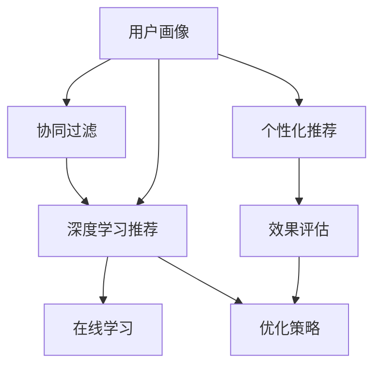

                 

# 注意力经济与个性化营销：为受众创建定制、有针对性的信息

> 关键词：注意力经济,个性化营销,信息定制,算法推荐,消费者行为,用户体验,数据分析,机器学习

## 1. 背景介绍

在数字化时代，信息洪流中用户注意力变得极其稀缺，如何吸引并保持用户的注意力，成为了品牌和商家面临的巨大挑战。传统的广泛营销策略已经难以满足市场需求，基于数据的精准营销成为企业提升竞争力的重要手段。本文将从注意力经济和个性化营销的角度出发，探讨如何利用算法推荐技术，为受众创建定制、有针对性的信息，提升用户体验和品牌价值。

### 1.1 问题由来

随着互联网技术的发展，信息流平台、社交媒体、电商网站等渠道日益丰富，海量信息充斥在用户眼前。尽管信息过载带来了便利，但同时也加剧了用户的注意力分散。如何从海量信息中识别出真正有价值的内容，实现信息的高效传递和消费，成为了关注的焦点。

### 1.2 问题核心关键点

现代营销的核心理念是通过数据分析挖掘用户兴趣和需求，通过个性化的内容推送，提升用户体验和品牌价值。目前，基于机器学习和算法的推荐系统已经广泛应用于电商平台、社交网络、新闻平台等多个领域，成为实现个性化营销的重要工具。

基于机器学习的推荐系统主要包含以下关键步骤：

1. **数据采集**：收集用户行为数据（点击、浏览、购买等）、商品属性（价格、类别、品牌等）、时间特征（季节、节假日等）、用户属性（年龄、性别、地理位置等）。
2. **特征提取**：将采集到的数据转化为模型能够理解的特征向量，如用户ID、商品ID、浏览时间等。
3. **模型训练**：使用历史行为数据对推荐模型进行训练，一般使用协同过滤、内容过滤、深度学习等算法。
4. **个性化推荐**：根据用户特征和历史行为，实时生成个性化推荐内容，推送给用户。
5. **效果评估**：通过A/B测试、点击率、转化率等指标评估推荐效果，不断优化推荐策略。

这些关键步骤构成了推荐系统的核心流程，也是个性化营销的重要支撑。本文将深入探讨这一流程中的关键技术和应用实践，助力企业构建高效、精准的推荐系统。

## 2. 核心概念与联系

### 2.1 核心概念概述

为了更好地理解算法推荐技术在个性化营销中的应用，本文将详细介绍以下核心概念：

- **注意力经济**：在信息过载的时代，用户注意力资源稀缺，如何吸引并保持用户注意力，是提升品牌影响力的关键。
- **个性化推荐**：通过分析用户行为和兴趣，为用户提供符合其个性需求的推荐内容，提升用户体验和品牌价值。
- **用户画像**：通过收集和分析用户特征和行为数据，构建用户兴趣和需求的详细档案，用于指导个性化推荐。
- **协同过滤**：通过用户行为和物品属性的相似性，为用户推荐其他用户喜欢的商品或内容。
- **深度学习推荐**：利用神经网络模型学习用户和物品的特征表示，实现更加精准的个性化推荐。
- **在线学习**：在实时数据中不断更新推荐模型，提升推荐效果和时效性。

这些概念之间的逻辑关系可以通过以下Mermaid流程图来展示：



这个流程图展示了个性化推荐系统的主要组件及其之间的关系：

1. 用户画像作为基础，指导协同过滤和深度学习推荐。
2. 协同过滤和深度学习推荐，分别基于不同机制，形成推荐结果。
3. 在线学习实时更新模型，提升推荐效果。
4. 个性化推荐根据实时数据进行，并由效果评估反馈优化策略。

## 3. 核心算法原理 & 具体操作步骤
### 3.1 算法原理概述

个性化推荐系统的核心原理是利用机器学习算法，根据用户的历史行为和兴趣，预测用户对不同内容的偏好，并生成个性化的推荐列表。常见推荐算法包括协同过滤、深度学习推荐和内容过滤等。

### 3.2 算法步骤详解

以下是推荐系统的详细操作步骤：

**Step 1: 数据采集与处理**

- **用户行为数据**：记录用户的点击、浏览、购买等行为。
- **商品属性数据**：记录商品的类别、品牌、价格等信息。
- **时间特征数据**：记录时间戳、季节、节假日等。
- **用户属性数据**：记录用户的年龄、性别、地理位置等信息。

**Step 2: 特征提取**

- **用户特征**：将用户ID、浏览时间、点击次数等转化为特征向量。
- **物品特征**：将商品ID、类别、价格等转化为特征向量。
- **时间特征**：将时间戳、季节、节假日等转化为特征向量。
- **用户画像**：通过上述特征，构建用户兴趣和需求的详细档案。

**Step 3: 模型训练**

- **协同过滤**：利用用户-物品矩阵，计算用户之间的相似度，推荐其他用户喜欢的商品或内容。
- **深度学习推荐**：利用神经网络模型学习用户和物品的特征表示，实现更加精准的个性化推荐。

**Step 4: 个性化推荐**

- **实时推荐**：根据用户特征和历史行为，实时生成个性化推荐内容。
- **推荐列表**：将推荐内容按照相关度排序，生成推荐列表。

**Step 5: 效果评估**

- **点击率**：评估推荐内容被用户点击的概率。
- **转化率**：评估推荐内容被用户购买或转化的概率。
- **用户满意度**：通过调查问卷等方式，评估用户对推荐结果的满意度。

**Step 6: 模型优化**

- **A/B测试**：通过对比不同推荐策略的效果，选择最优策略。
- **超参数调整**：调整模型的超参数，如学习率、正则化系数等，优化推荐效果。
- **反馈机制**：根据用户反馈，不断优化推荐算法。

### 3.3 算法优缺点

个性化推荐系统的优点包括：

1. **提升用户体验**：通过个性化推荐，提供符合用户兴趣和需求的内容，提高用户满意度。
2. **增加销售额**：推荐精准的商品或内容，促进用户购买和转化。
3. **数据驱动决策**：利用大数据分析，指导营销策略的制定和优化。

同时，个性化推荐系统也存在一些缺点：

1. **隐私风险**：用户行为数据可能被滥用，侵犯用户隐私。
2. **算法偏见**：推荐算法可能受到数据偏差的影响，导致推荐结果不公平。
3. **冷启动问题**：新用户没有足够的历史数据，难以进行有效的推荐。
4. **过度个性化**：过度推荐导致用户信息过载，产生反感。

### 3.4 算法应用领域

个性化推荐系统在多个领域得到了广泛应用，例如：

- **电商**：亚马逊、淘宝等电商平台广泛应用个性化推荐，提升用户体验和销售额。
- **社交媒体**：Facebook、微信等社交平台，通过推荐好友、文章等内容，提升用户粘性。
- **新闻媒体**：今日头条、新浪新闻等，利用个性化推荐算法，提供精准新闻内容。
- **在线视频**：Netflix、YouTube等平台，通过推荐视频内容，提高用户留存率。
- **旅游出行**：携程、去哪儿等平台，根据用户兴趣推荐旅游目的地和行程安排。

## 4. 数学模型和公式 & 详细讲解  
### 4.1 数学模型构建

本节将使用数学语言对个性化推荐系统的核心算法进行更加严格的刻画。

记用户集合为 $U$，物品集合为 $V$，用户行为数据为 $D=\{(i,j,t)\}$，其中 $i \in U$ 表示用户，$j \in V$ 表示物品，$t \in \mathbb{R}$ 表示时间戳。

定义用户对物品 $j$ 的评分函数为 $p_{ij}(t)$，则推荐系统的目标为最大化预测评分和真实评分之间的距离：

$$
\min_{\theta} \sum_{(i,j,t) \in D} \ell(p_{ij}(t), r_{ij}(t))
$$

其中 $\ell$ 为损失函数，一般选择均方误差或交叉熵。$r_{ij}(t)$ 为真实评分，一般通过用户行为数据进行估计，如点击次数、浏览时间等。

### 4.2 公式推导过程

以下是协同过滤和深度学习推荐算法的详细公式推导：

**协同过滤**

协同过滤算法通过计算用户-物品矩阵的相似度，推荐其他用户喜欢的商品或内容。假设用户对物品的评分矩阵为 $R \in \mathbb{R}^{m \times n}$，其中 $m$ 为用户数，$n$ 为物品数，用户对物品 $j$ 的评分向量为 $r_i \in \mathbb{R}^n$，物品对用户的评分向量为 $p_j \in \mathbb{R}^m$。

协同过滤的目标是找到用户之间的相似度矩阵 $S \in \mathbb{R}^{m \times m}$，使得相似用户对相似物品的评分相近。具体推导过程如下：

$$
S_{ij} = \frac{1}{\sqrt{\sum_{k=1}^n (r_i(k)-r_j(k))^2}}
$$

其中 $S_{ij}$ 表示用户 $i$ 和用户 $j$ 的相似度。

**深度学习推荐**

深度学习推荐算法通过神经网络模型学习用户和物品的特征表示，实现更加精准的个性化推荐。假设用户特征为 $x_i \in \mathbb{R}^d$，物品特征为 $y_j \in \mathbb{R}^d$，推荐模型的输出为 $p_{ij}(t)$，一般使用多层的神经网络结构，如DNN、RNN、CNN等。

推荐模型的损失函数为：

$$
\mathcal{L}(\theta) = \frac{1}{N} \sum_{(i,j,t) \in D} \ell(p_{ij}(t), r_{ij}(t))
$$

其中 $\theta$ 为模型的可训练参数，$N$ 为数据总数。

### 4.3 案例分析与讲解

**电商推荐**

在电商平台上，用户的点击、浏览、购买行为被记录在案。通过协同过滤算法，可以计算用户之间的相似度，推荐其他用户喜欢的商品。深度学习推荐算法则通过学习用户和商品之间的特征表示，预测用户对商品的评分，生成个性化推荐列表。

以淘宝为例，淘宝平台利用协同过滤算法，为用户推荐其他用户喜欢的商品。同时，通过深度学习推荐算法，推荐符合用户兴趣的商品。淘宝的推荐系统采用了多个层次的算法组合，如基于内容的推荐、基于用户的推荐和混合推荐等，提升了推荐的精准度和用户体验。

**社交媒体推荐**

在社交媒体平台上，用户的点赞、评论、分享等行为数据被收集。通过协同过滤算法，可以计算用户之间的相似度，推荐其他用户喜欢的内容。深度学习推荐算法则通过学习用户和内容之间的特征表示，预测用户对内容的兴趣，生成个性化推荐列表。

以Facebook为例，Facebook平台利用协同过滤算法，为用户推荐其他用户喜欢的文章、视频等内容。同时，通过深度学习推荐算法，推荐符合用户兴趣的内容。Facebook的推荐系统采用了基于内容的推荐和基于用户的推荐相结合的方式，提升了推荐的精准度和用户粘性。

## 5. 项目实践：代码实例和详细解释说明
### 5.1 开发环境搭建

在进行推荐系统开发前，我们需要准备好开发环境。以下是使用Python进行Scikit-learn开发的环境配置流程：

1. 安装Anaconda：从官网下载并安装Anaconda，用于创建独立的Python环境。

2. 创建并激活虚拟环境：
```bash
conda create -n recomm-env python=3.8 
conda activate recomm-env
```

3. 安装Scikit-learn：
```bash
pip install scikit-learn
```

4. 安装其他依赖包：
```bash
pip install numpy pandas joblib matplotlib sklearn
```

完成上述步骤后，即可在`recomm-env`环境中开始推荐系统开发。

### 5.2 源代码详细实现

下面我们以协同过滤算法为例，给出使用Scikit-learn进行个性化推荐开发的PyTorch代码实现。

首先，定义协同过滤算法的评分矩阵：

```python
from sklearn.metrics.pairwise import cosine_similarity
import numpy as np

# 生成用户行为数据
user_items = np.random.randint(0, 10, size=(100, 20))
item_user = np.transpose(user_items)

# 计算用户-物品相似度矩阵
similarity = cosine_similarity(item_user)
```

然后，定义协同过滤算法的推荐函数：

```python
def recommend(user_id, similarity, top_n=10):
    similarity_matrix = similarity[user_id]
    top_n_scores = np.argsort(similarity_matrix)[-top_n:]
    top_n_items = item_user[top_n_scores]
    return top_n_items
```

最后，在具体应用中，可以根据用户ID生成推荐结果：

```python
user_id = 0
recommended_items = recommend(user_id, similarity, top_n=5)
print(recommended_items)
```

以上就是使用Scikit-learn进行协同过滤算法实现的完整代码示例。可以看到，利用Scikit-learn库，可以方便地实现协同过滤算法的评分矩阵计算和推荐函数。

### 5.3 代码解读与分析

让我们再详细解读一下关键代码的实现细节：

**用户行为数据生成**：

- `user_items`：生成随机用户行为数据，其中每个用户对20个物品的评分。
- `item_user`：将用户行为数据转置，生成物品对用户的评分矩阵。

**相似度矩阵计算**：

- `cosine_similarity`：计算物品对用户的评分矩阵的余弦相似度，得到用户-物品相似度矩阵。

**推荐函数实现**：

- `recommend`：接收用户ID和相似度矩阵，生成用户推荐列表。具体实现为：
  - 获取用户ID对应的行向量 `similarity_matrix[user_id]`。
  - 对行向量进行排序，获取前 `top_n` 个最大值的索引 `top_n_scores`。
  - 根据索引从物品对用户的评分矩阵 `item_user` 中获取推荐物品列表 `top_n_items`。
- `print(recommended_items)`：输出推荐物品列表。

可以看到，利用Scikit-learn库，我们可以方便地实现协同过滤算法的评分矩阵计算和推荐函数，代码简洁高效。

当然，工业级的系统实现还需考虑更多因素，如模型的保存和部署、超参数的自动搜索、更灵活的推荐策略等。但核心的推荐算法基本与此类似。

## 6. 实际应用场景
### 6.1 电商推荐

电商推荐是个性化推荐系统的典型应用场景之一。电商平台通过收集用户的点击、浏览、购买行为数据，结合物品属性信息，利用协同过滤和深度学习推荐算法，为用户提供个性化的商品推荐。

以亚马逊为例，亚马逊平台通过协同过滤算法，计算用户之间的相似度，推荐其他用户喜欢的商品。同时，通过深度学习推荐算法，预测用户对商品的评分，生成个性化推荐列表。亚马逊的推荐系统采用了基于内容的推荐和基于用户的推荐相结合的方式，提升了推荐的精准度和用户体验。

### 6.2 社交媒体推荐

社交媒体推荐是个性化推荐系统的另一个重要应用场景。社交媒体平台通过收集用户的点赞、评论、分享等行为数据，结合内容属性信息，利用协同过滤和深度学习推荐算法，为用户提供个性化的内容推荐。

以Facebook为例，Facebook平台通过协同过滤算法，计算用户之间的相似度，推荐其他用户喜欢的内容。同时，通过深度学习推荐算法，预测用户对内容的兴趣，生成个性化推荐列表。Facebook的推荐系统采用了基于内容的推荐和基于用户的推荐相结合的方式，提升了推荐的精准度和用户粘性。

### 6.3 新闻媒体推荐

新闻媒体推荐是个性化推荐系统的另一个重要应用场景。新闻媒体平台通过收集用户的点击、阅读、评论等行为数据，结合内容属性信息，利用协同过滤和深度学习推荐算法，为用户提供个性化的新闻内容推荐。

以今日头条为例，今日头条平台通过协同过滤算法，计算用户之间的相似度，推荐其他用户喜欢的新闻内容。同时，通过深度学习推荐算法，预测用户对新闻内容的兴趣，生成个性化推荐列表。今日头条的推荐系统采用了基于内容的推荐和基于用户的推荐相结合的方式，提升了推荐的精准度和用户粘性。

### 6.4 未来应用展望

随着个性化推荐技术的发展，未来的推荐系统将呈现以下几个发展趋势：

1. **多模态推荐**：未来的推荐系统将不仅限于文本数据，还将融合图像、视频、语音等多模态数据，提供更加全面、个性化的推荐服务。

2. **联邦学习**：未来的推荐系统将通过联邦学习技术，保护用户隐私的同时，实现跨平台、跨设备的个性化推荐。

3. **在线学习**：未来的推荐系统将实现实时在线学习，不断更新推荐模型，提升推荐效果和时效性。

4. **跨域推荐**：未来的推荐系统将突破平台和行业的界限，实现跨平台、跨领域的推荐服务。

5. **增强推荐**：未来的推荐系统将结合增强学习技术，通过与用户的交互，不断优化推荐策略，提升用户体验和满意度。

6. **因果推断**：未来的推荐系统将引入因果推断技术，评估推荐效果，发现因果关系，实现更加精准的个性化推荐。

这些趋势展示了个性化推荐系统的发展前景，也预示着未来的推荐系统将更加智能、精准、个性化。

## 7. 工具和资源推荐
### 7.1 学习资源推荐

为了帮助开发者系统掌握个性化推荐技术，这里推荐一些优质的学习资源：

1. **《推荐系统基础与算法》**：一本详细介绍推荐系统原理和算法的书籍，涵盖协同过滤、深度学习推荐、矩阵分解等核心技术。

2. **《深度学习与推荐系统》**：一本将深度学习和推荐系统相结合的书籍，介绍了深度学习在推荐系统中的应用。

3. **Coursera《推荐系统》课程**：斯坦福大学开设的推荐系统课程，有Lecture视频和配套作业，带你系统学习推荐系统原理和算法。

4. **Kaggle推荐系统竞赛**：Kaggle上的推荐系统竞赛，通过实际数据集和竞赛任务，让你在实践中掌握推荐系统开发技巧。

5. **GitHub推荐系统开源项目**：GitHub上的推荐系统开源项目，提供丰富的代码示例和实现细节，让你快速上手推荐系统开发。

通过对这些资源的学习实践，相信你一定能够快速掌握个性化推荐技术的精髓，并用于解决实际的推荐问题。

### 7.2 开发工具推荐

高效的开发离不开优秀的工具支持。以下是几款用于个性化推荐系统开发的常用工具：

1. **Scikit-learn**：一个基于Python的机器学习库，提供了丰富的协同过滤和深度学习推荐算法实现。

2. **TensorFlow**：由Google主导开发的开源深度学习框架，适合大规模推荐系统开发。

3. **PyTorch**：由Facebook主导开发的开源深度学习框架，灵活动态的计算图，适合快速迭代研究。

4. **Weights & Biases**：一个用于模型训练的实验跟踪工具，可以记录和可视化模型训练过程中的各项指标，方便对比和调优。

5. **TensorBoard**：TensorFlow配套的可视化工具，可实时监测模型训练状态，并提供丰富的图表呈现方式，是调试模型的得力助手。

合理利用这些工具，可以显著提升个性化推荐系统的开发效率，加快创新迭代的步伐。

### 7.3 相关论文推荐

个性化推荐技术的发展源于学界的持续研究。以下是几篇奠基性的相关论文，推荐阅读：

1. **《推荐系统的矩阵分解方法》**：详细介绍了矩阵分解算法在推荐系统中的应用，是协同过滤算法的经典论文。

2. **《深度学习推荐系统》**：一篇综述性论文，介绍了深度学习在推荐系统中的应用，涵盖深度神经网络、协同过滤、混合推荐等核心技术。

3. **《基于深度学习的推荐系统》**：一篇深度学习推荐系统的经典论文，介绍了深度神经网络在推荐系统中的应用。

4. **《联邦学习推荐系统》**：一篇联邦学习在推荐系统中的应用论文，介绍了联邦学习保护用户隐私的同时，实现跨平台、跨设备的个性化推荐。

这些论文代表了个性化推荐技术的发展脉络。通过学习这些前沿成果，可以帮助研究者把握学科前进方向，激发更多的创新灵感。

## 8. 总结：未来发展趋势与挑战
### 8.1 总结

本文对个性化推荐系统的核心原理和应用实践进行了全面系统的介绍。首先，从注意力经济和个性化推荐的角度出发，阐述了个性化推荐技术在提高用户体验和品牌价值方面的重要作用。其次，通过协同过滤和深度学习推荐算法，详细讲解了个性化推荐系统的数学原理和关键步骤，给出了推荐系统开发的完整代码实例。同时，本文还广泛探讨了个性化推荐系统在电商、社交媒体、新闻媒体等多个领域的应用前景，展示了个性化推荐技术的广阔应用空间。

通过本文的系统梳理，可以看到，个性化推荐技术正在成为现代营销的重要手段，极大地提升了品牌和商家的竞争力。未来，伴随推荐技术的不断发展，个性化推荐系统将进一步深化用户体验，为各行各业带来深刻的变革。

### 8.2 未来发展趋势

展望未来，个性化推荐系统将呈现以下几个发展趋势：

1. **多模态融合**：未来的推荐系统将不仅限于文本数据，还将融合图像、视频、语音等多模态数据，提供更加全面、个性化的推荐服务。

2. **联邦学习**：未来的推荐系统将通过联邦学习技术，保护用户隐私的同时，实现跨平台、跨设备的个性化推荐。

3. **在线学习**：未来的推荐系统将实现实时在线学习，不断更新推荐模型，提升推荐效果和时效性。

4. **跨域推荐**：未来的推荐系统将突破平台和行业的界限，实现跨平台、跨领域的推荐服务。

5. **增强推荐**：未来的推荐系统将结合增强学习技术，通过与用户的交互，不断优化推荐策略，提升用户体验和满意度。

6. **因果推断**：未来的推荐系统将引入因果推断技术，评估推荐效果，发现因果关系，实现更加精准的个性化推荐。

这些趋势展示了个性化推荐系统的广阔前景，也预示着未来的推荐系统将更加智能、精准、个性化。

### 8.3 面临的挑战

尽管个性化推荐技术已经取得了显著的成果，但在迈向更加智能化、普适化应用的过程中，仍面临诸多挑战：

1. **隐私风险**：用户行为数据可能被滥用，侵犯用户隐私。如何保护用户隐私，同时实现精准推荐，是未来的重要课题。

2. **算法偏见**：推荐算法可能受到数据偏差的影响，导致推荐结果不公平。如何消除算法偏见，实现公平推荐，需要进一步研究。

3. **冷启动问题**：新用户没有足够的历史数据，难以进行有效的推荐。如何在新用户上实现推荐，需要新的算法和策略。

4. **过度个性化**：过度推荐导致用户信息过载，产生反感。如何在保证推荐精准度的同时，避免过度个性化，需要找到平衡点。

5. **实时性要求**：实时性要求高，如何在保证实时性的同时，提升推荐精度，需要新的优化方法。

6. **计算资源限制**：推荐系统涉及大规模数据和复杂算法，计算资源需求高。如何降低计算成本，提升系统性能，需要新的优化技术。

这些挑战凸显了个性化推荐系统的发展瓶颈，也预示着未来的研究方向。只有通过不断的技术创新和优化，才能更好地应对这些挑战，实现个性化推荐技术的持续发展。

### 8.4 研究展望

面向未来，个性化推荐系统的研究需要在以下几个方面寻求新的突破：

1. **保护用户隐私**：通过差分隐私、联邦学习等技术，保护用户隐私，实现跨平台、跨设备的个性化推荐。

2. **消除算法偏见**：引入公平性约束和对抗训练技术，消除推荐算法中的数据偏差，实现公平推荐。

3. **解决冷启动问题**：通过迁移学习、零样本学习等技术，解决新用户的推荐问题，提升推荐系统的覆盖率。

4. **优化过度个性化**：结合用户反馈和行为数据，优化推荐策略，避免过度个性化，提升用户体验。

5. **提升实时性**：利用在线学习、增量学习等技术，提升推荐系统的实时性，支持实时推荐。

6. **降低计算成本**：通过模型压缩、模型量化等技术，降低计算成本，提升推荐系统的性能。

这些研究方向将为个性化推荐系统的发展注入新的活力，推动推荐技术的进一步提升和应用。面向未来，个性化推荐技术将在提升用户体验和品牌价值方面发挥更大的作用，为各行各业带来新的变革。

## 9. 附录：常见问题与解答
### Q1: 如何设计有效的个性化推荐算法？

A: 设计有效的个性化推荐算法需要综合考虑多个因素，包括数据质量、用户行为、物品属性等。以下是几个关键点：

1. **数据采集**：全面、准确地收集用户行为数据，是推荐算法的基础。

2. **特征工程**：将原始数据转化为模型能够理解的特征向量，如用户ID、商品ID、浏览时间等。

3. **模型选择**：根据数据特点和业务需求，选择合适的推荐算法，如协同过滤、深度学习推荐等。

4. **超参数调整**：调整模型的超参数，如学习率、正则化系数等，优化推荐效果。

5. **模型评估**：通过A/B测试、点击率、转化率等指标评估推荐效果，不断优化推荐策略。

6. **实时更新**：利用在线学习、增量学习等技术，实时更新推荐模型，提升推荐效果和时效性。

### Q2: 推荐系统如何保护用户隐私？

A: 保护用户隐私是推荐系统面临的重要挑战。以下是几个关键点：

1. **差分隐私**：通过加入噪声，保护用户数据的隐私性，同时实现精准推荐。

2. **联邦学习**：通过分布式训练技术，保护用户数据隐私，实现跨平台、跨设备的个性化推荐。

3. **匿名化**：将用户数据匿名化处理，防止数据泄露。

4. **加密技术**：采用数据加密技术，保护用户数据的安全性。

5. **透明度**：向用户公开推荐算法和数据处理方式，增加用户的信任度。

### Q3: 推荐系统如何消除算法偏见？

A: 消除算法偏见是推荐系统面临的重要挑战。以下是几个关键点：

1. **公平性约束**：在推荐算法中引入公平性约束，防止数据偏差影响推荐结果。

2. **对抗训练**：引入对抗样本，增强模型鲁棒性，防止模型学习到有害的偏见。

3. **数据预处理**：对数据进行预处理，消除数据中的偏见，提升推荐公平性。

4. **模型评估**：在推荐模型中引入公平性评估指标，如Gini系数、EoD等，评估推荐结果的公平性。

5. **人工干预**：结合人工干预和审核，确保推荐结果符合人类价值观和伦理道德。

### Q4: 推荐系统如何解决冷启动问题？

A: 解决冷启动问题是推荐系统面临的重要挑战。以下是几个关键点：

1. **迁移学习**：利用预训练模型，在新用户上实现推荐。

2. **零样本学习**：利用预训练模型和任务模板，在新用户上实现推荐。

3. **协同过滤**：利用用户之间的相似度，为新用户推荐其他用户喜欢的商品或内容。

4. **深度学习推荐**：利用神经网络模型，预测用户对新商品的兴趣，生成个性化推荐列表。

5. **混合推荐**：结合多种推荐算法，提升新用户的推荐效果。

### Q5: 推荐系统如何提升实时性？

A: 提升实时性是推荐系统面临的重要挑战。以下是几个关键点：

1. **在线学习**：实时更新推荐模型，提升推荐效果和时效性。

2. **增量学习**：对新数据进行增量学习，避免重复计算。

3. **缓存技术**：利用缓存技术，提升数据读取速度。

4. **异步处理**：采用异步处理技术，提高系统响应速度。

5. **分布式系统**：利用分布式系统，提高推荐系统的处理能力。

### Q6: 推荐系统如何降低计算成本？

A: 降低计算成本是推荐系统面临的重要挑战。以下是几个关键点：

1. **模型压缩**：通过模型剪枝、量化等技术，降低计算成本。

2. **模型量化**：将浮点模型转为定点模型，压缩存储空间，提高计算效率。

3. **分布式训练**：利用分布式训练技术，降低计算成本。

4. **模型并行**：采用模型并行技术，提高计算效率。

5. **硬件优化**：采用高效的硬件设备，如GPU、TPU等，提高计算性能。

这些解决方案可以帮助推荐系统在保证推荐效果的同时，降低计算成本，提升系统性能。

