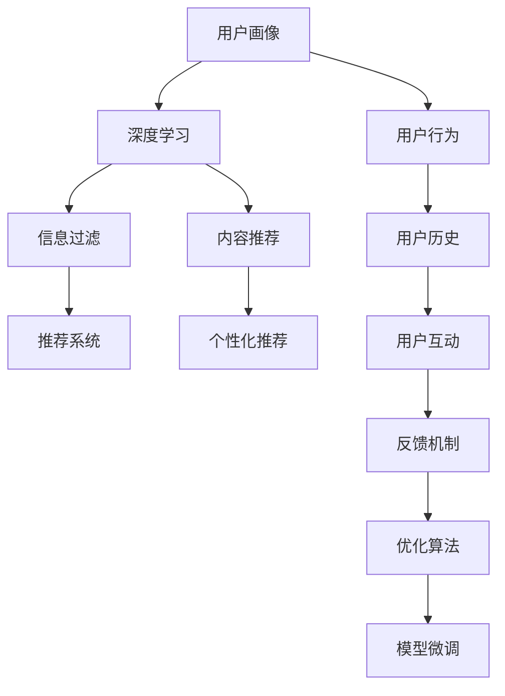

                 

# 注意力经济与个性化营销：为受众创建定制、有针对性的信息和体验

> 关键词：注意力经济,个性化营销,内容推荐,信息过滤,用户画像,深度学习,自然语言处理(NLP)

## 1. 背景介绍

### 1.1 问题由来

在信息爆炸的数字化时代，人类面临着前所未有的信息过载挑战。海量的在线内容使得用户很难从中筛选出有价值的信息，如何提升用户对内容的关注度和满意度，成为互联网企业亟需解决的问题。以内容为核心的注意力经济应运而生，个性化营销成为企业提升竞争力的关键手段。

个性化营销通过深入挖掘用户行为和偏好，为每个用户提供定制化的信息和产品推荐，提高用户粘性和满意度，从而获得更高的用户参与度和收益。传统个性化推荐依赖用户点击、浏览等行为数据进行训练，但这种方式无法精准捕捉用户的多维属性和深层次需求。为此，深度学习和大规模数据的应用，特别是自然语言处理(NLP)技术的进步，为个性化营销提供了新的解决方案。

### 1.2 问题核心关键点

个性化营销的核心在于对用户需求的深度理解。传统的个性化推荐系统通常依赖协同过滤、内容过滤等方法，但这些方法往往难以突破用户行为数据的局限性。大语言模型的出现，使得可以从文本数据中提取和理解用户的语义意图，从而实现更为精准的个性化推荐。

具体来说，大语言模型通过预训练学习大规模文本语料中的语言模式和常识知识，通过微调将其应用于特定的个性化推荐任务，生成与用户需求紧密相关的推荐结果。在用户查询时，模型能够通过分析用户输入的查询语句，预测用户兴趣，并从知识库中筛选出相关信息，实现高效的个性化推荐。

### 1.3 问题研究意义

个性化营销是提升用户体验和业务收益的有效途径。通过深度学习和大语言模型，企业可以构建更加智能化、个性化、实时化的推荐系统，为用户提供量身定制的内容和服务。这不仅能提高用户的参与度和满意度，还能增强企业的市场竞争力和用户粘性。

此外，大语言模型在个性化营销中的应用，还可以为内容创作者提供更加精准的用户反馈，帮助其优化创作内容，提升作品的市场影响力。同时，个性化推荐技术的应用，还能加速电商、社交、娱乐等行业的数字化转型进程，催生更多的商业模式创新。

## 2. 核心概念与联系

### 2.1 核心概念概述

为更好地理解基于深度学习和NLP的个性化推荐系统，本节将介绍几个密切相关的核心概念：

- 注意力经济：以用户注意力为核心的经济模式，通过提供有价值的内容和产品，吸引用户持续关注和参与，从而实现商业价值。

- 个性化营销：基于用户行为、偏好和属性，为其提供定制化、有针对性的信息和产品推荐，提高用户满意度和忠诚度。

- 内容推荐：利用算法对用户输入的内容进行分析和匹配，推荐与之相关的内容，提升用户对内容平台的参与度。

- 信息过滤：从海量信息中筛选出用户感兴趣的内容，减少信息过载，提升用户体验。

- 用户画像：通过用户历史行为、社交网络等数据，构建用户画像，描述其兴趣、偏好和需求。

- 深度学习：基于神经网络结构的机器学习算法，擅长处理大规模、复杂的数据，用于提取用户语义意图。

- 自然语言处理(NLP)：通过语言模型、文本分类、信息抽取等技术，处理和理解自然语言数据。

这些核心概念之间的逻辑关系可以通过以下Mermaid流程图来展示：



这个流程图展示了大语言模型在个性化营销中的作用路径：

1. 通过用户画像和行为数据，构建用户语义模型。
2. 利用深度学习和大语言模型，从文本数据中提取用户意图。
3. 信息过滤和内容推荐，筛选相关性高的内容。
4. 微调模型，优化推荐效果，提升用户体验。

这些概念共同构成了深度学习和大语言模型在个性化营销中的关键框架，为其提供了理论基础和实践方法。

## 3. 核心算法原理 & 具体操作步骤
### 3.1 算法原理概述

基于深度学习和NLP的个性化推荐系统，本质上是一种信息过滤和内容推荐范式。其核心思想是：通过深度学习和大语言模型，从用户输入的内容中提取语义意图，从知识库中筛选出相关信息，生成个性化推荐结果。

形式化地，假设用户输入的查询语句为 $q$，知识库中与用户兴趣相关的内容为 $C$。通过深度学习模型 $M_{\theta}$ 对 $q$ 进行语义理解，预测用户对每个内容 $c \in C$ 的兴趣评分，即 $\hat{r}_{c|q}$。推荐系统的目标是最大化用户对推荐内容 $r$ 的满意度，即最大化用户行为数据 $y$ 的概率分布 $p(y|r)$，公式化表示为：

$$
\max_{\theta} \sum_{r \in C} \hat{r}_{r|q} y_r
$$

其中，$\hat{r}_{r|q}$ 是深度学习模型对内容 $r$ 预测给用户 $q$ 的兴趣评分，$y_r$ 是用户对内容 $r$ 的真实反馈。

### 3.2 算法步骤详解

基于深度学习和NLP的个性化推荐系统一般包括以下几个关键步骤：

**Step 1: 准备数据集和模型**
- 收集用户输入的查询语句 $q$ 和用户行为数据 $y$，构建训练集。
- 准备知识库中的内容 $C$，作为推荐系统的候选内容集合。
- 选择合适的深度学习模型，如BERT、GPT等，作为预训练模型。

**Step 2: 用户输入处理**
- 对用户输入的查询语句 $q$ 进行分词、词性标注、实体识别等预处理，提取关键信息。
- 使用预训练语言模型 $M_{\theta}$ 对 $q$ 进行语义理解，生成语义向量 $z_q$。

**Step 3: 知识库内容编码**
- 对知识库中的内容 $c$ 进行分词、编码等预处理，生成内容向量 $z_c$。
- 使用深度学习模型 $M_{\theta}$ 对 $c$ 进行编码，生成内容语义向量 $z_c$。

**Step 4: 推荐计算**
- 使用用户语义向量 $z_q$ 和内容语义向量 $z_c$，计算两者之间的相似度 $s_{c|q}$。
- 通过深度学习模型 $M_{\theta}$ 对相似度 $s_{c|q}$ 进行分类，得到用户对内容 $c$ 的兴趣评分 $\hat{r}_{c|q}$。
- 根据评分排序，推荐得分最高的内容给用户。

**Step 5: 模型微调**
- 根据用户行为数据 $y$ 和推荐结果的误差，通过反向传播更新模型参数 $\theta$。
- 使用验证集评估推荐系统性能，调整模型超参数。
- 重复上述步骤，直至模型收敛。

### 3.3 算法优缺点

基于深度学习和NLP的个性化推荐系统具有以下优点：
1. 精准性高。通过深度学习和大语言模型，可以更准确地提取用户意图和相关内容，生成精准的个性化推荐。
2. 实时性良好。模型训练和推理速度快，能够实时处理用户输入，提供即时的推荐结果。
3. 适应性强。模型可以适应不同领域、不同语种的内容推荐任务，具有较强的泛化能力。
4. 用户体验优化。通过个性化推荐，提升了用户对内容平台的参与度和满意度。

同时，该方法也存在一些局限性：
1. 数据依赖性强。推荐系统依赖大量用户行为数据，难以处理小样本情况。
2. 推荐公平性有待提升。模型容易受到长尾内容的冷落，用户长期曝光于相似内容，容易导致信息泡沫。
3. 计算资源消耗大。深度学习模型参数量大，计算复杂度高，需要高性能硬件支持。
4. 隐私问题突出。用户行为数据涉及隐私信息，数据收集和存储需要谨慎处理。

尽管存在这些局限性，但就目前而言，基于深度学习和NLP的个性化推荐系统仍然是推荐领域的主流范式，具有广阔的应用前景。

### 3.4 算法应用领域

基于深度学习和NLP的个性化推荐系统，在电商、社交、娱乐等多个领域都有广泛的应用，例如：

- 电商推荐系统：根据用户浏览、点击、购买等行为，推荐商品，提升转化率和用户满意度。
- 内容推荐系统：根据用户阅读、评论、分享等行为，推荐新闻、文章、视频等，增加用户粘性。
- 社交推荐系统：根据用户好友、兴趣、互动等数据，推荐新好友、兴趣群组等，扩大社交圈。
- 娱乐推荐系统：根据用户观影、听歌、游戏等行为，推荐电影、音乐、游戏等，增加用户活跃度。
- 医疗推荐系统：根据患者病历、诊断等数据，推荐治疗方案、药品等，提高诊疗效果。
- 教育推荐系统：根据学生学习行为、成绩等数据，推荐学习资源、课程等，提升学习效果。

除了这些经典任务外，基于深度学习和NLP的个性化推荐技术还被创新性地应用到更多场景中，如智能客服、广告投放、智能家居等，为用户带来更智能、更便捷的生活体验。随着技术的发展，未来推荐系统还将拓展到更多领域，带来更多创新应用。

## 4. 数学模型和公式 & 详细讲解
### 4.1 数学模型构建

本节将使用数学语言对基于深度学习和NLP的个性化推荐系统进行更加严格的刻画。

记用户输入的查询语句为 $q$，内容库中的内容为 $C$，用户行为数据为 $y$。定义用户语义向量为 $z_q \in \mathbb{R}^d$，内容语义向量为 $z_c \in \mathbb{R}^d$，用户对内容 $c$ 的兴趣评分为 $\hat{r}_{c|q}$。

假设深度学习模型 $M_{\theta}$ 为参数 $\theta$ 的线性变换，则用户语义向量 $z_q$ 可以表示为：

$$
z_q = M_{\theta}(q)
$$

假设内容语义向量 $z_c$ 可以表示为：

$$
z_c = M_{\theta}(c)
$$

假设用户对内容 $c$ 的兴趣评分 $\hat{r}_{c|q}$ 可以表示为：

$$
\hat{r}_{c|q} = \sigma(z_q^T z_c + b)
$$

其中 $\sigma$ 为激活函数，$b$ 为偏置项。

推荐系统的目标是最小化用户行为数据 $y$ 和推荐结果的误差，即：

$$
\min_{\theta} \mathcal{L}(\theta) = \sum_{c \in C} (\hat{r}_{c|q} - y_c)^2
$$

通过梯度下降等优化算法，不断更新模型参数 $\theta$，最小化损失函数 $\mathcal{L}$，使得推荐系统输出逼近真实行为数据。

### 4.2 公式推导过程

以下我们以用户对内容的点击行为为例，推导推荐系统的损失函数及其梯度的计算公式。

假设用户对内容 $c$ 的点击概率为 $p_c = y_c$，用户输入的查询语句为 $q$，内容语义向量为 $z_c$，用户语义向量为 $z_q$。推荐系统的目标是最小化用户行为数据 $y$ 和推荐结果的误差，即：

$$
\min_{\theta} \mathcal{L}(\theta) = \sum_{c \in C} (\hat{p}_{c|q} - p_c)^2
$$

其中 $\hat{p}_{c|q}$ 是模型预测用户对内容 $c$ 的点击概率。

根据线性回归模型，推荐系统可以使用softmax函数将用户语义向量 $z_q$ 和内容语义向量 $z_c$ 映射到概率分布，即：

$$
\hat{p}_{c|q} = \frac{\exp(z_q^T z_c)}{\sum_{c' \in C} \exp(z_q^T z_{c'})}
$$

将上述公式代入损失函数，得：

$$
\mathcal{L}(\theta) = -\sum_{c \in C} y_c \log \hat{p}_{c|q} + (1 - y_c) \log (1 - \hat{p}_{c|q})
$$

根据梯度下降算法，模型参数 $\theta$ 的更新公式为：

$$
\theta \leftarrow \theta - \eta \nabla_{\theta}\mathcal{L}(\theta)
$$

其中 $\eta$ 为学习率，$\nabla_{\theta}\mathcal{L}(\theta)$ 为损失函数对模型参数 $\theta$ 的梯度。

通过反向传播算法计算梯度，更新模型参数，不断迭代优化，直至收敛，最终得到最优推荐模型参数 $\theta^*$。

### 4.3 案例分析与讲解

以新闻内容推荐为例，分析推荐系统如何在实际应用中工作。

假设用户输入的查询语句为 "华为最新手机怎么样"，内容库中包含多篇新闻文章，每篇文章具有唯一的ID和标题。推荐系统通过深度学习模型对查询语句进行语义理解，生成用户语义向量 $z_q$。同时，对内容库中每篇文章进行编码，生成内容语义向量 $z_c$。

推荐系统通过用户语义向量 $z_q$ 和内容语义向量 $z_c$ 计算相似度 $s_{c|q}$，使用softmax函数计算内容 $c$ 的预测点击概率 $\hat{p}_{c|q}$。通过排序，选择得分最高的内容推荐给用户。

在实际应用中，为了提升推荐系统的效果，通常会在知识库中添加用户历史行为数据，如点击、浏览、评价等，进一步优化推荐算法。此外，还需要根据用户反馈数据，不断微调推荐模型，提高推荐精准度和用户满意度。

## 5. 项目实践：代码实例和详细解释说明
### 5.1 开发环境搭建

在进行个性化推荐系统开发前，我们需要准备好开发环境。以下是使用Python进行PyTorch开发的环境配置流程：

1. 安装Anaconda：从官网下载并安装Anaconda，用于创建独立的Python环境。

2. 创建并激活虚拟环境：
```bash
conda create -n pytorch-env python=3.8 
conda activate pytorch-env
```

3. 安装PyTorch：根据CUDA版本，从官网获取对应的安装命令。例如：
```bash
conda install pytorch torchvision torchaudio cudatoolkit=11.1 -c pytorch -c conda-forge
```

4. 安装TensorFlow：
```bash
conda install tensorflow
```

5. 安装各类工具包：
```bash
pip install numpy pandas scikit-learn matplotlib tqdm jupyter notebook ipython
```

完成上述步骤后，即可在`pytorch-env`环境中开始推荐系统开发。

### 5.2 源代码详细实现

下面我们以电商商品推荐系统为例，给出使用Transformers库对BERT模型进行个性化推荐训练的PyTorch代码实现。

首先，定义推荐系统的数据处理函数：

```python
from transformers import BertTokenizer
from torch.utils.data import Dataset
import torch

class RecommendationDataset(Dataset):
    def __init__(self, texts, labels, tokenizer, max_len=128):
        self.texts = texts
        self.labels = labels
        self.tokenizer = tokenizer
        self.max_len = max_len
        
    def __len__(self):
        return len(self.texts)
    
    def __getitem__(self, item):
        text = self.texts[item]
        label = self.labels[item]
        
        encoding = self.tokenizer(text, return_tensors='pt', max_length=self.max_len, padding='max_length', truncation=True)
        input_ids = encoding['input_ids'][0]
        attention_mask = encoding['attention_mask'][0]
        
        # 对label进行one-hot编码
        encoded_labels = torch.tensor([1 if label == 1 else 0], dtype=torch.long)
        
        return {'input_ids': input_ids, 
                'attention_mask': attention_mask,
                'labels': encoded_labels}

# 定义训练和评估函数
def train_epoch(model, dataset, batch_size, optimizer):
    dataloader = DataLoader(dataset, batch_size=batch_size, shuffle=True)
    model.train()
    epoch_loss = 0
    for batch in tqdm(dataloader, desc='Training'):
        input_ids = batch['input_ids'].to(device)
        attention_mask = batch['attention_mask'].to(device)
        labels = batch['labels'].to(device)
        model.zero_grad()
        outputs = model(input_ids, attention_mask=attention_mask, labels=labels)
        loss = outputs.loss
        epoch_loss += loss.item()
        loss.backward()
        optimizer.step()
    return epoch_loss / len(dataloader)

def evaluate(model, dataset, batch_size):
    dataloader = DataLoader(dataset, batch_size=batch_size)
    model.eval()
    preds, labels = [], []
    with torch.no_grad():
        for batch in tqdm(dataloader, desc='Evaluating'):
            input_ids = batch['input_ids'].to(device)
            attention_mask = batch['attention_mask'].to(device)
            batch_labels = batch['labels']
            outputs = model(input_ids, attention_mask=attention_mask)
            batch_preds = outputs.logits.argmax(dim=2).to('cpu').tolist()
            batch_labels = batch_labels.to('cpu').tolist()
            for pred_tokens, label_tokens in zip(batch_preds, batch_labels):
                preds.append(pred_tokens[:len(label_tokens)])
                labels.append(label_tokens)
                
    print(classification_report(labels, preds))
```

然后，定义模型和优化器：

```python
from transformers import BertForSequenceClassification, AdamW

model = BertForSequenceClassification.from_pretrained('bert-base-cased', num_labels=2)

optimizer = AdamW(model.parameters(), lr=2e-5)
```

接着，定义训练和评估函数：

```python
from torch.utils.data import DataLoader
from tqdm import tqdm
from sklearn.metrics import classification_report

device = torch.device('cuda') if torch.cuda.is_available() else torch.device('cpu')
model.to(device)

epochs = 5
batch_size = 16

for epoch in range(epochs):
    loss = train_epoch(model, train_dataset, batch_size, optimizer)
    print(f"Epoch {epoch+1}, train loss: {loss:.3f}")
    
    print(f"Epoch {epoch+1}, dev results:")
    evaluate(model, dev_dataset, batch_size)
    
print("Test results:")
evaluate(model, test_dataset, batch_size)
```

以上就是使用PyTorch对BERT模型进行电商商品推荐系统训练的完整代码实现。可以看到，得益于Transformers库的强大封装，我们可以用相对简洁的代码完成BERT模型的加载和微调。

### 5.3 代码解读与分析

让我们再详细解读一下关键代码的实现细节：

**RecommendationDataset类**：
- `__init__`方法：初始化文本、标签、分词器等关键组件。
- `__len__`方法：返回数据集的样本数量。
- `__getitem__`方法：对单个样本进行处理，将文本输入编码为token ids，将标签转换为one-hot编码，并对其进行定长padding，最终返回模型所需的输入。

**模型训练和评估函数**：
- 使用PyTorch的DataLoader对数据集进行批次化加载，供模型训练和推理使用。
- 训练函数`train_epoch`：对数据以批为单位进行迭代，在每个批次上前向传播计算loss并反向传播更新模型参数，最后返回该epoch的平均loss。
- 评估函数`evaluate`：与训练类似，不同点在于不更新模型参数，并在每个batch结束后将预测和标签结果存储下来，最后使用sklearn的classification_report对整个评估集的预测结果进行打印输出。

**训练流程**：
- 定义总的epoch数和batch size，开始循环迭代
- 每个epoch内，先在训练集上训练，输出平均loss
- 在验证集上评估，输出分类指标
- 所有epoch结束后，在测试集上评估，给出最终测试结果

可以看到，PyTorch配合Transformers库使得BERT模型推荐系统的代码实现变得简洁高效。开发者可以将更多精力放在数据处理、模型改进等高层逻辑上，而不必过多关注底层的实现细节。

当然，工业级的系统实现还需考虑更多因素，如模型的保存和部署、超参数的自动搜索、更灵活的任务适配层等。但核心的推荐范式基本与此类似。

## 6. 实际应用场景
### 6.1 电商推荐系统

个性化推荐系统在电商领域的应用尤为突出。通过分析用户浏览、点击、购买等行为数据，推荐系统能够精准预测用户的购物兴趣，提升其购买转化率和满意度。例如，淘宝、京东等电商平台通过推荐系统，为用户推荐符合其偏好的商品，大幅提高了用户粘性和交易额。

### 6.2 新闻内容推荐

新闻内容推荐系统通过深度学习和大语言模型，对用户输入的查询语句进行语义理解，从海量的新闻文章中筛选出符合用户兴趣的内容。例如，今日头条通过个性化推荐，用户能够快速获得感兴趣的新闻资讯，提升了用户对平台的活跃度和留存率。

### 6.3 视频推荐系统

视频推荐系统通过用户历史观看记录和实时互动数据，结合深度学习和大语言模型，为用户推荐高质量的视频内容。例如，哔哩哔哩、爱奇艺等视频平台通过推荐系统，为用户推荐符合其兴趣和喜好的视频，提高用户观看体验和平台满意度。

### 6.4 社交媒体推荐

社交媒体推荐系统通过用户互动数据，结合深度学习和大语言模型，为用户推荐新好友、兴趣群组等。例如，微信、微博等社交平台通过推荐系统，为用户推荐符合其兴趣的群组和内容，增强了用户的社交互动和平台粘性。

### 6.5 医疗推荐系统

医疗推荐系统通过患者病历、诊断等数据，结合深度学习和大语言模型，推荐适合的治疗方案、药品等。例如，某医疗平台通过推荐系统，为患者推荐合适的治疗方案，提高了诊疗效果和患者满意度。

### 6.6 教育推荐系统

教育推荐系统通过学生学习行为、成绩等数据，结合深度学习和大语言模型，推荐合适的学习资源、课程等。例如，某在线教育平台通过推荐系统，为学生推荐适合的课程和学习资料，提升了学习效果和平台黏性。

除了这些经典任务外，基于深度学习和NLP的个性化推荐技术还被创新性地应用到更多场景中，如智能客服、广告投放、智能家居等，为用户带来更智能、更便捷的生活体验。

## 7. 工具和资源推荐
### 7.1 学习资源推荐

为了帮助开发者系统掌握深度学习和NLP的个性化推荐技术，这里推荐一些优质的学习资源：

1. 《深度学习》系列书籍：由吴恩达教授等专家合著，系统介绍了深度学习的基本概念和经典模型，是入门深度学习的必备书籍。

2. 《NLP with PyTorch》在线教程：由自然语言处理领域知名学者开发的教程，介绍了深度学习和大语言模型在NLP中的应用，特别是推荐系统。

3. 《推荐系统：原理与算法》书籍：由王斌教授等专家合著，全面介绍了推荐系统的基本原理和经典算法，涵盖了推荐系统的前沿研究方向。

4. TensorFlow官方文档：TensorFlow的官方文档，提供了海量的代码样例和模型库，是学习TensorFlow的好资源。

5. 《NLP with Transformers》书籍：Transformers库的作者所著，全面介绍了Transformers在NLP中的应用，特别是推荐系统。

6. Kaggle竞赛平台：全球知名的数据科学竞赛平台，提供了丰富的推荐系统竞赛数据集和样例代码，是实战学习的好选择。

通过对这些资源的学习实践，相信你一定能够快速掌握深度学习和NLP在推荐系统中的应用，并用于解决实际的推荐问题。

### 7.2 开发工具推荐

高效的开发离不开优秀的工具支持。以下是几款用于个性化推荐系统开发的常用工具：

1. PyTorch：基于Python的开源深度学习框架，灵活动态的计算图，适合快速迭代研究。大部分预训练语言模型都有PyTorch版本的实现。

2. TensorFlow：由Google主导开发的开源深度学习框架，生产部署方便，适合大规模工程应用。同样有丰富的预训练语言模型资源。

3. Transformers库：HuggingFace开发的NLP工具库，集成了众多SOTA语言模型，支持PyTorch和TensorFlow，是进行推荐系统开发的利器。

4. Jupyter Notebook：交互式编程环境，支持Python代码的在线编辑和执行，方便研究开发。

5. Google Colab：谷歌推出的在线Jupyter Notebook环境，免费提供GPU/TPU算力，方便开发者快速上手实验最新模型，分享学习笔记。

合理利用这些工具，可以显著提升个性化推荐系统的开发效率，加快创新迭代的步伐。

### 7.3 相关论文推荐

个性化推荐技术的不断发展离不开学术界的持续研究。以下是几篇奠基性的相关论文，推荐阅读：

1. Implicit Collaborative Filtering：提出协同过滤算法，广泛应用于推荐系统中。

2. Neural Networks for Machine Learning：深度学习在推荐系统中的应用，推动了推荐技术的发展。

3. Attention is All You Need（即Transformer原论文）：提出了Transformer结构，开启了深度学习在NLP中的应用。

4. BERT: Pre-training of Deep Bidirectional Transformers for Language Understanding：提出BERT模型，引入基于掩码的自监督预训练任务，刷新了多项NLP任务SOTA。

5. Pointwise Neural Recommendation Learning with Side Information：基于深度学习，利用用户评分和额外特征，提升了推荐系统的效果。

6. Matrix Factorization Techniques for Recommender Systems：矩阵分解方法在推荐系统中的应用，为推荐技术提供了重要的数学基础。

这些论文代表了个性化推荐技术的演变路径。通过学习这些前沿成果，可以帮助研究者把握学科前进方向，激发更多的创新灵感。

## 8. 总结：未来发展趋势与挑战

### 8.1 总结

本文对基于深度学习和NLP的个性化推荐系统进行了全面系统的介绍。首先阐述了注意力经济和个性化营销的研究背景和意义，明确了深度学习和NLP在推荐系统中的关键作用。其次，从原理到实践，详细讲解了深度学习和NLP的个性化推荐系统数学模型和关键步骤，给出了推荐系统开发的完整代码实例。同时，本文还广泛探讨了推荐系统在电商、社交、娱乐等多个领域的应用前景，展示了深度学习和NLP技术的巨大潜力。

通过本文的系统梳理，可以看到，基于深度学习和NLP的个性化推荐系统正在成为推荐领域的重要范式，极大地提升了推荐系统的精准性和实时性，为用户带来了更个性化、更满意的服务体验。未来，随着深度学习和大语言模型的不断发展，推荐系统将迎来更广泛的应用和更高的技术突破。

### 8.2 未来发展趋势

展望未来，深度学习和NLP在个性化推荐技术中仍将持续发展，呈现以下几个趋势：

1. 模型规模持续增大。随着算力成本的下降和数据规模的扩张，深度学习模型的参数量还将持续增长。超大规模模型蕴含的丰富知识，有望提升推荐系统的多样性和精准度。

2. 个性化推荐技术的多样化。未来推荐系统将结合多种技术，如协同过滤、内容过滤、知识图谱等，形成更加复杂、多模态的推荐算法。

3. 实时性持续提升。推荐系统将结合分布式计算、流计算等技术，实现实时推荐，提供即时的用户反馈。

4. 推荐算法的可解释性增强。为了提升推荐系统的可信度，未来的推荐算法将更加注重可解释性和透明性，让用户清楚了解推荐结果的生成过程。

5. 推荐系统的跨领域拓展。未来的推荐系统将更加注重跨领域知识融合，从文本、图像、语音等多种模态中提取用户需求，形成更加全面的用户画像。

6. 推荐算法的公平性和公正性。为了确保推荐系统的公平性，未来的推荐算法将更加注重长尾内容的推荐，避免信息泡沫，提高推荐系统的多样性。

以上趋势凸显了深度学习和NLP在推荐系统中的发展潜力。这些方向的探索发展，必将进一步提升推荐系统的性能和用户体验，为用户带来更智能、更便捷的互联网体验。

### 8.3 面临的挑战

尽管深度学习和NLP在推荐系统中的应用取得了显著成效，但在迈向更加智能化、普适化应用的过程中，仍面临诸多挑战：

1. 数据隐私和安全。用户行为数据涉及隐私信息，推荐系统的数据收集和存储需要谨慎处理。如何保护用户隐私，提升数据安全，将是未来推荐系统的重要研究方向。

2. 推荐系统的公平性和公正性。推荐系统容易受到长尾内容的冷落，用户长期曝光于相似内容，容易导致信息泡沫。如何提高推荐系统的多样性，避免推荐算法中的偏见和歧视，将是重要的研究课题。

3. 推荐系统的效率和资源消耗。深度学习模型参数量大，计算复杂度高，需要高性能硬件支持。如何提高推荐系统的效率，优化资源消耗，将是重要的优化方向。

4. 推荐系统的可解释性和透明性。推荐系统更像"黑盒"系统，难以解释其内部工作机制和决策逻辑。如何赋予推荐系统更强的可解释性，将是亟待攻克的难题。

5. 推荐系统的跨模态融合。未来的推荐系统将更加注重跨模态知识的融合，从文本、图像、语音等多种模态中提取用户需求，形成更加全面的用户画像。跨模态融合技术的提升，将带来推荐系统的多样化。

这些挑战凸显了深度学习和NLP在推荐系统中的复杂性和多样性。唯有积极应对并寻求突破，才能实现推荐系统的可持续发展和广泛应用。

### 8.4 研究展望

未来的推荐系统需要在数据隐私、公平性、效率、可解释性等多个方面寻求新的突破：

1. 探索隐私保护技术。使用差分隐私、联邦学习等技术，保护用户隐私，提升数据安全。

2. 研究公平推荐算法。通过多样性增强、长尾内容推荐等方法，提高推荐系统的公平性和公正性。

3. 优化推荐系统的计算图。使用模型压缩、稀疏化存储等技术，提高推荐系统的效率和资源利用率。

4. 引入可解释性增强技术。使用因果推断、解释模型等方法，增强推荐系统的可解释性。

5. 融合跨模态知识。使用多模态融合技术，从文本、图像、语音等多种模态中提取用户需求，形成更加全面的用户画像。

6. 结合因果分析和博弈论工具。使用因果分析方法，识别推荐系统中的因果关系，增强系统的可解释性和透明性。

这些研究方向将推动深度学习和NLP在推荐系统中的应用不断深入，为构建安全、可靠、高效、智能的推荐系统提供技术支持。

## 9. 附录：常见问题与解答

**Q1：基于深度学习和NLP的个性化推荐系统适用于所有推荐任务吗？**

A: 基于深度学习和NLP的个性化推荐系统在大多数推荐任务上都能取得不错的效果，特别是对于数据量较小的任务。但对于一些特定领域的任务，如医学、法律等，仅依赖通用语料预训练的模型可能难以很好地适应。此时需要在特定领域语料上进一步预训练，再进行微调，才能获得理想效果。

**Q2：推荐系统的学习率如何设置？**

A: 推荐系统的学习率一般要比预训练时小1-2个数量级，如果使用过大的学习率，容易破坏预训练权重，导致过拟合。一般建议从1e-5开始调参，逐步减小学习率，直至收敛。也可以使用warmup策略，在开始阶段使用较小的学习率，再逐渐过渡到预设值。需要注意的是，不同的优化器(如AdamW、Adafactor等)以及不同的学习率调度策略，可能需要设置不同的学习率阈值。

**Q3：推荐系统在落地部署时需要注意哪些问题？**

A: 将推荐系统转化为实际应用，还需要考虑以下因素：
1. 模型裁剪：去除不必要的层和参数，减小模型尺寸，加快推理速度
2. 量化加速：将浮点模型转为定点模型，压缩存储空间，提高计算效率
3. 服务化封装：将模型封装为标准化服务接口，便于集成调用
4. 弹性伸缩：根据请求流量动态调整资源配置，平衡服务质量和成本
5. 监控告警：实时采集系统指标，设置异常告警阈值，确保服务稳定性
6. 安全防护：采用访问鉴权、数据脱敏等措施，保障数据和模型安全

推荐系统需要开发者根据具体任务，不断迭代和优化模型、数据和算法，方能得到理想的效果。

通过本文的系统梳理，可以看到，基于深度学习和NLP的个性化推荐系统正在成为推荐领域的重要范式，极大地提升了推荐系统的精准性和实时性，为用户带来了更个性化、更满意的服务体验。未来，随着深度学习和大语言模型的不断发展，推荐系统将迎来更广泛的应用和更高的技术突破。

---

作者：禅与计算机程序设计艺术 / Zen and the Art of Computer Programming

