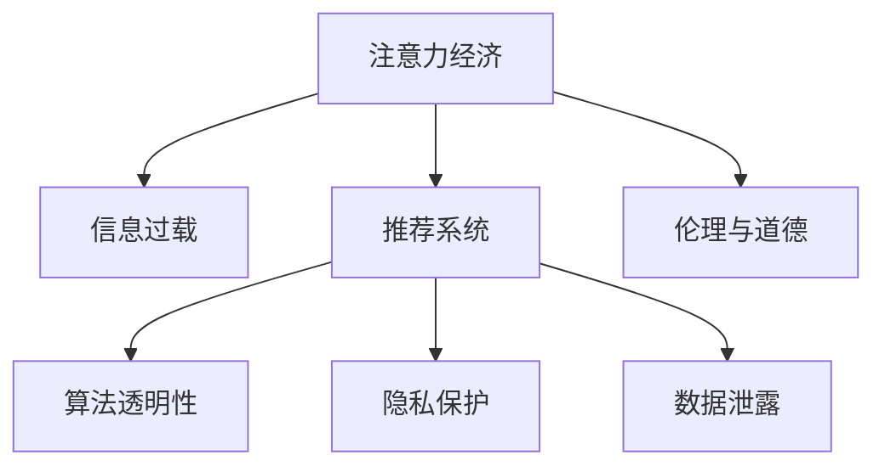

                 

# 注意力经济与信息过载的矛盾

> 关键词：注意力经济, 信息过载, 数字时代, 信息筛选, 推荐系统, 算法透明性, 隐私保护, 数据泄露, 伦理与道德

## 1. 背景介绍

### 1.1 问题由来
在数字时代，信息的爆炸式增长给人们带来了前所未有的便利，也带来了巨大的信息过载问题。在传统媒体时代，信息的获取渠道有限，且需要通过复杂的筛选和评估过程，从而筛选出高质量的信息供消费者使用。但在互联网时代，信息的海量增长和快速传播使得消费者面临严重的信息过载问题，如何高效地筛选和处理这些信息成为了一大难题。

为解决这一问题，“注意力经济”应运而生。注意力经济，是指通过引导和吸引用户的注意力，将其转化为价值和效益的商业模式。在注意力经济中，信息筛选和推荐系统成为了关键。推荐系统通过分析用户的兴趣和行为数据，为其推荐最相关、最有价值的信息，从而帮助用户在海量信息中快速找到所需内容。

然而，尽管推荐系统在信息筛选和推荐上取得了巨大成功，但也引发了诸多伦理、隐私和公平性问题，如何在满足用户需求的同时，保护用户隐私和数据安全，成为了一个亟待解决的问题。

## 2. 核心概念与联系

### 2.1 核心概念概述

为更好地理解注意力经济与信息过载的矛盾，本节将介绍几个关键概念及其联系：

- 注意力经济：通过吸引和引导用户的注意力，将其转化为价值和效益的商业模式。注意力经济的核心在于如何更高效地使用用户的时间和注意力。
- 信息过载：由于信息量巨大，用户无法在有限时间内有效处理所有信息，从而导致的困惑、焦虑和认知过载现象。信息过载是数字时代的一个普遍问题，严重影响了用户的生活和工作质量。
- 推荐系统：基于用户的兴趣和行为数据，为其推荐相关信息的算法系统。推荐系统通常依赖于用户的历史行为数据、协同过滤等技术，可以极大地提高用户的信息处理效率。
- 算法透明性：指算法的工作原理、决策依据和数据来源等对用户的可解释性。算法透明性是实现公平、公正、可信赖推荐系统的必要条件。
- 隐私保护：在信息收集和处理过程中，保护用户隐私，防止数据泄露和滥用。隐私保护是算法透明性的重要组成部分，也是注意力经济中不可忽视的法律和道德问题。
- 数据泄露：指敏感信息被非法获取、使用或传播，通常涉及用户的个人隐私数据，如个人信息、交易记录等。数据泄露对用户的隐私和权益构成严重威胁。
- 伦理与道德：在信息处理和推荐过程中，遵循一定的伦理准则和道德规范，保障用户权益，促进公平公正。伦理与道德是注意力经济中的重要保障，也是实现可持续发展的关键。

这些概念之间的逻辑关系可以通过以下Mermaid流程图来展示：



这个流程图展示了注意力经济与信息过载、推荐系统、算法透明性、隐私保护、数据泄露、伦理道德之间的联系和影响。

## 3. 核心算法原理 & 具体操作步骤

### 3.1 算法原理概述

推荐系统的核心在于如何高效地分析用户数据，为其推荐相关、有价值的信息。推荐系统通常基于协同过滤、基于内容的推荐、基于矩阵分解等算法，通过分析用户的历史行为数据和兴趣模型，预测用户可能感兴趣的物品，并为其推荐。

形式化地，设推荐系统为用户 $u$ 推荐物品 $i$，推荐结果为 $r_{ui}$，其中 $r_{ui} \in [0,1]$ 表示用户 $u$ 对物品 $i$ 的兴趣程度。推荐系统的目标是最大化用户满意度，即最大化如下目标函数：

$$
\max_{\theta} \sum_{u,i} r_{ui} \log p_{ui} + (1-r_{ui})\log(1-p_{ui})
$$

其中 $p_{ui}=f(\theta,u,i)$ 为物品 $i$ 对用户 $u$ 的兴趣概率，$f$ 为推荐函数，$\theta$ 为模型参数。

在实际应用中，推荐系统通常使用基于矩阵分解、协同过滤、深度学习等模型进行推荐。推荐算法通过学习用户和物品的特征，构建用户-物品交互矩阵，并利用矩阵分解方法将其转化为低维特征向量。

### 3.2 算法步骤详解

推荐系统的具体算法步骤通常包括以下几个关键环节：

**Step 1: 数据预处理**
- 收集用户行为数据，如点击、浏览、购买等。
- 对数据进行清洗、归一化、去重等处理，确保数据质量。
- 将数据转换为适合算法处理的形式，如向量化表示。

**Step 2: 用户兴趣模型构建**
- 对用户行为数据进行分析，提取用户的兴趣特征。
- 可以使用协同过滤、基于内容的推荐、矩阵分解等方法，为用户建立兴趣模型。
- 用户兴趣模型通常包含用户的偏好、历史行为、社交关系等信息。

**Step 3: 物品特征提取**
- 对物品的描述、标签、类别等信息进行分析，提取物品的特征。
- 可以使用TF-IDF、word2vec等技术，将物品描述转换为向量表示。
- 物品特征通常包含物品的属性、属性值、类别等信息。

**Step 4: 推荐函数计算**
- 使用协同过滤、矩阵分解等算法，计算物品 $i$ 对用户 $u$ 的兴趣概率 $p_{ui}$。
- 协同过滤算法通常基于用户-物品评分矩阵 $R$ 进行计算，$R_{ui}=r_{ui}$。
- 矩阵分解算法通常将 $R$ 分解为 $\hat{R}=U\times V^\top$，其中 $U$ 为用户特征矩阵，$V$ 为物品特征矩阵，$p_{ui}=\hat{R}_{ui}$。

**Step 5: 推荐结果排序**
- 对计算出的用户-物品兴趣概率进行排序，选择推荐结果中概率最高的物品作为推荐结果。
- 常用的排序方法包括降序排序、加权排序等。

**Step 6: 推荐结果展示**
- 将推荐结果展示给用户，并提供相应的操作接口，如选择、购买等。
- 用户可以根据推荐结果进行操作，产生新的行为数据，更新推荐系统。

### 3.3 算法优缺点

推荐系统具有以下优点：
- 高效性：通过分析用户行为数据，可以极大地提高信息筛选和推荐的效率。
- 个性化：能够根据用户的兴趣和行为，为其推荐最相关、最有价值的信息。
- 可扩展性：可以适应不同规模的用户和物品数据，具有较高的可扩展性。

同时，推荐系统也存在以下局限性：
- 数据依赖：推荐系统的效果很大程度上取决于用户行为数据的质量和数量。
- 泛化能力不足：当新物品加入推荐系统时，由于缺乏历史数据，可能难以有效推荐。
- 冷启动问题：新用户或新物品加入推荐系统时，由于缺乏行为数据，可能导致推荐结果不佳。
- 隐私风险：推荐系统依赖用户行为数据，可能存在数据泄露和滥用的风险。
- 公平性问题：推荐算法可能存在偏见，导致某些用户或物品难以获得推荐机会。

尽管存在这些局限性，但推荐系统在信息筛选和推荐上取得了显著的成果，成为现代信息处理的重要手段。未来相关研究应集中在提高数据质量、增强泛化能力、解决冷启动问题、保护用户隐私、提升公平性等方面。

### 3.4 算法应用领域

推荐系统在多个领域得到了广泛应用，例如：

- 电商购物：为用户推荐商品、店铺、优惠等，提升用户购买体验和转化率。
- 视频网站：为用户推荐视频、频道、剧集等，增加用户观看时间，提高网站流量。
- 新闻推荐：为用户推荐新闻、文章、评论等，提升用户阅读体验，增加网站粘性。
- 音乐播放：为用户推荐歌曲、专辑、艺人等，提升音乐播放量，增加用户粘性。
- 社交网络：为用户推荐朋友、内容、活动等，增加用户互动，提升平台活跃度。

这些领域的应用表明，推荐系统已经成为现代信息处理的重要工具，广泛应用于各个行业。

## 4. 数学模型和公式 & 详细讲解 & 举例说明

### 4.1 数学模型构建

本节将使用数学语言对推荐系统的核心算法进行更严格的刻画。

设推荐系统为 $R_{ui}$，其中 $R_{ui} \in [0,1]$ 表示用户 $u$ 对物品 $i$ 的兴趣概率。定义用户兴趣模型为 $U$，物品特征模型为 $V$，推荐函数为 $f$，则推荐系统可以表示为：

$$
p_{ui}=f(U_i,V_u)
$$

其中 $U_i$ 为物品 $i$ 的用户兴趣模型，$V_u$ 为用户 $u$ 的物品特征模型，$f$ 为推荐函数。通常，推荐函数 $f$ 为矩阵分解算法，将用户-物品评分矩阵 $R$ 分解为 $U\times V^\top$，其中 $U$ 为用户特征矩阵，$V$ 为物品特征矩阵，则推荐结果为：

$$
p_{ui}=\hat{R}_{ui}
$$

### 4.2 公式推导过程

以下我们以协同过滤算法为例，推导推荐函数的计算公式。

设用户-物品评分矩阵为 $R$，则协同过滤算法可以根据矩阵分解方法，将 $R$ 分解为 $\hat{R}=U\times V^\top$，其中 $U$ 为用户特征矩阵，$V$ 为物品特征矩阵。用户 $u$ 对物品 $i$ 的兴趣概率为：

$$
p_{ui}=\hat{R}_{ui}=\sum_{j=1}^k U_{uj}V_{ij}
$$

其中 $k$ 为特征向量的维度，$U_{uj}$ 和 $V_{ij}$ 分别为用户 $u$ 和物品 $i$ 的特征向量，$\sum$ 表示矩阵乘法。

### 4.3 案例分析与讲解

我们以电商购物平台为例，分析推荐系统的实际应用。

设电商平台的商品为物品 $i$，用户为 $u$。平台收集用户的浏览、点击、购买等行为数据，提取用户的兴趣特征，并建立用户模型 $U$。同时，平台提取商品的描述、价格、类别等信息，提取物品的特征，并建立物品模型 $V$。最后，平台使用协同过滤算法，计算物品 $i$ 对用户 $u$ 的兴趣概率 $p_{ui}$，并根据概率排序推荐商品给用户 $u$。

用户可以根据推荐结果进行操作，如选择购买某商品，产生新的行为数据，更新推荐系统。平台可以通过用户的操作数据，不断优化推荐算法，提高推荐效果。

## 5. 项目实践：代码实例和详细解释说明

### 5.1 开发环境搭建

在进行推荐系统开发前，我们需要准备好开发环境。以下是使用Python进行TensorFlow开发的环境配置流程：

1. 安装Anaconda：从官网下载并安装Anaconda，用于创建独立的Python环境。

2. 创建并激活虚拟环境：
```bash
conda create -n recommendation-env python=3.8 
conda activate recommendation-env
```

3. 安装TensorFlow：根据CUDA版本，从官网获取对应的安装命令。例如：
```bash
conda install tensorflow -c tf
```

4. 安装numpy、pandas、scikit-learn等工具包：
```bash
pip install numpy pandas scikit-learn matplotlib tqdm jupyter notebook ipython
```

完成上述步骤后，即可在`recommendation-env`环境中开始推荐系统开发。

### 5.2 源代码详细实现

下面我们以电商购物平台的协同过滤推荐系统为例，给出使用TensorFlow进行推荐系统开发的Python代码实现。

首先，定义协同过滤推荐系统的主要函数：

```python
import numpy as np
from tensorflow.keras.layers import Input, Dense, Dot, Concatenate
from tensorflow.keras.models import Model

def collaborative_filtering(r, k):
    U = Input(shape=(k,))
    V = Input(shape=(k,))
    h = Dot(axes=2)([U,V])
    r_pred = Dot(axes=2)([h,V])
    model = Model(inputs=[U,V], outputs=r_pred)
    return model
```

然后，加载和预处理数据集：

```python
# 加载数据集
r = np.loadtxt('data/rating.txt', delimiter=' ')

# 数据预处理
r = (r - np.mean(r)) / np.std(r)
U = np.loadtxt('data/user.txt', delimiter=',').reshape(-1, k)
V = np.loadtxt('data/item.txt', delimiter=',').reshape(-1, k)
```

最后，训练推荐模型并输出推荐结果：

```python
from tensorflow.keras.optimizers import Adam

# 定义模型
model = collaborative_filtering(r, k)

# 编译模型
model.compile(loss='mse', optimizer=Adam(lr=0.01))

# 训练模型
model.fit([U,V], r, epochs=100, batch_size=64)

# 预测推荐结果
U_new = np.random.rand(1,k)
V_new = np.random.rand(1,k)
r_pred = model.predict([U_new,V_new])
```

以上代码实现了基于协同过滤算法的推荐系统，通过加载和预处理数据集，定义协同过滤函数，并使用TensorFlow进行模型训练和预测。

### 5.3 代码解读与分析

让我们再详细解读一下关键代码的实现细节：

**collaborative_filtering函数**：
- 定义输入层U和V，分别表示用户特征向量和物品特征向量。
- 使用Dot层进行矩阵乘法，得到用户-物品兴趣概率的预测值。
- 返回模型函数，用于训练和预测。

**加载和预处理数据集**：
- 使用numpy加载数据集，并进行标准化处理，确保数据质量。
- 将用户和物品特征向量的维度指定为 $k$，用于后续计算。

**模型训练和预测**：
- 使用Adam优化器进行模型训练，最小化均方误差损失。
- 预测新用户和物品的推荐结果，可以通过指定新用户和物品的特征向量进行预测。

可以看到，TensorFlow提供的高效的自动微分功能和模块化接口，使得推荐系统的开发变得简洁高效。开发者可以将更多精力放在数据处理和算法优化上，而不必过多关注底层实现细节。

当然，工业级的系统实现还需考虑更多因素，如模型的保存和部署、超参数的自动搜索、更灵活的任务适配层等。但核心的推荐范式基本与此类似。

## 6. 实际应用场景

### 6.1 电商平台推荐系统

电商平台的推荐系统是推荐系统在电商领域的一个典型应用。电商平台通过收集用户浏览、点击、购买等行为数据，为其推荐最相关、最有价值的产品，提升用户购买体验和转化率。

在技术实现上，电商平台通常使用协同过滤、基于内容的推荐、深度学习等技术，建立用户和物品的兴趣模型，计算用户-物品的兴趣概率，并根据概率排序推荐产品。通过不断收集用户的操作数据，电商平台可以优化推荐算法，提高推荐效果。

### 6.2 视频网站推荐系统

视频网站通常会收集用户的观看历史、点赞、收藏等行为数据，建立用户和视频内容的兴趣模型，为其推荐最相关、最有价值的视频内容，提升用户观看体验和观看时长。

视频网站通常使用协同过滤、基于内容的推荐、深度学习等技术，计算用户-视频内容的兴趣概率，并根据概率排序推荐视频内容。同时，视频网站还可以使用热力图、流行度等手段，提升推荐效果。

### 6.3 社交网络推荐系统

社交网络平台通过收集用户的关注、互动、点赞等行为数据，为其推荐最相关、最有价值的内容、好友、活动等，提升用户活跃度和平台粘性。

社交网络平台通常使用协同过滤、基于内容的推荐、深度学习等技术，建立用户和内容、好友、活动的兴趣模型，计算用户-内容的兴趣概率，并根据概率排序推荐内容、好友、活动等。同时，社交网络平台还可以使用热力图、流行度等手段，提升推荐效果。

### 6.4 未来应用展望

随着推荐系统技术的不断进步，其在更多领域将得到应用，为各个行业带来变革性影响。

在智慧医疗领域，推荐系统可以为医生推荐最相关、最有价值的病历、文献等，提升医疗服务的智能化水平，辅助医生诊疗，加速新药开发进程。

在智能教育领域，推荐系统可以为学生推荐最相关、最有价值的学习资源、课程等，因材施教，促进教育公平，提高教学质量。

在智慧城市治理中，推荐系统可以为城市管理者推荐最相关、最有价值的信息、方案等，提高城市管理的自动化和智能化水平，构建更安全、高效的未来城市。

此外，在企业生产、社会治理、文娱传媒等众多领域，推荐系统也将不断涌现，为传统行业数字化转型升级提供新的技术路径。相信随着技术的日益成熟，推荐系统必将在构建人机协同的智能时代中扮演越来越重要的角色。

## 7. 工具和资源推荐

### 7.1 学习资源推荐

为了帮助开发者系统掌握推荐系统的理论基础和实践技巧，这里推荐一些优质的学习资源：

1. 《推荐系统：算法与应用》系列博文：由推荐系统技术专家撰写，深入浅出地介绍了推荐系统的基本原理、算法与应用。

2. CS223《机器学习与数据挖掘》课程：斯坦福大学开设的推荐系统明星课程，有Lecture视频和配套作业，带你入门推荐系统的基本概念和经典算法。

3. 《推荐系统实战》书籍：推荐系统领域经典著作，详细介绍了推荐系统的前沿算法和工业应用。

4. Kaggle推荐系统竞赛：Kaggle举办的推荐系统竞赛，涵盖推荐系统的各种任务，有助于积累实践经验。

通过对这些资源的学习实践，相信你一定能够快速掌握推荐系统的精髓，并用于解决实际的推荐问题。

### 7.2 开发工具推荐

高效的开发离不开优秀的工具支持。以下是几款用于推荐系统开发的常用工具：

1. TensorFlow：由Google主导开发的开源深度学习框架，生产部署方便，适合大规模工程应用。推荐系统通常使用TensorFlow进行训练和推理。

2. PyTorch：基于Python的开源深度学习框架，灵活动态的计算图，适合快速迭代研究。推荐系统通常使用PyTorch进行快速实验和原型开发。

3. Apache Spark：分布式计算框架，适合大规模数据处理和推荐系统计算。

4. Hadoop：大数据处理框架，适合大规模数据存储和处理。

5. Elasticsearch：搜索引擎，适合实时推荐系统数据存储和查询。

合理利用这些工具，可以显著提升推荐系统开发和部署的效率，加快创新迭代的步伐。

### 7.3 相关论文推荐

推荐系统在诸多领域取得了显著的成果，以下是几篇奠基性的相关论文，推荐阅读：

1. "A Collaborative Filtering System"（协同过滤算法）：Wang J，Sun Z，Jiang Y，et al.，IEEE International Conference on Intelligent Transportation Systems，2002。

2. "Item-Based Collaborative Filtering Recommendation Algorithms"（基于物品的协同过滤算法）：Sarwar B，Karypis G，Konstan J，et al.，IEEE Transactions on Knowledge and Data Engineering，2001。

3. "Deep Collaborative Filtering"（深度协同过滤算法）：Bengio Y，Courville A，Vincent P，et al.，Advances in Neural Information Processing Systems，2013。

4. "Matrix Factorization Techniques for Recommender Systems"（矩阵分解算法）：Goldberg Y，Huber E，Wang W，et al.，IEEE International Conference on Data Mining，2004。

5. "A Survey of Recommendation Algorithms for E-commerce"（推荐算法综述）：Wu Y，Wang X，Li S，et al.，IEEE Transactions on Knowledge and Data Engineering，2015。

这些论文代表了大语言模型微调技术的发展脉络。通过学习这些前沿成果，可以帮助研究者把握学科前进方向，激发更多的创新灵感。

## 8. 总结：未来发展趋势与挑战

### 8.1 总结

本文对基于协同过滤算法的推荐系统进行了全面系统的介绍。首先阐述了推荐系统在数字时代的普及和应用，明确了推荐系统在信息筛选和推荐上的核心价值。其次，从原理到实践，详细讲解了推荐系统的数学原理和关键步骤，给出了推荐系统开发的完整代码实例。同时，本文还探讨了推荐系统在电商、视频、社交等领域的实际应用，展示了推荐系统的广泛应用前景。

通过本文的系统梳理，可以看到，推荐系统已经成为现代信息处理的重要工具，广泛应用于各个行业。其高效、个性化、可扩展的推荐效果，极大地提升了信息处理效率和用户体验。未来，伴随推荐系统技术的不断演进，推荐系统必将在更多领域得到应用，为各行各业带来变革性影响。

### 8.2 未来发展趋势

展望未来，推荐系统将呈现以下几个发展趋势：

1. 数据驱动：推荐系统将更加依赖大规模数据，通过学习更多用户和物品信息，提高推荐效果。

2. 多模态融合：推荐系统将更多地融合多模态信息，如视觉、语音、文本等，提升推荐系统的泛化能力和用户体验。

3. 实时推荐：推荐系统将更加注重实时性，通过实时数据流处理，提升推荐结果的时效性和用户满意度。

4. 个性化推荐：推荐系统将更加注重个性化，通过用户画像、行为分析等技术，实现更精准的推荐。

5. 跨平台协同：推荐系统将更多地实现跨平台协同，通过多个平台的用户和物品数据，提升推荐效果。

6. 算法透明性：推荐系统将更加注重算法透明性，通过可解释的推荐算法，增强用户信任和满意度。

7. 隐私保护：推荐系统将更加注重隐私保护，通过数据脱敏、隐私计算等技术，保障用户数据安全和隐私权益。

这些趋势凸显了推荐系统技术的发展方向，为推荐系统未来的应用提供了新的可能性。

### 8.3 面临的挑战

尽管推荐系统在信息筛选和推荐上取得了显著成果，但在迈向更加智能化、普适化应用的过程中，仍面临诸多挑战：

1. 数据质量问题：推荐系统依赖用户行为数据，数据质量对推荐效果有重要影响，存在数据稀疏、噪声等问题。

2. 模型泛化能力不足：推荐系统通常基于历史数据训练，当新物品加入推荐系统时，难以有效推荐。

3. 算法公平性问题：推荐算法可能存在偏见，导致某些用户或物品难以获得推荐机会。

4. 数据泄露风险：推荐系统依赖用户行为数据，可能存在数据泄露和滥用的风险。

5. 冷启动问题：新用户或新物品加入推荐系统时，由于缺乏行为数据，可能导致推荐结果不佳。

6. 技术复杂度高：推荐系统涉及数据挖掘、机器学习等多个技术领域，技术复杂度高，开发和维护成本较高。

这些挑战凸显了推荐系统技术的应用瓶颈，需要不断优化和改进。

### 8.4 研究展望

面对推荐系统所面临的挑战，未来的研究需要在以下几个方面寻求新的突破：

1. 数据质量提升：通过数据清洗、去重、补全等技术，提高数据质量，增强推荐效果。

2. 泛化能力增强：引入更多的先验知识，如知识图谱、逻辑规则等，增强推荐系统的泛化能力。

3. 公平性优化：引入因果推断、对抗性推荐等技术，解决推荐算法中的公平性问题。

4. 隐私保护强化：通过数据加密、差分隐私等技术，增强数据隐私保护能力。

5. 冷启动优化：引入元学习、预训练等技术，解决新用户和物品的冷启动问题。

6. 技术简化：通过模型压缩、稀疏化存储等技术，简化模型结构，提升推荐系统的可扩展性和实时性。

这些研究方向将推动推荐系统技术向更高层次演进，为各行各业带来更多应用场景和价值。总之，推荐系统技术仍需不断优化和创新，才能在信息处理和推荐中发挥更大作用。

## 9. 附录：常见问题与解答

**Q1：推荐系统为什么需要数据驱动？**

A: 推荐系统需要大量用户行为数据来训练模型，学习用户和物品的特征，计算用户-物品的兴趣概率。数据驱动使得推荐系统能够更加精准地把握用户和物品之间的关系，从而实现更高效的推荐。

**Q2：推荐系统如何提高推荐效果？**

A: 推荐系统可以通过多种技术提高推荐效果，如协同过滤、基于内容的推荐、矩阵分解等。同时，推荐系统还可以引入更多先验知识，如知识图谱、逻辑规则等，增强模型的泛化能力和表现。

**Q3：推荐系统如何解决数据稀疏问题？**

A: 数据稀疏是推荐系统常见的挑战之一。推荐系统可以通过数据清洗、去重、补全等技术，提高数据质量。同时，推荐系统还可以使用矩阵分解等技术，将稀疏矩阵转换为低维特征向量，提高模型的表达能力。

**Q4：推荐系统如何解决冷启动问题？**

A: 冷启动是推荐系统面临的另一大挑战。推荐系统可以通过元学习、预训练等技术，快速学习新用户或新物品的特征，提高推荐效果。同时，推荐系统还可以引入用户画像、兴趣模型等技术，提升推荐系统的表现。

**Q5：推荐系统如何提高算法公平性？**

A: 推荐系统可以通过引入因果推断、对抗性推荐等技术，解决推荐算法中的公平性问题。同时，推荐系统还可以使用多模态融合等技术，提高推荐结果的全面性和公平性。

通过这些问题和解答，相信读者对推荐系统的理论基础和实践技巧有了更深入的理解，能够在实际应用中更好地解决推荐系统的问题。

